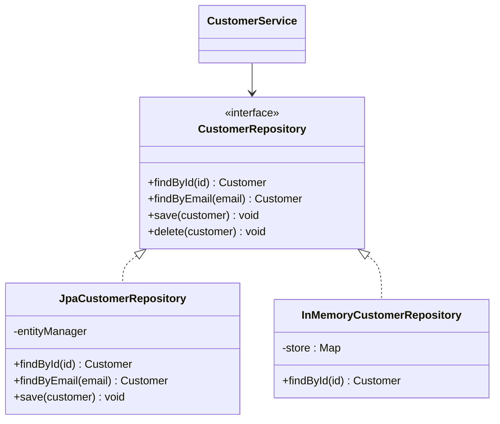

# Repository Pattern

**Date:** 2026-05-02 | **Updated:** 2026-05-02
**Tags:** `low-level-design` `design-patterns` `additional` `data-access` `ddd` `architecture`

## Summary

A Repository mediates between the domain and the data-mapping layer using a collection-like interface for accessing aggregate roots. The domain talks to repositories as if they were in-memory collections; the actual persistence (SQL, document store, gRPC, file system) is hidden behind the interface. The pattern was named in Evans's *Domain-Driven Design* and given its enterprise treatment in Fowler's *Patterns of Enterprise Application Architecture* (PoEAA).

## Intent

- Decouple domain logic from persistence technology.
- Express data access in domain language (`findActiveCustomersByRegion`) instead of SQL fragments.
- Provide a substitution seam for tests (in-memory repository for fast unit tests).
- Centralize query logic for an aggregate so it does not leak across services.

## Structure



## Java Example

```java
// Domain — pure POJO, no JPA annotations leaking up
public final class Customer {
    private final CustomerId id;
    private final Email email;
    private final Status status;
    // constructor + getters + domain methods (deactivate, etc.)
}

public interface CustomerRepository {
    Optional<Customer> findById(CustomerId id);
    Optional<Customer> findByEmail(Email email);
    List<Customer> findActiveInRegion(Region region);
    void save(Customer customer);
    void delete(Customer customer);
}

// JPA-backed implementation (infrastructure layer)
@Repository
public class JpaCustomerRepository implements CustomerRepository {
    private final EntityManager em;

    public JpaCustomerRepository(EntityManager em) { this.em = em; }

    @Override
    public Optional<Customer> findById(CustomerId id) {
        var entity = em.find(CustomerEntity.class, id.value());
        return Optional.ofNullable(entity).map(CustomerMapper::toDomain);
    }

    @Override
    public List<Customer> findActiveInRegion(Region region) {
        return em.createQuery(
                "select c from CustomerEntity c " +
                "where c.status = :status and c.region = :region",
                CustomerEntity.class)
            .setParameter("status", "ACTIVE")
            .setParameter("region", region.code())
            .getResultStream()
            .map(CustomerMapper::toDomain)
            .toList();
    }

    @Override
    public void save(Customer customer) {
        em.merge(CustomerMapper.toEntity(customer));
    }

    @Override
    public void delete(Customer customer) {
        em.remove(em.getReference(CustomerEntity.class, customer.id().value()));
    }
}

// Test double
public class InMemoryCustomerRepository implements CustomerRepository {
    private final Map<CustomerId, Customer> store = new ConcurrentHashMap<>();
    public Optional<Customer> findById(CustomerId id) { return Optional.ofNullable(store.get(id)); }
    public void save(Customer c) { store.put(c.id(), c); }
    // ...
}
```

## TypeScript Example

```ts
// Domain
export type Customer = {
  readonly id: string;
  readonly email: string;
  readonly status: "active" | "suspended";
};

// Port
export interface CustomerRepository {
  findById(id: string): Promise<Customer | null>;
  findByEmail(email: string): Promise<Customer | null>;
  save(customer: Customer): Promise<void>;
  delete(id: string): Promise<void>;
}

// Postgres adapter
export class PgCustomerRepository implements CustomerRepository {
  constructor(private readonly pool: Pool) {}

  async findById(id: string): Promise<Customer | null> {
    const { rows } = await this.pool.query(
      "select id, email, status from customers where id = $1",
      [id],
    );
    return rows[0] ?? null;
  }

  async save(c: Customer): Promise<void> {
    await this.pool.query(
      `insert into customers (id, email, status)
       values ($1, $2, $3)
       on conflict (id) do update set email = $2, status = $3`,
      [c.id, c.email, c.status],
    );
  }
  // ...
}

// In-memory test double
export class InMemoryCustomerRepository implements CustomerRepository {
  private readonly store = new Map<string, Customer>();
  async findById(id: string) { return this.store.get(id) ?? null; }
  async save(c: Customer)    { this.store.set(c.id, c); }
  // ...
}
```

## Repository vs Data Access Object (DAO)

| Aspect | Repository | DAO |
|---|---|---|
| Conceptual model | Collection of aggregates | Table-row CRUD |
| Vocabulary | Domain language | Persistence language |
| Granularity | Aggregate root | Per-table |
| Origin | DDD (Evans) | J2EE Core Patterns |

Both are valid; Repository implies a domain bias.

## When It Pays Off vs ORM-Direct

Use a Repository abstraction when:

- The domain model is rich and you do not want JPA/Prisma annotations leaking through every layer.
- You expect to swap or supplement the data store (SQL → search index, write store → read replica).
- You need fast, isolated unit tests without spinning up a database.
- Multiple services issue the same complex query — centralize it.
- You are practicing DDD with explicit aggregate boundaries.

Skip the abstraction (use Spring Data / Prisma / TypeORM directly) when:

- The app is a thin CRUD over the database — the repo is just a forwarder.
- The team is small, the schema is stable, and integration tests against a real database are cheap.
- You would end up reimplementing the ORM's query API one method at a time.

> Spring Data's `JpaRepository<T, ID>` is itself an implementation of this pattern; you usually do not need a second hand-rolled layer on top unless you want to hide JPA from the domain.

## Pitfalls

- **Leaky abstraction**: returning `Page<Entity>` or JPA `Specification` from the interface puts the persistence model in the domain.
- **Generic super-repository**: `Repository<T, ID>` with `findAll`, `findByExample`, etc. erodes domain meaning.
- **N+1 queries**: a method that loads aggregates in a loop kills performance — push joins/fetches into the query.
- **Cross-aggregate queries**: a Repository should serve one aggregate root. Reporting queries belong in a separate read model (CQRS).
- **Misused as service layer**: business rules belong in the domain or application service, not in the repository.
- **Transaction scope**: who opens/commits the transaction? Usually the application service, not the repository.

## Real-World Examples

- Spring Data JPA `CrudRepository` / `JpaRepository`.
- .NET `IRepository<T>` in many DDD codebases; EF Core `DbSet<T>` plays a similar role.
- Ruby on Rails ActiveRecord — Active Record pattern (PoEAA) blurs domain and repo into the entity itself.
- Python — SQLAlchemy `Session` plus hand-rolled `*Repository` classes in DDD apps.
- Hexagonal/Clean Architecture codebases use Repository as the "port" and concrete DB code as the "adapter."

## Related

- [../creational/factory-method.md](../creational/factory-method.md) — repositories often build aggregates via factories.
- [../structural/adapter.md](../structural/adapter.md) — the concrete repository adapts a driver to the port.
- [./specification-pattern.md](./specification-pattern.md) — composable queries plug into repositories cleanly.
- [./mvc-pattern.md](./mvc-pattern.md) — repository sits behind the model in layered MVC.
- [../../solid/dependency-inversion-principle.md](../../solid/dependency-inversion-principle.md) — services depend on the repository interface, not the JPA/Prisma class.
- [../../../database/INDEX.md](../../../database/INDEX.md) — for the persistence side of the conversation.

## References

- Evans, *Domain-Driven Design* — chapter on Repositories.
- Fowler, *Patterns of Enterprise Application Architecture* (PoEAA) — Repository, Data Mapper, Active Record.
- Vernon, *Implementing Domain-Driven Design* — practical repository design.
