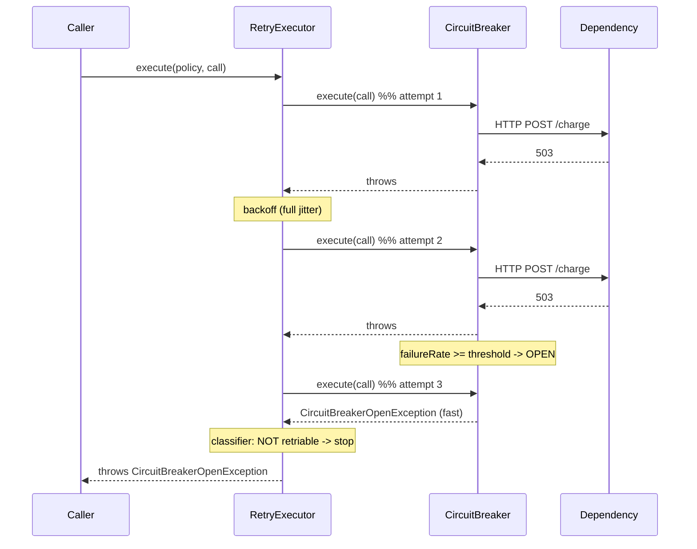

# Retry with Backoff Pattern

**Date:** 2026-05-02 | **Updated:** 2026-05-02
**Tags:** `low-level-design` `design-patterns` `additional` `resilience` `retry`

## Summary

Transient failures — a TCP reset, a one-off `503`, a momentary lock contention — are best handled by trying again after a delay. The naive form (sleep a fixed duration) becomes a thundering herd; the better form spaces retries with **exponential backoff** and adds **jitter** so that many clients failing at the same instant don't all retry at the same instant either.

This document is the LLD-scale view: a `RetryPolicy` interface, an `ExponentialBackoffPolicy` with jitter modes, and a `RetryExecutor` that composes cleanly with a [Circuit Breaker](./circuit-breaker-pattern.md). The jitter modes — **full jitter**, **equal jitter**, **decorrelated jitter** — and the reasoning behind them come from the **AWS Architecture Blog** post **"Exponential Backoff and Jitter"** (Marc Brooker). Read the original; the formulas below match it.

## Table of Contents

- [Intent / Structure](#intent--structure)
- [Backoff Strategies](#backoff-strategies)
- [When NOT to Retry](#when-not-to-retry)
- [Idempotency](#idempotency)
- [Code (Java)](#code-java)
- [Combining with Circuit Breaker](#combining-with-circuit-breaker)
- [When to Use / Not](#when-to-use--not)
- [Pitfalls](#pitfalls)
- [Related](#related)
- [References](#references)

## Intent / Structure

Wrap a `Supplier<T>` so that on a **retriable** failure the executor sleeps for a delay computed by a `RetryPolicy`, then tries again, up to a max attempt count. The policy decides:

1. Whether the exception is retriable (classifier).
2. How long to wait before attempt `n` (delay function).
3. When to give up (max attempts, max elapsed time).

Components:

- **RetryPolicy** — strategy interface.
- **ExponentialBackoffPolicy** — concrete implementation with jitter mode.
- **RetryExecutor** — orchestrates attempts, sleeps, classifies exceptions, and surfaces the final failure.
- **RetryContext** — per-call state (attempt number, first attempt time, last exception).

## Backoff Strategies

Notation: `base` = base delay (e.g., 100ms), `cap` = max single delay (e.g., 30s), `n` = attempt number starting at 0, `random(a, b)` = uniform real in `[a, b)`.

| Strategy | Delay for attempt `n` | Notes |
|---|---|---|
| Fixed | `base` | Worst behavior under contention. |
| Linear | `base * (n + 1)` | Marginally better than fixed. |
| Exponential, no jitter | `min(cap, base * 2^n)` | Spaces out, but synchronized clients still collide. |
| **Full jitter** | `random(0, min(cap, base * 2^n))` | Best decorrelation; can be very short. |
| **Equal jitter** | `temp/2 + random(0, temp/2)` where `temp = min(cap, base * 2^n)` | Half guaranteed wait, half random. |
| **Decorrelated jitter** | `min(cap, random(base, prev * 3))` (use `base` for first attempt) | Stateful; uses the previous delay. |

The AWS post benchmarks these against synchronized clients hammering a shared service. **Full jitter** typically wins on completion time and total work; equal and decorrelated are close. The takeaway: any jitter beats no jitter.

## When NOT to Retry

Do not retry when the failure is a **client error** that will fail identically on the next attempt:

- **`4xx` HTTP status codes** other than `408 Request Timeout`, `425 Too Early`, and `429 Too Many Requests`. (`429` is retriable but should respect `Retry-After`.) `400 Bad Request`, `401 Unauthorized`, `403 Forbidden`, `404 Not Found`, `409 Conflict`, `422 Unprocessable Entity` — none of these get better by being repeated.
- **Validation errors** thrown by the local code path.
- **Programming errors** — `NullPointerException`, `IllegalArgumentException`, `IllegalStateException` (usually).
- **Authentication failures** — fix credentials or re-fetch a token; do not loop.
- **Non-idempotent operations without an idempotency key** — see below.

Retry on:

- Connection refused / connection reset.
- Read timeout / socket timeout.
- `5xx` (especially `502`, `503`, `504`).
- `429` with backoff respecting `Retry-After`.
- Server-side advisory locks / serialization failures (`40001` in PostgreSQL).

## Idempotency

A retry can produce duplicates if the request actually succeeded but the response was lost. Two defenses:

1. **Idempotent operations by design** — `PUT` of a full resource, `DELETE`, conditional operations with `If-Match`. Repeated calls converge to the same state.
2. **Idempotency key** — for operations that aren't naturally idempotent (`POST /payments`), the client generates a key (UUID) and sends it as a header (`Idempotency-Key`) or body field. The server stores `(key, result)` for some retention window; a repeated request with the same key returns the stored result instead of re-executing. Stripe's API is the canonical reference for this pattern.

Without one of those, retrying a `POST` is a bug.

## Code (Java)

```java
public interface RetryPolicy {
    boolean shouldRetry(RetryContext ctx);
    Duration nextDelay(RetryContext ctx);
}

public final class RetryContext {
    private final Instant start;
    private int attempt;                  // 0 for first call
    private Throwable lastException;
    private Duration lastDelay = Duration.ZERO;

    public RetryContext(Clock clock) { this.start = clock.instant(); }

    public int attempt() { return attempt; }
    public Throwable lastException() { return lastException; }
    public Duration lastDelay() { return lastDelay; }
    public Instant start() { return start; }

    void recordFailure(Throwable t) { this.lastException = t; this.attempt++; }
    void recordDelay(Duration d) { this.lastDelay = d; }
}
```

```java
public final class ExponentialBackoffPolicy implements RetryPolicy {

    public enum JitterMode { NONE, FULL, EQUAL, DECORRELATED }

    private final int    maxAttempts;
    private final Duration base;
    private final Duration cap;
    private final JitterMode jitter;
    private final Predicate<Throwable> retriable;
    private final Random rng;

    public ExponentialBackoffPolicy(int maxAttempts, Duration base, Duration cap,
                                    JitterMode jitter, Predicate<Throwable> retriable) {
        this.maxAttempts = maxAttempts;
        this.base = base;
        this.cap = cap;
        this.jitter = jitter;
        this.retriable = retriable;
        this.rng = new Random();
    }

    @Override
    public boolean shouldRetry(RetryContext ctx) {
        if (ctx.attempt() >= maxAttempts) return false;
        return retriable.test(ctx.lastException());
    }

    @Override
    public Duration nextDelay(RetryContext ctx) {
        long baseMs = base.toMillis();
        long capMs  = cap.toMillis();
        long temp   = Math.min(capMs, baseMs * (1L << Math.min(ctx.attempt(), 30)));
        long delay;
        switch (jitter) {
            case NONE         -> delay = temp;
            case FULL         -> delay = (long) (rng.nextDouble() * temp);
            case EQUAL        -> delay = temp / 2 + (long) (rng.nextDouble() * (temp / 2));
            case DECORRELATED -> {
                long prev = Math.max(baseMs, ctx.lastDelay().toMillis());
                long upper = Math.min(capMs, prev * 3);
                delay = baseMs + (long) (rng.nextDouble() * (upper - baseMs));
            }
            default -> throw new IllegalStateException();
        }
        return Duration.ofMillis(delay);
    }
}
```

```java
public final class RetryExecutor {
    private final Clock clock;

    public RetryExecutor(Clock clock) { this.clock = clock; }

    public <T> T execute(RetryPolicy policy, Supplier<T> call) throws InterruptedException {
        RetryContext ctx = new RetryContext(clock);
        while (true) {
            try {
                return call.get();
            } catch (RuntimeException e) {
                ctx.recordFailure(e);
                if (!policy.shouldRetry(ctx)) throw e;
                Duration d = policy.nextDelay(ctx);
                ctx.recordDelay(d);
                Thread.sleep(d.toMillis());
            }
        }
    }
}
```

Wiring it together:

```java
Predicate<Throwable> retriable = t ->
        t instanceof IOException
        || t instanceof TimeoutException
        || (t instanceof HttpStatusException hse && hse.status() >= 500);

ExponentialBackoffPolicy policy = new ExponentialBackoffPolicy(
        4,                                      // maxAttempts
        Duration.ofMillis(100),                 // base
        Duration.ofSeconds(30),                 // cap
        ExponentialBackoffPolicy.JitterMode.FULL,
        retriable);

RetryExecutor exec = new RetryExecutor(Clock.systemUTC());
PaymentResult r = exec.execute(policy, () -> client.charge(req));
```

In production prefer **resilience4j**'s `Retry` module — it gives you the same surface plus event listeners, async support, and metrics.

## Combining with Circuit Breaker

Decorate as **Retry around CircuitBreaker around the call**. The breaker fast-fails when open; the retry sees that failure and — because `CircuitBreakerOpenException` is **not** retriable — gives up immediately rather than spinning.

```java
CircuitBreaker cb = ...;
RetryExecutor  retry = ...;

Predicate<Throwable> retriable = t ->
        !(t instanceof CircuitBreaker.CircuitBreakerOpenException)
        && (t instanceof IOException || t instanceof TimeoutException);

PaymentResult r = retry.execute(policy,
        () -> cb.execute(() -> client.charge(req)));
```



## When to Use / Not

**Use** when:

- The dependency genuinely has transient failures (network, contention, brief overload).
- The operation is idempotent or carries an idempotency key.
- You can bound total elapsed time (caller has a budget).

**Avoid** when:

- Failures are deterministic client errors.
- The operation has side effects you cannot deduplicate.
- You're inside a synchronous request that already has a tight latency SLA — your retries will blow the SLA, and the user will refresh anyway.

## Pitfalls

- **Retry storms.** Many clients retry in lockstep after a shared failure. **Use jitter.** "Exponential Backoff and Jitter" exists for exactly this reason.
- **Layered retries.** Retries at the SDK layer + retries at the HTTP client + retries at the application layer multiply. A 3 × 3 × 3 stack means 27 attempts for one failed call. Pick one layer.
- **Retrying non-idempotent calls.** Without an idempotency key you risk duplicate side effects. See [Idempotency](#idempotency).
- **Ignoring `Retry-After`.** `429` and some `503` responses include a `Retry-After` header (seconds or HTTP date). Honor it; do not just back off your own way.
- **Unbounded total time.** `maxAttempts` alone is not enough — also enforce a `maxElapsed` budget, especially when delays cap at large values.
- **Sleeping in event-loop threads.** Blocking sleep inside a Netty handler stalls every other connection on that loop. Use the framework's async retry primitive instead.
- **Retrying through an open breaker.** Treat the breaker's open exception as non-retriable in your classifier (see the example above).

## Related

- [circuit-breaker-pattern.md](./circuit-breaker-pattern.md) — composed with retry; classify its open exception as non-retriable.
- [concurrency-patterns.md](./concurrency-patterns.md) — Active Object queues are often the right fallback when retries fail.
- [thread-pool-pattern.md](./thread-pool-pattern.md) — bound where retries run; avoid blocking the calling thread.
- [producer-consumer-pattern.md](./producer-consumer-pattern.md) — durable retry: enqueue and let a worker keep trying.
- [../behavioral/state.md](../behavioral/state.md) — the retry context is a small state machine over attempts.

## References

- Brooker, Marc. "Exponential Backoff and Jitter." AWS Architecture Blog.
- Nygard, Michael. *Release It! Design and Deploy Production-Ready Software*. Pragmatic Bookshelf.
- resilience4j project documentation (Retry module).
- Stripe API documentation — idempotency keys.
- IETF RFC 9110 — HTTP Semantics (status codes; `Retry-After`).
