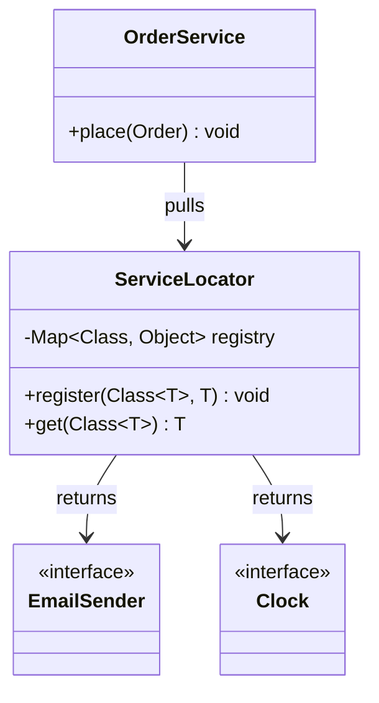
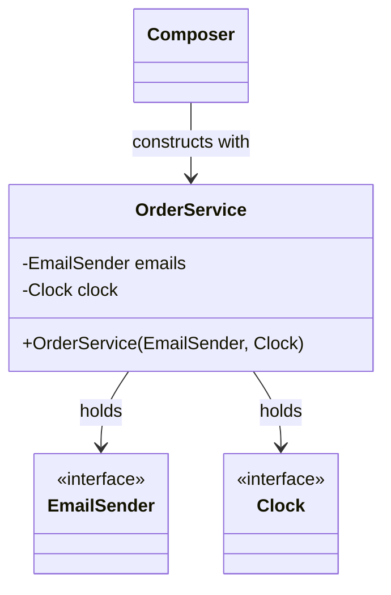

# Service Locator (Anti-Pattern Foil to DI)

**Date:** 2026-05-02 | **Updated:** 2026-05-02
**Tags:** `low-level-design` `design-patterns` `additional` `dependency-injection` `anti-pattern`

## Summary

The Service Locator pattern centralises access to dependencies behind a registry: components ask the locator for an implementation by key (a type, an interface, or a name) and receive back a reference at runtime. Compared to constructor Dependency Injection, which delivers collaborators *to* the component, Service Locator inverts the flow — the component reaches *out* to fetch what it needs.

Service Locator is real, named, and once mainstream. It is also, in modern OO design, widely treated as an anti-pattern. The argument, made most forcefully by Mark Seemann in *Dependency Injection in .NET*, is that Service Locator hides dependencies inside method bodies, defeats compile-time guarantees, and makes testing harder than constructor injection without offering a meaningful benefit in return.

This document covers the pattern honestly: what it is, how it differs from DI, why it is criticised, and the narrow situations where it remains a legitimate choice.

## Table of Contents

- Intent / Problem
- Structure (Mermaid classDiagram)
- Class Skeletons (Java)
- Service Locator vs Dependency Injection (side by side)
- Why It Is Considered an Anti-Pattern
- When It Is Still a Reasonable Choice
- Pitfalls
- Related
- References

## Intent / Problem

A growing application has dozens of services — a clock, a database session, a feature-flag client, a metrics emitter, a mailer — and most components need a few of them. The naive answer is to hard-code constructors:

```java
public final class OrderService {
    private final EmailSender emails = new SmtpEmailSender("smtp.example.com");
    private final Clock clock = Clock.systemUTC();
}
```

That binds `OrderService` to concrete implementations forever, breaks tests that want fakes, and prevents configuration changes. A better answer is to *not let the component pick* — but to deliver the dependencies in some controlled way.

Service Locator and Dependency Injection both solve this, with opposite directions of control:

- **Dependency Injection**: the component declares its dependencies (constructor parameters), and an external composer wires them in. The component is passive.
- **Service Locator**: the component knows about the locator, and pulls dependencies from it on demand. The component is active.

The intent is the same — decouple from concrete construction. The mechanism is what is debated.

## Structure (Mermaid classDiagram)



Compare with constructor DI:



In DI, `OrderService` declares its needs in its signature. In Service Locator, the needs are invisible from the outside.

## Class Skeletons (Java)

### Minimal Service Locator

```java
public final class ServiceLocator {
    private static final Map<Class<?>, Object> REGISTRY = new ConcurrentHashMap<>();

    private ServiceLocator() {}

    public static <T> void register(Class<T> type, T instance) {
        Objects.requireNonNull(type);
        Objects.requireNonNull(instance);
        REGISTRY.put(type, instance);
    }

    @SuppressWarnings("unchecked")
    public static <T> T get(Class<T> type) {
        Object instance = REGISTRY.get(type);
        if (instance == null) {
            throw new IllegalStateException(
                "No service registered for " + type.getName());
        }
        return (T) instance;
    }

    public static void reset() {
        REGISTRY.clear();
    }
}
```

### Consumer using the locator

```java
public final class OrderService {
    public void place(Order order) {
        Clock clock = ServiceLocator.get(Clock.class);
        EmailSender mailer = ServiceLocator.get(EmailSender.class);
        order.markPlacedAt(clock.instant());
        mailer.send(order.confirmationEmail());
    }
}
```

### Wiring at startup

```java
public final class Bootstrap {
    public static void main(String[] args) {
        ServiceLocator.register(Clock.class, Clock.systemUTC());
        ServiceLocator.register(EmailSender.class,
            new SmtpEmailSender("smtp.example.com"));
        new HttpServer(new OrderService()).start();
    }
}
```

The same `OrderService`, written with constructor DI:

```java
public final class OrderService {
    private final Clock clock;
    private final EmailSender mailer;

    public OrderService(Clock clock, EmailSender mailer) {
        this.clock = clock;
        this.mailer = mailer;
    }

    public void place(Order order) {
        order.markPlacedAt(clock.instant());
        mailer.send(order.confirmationEmail());
    }
}
```

The two versions do the same work. The shape of the seam is what differs.

## Service Locator vs Dependency Injection (side by side)

| Aspect                       | Service Locator                                    | Constructor Dependency Injection                     |
|------------------------------|----------------------------------------------------|------------------------------------------------------|
| Direction of control         | Component pulls from the locator                   | Composer pushes into the component                   |
| Where dependencies live      | Hidden inside method bodies                        | Visible in the public constructor signature          |
| Compile-time safety          | Missing service -> runtime exception               | Missing service -> compile-time error                |
| Testability                  | Must register fakes globally before each test     | Pass fakes directly to the constructor               |
| Coupling                     | Coupled to the locator API                         | Coupled only to declared collaborators               |
| API surface                  | Easy to add new dependencies silently              | Adding a dependency forces a constructor change      |
| Fits frameworks              | Sometimes used internally by DI containers         | The dominant pattern in modern OO frameworks         |
| Migration cost from each other | Hard: hidden uses are scattered                  | Easier: all wiring is in one place                   |

The same goal, opposite ergonomics. Seemann's argument is not that Service Locator does not work — clearly it can — but that DI's ergonomics dominate it on every axis that matters in production code.

## Why It Is Considered an Anti-Pattern

Three core arguments, drawn from Mark Seemann's *Dependency Injection in .NET* and reinforced by the broader DI literature:

**1. Hidden dependencies.** A class's public surface should tell you what it needs. With constructor DI, the constructor *is* the contract: this class needs a `Clock` and an `EmailSender`. With Service Locator, you cannot tell from `OrderService`'s signature what it depends on; you must read every method body. Refactoring becomes archaeology.

**2. Runtime failure instead of compile-time failure.** Forget to register `EmailSender` at startup, and the application starts cleanly, accepts traffic, and fails inside the first call to `place()`. Constructor DI catches the same mistake at build/wiring time, often before the binary is produced. Pushing failures from compile-time to runtime is a regression in safety, especially in statically typed languages.

**3. Test friction.** With constructor DI, a unit test passes mocks directly: `new OrderService(fakeClock, fakeMailer)`. With Service Locator, every test must register fakes into a global registry *and* reset it afterwards (or share state across tests, leading to order-dependent suites). Test isolation gets weaker, and the "arrange" half of every test grows.

A subtler argument: Service Locator is a *form of global state*, and global state defeats the gains of OO modularity. Two unrelated components both reaching into the locator are quietly coupled by what the locator returns at the moment they ran.

Martin Fowler, in his *Inversion of Control Containers and the Dependency Injection pattern* article, treats Service Locator as a legitimate sibling of DI. Seemann's later, stronger position is that in well-resourced modern codebases with DI containers available, Service Locator's costs outweigh its convenience.

## When It Is Still a Reasonable Choice

The pattern is not banned. It survives in real codebases for reasons that hold up:

**Inside a DI container's own implementation.** Every DI container resolves dependencies through some kind of registry — that registry, internally, is a service locator. The anti-pattern critique is about user code reaching into the locator, not about the container that runs underneath.

**Plugin frameworks and extension points.** When the host does not know at compile time what plugins exist, and plugins do not know about each other, a locator-style registry (e.g. `ServiceLoader` in Java, MEF in .NET, Eclipse extension points) is a clean fit. The trade-off is accepted because the alternative — forcing host and plugins to know each other's constructors — is impossible.

**Legacy code without a DI container.** Retrofitting constructor DI across a large legacy codebase can be a six-month project. A Service Locator is a pragmatic intermediate step: it pulls dependencies out of `new` expressions and centralises them, even if it does not fix the deeper visibility problem. Treat it as a stop on the path, not a destination.

**Static contexts and frameworks that resist DI.** Some frameworks (older servlet APIs, certain game engines, CLI entry points) instantiate your classes themselves and do not let you choose constructors. A locator gives those classes a way to find their collaborators. Even here, prefer field injection or method injection if the framework supports it before reaching for a locator.

**Cross-cutting access to a small set of "ambient" services.** A clock, a logger, a feature flag client. Some teams treat these as ambient and pull them via a locator-like static rather than threading them through every constructor. This is a contested style choice rather than a clear anti-pattern.

The decision rule: if you can use constructor DI, use it. Reach for Service Locator only when the constraint forcing it is real and named.

## Pitfalls

**Locator-as-bag-of-globals.** The locator becomes a dumping ground for "any service anyone might want". Each new addition further weakens the visibility of dependencies. Cap what the locator holds; reject ad-hoc additions.

**Test pollution.** Tests register fakes, forget to reset, and the next test in the suite gets the previous test's fake. Always reset the locator in a `@BeforeEach` (or its language equivalent), or scope locators per test.

**Type erasure surprises (Java).** Generic services keyed by `Class<List<String>>` collide with `Class<List<Integer>>`. Either avoid generic keys or use a richer key type (`TypeReference`, `ParameterizedType`).

**Lazy registration.** Code that registers services on-the-fly during request handling produces order-dependent behaviour. Register everything at startup; treat the locator as immutable afterwards.

**Mixing DI and Service Locator in one class.** A class that takes some collaborators via constructor and pulls others from the locator combines the worst of both: hidden dependencies *and* visible ones, double the wiring code, double the test setup. Pick one.

**Service Locator as a way to "avoid" DI.** Teams sometimes adopt a locator because they fear the perceived complexity of a DI container. Modern containers (Spring, Dagger, Guice, Microsoft.Extensions.DependencyInjection) are simpler and more powerful than a hand-rolled locator. If the reason for the locator is "we did not want to learn a DI framework", reconsider.

**Treating it as universally evil.** The strongest critiques are about user-code adoption in greenfield OO projects with DI available. In plugin systems and certain framework-internal contexts, the pattern is fine. Read the room.

## Related

Siblings under `additional/`:

- [dependency-injection-pattern.md](./dependency-injection-pattern.md) — The pattern Service Locator is most often compared to; opposite direction of control, same goal.
- [repository-pattern.md](./repository-pattern.md) — A repository is often *injected*, not located; contrast the wiring style.
- [specification-pattern.md](./specification-pattern.md) — Specifications, like services, are typically supplied via DI rather than fetched from a global locator.
- [null-object-pattern.md](./null-object-pattern.md) — A registry that returns a Null Object instead of throwing when nothing is registered is one way to soften Service Locator's runtime-failure cost.
- [plugin-architecture.md](./plugin-architecture.md) — The legitimate sibling: plugin registries are locator-shaped by necessity.
- [event-bus.md](./event-bus.md) — Event buses are sometimes implemented on top of a locator-style registry.

Cross-category:

- [../creational/singleton.md](../creational/singleton.md) — Service Locator is, structurally, a Singleton-shaped registry; the same critiques about global state apply.
- [../creational/factory-method.md](../creational/factory-method.md) — Factory methods centralise *construction*; Service Locator centralises *access*. Different stage of the lifecycle.
- [../creational/abstract-factory.md](../creational/abstract-factory.md) — Abstract Factory injected via constructor DI is the modern replacement for many Service Locator use cases.
- [../structural/proxy.md](../structural/proxy.md) — Some locators hand back proxies that defer resolution further.

Principles:

- [../../solid/dependency-inversion-principle.md](../../solid/dependency-inversion-principle.md) — DIP is satisfied by *both* DI and Service Locator at the high-level/low-level seam, but DI satisfies it without sacrificing visibility.
- [../../solid/single-responsibility-principle.md](../../solid/single-responsibility-principle.md) — A class that locates *and* uses its services is doing two jobs.
- [../../solid/dependency-inversion-principle.md](../../solid/dependency-inversion-principle.md) — The principle that most directly indicts Service Locator: dependencies should be visible in the public API.
- [../../oop-fundamentals/encapsulation.md](../../oop-fundamentals/encapsulation.md) — Hiding *behaviour* is good; hiding *needed collaborators* is the failure mode the anti-pattern label is about.

## References

- Mark Seemann, *Dependency Injection in .NET* (and the second edition, *Dependency Injection Principles, Practices, and Patterns*) — the canonical case against Service Locator as a default choice. Read for the "Service Locator is an Anti-Pattern" chapter.
- Martin Fowler, *Inversion of Control Containers and the Dependency Injection pattern* — the article that named both patterns and treated them as siblings.
- *Patterns of Enterprise Application Architecture* (Martin Fowler) — earlier treatment of Service Locator as a legitimate pattern in the J2EE-era context where it originated.
- Java `ServiceLoader` (JDK) — a locator-shaped API used legitimately for plugin/SPI discovery.
- Spring Framework documentation — modern DI containers; the locator-shaped `ApplicationContext.getBean()` is available but explicitly discouraged for application code.
- Microsoft `Microsoft.Extensions.DependencyInjection` — .NET's first-party DI primitives, the modern alternative to hand-rolled locators in C# code.
