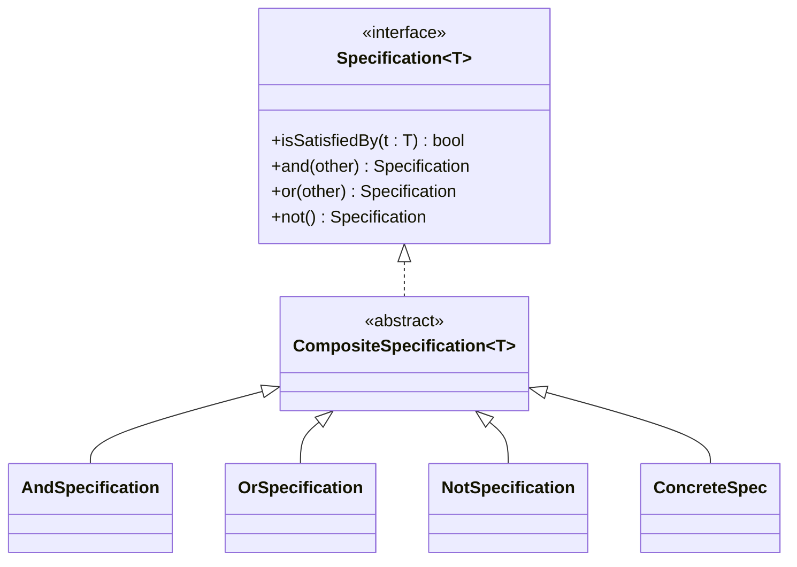

# Specification Pattern

**Date:** 2026-05-02 | **Updated:** 2026-05-02
**Tags:** `low-level-design` `design-patterns` `additional` `ddd` `data-access`

## Summary

A Specification is a small, named predicate object that answers `isSatisfiedBy(candidate) -> bool`. Specifications compose with `and`, `or`, `not`, producing a small algebra for business rules and query criteria. The pattern was introduced by Eric Evans and Martin Fowler in *Specifications* (2003) as a way to keep selection logic in the domain rather than buried in service methods or repository signatures.

## Intent

- Encapsulate a single business rule or selection criterion as a first-class object.
- Combine simple rules into complex ones via boolean composition.
- Reuse the same predicate for in-memory filtering, validation, and database queries.
- Replace methods like `findByActiveCustomersInRegionWithMinimumOrders(...)` with `repo.find(active.and(inRegion).and(hasOrders(min)))`.

## Structure



## Java Example — In-Memory Evaluator

```java
public interface Specification<T> {
    boolean isSatisfiedBy(T candidate);

    default Specification<T> and(Specification<T> other) {
        return c -> this.isSatisfiedBy(c) && other.isSatisfiedBy(c);
    }
    default Specification<T> or(Specification<T> other) {
        return c -> this.isSatisfiedBy(c) || other.isSatisfiedBy(c);
    }
    default Specification<T> not() {
        return c -> !this.isSatisfiedBy(c);
    }
}

// Domain
public record Customer(String id, String region, int orderCount, Status status) {}

// Concrete specs — small, named, single-purpose
public final class ActiveCustomer implements Specification<Customer> {
    @Override public boolean isSatisfiedBy(Customer c) { return c.status() == Status.ACTIVE; }
}

public record InRegion(String region) implements Specification<Customer> {
    @Override public boolean isSatisfiedBy(Customer c) { return region.equals(c.region()); }
}

public record HasMinOrders(int min) implements Specification<Customer> {
    @Override public boolean isSatisfiedBy(Customer c) { return c.orderCount() >= min; }
}

// Composition reads like the rule
Specification<Customer> highValueEU =
    new ActiveCustomer()
        .and(new InRegion("EU"))
        .and(new HasMinOrders(10));

List<Customer> matches = customers.stream()
    .filter(highValueEU::isSatisfiedBy)
    .toList();
```

## TypeScript Example

```ts
export interface Specification<T> {
  isSatisfiedBy(t: T): boolean;
}

abstract class Composable<T> implements Specification<T> {
  abstract isSatisfiedBy(t: T): boolean;
  and(other: Specification<T>): Specification<T> { return new And(this, other); }
  or(other:  Specification<T>): Specification<T> { return new Or(this,  other); }
  not(): Specification<T>                         { return new Not(this); }
}

class And<T> extends Composable<T> {
  constructor(private a: Specification<T>, private b: Specification<T>) { super(); }
  isSatisfiedBy(t: T) { return this.a.isSatisfiedBy(t) && this.b.isSatisfiedBy(t); }
}
class Or<T>  extends Composable<T> { /* similar */ }
class Not<T> extends Composable<T> { /* similar */ }

// Concrete
class ActiveCustomer extends Composable<Customer> {
  isSatisfiedBy(c: Customer) { return c.status === "active"; }
}
class InRegion extends Composable<Customer> {
  constructor(private region: string) { super(); }
  isSatisfiedBy(c: Customer) { return c.region === this.region; }
}

const eligible = new ActiveCustomer().and(new InRegion("EU"));
customers.filter(c => eligible.isSatisfiedBy(c));
```

## Two Implementation Strategies

### 1. Evaluator (in-memory)

Each spec implements `isSatisfiedBy`. You filter loaded collections:

```java
list.stream().filter(spec::isSatisfiedBy).toList();
```

Pros: simple, technology-free, trivially testable.
Cons: must load everything into memory — does not scale to big tables.

### 2. Query Translator (database)

Each spec also produces a SQL fragment, JPA `Predicate`, or query DSL node:

```java
public interface JpaSpecification<T> extends Specification<T> {
    Predicate toPredicate(Root<T> root, CriteriaBuilder cb);
}

public final class InRegionSpec implements JpaSpecification<CustomerEntity> {
    private final String region;
    public InRegionSpec(String region) { this.region = region; }
    public Predicate toPredicate(Root<CustomerEntity> root, CriteriaBuilder cb) {
        return cb.equal(root.get("region"), region);
    }
    public boolean isSatisfiedBy(CustomerEntity c) { return region.equals(c.getRegion()); }
}
```

Spring Data JPA's `Specification<T>` is exactly this — a query-translator form of the pattern integrated with the repository. `repo.findAll(active.and(inRegion))` produces SQL.

Pros: pushes filtering to the database; one rule, two execution sites (DB filter + in-memory validation).
Cons: must keep both encodings in sync; not every predicate is expressible in SQL.

### Choosing

- Few-thousand rows already loaded → evaluator.
- Millions of rows in a database → query translator.
- Same rule used for both filtering and validation → both forms, share the predicate definition.

## Validation Use Case

Specifications also serve as validators:

```java
Specification<Order> canBePlaced =
    new HasItems()
        .and(new TotalAboveMinimum(BigDecimal.TEN))
        .and(new CustomerInGoodStanding());

if (!canBePlaced.isSatisfiedBy(order)) {
    throw new InvalidOrderException("...");
}
```

Compared to a god method `OrderValidator.validate(order)`, individual specs are easier to test, name, and recombine across use cases (place vs preview vs quote).

## When to Use

- Selection logic appears in multiple places (filtering, validation, authorization).
- Business rules are expressed in domain language and combine in non-trivial ways.
- You want testable, named units instead of long boolean expressions.
- Repository methods are multiplying (`findByXAndYAndZ` overload explosion).
- You need a way to *describe* a rule (audit log, UI builder) before evaluating it.

## When NOT to Use

- One-off filters in a single call site — `filter(c -> c.region.equals("EU"))` is fine.
- Trivial CRUD apps without real domain rules.
- Performance-critical paths where the indirection cost matters.
- Predicates that cannot be expressed without side effects (querying another aggregate, calling external APIs) — that is a service, not a spec.

## Pitfalls

- **Over-decomposition**: 30 single-line specs to express what a paragraph of plain code says.
- **Specification soup**: rules that are conceptually one thing split into too many pieces.
- **Hidden coupling**: spec uses a service, which uses another spec — the algebra leaks.
- **Sync drift between evaluator and translator**: same rule encoded twice, one updated, the other not. Mitigate with tests that run both forms over the same fixture.
- **N+1 with translators**: complex specs may produce poorly indexed SQL — measure.
- **Generic spec libraries**: writing a fluent `Spec.where("region").equals("EU")` reinvents the ORM badly. Prefer named domain specs.

## Real-World Examples

- Spring Data JPA's `org.springframework.data.jpa.domain.Specification`.
- Hibernate Criteria / JPA Criteria API — same idea without the name.
- LINQ in C# — `IQueryable<T>` predicates compose into SQL via expression trees.
- TypeORM, Prisma — query objects that compose with `AND`/`OR`.
- Authorization frameworks — Cancan/CanCanCan in Rails, CASL in JS — abilities-as-specs.
- Domain-rich codebases following DDD — pricing rules, eligibility checks, fraud signals.

## Related

- [../behavioral/strategy.md](../behavioral/strategy.md) — a Specification is a strategy whose return type is `bool`.
- [../structural/composite.md](../structural/composite.md) — the `and`/`or`/`not` tree is a composite.
- [./null-object-pattern.md](./null-object-pattern.md) — `AlwaysTrue` / `AlwaysFalse` specs are null objects of the algebra.
- [./repository-pattern.md](./repository-pattern.md) — the natural collaborator: `repo.find(spec)`.
- [../../solid/open-closed-principle.md](../../solid/open-closed-principle.md) — adding rules without modifying existing ones.

## References

- Evans & Fowler, *Specifications* (martinfowler.com, 2003).
- Evans, *Domain-Driven Design* — chapter on Specifications.
- *Implementing Domain-Driven Design* (Vernon).
