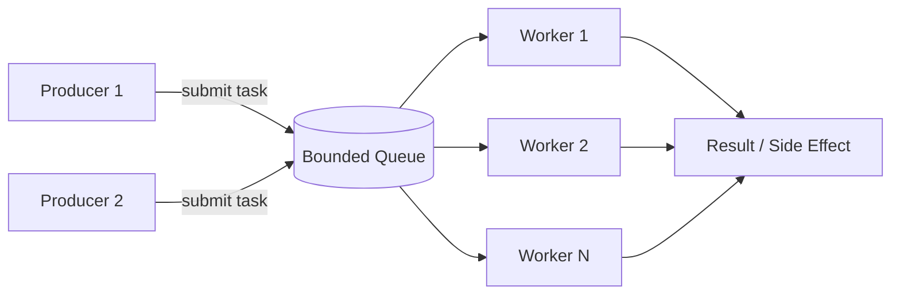
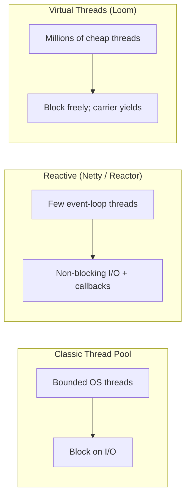

# Thread Pool Pattern

**Date:** 2026-05-02 | **Updated:** 2026-05-02
**Tags:** `low-level-design` `design-patterns` `additional` `concurrency` `performance`

## Summary

A Thread Pool is a bounded set of worker threads that pull tasks from a shared queue. It bounds memory and context-switching cost, reuses thread state, and lets you reason about throughput with Little's Law. The pattern dates back to mainframe job schedulers; modern Java exposes it through `java.util.concurrent.ExecutorService`. With Java 21 virtual threads (Project Loom), the role of fixed pools shifts but does not disappear.

## Intent

- Reuse a fixed number of threads to execute a stream of short tasks.
- Bound concurrency to protect downstream resources (DB, sockets, CPU).
- Decouple task submission from execution.
- Provide queueing, backpressure, and shutdown semantics in one component.

## Structure



Components:

- **Task queue** — typically a bounded `BlockingQueue<Runnable>`.
- **Worker threads** — long-lived, loop pulling and running tasks.
- **Rejection policy** — what happens when the queue is full.
- **Lifecycle** — graceful shutdown, drain, force-stop.

## Java — `ThreadPoolExecutor`

```java
import java.util.concurrent.*;

ExecutorService pool = new ThreadPoolExecutor(
    8,                                    // core threads
    16,                                   // max threads
    60L, TimeUnit.SECONDS,                // idle timeout
    new ArrayBlockingQueue<>(1_000),      // bounded queue
    new ThreadFactoryBuilder()
        .setNameFormat("io-worker-%d")
        .setDaemon(false)
        .build(),
    new ThreadPoolExecutor.CallerRunsPolicy()  // backpressure
);

Future<Result> f = pool.submit(() -> doIo(req));
Result r = f.get(2, TimeUnit.SECONDS);

// Graceful shutdown
pool.shutdown();
if (!pool.awaitTermination(30, TimeUnit.SECONDS)) {
    pool.shutdownNow();
}
```

### Rejection policies

| Policy | Behavior | Use when |
|---|---|---|
| `AbortPolicy` (default) | Throws `RejectedExecutionException` | Caller can fail fast |
| `CallerRunsPolicy` | Caller thread runs the task | Natural backpressure on producers |
| `DiscardPolicy` | Drops the task silently | Lossy telemetry |
| `DiscardOldestPolicy` | Drops the head of the queue | Newer is more valuable than older |

`CallerRunsPolicy` is the most-recommended for server work — it slows producers automatically.

## Sizing — Little's Law

Little's Law: `L = λ × W`

- `L` = average number of tasks in the system
- `λ` = arrival rate (tasks/sec)
- `W` = average time per task (sec)

For a thread pool, the rough sizing rule (Brian Goetz, *Java Concurrency in Practice*):

```
threads = cores × targetUtilization × (1 + waitTime / computeTime)
```

Examples:

| Workload | Wait/Compute | Suggested size (8 cores, 90% util) |
|---|---|---|
| CPU-bound | 0 | ≈ 8 |
| Mixed (DB + light parsing) | 1 | ≈ 14 |
| I/O-heavy (HTTP fan-out) | 9 | ≈ 72 |

For real numbers: profile, do not guess. Measure tail latency and queue depth, not just throughput.

## Work-Stealing Pools — `ForkJoinPool`

`ForkJoinPool` (also the default `parallelStream` / `CompletableFuture.supplyAsync` pool) gives each worker its own deque. Idle workers steal from the *tail* of busy workers' deques. Good for divide-and-conquer parallelism where subtasks spawn more subtasks.

```java
ForkJoinPool pool = new ForkJoinPool(8);
int sum = pool.invoke(new SumTask(array, 0, array.length));
```

Pros: scales for recursive workloads, balances load automatically.
Cons: not ideal for blocking I/O; one stuck worker hurts throughput. Use `ManagedBlocker` for legitimate blocking work.

## Thread Pools vs Reactive vs Virtual Threads (Java 21)



| Model | Best for | Cost |
|---|---|---|
| Fixed thread pool | CPU-bound, predictable load | OS thread per worker |
| Reactive | High-throughput I/O, many connections | Cognitive cost; backpressure complexity |
| Virtual threads | I/O-heavy concurrency with synchronous code | JVM-managed; carrier pinning concerns |

Java 21 virtual threads (`Executors.newVirtualThreadPerTaskExecutor()`) make the "thread per request" model viable for I/O-heavy services without giant pools. Fixed pools are still right for:

- CPU-bound work — virtual threads do not give you more cores.
- Bounding access to a scarce resource (DB connection pool, third-party API quota).
- Migration from existing code where blocking happens on `synchronized` blocks (carrier pinning).

> The decision becomes: *what am I trying to bound?* CPU → fixed pool sized to cores. Concurrency to a downstream → semaphore + virtual threads. Connection count to a service → connection pool, not thread pool.

## When to Use

- Bursty short-lived tasks (HTTP request handling pre-Loom, message processing).
- Limit concurrent access to a scarce resource (database, external API, file handles).
- CPU-bound parallelism on a known core count.
- Background jobs with predictable rate.

## When NOT to Use

- Single long-running streams — use a dedicated thread.
- Massively concurrent I/O on Java 21+ — prefer virtual threads.
- One-off scripts.
- When framework already provides one — use the framework's pool, do not bypass it.

## Pitfalls

- **Unbounded queues** (`Executors.newFixedThreadPool` uses `LinkedBlockingQueue` with `Integer.MAX_VALUE` capacity) — tasks accumulate, memory blows up, GC thrashes. Always cap.
- **Unbounded thread counts** (`newCachedThreadPool`) — under load, creates thousands of threads. Avoid in production.
- **Blocking inside `ForkJoinPool`** — locks up the common pool used by parallel streams.
- **No shutdown** — JVM cannot exit; tasks lost on crash. Always `shutdown()` and `awaitTermination()`.
- **Swallowed exceptions** — `submit(Runnable)` returns a `Future`; uncaught exceptions disappear unless you call `get()`. Wrap with `try/catch` and log.
- **Pinning under virtual threads** — `synchronized` blocks pin a virtual thread to its carrier. Prefer `ReentrantLock`.
- **ThreadLocal leaks** — pooled threads outlive requests; clear ThreadLocals or use `ScopedValue` (Java 21).
- **Deadlock by self-submission** — task A submits B and waits for it on the same single-thread pool.

## Real-World Examples

- Servlet containers (Tomcat, Jetty, Undertow) — request worker pools.
- `ForkJoinPool.commonPool()` — backs `parallelStream` and `CompletableFuture` defaults.
- Netty's `EventLoopGroup` — specialized I/O thread pool with affinity to channels.
- gRPC, Kafka clients — internal worker pools.
- Database connection pools (HikariCP) — analogous bounded resource pool, often the real bottleneck.
- Python `concurrent.futures.ThreadPoolExecutor`, .NET `ThreadPool`, Go runtime scheduler (G/M/P model is a pool of OS threads).

## Related

- [./producer-consumer-pattern.md](./producer-consumer-pattern.md) — the queue side of the same architecture.
- [./game-loop-pattern.md](./game-loop-pattern.md) — fixed-rate update step with worker pools for entity batches.
- [../behavioral/command.md](../behavioral/command.md) — tasks submitted to the pool are commands.
- [../creational/singleton.md](../creational/singleton.md) — pools are usually long-lived singletons.
- [../../solid/single-responsibility-principle.md](../../solid/single-responsibility-principle.md) — separate task definition from scheduling.

## References

- Goetz et al., *Java Concurrency in Practice* — definitive treatment of pools, sizing, and shutdown.
- *The Java Concurrency Tutorial* (docs.oracle.com).
- JEP 444: Virtual Threads (Java 21).
- Doug Lea's `java.util.concurrent` design notes.
