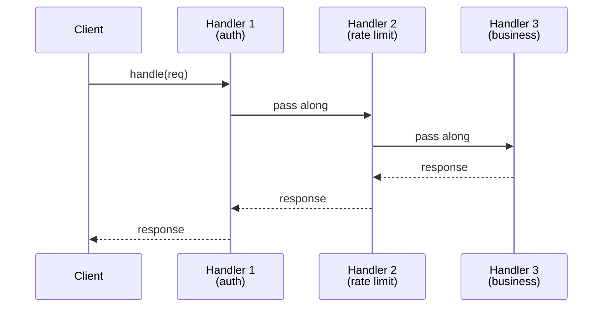
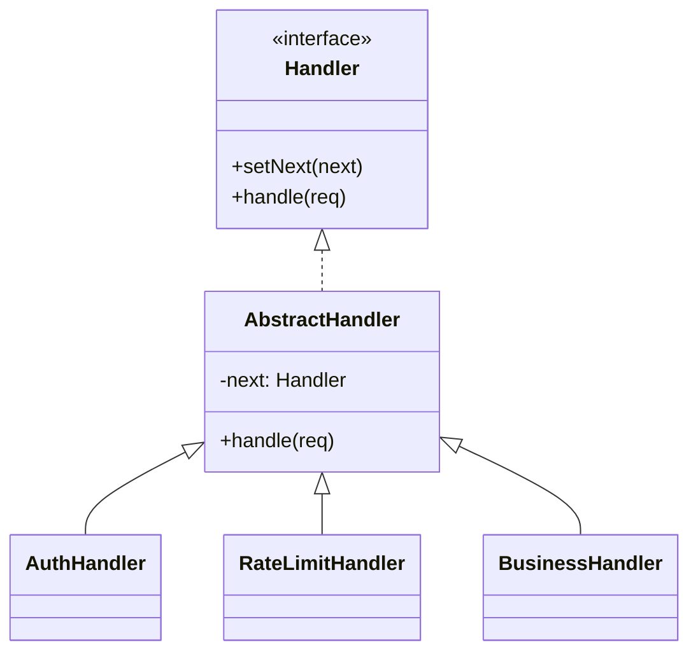

# Chain of Responsibility — Pass Request Down a Chain

**Date:** 2026-05-02 | **Updated:** 2026-05-02
**Tags:** `low-level-design` `design-patterns` `behavioral` `chain-of-responsibility` `middleware`

## Summary

Chain of Responsibility lets a request flow through a series of handlers, each deciding to handle it, transform it, pass it on, or short-circuit. The sender doesn't know which handler will deal with the request — middleware pipelines, servlet filters, Express middleware, and logging chains are all this pattern.

## Intent

> Avoid coupling the sender of a request to its receiver by giving more than one object a chance to handle the request. Chain the receiving objects and pass the request along the chain until an object handles it. (GoF)

## Structure





## Java Example

```java
public abstract class Handler {
    private Handler next;
    public Handler setNext(Handler next) { this.next = next; return next; }

    public final Response handle(Request req) {
        var local = process(req);
        if (local != null) return local;          // short-circuit
        if (next != null) return next.handle(req);
        return Response.notHandled();
    }

    protected abstract Response process(Request req);
}

public final class AuthHandler extends Handler {
    protected Response process(Request req) {
        if (!req.hasValidToken()) return Response.status(401);
        return null; // pass along
    }
}

public final class RateLimitHandler extends Handler {
    protected Response process(Request req) {
        if (rateLimiter.exceeded(req.userId())) return Response.status(429);
        return null;
    }
}

public final class BusinessHandler extends Handler {
    protected Response process(Request req) { return service.run(req); }
}

// Wire it up
var chain = new AuthHandler();
chain.setNext(new RateLimitHandler()).setNext(new BusinessHandler());
chain.handle(request);
```

## TypeScript Example — async middleware

```ts
type Next = () => Promise<void>;
type Middleware<C> = (ctx: C, next: Next) => Promise<void>;

export class Pipeline<C> {
  private mws: Middleware<C>[] = [];
  use(mw: Middleware<C>) { this.mws.push(mw); return this; }

  async run(ctx: C): Promise<void> {
    let i = -1;
    const dispatch = async (idx: number): Promise<void> => {
      if (idx <= i) throw new Error("next() called multiple times");
      i = idx;
      const mw = this.mws[idx];
      if (!mw) return;
      await mw(ctx, () => dispatch(idx + 1));
    };
    await dispatch(0);
  }
}

// Usage
const pipe = new Pipeline<Ctx>();
pipe.use(async (ctx, next) => {
  if (!ctx.user) { ctx.res = { status: 401 }; return; }
  await next();
});
pipe.use(async (ctx, next) => {
  const start = Date.now();
  await next();
  console.log("took", Date.now() - start);
});
pipe.use(async (ctx) => { ctx.res = await businessLogic(ctx); });
await pipe.run({ user: req.user, res: null! });
```

This is the "onion" pattern — each middleware can do work *before* and *after* `next()`. Express's `next()` is one-way; Koa, NestJS, ASP.NET Core use the bidirectional onion.

## When chain beats explicit dispatch

Explicit dispatch:

```java
authCheck(req); rateLimit(req); audit(req); business(req);
```

is fine for a fixed, ordered, well-known set of steps. Chain of Responsibility wins when:

- Steps are *configurable* — different routes have different middleware sets.
- Steps are *third-party-pluggable* — frameworks let users add their own.
- Any step might *short-circuit* the rest (early 401, cache hit).
- You want each step *individually testable* against a mocked `next`.

## When NOT to Use

- One handler will always handle the request — call it directly.
- The chain is so short it's hard to find the bug; explicit calls are clearer.
- The order is implicit and changes meaning subtly — make it explicit, not "first one to win".
- You need fan-out (every handler runs) — that's Observer, not Chain.

## Pitfalls

- **Silent fall-through.** No handler matches and you return null. Always have a terminal "default" handler or return an unambiguous "unhandled" result.
- **Order coupling.** Auth must run before business, rate-limit before auth (or after — depends). Document the contract; don't hide order in registration code.
- **Forgetting to call `next`.** A middleware that "forgets" to await `next()` silently truncates the chain. Test each middleware in isolation.
- **Calling `next` twice.** Doubles the rest of the chain. The dispatcher must guard against it.
- **Throwing across `await next()`.** Decide whether errors propagate up the chain (typical) or are swallowed by an error handler middleware at the top.
- **Implicit context mutation.** Each middleware mutates a shared context object. Make the contract explicit (typed fields, not free-form Maps).

## Real-World Examples

- HTTP servlet filters (`javax.servlet.Filter` chain).
- Spring `HandlerInterceptor` and Spring Security filter chain.
- Express, Koa, Fastify, NestJS, ASP.NET Core middleware.
- Logging frameworks — log4j/Logback `Appender` chains, SLF4J `Filter` chains.
- AWS WAF rule evaluation, ALB listener rules.
- GUI event bubbling (DOM `event.stopPropagation()` is short-circuit).
- Validation pipelines — each validator passes or rejects.

## Related

- Sibling: [Strategy](strategy.md), [Command](command.md), [Observer](observer.md), [State](state.md), [Template Method](template-method.md), [Iterator](iterator.md), [Visitor](visitor.md), [Mediator](mediator.md), [Memento](memento.md).
- Related: [../additional/](../additional/) — Pipeline, Interceptor, Filter, Servlet Filter Chain, ASP.NET Middleware.
- Related structural: [../structural/](../structural/) — Decorator is a *single*-link wrapper; Chain is a *list* of them.
- Related creational: [../creational/](../creational/) — Builder for assembling chains in a fluent style.
- GoF: *Design Patterns*, "Chain of Responsibility" chapter.
