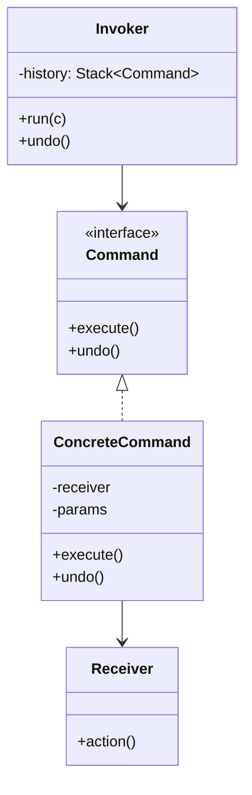

# Command — Encapsulate a Request as an Object

**Date:** 2026-05-02 | **Updated:** 2026-05-02
**Tags:** `low-level-design` `design-patterns` `behavioral` `command` `undo` `cqrs`

## Summary

Command turns a "do this" call into a *thing* — an object you can store, queue, log, replay, or undo. It decouples the *invoker* (who triggers the action) from the *receiver* (who performs it), and is the foundation of undo/redo systems, job queues, request logs, and CQRS write-side handlers.

## Intent

> Encapsulate a request as an object, thereby letting you parameterize clients with different requests, queue or log requests, and support undoable operations. (GoF)

## Structure



The Invoker only knows `Command`. The Concrete Command knows the Receiver and the parameters. Clients build commands and hand them to the Invoker.

## Java Example — text editor with undo

```java
public interface Command {
    void execute();
    void undo();
}

public final class Document { // Receiver
    private final StringBuilder text = new StringBuilder();
    public void insert(int at, String s) { text.insert(at, s); }
    public String delete(int at, int len) {
        var removed = text.substring(at, at + len);
        text.delete(at, at + len);
        return removed;
    }
    public String content() { return text.toString(); }
}

public final class InsertCommand implements Command {
    private final Document doc;
    private final int at;
    private final String text;
    public InsertCommand(Document doc, int at, String text) {
        this.doc = doc; this.at = at; this.text = text;
    }
    public void execute() { doc.insert(at, text); }
    public void undo()    { doc.delete(at, text.length()); }
}

public final class Editor { // Invoker
    private final Document doc = new Document();
    private final Deque<Command> history = new ArrayDeque<>();
    private final Deque<Command> redo    = new ArrayDeque<>();

    public void run(Command c) {
        c.execute();
        history.push(c);
        redo.clear();
    }
    public void undo() {
        if (history.isEmpty()) return;
        var c = history.pop();
        c.undo();
        redo.push(c);
    }
    public void redo() {
        if (redo.isEmpty()) return;
        var c = redo.pop();
        c.execute();
        history.push(c);
    }
    public Document doc() { return doc; }
}
```

Each command captures *enough state to undo itself*. That's the contract.

## TypeScript Example — queue of commands

```ts
export interface Command {
  execute(): Promise<void>;
  undo?(): Promise<void>;
}

export class SendEmail implements Command {
  constructor(private to: string, private body: string) {}
  async execute() { await mailer.send(this.to, this.body); }
}

export class CommandQueue {
  private queue: Command[] = [];
  enqueue(c: Command) { this.queue.push(c); }
  async drain() {
    while (this.queue.length) {
      const c = this.queue.shift()!;
      try { await c.execute(); }
      catch (err) { console.error("command failed", err); }
    }
  }
}
```

Because each command is just data + behavior, you can serialize it for a durable queue (Redis, SQS, Kafka), schedule it, retry it, or audit it.

## Undo / redo

Two designs:

- **Self-inverting commands** — `execute` and `undo` symmetrically. Best for in-memory edits.
- **Memento-paired commands** — capture a snapshot of the receiver before `execute`; `undo` restores the snapshot. Easier to add to legacy receivers; more memory. See [Memento](memento.md).

## Request logging and replay

Persist commands in order; replay to rebuild state. This is the same idea as **event sourcing** (with terminology nuance: events describe what *happened*, commands describe what was *requested*). A command log is the cleanest path to a debug-replayable system.

## Command handlers in CQRS

In CQRS, the write side accepts *Commands* (`PlaceOrder`, `CancelReservation`) routed to *Command Handlers*. The handler validates, mutates aggregate state, and emits domain events. The Command pattern is the literal infrastructure: a typed object dispatched to a single handler.

```java
public interface CommandHandler<C> { void handle(C command); }

public final class PlaceOrderHandler implements CommandHandler<PlaceOrder> { ... }
```

A central `CommandBus` (often a generic dispatcher) finds the right handler by command type.

## When to Use

- You need undo/redo, logging of requests, retries, or scheduling.
- You want to queue work to run later, on another thread, or on another machine.
- The invoker shouldn't know the receiver (UI button → "doSomething" without coupling to the doer).
- You're implementing CQRS or a workflow engine.

## When NOT to Use

- Plain function call with no need for queuing, undo, or logging — don't wrap it in a class.
- The "command" is a dozen different no-shared-shape methods. A function or strategy is lighter.
- Heavy CRUD where a transaction script is clearer than a command per verb.

## Pitfalls

- **Undo can't always be perfect.** Side-effecting commands (sent emails, charged cards) aren't reversible — model *compensating commands* explicitly (`Refund`), don't pretend `undo` can put toothpaste back.
- **Stale references.** A command holds the receiver; if the receiver was destroyed or its state moved, the command runs in the wrong context. Keep commands short-lived or re-resolve the receiver on `execute`.
- **Mutable command parameters.** A queued command whose params are mutated after enqueue runs with the wrong inputs. Make commands immutable.
- **Implicit ordering.** Don't rely on insertion order across distributed queues — embed ordering keys or sequence numbers if it matters.
- **Mega-commands.** A `DoEverything` command hides the design; split into a sequence and let a higher level coordinate.

## Real-World Examples

- Photoshop / Figma / IDE undo stacks.
- Job queues — Sidekiq jobs, BullMQ jobs, Celery tasks, AWS Lambda invocations.
- CQRS frameworks — Axon, MediatR (.NET), Spring Modulith command handling.
- Database write-ahead logs and Redis AOF — durable command logs replayed on recovery.
- Macros, transactions, and batch scripts.
- HTTP request → controller method → command, in many backend architectures.

## Related

- Sibling: [Strategy](strategy.md), [Iterator](iterator.md), [Observer](observer.md), [State](state.md), [Template Method](template-method.md), [Chain of Responsibility](chain-of-responsibility.md), [Visitor](visitor.md), [Mediator](mediator.md), [Memento](memento.md) — paired with Command for snapshot-based undo.
- Related: [../additional/](../additional/) — Event Sourcing, CQRS, Saga.
- Related creational: [../creational/](../creational/) — Factory Method to construct commands from messages.
- Related structural: [../structural/](../structural/) — Decorator wraps commands with retry, timeout, audit.
- GoF: *Design Patterns*, "Command" chapter.
