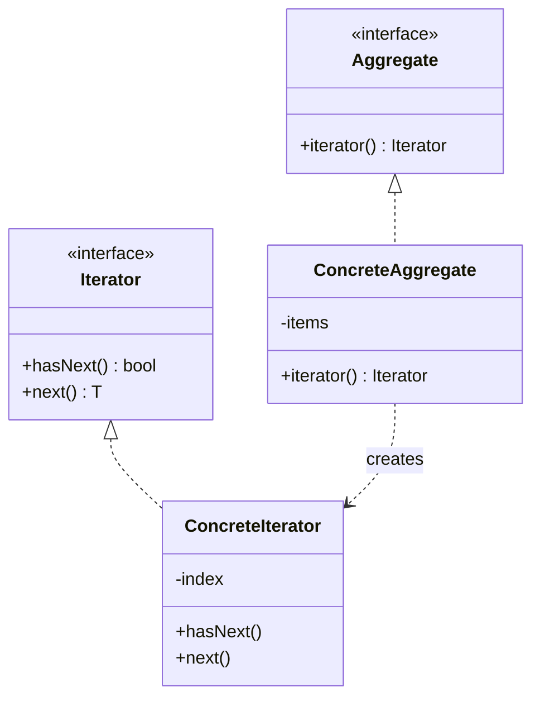

# Iterator — Traverse a Collection Without Exposing It

**Date:** 2026-05-02 | **Updated:** 2026-05-02
**Tags:** `low-level-design` `design-patterns` `behavioral` `iterator` `generator` `traversal`
## Summary

Iterator provides a uniform way to walk over a collection's elements without revealing how the collection stores them. Modern languages bake this in (`Iterable`/`Iterator`, `IEnumerable`, `Symbol.iterator`, generators), so the pattern usually shows up as "implement the language protocol" rather than "hand-roll a class".

## Intent

> Provide a way to access the elements of an aggregate object sequentially without exposing its underlying representation. (GoF)

The collection ("aggregate") and the *cursor* over it ("iterator") are separate concerns. You can have several cursors over the same data, traverse in multiple ways (in-order, reverse, filtered), and let the collection change its storage without breaking clients.

## Structure



## External vs internal iterators

- **External** — the *client* drives: `while (it.hasNext()) it.next()`. More flexible (the client can stop early, peek, restart). Java's `Iterator`, JS's `Symbol.iterator`, C#'s `IEnumerator`.
- **Internal** — the *aggregate* drives: `list.forEach(item -> ...)`. More concise, less flexible (no early break without an exception/sentinel). Pattern-matched by Stream pipelines, LINQ, JS array methods.

Pick external when control flow matters (parsing, paging, lock-step scans). Pick internal when each element is processed uniformly.

## Java Example — built-in protocol

```java
public final class Playlist implements Iterable<Song> {
    private final Song[] songs;
    public Playlist(Song[] songs) { this.songs = songs.clone(); }

    @Override
    public Iterator<Song> iterator() {
        return new Iterator<>() {
            private int i = 0;
            public boolean hasNext() { return i < songs.length; }
            public Song next() {
                if (!hasNext()) throw new NoSuchElementException();
                return songs[i++];
            }
        };
    }
}

// Use it
for (Song s : playlist) System.out.println(s.title());
playlist.forEach(s -> System.out.println(s.title())); // internal style
```

The collection stays opaque. Clients can also convert to a stream: `StreamSupport.stream(playlist.spliterator(), false)`.

### Multiple iteration orders

```java
public Iterator<Song> shuffled() { ... }     // a different Iterator
public Iterator<Song> byArtist() { ... }      // another one
```

Each method returns a fresh cursor. The collection has *one* representation but many *views*.

## TypeScript Example — `Symbol.iterator` and generators

```ts
class Playlist implements Iterable<Song> {
  constructor(private songs: readonly Song[]) {}

  *[Symbol.iterator](): Iterator<Song> {
    for (const s of this.songs) yield s;
  }

  *byArtist(): IterableIterator<Song> {
    yield* [...this.songs].sort((a, b) => a.artist.localeCompare(b.artist));
  }
}

const pl = new Playlist(songs);
for (const s of pl) console.log(s.title);
for (const s of pl.byArtist()) console.log(s.title);
const titles = [...pl].map((s) => s.title);
```

Generators (`function*` / `yield`) are the cheap way to write iterators — control state implicitly across `yield`s. They also enable infinite or lazy sequences:

```ts
function* naturals(): Generator<number> {
  let n = 1;
  while (true) yield n++;
}
const firstTen = [...take(naturals(), 10)];
```

## When to Use

- You need to expose elements of a structure without exposing the structure.
- Multiple traversal orders matter (in-order, reverse, filtered, lazy).
- You want lazy/streaming semantics (don't materialize the whole sequence).
- You're building a DSL or query API and want `for…of` / for-each ergonomics.

## When NOT to Use

- The collection is a plain array/list and the language already iterates it. Don't wrap built-ins.
- You'd be writing a custom iterator only to defeat encapsulation (e.g., to mutate during iteration). Use a different API.
- The data is best modeled as a stream/observable, not a pull-based cursor — see Reactive Streams or Observer.

## Pitfalls

- **Concurrent modification.** Java's fail-fast iterators throw `ConcurrentModificationException` if the collection mutates mid-iteration. Document the contract: snapshot, fail-fast, or weakly consistent.
- **Single-pass vs reusable.** A generator-backed iterator usually exhausts once. If clients expect re-iteration, return a fresh iterator each call (the *Iterable* contract), not a stored one.
- **Hidden cost per `next()`.** Some iterators do non-trivial work per element (decompression, network paging). Make that explicit in docs.
- **Leaking resources.** Iterators over files, sockets, or DB cursors must be `Closeable`/`AutoCloseable` and used with try-with-resources / `using`.
- **Forgetting `hasNext` semantics.** `next()` without `hasNext` should throw, not return `null`.

## Real-World Examples

- `java.util.Iterator`, `Iterable`, `Spliterator`, `Stream`.
- C# `IEnumerable<T>` / `IEnumerator<T>` and `yield return`.
- JavaScript `Symbol.iterator`, `Symbol.asyncIterator`, `for…of`, `for await…of`.
- Python `__iter__` / `__next__`, generators with `yield`.
- DB drivers: paginated cursors over result sets (JDBC `ResultSet`, MongoDB cursors).
- `Files.lines(path)` for streaming a file line-by-line.

## Related

- Sibling: [Strategy](strategy.md), [Observer](observer.md), [Command](command.md), [State](state.md), [Template Method](template-method.md), [Chain of Responsibility](chain-of-responsibility.md), [Visitor](visitor.md), [Mediator](mediator.md), [Memento](memento.md)
- Related structural: [../structural/](../structural/) — Composite often pairs with Iterator to walk trees.
- Related creational: [../creational/](../creational/) — Factory Method commonly produces iterators.
- Related: [../additional/](../additional/) — Pipeline / Reactive Streams are async-flavored relatives.
- GoF: *Design Patterns*, "Iterator" chapter.
