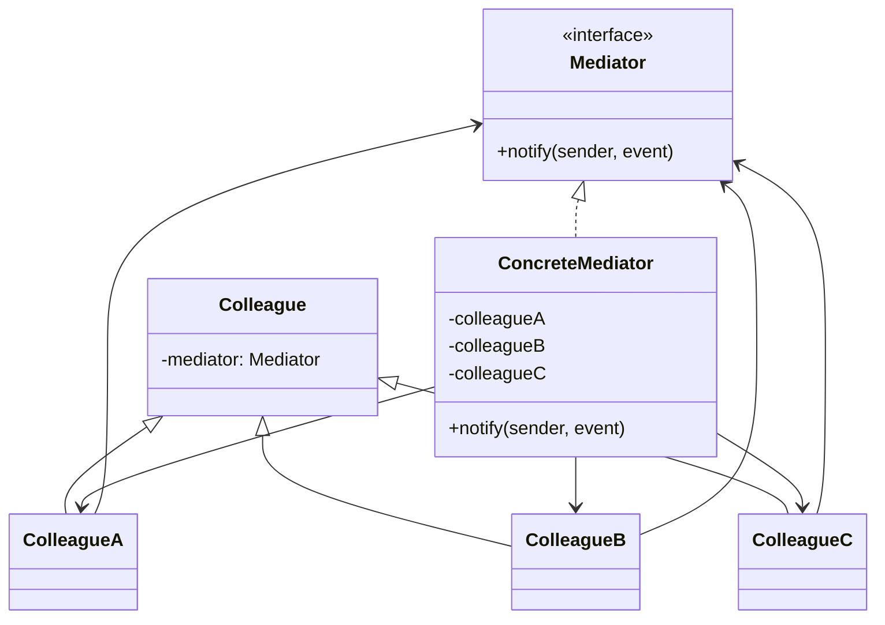
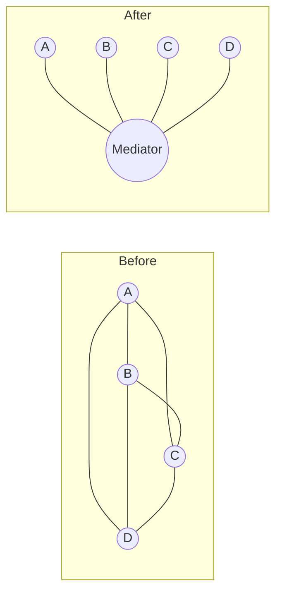

# Mediator — Centralize Inter-Object Communication

**Date:** 2026-05-02 | **Updated:** 2026-05-02
**Tags:** `low-level-design` `design-patterns` `behavioral` `mediator` `decoupling`

## Summary

Mediator replaces N×N peer-to-peer references between collaborating objects with N→1 references to a central coordinator. Each *colleague* talks only to the mediator; the mediator decides who else hears about it. It's the pattern behind chat rooms, dialog boxes, air-traffic control, and CQRS request dispatchers.

## Intent

> Define an object that encapsulates how a set of objects interact. Mediator promotes loose coupling by keeping objects from referring to each other explicitly, and it lets you vary their interaction independently. (GoF)

## Structure



Each colleague holds a reference *only* to the mediator. The mediator holds references to all colleagues. Communication is `colleague.notify(self, event)` → mediator decides what to do.

## N×N coupling vs N×1

Without mediator, a chat room with N users has up to N×N peer references (each user knows every other). Adding a user touches every existing user. With a mediator, every user knows only the room. The room handles "send", "join", "leave", "kick".



## Java Example — chat room

```java
public interface ChatRoom {
    void send(String from, String message);
    void register(User user);
}

public final class SimpleChatRoom implements ChatRoom {
    private final Map<String, User> users = new ConcurrentHashMap<>();

    public void register(User user) { users.put(user.name(), user); user.setRoom(this); }

    public void send(String from, String message) {
        for (var u : users.values()) {
            if (!u.name().equals(from)) u.receive(from, message);
        }
    }
}

public final class User {
    private final String name;
    private ChatRoom room;
    public User(String name) { this.name = name; }
    public String name() { return name; }
    void setRoom(ChatRoom room) { this.room = room; }

    public void send(String message) { room.send(name, message); }
    public void receive(String from, String message) {
        System.out.printf("[%s] %s: %s%n", name, from, message);
    }
}

// Wire-up
var room = new SimpleChatRoom();
var alice = new User("Alice"); var bob = new User("Bob");
room.register(alice); room.register(bob);
alice.send("Hi Bob");
```

`User` doesn't know about `Bob`, only about the room. New users plug into the same mediator without touching anyone else.

## TypeScript Example — UI dialog

```ts
interface DialogMediator {
  notify(sender: object, event: string): void;
}

class LoginDialog implements DialogMediator {
  private email = new TextField(this);
  private password = new TextField(this);
  private submit = new Button(this, "Sign in");
  private status = new Label("");

  notify(sender: object, event: string) {
    const valid = this.email.value.includes("@") && this.password.value.length >= 8;
    if (sender === this.email || sender === this.password) {
      if (event === "change") this.submit.enabled = valid;
    }
    if (sender === this.submit && event === "click") {
      this.status.text = "Signing in…";
      // submit & update status
    }
  }
}
```

The text field doesn't know the button exists. The button doesn't know the status label exists. Only the dialog (mediator) coordinates.

## vs Event Bus / Observer

|              | Mediator                                | Event Bus / Observer                  |
|--------------|-----------------------------------------|----------------------------------------|
| Direction    | Colleagues talk *to* the mediator       | Subjects *broadcast* to subscribers    |
| Knowledge    | Mediator knows all colleagues           | Subject doesn't know its observers     |
| Cardinality  | Often 1→1 routing                       | Typically 1→many fan-out               |
| Best for     | Coordinated workflow with rules         | Loosely related event listeners        |

A mediator *coordinates*, an event bus *broadcasts*. Use mediator when the rules are non-trivial ("if Alice sends, Bob and Carol see it but not the bot account"), use observer when listeners are independent and additive.

## CQRS / MediatR

Frameworks like MediatR (.NET), Spring Modulith, and Axon expose a mediator as a *request bus*: handlers register for command/query types, callers ask the mediator to dispatch. It's Mediator + Command. The benefit: controllers don't reference services; they reference the bus.

```csharp
public record PlaceOrder(Guid CartId) : IRequest<OrderId>;
public class PlaceOrderHandler : IRequestHandler<PlaceOrder, OrderId> { ... }

// Controller
var orderId = await mediator.Send(new PlaceOrder(cartId));
```

## When to Use

- Many objects communicate in complex but well-defined ways and you find peer references everywhere.
- Reuse of individual peers is hampered because they're entangled with others.
- The interaction *protocol* is interesting in itself and deserves a home.
- A central place to apply rules, audit, or log all interactions is valuable.

## When NOT to Use

- Two objects collaborate — direct call. Don't introduce a mediator for two participants.
- Interactions are simple broadcasts — Observer/Event Bus is lighter.
- You'd be funneling everything through the mediator just to "decouple" without simplifying — that's the *god mediator* anti-pattern.

## Pitfalls

- **Mediator becomes a god object.** Every rule lives in it; it grows monstrous. Split by domain or by interaction kind.
- **Hidden coupling via the mediator.** Colleagues end up depending on the mediator's specific routing logic; renaming a method ripples. Keep the mediator's surface narrow.
- **Async/threading.** When colleagues call `notify` concurrently, the mediator must be thread-safe — synchronize state or queue events.
- **Reentrancy.** A `notify` that triggers another `notify` synchronously can recurse. Detect and guard.
- **Testability illusion.** A mediator that holds *all* singletons is hard to test as a unit. Inject collaborators by interface and test with fakes.

## Real-World Examples

- Chat rooms / IRC / Discord channel routing.
- Air-traffic control simulations and tower software (the canonical mediator example).
- UI dialogs coordinating widgets (Swing, WinForms, web component frameworks).
- MediatR / Spring `ApplicationEventPublisher` for in-process command dispatch.
- AWS API Gateway and similar request routers.
- DAW (Digital Audio Workstation) signal-routing matrices.

## Related

- Sibling: [Strategy](strategy.md), [Command](command.md) — often dispatched via a mediator. [Observer](observer.md), [State](state.md), [Template Method](template-method.md), [Iterator](iterator.md), [Chain of Responsibility](chain-of-responsibility.md), [Visitor](visitor.md), [Memento](memento.md).
- Related: [../additional/](../additional/) — Event Bus, Service Bus, CQRS dispatcher.
- Related structural: [../structural/](../structural/) — Facade is a *unidirectional* simplifier; Mediator is *bidirectional* coordination.
- Related creational: [../creational/](../creational/) — Singleton mediators (with care).
- GoF: *Design Patterns*, "Mediator" chapter.
