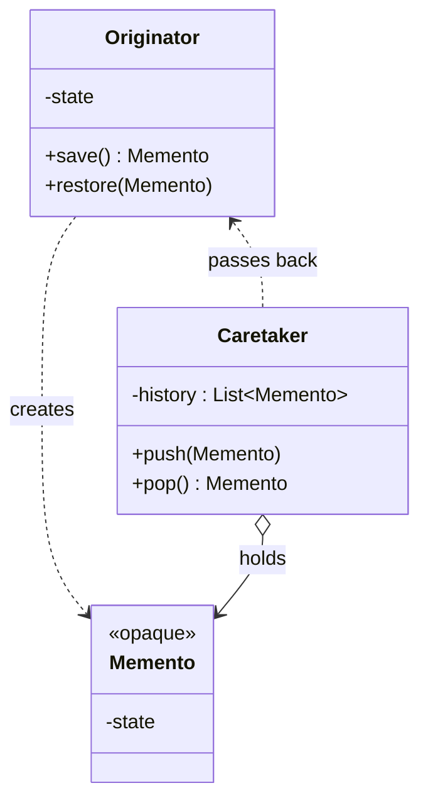

# Memento — Capture and Restore Internal State

**Date:** 2026-05-02 | **Updated:** 2026-05-02
**Tags:** `low-level-design` `design-patterns` `behavioral` `undo-redo` `snapshotting`

## Summary

Memento captures an object's internal state into a sealed token that can later restore it, without exposing the object's internals to the caller. The classic use is undo/redo, but the same shape applies to checkpointing, transactional rollback, and time-travel debugging.

## Table of Contents

- [Summary](#summary)
- [Intent](#intent)
- [Structure](#structure)
- [Roles](#roles)
- [Java Implementation](#java-implementation)
- [TypeScript Implementation](#typescript-implementation)
- [When to Use](#when-to-use)
- [When NOT to Use](#when-not-to-use)
- [Common Pitfalls](#common-pitfalls)
- [Memento vs Serializing All State](#memento-vs-serializing-all-state)
- [Real-World Examples](#real-world-examples)
- [Related](#related)
- [References](#references)

## Intent

> "Without violating encapsulation, capture and externalize an object's internal state so that the object can be restored to this state later." — *Design Patterns* (GoF, 1994)

The point is not "save state" — any DTO does that. The point is **save state without leaking it**. A Memento is opaque to everyone except the originator that produced it.

## Structure



## Roles

- **Originator** — the object whose state needs saving. Only the originator can read a Memento's contents.
- **Memento** — opaque snapshot. Public-facing API exposes nothing about the wrapped state.
- **Caretaker** — holds Mementos in order (stack for undo, deque for undo+redo). Never inspects them.

## Java Implementation

```java
public final class TextEditor {
    private final StringBuilder buffer = new StringBuilder();
    private int caret = 0;

    public void type(String text) {
        buffer.insert(caret, text);
        caret += text.length();
    }

    public void moveCaret(int position) {
        if (position < 0 || position > buffer.length()) {
            throw new IndexOutOfBoundsException();
        }
        caret = position;
    }

    public Memento save() {
        return new Memento(buffer.toString(), caret);
    }

    public void restore(Memento m) {
        buffer.setLength(0);
        buffer.append(m.text);
        caret = m.caret;
    }

    public String render() {
        return buffer.toString();
    }

    // Memento is a static inner class — only TextEditor sees its fields.
    public static final class Memento {
        private final String text;
        private final int caret;

        private Memento(String text, int caret) {
            this.text = text;
            this.caret = caret;
        }
    }
}

public final class History {
    private final Deque<TextEditor.Memento> undo = new ArrayDeque<>();
    private final Deque<TextEditor.Memento> redo = new ArrayDeque<>();

    public void push(TextEditor.Memento m) {
        undo.push(m);
        redo.clear();
    }

    public TextEditor.Memento popUndo() {
        return undo.isEmpty() ? null : undo.pop();
    }
}
```

The inner-class trick keeps `text` and `caret` invisible to `History`. The Caretaker can stack and unstack Mementos, but cannot read them.

## TypeScript Implementation

TypeScript has no friend access, so encapsulation relies on the module boundary plus an opaque type:

```typescript
// editor.ts
const STATE = Symbol('memento-state');

export interface EditorMemento {
  readonly [STATE]: { text: string; caret: number };
}

export class TextEditor {
  private buffer = '';
  private caret = 0;

  type(text: string): void {
    this.buffer = this.buffer.slice(0, this.caret) + text + this.buffer.slice(this.caret);
    this.caret += text.length;
  }

  save(): EditorMemento {
    return { [STATE]: { text: this.buffer, caret: this.caret } };
  }

  restore(m: EditorMemento): void {
    this.buffer = m[STATE].text;
    this.caret = m[STATE].caret;
  }

  render(): string {
    return this.buffer;
  }
}
```

Outside callers can hold `EditorMemento` but cannot meaningfully read `[STATE]` because the symbol is module-private. It is structural-typing's closest equivalent to Java's friend access.

```typescript
export class History {
  private undo: EditorMemento[] = [];
  private redo: EditorMemento[] = [];

  push(m: EditorMemento): void {
    this.undo.push(m);
    this.redo = [];
  }

  popUndo(): EditorMemento | undefined {
    return this.undo.pop();
  }
}
```

## When to Use

- **Undo/redo** — the textbook use case. Editors, drawing apps, IDEs.
- **Transactional rollback in memory** — try a multi-step operation; revert if it fails midway.
- **Checkpointing long-running computations** — periodic save so a crash doesn't redo everything.
- **State machine forking / "what-if" branches** — fork from a snapshot, simulate, discard or commit.
- **Time-travel debugging** — Redux DevTools is essentially Memento at scale.

## When NOT to Use

- State is large and snapshots would dominate memory. Use a **command log** instead — store the *operations*, replay or invert them.
- Restoration only needs to undo the most recent operation. A simple **inverse-command pair** is lighter than full snapshots.
- The object is already immutable. Any reference *is* a Memento; no pattern needed.
- Caller actually needs to inspect the saved state. That is not Memento — that is a DTO. Don't pretend otherwise.

## Common Pitfalls

- **Leaky Memento.** Public getters on the Memento defeat the point. The Caretaker should be unable to read it.
- **Deep-copy traps.** If state contains mutable references, a shallow capture lets later edits mutate the snapshot. Capture defensively or freeze.
- **Unbounded history.** Undo stacks grow forever in long sessions. Cap depth, drop oldest, or fold into a periodic checkpoint + recent-deltas scheme.
- **Mixing Memento with Command.** Command-based undo (store inverse operations) and Memento (store snapshots) solve the same problem differently. Pick one. Mixing both per-action duplicates work and creates two sources of truth.
- **Serializing transient fields.** Things like open file handles, sockets, threads, caches do not belong in a snapshot. Capture only logical state.
- **Memento on circular graphs.** Snapshotting an object graph with cycles needs an identity-aware traversal or a clear "ownership boundary" — otherwise infinite recursion.

## Memento vs Serializing All State

| Aspect | Memento | Full serialization (JSON, Java `Serializable`, etc.) |
|---|---|---|
| Encapsulation | Preserved — only originator reads it | Broken — anyone with the bytes can inspect |
| Granularity | Capture only logical state | Captures all reachable fields by default |
| Versioning | Originator owns format and migrations | Format leaks into every consumer |
| Storage durability | Usually in-memory only | Often persisted across runs |
| Use case | Undo/redo, in-process snapshots | Persistence, IPC, network |

Memento and serialization look similar in code; their *contracts* are different. Use serialization when crossing a process or storage boundary; use Memento when the snapshot stays inside the originator's encapsulation.

## Real-World Examples

- **Text editors and IDEs** — VS Code, IntelliJ undo stacks. Each edit pushes a snapshot or inverse-command record.
- **Drawing apps** — Photoshop's history panel, Figma's undo. Snapshots of the document tree.
- **Redux / Redux DevTools** — every dispatched action snapshots the store; DevTools lets you scrub through history. Conceptually Memento + Command.
- **Database transactions** — savepoints and rollback are Memento at the storage-engine level.
- **Game state save/load** — checkpoint = Memento. Whole-state snapshot for a level or session.
- **Browser `history.pushState`** — each navigation entry stores serialized app state for restoration on back/forward.

## Related

- [Command — Encapsulate a Request as an Object](command.md) — alternative undo strategy via inverse operations rather than snapshots.
- [State — Behavior Varies With Internal State](state.md) — Memento can snapshot the State object's currently selected variant.
- [Strategy — Swap Algorithms at Runtime](strategy.md) — orthogonal pattern; sometimes paired when the saved state includes the active strategy.
- [Prototype — Clone Existing Instances](../creational/prototype.md) — both produce copies of an object; Prototype is for *creating new* instances, Memento is for *restoring* the same instance.
- [Encapsulation — Hiding the Right Things](../../oop-fundamentals/encapsulation.md) — the principle Memento exists to preserve.
- [Single Responsibility Principle](../../solid/single-responsibility-principle.md) — Caretaker holding history is a separate responsibility from Originator producing state.

## References

- *Design Patterns: Elements of Reusable Object-Oriented Software* — Gamma, Helm, Johnson, Vlissides (GoF), 1994.
- *Effective Java* — Joshua Bloch, on defensive copying and the limits of Java serialization.
- Redux documentation describes time-travel debugging via stored action history, conceptually equivalent to Memento + Command.
