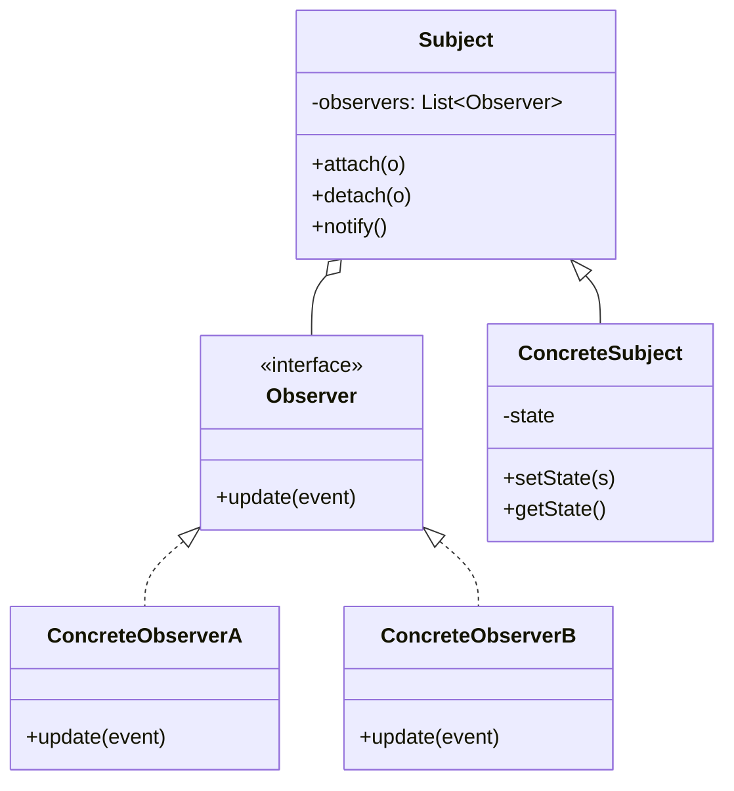

# Observer — Many Subscribers React to State Change

**Date:** 2026-05-02 | **Updated:** 2026-05-02
**Tags:** `low-level-design` `design-patterns` `behavioral` `observer` `pub-sub` `reactive`
## Summary

Observer lets one *subject* notify many *observers* when its state changes, without the subject knowing who they are or what they'll do. It's pub/sub at the object level — and the conceptual root of every event-emitter, reactive stream, and UI binding system.

## Intent

> Define a one-to-many dependency between objects so that when one object changes state, all its dependents are notified and updated automatically. (GoF)

## Structure



## Push vs pull

- **Push** — subject hands the new state (or a fully-formed event) to each observer. Cheap for observers, but couples the subject to what observers want.
- **Pull** — subject says "something changed", observer calls back to ask for the bits it cares about. Looser coupling, more round-trips, and you must guard against stale reads when the subject mutates again before the observer pulls.

Most real systems use **push with a typed event object** — a middle ground that names the change without exposing internal state.

## Java Example

```java
public interface PriceObserver {
    void onPriceChange(PriceChange event);
}

public record PriceChange(String symbol, BigDecimal oldPrice, BigDecimal newPrice) {}

public final class Ticker {
    private final List<PriceObserver> observers = new CopyOnWriteArrayList<>();
    private final Map<String, BigDecimal> prices = new ConcurrentHashMap<>();

    public AutoCloseable subscribe(PriceObserver o) {
        observers.add(o);
        return () -> observers.remove(o); // explicit unsubscribe handle
    }

    public void update(String symbol, BigDecimal newPrice) {
        var old = prices.put(symbol, newPrice);
        var event = new PriceChange(symbol, old, newPrice);
        for (var o : observers) o.onPriceChange(event);
    }
}

// Usage
var ticker = new Ticker();
try (var sub = ticker.subscribe(e ->
        System.out.printf("%s: %s -> %s%n", e.symbol(), e.oldPrice(), e.newPrice()))) {
    ticker.update("AAPL", new BigDecimal("172.50"));
} // unsubscribed here
```

`CopyOnWriteArrayList` removes the iteration-vs-mutation hazard during notification at the cost of writes. For high-throughput buses, batch via a `Disruptor` or use a reactive library.

## TypeScript Example

```ts
type Listener<E> = (event: E) => void;

export class EventBus<E> {
  private listeners = new Set<Listener<E>>();

  subscribe(fn: Listener<E>): () => void {
    this.listeners.add(fn);
    return () => this.listeners.delete(fn); // unsubscribe handle
  }

  emit(event: E): void {
    for (const fn of [...this.listeners]) {
      try { fn(event); } catch (err) { console.error(err); }
    }
  }
}

const ticker = new EventBus<{ symbol: string; price: number }>();
const unsub = ticker.subscribe((e) => console.log(e));
ticker.emit({ symbol: "AAPL", price: 172.5 });
unsub();
```

The `() => unsubscribe` pattern is the modern, leak-resistant convention — every `subscribe` returns the cleanup. RxJS calls this a `Subscription`.

## Subscription leaks

The classic Observer bug: an observer holds a reference back to a long-lived subject (or vice versa) and *never unsubscribes*. The observer can't be GC'd, accumulates over time, and continues processing events for a "page" the user already left.

Defenses:

- **Return an unsubscribe handle** from `subscribe` and *use* it in `finally` / `useEffect` cleanup / `onDestroy`.
- **Tie subscriptions to a lifecycle scope** — Spring's `@EventListener` + bean lifecycle, React's `useEffect` return, Angular's `takeUntilDestroyed`.
- **Weak references** for caches/dev tools where missing an event is OK.
- **Bounded buffers** — drop or fail fast when a slow observer falls behind, instead of growing memory unbounded.

## Reactive link

RxJS, Project Reactor (Mono/Flux), and Java Flow are Observer with backpressure, operators (`map`, `filter`, `merge`, `debounce`), and explicit completion / error channels. The pattern is the same; the surface area is bigger. If you need composition of streams, use a reactive library — don't reinvent it on top of plain observers.

## When to Use

- A change in one place must trigger updates in unknown, varying places.
- You want loose coupling between *what changed* and *who cares*.
- The subject genuinely doesn't (and shouldn't) know its observers.

## When NOT to Use

- Only one observer ever exists — call it directly.
- The observers must run in a strict, ordered pipeline — Chain of Responsibility or a workflow engine fits better.
- Updates need durability, replay, or cross-process delivery — use a real message broker (Kafka, NATS, RabbitMQ), not in-process Observer.
- Cycles are likely: A observes B observes A — Mediator is usually the right answer.

## Pitfalls

- **Reentrancy.** An observer that emits while being notified can recurse infinitely. Detect and break the cycle, or queue events.
- **Order assumptions.** Don't rely on observer registration order — make events idempotent and order-independent.
- **Notification storms.** A single state change cascading into N events that each cascade further. Add coalescing, debouncing, or transactional notification ("notify after commit").
- **Synchronous failure.** One throwing observer blocks the rest unless you isolate failures (try/catch around each notify).
- **Stale reads in pull mode.** Send the new state with the event, or include a version, to detect "what I pulled is older than what fired".

## Real-World Examples

- `java.beans.PropertyChangeSupport` and Swing listener model.
- DOM `addEventListener` / Node.js `EventEmitter`.
- Spring's `ApplicationEventPublisher` / `@EventListener`.
- RxJS `Subject`/`Observable`, Project Reactor `Flux`.
- Redux/Zustand/Pinia store subscriptions in front-end state.
- Database triggers and PostgreSQL `LISTEN`/`NOTIFY` (cross-process Observer).

## Related

- Sibling: [Strategy](strategy.md), [Iterator](iterator.md), [Command](command.md), [State](state.md), [Template Method](template-method.md), [Chain of Responsibility](chain-of-responsibility.md), [Visitor](visitor.md), [Mediator](mediator.md), [Memento](memento.md)
- Related: [../additional/](../additional/) — Reactive Streams, Pub/Sub, Event Sourcing.
- Related structural: [../structural/](../structural/) — Decorator can wrap an observer with logging/retry.
- Related creational: [../creational/](../creational/) — Singleton event buses are common (and risky).
- GoF: *Design Patterns*, "Observer" chapter.
