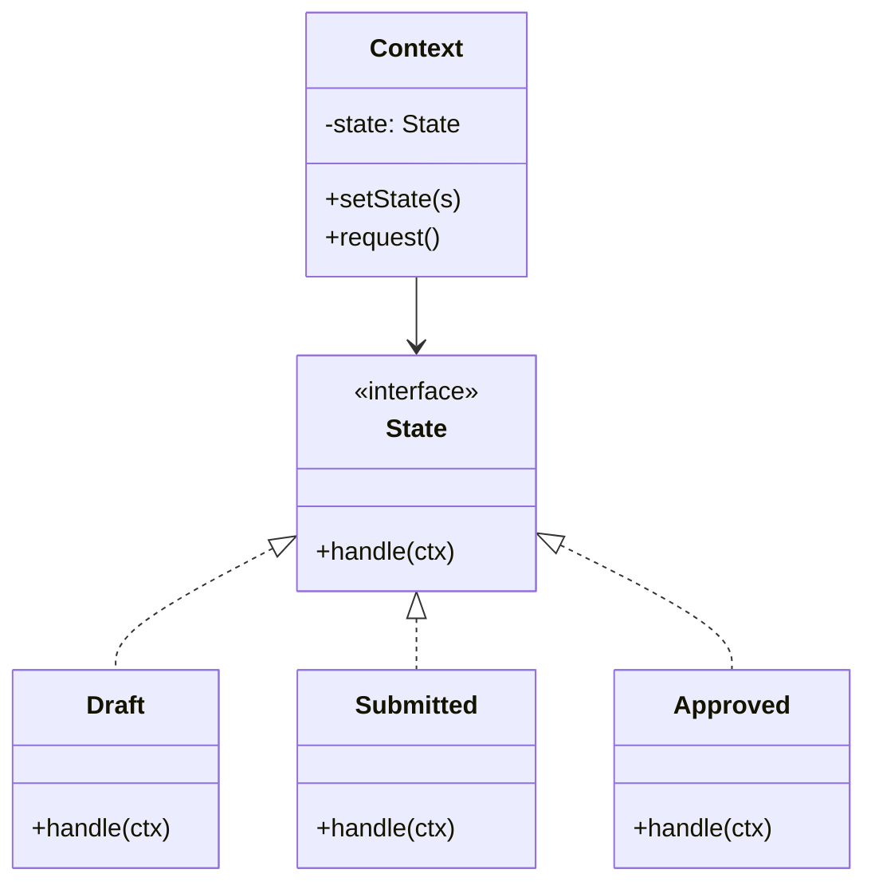

# State — Behavior Varies With Internal State

**Date:** 2026-05-02 | **Updated:** 2026-05-02
**Tags:** `low-level-design` `design-patterns` `behavioral` `state` `state-machine`

## Summary

State lets an object change its behavior when its internal mode changes — by delegating method calls to a *state object* and swapping that object on transitions. It replaces sprawling `switch (status)` blocks with one class per state, each handling its own behavior and transitions.

## Intent

> Allow an object to alter its behavior when its internal state changes. The object will appear to change its class. (GoF)

## Structure



`Context` keeps a reference to the current state. Calls to `Context.request()` are forwarded to `state.handle(this)`. Each state can ask the context to transition to another state.

## Java Example — order workflow

```java
public interface OrderState {
    void pay(OrderContext ctx);
    void ship(OrderContext ctx);
    void cancel(OrderContext ctx);
    String name();
}

public final class OrderContext {
    private OrderState state = new Draft();
    void setState(OrderState s) { this.state = s; }
    public String state() { return state.name(); }

    public void pay()    { state.pay(this); }
    public void ship()   { state.ship(this); }
    public void cancel() { state.cancel(this); }
}

final class Draft implements OrderState {
    public void pay(OrderContext ctx)    { ctx.setState(new Paid()); }
    public void ship(OrderContext ctx)   { throw new IllegalStateException("Cannot ship a draft"); }
    public void cancel(OrderContext ctx) { ctx.setState(new Cancelled()); }
    public String name() { return "DRAFT"; }
}

final class Paid implements OrderState {
    public void pay(OrderContext ctx)    { /* idempotent */ }
    public void ship(OrderContext ctx)   { ctx.setState(new Shipped()); }
    public void cancel(OrderContext ctx) { ctx.setState(new Refunding()); }
    public String name() { return "PAID"; }
}

final class Shipped implements OrderState {
    public void pay(OrderContext ctx)    { throw new IllegalStateException(); }
    public void ship(OrderContext ctx)   { /* already shipped */ }
    public void cancel(OrderContext ctx) { throw new IllegalStateException("Already shipped"); }
    public String name() { return "SHIPPED"; }
}
// ...
```

Each illegal transition is a *method on a state class*, not a forgotten `case` in a switch.

## TypeScript Example

```ts
interface OrderState {
  readonly name: string;
  pay(ctx: OrderContext): void;
  ship(ctx: OrderContext): void;
  cancel(ctx: OrderContext): void;
}

class Draft implements OrderState {
  readonly name = "DRAFT";
  pay(ctx: OrderContext)    { ctx.setState(new Paid()); }
  ship(_: OrderContext)     { throw new Error("Cannot ship a draft"); }
  cancel(ctx: OrderContext) { ctx.setState(new Cancelled()); }
}

class Paid implements OrderState {
  readonly name = "PAID";
  pay()                     {}
  ship(ctx: OrderContext)   { ctx.setState(new Shipped()); }
  cancel(ctx: OrderContext) { ctx.setState(new Refunding()); }
}

export class OrderContext {
  private state: OrderState = new Draft();
  setState(s: OrderState)   { this.state = s; }
  get current() { return this.state.name; }
  pay()    { this.state.pay(this); }
  ship()   { this.state.ship(this); }
  cancel() { this.state.cancel(this); }
}
```

## State classes vs enum-driven if/else

```java
// Smell: enum-driven branching scattered across methods
public void pay() {
    switch (status) {
        case DRAFT -> status = Status.PAID;
        case PAID  -> { /* no-op */ }
        case SHIPPED -> throw new IllegalStateException();
        // ... ship() repeats this switch, cancel() repeats it again
    }
}
```

Problems:

- Adding a state means editing every method.
- Illegal transitions live as scattered `default:` branches.
- The state's *behavior* and *transitions* are split across files.

State pattern collapses each state's behavior into one place. Trade-off: more classes for richer cases; fewer classes when the FSM is small. A sealed interface with a fixed enum-like set of states (Java 17 sealed types, TS discriminated unions) is a good middle ground.

## State vs Strategy

Same shape (Context delegates to a swappable behavior object), different *who decides*:

|              | Strategy                            | State                               |
|--------------|-------------------------------------|--------------------------------------|
| Who picks the variant? | Client / configuration       | The state itself, via transitions    |
| When does it change?    | Rarely, often never at runtime | Frequently, as part of normal flow  |
| Knows about siblings?    | No — strategies are independent | Yes — a state knows what comes next |

If the variant *changes itself* in response to events, you have State. If the variant is *chosen externally and stable*, you have Strategy.

## When to Use

- An object's behavior depends on a mode that changes over its lifetime.
- You see big `switch (status)` or nested `if (mode)` chains repeated across many methods.
- Illegal transitions need to be encoded, not just commented.
- The lifecycle is a real workflow with named states (orders, claims, sessions, connections).

## When NOT to Use

- Two states with one differing method — a boolean flag is fine.
- The FSM is generated from a config file or DSL — a real state-machine library beats hand-rolled classes (Spring Statemachine, XState).
- Performance-critical inner loops where allocating state objects per transition matters — use an enum + dispatch table.

## Pitfalls

- **Shared state class instances.** Stateless state classes can be singletons (cheap, thread-safe). Stateful ones must be per-context.
- **Mutual coupling.** Each state ends up importing every other; consider a `Transitions` map keyed by state to avoid the spaghetti.
- **Forgetting to make transitions atomic.** If a transition fires events mid-way, partial transitions are visible to observers — finalize state, then notify.
- **Persistent state machines.** When persisted to a DB, you reconstruct state from a column. Centralize the rehydration mapping in one place; don't scatter `switch (status) { case "PAID" -> new Paid() }` everywhere.
- **Hidden global state.** Resist storing actual data on the state object; data belongs on the Context, behavior on the state.

## Real-World Examples

- TCP connection: `LISTEN` → `SYN_SENT` → `ESTABLISHED` → `FIN_WAIT_1` …
- Order, payment, subscription, claim, ticket workflows.
- Game character states (idle, running, jumping, falling, attacking).
- HTTP/2 stream lifecycle.
- React/Vue UI components with mode-dependent rendering — XState formalizes this.
- AWS Step Functions and similar orchestrators (state machines as a service).

## Related

- Sibling: [Strategy](strategy.md) — same shape, different intent. [Command](command.md), [Observer](observer.md), [Iterator](iterator.md), [Template Method](template-method.md), [Chain of Responsibility](chain-of-responsibility.md), [Visitor](visitor.md), [Mediator](mediator.md), [Memento](memento.md).
- Related: [../additional/](../additional/) — Finite State Machine, Workflow, Saga.
- Related creational: [../creational/](../creational/) — factories to rehydrate states from persisted IDs.
- Related structural: [../structural/](../structural/) — Flyweight if state classes are stateless and many.
- GoF: *Design Patterns*, "State" chapter.
