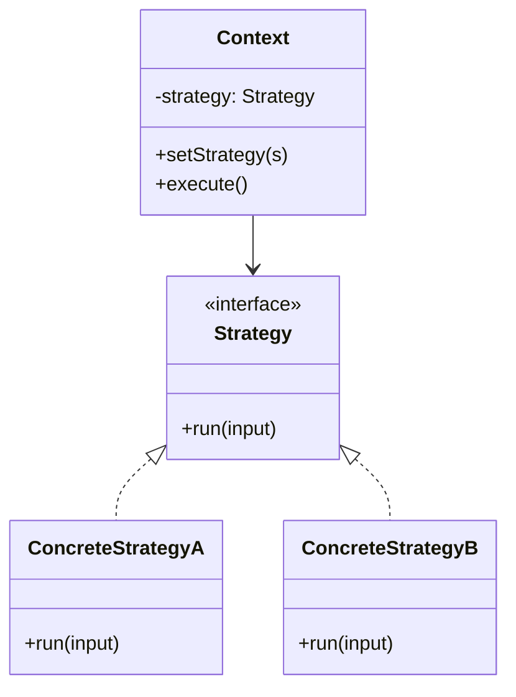

# Strategy — Swap Algorithms at Runtime

**Date:** 2026-05-02 | **Updated:** 2026-05-02
**Tags:** `low-level-design` `design-patterns` `behavioral` `strategy` `polymorphism` `lambda`
## Summary

Strategy defines a family of interchangeable algorithms behind a common interface so a *Context* can pick (or be configured with) one at runtime. It replaces sprawling `if`/`else` or `switch` chains with polymorphic dispatch and is the single most reused behavioral pattern — in modern languages, often as a lambda.

## Intent

> Define a family of algorithms, encapsulate each one, and make them interchangeable. Strategy lets the algorithm vary independently from clients that use it. (GoF)

You want the *what* (sort, compress, price, route, validate) to be a separate, swappable thing from the *who is calling it*.

## Structure



The Context holds a reference to a Strategy and delegates work to it. Clients pick the strategy when they construct or configure the context.

## Java Example — Pricing strategies

```java
public interface PricingStrategy {
    BigDecimal price(Cart cart);
}

public final class RegularPricing implements PricingStrategy {
    public BigDecimal price(Cart cart) { return cart.subtotal(); }
}

public final class BlackFridayPricing implements PricingStrategy {
    public BigDecimal price(Cart cart) {
        return cart.subtotal().multiply(new BigDecimal("0.70"));
    }
}

public final class LoyaltyPricing implements PricingStrategy {
    private final int tier;
    public LoyaltyPricing(int tier) { this.tier = tier; }
    public BigDecimal price(Cart cart) {
        var discount = BigDecimal.valueOf(tier * 0.05);
        return cart.subtotal().multiply(BigDecimal.ONE.subtract(discount));
    }
}

public final class Checkout { // Context
    private PricingStrategy pricing;
    public Checkout(PricingStrategy pricing) { this.pricing = pricing; }
    public void setPricing(PricingStrategy p) { this.pricing = p; }
    public BigDecimal total(Cart cart) { return pricing.price(cart); }
}
```

### Java 8+: lambda as a strategy

If the strategy is a single-method interface, skip the class hierarchy:

```java
@FunctionalInterface
public interface PricingStrategy {
    BigDecimal price(Cart cart);
}

PricingStrategy bf = cart -> cart.subtotal().multiply(new BigDecimal("0.70"));
var checkout = new Checkout(bf);

// Lookup-driven:
Map<String, PricingStrategy> registry = Map.of(
    "regular", Cart::subtotal,
    "blackFriday", c -> c.subtotal().multiply(new BigDecimal("0.70"))
);
```

Lambdas eliminate ceremony when state isn't needed. When the strategy needs collaborators (a tax service, a clock, a config), a named class is still cleaner.

## TypeScript Example

```ts
export type PricingStrategy = (cart: Cart) => number;

export const regularPricing: PricingStrategy = (cart) => cart.subtotal;

export const blackFridayPricing: PricingStrategy = (cart) =>
  cart.subtotal * 0.7;

export const loyaltyPricing = (tier: number): PricingStrategy =>
  (cart) => cart.subtotal * (1 - tier * 0.05);

export class Checkout {
  constructor(private pricing: PricingStrategy) {}
  setPricing(p: PricingStrategy) { this.pricing = p; }
  total(cart: Cart): number { return this.pricing(cart); }
}

const checkout = new Checkout(loyaltyPricing(3));
```

In TypeScript, the function-type alias is almost always preferable to a class-based strategy unless you need state or polymorphic helpers.

## vs. if/else chains

```java
// Smell: closed to extension, open to defects
public BigDecimal price(Cart cart, String type) {
    if (type.equals("regular")) return cart.subtotal();
    else if (type.equals("blackFriday")) return cart.subtotal().multiply(...);
    else if (type.equals("loyaltyT1")) ...
    else if (type.equals("loyaltyT2")) ...
    throw new IllegalArgumentException(type);
}
```

Every new pricing rule edits the same method, the type code grows magic strings, and unit tests touch unrelated branches. Strategy turns each branch into a unit-testable, independently shippable artifact.

## When to Use

- Multiple variants of an algorithm exist and should be selected at runtime.
- You see a long `if/else`/`switch` keyed on a "type" string or enum.
- Clients want to plug in their own algorithm (sorters, comparators, validators).
- You want each variant testable in isolation.

## When NOT to Use

- Only one implementation will ever exist — YAGNI.
- The variants differ only in trivial constants (parameterize a single function instead).
- The variants share so much logic that Template Method (inheritance) better expresses the relationship.
- The selection is fixed at compile time and never changes — just call the function directly.

## Pitfalls

- **Strategy explosion.** Don't create a strategy interface for every tiny branch; reserve it for genuinely independent algorithms.
- **Stateful strategies that secretly share mutable state.** Treat strategies as values: immutable, thread-safe, and side-effect-free where possible.
- **Context leaking too much detail.** If `Strategy.run(this)` ends up needing every internal field of the Context, you've created tight coupling — refactor the inputs.
- **Mixing selection logic into the Context.** The Context shouldn't know "which" strategy to pick; that's a job for a factory, registry, or DI container.
- **Calling lambdas "not real strategies".** They are — the GoF book predates lambdas, but the *intent* is identical.

## Real-World Examples

- `java.util.Comparator` — the canonical strategy; `Collections.sort(list, byPrice)`.
- `java.util.concurrent.RejectedExecutionHandler` — strategies for what a `ThreadPoolExecutor` does when its queue is full.
- Spring's `PasswordEncoder` (BCrypt, Argon2, PBKDF2) and `AuthenticationProvider` chain.
- Express/Koa middleware function signatures (each middleware is a strategy for one stage).
- Payment processors (Stripe, PayPal, Adyen) behind a common `PaymentGateway` strategy.
- Compression (`gzip`, `br`, `zstd`) selected per request via `Accept-Encoding`.

## Related

- Sibling: [Observer](observer.md), [Command](command.md), [State](state.md), [Template Method](template-method.md), [Chain of Responsibility](chain-of-responsibility.md), [Iterator](iterator.md), [Visitor](visitor.md), [Mediator](mediator.md), [Memento](memento.md)
- Related creational: [../creational/](../creational/) — factories often produce strategies.
- Related structural: [../structural/](../structural/) — Decorator can wrap a strategy with cross-cutting behavior.
- Related: [../additional/](../additional/) — Specification and Policy patterns are close cousins of Strategy.
- GoF: *Design Patterns: Elements of Reusable Object-Oriented Software*, "Strategy" chapter.
