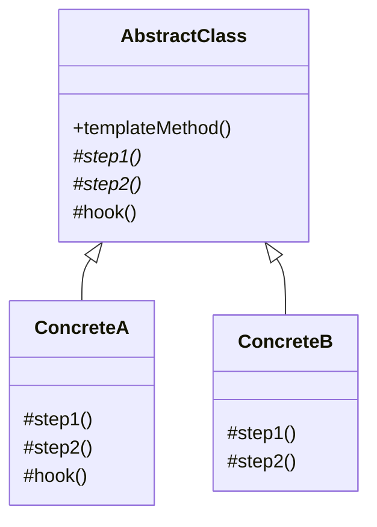

# Template Method — Skeleton With Hookable Steps

**Date:** 2026-05-02 | **Updated:** 2026-05-02
**Tags:** `low-level-design` `design-patterns` `behavioral` `template-method` `inheritance`

## Summary

Template Method defines the *skeleton* of an algorithm in a base class, deferring some steps to subclasses. Subclasses fill in the variable parts without changing the overall structure. It's the pattern that says "here is the recipe; you bring the eggs".

## Intent

> Define the skeleton of an algorithm in an operation, deferring some steps to subclasses. Template Method lets subclasses redefine certain steps of an algorithm without changing the algorithm's structure. (GoF)

## Structure



`templateMethod()` is `final`: clients see one fixed flow. The starred steps are abstract (must override). Hooks are concrete defaults the subclass *may* override.

## Java Example — report generation

```java
public abstract class ReportBuilder {

    public final byte[] build(Query q) {            // template method (final!)
        var data = fetch(q);
        var transformed = transform(data);
        beforeRender(transformed);                   // hook (default no-op)
        var bytes = render(transformed);
        afterRender(bytes);                          // hook
        return bytes;
    }

    protected abstract List<Row> fetch(Query q);
    protected abstract List<Row> transform(List<Row> rows);
    protected abstract byte[] render(List<Row> rows);

    protected void beforeRender(List<Row> rows) { /* hook */ }
    protected void afterRender(byte[] bytes)    { /* hook */ }
}

public final class CsvReport extends ReportBuilder {
    protected List<Row> fetch(Query q) { return repo.run(q); }
    protected List<Row> transform(List<Row> rows) { return rows; }
    protected byte[] render(List<Row> rows) { /* csv writer */ ... }
}

public final class PdfReport extends ReportBuilder {
    protected List<Row> fetch(Query q) { return repo.run(q); }
    protected List<Row> transform(List<Row> rows) { return paginate(rows); }
    protected byte[] render(List<Row> rows) { /* pdfbox */ ... }
    protected void beforeRender(List<Row> rows) { logger.info("rendering {} rows", rows.size()); }
}
```

The *flow* lives in `build`. Subclasses can't reorder it; they can only fill in the contracted steps.

## TypeScript Example

```ts
abstract class ReportBuilder {
  build(query: Query): Buffer {
    const raw = this.fetch(query);
    const data = this.transform(raw);
    this.beforeRender(data);
    const bytes = this.render(data);
    this.afterRender(bytes);
    return bytes;
  }

  protected abstract fetch(q: Query): Row[];
  protected abstract transform(rows: Row[]): Row[];
  protected abstract render(rows: Row[]): Buffer;
  protected beforeRender(_: Row[]) {}
  protected afterRender(_: Buffer) {}
}

class CsvReport extends ReportBuilder {
  protected fetch(q: Query) { return repo.run(q); }
  protected transform(rows: Row[]) { return rows; }
  protected render(rows: Row[]) { return Buffer.from(toCsv(rows)); }
}
```

## Hooks vs abstract steps

- **Abstract step** — the subclass *must* implement (no sensible default exists).
- **Hook** — concrete no-op or default in the base; subclass *may* override.

Make as much of the skeleton as possible into hooks. Each abstract step is a forced commitment from every subclass forever.

## Inheritance is the right tool when…

- The flow is genuinely fixed and shared.
- There is a strong "is-a" relationship — `PdfReport` *is a* `Report`.
- The steps need privileged access to base-class state.
- A handful of subclasses exist; not dozens that mix and match.

## Template Method vs Strategy

|                | Template Method                          | Strategy                                |
|----------------|------------------------------------------|------------------------------------------|
| Mechanism      | Inheritance — subclass overrides steps   | Composition — context holds a strategy   |
| Variation unit | Whole algorithm, with shared structure   | One algorithm interchangeable as a unit  |
| Flexibility    | Fixed skeleton; some steps swappable     | Whole behavior swappable at runtime      |
| Coupling       | Tight (subclass to base)                 | Loose (interface boundary)               |

Template Method is "inheritance with intent". Strategy is "composition with intent". When you find yourself using inheritance only to override one method, switch to Strategy.

A modern hybrid: keep the skeleton as a function that *takes* strategy callbacks.

```ts
function buildReport(steps: {
  fetch: (q: Query) => Row[];
  transform: (rows: Row[]) => Row[];
  render: (rows: Row[]) => Buffer;
}): (q: Query) => Buffer {
  return (q) => steps.render(steps.transform(steps.fetch(q)));
}
```

This is Template Method by composition — gives you the skeleton without inheritance.

## When to Use

- Multiple variations share a fixed sequence of steps with a few diverging stages.
- You want to lock the flow but invite extension at named points.
- You're building a framework (test runners, servlet containers, batch jobs) where users implement `setUp` / `runTest` / `tearDown`.

## When NOT to Use

- The skeleton itself isn't really shared — each variant has its own flow.
- The variation is a single small step — pass a function (Strategy / lambda).
- You'd need deep, multi-level inheritance to express it — composition is cheaper to reason about.
- The base class accumulates "protected helpers" that each subclass uses differently — split it.

## Pitfalls

- **Forgetting `final` on the template method.** A subclass that overrides `build()` defeats the whole pattern. Make it `final` (Java) or use composition (TS).
- **Fragile base class.** Changing the order of steps in the base breaks every subclass silently. Treat the skeleton as a public API.
- **Protected → public drift.** Subclasses calling `protected` helpers from outside contexts (mocks, tests) makes the contract leak.
- **Inheritance overuse.** Reaching for Template Method when one little hook would have done it as a callback parameter.
- **Constructor calls into overridable methods.** A classic Java footgun: the base constructor calls a method the subclass overrides, *before* the subclass constructor has run. Don't.

## Real-World Examples

- `java.io.InputStream` — `read(byte[], int, int)` is the template; `read()` is the abstract step.
- JUnit's `@BeforeEach`/`@Test`/`@AfterEach` lifecycle.
- Spring Batch `Tasklet` and `ItemReader/Processor/Writer` flow.
- HTTP Servlet `service()` calling `doGet`/`doPost`.
- ASP.NET / Express request lifecycles.
- Database migration tools — `up()` and `down()` hooks invoked by a fixed runner.

## Related

- Sibling: [Strategy](strategy.md) — composition counterpart. [Command](command.md), [Observer](observer.md), [State](state.md), [Iterator](iterator.md), [Chain of Responsibility](chain-of-responsibility.md), [Visitor](visitor.md), [Mediator](mediator.md), [Memento](memento.md).
- Related creational: [../creational/](../creational/) — Factory Method is often a single step inside a Template Method.
- Related structural: [../structural/](../structural/) — Decorator wraps the *whole* algorithm; Template Method opens up *parts* of it.
- Related: [../additional/](../additional/) — Pipeline, Hooks/Filters.
- GoF: *Design Patterns*, "Template Method" chapter.
