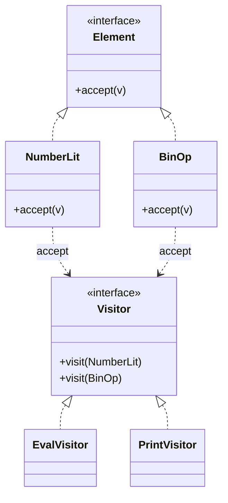

# Visitor — Add Operations Without Modifying Classes

**Date:** 2026-05-02 | **Updated:** 2026-05-02
**Tags:** `low-level-design` `design-patterns` `behavioral` `visitor` `double-dispatch` `ast`

## Summary

Visitor moves an operation that varies by *element type* out of the elements and into a separate visitor object. Each element accepts a visitor and dispatches back to the right method (`visitFoo`, `visitBar`) — *double dispatch*. It's the canonical pattern for compilers, interpreters, and any tree-shaped data with many operations and a stable shape.

## Intent

> Represent an operation to be performed on the elements of an object structure. Visitor lets you define a new operation without changing the classes of the elements on which it operates. (GoF)

## Structure



`accept(v)` calls back `v.visit(this)` — the second dispatch — so the visitor sees the *concrete* element type even when held behind the `Element` interface.

## Java Example — expression AST

```java
public sealed interface Expr permits NumberLit, BinOp, Var {
    <R> R accept(ExprVisitor<R> v);
}

public record NumberLit(double value) implements Expr {
    public <R> R accept(ExprVisitor<R> v) { return v.visit(this); }
}
public record BinOp(String op, Expr left, Expr right) implements Expr {
    public <R> R accept(ExprVisitor<R> v) { return v.visit(this); }
}
public record Var(String name) implements Expr {
    public <R> R accept(ExprVisitor<R> v) { return v.visit(this); }
}

public interface ExprVisitor<R> {
    R visit(NumberLit n);
    R visit(BinOp b);
    R visit(Var v);
}

public final class Eval implements ExprVisitor<Double> {
    private final Map<String, Double> env;
    public Eval(Map<String, Double> env) { this.env = env; }

    public Double visit(NumberLit n) { return n.value(); }
    public Double visit(Var v)       { return env.get(v.name()); }
    public Double visit(BinOp b) {
        double l = b.left().accept(this), r = b.right().accept(this);
        return switch (b.op()) {
            case "+" -> l + r;
            case "*" -> l * r;
            default  -> throw new IllegalArgumentException(b.op());
        };
    }
}

public final class Print implements ExprVisitor<String> {
    public String visit(NumberLit n) { return Double.toString(n.value()); }
    public String visit(Var v)       { return v.name(); }
    public String visit(BinOp b)     { return "(" + b.left().accept(this) + " " + b.op() + " " + b.right().accept(this) + ")"; }
}
```

Adding a *new operation* (type-checking, optimization, serialization) means writing a new visitor — without touching any AST node.

### Java alternative: pattern matching for switch

In modern Java (21+), with sealed types you can dispatch directly:

```java
double eval(Expr e, Map<String, Double> env) {
    return switch (e) {
        case NumberLit n -> n.value();
        case Var v       -> env.get(v.name());
        case BinOp b     -> /* recurse */ 0;
    };
}
```

This is "Visitor without the boilerplate" — same trade-offs, less ceremony. Sealed + exhaustive switch covers most Visitor use cases now.

## TypeScript Example — discriminated union

```ts
type Expr =
  | { kind: "num"; value: number }
  | { kind: "var"; name: string }
  | { kind: "bin"; op: "+" | "*"; left: Expr; right: Expr };

interface Visitor<R> {
  num(e: Extract<Expr, { kind: "num" }>): R;
  var(e: Extract<Expr, { kind: "var" }>): R;
  bin(e: Extract<Expr, { kind: "bin" }>): R;
}

function visit<R>(e: Expr, v: Visitor<R>): R {
  switch (e.kind) {
    case "num": return v.num(e);
    case "var": return v.var(e);
    case "bin": return v.bin(e);
  }
}

const evalV = (env: Record<string, number>): Visitor<number> => ({
  num: (e) => e.value,
  var: (e) => env[e.name],
  bin: (e) => {
    const l = visit(e.left, evalV(env));
    const r = visit(e.right, evalV(env));
    return e.op === "+" ? l + r : l * r;
  },
});
```

In TS, discriminated unions plus exhaustive `switch` give you Visitor-shaped dispatch without classes.

## Double dispatch

A regular method call dispatches once: on the receiver's runtime type. Visitor dispatches *twice*: once on the element (`accept`), once on the visitor (`visit(thisConcreteType)`). That's how the visitor sees the precise type even when the structure holds elements through a base interface.

Languages without double dispatch fake it via:

- The `accept`/`visit` pair (classic OO Visitor).
- Pattern-matching `switch` over a sealed/closed type (modern equivalent).
- Multimethods (Clojure, Julia) — built-in.

## The schema-evolution cost

Visitor's symmetric pain: the element hierarchy is **closed for new types**. If you add a new element class (`UnaryOp`), every visitor must add `visit(UnaryOp)`. With sealed types and exhaustive switch, the compiler tells you. Without sealing, missing visits silently no-op.

This is the *expression problem*:

|                | Easy to add new types | Easy to add new operations |
|----------------|----------------------:|---------------------------:|
| OO classes     | yes                   | no                         |
| Visitor        | no                    | yes                        |

Choose Visitor when **types are stable** and **operations grow**. AST nodes, file-system inodes, AWS SDK shapes, GraphQL fields — yes. Plugin-pluggable element hierarchies — no.

## When to Use

- Stable, closed set of element types (a parser AST, a class hierarchy you control).
- Many operations to perform across the structure, each cross-cutting.
- You want each operation in its own file — easy to test, easy to ship.
- The structure is recursive (trees, graphs).

## When NOT to Use

- The set of element types is open or expected to grow — you'll churn every visitor.
- The structure is a single shape (one class) — there's nothing to dispatch on.
- The operation is one-off — write a function, don't build a visitor.
- The language has powerful pattern matching that already gives you exhaustive dispatch.

## Pitfalls

- **Forgetting to seal the hierarchy.** New element types added later cause silent no-ops. Use sealed/abstract + exhaustive checks.
- **Cyclic visits.** A graph (not tree) needs cycle detection — track visited nodes.
- **Visitor-with-state.** Visitors that accumulate state (e.g., a list of errors) are fine but are no longer pure — name them clearly.
- **Coupling visitors to private fields.** If `visit(BinOp)` needs `b.internalCache`, you've punched through encapsulation. Add accessors deliberately.
- **N×M explosion for two type hierarchies.** Visitor handles one varying type. For two, you need a more complex multi-dispatch scheme.

## Real-World Examples

- Compilers and interpreters — every AST traversal (type check, optimization, codegen) is a visitor.
- Linters and code formatters (ESLint rules, Roslyn analyzers, Spoon for Java).
- ANTLR's parse-tree walker.
- IR passes in LLVM.
- Java's `Element` / `ElementVisitor` in the annotation processing API.
- File-system walkers that distinguish files, dirs, symlinks.
- Serialization frameworks (Jackson `JsonSerializer<T>` per type).

## Related

- Sibling: [Strategy](strategy.md), [Command](command.md), [Observer](observer.md), [State](state.md), [Template Method](template-method.md), [Iterator](iterator.md) — Visitor often pairs with an Iterator over the structure. [Chain of Responsibility](chain-of-responsibility.md), [Mediator](mediator.md), [Memento](memento.md).
- Related structural: [../structural/](../structural/) — Composite is the most common partner.
- Related creational: [../creational/](../creational/) — Builder constructs the structure a Visitor walks.
- Related: [../additional/](../additional/) — Interpreter, Tree Walker.
- GoF: *Design Patterns*, "Visitor" chapter.
