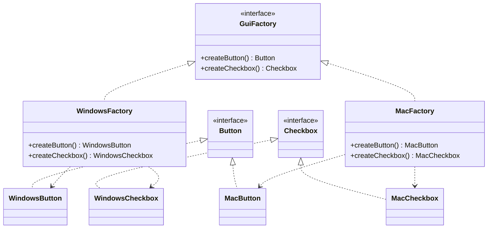

# Abstract Factory — Families of Related Products

**Date:** 2026-05-02 | **Updated:** 2026-05-02
**Tags:** `low-level-design` `design-patterns` `creational` `abstract-factory` `polymorphism`

## Summary

Abstract Factory provides an interface for creating *families of related or dependent objects* without specifying their concrete classes. The classic motivation is a GUI toolkit where every widget — button, scrollbar, menu, dialog — must match one platform's look-and-feel; mixing a Mac button with a Windows scrollbar is incoherent. Abstract Factory ensures the entire family ships together.

## Intent

From GoF (1994): *Provide an interface for creating families of related or dependent objects without specifying their concrete classes.*

The crucial word is *family*. Factory Method makes one product; Abstract Factory makes a coordinated set of products that must be used together.

## Structure



The factory interface declares one creation method per product type. Each concrete factory produces a coordinated set of products belonging to the same variant.

## Java Implementation

### GUI toolkit example

```java
interface Button {
    void render();
}
interface Checkbox {
    void render();
}

class WindowsButton implements Button {
    public void render() { /* native Win32 chrome */ }
}
class WindowsCheckbox implements Checkbox {
    public void render() { /* native Win32 chrome */ }
}

class MacButton implements Button {
    public void render() { /* AppKit chrome */ }
}
class MacCheckbox implements Checkbox {
    public void render() { /* AppKit chrome */ }
}

interface GuiFactory {
    Button createButton();
    Checkbox createCheckbox();
}

class WindowsFactory implements GuiFactory {
    public Button   createButton()   { return new WindowsButton(); }
    public Checkbox createCheckbox() { return new WindowsCheckbox(); }
}

class MacFactory implements GuiFactory {
    public Button   createButton()   { return new MacButton(); }
    public Checkbox createCheckbox() { return new MacCheckbox(); }
}
```

### Client code

```java
class Application {
    private final Button button;
    private final Checkbox checkbox;

    Application(GuiFactory factory) {
        this.button   = factory.createButton();
        this.checkbox = factory.createCheckbox();
    }

    void render() {
        button.render();
        checkbox.render();
    }
}

class Main {
    public static void main(String[] args) {
        GuiFactory factory = isWindows() ? new WindowsFactory() : new MacFactory();
        new Application(factory).render();
    }
}
```

The `Application` never sees the platform-specific classes. It receives a `GuiFactory` and trusts that whatever comes out matches.

### Family invariants

The whole point of Abstract Factory is that the products *belong together*. If the factory could return `MacButton` and `WindowsCheckbox`, the pattern has lost its purpose. The interface signatures don't enforce family membership — discipline does. Two ways to harden this:

1. **Sealed factory interfaces with generics.**

   ```java
   sealed interface GuiFactory<V extends GuiVariant>
       permits WindowsFactory, MacFactory {
       Button<V> createButton();
       Checkbox<V> createCheckbox();
   }
   sealed interface GuiVariant permits WindowsVariant, MacVariant {}
   ```

   Now the *types* of the products are tagged with the variant, and a heterogeneous mix is a compile error.

2. **Treat the factory as a singleton per variant.** One `WindowsFactory` instance, one `MacFactory` instance, selected once at startup. There is then no way to mix.

## TypeScript Implementation

```typescript
interface Button { render(): void }
interface Checkbox { render(): void }

class WindowsButton implements Button { render() { /* ... */ } }
class WindowsCheckbox implements Checkbox { render() { /* ... */ } }
class MacButton implements Button { render() { /* ... */ } }
class MacCheckbox implements Checkbox { render() { /* ... */ } }

interface GuiFactory {
  createButton(): Button;
  createCheckbox(): Checkbox;
}

const windowsFactory: GuiFactory = {
  createButton: () => new WindowsButton(),
  createCheckbox: () => new WindowsCheckbox(),
};

const macFactory: GuiFactory = {
  createButton: () => new MacButton(),
  createCheckbox: () => new MacCheckbox(),
};

function buildApp(factory: GuiFactory) {
  return {
    button: factory.createButton(),
    checkbox: factory.createCheckbox(),
  };
}
```

In TypeScript the factory is most naturally an *object literal* whose methods are factory functions. No class hierarchy needed.

### Discriminated-union variant (compile-time family safety)

```typescript
type Platform = 'windows' | 'mac';

interface PlatformBundle<P extends Platform> {
  readonly platform: P;
  button: Button;
  checkbox: Checkbox;
}

function makeBundle(platform: Platform): PlatformBundle<Platform> {
  switch (platform) {
    case 'windows':
      return { platform, button: new WindowsButton(), checkbox: new WindowsCheckbox() };
    case 'mac':
      return { platform, button: new MacButton(), checkbox: new MacCheckbox() };
  }
}
```

The bundle is constructed atomically — there is no way to obtain a half-built mismatched family.

## Abstract Factory vs Factory Method

| Aspect | Factory Method | Abstract Factory |
|---|---|---|
| Granularity | One product per call | A family of related products |
| Mechanism | Subclass override of one method | An object with multiple creation methods |
| Variation axis | One product type varies | A whole "skin" or "platform" varies |
| Typical motivation | Subclass needs to inject its concrete type into a base algorithm | Switch an entire coordinated set of implementations as a unit |

Many Abstract Factories are *implemented as* a collection of Factory Methods on the same interface. The patterns aren't competing; they operate at different granularities.

## When to Use

- A system must work with multiple coordinated families of objects, and you need to swap families wholesale (look-and-feel skins, database vendors, cloud providers).
- You want to enforce that products from different variants cannot be mixed.
- You are building a plugin system where each plugin contributes a coordinated set of types.
- The variation axis is *the platform / theme / vendor*, not just one type.

## When NOT to Use

- Only one product type varies — use Factory Method or a static factory.
- There is only one family and only ever will be — the abstraction is empty.
- The "family" is really just two or three unrelated objects bundled by accident — that's a smell, not a family.
- The product family is so unstable that adding a new product type means updating every factory simultaneously. Each new product type is a breaking change to the factory interface — every concrete factory must implement it.

## Common Pitfalls

### 1. The "extension is hard" trap

Adding a new *variant* (a new platform) is easy: write one more concrete factory. Adding a new *product type* (a new widget) is hard: every existing factory must be updated. Choose Abstract Factory when product types are stable and variants change; reach for something else when product types churn.

### 2. Family contamination

Nothing in the basic interface prevents mixing `MacButton` with `WindowsCheckbox`. The pattern's promise — "everything matches" — relies on convention. Use sealed types, generics, or atomic bundle construction to enforce it.

### 3. Factory explosion

A naive implementation may have many concrete factories that differ in trivial ways. Consider parameterizing one factory implementation by a configuration object instead of subclassing for every variant.

### 4. Abstract Factory as a hidden DI container

Once you have a `GuiFactory` that creates everything, it becomes tempting to make it create *unrelated* things too. At that point you have reinvented a worse dependency-injection container. Stop and use Spring, Guice, or NestJS DI.

### 5. Confusing it with Builder

Abstract Factory creates *whole objects in one call*. Builder constructs *one object step by step*. Different problems, different shapes.

### 6. Tight coupling to the product interface

Clients that depend on the abstract factory still depend on the abstract product interfaces (`Button`, `Checkbox`). Those interfaces become a contract that ripples across all variants. Keep them small and stable.

## Real-World Examples

- **Java AWT/Swing pluggable look-and-feel** — `LookAndFeel` and the `UIDefaults` family. Switching Nimbus to Metal swaps an entire family of UI delegates.
- **`javax.xml.parsers.DocumentBuilderFactory`** — Returns a `DocumentBuilder` whose family of parser-related objects matches a chosen XML implementation.
- **`javax.xml.transform.TransformerFactory`** — Family of transformation-related objects.
- **JDBC `DataSource` and connection-pool implementations** — `Connection`, `Statement`, `ResultSet` form a family produced by a chosen vendor's driver.
- **Cloud-vendor SDKs** — AWS, GCP, and Azure each expose a family of clients whose methods must agree on credentials, region, and protocol versions.
- **GUI toolkits** — Qt's style system, GTK theming engines.
- **Game engines** — A "renderer factory" producing `Texture`, `Mesh`, `Shader` for a chosen graphics API (OpenGL, Vulkan, Metal).

## Related

- [`singleton.md`](singleton.md) — Abstract Factory implementations are very commonly singletons.
- [`builder.md`](builder.md) — Builder constructs one complex object; Abstract Factory makes families of simpler ones.
- [`factory-method.md`](factory-method.md) — Each method on an Abstract Factory is essentially a Factory Method; the patterns nest.
- [`prototype.md`](prototype.md) — A Prototype-based registry can implement an Abstract Factory by cloning per-variant prototypes.
- [`../structural/`](../structural/) — Adapter is often used to fit a foreign vendor's family into your factory's interface.
- [`../behavioral/`](../behavioral/) — Strategy objects are often produced by an Abstract Factory.
- [`../../oop-fundamentals/inheritance.md`](../../oop-fundamentals/inheritance.md) — The interface-implementation hierarchy underpins the pattern.
- [`../../oop-fundamentals/polymorphism.md`](../../oop-fundamentals/polymorphism.md) — Polymorphic dispatch lets the client treat all variants uniformly.
- [`../../solid/`](../../solid/) — The Open-Closed Principle is the design force behind Abstract Factory; the Interface Segregation Principle constrains how big a factory may grow.

## References

- Gamma, Helm, Johnson, Vlissides. *Design Patterns: Elements of Reusable Object-Oriented Software*, 1994 — original Abstract Factory pattern, with the look-and-feel example.
- Bloch, Joshua. *Effective Java* (3rd ed.) — Item 1 discusses static factory methods, which often *implement* the operations of an Abstract Factory.
- Java SE platform documentation — `DocumentBuilderFactory`, `TransformerFactory`, `LookAndFeel`.
