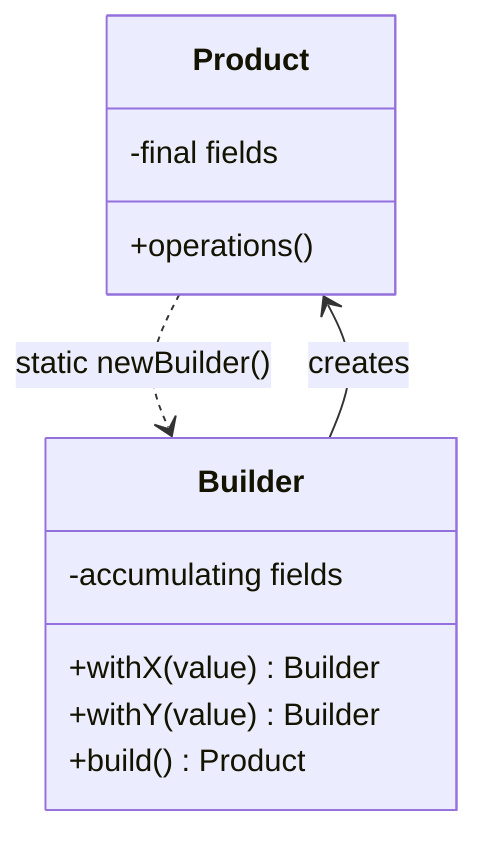
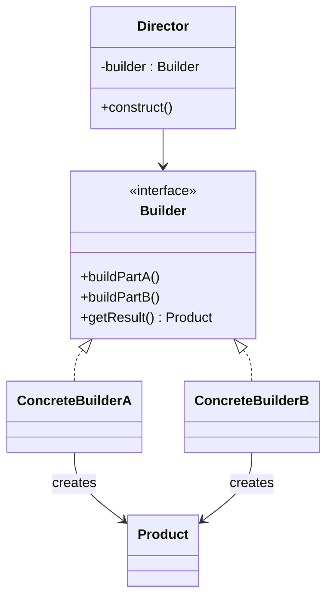

# Builder — Step-by-Step Object Construction

**Date:** 2026-05-02 | **Updated:** 2026-05-02
**Tags:** `low-level-design` `design-patterns` `creational` `builder` `immutability`

## Summary

Builder separates the *construction* of a complex object from its *representation*, letting the same construction process produce different results. In modern code the most common form is the fluent immutable builder — a small mutable helper that accumulates parameters and finally produces an immutable target. It is the standard answer to "this constructor has too many parameters."

## Intent

From GoF (1994): *Separate the construction of a complex object from its representation so that the same construction process can create different representations.*

In practice, most applications use a simplified version: a single Builder produces a single product type. The full GoF form — with a `Director` orchestrating a sequence of `Builder` calls — is mostly seen in document generators, query builders, and parsers.

## Structure

### Simplified (typical) form



### GoF form with Director



The Director knows *the recipe*. Concrete Builders know *the materials*. Same recipe, different products.

## Java Implementation

### Fluent immutable builder (Effective Java Item 2)

```java
public final class HttpRequest {
    private final URI uri;
    private final String method;
    private final Map<String, String> headers;
    private final Duration timeout;
    private final byte[] body;

    private HttpRequest(Builder b) {
        this.uri     = Objects.requireNonNull(b.uri, "uri");
        this.method  = b.method;
        this.headers = Map.copyOf(b.headers);
        this.timeout = b.timeout;
        this.body    = b.body == null ? null : b.body.clone();
    }

    public static Builder newBuilder(URI uri) {
        return new Builder(uri);
    }

    public static final class Builder {
        private URI uri;
        private String method = "GET";
        private Map<String, String> headers = new LinkedHashMap<>();
        private Duration timeout = Duration.ofSeconds(30);
        private byte[] body;

        private Builder(URI uri) { this.uri = uri; }

        public Builder method(String m)      { this.method = m; return this; }
        public Builder header(String k, String v) { headers.put(k, v); return this; }
        public Builder timeout(Duration d)   { this.timeout = d; return this; }
        public Builder body(byte[] b)        { this.body = b; return this; }

        public HttpRequest build() {
            if (body != null && method.equals("GET")) {
                throw new IllegalStateException("GET cannot have a body");
            }
            return new HttpRequest(this);
        }
    }
}

HttpRequest req = HttpRequest.newBuilder(URI.create("https://api.example.com"))
    .method("POST")
    .header("Content-Type", "application/json")
    .timeout(Duration.ofSeconds(5))
    .body(payload)
    .build();
```

Key properties:

- `uri` is required (constructor of the builder) — the type system, not a runtime check, ensures it.
- `build()` is where invariants are validated — never trust intermediate state.
- The product is fully immutable; the builder is mutable scratch space.
- Defensive copies (`Map.copyOf`, `body.clone()`) prevent later mutation of a builder field from leaking into the product.

### Telescoping constructor — what Builder replaces

```java
// Don't do this.
public HttpRequest(URI uri) { this(uri, "GET"); }
public HttpRequest(URI uri, String method) { this(uri, method, Map.of()); }
public HttpRequest(URI uri, String method, Map<String,String> h) { ... }
public HttpRequest(URI uri, String method, Map<String,String> h, Duration t) { ... }
// ... and so on, until you have eight overloads and a 12-parameter constructor.
```

The call site becomes unreadable: `new HttpRequest(uri, "POST", headers, timeout, null, true, false, payload)`. Which boolean is which?

### Lombok `@Builder`

```java
@Value
@Builder
public class HttpRequest {
    URI uri;
    @Builder.Default String method = "GET";
    @Singular Map<String, String> headers;
    @Builder.Default Duration timeout = Duration.ofSeconds(30);
    byte[] body;
}

HttpRequest req = HttpRequest.builder()
    .uri(URI.create("https://api.example.com"))
    .method("POST")
    .header("Content-Type", "application/json")
    .timeout(Duration.ofSeconds(5))
    .body(payload)
    .build();
```

`@Singular` generates `header(k, v)` (singular adder) and `headers(map)` (collection setter). `@Builder.Default` honors initializers when the caller skips a field. Caveat: Lombok-generated builders do *not* enforce required fields at compile time the way a hand-written `newBuilder(URI uri)` does.

## TypeScript Implementation

### Fluent builder

```typescript
class HttpRequestBuilder {
  private method = 'GET';
  private headers: Record<string, string> = {};
  private timeoutMs = 30_000;
  private body?: Uint8Array;

  constructor(private readonly uri: URL) {}

  setMethod(m: string) { this.method = m; return this; }
  addHeader(k: string, v: string) { this.headers[k] = v; return this; }
  setTimeout(ms: number) { this.timeoutMs = ms; return this; }
  setBody(b: Uint8Array) { this.body = b; return this; }

  build(): HttpRequest {
    return Object.freeze({
      uri: this.uri,
      method: this.method,
      headers: { ...this.headers },
      timeoutMs: this.timeoutMs,
      body: this.body,
    });
  }
}

interface HttpRequest {
  readonly uri: URL;
  readonly method: string;
  readonly headers: Readonly<Record<string, string>>;
  readonly timeoutMs: number;
  readonly body?: Uint8Array;
}
```

### Object literal with defaults — TypeScript's "no-builder" alternative

```typescript
interface HttpRequestInit {
  uri: URL;
  method?: string;
  headers?: Record<string, string>;
  timeoutMs?: number;
  body?: Uint8Array;
}

function makeHttpRequest(init: HttpRequestInit): HttpRequest {
  return Object.freeze({
    uri: init.uri,
    method: init.method ?? 'GET',
    headers: { ...(init.headers ?? {}) },
    timeoutMs: init.timeoutMs ?? 30_000,
    body: init.body,
  });
}

const req = makeHttpRequest({
  uri: new URL('https://api.example.com'),
  method: 'POST',
  timeoutMs: 5_000,
});
```

In TypeScript, named parameters via object literals usually beat the fluent builder pattern. The exception is when you need *step-by-step* construction across function boundaries — that's where a real builder still pays for itself.

### Type-state literal builder (compile-time required-field enforcement)

```typescript
class TypedBuilder<HasUri extends boolean = false> {
  private state: Partial<HttpRequest> = {};

  uri(u: URL): TypedBuilder<true> {
    this.state.uri = u;
    return this as unknown as TypedBuilder<true>;
  }

  method(m: string): this { this.state.method = m; return this; }

  build(this: TypedBuilder<true>): HttpRequest {
    return { ...this.state, method: this.state.method ?? 'GET' } as HttpRequest;
  }
}

// new TypedBuilder().build();          // type error: build() requires uri()
new TypedBuilder().uri(new URL('https://x.com')).build(); // OK
```

The phantom type parameter tracks which required fields have been set. Calling `build()` before `uri()` is a compile-time error, not a runtime exception.

## When to Use

- Constructors with more than three or four parameters, especially when several are optional.
- Construction must validate cross-field invariants ("if `body` is set, `method` cannot be GET").
- The product is immutable but built from many sources over multiple lines.
- The same recipe produces multiple representations (the GoF Director form — e.g., document → HTML, document → PDF).
- DSL-like APIs: SQL builders, query builders, HTTP clients.

## When NOT to Use

- Two or three required fields, no optional ones — a constructor is plainer and shorter.
- The object is mutable and frequently reconfigured — just expose setters.
- TypeScript code that would be just as clear with an object literal.
- When build-time validation is the only reason — a static factory method (Effective Java Item 1) may be enough.

## Common Pitfalls

### 1. Mutable product

If the builder hands out direct references to its internal collections, the "immutable" product becomes silently mutable. Always defensive-copy in `build()`.

### 2. Reusing a builder

Calling `build()` twice on the same builder is fine *if* you defensive-copy. If not, the second product shares state with the first. Document the contract; a fresh builder per build is the safe default.

### 3. Validation in setters

Validation belongs in `build()`, not in setters. Setters are called in arbitrary order; cross-field invariants cannot be checked until all fields are present.

### 4. Required vs optional confusion

If everything is optional and the builder is happy to build a half-empty product, the type system has stopped helping. Promote required fields to constructor parameters of the builder, or use a type-state pattern.

### 5. Inheritance + Builder

Inheriting the product type while inheriting a `Builder` cleanly is hard in Java due to self-typing limitations. The "curiously recurring template pattern" approach (`Builder<T extends Builder<T>>`) works but is heavy. Often, prefer composition over inheritance for the product.

### 6. Lombok `@Builder` defaults silently dropped

Without `@Builder.Default`, the field initializer is *not* applied — the field gets the type's zero value. This burns people regularly.

## Real-World Examples

- **`java.net.http.HttpRequest.Builder`** — Java's built-in HTTP client (JDK 11+).
- **`java.lang.StringBuilder` / `StringBuffer`** — A degenerate but real builder (mutable accumulator → immutable `String`).
- **Apache Lucene `Query` builders** — `BooleanQuery.Builder`, `PhraseQuery.Builder`.
- **Protocol Buffers generated `Builder` classes** — Each message has a generated mutable builder and an immutable product.
- **Lombok `@Builder`, `@SuperBuilder`** — Annotation-driven builders for plain Java classes.
- **SQL query builders** — jOOQ, Knex.js, Kysely.

## Related

- [`singleton.md`](singleton.md) — Static factory methods are the simpler counterpart when only a few parameters exist.
- [`factory-method.md`](factory-method.md) — Often used inside `build()` to instantiate the right product subtype.
- [`abstract-factory.md`](abstract-factory.md) — Builders sometimes wrap an Abstract Factory for parts.
- [`prototype.md`](prototype.md) — A builder seeded from a prototype is a common configuration pattern.
- [`../structural/`](../structural/) — Composite trees are frequently assembled via builders.
- [`../behavioral/`](../behavioral/) — Iterator-driven directors exist; rare but real.
- [`../../oop-fundamentals/encapsulation.md`](../../oop-fundamentals/encapsulation.md) — Builder is the standard tool for preserving encapsulation across many parameters.
- [`../../solid/`](../../solid/) — Builders help honor the Single Responsibility Principle by separating construction from behavior.

## References

- Gamma, Helm, Johnson, Vlissides. *Design Patterns: Elements of Reusable Object-Oriented Software*, 1994 — original Builder pattern with Director.
- Bloch, Joshua. *Effective Java* (3rd ed.) — Item 2: "Consider a builder when faced with many constructor parameters."
- Lombok project documentation — `@Builder`, `@SuperBuilder`, `@Singular`.
