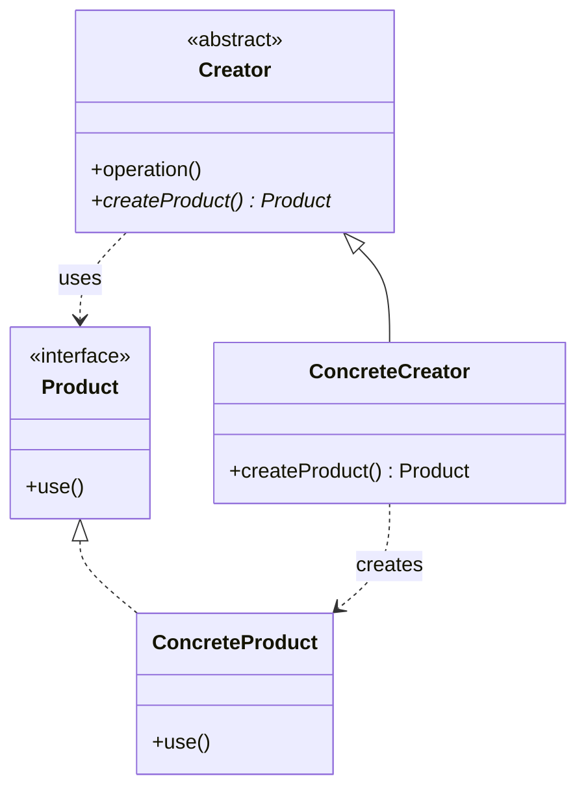

# Factory Method — Subclass Decides the Concrete Type

**Date:** 2026-05-02 | **Updated:** 2026-05-02
**Tags:** `low-level-design` `design-patterns` `creational` `factory-method` `polymorphism`

## Summary

Factory Method defines an interface for creating an object but lets subclasses decide which concrete class to instantiate. It is a polymorphism-based answer to the question "what type should we `new` here?" — by deferring the answer to a subclass that knows. In modern code it is most visible as a *template-method-style hook*: a base class implements an algorithm and calls `createX()` at the right moment, expecting subclasses to fill in the concrete type.

## Intent

From GoF (1994): *Define an interface for creating an object, but let subclasses decide which class to instantiate. Factory Method lets a class defer instantiation to subclasses.*

The motivating constraint: a base class needs to produce some product as part of its work, but it cannot — and should not — know the concrete product type. A subclass can.

## Structure



The asterisk on `createProduct()` marks it abstract. The base class's `operation()` calls `createProduct()` polymorphically — so subclasses inject the concrete type into the algorithm without rewriting the algorithm.

## Java Implementation

### Classic GoF form

```java
abstract class DialogBox {
    public final void render() {
        Button ok = createButton("OK");
        Button cancel = createButton("Cancel");
        layout(ok, cancel);
        show();
    }

    protected abstract Button createButton(String label);

    private void layout(Button... buttons) { /* ... */ }
    private void show() { /* ... */ }
}

class WindowsDialogBox extends DialogBox {
    @Override
    protected Button createButton(String label) {
        return new WindowsButton(label);
    }
}

class MacDialogBox extends DialogBox {
    @Override
    protected Button createButton(String label) {
        return new MacButton(label);
    }
}
```

`DialogBox.render()` is the algorithm. `createButton` is the hook. Each platform supplies its own button subclass, and the base class never learns about Windows or Mac.

### Static factory methods (Effective Java Item 1)

A *static factory method* is a related but distinct idea. It is not the GoF pattern; it is a constructor alternative on a single class:

```java
public final class BigInteger {
    public static BigInteger valueOf(long val) { /* may return cached instance */ }
    public static BigInteger probablePrime(int bitLength, Random rnd) { /* ... */ }
}

public interface List<E> {
    static <E> List<E> of(E... elements) { /* immutable list */ }
    static <E> List<E> copyOf(Collection<? extends E> coll) { /* ... */ }
}
```

Bloch's Item 1 lists the advantages over constructors:

1. **They have names.** `BigInteger.probablePrime(bits, rnd)` reads better than `new BigInteger(bits, certainty, rnd)`.
2. **They are not required to create a new object.** `Boolean.valueOf(true)` returns a cached `Boolean.TRUE`. `Integer.valueOf(127)` returns a cached instance.
3. **They can return a subtype of their declared return type.** `Collections.unmodifiableList(...)` returns a hidden private subtype.
4. **The class of the returned object can vary by input.** `EnumSet.of(...)` returns a `RegularEnumSet` for ≤64 elements, `JumboEnumSet` otherwise.
5. **The class of the returned object need not exist when the static factory is written.** This is how JDBC, JNDI, and the Java service-loader work.

Disadvantages: classes without `public` or `protected` constructors cannot be subclassed, and static factories are harder to find in Javadoc than constructors.

### Spring `BeanFactory` and `FactoryBean`

Spring uses factory-method ideas pervasively:

```java
@Configuration
class Beans {
    @Bean
    public DataSource dataSource(Environment env) {
        if ("prod".equals(env.getProperty("profile"))) {
            return new HikariDataSource(/* prod config */);
        }
        return new H2DataSource();
    }
}
```

`@Bean`-annotated methods are factory methods. The container calls them when a `DataSource` is needed, and the method decides the concrete implementation based on configuration. The `FactoryBean<T>` interface is a more explicit form: an object whose job is to produce another object on demand.

### When Factory Method beats `new`

`new` is a static commitment to a concrete class. Factory Method beats it when:

- The concrete type is selected by *runtime* configuration (env, feature flag, plugin discovery).
- The instance is *cached or pooled* — `valueOf` can return a shared instance; `new` cannot.
- The base class implements an algorithm that varies only in *what kind of part* it creates.
- You want subclasses or test doubles to substitute the produced type without touching the algorithm.

`new` is fine when none of those apply. Don't add a factory just to look enterprise.

## TypeScript Implementation

### Classic form with abstract class

```typescript
abstract class DialogBox {
  render(): void {
    const ok = this.createButton('OK');
    const cancel = this.createButton('Cancel');
    this.layout(ok, cancel);
    this.show();
  }

  protected abstract createButton(label: string): Button;

  private layout(...buttons: Button[]) { /* ... */ }
  private show() { /* ... */ }
}

class WebDialogBox extends DialogBox {
  protected createButton(label: string): Button {
    return new HtmlButton(label);
  }
}
```

### Function-based factory

TypeScript's first-class functions often replace the subclass-based form:

```typescript
type ButtonFactory = (label: string) => Button;

function renderDialog(makeButton: ButtonFactory): void {
  const ok = makeButton('OK');
  const cancel = makeButton('Cancel');
  // layout, show
}

renderDialog(label => new HtmlButton(label));
renderDialog(label => new NativeButton(label));
```

This is a function-shaped Factory Method. The "subclass" is replaced by "the function you pass in." For most TypeScript code this is plainer than an abstract class hierarchy.

### Static factory methods

```typescript
class User {
  private constructor(
    public readonly id: string,
    public readonly email: string,
  ) {}

  static fromDb(row: { id: string; email: string }): User {
    return new User(row.id, row.email);
  }

  static newRegistration(email: string): User {
    return new User(crypto.randomUUID(), email.toLowerCase().trim());
  }
}
```

Two named factories convey *intent* (`fromDb`, `newRegistration`) that two overloaded constructors could not.

## When to Use

- A base class implements a stable algorithm but the *exact product type* it should create varies by subclass, plugin, or environment.
- You need to return cached instances, subtypes, or proxies — anything beyond "construct a fresh object of this exact class."
- You want to swap implementations through configuration rather than recompilation.
- You need named alternative constructors that convey intent (`User.fromDb` vs `User.newRegistration`).
- A library wants extension points without exposing internal types.

## When NOT to Use

- The concrete type is fixed and obvious. Just call `new`.
- There is only one implementation and only ever will be. A factory adds indirection without adding flexibility.
- A simple function literal would do the job in TypeScript or other function-first languages.
- The "factory" is a one-line wrapper around `new` with no other logic. That's ceremony, not design.

## Common Pitfalls

### 1. Factory that hides only `new`

```java
public class UserFactory {
    public User create(String email) {
        return new User(email);
    }
}
```

If the factory adds nothing — no caching, no subtype selection, no validation, no test seam — delete it.

### 2. Subclassing for the wrong reason

If you only override `createX()` and nothing else, prefer composition (inject the factory) over inheritance (subclass the creator). It is more flexible and avoids deep hierarchies.

### 3. Confusing Factory Method with Abstract Factory

Factory Method makes *one* product. Abstract Factory makes a *family* of related products. See [`abstract-factory.md`](abstract-factory.md).

### 4. Returning concrete types

If a factory returns `ArrayList<T>` instead of `List<T>`, callers depend on the implementation. Always return the most general useful type.

### 5. Static factories that block subclassing

If the only constructor is private and used only by static factories, subclassing the class is impossible. Sometimes you want that; sometimes you have just painted yourself into a corner.

### 6. Hidden side effects in factories

Callers expect a factory to *produce* an object. If it also writes to a database, opens a socket, or registers global listeners, that surprise will eventually break someone.

## Real-World Examples

- **`java.util.Collections.unmodifiableList`, `Collections.synchronizedList`** — Static factories returning hidden wrapper subtypes.
- **`java.util.EnumSet.of(...)`** — Returns different concrete classes (`RegularEnumSet`, `JumboEnumSet`) based on input size.
- **`Integer.valueOf(int)`** — Returns cached instances for small values.
- **`java.nio.charset.Charset.forName(String)`** — Locates a charset by name from registered providers.
- **JDBC `DriverManager.getConnection(url)`** — Selects a registered driver based on URL.
- **Spring `@Bean` methods** — Factory methods managed by the container.
- **`java.util.ServiceLoader`** — Reflective factory over registered services.
- **Logback / SLF4J `LoggerFactory.getLogger(Class)`** — Returns a `Logger` whose concrete class depends on the bound backend.

## Related

- [`singleton.md`](singleton.md) — `getInstance()` is a degenerate static factory method that always returns the same instance.
- [`builder.md`](builder.md) — Builders use factory methods internally to instantiate the right product subtype.
- [`abstract-factory.md`](abstract-factory.md) — The "family of products" sibling pattern; often built *out of* factory methods.
- [`prototype.md`](prototype.md) — `clone()` on a registered prototype is an alternative to a factory method when shape varies more than type.
- [`../structural/`](../structural/) — Decorators and Adapters are commonly produced by factory methods.
- [`../behavioral/`](../behavioral/) — Strategy objects are routinely produced by factories.
- [`../../oop-fundamentals/inheritance.md`](../../oop-fundamentals/inheritance.md) — Factory Method depends on subtype polymorphism.
- [`../../oop-fundamentals/polymorphism.md`](../../oop-fundamentals/polymorphism.md) — The mechanism behind dispatch from `Creator.operation()` to `ConcreteCreator.createProduct()`.

## References

- Gamma, Helm, Johnson, Vlissides. *Design Patterns: Elements of Reusable Object-Oriented Software*, 1994 — original Factory Method pattern.
- Bloch, Joshua. *Effective Java* (3rd ed.) — Item 1: "Consider static factory methods instead of constructors."
- Spring Framework reference documentation — `BeanFactory`, `FactoryBean<T>`, `@Bean`.
