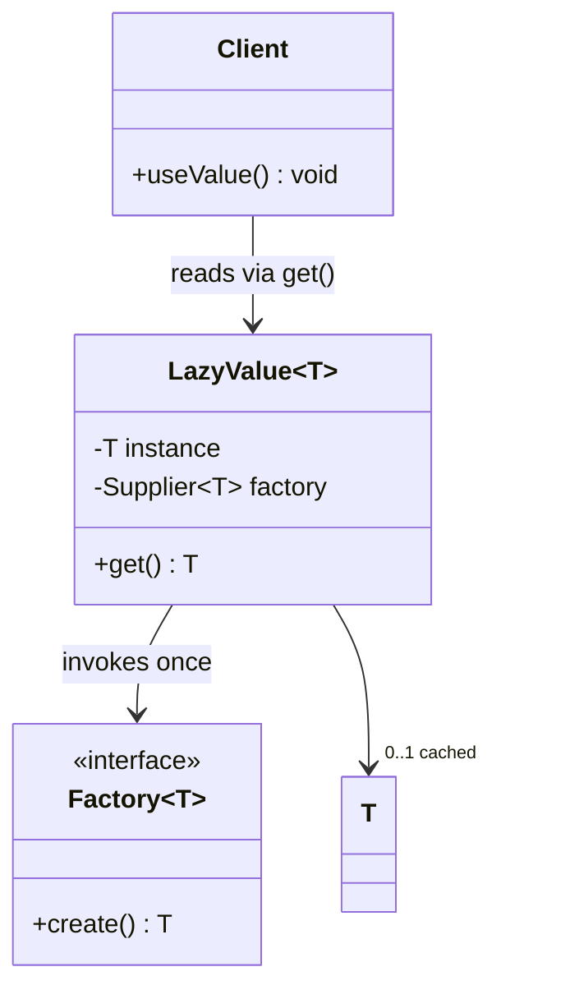

# Lazy Initialization Pattern

**Date:** 2026-05-02 | **Updated:** 2026-05-02
**Tags:** `low-level-design` `design-patterns` `creational` `concurrency` `memoization`

## Summary

Lazy Initialization defers the creation, computation, or loading of an object until the first time it is actually needed. Instead of paying the cost up-front during application startup or container construction, the cost is paid the first time a caller asks for the value, and never again afterwards.

The pattern shows up at every layer of a system: a singleton that does not allocate its database connection pool until the first query, a `Map` that fills in entries on miss, a JVM class that is not loaded until first reference, a property whose getter computes the value on demand and caches it. The hard part is rarely the laziness itself — it is making the laziness *correct under concurrency* without paying for synchronization on every read.

## Table of Contents

- Intent / Problem
- Structure (Mermaid classDiagram)
- Class Skeletons (Java)
- Thread-Safe Variants
  - Synchronized accessor
  - Double-Checked Locking with `volatile`
  - Initialization-on-Demand Holder (Bill Pugh)
  - `Supplier<T>` memoization
  - `Lazy<T>` in C# / .NET
- Multiton: Lazy + Singleton per key
- TypeScript: Lazy Property and Library `lazy()`
- When to Use / When NOT
- Pitfalls
- Related
- References

## Intent / Problem

Some objects are expensive to construct: they open files, hit the network, parse a large config, allocate big buffers, or compile a regex. Other objects are cheap to declare but only used in a fraction of program runs — a debug subsystem, a rarely-touched export module, an admin-only feature.

Eager initialization wastes time and memory for things that may never be used, and makes startup slower than it needs to be. It also forces failures to surface during construction even when the failing component is not on the current code path.

Lazy initialization solves this by separating *declaration* from *first use*. The declaration is cheap; the first call to the accessor triggers the real work and stores the result; every subsequent call returns the cached value.

The trade-offs the pattern must navigate:

- **Concurrency**: two threads calling the accessor for the first time at the same instant must not produce two instances or partially-constructed state.
- **Branch cost on the hot path**: the cached-path read must not be slower than a plain field access.
- **Failure handling**: if construction fails, does the next call retry, or stay broken?
- **Reasoning**: lazy values move work to surprising places (the first request handler pays the cost) and complicate debugging.

## Structure (Mermaid classDiagram)



The lazy value owns three things: a reference to a factory, a slot for the cached instance, and the synchronization needed to ensure the factory runs at most once.

## Class Skeletons (Java)

### Plain (single-threaded) lazy field

```java
public final class ReportEngine {
    private ExpensiveParser parser;

    public ParsedReport parse(String input) {
        if (parser == null) {
            parser = new ExpensiveParser();
        }
        return parser.parse(input);
    }
}
```

Correct only when access is single-threaded. Two threads can both observe `parser == null` and both construct a parser; one wins, the other's work is wasted, and any side effects of construction may have happened twice.

### Synchronized accessor

```java
public final class ReportEngine {
    private ExpensiveParser parser;

    public synchronized ExpensiveParser getParser() {
        if (parser == null) {
            parser = new ExpensiveParser();
        }
        return parser;
    }
}
```

Thread-safe and simple. The cost is that *every* read takes the monitor, even after the parser is built. For a hot accessor this is unacceptable; for a once-per-request accessor it is fine.

## Thread-Safe Variants

### Double-Checked Locking with `volatile`

The classic optimisation: check without the lock, then lock and re-check before constructing.

```java
public final class ReportEngine {
    private volatile ExpensiveParser parser;

    public ExpensiveParser getParser() {
        ExpensiveParser local = parser;
        if (local == null) {
            synchronized (this) {
                local = parser;
                if (local == null) {
                    local = new ExpensiveParser();
                    parser = local;
                }
            }
        }
        return local;
    }
}
```

`volatile` is mandatory in Java. Without it, the constructed object's fields can become visible to a reader *before* the reference assignment, leading to the reader observing a partially-initialised object. The local variable avoids re-reading the volatile field on the hot path.

This pattern was famously broken before Java 5; the Java Memory Model (JMM) revisions in 5+ make it work *only* with `volatile`. Older code without `volatile` should be treated as a bug.

### Initialization-on-Demand Holder (Bill Pugh idiom)

The cleanest thread-safe lazy singleton in Java relies on the JVM's class-loading guarantees:

```java
public final class ReportEngine {
    private ReportEngine() {}

    private static final class Holder {
        static final ReportEngine INSTANCE = new ReportEngine();
    }

    public static ReportEngine getInstance() {
        return Holder.INSTANCE;
    }
}
```

The `Holder` class is not loaded until `getInstance()` is first called. Class initialisation is performed by the JVM under an internal lock, exactly once, with full happens-before guarantees. No `volatile`, no double-checked locking, no manual synchronization on the hot path. This is the recommended idiom for lazy singletons in modern Java.

### `Supplier<T>` memoization

When the lazy value is a field of a non-singleton object, wrap a `Supplier`:

```java
public final class Memoized<T> implements Supplier<T> {
    private final Supplier<T> factory;
    private volatile T value;
    private volatile boolean computed;

    public Memoized(Supplier<T> factory) {
        this.factory = factory;
    }

    @Override
    public T get() {
        if (!computed) {
            synchronized (this) {
                if (!computed) {
                    value = factory.get();
                    computed = true;
                }
            }
        }
        return value;
    }
}
```

Usage:

```java
private final Supplier<ExpensiveParser> parser =
    new Memoized<>(ExpensiveParser::new);

public ParsedReport parse(String input) {
    return parser.get().parse(input);
}
```

Guava ships `Suppliers.memoize(Supplier)` with the same semantics; prefer it when Guava is already a dependency rather than rolling your own.

### `Lazy<T>` in C# / .NET

.NET ships a first-class lazy primitive:

```csharp
private static readonly Lazy<ExpensiveParser> parser =
    new Lazy<ExpensiveParser>(() => new ExpensiveParser(),
                              LazyThreadSafetyMode.ExecutionAndPublication);

public ParsedReport Parse(string input) => parser.Value.Parse(input);
```

`LazyThreadSafetyMode` lets the caller pick the trade-off: `None` (single-threaded), `PublicationOnly` (multiple constructions allowed, only one published), or `ExecutionAndPublication` (factory runs at most once).

Java does not have a built-in `Lazy<T>`; the holder idiom and `Suppliers.memoize` are the canonical replacements.

## Multiton: Lazy + Singleton per key

A *Multiton* is a Singleton parameterised by a key: one instance per `(class, key)` pair, created lazily on first request.

```java
public final class CurrencyFormatterRegistry {
    private static final Map<Locale, NumberFormat> CACHE = new ConcurrentHashMap<>();

    private CurrencyFormatterRegistry() {}

    public static NumberFormat forLocale(Locale locale) {
        return CACHE.computeIfAbsent(locale, NumberFormat::getCurrencyInstance);
    }
}
```

`ConcurrentHashMap.computeIfAbsent` handles the laziness and thread safety in one call: the factory runs at most once per key. This is the modern Java answer to the Multiton pattern — there is no need for a custom registry class with manual locking.

Multitons share Singleton's drawbacks at scale (global state, harder testing, hidden coupling), and add one more: unbounded key spaces leak memory. Always pair a Multiton with a bounded cache (`Caffeine`, `LinkedHashMap` with eviction) when keys are not a fixed enum.

## TypeScript: Lazy Property and Library `lazy()`

A lazy getter that caches into the instance:

```ts
class ReportEngine {
  private _parser?: ExpensiveParser;

  get parser(): ExpensiveParser {
    if (!this._parser) {
      this._parser = new ExpensiveParser();
    }
    return this._parser;
  }
}
```

JavaScript is single-threaded per agent (worker), so no synchronization is required for in-process lazy fields. The pattern still pays off for startup time, memory, and rarely-used branches.

A common micro-pattern is the self-overwriting getter:

```ts
class ReportEngine {
  get parser(): ExpensiveParser {
    const value = new ExpensiveParser();
    Object.defineProperty(this, "parser", { value, writable: false });
    return value;
  }
}
```

The first read replaces the getter with a plain data property — subsequent reads are free.

In React, `React.lazy(() => import("./HeavyChart"))` is the canonical lazy-loading primitive: the component bundle is not fetched until the component is actually rendered. Many other ecosystems (Lodash's `_.memoize`, Reselect's memoised selectors) provide variants of the same idea: defer + cache.

## When to Use / When NOT

**Use lazy initialization when:**

- Construction is genuinely expensive (I/O, parsing, large allocation, network).
- The value is used in a minority of code paths or runs.
- The value depends on context not available at construction time (config, user, request).
- Startup time matters and the value is not on the critical path.

**Do NOT use lazy initialization when:**

- Construction is cheap (the branch and synchronization cost dominate the saving).
- The value is needed by every request: just construct it eagerly and skip the check.
- Initialization *must* succeed at startup (fail fast) — a lazy failure surfaces in production traffic instead of in CI.
- The hot path cannot tolerate the predictable-but-non-zero cost of the cached-branch check.
- The value's failure behaviour is "retry forever on every call" — a half-broken lazy can hide upstream problems.

A useful smell: if you find yourself asking "should I warm this up at startup?", you have already given back most of what laziness was buying you. Pick eager.

## Pitfalls

**Forgetting `volatile` in DCL.** Java's memory model requires `volatile` for the reference written under double-checked locking. Without it, the pattern is broken on every modern CPU; the bug is rare in tests, common under production load.

**Catching and caching exceptions.** If construction throws, you usually want the *next* call to retry, not to keep returning a cached failure. Decide explicitly: store the exception, store nothing (so the next call retries), or fail the whole component (mark the lazy as poisoned). Silent retry can mask configuration errors that should crash the service.

**Re-entrant initialization.** A factory that, while constructing, ends up calling the same accessor recursively will either deadlock (synchronized variants), infinite-loop (naive variants), or observe a partially-constructed object (DCL with bugs). Treat factories as no-recursion zones.

**Lazy values in tests.** Tests that mutate global state, then construct a lazy singleton, then run again, see the *cached* value from the first test. Either reset the lazy between tests, scope it to the test, or avoid singletons in tests entirely.

**Hidden cost on the first request.** The first user to hit the lazy path pays the construction cost. For cold-start-sensitive systems (serverless, low-traffic admin endpoints), measure tail latency, not just average. Sometimes a startup warm-up call is worth more than the laziness saved.

**Memory leaks via Multitons.** Lazy registries keyed by an unbounded space (request id, user input, generated string) grow forever. Bound them.

**Misuse as global cache.** `Suppliers.memoize` is a one-shot, never-invalidated cache. It is *not* a TTL cache, *not* a size-bounded cache, *not* a refresh-on-write cache. Reach for Caffeine, Guava cache, or your platform's cache primitive when those properties are needed.

**Branch cost.** A lazy field is a check on every access. For tight loops, hoist the read into a local variable so the JIT can prove the null check away:

```java
ExpensiveParser p = parser; // hoisted
for (String input : batch) p.parse(input);
```

## Related

Siblings under the same directory:

- [singleton.md](./singleton.md) — Lazy initialization is the standard implementation strategy for Singletons; the holder idiom is specifically designed for that combination.
- [factory-method.md](./factory-method.md) — A lazy field and a factory method often live together: the field caches what the factory built.
- [abstract-factory.md](./abstract-factory.md) — Family-of-factories where each factory itself may be lazy.
- [builder.md](./builder.md) — Builders construct eagerly when `build()` is called; lazy is the orthogonal "do not build until asked" axis.
- [object-pool.md](./object-pool.md) — A pool is *eager* about pool capacity but *lazy* about each individual object's first use.
- [prototype.md](./prototype.md) — Cloning is cheap; lazy is about avoiding the original construction.

Cross-category:

- [../structural/proxy.md](../structural/proxy.md) — A Virtual Proxy is the structural form of lazy initialization: a stand-in object that constructs the real subject on first method call. Same idea, different implementation level.
- [../structural/flyweight.md](../structural/flyweight.md) — Flyweight registries are typically lazy Multitons over a shared-state key.
- [../behavioral/iterator.md](../behavioral/iterator.md) — Lazy iterators (Java `Stream`, Kotlin `Sequence`) defer per-element work, a related but distinct kind of laziness.
- [../additional/repository-pattern.md](../additional/repository-pattern.md) — Repositories often hold lazy connection pools or session factories.
- [../additional/concurrency-patterns.md](../additional/concurrency-patterns.md) — Background on `volatile`, happens-before, and the JMM rules that make DCL correct.

Principles:

- [../../solid/single-responsibility-principle.md](../../solid/single-responsibility-principle.md) — Wrapping initialization in a lazy holder keeps the using class focused on its real responsibility.
- [../../oop-fundamentals/encapsulation.md](../../oop-fundamentals/encapsulation.md) — Lazy fields hide the timing of construction behind the accessor; callers do not see the difference.
- [../../solid/dependency-inversion-principle.md](../../solid/dependency-inversion-principle.md) — Prefer injecting a `Supplier<T>` over hard-coding a lazy field when the value should be substitutable for tests.

## References

- *Effective Java* (Joshua Bloch) — Item on lazy initialization and the holder idiom.
- *Java Concurrency in Practice* (Brian Goetz et al.) — Chapter on safe publication; the DCL discussion and the JMM rules behind `volatile`.
- *Design Patterns* (Gamma, Helm, Johnson, Vlissides) — Singleton entry, where lazy initialization first appears as a named technique.
- Bill Pugh's writeup on the *Initialization-on-Demand Holder* idiom.
- Java Language Specification — class initialization rules (the "happens-before" guarantee that makes the holder idiom safe).
- .NET documentation — `System.Lazy<T>` and `LazyThreadSafetyMode`.
- Guava — `Suppliers.memoize` and `ConcurrentHashMap.computeIfAbsent` for the multiton variant.
- React documentation — `React.lazy` and code-splitting; the same shape applied to UI module loading.
