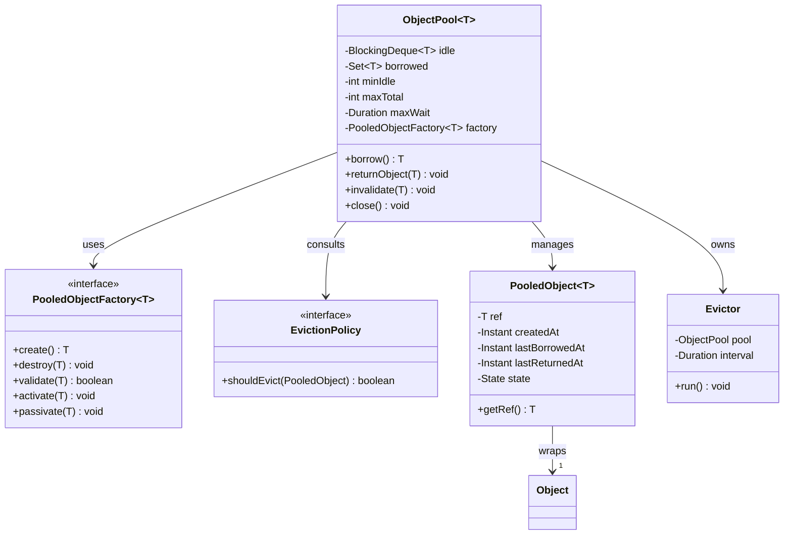

# Object Pool — Reuse Expensive-to-Create Instances

**Date:** 2026-05-02 | **Updated:** 2026-05-02
**Tags:** `low-level-design` `design-patterns` `creational` `resource-management` `performance`

## Summary

The **Object Pool** pattern manages a set of initialized, reusable objects so clients borrow an instance, use it, and return it instead of constructing a new one each time. It is a creational pattern whose value lies in amortizing high construction cost (TCP handshakes, TLS, authentication, native handles, large buffers) across many short-lived consumers.

This pattern is frequently confused with **thread pool**. The two are siblings, not synonyms: a thread pool reuses *workers* that execute submitted tasks; an object pool reuses *resources* (connections, sockets, byte buffers, heavy objects) that callers operate on directly. A web server typically runs both simultaneously — request threads from a thread pool, database connections from an object pool.

This document covers the canonical structure, the operational concerns that real implementations (Apache Commons Pool, HikariCP) address, and — equally important — the cases where a pool is the wrong answer.

## Table of Contents

- [Intent / Requirements](#intent--requirements)
- [Structure / Entities and Relationships](#structure--entities-and-relationships)
- [Class Skeletons (Java)](#class-skeletons-java)
- [Key Algorithms / Workflows](#key-algorithms--workflows)
- [Patterns Used](#patterns-used)
- [Concurrency Considerations](#concurrency-considerations)
- [Trade-offs and Extensions](#trade-offs-and-extensions)
- [Related](#related)
- [References](#references)

## Intent / Requirements

**Intent**: Reuse a bounded set of pre-initialized objects whose construction or destruction is too expensive to pay per use.

**When to use**:
- Constructing the resource costs orders of magnitude more than using it (DB connections, HTTPS clients with TLS state, native graphics contexts).
- The number of concurrent resources must be capped (database `max_connections`, OS file descriptor limits, license seats).
- Objects are stateless or can be cleanly **reset** between borrows.

**Functional requirements** of a typical pool:
1. **Borrow** — get a ready-to-use instance, blocking up to a timeout if none is available.
2. **Return** — release an instance back to the pool; pool decides keep vs destroy.
3. **Create / destroy** via a pluggable factory.
4. **Validate** instance health before handing it out (and optionally on return).
5. **Bound** the pool to `[minIdle, maxTotal]`; reject or block when saturated.
6. **Evict idle** objects after a configurable idle time.
7. **Detect leaks** (borrowed but never returned).
8. **Expose metrics** — active, idle, waiting, creation/eviction counts.

**Non-goals**:
- Sharing mutable state between callers. Each borrower must see a clean instance.
- Replacing memoization or caches keyed on input (the pool is keyless).
- Pooling cheap-to-construct objects (premature pessimization, see [trade-offs](#trade-offs-and-extensions)).

## Structure / Entities and Relationships



The factory encapsulates *what* the pooled object is; the pool encapsulates *how many* and *when*. This split — popularized by Apache Commons Pool's `PooledObjectFactory` — is what lets a single pool implementation serve connections, parsers, threads, or buffers without modification.

## Class Skeletons (Java)

```java
// Borrow-side contract: clients depend only on this.
public interface ObjectPool<T> extends AutoCloseable {
    T borrow() throws InterruptedException, PoolExhaustedException;
    void returnObject(T obj);
    void invalidate(T obj);
    @Override void close();
}

// Pluggable lifecycle hooks. Pool calls these; factory has no knowledge of pool.
public interface PooledObjectFactory<T> {
    T create() throws Exception;
    void destroy(T obj) throws Exception;
    boolean validate(T obj);
    default void activate(T obj) {}   // called before borrow returns
    default void passivate(T obj) {}  // called on return, before idle
}

public final class PoolConfig {
    public final int minIdle;
    public final int maxTotal;
    public final Duration maxWait;
    public final Duration idleEvictAfter;
    public final boolean testOnBorrow;
    public final boolean testOnReturn;
    public final boolean testWhileIdle;
    public final boolean fair; // FIFO waiter ordering
    // ... constructor + builder
}

final class PooledRef<T> {
    final T ref;
    final Instant createdAt;
    volatile Instant lastBorrowedAt;
    volatile Instant lastReturnedAt;
    volatile State state; // IDLE, ACTIVE, VALIDATING, EVICTED
    PooledRef(T ref) { this.ref = ref; this.createdAt = Instant.now(); this.state = State.IDLE; }
}

public class GenericObjectPool<T> implements ObjectPool<T> {
    private final PoolConfig cfg;
    private final PooledObjectFactory<T> factory;
    private final BlockingDeque<PooledRef<T>> idle;
    private final Map<T, PooledRef<T>> borrowed = new ConcurrentHashMap<>();
    private final AtomicInteger total = new AtomicInteger(0);
    private final ScheduledExecutorService evictor;
    private volatile boolean closed;

    public GenericObjectPool(PoolConfig cfg, PooledObjectFactory<T> factory) {
        this.cfg = cfg;
        this.factory = factory;
        this.idle = new LinkedBlockingDeque<>(cfg.maxTotal);
        this.evictor = Executors.newSingleThreadScheduledExecutor(r -> {
            Thread t = new Thread(r, "pool-evictor");
            t.setDaemon(true);
            return t;
        });
        evictor.scheduleAtFixedRate(this::evictIdle, 30, 30, TimeUnit.SECONDS);
    }

    @Override
    public T borrow() throws InterruptedException, PoolExhaustedException {
        if (closed) throw new IllegalStateException("pool closed");
        long deadline = System.nanoTime() + cfg.maxWait.toNanos();

        for (;;) {
            PooledRef<T> ref = idle.pollFirst();
            if (ref == null) {
                if (total.get() < cfg.maxTotal && tryGrow()) continue;
                long wait = deadline - System.nanoTime();
                if (wait <= 0) throw new PoolExhaustedException("borrow timeout");
                ref = idle.pollFirst(wait, TimeUnit.NANOSECONDS);
                if (ref == null) throw new PoolExhaustedException("borrow timeout");
            }
            if (cfg.testOnBorrow && !factory.validate(ref.ref)) {
                discard(ref);
                continue;
            }
            factory.activate(ref.ref);
            ref.state = State.ACTIVE;
            ref.lastBorrowedAt = Instant.now();
            borrowed.put(ref.ref, ref);
            return ref.ref;
        }
    }

    @Override
    public void returnObject(T obj) {
        PooledRef<T> ref = borrowed.remove(obj);
        if (ref == null) return; // foreign object or double-return
        try {
            factory.passivate(obj);
            if (cfg.testOnReturn && !factory.validate(obj)) {
                discard(ref);
                return;
            }
        } catch (Exception e) {
            discard(ref);
            return;
        }
        ref.state = State.IDLE;
        ref.lastReturnedAt = Instant.now();
        if (closed || !idle.offerFirst(ref)) discard(ref);
    }

    @Override public void invalidate(T obj) {
        PooledRef<T> ref = borrowed.remove(obj);
        if (ref != null) discard(ref);
    }

    private boolean tryGrow() {
        int cur;
        do {
            cur = total.get();
            if (cur >= cfg.maxTotal) return false;
        } while (!total.compareAndSet(cur, cur + 1));
        try {
            T obj = factory.create();
            PooledRef<T> ref = new PooledRef<>(obj);
            idle.offerFirst(ref);
            return true;
        } catch (Exception e) {
            total.decrementAndGet();
            return false;
        }
    }

    private void discard(PooledRef<T> ref) {
        ref.state = State.EVICTED;
        total.decrementAndGet();
        try { factory.destroy(ref.ref); } catch (Exception ignored) {}
    }

    private void evictIdle() {
        Instant cutoff = Instant.now().minus(cfg.idleEvictAfter);
        idle.removeIf(ref -> {
            if (idle.size() <= cfg.minIdle) return false;
            if (ref.lastReturnedAt != null && ref.lastReturnedAt.isBefore(cutoff)) {
                discard(ref);
                return true;
            }
            return false;
        });
    }

    @Override public void close() {
        closed = true;
        evictor.shutdownNow();
        idle.forEach(this::discard);
        idle.clear();
    }
}
```

## Key Algorithms / Workflows

**Borrow (happy path)** — `O(1)` amortized:
1. Pop an idle reference. If none and `total < maxTotal`, attempt to grow.
2. If still none, block on the idle queue up to `maxWait`.
3. Optionally validate (`testOnBorrow`); on failure, discard and retry.
4. Call `factory.activate`, mark `ACTIVE`, record borrow time, register in `borrowed` set.
5. Return the wrapped object reference.

**Return**:
1. Look up and remove from `borrowed`. Foreign returns are silently dropped (or logged).
2. `factory.passivate` resets per-borrow state (transactions, autocommit, sequence counters).
3. Optionally validate (`testOnReturn`).
4. Push back to head of idle deque (LIFO maximizes cache warmth and lets cold ones evict first).

**Idle eviction** runs on a timer:
- Skip if `idleSize <= minIdle`.
- For each idle entry whose `lastReturnedAt` is older than `idleEvictAfter`, destroy it.
- Optionally probe `validate` while idle (`testWhileIdle`) so dead connections do not surprise the next borrower.

**Leak detection** (not shown above for brevity): record a stack trace at `borrow` time. A separate sweeper checks `borrowed` entries whose `lastBorrowedAt` exceeds a leak threshold and logs the original stack — the lifesaver for "the pool is full and no one knows why."

## Patterns Used

- **Factory Method** — `PooledObjectFactory.create` / `destroy` decouple lifecycle from policy.
- **Strategy** — `EvictionPolicy` (idle time, soft min idle, custom rules) is swappable without touching the pool.
- **Template Method** — borrow/return are templated; activate/passivate/validate are the hooks.
- **Proxy / Decorator** — many real pools (HikariCP) hand out a *proxy* that intercepts `close()` to call `returnObject` instead of actually closing the underlying handle.
- **Observer** — JMX or Micrometer listeners on size/wait/eviction metrics.

## Concurrency Considerations

The pool is a producer-consumer queue with creation back-pressure:

- **`BlockingDeque`** provides safe FIFO/LIFO ordering and a built-in timed wait.
- **`AtomicInteger total`** and CAS on `tryGrow` prevent overshooting `maxTotal` under racing borrowers.
- **`ConcurrentHashMap borrowed`** lets `returnObject` and leak detection inspect ownership without locking the pool.
- **Fairness**: `LinkedBlockingDeque` is not strictly fair; if SLAs require FIFO waiter ordering, use a `Semaphore(maxTotal, true)` gate or `ArrayBlockingQueue` with `fair=true` and accept the throughput penalty.
- **Volatile state field** on `PooledRef` is sufficient for *observation* (metrics, leak sweeper). All transitions happen under deque/map operations that already publish.
- **Eviction thread** must never call `factory.create` synchronously while holding the pool mutex; in this skeleton it only destroys, sidestepping deadlock.
- **Shutdown ordering**: mark `closed` first so concurrent borrows fail fast, *then* drain. New returns after close discard rather than re-pool.

For very high contention, sharded pools (per-CPU or per-thread caches) outperform a single global deque — the trade-off is occasional cross-shard rebalancing. JDK's `ForkJoinPool` work-stealing is the spiritual cousin.

## Trade-offs and Extensions

**When NOT to pool**:
- **Cheap construction.** Pooling a `StringBuilder` or small `ArrayList` is almost always slower than letting the GC handle them. The young generation is optimized for this exact lifetime.
- **GC pressure already low.** Pooled objects survive into old gen, where they incur write-barrier costs and complicate generational GC heuristics. Modern G1 / ZGC make most short-lived allocation effectively free.
- **Stateful objects with hard-to-reset state.** If `passivate` cannot reliably reset every field (open transactions, half-read streams, leaked listeners), borrowers will see ghosts of previous use.
- **Single-threaded workloads.** A pool's locking and bookkeeping overhead is wasted when there is no contention — a `ThreadLocal` or a freshly constructed instance often wins.
- **Objects whose validity is hard to check.** A connection pool that cannot detect a dead TCP socket will hand out broken connections faster than it can heal.

**Sizing**:
- `maxTotal` is bounded by the *downstream* — DB `max_connections`, file-descriptor limit, license seats.
- HikariCP's guidance: pool size = `((core_count * 2) + effective_spindle_count)` for OLTP databases. Bigger is usually worse: connections that wait on the DB queue do not get faster by being more numerous.
- `minIdle` should cover steady-state demand; aggressive `minIdle == maxTotal` removes bursts but wastes resources at night.

**Real-world implementations**:
- **HikariCP** — JDBC connection pool. Notable for `ConcurrentBag`, a lock-free borrow path, and aggressive removal of features (no per-borrow validation by default; relies on driver-level keepalive). Reference behavior, do not copy internals.
- **Apache Commons Pool 2** — Generic `GenericObjectPool` / `GenericKeyedObjectPool`. Underpins **Apache Commons DBCP** and many JMS clients. The `PooledObjectFactory` SPI shaped this entire design space.
- **Netty `Recycler`** — Thread-local object pool tuned for `ByteBuf` reuse with a magazine-style cross-thread handoff queue.
- **C3P0** — Older JDBC pool; cited for completeness, less common in new code.

**Extensions**:
- **Keyed pools** — partition by key (e.g., one sub-pool per database shard or per remote host).
- **Soft min idle** — keep `minIdle` only when warm; let the pool shrink to zero overnight.
- **Async borrow** — return `CompletableFuture<T>` instead of blocking; pairs with reactive stacks.
- **Proxy interception** — wrap the borrowed object so `close()` returns it (e.g., `Connection` proxy intercepting JDBC API).
- **Health-check integration** — expose `/health` endpoints showing active/idle/waiting; alert on sustained `waiting > 0`.

## Related

- Sibling creational patterns: [`./singleton.md`](./singleton.md), [`./factory-method.md`](./factory-method.md), [`./prototype.md`](./prototype.md)
- Closely related concurrency pattern: [`../additional/thread-pool-pattern.md`](../additional/thread-pool-pattern.md)
- Case study using this pattern: [`../../case-studies/data-structures/design-connection-pool.md`](../../case-studies/data-structures/design-connection-pool.md)
- Resource-acquisition idiom: [`../../interview-method/object-lifecycle-and-resource-management.md`](../../interview-method/object-lifecycle-and-resource-management.md)

## References

- Gamma, Helm, Johnson, Vlissides — *Design Patterns* (Object Pool is a recognized variant of Factory; the canonical write-up is Mark Grand, *Patterns in Java*).
- Apache Commons Pool 2 — `org.apache.commons.pool2` (`PooledObjectFactory`, `GenericObjectPool`).
- HikariCP — Brett Wooldridge's JDBC connection pool (project README and wiki on sizing and ConcurrentBag).
- Netty `io.netty.util.Recycler` — thread-local object recycling.
- Java SE — `java.util.concurrent.BlockingDeque`, `LinkedBlockingDeque`, `Semaphore`.
- Goetz et al. — *Java Concurrency in Practice*, chapters on producer-consumer queues and bounded resource management.
