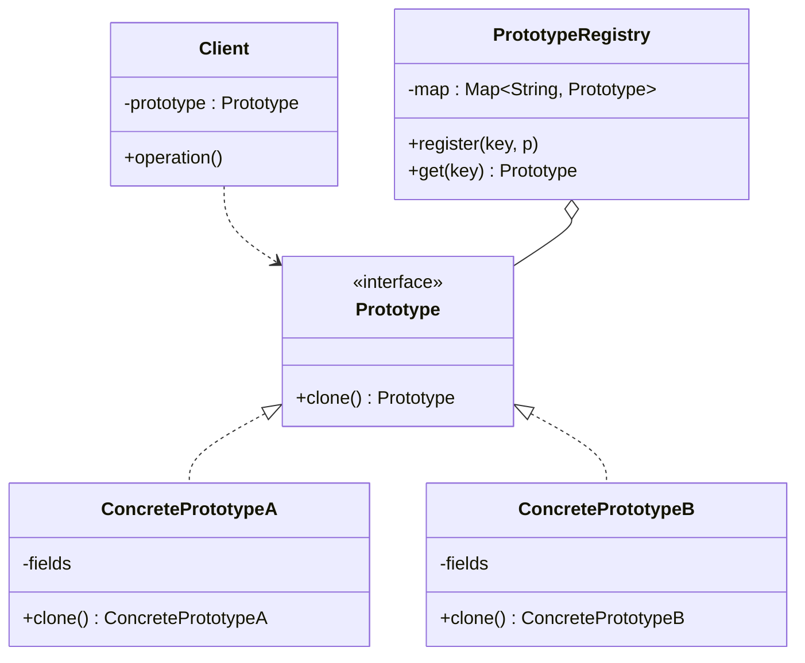

# Prototype — Clone Existing Instances

**Date:** 2026-05-02 | **Updated:** 2026-05-02
**Tags:** `low-level-design` `design-patterns` `creational` `prototype` `cloning`

## Summary

Prototype creates new objects by *copying an existing prototypical instance* rather than instantiating a class through its constructor. It shines when constructing a fresh object from scratch is expensive (heavy initialization, network hops, complex configuration) but cloning a fully formed exemplar is cheap. It also fits naturally when the *number of variants* is large and runtime-defined — keep one prototype per variant in a registry and clone on demand.

## Intent

From GoF (1994): *Specify the kinds of objects to create using a prototypical instance, and create new objects by copying this prototype.*

The reframing: do not ask "what class is this?" Ask "give me one like that one."

## Structure



A `Prototype` interface declares `clone()`. Concrete prototypes implement it. A registry holds named prototypes the client looks up by key.

## Shallow vs Deep Clone

This is the central question.

| Aspect | Shallow Clone | Deep Clone |
|---|---|---|
| What is copied | Top-level fields only | Entire object graph, recursively |
| Reference fields | Shared with original | Each clone has its own copy |
| Mutation safety | Mutating shared references in the clone affects the original | Clone is fully independent |
| Cost | Cheap | Potentially expensive |
| When to use | All fields are immutable or value types | The clone needs to evolve independently |

A clone that is "shallow when the inner objects are immutable" is sometimes called *structurally shared* and is a perfectly defensible compromise — the same approach immutable collections use.

## Java Implementation

### `Cloneable` and its problems

Java has built-in support for cloning. It is famously broken.

```java
public class Shape implements Cloneable {
    private int x, y;
    private List<String> tags = new ArrayList<>();

    @Override
    public Shape clone() {
        try {
            return (Shape) super.clone();   // shallow, field-by-field
        } catch (CloneNotSupportedException e) {
            throw new AssertionError(e);
        }
    }
}
```

What's wrong (Bloch's *Effective Java* Item 13):

1. **`Cloneable` is a marker interface that doesn't declare `clone()`.** `Object.clone()` is `protected` and throws `CloneNotSupportedException`. The contract is enforced informally and is widely misunderstood.
2. **`super.clone()` is a shallow copy.** Mutable fields are shared between original and clone unless every class in the chain remembers to override.
3. **`clone()` returns `Object` in old code.** Casts everywhere; covariant return types help on Java 5+ but the original API was painful.
4. **`final` fields cannot be assigned in `clone()`.** That blocks the immutable-by-default style.
5. **Constructors are not called.** Any invariant maintained by the constructor is silently bypassed.
6. **Exception handling is broken** — `CloneNotSupportedException` is checked but unreachable for classes that implement `Cloneable`.

Bloch's recommendation: prefer a *copy constructor* or a *static copy factory*:

```java
public final class Shape {
    private final int x, y;
    private final List<String> tags;

    public Shape(int x, int y, List<String> tags) {
        this.x = x; this.y = y;
        this.tags = List.copyOf(tags);
    }

    // Copy constructor
    public Shape(Shape other) {
        this(other.x, other.y, other.tags);
    }

    // Static copy factory
    public static Shape copyOf(Shape other) {
        return new Shape(other);
    }
}
```

Cleaner, type-safe, no marker interface, no checked exception, no `super.clone()` magic.

### Deep clone via serialization

```java
@SuppressWarnings("unchecked")
public static <T extends Serializable> T deepCopy(T obj) {
    try (var bos = new ByteArrayOutputStream();
         var oos = new ObjectOutputStream(bos)) {
        oos.writeObject(obj);
        try (var bis = new ByteArrayInputStream(bos.toByteArray());
             var ois = new ObjectInputStream(bis)) {
            return (T) ois.readObject();
        }
    } catch (IOException | ClassNotFoundException e) {
        throw new IllegalStateException("Deep copy failed", e);
    }
}
```

Works on any `Serializable` object graph, including cycles. Drawbacks: slow, requires every class in the graph to implement `Serializable`, and Java's built-in serialization has well-documented security pitfalls. Acceptable for tests and one-off configuration; rarely the right answer in hot paths.

### Prototype registry

```java
public class ShapeRegistry {
    private final Map<String, Shape> prototypes = new HashMap<>();

    public void register(String key, Shape prototype) {
        prototypes.put(key, prototype);
    }

    public Shape spawn(String key) {
        Shape p = prototypes.get(key);
        if (p == null) throw new NoSuchElementException(key);
        return new Shape(p);    // copy constructor
    }
}
```

The registry stores fully configured exemplars. Game enemies, UI templates, and resume samples are good fits.

## TypeScript Implementation

### Shallow clone

```typescript
const original = { x: 1, y: 2, tags: ['a', 'b'] };
const shallow = { ...original };
shallow.tags.push('c');     // also visible on original.tags — same array reference
```

`{...obj}` and `Object.assign({}, obj)` produce shallow copies.

### Deep clone

```typescript
// Modern, structured-clone-based deep copy (Node 17+, all evergreen browsers)
const deep = structuredClone(original);
deep.tags.push('c');         // does not affect original

// JSON round-trip — older approach. Loses Date, Map, Set, undefined, functions, cycles, class identity.
const jsonCopy = JSON.parse(JSON.stringify(original));
```

`structuredClone` is now the standard answer. It handles cycles, `Map`, `Set`, `Date`, typed arrays, and `ArrayBuffer`. It does *not* clone functions or class instances' prototype chain — the result is a plain object. If class identity matters, write an explicit `clone()` method.

### Prototype interface and registry

```typescript
interface Cloneable<T> {
  clone(): T;
}

class Shape implements Cloneable<Shape> {
  constructor(
    public x: number,
    public y: number,
    public readonly tags: readonly string[],
  ) {}

  clone(): Shape {
    return new Shape(this.x, this.y, [...this.tags]);
  }
}

class Registry<T extends Cloneable<T>> {
  private store = new Map<string, T>();
  register(key: string, p: T) { this.store.set(key, p); }
  spawn(key: string): T {
    const p = this.store.get(key);
    if (!p) throw new Error(`No prototype: ${key}`);
    return p.clone();
  }
}
```

### JavaScript's actual prototypes

JavaScript itself is prototype-based: every object has an internal `[[Prototype]]` link. `Object.create(proto)` *literally* creates a new object whose prototype is the argument. The GoF Prototype pattern and JS prototype chains share the name and a family resemblance but solve different problems — one is design, the other is the language's object model.

## When to Use

- Constructing an object is expensive (parses a config, fetches resources, runs a long algorithm) and the configured result is reusable as a template.
- The number of distinct *configured types* exceeds the number of distinct *classes*. Cloning preconfigured exemplars beats a combinatorial explosion of subclasses or factory branches.
- Variants are defined at runtime (loaded from a file, picked from a UI, composed by a designer).
- You want to spawn near-identical objects with small per-instance tweaks: enemies in a game, rows in a template, branches in a tree.
- You need to undo / redo by snapshotting state cheaply.

## When NOT to Use

- The class is simple and a constructor or builder is just as fast.
- Objects are small and stateless — there's nothing meaningful to clone.
- You haven't profiled and "cloning is faster" is just a guess.
- The object graph contains references that *should not* be copied — open files, sockets, locks, threads, GPU handles.
- Java code where `Cloneable` is the only motivation. Prefer a copy constructor.

## Common Pitfalls

### 1. Forgetting deep clone

A shallow clone of a `Shape` whose `tags` is an `ArrayList` shares the list. Mutating the clone's tags mutates the original's. This is one of the most common bugs in Prototype implementations.

### 2. Cloning identity

Some objects encode identity in their fields — `id`, `uuid`, primary key. A naive clone duplicates that identity, then both the original and the clone claim to be the "same" entity. Reset identity fields after cloning.

### 3. Cloning singletons

Cloning something whose contract is "there is exactly one of these" produces two of them. Don't.

### 4. Cycles in the object graph

Naive recursive clone on a cyclic graph stack-overflows. `structuredClone` and well-written deep-clone helpers track visited references. Roll-your-own usually doesn't.

### 5. Cloning resource handles

A clone of an object holding an open `FileInputStream` does not duplicate the OS file handle — both objects share the same one, both will try to close it, and one of them will fail. Strip resource handles in the clone path or forbid cloning.

### 6. Versioning the prototype

If you mutate a registered prototype, every future clone reflects the change. Sometimes that's intentional; sometimes it's a horror movie. Document the contract — and consider freezing/registering immutable prototypes.

### 7. Java `Cloneable` confusion

The marker interface doesn't declare `clone()`. Forgetting `implements Cloneable` causes `super.clone()` to throw `CloneNotSupportedException` at runtime. This bites everyone once.

## Real-World Examples

- **`java.lang.Object.clone()`** — The language's built-in, much-criticized prototype primitive.
- **JavaScript's prototype chain** — `Object.create(proto)` literally creates a new object whose prototype is the argument; the language's object model is prototype-based.
- **Game engines** — Unity prefabs, Unreal blueprints. A prefab is a configured prototype; instantiation is a clone.
- **`structuredClone()`** — Web platform deep-clone primitive used by `postMessage`, `IndexedDB`, and explicit cloning needs.
- **JPA / Hibernate detached entity copy** — Copying entity state across persistence contexts.
- **Document templates** — Word, Google Docs templates are prototypes.
- **Office suite slide masters / themes** — Each new slide is cloned from a master slide prototype.

## Discussion: Prototype vs Factory Method vs Builder

- **Factory Method:** the *class* is the answer. You ask "give me a new `Foo`."
- **Builder:** the *recipe* is the answer. You ask "build a `Foo` with these parts."
- **Prototype:** an *example* is the answer. You ask "give me one like this."

When variation is dominated by configuration rather than class identity, Prototype usually wins.

## Related

- [`singleton.md`](singleton.md) — Prototype registries are commonly implemented as singletons; cloning a singleton is incoherent.
- [`builder.md`](builder.md) — A builder seeded from a prototype copy is a common configuration pattern.
- [`factory-method.md`](factory-method.md) — A factory that consults a registry of prototypes can replace a tall switch over class types.
- [`abstract-factory.md`](abstract-factory.md) — Each method on an Abstract Factory can clone a registered prototype rather than `new` a class.
- [`../structural/`](../structural/) — Composite trees are commonly cloned via Prototype to duplicate sub-trees.
- [`../behavioral/`](../behavioral/) — The Memento pattern overlaps with Prototype when snapshots are needed.
- [`../../oop-fundamentals/inheritance.md`](../../oop-fundamentals/inheritance.md) — Prototype reduces the need for many subclasses by encoding variation in state instead of type.
- [`../../oop-fundamentals/encapsulation.md`](../../oop-fundamentals/encapsulation.md) — Cloning must respect the original's invariants and not leak internal references.

## References

- Gamma, Helm, Johnson, Vlissides. *Design Patterns: Elements of Reusable Object-Oriented Software*, 1994 — original Prototype pattern.
- Bloch, Joshua. *Effective Java* (3rd ed.) — Item 13: "Override `clone` judiciously" — the definitive critique of `Cloneable`.
- WHATWG HTML Living Standard — `structuredClone` algorithm and the structured-serialize / structured-deserialize machinery.
