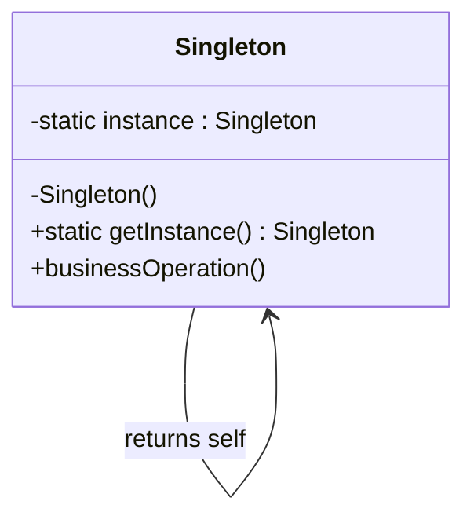

# Singleton — One Instance, Globally Accessible

**Date:** 2026-05-02 | **Updated:** 2026-05-02
**Tags:** `low-level-design` `design-patterns` `creational` `singleton` `thread-safety`

## Summary

Singleton ensures a class has exactly one instance and provides a global access point to it. It is the simplest and most controversial of the GoF creational patterns — easy to write, easy to abuse, and notoriously hostile to unit testing. Use it only when a single instance is a real domain invariant, not because "there's only one for now."

## Intent

From GoF (1994): *Ensure a class has only one instance, and provide a global point of access to it.*

The pattern bundles two responsibilities:

1. Enforcing uniqueness (the class itself owns the constraint).
2. Providing a well-known access path (`getInstance()`).

That second responsibility is what makes Singleton smell like a global variable in a tuxedo.

## Structure



The constructor is private. The class holds a static reference to its sole instance. Clients never `new` the class; they go through `getInstance()`.

## Java Implementation

### 1. Eager initialization

```java
public final class Config {
    private static final Config INSTANCE = new Config();

    private Config() {}

    public static Config getInstance() {
        return INSTANCE;
    }
}
```

Thread-safe by virtue of class-loading semantics. The downside is that the instance is built whether or not anyone calls `getInstance()`. Fine for cheap objects, wasteful for heavy ones.

### 2. Lazy with `synchronized`

```java
public final class Config {
    private static Config instance;

    private Config() {}

    public static synchronized Config getInstance() {
        if (instance == null) {
            instance = new Config();
        }
        return instance;
    }
}
```

Correct, but every call pays for a monitor acquisition forever. Avoid this in hot paths.

### 3. Double-checked locking (DCL)

```java
public final class Config {
    private static volatile Config instance;

    private Config() {}

    public static Config getInstance() {
        Config local = instance;
        if (local == null) {
            synchronized (Config.class) {
                local = instance;
                if (local == null) {
                    local = new Config();
                    instance = local;
                }
            }
        }
        return local;
    }
}
```

The `volatile` is non-negotiable on the JVM — without it, another thread can observe a partially constructed object due to instruction reordering. The local variable is a small but real micro-optimization (one volatile read on the fast path).

### 4. Initialization-on-demand holder idiom

```java
public final class Config {
    private Config() {}

    private static class Holder {
        static final Config INSTANCE = new Config();
    }

    public static Config getInstance() {
        return Holder.INSTANCE;
    }
}
```

This is the cleanest lazy form on the JVM. The inner class is not loaded until first reference, and the JVM guarantees thread-safe class initialization. No `volatile`, no `synchronized`, no DCL ceremony.

### 5. Enum singleton (Effective Java Item 3)

```java
public enum Config {
    INSTANCE;

    public void load(String path) { /* ... */ }
}
```

Joshua Bloch's recommended form in *Effective Java*. Free serialization correctness, free reflection-attack resistance (you cannot `Constructor.setAccessible(true)` your way to a second instance), and no boilerplate. The objection — "but it's an enum!" — is a stylistic complaint, not a technical one.

## TypeScript Implementation

```typescript
class Config {
  private static instance: Config | null = null;

  private constructor(public readonly env: string) {}

  static getInstance(): Config {
    if (Config.instance === null) {
      Config.instance = new Config(process.env.APP_ENV ?? 'development');
    }
    return Config.instance;
  }
}

const cfg = Config.getInstance();
```

JavaScript's single-threaded event loop sidesteps the locking problem entirely. There is no torn read on a partially constructed object because no other thread can observe it.

For ES modules, the simplest singleton is just the module itself — modules are evaluated once and their exports are cached:

```typescript
// config.ts
export const config = {
  env: process.env.APP_ENV ?? 'development',
  port: Number(process.env.PORT ?? 3000),
};
```

Anything that imports `config` gets the same object reference. No class needed. This is the idiomatic singleton in modern TS.

## When to Use

- A truly single resource models a real-world singleton: the OS process's logger root, a connection pool that owns scarce file descriptors, a hardware device driver.
- Stateless utility holders where you want polymorphism (a plain `static` class can't implement an interface; an enum singleton can).
- Registry-like objects where the registry's identity is part of the contract.

## When NOT to Use

- "There's only one of these for now." That sentence usually predicts a future where there are two — per tenant, per region, per test.
- As a hidden dependency. If a class secretly calls `Logger.getInstance()`, you cannot test it in isolation without monkey-patching globals.
- To avoid passing a parameter. Pass the dependency. Constructor injection is cheap; hidden globals are not.
- Across DI-managed code. Spring already manages bean scope (`@Component` is singleton-scoped by default within a context). Rolling your own Singleton inside a Spring app duplicates the container and bypasses its lifecycle.

## Common Pitfalls

### 1. Reflection breaks naive singletons

```java
Constructor<Config> c = Config.class.getDeclaredConstructor();
c.setAccessible(true);
Config rogue = c.newInstance();   // second instance!
```

Defenses: throw from the private constructor on second invocation, or use the enum form (the JVM forbids reflective enum construction).

### 2. Serialization breaks naive singletons

A plain `Serializable` singleton produces a new instance on deserialize. Implement `readResolve()` to return the canonical instance, or use the enum form (handled automatically).

### 3. Classloader-per-instance

In containers with multiple classloaders (older app servers, OSGi), "static" means "static per classloader." You can end up with N copies of your "singleton."

### 4. Hostile to unit tests

Static `getInstance()` is global mutable state. Tests run in shared JVM and pollute each other unless you add reset hooks — which themselves leak through to production code.

### 5. DCL without `volatile`

Pre-Java-5 code did this and it was broken. It is *still* broken if someone "cleans up" your code by removing the `volatile`. Comment the field.

### 6. Leaking `this` from the constructor

If the singleton's constructor registers itself with a listener or starts a thread that calls back into the singleton, another thread may observe the not-yet-fully-constructed instance.

## Real-World Examples

- **`java.lang.Runtime`** — `Runtime.getRuntime()` returns the JVM's single runtime instance.
- **`java.awt.Desktop`** — One desktop integration object per process.
- **Spring beans (default scope)** — The container enforces singleton-per-context, removing the need for the pattern in application code.
- **Node.js modules** — Module cache makes any exported object a de facto singleton per process.
- **Logger frameworks (SLF4J root logger, Log4j `LogManager`)** — A single logging registry per classloader.

## Discussion: Is Singleton an Anti-Pattern?

The honest answer is "sometimes." The pattern itself is not the problem. The problems are:

- It conflates *uniqueness* with *global access*.
- It hides dependencies, which damages testability.
- It tempts engineers to skip dependency injection.

A clean alternative for most application code: build the object once at composition root, inject it where needed. Let the *container* (or `main`) enforce "one instance"; let the *type system* enforce "this code needs a `Config`." That keeps the invariant without paying the testability tax.

When the singleton is genuinely a process-level resource (the JVM's `Runtime`), the pattern earns its keep.

## Related

- [`builder.md`](builder.md) — Often paired with Singleton when the singleton is configured once at startup.
- [`factory-method.md`](factory-method.md) — Static factory methods can act as a controlled singleton access point.
- [`abstract-factory.md`](abstract-factory.md) — Abstract Factory implementations are often singletons in practice.
- [`prototype.md`](prototype.md) — Prototype registries are commonly singletons.
- [`../structural/`](../structural/) — Facade objects are frequently implemented as singletons.
- [`../behavioral/`](../behavioral/) — Mediators and Observers central to a system are sometimes singletons.
- [`../../oop-fundamentals/inheritance.md`](../../oop-fundamentals/inheritance.md) — Singleton's private constructor blocks subclassing in the simple form.
- [`../../solid/`](../../solid/) — Singleton tends to violate the Dependency Inversion Principle when overused.

## References

- Gamma, Helm, Johnson, Vlissides. *Design Patterns: Elements of Reusable Object-Oriented Software*, 1994 — original Singleton pattern.
- Bloch, Joshua. *Effective Java* (3rd ed.) — Item 3: "Enforce the singleton property with a private constructor or an enum type."
- *Java Concurrency in Practice* (Goetz et al.) — discussion of the JVM memory model implications for double-checked locking.
