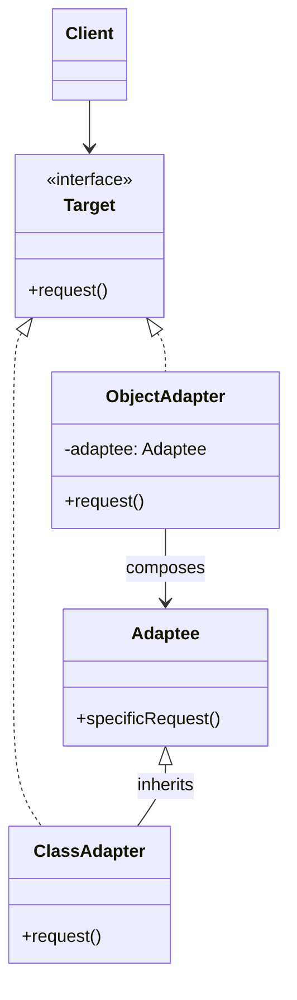

# Adapter — Make Incompatible Interfaces Talk

**Date:** 2026-05-02 | **Updated:** 2026-05-02
**Tags:** `low-level-design` `design-patterns` `structural` `adapter` `hexagonal-architecture` `legacy-integration`

## Summary

The Adapter pattern (a.k.a. Wrapper) converts the interface of an existing class into another interface that clients expect. It is the canonical fix when you cannot change either side — a stable client and a stable supplier — but you must make them collaborate.

## Intent

From GoF: "Convert the interface of a class into another interface clients expect. Adapter lets classes work together that couldn't otherwise because of incompatible interfaces."

Concretely, an adapter:

- Preserves the **client's** expected contract (`Target`).
- Forwards calls to an **existing** implementation (`Adaptee`) whose interface differs.
- Lives at the seam between two stable worlds — neither of which you want to disturb.

## Structure



### Class Adapter (Inheritance)

A subclass of `Adaptee` that implements `Target`. Only possible in languages with multiple inheritance, or when `Target` is an interface (Java/TypeScript). Tightly coupled to the concrete adaptee class.

### Object Adapter (Composition)

The adapter holds a reference to the adaptee and delegates. Works with any subclass of the adaptee. **This is the form you almost always want.**

## Java Example

A modern app expects a `PaymentGateway` port. We must integrate a vendor SDK whose API does not match.

```java
// Target — what our domain expects
public interface PaymentGateway {
    PaymentResult charge(Money amount, String customerId);
}

// Adaptee — third-party SDK we cannot modify
public class LegacyAcmePaySdk {
    public AcmeResponse processTransaction(double amountCents,
                                           String currency,
                                           String acmeCustomerKey) {
        // ...vendor implementation...
        return new AcmeResponse(/* ... */);
    }
}

// Object adapter
public class AcmePayAdapter implements PaymentGateway {
    private final LegacyAcmePaySdk sdk;
    private final CustomerKeyResolver keyResolver;

    public AcmePayAdapter(LegacyAcmePaySdk sdk, CustomerKeyResolver keyResolver) {
        this.sdk = sdk;
        this.keyResolver = keyResolver;
    }

    @Override
    public PaymentResult charge(Money amount, String customerId) {
        String acmeKey = keyResolver.resolve(customerId);
        AcmeResponse response = sdk.processTransaction(
            amount.toCents(),
            amount.currency().getCurrencyCode(),
            acmeKey
        );
        return mapResponse(response);
    }

    private PaymentResult mapResponse(AcmeResponse r) {
        return r.isOk()
            ? PaymentResult.success(r.transactionId())
            : PaymentResult.failure(r.errorCode(), r.errorMessage());
    }
}
```

The domain only ever depends on `PaymentGateway`. Swapping vendors means writing a new adapter — nothing else moves.

## TypeScript Example

```typescript
// Target — port the application depends on
interface NotificationPort {
  send(userId: string, body: string): Promise<void>;
}

// Adaptee — third-party Slack client
class SlackWebClient {
  async chatPostMessage(opts: {
    channel: string;
    text: string;
    blocks?: unknown[];
  }): Promise<{ ok: boolean; ts: string }> {
    /* ... */
    return { ok: true, ts: '0' };
  }
}

// Object adapter
class SlackNotificationAdapter implements NotificationPort {
  constructor(
    private readonly slack: SlackWebClient,
    private readonly userToChannel: (userId: string) => Promise<string>,
  ) {}

  async send(userId: string, body: string): Promise<void> {
    const channel = await this.userToChannel(userId);
    const result = await this.slack.chatPostMessage({ channel, text: body });
    if (!result.ok) {
      throw new Error(`Slack post failed for user ${userId}`);
    }
  }
}
```

## Hexagonal / Ports-and-Adapters Tie-In

Adapter is the workhorse of **hexagonal architecture** (Cockburn). The architecture defines two halves:

- **Ports**: domain-owned interfaces (`PaymentGateway`, `NotificationPort`, `OrderRepository`).
- **Adapters**: infrastructure implementations of those ports (`AcmePayAdapter`, `PostgresOrderRepository`, `KafkaOrderEventPublisher`).

Two flavors:

| Flavor              | Direction              | Example                                            |
| ------------------- | ---------------------- | -------------------------------------------------- |
| **Driving** (left)  | Outside → Domain       | REST controller adapting HTTP to a use-case port   |
| **Driven** (right)  | Domain → Outside       | DB adapter implementing a `Repository` port        |

The GoF Adapter pattern is exactly the **driven** side. The point is dependency inversion: the domain stays pure, infrastructure plugs in.

## When to Use

- You want to use an existing class but its interface does not match.
- You are introducing a new abstraction (port) over a legacy or third-party API.
- You need several existing classes to look uniform behind a single interface.
- You're migrating off a vendor and need to insulate the rest of the codebase first.
- Bridging API generations (v1 client used through a v2 interface, or vice versa).

## When NOT to Use

- You control both sides — change the interface directly instead of adapting.
- The mismatch is trivial (one parameter rename) — a thin function will do.
- Adapter would be hiding a fundamentally different model. If `processTransaction` and `charge` mean different things, an adapter papering over it produces silent bugs. Translate the *concept*, not just the signature.
- The wrapping costs more than the integration benefit (e.g., a one-off script).

## Pitfalls

- **Leaky semantics**: the adaptee's failure modes, retries, and timeouts leak through unless you map them to the target's contract explicitly.
- **Lossy conversion**: target lacks fields the adaptee provides (or vice versa). Decide what to drop and document it.
- **God-adapter**: one adapter that swallows three unrelated APIs. Split per concept.
- **Adapter chains**: `A → B → C` adapters multiply error-mapping bugs. Collapse when possible.
- **Confusing Adapter with Facade**: Adapter changes interface for one client; Facade simplifies a subsystem for many. (See [facade.md](./facade.md).)
- **Confusing Adapter with Decorator**: Decorator preserves the interface and adds behavior. Adapter changes the interface.

## Real-World Examples

- **`java.util.Arrays.asList(T...)`** — adapts an array to a `List` view.
- **`InputStreamReader`** — adapts a byte stream (`InputStream`) to a character stream (`Reader`).
- **SLF4J** — `slf4j-log4j12`, `slf4j-jdk14`, etc. are adapters from the SLF4J API to concrete logging implementations.
- **Spring's `HandlerAdapter`** — adapts the various controller types (`@Controller`, `HttpRequestHandler`, etc.) to a uniform dispatch contract.
- **JDBC drivers** are *driven adapters* (and a Bridge, see [bridge.md](./bridge.md)).
- **TypeScript / Node**: `node:stream`'s `Readable.from(asyncIterable)` adapts an async iterable into the stream API.
- **React class component → hooks** wrappers in legacy migrations are adapters.

## Related

Siblings (Structural):

- [facade.md](./facade.md) — simplifies a subsystem; doesn't change a single interface but unifies many.
- [decorator.md](./decorator.md) — same interface, added behavior.
- [bridge.md](./bridge.md) — designed-in dual hierarchy; Adapter is retro-fitted.
- [proxy.md](./proxy.md) — same interface as the subject, controls access.
- [composite.md](./composite.md) · [flyweight.md](./flyweight.md)

Cross-category:

- [../creational/](../creational/) — factories often produce adapter instances behind a port.
- [../behavioral/](../behavioral/) — Strategy and Adapter are easy to confuse: Strategy chooses among algorithms with the same interface; Adapter makes a foreign implementation fit that interface.

References: GoF, *Design Patterns: Elements of Reusable Object-Oriented Software*. Hexagonal Architecture by Alistair Cockburn.
