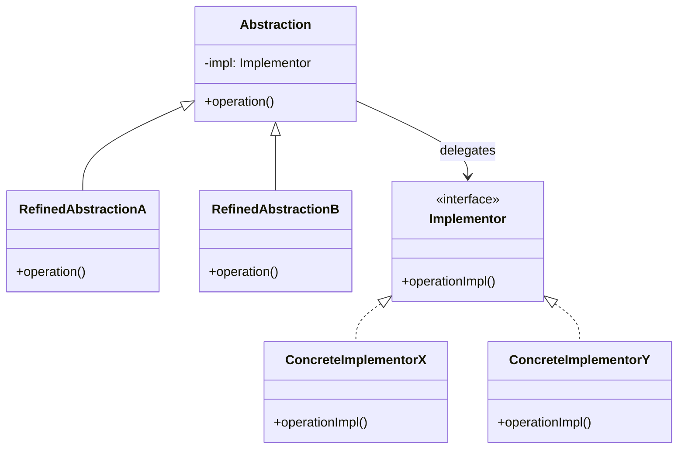

# Bridge — Decouple Abstraction From Implementation

**Date:** 2026-05-02 | **Updated:** 2026-05-02
**Tags:** `low-level-design` `design-patterns` `structural` `bridge` `jdbc` `two-dimensions-of-variation`

## Summary

The Bridge pattern decouples an abstraction from its implementation so that the two can vary independently. When a problem has *two* dimensions of variation that would otherwise multiply into a Cartesian-product class hierarchy, Bridge splits them into two cooperating hierarchies linked by composition.

## Intent

From GoF: "Decouple an abstraction from its implementation so that the two can vary independently."

The signal that you want a Bridge: you can list two orthogonal axes of change, and you would otherwise produce one subclass per cell of the matrix.

## The Two-Dimensions-of-Variation Problem

Suppose you're modeling shapes that render through different graphics back-ends.

Without Bridge, you might write:

```text
Circle, Square, Triangle  (3 shapes)
       x
GLRenderer, VulkanRenderer, MetalRenderer, SoftwareRenderer  (4 renderers)
       =
12 classes: GLCircle, VulkanCircle, MetalCircle, SoftwareCircle, GLSquare ...
```

Add one more shape: 4 new classes. Add one more back-end: 3 new classes. The hierarchy multiplies.

With Bridge, you have two hierarchies:

```text
Shape side:    Shape, Circle, Square, Triangle               (4 classes)
Renderer side: Renderer, GL, Vulkan, Metal, Software         (5 classes)
Bridge:        Shape holds a Renderer reference (composition)
```

Adding a shape costs one class. Adding a back-end costs one class. The product is implicit in instances, not classes.

## Structure



The "abstraction" side and the "implementor" side are both extensible. The bridge is the composition link.

## Java Example

```java
// Implementor — drawing primitives
public interface Renderer {
    void drawCircle(double cx, double cy, double r);
    void drawRect(double x, double y, double w, double h);
}

public final class CanvasRenderer implements Renderer {
    @Override public void drawCircle(double cx, double cy, double r) {
        System.out.printf("canvas.arc(%f,%f,%f)%n", cx, cy, r);
    }
    @Override public void drawRect(double x, double y, double w, double h) {
        System.out.printf("canvas.fillRect(%f,%f,%f,%f)%n", x, y, w, h);
    }
}

public final class SvgRenderer implements Renderer {
    @Override public void drawCircle(double cx, double cy, double r) {
        System.out.printf("<circle cx='%f' cy='%f' r='%f' />%n", cx, cy, r);
    }
    @Override public void drawRect(double x, double y, double w, double h) {
        System.out.printf("<rect x='%f' y='%f' width='%f' height='%f' />%n", x, y, w, h);
    }
}

// Abstraction
public abstract class Shape {
    protected final Renderer renderer;
    protected Shape(Renderer renderer) { this.renderer = renderer; }
    public abstract void draw();
}

public final class Circle extends Shape {
    private final double cx, cy, r;
    public Circle(Renderer renderer, double cx, double cy, double r) {
        super(renderer);
        this.cx = cx; this.cy = cy; this.r = r;
    }
    @Override public void draw() { renderer.drawCircle(cx, cy, r); }
}

public final class Square extends Shape {
    private final double x, y, side;
    public Square(Renderer renderer, double x, double y, double side) {
        super(renderer);
        this.x = x; this.y = y; this.side = side;
    }
    @Override public void draw() { renderer.drawRect(x, y, side, side); }
}

// Composition at the boundary
List<Shape> svgScene = List.of(
    new Circle(new SvgRenderer(), 50, 50, 20),
    new Square(new SvgRenderer(), 10, 10, 30));
svgScene.forEach(Shape::draw);
```

## TypeScript Example

```typescript
interface MessageSender {
  send(channelKey: string, payload: string): Promise<void>;
}

class EmailSender implements MessageSender {
  async send(addr: string, payload: string) { /* SMTP */ }
}
class SmsSender implements MessageSender {
  async send(phone: string, payload: string) { /* Twilio */ }
}
class PushSender implements MessageSender {
  async send(deviceToken: string, payload: string) { /* FCM */ }
}

abstract class Notification {
  constructor(protected readonly sender: MessageSender) {}
  abstract dispatch(channelKey: string): Promise<void>;
}

class WelcomeNotification extends Notification {
  constructor(sender: MessageSender, private readonly name: string) {
    super(sender);
  }
  async dispatch(channelKey: string) {
    await this.sender.send(channelKey, `Welcome, ${this.name}!`);
  }
}

class PasswordResetNotification extends Notification {
  constructor(sender: MessageSender, private readonly link: string) {
    super(sender);
  }
  async dispatch(channelKey: string) {
    await this.sender.send(channelKey, `Reset: ${this.link}`);
  }
}

// Any notification x any channel — without subclass explosion
await new WelcomeNotification(new EmailSender(), 'Quan').dispatch('quan@example.com');
await new PasswordResetNotification(new SmsSender(), 'https://...').dispatch('+15551234567');
```

## JDBC — The Canonical Bridge

JDBC is the textbook example that ships with the JDK.

```text
Abstraction side:   java.sql.Connection, Statement, ResultSet, PreparedStatement
Implementor side:   Driver SPI implementations — PostgreSQL JDBC, MySQL Connector/J,
                    Oracle JDBC, SQL Server JDBC, H2 JDBC, ...

The DriverManager + URL parsing is the bridge: the abstraction your code uses
(Connection, PreparedStatement) is identical regardless of driver. Drivers can
be released independently of JDK versions; new drivers slot in without touching
the abstraction.
```

This is why your application code reads the same against any of those databases. The two dimensions — *which database* and *what JDBC operation* — vary independently.

Equivalent setups elsewhere:

- **JDBC**: `Connection` ↔ database driver.
- **JNDI**: `Context` ↔ naming/directory service (LDAP, DNS, RMI registry).
- **Slf4j**: `Logger` ↔ logging backend (Logback, Log4j2, JUL).
- **Hibernate Dialects**: ORM core ↔ database-specific SQL flavor.
- **JPA**: `EntityManager` ↔ persistence provider (Hibernate, EclipseLink).

## Bridge vs Adapter — Same Result, Different Origin Story

Both end up with composition between an abstraction-like type and an implementation-like type. The difference is **who designed the seam**:

| Aspect              | Bridge                                                    | Adapter                                            |
| ------------------- | --------------------------------------------------------- | -------------------------------------------------- |
| When designed       | Up-front, before the explosion                           | After the fact, to bolt on an existing class       |
| Both sides yours?   | Yes — you own abstraction and implementor hierarchies     | No — adaptee belongs to someone else               |
| Goal                | Independent evolution along two axes                      | Make a foreign API fit a target interface          |
| Example             | JDBC Connection vs. driver                                | Wrapping a vendor SDK behind a port                |

A Bridge often *contains* adapters (each driver adapts to the JDBC SPI), but the overall structure is Bridge.

## When to Use

- You have two clear axes of variation and you'd otherwise multiply subclasses.
- You want to choose the implementation at runtime (driver discovery, theming, transport switching).
- You expect both sides to evolve under their own teams or release cycles.
- You want to share a single implementation among many abstractions or vice versa.
- You're designing an SPI: stable abstraction, swappable provider.

## When NOT to Use

- Only one dimension of variation exists — a Strategy or simple inheritance is enough.
- The two axes correlate strongly — separation is artificial.
- The "implementations" don't share a meaningful interface — forcing a common one fragments badly.
- Premature: you have no second axis yet, only a hunch. YAGNI.

## Pitfalls

- **The interface that won't sit still**: SPIs that shift every release force every implementor to chase. Keep the implementor interface narrow and stable; layer richness on the abstraction side.
- **Leaky implementor types**: returning provider-specific types (raw `org.postgresql.PGConnection`) breaks the bridge. Either expose unwrap explicitly or stay generic.
- **Two abstractions vs Bridge**: if both hierarchies are abstractions and neither is the "implementation," you actually have two collaborating types — call it that.
- **Confusion with Strategy**: Strategy is one abstraction holding one swappable algorithm. Bridge is *two* hierarchies. Strategy is a special case of Bridge with no abstraction sub-hierarchy.
- **Discovery complexity**: SPIs use service loaders, classpath scanning, or reflection to find providers — surprisingly subtle in modular runtimes.
- **Over-generalization**: don't introduce Bridge "in case" a second axis appears. Refactor when it shows up.

## Real-World Examples

- **JDBC** — described above.
- **JNDI** providers.
- **Slf4j → Logback / Log4j2 / JUL**.
- **JPA** providers (Hibernate, EclipseLink).
- **Spring `Resource` ↔ `ResourceLoader`**.
- **`InputStream` ↔ underlying byte source** (file, socket, in-memory).
- **JCE / JCA** — `Cipher` ↔ cryptographic provider.
- **GUI frameworks** — Swing's pluggable look-and-feel: `JComponent` (abstraction) ↔ `ComponentUI` (implementation).
- **Cloud abstractions** — `BlobStore` (abstraction) ↔ S3 / GCS / Azure Blob (implementation).
- **OpenTelemetry** — `Tracer` API ↔ vendor-specific exporter.

## Related

Siblings (Structural):

- [adapter.md](./adapter.md) — retrofit; Bridge is designed-in.
- [facade.md](./facade.md) · [decorator.md](./decorator.md) · [composite.md](./composite.md) · [proxy.md](./proxy.md) · [flyweight.md](./flyweight.md)

Cross-category:

- [../creational/](../creational/) — Abstract Factory often produces matching pairs of Bridge implementors. Builder configures the abstraction-side composition. Service Locator / DI containers wire bridges at runtime.
- [../behavioral/](../behavioral/) — Strategy is the "single-axis" cousin; if you find yourself adding a second extensibility dimension to a Strategy, you may be on the road to Bridge.

References: GoF, *Design Patterns: Elements of Reusable Object-Oriented Software*. JDBC and JNDI specifications (Sun/Oracle).
