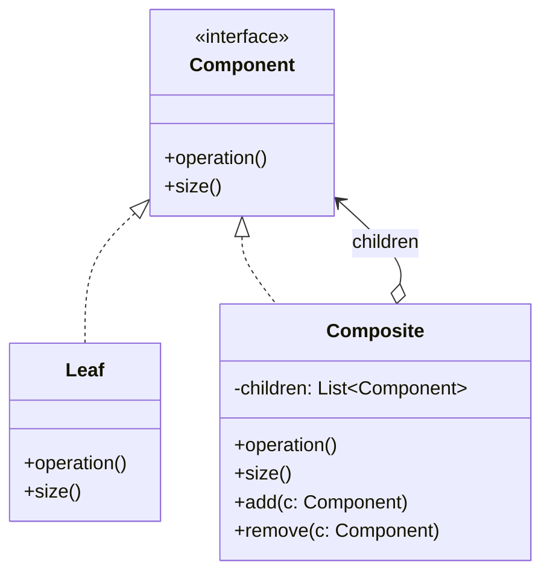

# Composite — Trees of Uniform Nodes

**Date:** 2026-05-02 | **Updated:** 2026-05-02
**Tags:** `low-level-design` `design-patterns` `structural` `composite` `tree` `recursion`

## Summary

The Composite pattern composes objects into tree structures to represent part-whole hierarchies. Composite lets clients treat individual objects (leaves) and compositions of objects (composites) uniformly through a shared interface.

## Intent

From GoF: "Compose objects into tree structures to represent part-whole hierarchies. Composite lets clients treat individual objects and compositions of objects uniformly."

The headline benefit: **client code can be recursion-blind**. A function that operates on a `Component` works whether the component is a single file or a directory tree of millions of files.

## Structure



## Two Variants: Uniform vs Type-Safe

GoF discusses a tension that still matters today:

| Variant         | `add`/`remove` defined on...   | Uniformity                            | Type safety                                                        |
| --------------- | ------------------------------ | ------------------------------------- | ------------------------------------------------------------------ |
| **Transparent** | `Component`                    | Maximum — clients never check types   | Leaves expose meaningless `add`/`remove` (must throw or no-op)     |
| **Safe**        | Only `Composite`               | Lower — clients downcast to add       | Stronger — leaf API doesn't lie                                    |

Most modern code chooses **safe**: leaves don't pretend to have children, and traversal stays in `Component`. Adding lives on `Composite` only.

## Java Example — File System

```java
public sealed interface FsNode permits FileNode, DirectoryNode {
    String name();
    long sizeBytes();
    Stream<FsNode> walk();
}

public record FileNode(String name, long sizeBytes) implements FsNode {
    @Override
    public Stream<FsNode> walk() {
        return Stream.of(this);
    }
}

public final class DirectoryNode implements FsNode {
    private final String name;
    private final List<FsNode> children;

    public DirectoryNode(String name, List<FsNode> children) {
        this.name = name;
        this.children = List.copyOf(children); // immutable
    }

    @Override public String name() { return name; }

    @Override
    public long sizeBytes() {
        return children.stream().mapToLong(FsNode::sizeBytes).sum();
    }

    @Override
    public Stream<FsNode> walk() {
        return Stream.concat(Stream.of(this),
                             children.stream().flatMap(FsNode::walk));
    }

    public DirectoryNode plus(FsNode child) {
        var next = new ArrayList<>(children);
        next.add(child);
        return new DirectoryNode(name, next);   // immutable update
    }
}

// Client code is recursion-blind
long totalSize = root.sizeBytes();
long bigCount = root.walk().filter(n -> n.sizeBytes() > 1_000_000).count();
```

The `sealed interface` plus `record` give compiler-enforced exhaustiveness in pattern matching, which complements Composite nicely in modern Java.

## TypeScript Example — UI Hierarchy

```typescript
interface UiNode {
  render(ctx: RenderContext): VDom;
  hitTest(point: Point): UiNode | null;
}

class TextNode implements UiNode {
  constructor(private readonly text: string) {}
  render(ctx: RenderContext): VDom {
    return { tag: 'span', text: this.text };
  }
  hitTest(point: Point): UiNode | null {
    return ctx => null; // simplified
  }
}

class Container implements UiNode {
  constructor(private readonly children: readonly UiNode[]) {}
  render(ctx: RenderContext): VDom {
    return {
      tag: 'div',
      children: this.children.map(c => c.render(ctx)),
    };
  }
  hitTest(point: Point): UiNode | null {
    for (let i = this.children.length - 1; i >= 0; i--) {
      const hit = this.children[i].hitTest(point);
      if (hit) return hit;
    }
    return null;
  }
}
```

A React component tree, the browser DOM, and Flutter's widget tree are all instances of this pattern at industrial scale.

## Recursive Operations

Three traversal shapes appear constantly with Composite:

```typescript
// 1. Reduce — aggregate over the whole subtree
function totalSize(node: FsNode): number {
  if (node.kind === 'file') return node.size;
  return node.children.reduce((acc, c) => acc + totalSize(c), 0);
}

// 2. Map — return a transformed tree of the same shape
function rename(node: FsNode, fn: (s: string) => string): FsNode {
  if (node.kind === 'file') return { ...node, name: fn(node.name) };
  return {
    ...node,
    name: fn(node.name),
    children: node.children.map(c => rename(c, fn)),
  };
}

// 3. Find — first-match short-circuit
function findByName(node: FsNode, name: string): FsNode | null {
  if (node.name === name) return node;
  if (node.kind === 'file') return null;
  for (const c of node.children) {
    const hit = findByName(c, name);
    if (hit) return hit;
  }
  return null;
}
```

For very deep trees, watch the call stack — large-N recursion needs an explicit stack or trampolining (Java has no TCO).

## When to Use

- You want to represent part-whole hierarchies (file system, document, scene graph, org chart, AST, GUI).
- You want clients to ignore the difference between leaves and composites.
- The set of operations is recursion-friendly (sum, find, render, validate, traverse).
- You'd otherwise write `if (instanceof Folder) { for child... } else { ... }` everywhere.

## When NOT to Use

- The hierarchy is shallow and fixed (e.g., always exactly two levels) — direct types are clearer.
- Operations differ fundamentally between leaves and composites — uniformity buys little.
- The data is naturally a graph with cycles — Composite is for trees. Cycles need separate handling (visited sets, weak refs).
- You'd be forced to add nonsense methods to leaves to maintain the interface.

## Pitfalls

- **Parent pointers**: tempting for upward traversal but couples the tree, complicates moves, and breaks immutability. Add only when needed and keep them weak.
- **Cycle creation**: invariants like "no cycles" are not enforced by the type system — guard at insertion or accept the bug class.
- **Stack overflow** on deep trees with naive recursion. Convert to iteration with an explicit stack.
- **Order semantics**: are children ordered (DOM) or a set (file system on most filesystems)? Specify and stick with it.
- **Iteration during mutation**: classic source of `ConcurrentModificationException` / silent skip. Prefer immutable updates that return new subtrees.
- **Misusing for non-trees**: a graph with shared/cyclic references is *not* a Composite. Use a graph type with visitor + visited-set.
- **Mixing concerns into nodes**: every operation as a method bloats `Component`. The Visitor pattern from the behavioral set is the typical escape.

## Real-World Examples

- **DOM**: `Node` is the component, `Element` and `Text` are leaves vs composite.
- **React / Flutter / SwiftUI**: components/widgets compose recursively under a uniform tree contract.
- **AWT / Swing**: `Component` and `Container` form the canonical Composite structure.
- **AST in compilers**: every node implements `accept(Visitor)` (Composite + Visitor).
- **`java.io.File`**: a directory and a regular file share one type.
- **`java.nio.file.Path`** with `Files.walk`.
- **JSON / YAML object models** — Jackson's `JsonNode`, with `ObjectNode`/`ArrayNode` as composites and `TextNode`/`IntNode`/etc. as leaves.
- **Graphics scene graphs** — Three.js `Object3D` with `Mesh`/`Group` as leaf/composite forms.
- **Filesystem-as-data** in build systems (Bazel, Buck) — directory globs evaluate uniformly.

## Related

Siblings (Structural):

- [decorator.md](./decorator.md) — a decorator is conceptually a composite with exactly one child plus added behavior.
- [flyweight.md](./flyweight.md) — composites with many similar leaves often pair with Flyweight to share leaf state.
- [adapter.md](./adapter.md) · [facade.md](./facade.md) · [proxy.md](./proxy.md) · [bridge.md](./bridge.md)

Cross-category:

- [../behavioral/](../behavioral/) — **Visitor** pairs naturally with Composite to add operations without bloating nodes. **Iterator** traverses composites. **Chain of Responsibility** can ride a parent chain.
- [../creational/](../creational/) — Builder is excellent for assembling composite trees with readable syntax.

References: GoF, *Design Patterns: Elements of Reusable Object-Oriented Software*. Refactoring trees with Visitor — Eric Gamma et al.
