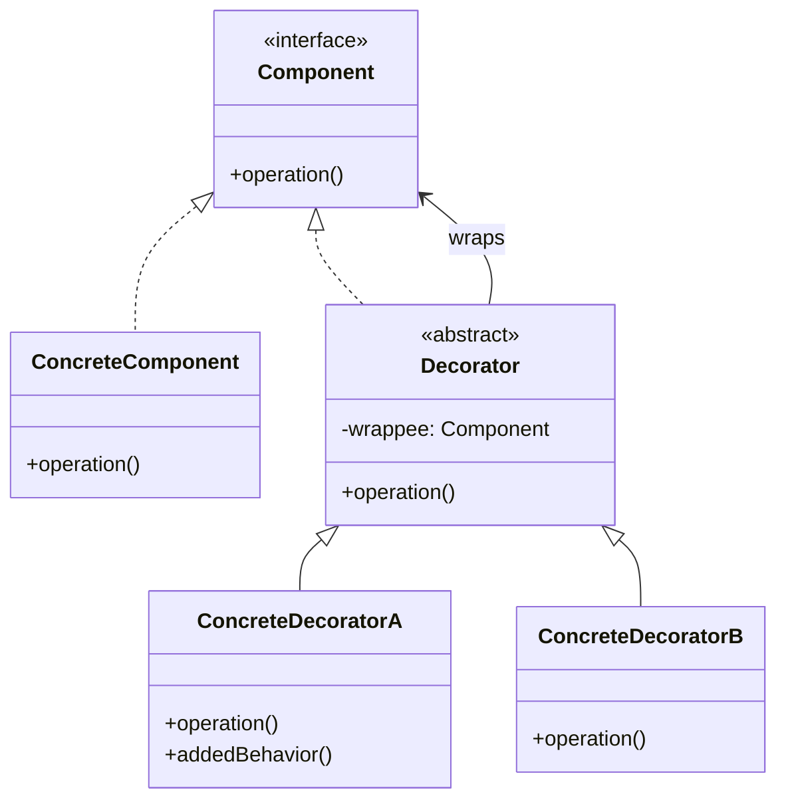

# Decorator — Add Behavior Without Subclassing

**Date:** 2026-05-02 | **Updated:** 2026-05-02
**Tags:** `low-level-design` `design-patterns` `structural` `decorator` `composition` `java-io`

## Summary

The Decorator pattern attaches additional responsibilities to an object dynamically. Decorators provide a flexible alternative to subclassing for extending functionality, by wrapping an object in another object that conforms to the same interface.

## Intent

From GoF: "Attach additional responsibilities to an object dynamically. Decorators provide a flexible alternative to subclassing for extending functionality."

Decorator's superpower is **runtime composition**: you can stack `Authenticated → Cached → RateLimited → Retrying → HttpClient` and rearrange the order without writing a new class for each combination.

## Structure



Key invariants:

- Decorator implements the **same interface** as the component it wraps. (This is what distinguishes it from Adapter.)
- The wrappee field allows arbitrary depth of stacking.
- Each decorator is single-purpose; combinations come from composition, not inheritance.

## The Inheritance Explosion It Solves

Without Decorator, supporting `n` independent capabilities (auth, cache, retry, log, metrics) leads to `2^n` subclasses, or a god-class with feature flags. Decorator collapses that to `n` classes, each composable with any other.

```text
HttpClient
HttpClientWithAuth
HttpClientWithCache
HttpClientWithRetry
HttpClientWithAuthAndCache
HttpClientWithAuthAndRetry
HttpClientWithCacheAndRetry
HttpClientWithAuthAndCacheAndRetry
... and the explosion continues for every new feature.
```

With Decorator: one base, four decorators, any combination at runtime.

## Java Example — `java.io` Streams (Canonical)

The Java I/O package is the textbook decorator stack.

```java
// Component
InputStream raw = new FileInputStream("data.bin");
// + buffering
InputStream buffered = new BufferedInputStream(raw);
// + gzip decompression
InputStream gunzipped = new GZIPInputStream(buffered);
// + checksum verification
InputStream checked = new CheckedInputStream(gunzipped, new CRC32());
// + reading typed primitives
DataInputStream in = new DataInputStream(checked);

int magic = in.readInt();
long length = in.readLong();
```

Each wrapper is an `InputStream`. Each adds one capability. You compose only what you need, in the order you need.

A user-defined decorator:

```java
public final class MetricsHttpClient implements HttpClient {
    private final HttpClient delegate;
    private final MeterRegistry meters;

    public MetricsHttpClient(HttpClient delegate, MeterRegistry meters) {
        this.delegate = delegate;
        this.meters = meters;
    }

    @Override
    public HttpResponse send(HttpRequest req) {
        var sample = Timer.start(meters);
        try {
            HttpResponse res = delegate.send(req);
            sample.stop(meters.timer("http.client",
                "host", req.uri().getHost(),
                "status", String.valueOf(res.statusCode())));
            return res;
        } catch (RuntimeException ex) {
            meters.counter("http.client.errors", "host", req.uri().getHost()).increment();
            throw ex;
        }
    }
}

// Composition
HttpClient client =
    new MetricsHttpClient(
        new RetryingHttpClient(
            new AuthHttpClient(
                new BaseHttpClient(),
                tokenProvider),
            RetryPolicy.expoBackoff(3)),
        registry);
```

## TypeScript Example

```typescript
interface Cache<V> {
  get(key: string): Promise<V | undefined>;
  set(key: string, value: V, ttlMs?: number): Promise<void>;
}

class InMemoryCache<V> implements Cache<V> {
  private readonly map = new Map<string, { v: V; expires: number }>();
  async get(key: string) {
    const entry = this.map.get(key);
    if (!entry) return undefined;
    if (entry.expires < Date.now()) {
      this.map.delete(key);
      return undefined;
    }
    return entry.v;
  }
  async set(key: string, value: V, ttlMs = 60_000) {
    this.map.set(key, { v: value, expires: Date.now() + ttlMs });
  }
}

class LoggingCache<V> implements Cache<V> {
  constructor(
    private readonly inner: Cache<V>,
    private readonly logger: { info: (m: string) => void },
  ) {}
  async get(key: string) {
    const hit = await this.inner.get(key);
    this.logger.info(`cache ${hit !== undefined ? 'HIT' : 'MISS'} ${key}`);
    return hit;
  }
  async set(key: string, value: V, ttlMs?: number) {
    this.logger.info(`cache SET ${key}`);
    return this.inner.set(key, value, ttlMs);
  }
}

class MetricsCache<V> implements Cache<V> {
  private hits = 0;
  private misses = 0;
  constructor(private readonly inner: Cache<V>) {}
  async get(key: string) {
    const v = await this.inner.get(key);
    v !== undefined ? this.hits++ : this.misses++;
    return v;
  }
  set(k: string, v: V, ttl?: number) {
    return this.inner.set(k, v, ttl);
  }
  stats() {
    return { hits: this.hits, misses: this.misses };
  }
}

const cache: Cache<User> = new MetricsCache(
  new LoggingCache(new InMemoryCache<User>(), console),
);
```

## Functional Form

In languages with first-class functions, a decorator is often just a higher-order function:

```typescript
type Handler<I, O> = (input: I) => Promise<O>;

const withTiming =
  <I, O>(name: string) =>
  (h: Handler<I, O>): Handler<I, O> =>
  async (input) => {
    const start = performance.now();
    try {
      return await h(input);
    } finally {
      console.log(`${name}: ${(performance.now() - start).toFixed(1)}ms`);
    }
  };

const withRetry =
  <I, O>(times: number) =>
  (h: Handler<I, O>): Handler<I, O> =>
  async (input) => {
    let lastErr: unknown;
    for (let i = 0; i <= times; i++) {
      try {
        return await h(input);
      } catch (e) {
        lastErr = e;
      }
    }
    throw lastErr;
  };

const charge = withTiming<ChargeReq, ChargeRes>('charge')(
  withRetry<ChargeReq, ChargeRes>(2)(baseCharge),
);
```

Python's `@decorator` syntax is exactly this pattern with sugar. JavaScript decorators (TC39 Stage 3) provide class-flavored syntax over the same idea.

## When to Use

- You need to add responsibilities to objects dynamically and transparently.
- Several independent extensions are possible and should be combinable.
- Subclassing is impractical (final classes) or explosive (combinatorics).
- Cross-cutting concerns: logging, caching, retries, metrics, auth, tracing.

## When NOT to Use

- The behavior is intrinsic to the object — bake it in instead of wrapping.
- Order doesn't matter and combinations are few — a parameter or strategy is simpler.
- You need to change the *interface* — that's Adapter, not Decorator.
- The wrapper would change the type observable to clients (e.g., narrow return types) — break the contract.
- You'd need decorators to know about each other — that's a code smell, redesign.

## Pitfalls

- **Order sensitivity**: `Cache → Retry` retries on cache misses; `Retry → Cache` retries network errors. Pick deliberately.
- **Identity confusion**: `decorated.equals(undecorated)` is usually false; collections and proxies see different identities.
- **Debug stack noise**: deep stacks of `delegate.send` make traces harder to read. Name decorators clearly.
- **Hidden cost**: each layer adds an allocation and a method dispatch. Usually negligible, occasionally not.
- **Stateful decorators**: if a decorator holds state (counters, caches), wrapping the same component twice creates two states. Document or share via DI.
- **Confusing with Adapter**: same interface = Decorator; different interface = Adapter.
- **Confusing with Proxy**: Proxy controls access to the *same* subject (often singleton); Decorator adds behavior and stacks freely.

## Real-World Examples

- **`java.io.InputStream`/`OutputStream`/`Reader`/`Writer`** hierarchies.
- **`java.util.Collections.synchronizedList`, `unmodifiableList`** — return decorators.
- **Servlet `HttpServletRequestWrapper` / `HttpServletResponseWrapper`** — explicit decorator base classes.
- **Spring's `TransactionAwareDataSourceProxy`, `DelegatingFilterProxy`**.
- **Netty `ChannelHandler` pipelines** — every handler is a decorator-like step.
- **Express / Koa middleware** — functional decorators around `(req, res)`.
- **Python `functools.lru_cache`, `@contextmanager`, Django view decorators**.
- **Hystrix / Resilience4j** — `CircuitBreaker.decorateSupplier`, `Retry.decorateSupplier`. The library literally uses the word.

## Related

Siblings (Structural):

- [adapter.md](./adapter.md) — changes interface; Decorator preserves it.
- [proxy.md](./proxy.md) — controls access; same interface but typically not stacked.
- [composite.md](./composite.md) — Decorator can be seen as a degenerate Composite with a single child.
- [facade.md](./facade.md) · [bridge.md](./bridge.md) · [flyweight.md](./flyweight.md)

Cross-category:

- [../creational/](../creational/) — Builder is convenient for assembling decorator stacks.
- [../behavioral/](../behavioral/) — Chain of Responsibility passes a request through handlers; conceptually adjacent. Strategy swaps a single algorithm; Decorator stacks layers.

References: GoF, *Design Patterns: Elements of Reusable Object-Oriented Software*. Joshua Bloch, *Effective Java* (Item on composition over inheritance).
