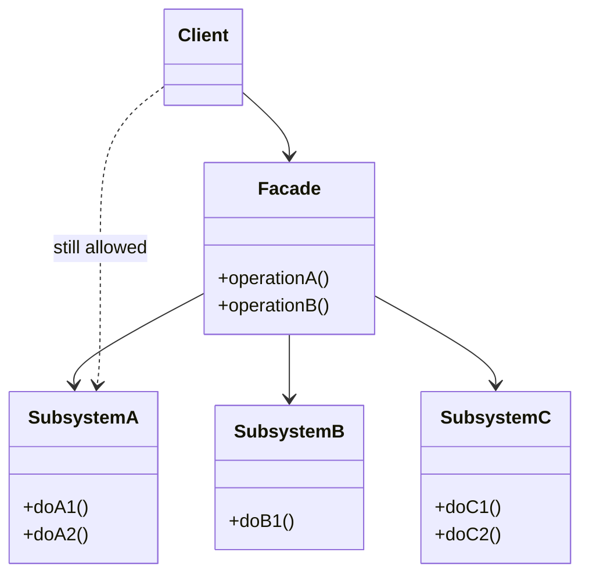

# Facade — One Door Into a Subsystem

**Date:** 2026-05-02 | **Updated:** 2026-05-02
**Tags:** `low-level-design` `design-patterns` `structural` `facade` `api-design` `bff`

## Summary

The Facade pattern provides a unified, higher-level interface to a set of interfaces in a subsystem. It does not hide the subsystem — it gives callers an easy default path while leaving the lower-level pieces accessible for advanced use.

## Intent

From GoF: "Provide a unified interface to a set of interfaces in a subsystem. Facade defines a higher-level interface that makes the subsystem easier to use."

A facade exists to:

- Reduce coupling between a client and a complex subsystem.
- Encode an opinionated **default workflow** (the 80% path) over a kit of parts.
- Provide a stable seam when the subsystem internals churn.

## Structure



The dotted arrow matters: a healthy facade does **not** force the client through it. Power users can drop down to the subsystem directly when the facade does not cover their case.

## Java Example

Consider a media transcoding subsystem with separate components for demuxing, decoding, encoding, and muxing.

```java
public class TranscodingFacade {
    private final Demuxer demuxer;
    private final DecoderFactory decoders;
    private final EncoderFactory encoders;
    private final Muxer muxer;
    private final ProgressReporter progress;

    public TranscodingFacade(Demuxer demuxer, DecoderFactory decoders,
                             EncoderFactory encoders, Muxer muxer,
                             ProgressReporter progress) {
        this.demuxer = demuxer;
        this.decoders = decoders;
        this.encoders = encoders;
        this.muxer = muxer;
        this.progress = progress;
    }

    public Path transcodeToMp4H264(Path source, Path destination) throws IOException {
        try (var input = demuxer.open(source)) {
            var videoStream = input.firstVideoStream();
            var audioStream = input.firstAudioStream();

            var videoDecoder = decoders.forStream(videoStream);
            var audioDecoder = decoders.forStream(audioStream);

            var videoEncoder = encoders.h264(videoStream.frameRate(), 1_500_000);
            var audioEncoder = encoders.aac(128_000);

            try (var output = muxer.create(destination, "mp4")) {
                output.addVideoStream(videoEncoder);
                output.addAudioStream(audioEncoder);

                Pipeline.run(input, videoDecoder, videoEncoder, output, progress);
                Pipeline.run(input, audioDecoder, audioEncoder, output, progress);
            }
            return destination;
        }
    }
}
```

The client wanted MP4/H.264. The facade encapsulates the seven-step recipe. Power users still call `Demuxer`, `EncoderFactory`, etc. directly when they need exotic codecs.

## TypeScript Example

```typescript
interface OrderRepository {
  save(order: Order): Promise<void>;
}
interface InventoryService {
  reserve(items: LineItem[]): Promise<ReservationId>;
  release(id: ReservationId): Promise<void>;
}
interface PaymentService {
  charge(customerId: string, amount: Money): Promise<ChargeId>;
}
interface NotificationService {
  orderPlaced(order: Order): Promise<void>;
}

class CheckoutFacade {
  constructor(
    private readonly orders: OrderRepository,
    private readonly inventory: InventoryService,
    private readonly payments: PaymentService,
    private readonly notifications: NotificationService,
  ) {}

  async placeOrder(input: PlaceOrderInput): Promise<Order> {
    const reservation = await this.inventory.reserve(input.items);
    try {
      const charge = await this.payments.charge(input.customerId, input.total);
      const order = Order.create({ ...input, chargeId: charge, reservation });
      await this.orders.save(order);
      await this.notifications.orderPlaced(order);
      return order;
    } catch (err) {
      await this.inventory.release(reservation);
      throw err;
    }
  }
}
```

## Facade vs BFF (Backend-for-Frontend)

A **BFF** is a deployed service that aggregates and reshapes downstream APIs for a specific client (web, iOS, Android). It looks like a facade — and at the code level it often *is* one — but the patterns operate at different layers:

| Aspect           | Facade (GoF)                                | BFF                                          |
| ---------------- | ------------------------------------------- | -------------------------------------------- |
| Layer            | In-process class                            | Deployed service                             |
| Audience         | Other code in the same process              | A specific client (mobile, web)              |
| Cross-cutting    | None inherent                               | Auth, rate-limit, caching, fan-out, retries  |
| Network boundary | No                                          | Yes                                          |
| Lifecycle        | Tied to the module                          | Independent service with its own deploys    |

A BFF *uses* the Facade pattern internally. Don't conflate the two: a class named `OrderFacade` in your monolith is not "a BFF."

## What a Facade Is NOT

A facade is **not** a god class. The pattern fails when:

- The facade owns business state instead of delegating.
- Every call ends up routed through it ("must go through the facade") — this defeats the optional-shortcut intent.
- It grows past one cohesive responsibility (e.g., `SystemFacade` with 80 methods spanning unrelated subsystems).
- Subsystem types leak through return values, undermining the seam.

If your "facade" is actually a god class, split by use case (`CheckoutFacade`, `RefundFacade`, `FulfillmentFacade`) — each focused on a single workflow.

## When to Use

- A subsystem requires a precise dance of objects to do a common task.
- You want a stable seam in front of a churn-prone implementation.
- You're layering: each layer exposes facades to the layer above.
- You need a single integration point for tracing, metrics, or auth around a subsystem.

## When NOT to Use

- The subsystem is already simple — adding a facade just adds indirection.
- Different clients need genuinely different shapes — build separate facades, not one mega-facade with optional flags.
- You're tempted to forbid direct subsystem access. That's a wall, not a facade. Consider Mediator instead.
- The "subsystem" is one class — Facade over a single class is just a wrapper, often misnamed.

## Pitfalls

- **Hidden coupling resurfaces**: returning subsystem types from facade methods leaks the abstraction.
- **Grows without bound**: every new feature adds one more method. Watch the line count and split.
- **Becomes mandatory**: once team rules force everyone through the facade, it must cover every use case — facade rot.
- **Hides failures**: catching and translating subsystem exceptions can swallow recoverable errors. Map deliberately.
- **Performance opacity**: callers don't see how many subsystem calls one facade method makes. Document or expose timings.
- **Confused with Mediator**: Mediator coordinates peers that *cannot* talk to each other. Facade is one-way: client → subsystem.

## Real-World Examples

- **`javax.faces.context.FacesContext`** and **Spring's `WebApplicationContext`** — facades over a tangle of services.
- **JDBC `DriverManager.getConnection`** — facade over driver registration, URL parsing, and dispatch.
- **SLF4J `LoggerFactory`** — facade over the discovered logging backend.
- **Stripe's high-level Node SDK methods** (`stripe.checkout.sessions.create`) — facade over multiple primitive Stripe APIs.
- **AWS SDK service clients** — facade over signing, retry, endpoint discovery, and HTTP transport.
- **`fetch`-based wrappers** like `axios` instances — facades over XHR/fetch quirks.
- **Spring Data repositories** — facade-ish over JPA's `EntityManager`.

## Related

Siblings (Structural):

- [adapter.md](./adapter.md) — converts one interface; Facade unifies many.
- [proxy.md](./proxy.md) — same interface as the subject; Facade exposes a *different*, higher-level interface.
- [decorator.md](./decorator.md) · [composite.md](./composite.md) · [bridge.md](./bridge.md) · [flyweight.md](./flyweight.md)

Cross-category:

- [../creational/](../creational/) — facades often combine factories that build the subsystem objects.
- [../behavioral/](../behavioral/) — Mediator is the close behavioral cousin; Command can power a facade method.

References: GoF, *Design Patterns: Elements of Reusable Object-Oriented Software*. Sam Newman, *Building Microservices* (BFF chapter).
