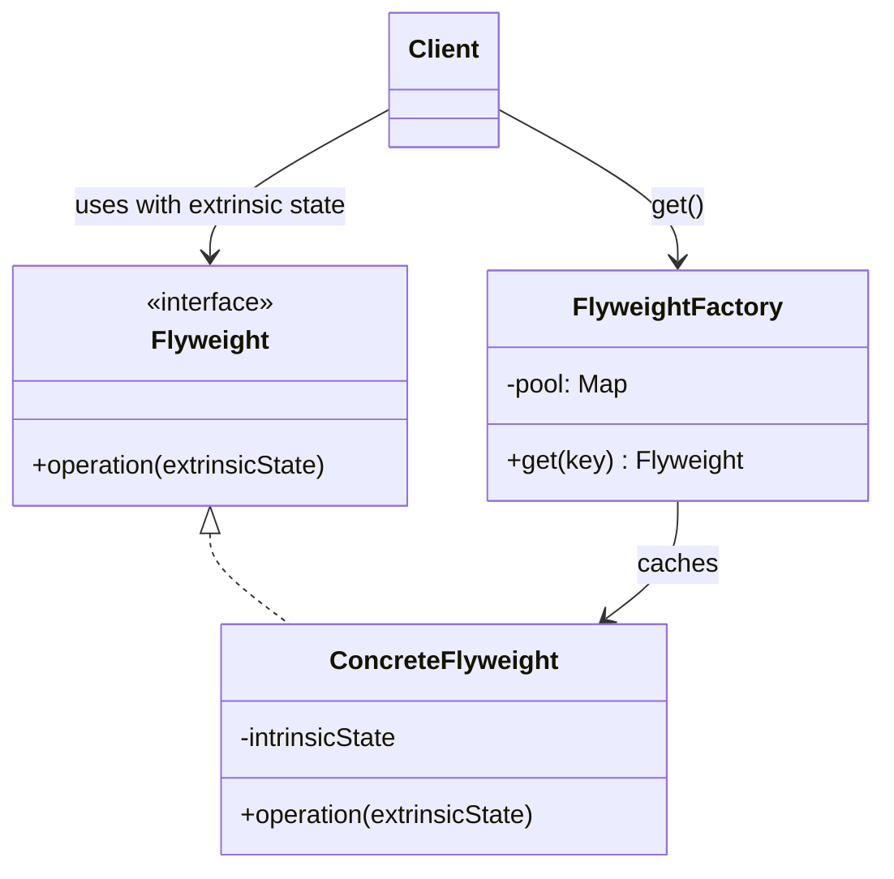

# Flyweight — Share Intrinsic State Across Many Objects

**Date:** 2026-05-02 | **Updated:** 2026-05-02
**Tags:** `low-level-design` `design-patterns` `structural` `flyweight` `memory` `string-pool`

## Summary

The Flyweight pattern uses sharing to support large numbers of fine-grained objects efficiently. It splits each conceptual object's state into **intrinsic** (shared, context-free) and **extrinsic** (per-use, passed in by the client), and stores only one immutable instance of each unique intrinsic state.

## Intent

From GoF: "Use sharing to support large numbers of fine-grained objects efficiently."

You reach for Flyweight when:

- You have a *lot* of objects (hundreds of thousands to millions).
- Most of their state repeats across instances.
- The repeated state can be made immutable.
- The cost of allocating distinct instances is unacceptable (RAM, GC pressure, CPU cache misses).

## Intrinsic vs Extrinsic State

This is the core design move:

| State type     | Belongs to                | Properties                                  |
| -------------- | ------------------------- | ------------------------------------------- |
| **Intrinsic**  | The flyweight object      | Shared, immutable, identifies the flyweight |
| **Extrinsic**  | The client / context      | Per-use, passed into operations             |

Example — text rendering:

- A glyph for the letter `e` in 12pt Inter has the same outline, advance width, kerning rules, and bitmap regardless of where on the page it appears. → **Intrinsic**.
- The `(x, y)` position where a particular `e` is drawn, the surrounding characters, and the color in the current run vary every time. → **Extrinsic**.

You allocate one `GlyphFlyweight` for `('e', Inter, 12pt)` and reuse it for every `e` on every page.

## Structure



The factory enforces sharing. **Never let clients construct flyweights directly** — go through the factory.

## Java Example — Glyph Flyweight

```java
public record Glyph(char ch, String fontFamily, int sizePt, byte[] bitmap, int advance) {
    public void render(Canvas canvas, int x, int y, Color color) {
        canvas.blit(bitmap, x, y, color);
    }
}

public final class GlyphFactory {
    private final Map<GlyphKey, Glyph> pool = new ConcurrentHashMap<>();

    private record GlyphKey(char ch, String fontFamily, int sizePt) {}

    public Glyph get(char ch, String fontFamily, int sizePt) {
        return pool.computeIfAbsent(
            new GlyphKey(ch, fontFamily, sizePt),
            this::loadGlyph);
    }

    private Glyph loadGlyph(GlyphKey k) {
        byte[] bitmap = FontEngine.rasterize(k.ch, k.fontFamily, k.sizePt);
        int advance = FontEngine.advance(k.ch, k.fontFamily, k.sizePt);
        return new Glyph(k.ch, k.fontFamily, k.sizePt, bitmap, advance);
    }
}

// Client code
GlyphFactory factory = new GlyphFactory();
String text = "Hello, world";
int x = 0;
for (char c : text.toCharArray()) {
    Glyph g = factory.get(c, "Inter", 12);   // shared
    g.render(canvas, x, 100, Color.BLACK);   // extrinsic: x, y, color
    x += g.advance();
}
```

A 50-page document with 200,000 characters might use only ~80 glyph objects (roughly the alphabet plus punctuation, per font/size combination), instead of 200,000.

## TypeScript Example — Particle System

```typescript
interface ParticleType {
  readonly sprite: ImageBitmap;
  readonly mass: number;
  readonly drag: number;
}

class ParticleTypeFactory {
  private readonly pool = new Map<string, ParticleType>();

  get(spriteUrl: string, mass: number, drag: number): ParticleType {
    const key = `${spriteUrl}|${mass}|${drag}`;
    let t = this.pool.get(key);
    if (!t) {
      t = {
        sprite: loadSpriteSync(spriteUrl),
        mass,
        drag,
      };
      this.pool.set(key, t);
    }
    return t;
  }

  size() {
    return this.pool.size;
  }
}

// Hot per-particle data — extrinsic, kept in tight typed arrays
class ParticleSystem {
  private readonly types = new ParticleTypeFactory();
  private readonly typeOf: ParticleType[] = [];
  private readonly x = new Float32Array(100_000);
  private readonly y = new Float32Array(100_000);
  private readonly vx = new Float32Array(100_000);
  private readonly vy = new Float32Array(100_000);
  private count = 0;

  spawn(spriteUrl: string, mass: number, drag: number, x: number, y: number) {
    this.typeOf[this.count] = this.types.get(spriteUrl, mass, drag);
    this.x[this.count] = x;
    this.y[this.count] = y;
    this.vx[this.count] = 0;
    this.vy[this.count] = 0;
    this.count++;
  }

  step(dt: number) {
    for (let i = 0; i < this.count; i++) {
      const t = this.typeOf[i];
      this.vx[i] *= 1 - t.drag * dt;
      this.vy[i] *= 1 - t.drag * dt;
      this.x[i] += this.vx[i] * dt;
      this.y[i] += this.vy[i] * dt;
    }
  }
}
```

A million-particle simulation with five sprite types pays for **five** `ParticleType` objects, not a million.

## Java's Built-In Flyweights

Two flyweight pools live inside the JVM and you've used both without thinking:

### `String` Pool

```java
String a = "hello";
String b = "hello";
String c = new String("hello");
String d = c.intern();

a == b   // true  — both point to the pooled flyweight
a == c   // false — `new String` always allocates fresh
a == d   // true  — intern() returns the pooled flyweight
```

Compile-time string literals are de-duplicated into a single shared `String` object held in the string table. `String.intern()` lets you opt user-supplied strings into the pool (use sparingly — the pool itself isn't free).

### `Integer` Cache

```java
Integer x = 127;
Integer y = 127;
Integer m = 128;
Integer n = 128;

x == y   // true  — both point to the cached Integer for 127
m == n   // false — outside the cache range, two new Integer instances
```

`Integer.valueOf(int)` returns shared instances for `-128..127` by default. The same applies to `Byte`, `Short`, `Long`, `Character` (range 0..127), and `Boolean`. Autoboxing routes through these caches.

This is the classic "why does `==` lie about `Integer`" interview question — and the answer is: because Flyweight, with a small range.

## When to Use

- You have very many fine-grained objects.
- Storage cost (RAM, GC, CPU cache) is genuinely a problem — measure first.
- Most of the per-object state can be moved out of the object (extrinsic) without breaking the model.
- The remaining intrinsic state can be made immutable.
- Object identity is *not* meaningful to the application (sharing makes `==` deceptive).

## When NOT to Use

- You have hundreds of objects, not millions. Flyweight is a memory optimization; without scale, the indirection costs more than it saves.
- The state is mostly unique per instance — there's nothing to share.
- The objects must be mutable per-instance — sharing is unsafe.
- Object identity matters to the caller (`==`, `IdentityHashMap`, locks).
- The pool would grow unbounded — a leak disguised as a cache.

## Pitfalls

- **Mutability slip-up**: a flyweight gets a setter "just for one case" and now mutating one instance silently changes thousands. Make intrinsic state truly immutable (final fields, defensive copies, records).
- **Identity surprises**: `==` returns true for shared flyweights and false for non-shared. Never rely on identity for objects that might be flyweights — use `equals`.
- **Pool unbounded growth**: factories that never evict become memory leaks. Bound with LRU or weak references where appropriate.
- **Concurrent factory races**: multiple threads asking for a missing key may all build it. `computeIfAbsent` solves this on `ConcurrentHashMap`; a plain `HashMap` + `synchronized` works too.
- **Extrinsic state placement**: stuffing extrinsic state back into the flyweight defeats the pattern. Keep the per-use state at the call site.
- **`String.intern()` overuse**: the string table has its own size. Interning every user input can blow up the pool.
- **Premature optimization**: profile first. Modern allocators are fast; many object floods that *look* like Flyweight candidates aren't worth the complexity.

## Real-World Examples

- **Java `String` pool** and **`Integer`/`Long`/`Short`/`Byte`/`Character` caches** (see above).
- **Boolean.TRUE / Boolean.FALSE** — two-instance flyweights.
- **`Collections.emptyList()`, `Optional.empty()`** — single-instance flyweights.
- **Enum constants** — every enum value is, by definition, a flyweight.
- **Glyph rendering** in browsers, PDF renderers, and game engines.
- **Particle systems** in graphics pipelines.
- **Tile-based games** (Minecraft block types, classic 2D tiles) — block ID maps to a flyweight; per-cell data is extrinsic.
- **GUI toolkits** sharing icon assets, brushes, and pens across thousands of widgets.
- **Compilers / ASTs** — keyword tokens, common identifiers, primitive type nodes.
- **Database query plans / prepared statement caches** — the plan flyweight is shared; the per-execution parameter binding is extrinsic.
- **Browser CSS engine** — computed style sharing across DOM nodes that resolve to the same style key.

## Related

Siblings (Structural):

- [composite.md](./composite.md) — Composite leaves are perfect Flyweight candidates when many leaves repeat.
- [proxy.md](./proxy.md) — both share an interface with a real subject, but Proxy controls access to *one* subject; Flyweight shares *one* representation among many uses.
- [decorator.md](./decorator.md) · [adapter.md](./adapter.md) · [facade.md](./facade.md) · [bridge.md](./bridge.md)

Cross-category:

- [../creational/](../creational/) — Flyweight always pairs with a factory (often Singleton-scoped). Object Pool is the close creational cousin: pools reuse mutable, stateful objects (DB connections); Flyweight shares immutable ones.
- [../behavioral/](../behavioral/) — Memento/Iterator/Visitor are orthogonal; State objects are often implemented as flyweights when state is stateless.

References: GoF, *Design Patterns: Elements of Reusable Object-Oriented Software*. JLS sections on string interning and `Integer.valueOf` caching.
