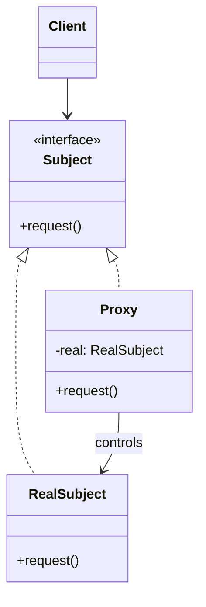

# Proxy — Stand-In With Extra Behavior

**Date:** 2026-05-02 | **Updated:** 2026-05-02
**Tags:** `low-level-design` `design-patterns` `structural` `proxy` `lazy-loading` `hibernate`

## Summary

The Proxy pattern provides a surrogate or placeholder for another object to control access to it. The proxy implements the same interface as the real subject, lets the client treat them interchangeably, and inserts additional behavior — lazy loading, access control, remote dispatch, caching, instrumentation — around the real call.

## Intent

From GoF: "Provide a surrogate or placeholder for another object to control access to it."

A proxy:

- Has the **same interface** as the real subject.
- **Owns** the relationship to the real subject (often creating, locating, or fetching it).
- Inserts a control point between client and subject.

## Four Classic Flavors

GoF lists four; each remains common today.

| Flavor          | Purpose                                                 | Modern example                                   |
| --------------- | ------------------------------------------------------- | ------------------------------------------------ |
| **Virtual**     | Defer creation/loading of an expensive object          | Hibernate lazy associations, image placeholders  |
| **Protection** | Enforce access rights                                   | Spring Security method proxies, capability tokens|
| **Remote**      | Local representative of an object in another address space | Java RMI stubs, gRPC client stubs              |
| **Smart**       | Add extra bookkeeping (refcount, locks, audit, cache)   | `synchronized` wrapper, ORM dirty-tracking      |

## Structure



## Java Example — Virtual Proxy (Lazy Loading)

```java
public interface Image {
    void render(Graphics g);
    int width();
    int height();
}

public final class HighResImage implements Image {
    private final BufferedImage data;
    public HighResImage(Path file) throws IOException {
        this.data = ImageIO.read(file.toFile());   // expensive
    }
    @Override public void render(Graphics g) { g.drawImage(data, 0, 0, null); }
    @Override public int width()  { return data.getWidth(); }
    @Override public int height() { return data.getHeight(); }
}

public final class LazyImage implements Image {
    private final Path source;
    private final int knownWidth;
    private final int knownHeight;
    private volatile HighResImage real;     // double-checked locking

    public LazyImage(Path source, int w, int h) {
        this.source = source;
        this.knownWidth = w;
        this.knownHeight = h;
    }

    private HighResImage load() {
        var r = real;
        if (r == null) {
            synchronized (this) {
                r = real;
                if (r == null) {
                    try {
                        r = new HighResImage(source);
                        real = r;
                    } catch (IOException e) {
                        throw new UncheckedIOException(e);
                    }
                }
            }
        }
        return r;
    }

    @Override public int width()  { return knownWidth; }   // no load
    @Override public int height() { return knownHeight; }  // no load
    @Override public void render(Graphics g) { load().render(g); } // load on first paint
}
```

The proxy serves cheap metadata directly and only loads pixels when something actually needs them.

## Java Example — Protection Proxy via `java.lang.reflect.Proxy`

Dynamic proxies are how Spring AOP, JDK proxies for repositories, and many test mocks work:

```java
public interface AccountService {
    void debit(String accountId, Money amount);
    Money balance(String accountId);
}

public final class SecurityInvocationHandler implements InvocationHandler {
    private final Object target;
    private final SecurityContext security;

    public SecurityInvocationHandler(Object target, SecurityContext security) {
        this.target = target;
        this.security = security;
    }

    @Override
    public Object invoke(Object proxy, Method method, Object[] args) throws Throwable {
        var required = method.getAnnotation(RequiresRole.class);
        if (required != null && !security.hasRole(required.value())) {
            throw new AccessDeniedException(method.getName());
        }
        try {
            return method.invoke(target, args);
        } catch (InvocationTargetException e) {
            throw e.getCause();
        }
    }
}

AccountService secured = (AccountService) Proxy.newProxyInstance(
    AccountService.class.getClassLoader(),
    new Class<?>[]{ AccountService.class },
    new SecurityInvocationHandler(realService, securityContext));
```

## TypeScript Example — Smart Proxy via `Proxy`

JavaScript's built-in `Proxy` provides traps that align cleanly with the pattern:

```typescript
function memoizing<T extends object>(target: T): T {
  const cache = new Map<string, unknown>();
  return new Proxy(target, {
    get(t, prop, receiver) {
      const original = Reflect.get(t, prop, receiver);
      if (typeof original !== 'function') return original;
      return (...args: unknown[]) => {
        const key = `${String(prop)}:${JSON.stringify(args)}`;
        if (cache.has(key)) return cache.get(key);
        const result = original.apply(t, args);
        cache.set(key, result);
        return result;
      };
    },
  });
}

class PriceService {
  fetch(symbol: string) { /* expensive */ return 42; }
}

const cached = memoizing(new PriceService());
cached.fetch('NVDA'); // calls
cached.fetch('NVDA'); // cache hit
```

## Hibernate / JPA Lazy Proxies

The most production-relevant proxy you'll meet is the one Hibernate generates for lazy associations:

```java
@Entity
public class Order {
    @Id Long id;

    @ManyToOne(fetch = FetchType.LAZY)
    Customer customer;     // Hibernate injects a proxy here
}

Order order = session.find(Order.class, 1L);
// order.customer is a proxy: a subclass of Customer (via Bytebuddy/CGLIB)
// or an interface proxy. Class is Customer$HibernateProxy.

order.customer.getName();  // triggers SELECT * FROM customers WHERE id = ?
```

Implications worth burning into memory:

- The proxy is a **subclass**; `instanceof Customer` works, but `customer.getClass() == Customer.class` returns false.
- The proxy is bound to the original `Session`. Touching it after the session closes throws `LazyInitializationException`.
- Equality: override `equals`/`hashCode` on business keys, not identity, or proxies surprise you.
- Loading happens on **first non-id getter**. `order.customer.getId()` is free.

## Proxy vs Decorator — The Constant Source of Confusion

They both wrap, both share an interface. The differences:

| Aspect                | Proxy                                                  | Decorator                                            |
| --------------------- | ------------------------------------------------------ | ---------------------------------------------------- |
| Stacking              | Usually a single layer                                 | Designed to stack arbitrarily                        |
| Who creates the inner | Proxy often creates/locates it                         | Client supplies the wrappee                          |
| Intent                | Control access to *the same conceptual object*         | Add behavior to *a richer pipeline*                  |
| Substitution          | Transparent stand-in ("acts as the subject")           | Augmented variant ("subject + extras")               |

Rule of thumb: if you'd be happy that the client never knew the proxy existed (lazy loading, RMI, security), it's a Proxy. If the layering is the point, it's a Decorator.

## When to Use

- You need lazy initialization of an expensive resource (Virtual).
- You need to gate access by permission, capability, or quota (Protection).
- You're hiding network distance behind a local interface (Remote).
- You need transparent caching, logging, audit, or refcounting around an existing API (Smart).
- You're building an ORM, AOP framework, or test-mocking library.

## When NOT to Use

- The added behavior is permanent and intrinsic — bake it into the real class.
- You'd be hiding a contract change. A proxy must not weaken or strengthen the subject's contract silently.
- The "same interface" property is impossible because clients depend on concrete subclass features (e.g., reflection on the exact runtime class). Hibernate users feel this.
- The cost of indirection (allocations, megamorphic dispatch) exceeds the benefit in tight loops.

## Pitfalls

- **`equals`/`hashCode` and identity** break under proxies. Always override on business keys, not `==`.
- **Final classes / final methods** can't be subclassed by CGLIB-style proxies. JDK proxies require an interface.
- **Serialization**: proxies serialize to garbage. Detach before sending across boundaries.
- **`@Async`, `@Transactional`, `@Cacheable` self-invocation trap**: calling `this.method()` bypasses the Spring proxy. Inject self or split the bean.
- **Lazy loading + closed session = `LazyInitializationException`**. Either fetch eagerly with care, fetch via `JOIN FETCH`, use `EntityGraph`, or `Hibernate.initialize` before exit.
- **Hidden network calls**: a remote proxy makes `customer.getName()` look free. Profile.
- **Proxy stacks** (proxy of a proxy of a decorated component) get unreadable. Keep the chain shallow.
- **Memory leaks**: smart proxies that hold caches forever. Bound them.

## Real-World Examples

- **Java RMI stubs**, **gRPC generated clients** — remote proxies.
- **`java.lang.reflect.Proxy`** and **CGLIB / ByteBuddy** — dynamic proxy infrastructure.
- **Spring AOP** — `@Transactional`, `@Cacheable`, `@Async`, `@PreAuthorize` are all proxy-implemented.
- **Hibernate / JPA** lazy associations and `getReference`.
- **Mockito** mocks — proxies that record interactions.
- **JavaScript `Proxy`** — Vue 3 reactivity, MobX, Immer, validation libraries.
- **Cloudflare Workers / service worker fetch** — interception proxies for HTTP.
- **Image / video lazy loading** in browsers (`loading="lazy"`).
- **Database connection pools** often hand out a `Connection` proxy that returns the wrapped connection to the pool on `close()` instead of closing it.

## Related

Siblings (Structural):

- [decorator.md](./decorator.md) — same interface, different intent (see comparison above).
- [adapter.md](./adapter.md) — different interface; Proxy preserves it.
- [facade.md](./facade.md) — exposes a *new* simplified interface; Proxy preserves the existing one.
- [composite.md](./composite.md) · [bridge.md](./bridge.md) · [flyweight.md](./flyweight.md)

Cross-category:

- [../creational/](../creational/) — factories often produce proxies (Spring's `BeanFactory`, JPA's `EntityManager.getReference`).
- [../behavioral/](../behavioral/) — Chain of Responsibility passes a request through handlers; conceptually adjacent for cross-cutting interception.

References: GoF, *Design Patterns: Elements of Reusable Object-Oriented Software*. Hibernate documentation (lazy initialization). Java RMI specification.
