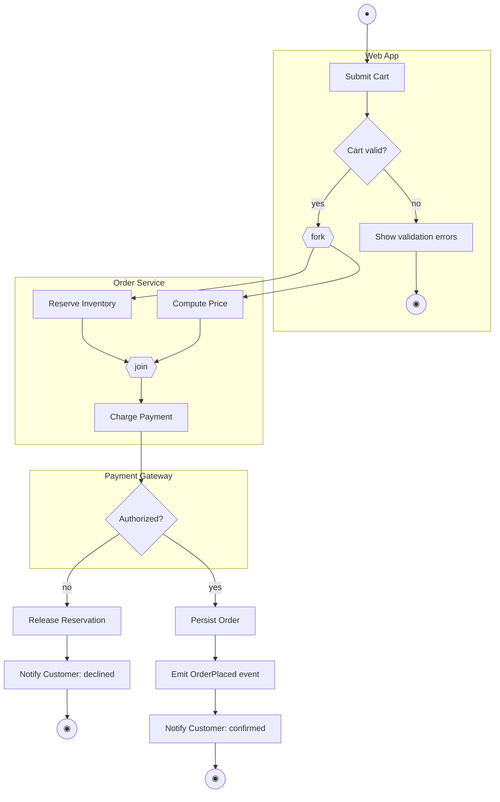
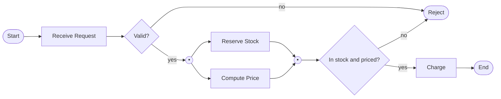

# Activity Diagram

**Date:** 2026-05-02 | **Updated:** 2026-05-02
**Tags:** `low-level-design` `uml` `activity-diagram` `workflow` `modeling`

## Summary

An activity diagram models flow — the order in which actions happen, where they branch, and where they happen in parallel. It is UML's flowchart, with stronger semantics for concurrency (fork/join) and ownership (swim lanes). Reach for it when sequence diagrams start to feel like algorithms in disguise.

## Table of Contents

- [The Pieces](#the-pieces)
- [Actions, Decisions, and Merges](#actions-decisions-and-merges)
- [Fork and Join: Real Parallelism](#fork-and-join-real-parallelism)
- [Swim Lanes](#swim-lanes)
- [Object Flow](#object-flow)
- [Activity vs Sequence Diagram](#activity-vs-sequence-diagram)
- [When to Draw an Activity Diagram](#when-to-draw-an-activity-diagram)
- [Mermaid Example](#mermaid-example)
- [Common Mistakes](#common-mistakes)
- [Related](#related)

## The Pieces

An activity diagram is built from a small vocabulary:

| Symbol | Meaning |
|--------|---------|
| Filled black circle | initial node (start) |
| Rounded rectangle | action / activity |
| Diamond | decision (one input, multiple guarded outputs) or merge (multiple inputs, one output) |
| Thick bar | fork (one input, multiple parallel outputs) or join (multiple inputs synchronized) |
| Filled circle inside ring | final node (end of flow) |
| Plain circle with X | flow final (kills one token, others continue) |
| Rectangle with curled corner | object node (data flowing between actions) |

Tokens flow along arrows. An action consumes a token, does work, and emits a token. Forks split one token into many; joins wait for all incoming tokens.

## Actions, Decisions, and Merges

An action is a unit of work: "Validate Cart", "Reserve Inventory", "Send Receipt". Phrasing is verb plus object, same as use cases.

A **decision** is a diamond with one inbound arrow and multiple outbound arrows, each labeled with a guard `[in stock]`, `[out of stock]`. Exactly one branch is taken.

A **merge** is a diamond with multiple inbound and one outbound. It is the inverse of a decision and represents "control flows continue here regardless of which branch arrived". It does **not** wait for all branches — that is a join.

Mixing up merge and join is the most common semantic error on activity diagrams.

## Fork and Join: Real Parallelism

A fork is a thick horizontal bar: one inbound, many outbound. Tokens proceed in parallel down each branch. A join is the same bar with many inbound, one outbound — and it **synchronizes**, waiting for all inbound tokens before letting one out.

```
       |
       v
====[ fork ]====
   |    |    |
  do  some  things
   |    |    |
====[ join ]====
       |
       v
```

This is the activity diagram's superpower over a flowchart: parallel branches are first-class, with explicit synchronization. A flowchart can show "two things happen", but cannot natively express "wait for both".

A **flow final** node lets one parallel branch end without ending the whole activity. Useful when one fork branch is fire-and-forget logging and the other branches must complete.

## Swim Lanes

Swim lanes (also called partitions) divide the diagram into vertical or horizontal strips, each owned by an actor, role, or component. Actions are placed in the lane of whoever performs them.

```
| Customer  |  Web App  | Payment Gateway |
|-----------|-----------|-----------------|
|  submit   |           |                 |
|     |     | validate  |                 |
|     |     |    |      |                 |
|     |     | charge ---->  authorize     |
|     |     |    |      |                 |
|     |     | confirm   |                 |
```

Why lanes matter:

- They show **where work happens** — who is responsible at each step.
- Crossings between lanes are integration boundaries — every line crossing a lane edge is a network call, queue, or handoff.
- They expose ping-pong: if control bounces back and forth between two lanes ten times, the design is too chatty.

## Object Flow

In addition to control flow (the arrow says "do this next"), activity diagrams support **object flow**: an arrow that represents data passing from one action to the next, drawn through an object node.

```
[Validate Cart] -- :Cart --> [Reserve Inventory]
```

Object nodes can also have states in `[ ]`: `:Order [submitted]` then `:Order [paid]` then `:Order [shipped]`. Powerful for showing how an entity's state changes as it moves through the workflow, without needing a separate state machine.

## Activity vs Sequence Diagram

These two are routinely confused. Different questions.

| Question | Use |
|----------|-----|
| Who calls whom, in what order, blocking or not? | Sequence |
| What is the workflow, with branches and parallelism? | Activity |
| Who is responsible for which step? | Activity (with swim lanes) |
| How does one object's call stack unwind? | Sequence |
| What happens after a fork joins? | Activity |
| What is the protocol between two services? | Sequence |

Symptom that you picked wrong: your sequence diagram is mostly nested `alt` and `loop` fragments inside a single lifeline. That is not an interaction; it is an algorithm. Switch to an activity diagram.

Symptom in the other direction: your activity diagram has no branches, no parallelism, just a chain of actions across two lanes calling each other. That is a sequence diagram in flowchart clothing.

## When to Draw an Activity Diagram

Worth drawing:

- Business workflows with approvals, exceptions, and parallel sub-tasks.
- Order pipelines, claim processing, onboarding, KYC.
- Concurrent algorithms where fork/join semantics matter.
- Documenting a process that spans multiple roles or systems — swim lanes carry their weight here.
- Replacing a wall of bullet-pointed steps in a runbook.

Skip:

- Trivial linear flows (a numbered list is shorter).
- Pure interaction between two services (sequence diagram is sharper).
- Single-object lifecycle (state machine is sharper).

## Mermaid Example

Mermaid does not render full UML activity notation, but `flowchart` covers the same intent. Below is an order workflow with a parallel reserve-and-price step, a payment decision, and swim-lane-style subgraphs.



What this diagram argues:

- Three swim lanes (Web App, Order Service, Payment Gateway). Every arrow that crosses a `subgraph` boundary is a real handoff.
- `fork` and `join` make the parallel reserve-and-price explicit. The join waits for both before charging.
- The decline branch has its own compensation step (`Release Reservation`) — a step often forgotten when a flow is described in prose.
- Three end nodes: validation reject, payment decline, success. Multiple final states are normal.

For a more UML-faithful version using `flowchart`'s decision and parallel rendering:



The `((•))` nodes stand in for fork and join bars.

## Common Mistakes

- **Confusing merge with join.** A merge does not synchronize. A join does. Mixing them up changes the diagram from "two parallel tasks must both finish" to "either branch can continue alone" — usually a real bug.
- **Forgetting compensation paths.** When the diagram shows reserve-then-charge, the failed-charge branch must release the reservation. If it does not, the diagram is hiding a leak.
- **Using activity diagrams for object collaboration.** That is the sequence diagram's job.
- **Ignoring swim lanes.** Without lanes, you lose the "who owns this step" information that makes activity diagrams worth drawing for cross-team workflows.
- **Drawing every if-statement in the code.** An activity diagram is a model, not a transcription. Stay above the level of `if (x == null) return`.
- **No final nodes or many unreachable ones.** Each terminal state should be intentional and visible.

## Related

- [Class Diagram](class-diagram.md)
- [Use Case Diagram](use-case-diagram.md)
- [Sequence Diagram](sequence-diagram.md)
- [State Machine Diagram](state-machine-diagram.md)
- [Association](../class-relationships/association.md)
- [Dependency](../class-relationships/dependency.md)

## References

- OMG, _Unified Modeling Language Specification_, version 2.5.1.
- Martin Fowler, _UML Distilled_, 3rd ed.
