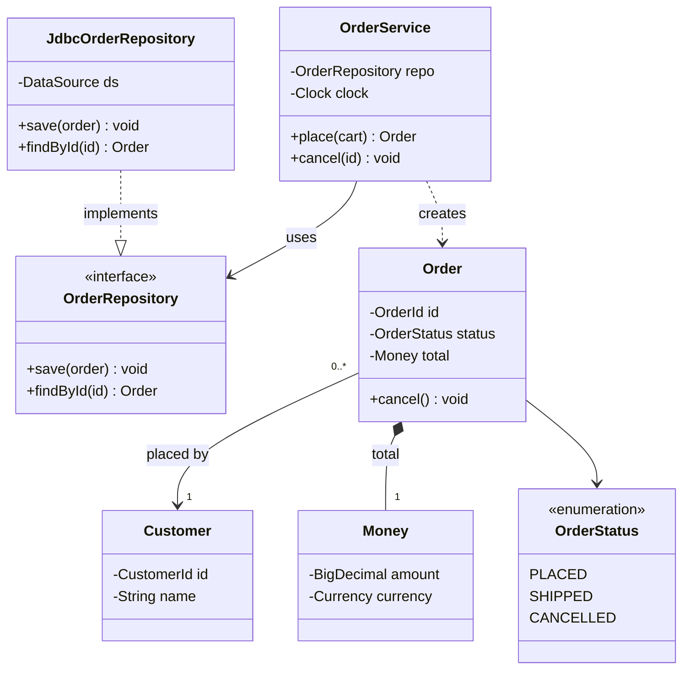

# Class Diagram

**Date:** 2026-05-02 | **Updated:** 2026-05-02
**Tags:** `low-level-design` `uml` `class-diagram` `modeling` `design`

## Summary

A UML class diagram is a static structural view of a system: which classes exist, what data and behavior they hold, and how they reference each other. Used well, it answers "what depends on what" at a glance. Used badly, it becomes a slow, ugly clone of the source code.

## Table of Contents

- [What a Class Box Contains](#what-a-class-box-contains)
- [The Lines: Six Relationships](#the-lines-six-relationships)
- [Multiplicity](#multiplicity)
- [When to Draw a Class Diagram](#when-to-draw-a-class-diagram)
- [Keeping Diagrams Useful](#keeping-diagrams-useful)
- [Mermaid Example](#mermaid-example)
- [Common Mistakes](#common-mistakes)
- [Related](#related)

## What a Class Box Contains

A class is drawn as a rectangle split into three compartments:

```
+-------------------------+
|       OrderService      |   <- name (italic if abstract, <<interface>> if interface)
+-------------------------+
| - repo: OrderRepository |   <- attributes / fields
| - clock: Clock          |
+-------------------------+
| + place(cart): Order    |   <- operations / methods
| + cancel(id): void      |
| - validate(cart): void  |
+-------------------------+
```

Visibility prefixes:

- `+` public
- `-` private
- `#` protected
- `~` package-private

Stereotypes (in `<<>>`) mark variants: `<<interface>>`, `<<abstract>>`, `<<enumeration>>`, `<<entity>>`, `<<service>>`. Use them sparingly. The diagram should still be readable without a stereotype glossary.

You do not have to show every field and method. A class diagram is not the source code. Show what carries the structural argument you are making — drop the rest.

## The Lines: Six Relationships

UML uses different arrowheads and line styles for relationships. They are not interchangeable; each one means something specific.

### 1. Association

A plain solid line. "These two classes know about each other." Direction can be added with an open arrow if the navigation is one-way.

```
Customer -------- Order
```

This says: a Customer is related to Orders, somehow. Most useful with multiplicity attached (see below).

### 2. Aggregation

A solid line with a hollow diamond on the container side. "Has-a, but the parts can live without the whole."

```
Team <>-------- Player
```

A `Team` aggregates `Player`s. Disband the team and the players still exist. Aggregation is famously the relationship UML cannot make people agree on; many practitioners just use plain association and skip it.

### 3. Composition

A solid line with a filled diamond on the container side. "Has-a, and the parts die with the whole."

```
House <#>-------- Room
```

A `Room` exists only as part of a specific `House`. Tear down the house, the rooms are gone. This is the strong ownership relation.

### 4. Dependency

A dashed line with an open arrow. "Uses-a, transiently."

```
ReportService - - - - -> PdfRenderer
```

A `ReportService` calls `PdfRenderer.render(...)` somewhere — passes it as a parameter, returns it, instantiates it locally — but does not hold it as a field. Dependencies show coupling without ownership.

### 5. Realization (interface implementation)

A dashed line with a hollow triangle. "Implements this interface."

```
JdbcOrderRepo - - - -|> <<interface>> OrderRepository
```

### 6. Inheritance (generalization)

A solid line with a hollow triangle. "Is-a subtype of."

```
SavingsAccount --------|> Account
```

Inheritance is for true substitutability (Liskov). When in doubt, prefer composition.

## Multiplicity

Numbers near the line ends show how many instances participate.

| Notation | Meaning |
|----------|---------|
| `1` | exactly one |
| `0..1` | zero or one (optional) |
| `*` or `0..*` | zero or more |
| `1..*` | one or more |
| `2..5` | between 2 and 5 |

```
Customer 1 -------- 0..*  Order
```

"Each Order has exactly one Customer; each Customer has zero or more Orders." Multiplicity is one of the highest-value annotations on a class diagram — it forces you to think about cardinality and nullability.

## When to Draw a Class Diagram

Draw one when you need to:

- Communicate the **shape** of a domain to other people (onboarding, design review, interview).
- Compare two design alternatives before writing code.
- Document a stable architectural seam (the public API of a module, the entity model of a bounded context).
- Spot smells: god classes, circular dependencies, missing abstractions.

Do **not** draw one when:

- The code is already trivial and the diagram would just restate it.
- The system is changing too fast for the diagram to stay accurate (it will rot in a week).
- You are only modeling because a process tells you to. A diagram nobody reads is waste.

## Keeping Diagrams Useful

Don't model everything. The trap with class diagrams is treating them as a literal map of every class. The result is a wall-sized poster nobody reads.

Heuristics:

- **One diagram, one question.** "What is the entity model of the order context?" "How does the strategy plug in?" One question per picture.
- **Hide infrastructure.** DTOs, mappers, controllers, framework base classes — leave them out unless they are the point.
- **Cap it.** Roughly seven (give or take two) classes per diagram. Beyond that, split.
- **Show the relationship that matters.** If the question is "who owns what", show composition and aggregation. If the question is "who can be swapped", show realization.
- **Annotate with multiplicity** at minimum. Visibility and parameter types are optional flavor.
- **Auto-generated full-class-graphs are not class diagrams.** They are noise.

## Mermaid Example

A small order-management slice. One service, one repository interface with one implementation, one entity hierarchy, one value object held by composition.



What this diagram argues:

- `OrderService` depends on the `OrderRepository` abstraction, not the JDBC implementation (dashed line `..|>` for realization, solid arrow for the dependency).
- `Money` is composed into `Order` (filled diamond `*--`); kill the order and its money value object goes with it.
- `Customer` is associated with `Order` with multiplicity `1` to `0..*`.
- `OrderStatus` is an enumeration, marked with the stereotype.

That is enough to argue the design without listing every getter.

## Common Mistakes

- **Using inheritance for code reuse.** If `B` is not substitutable for `A`, do not draw `B --|> A`. Use composition.
- **Confusing aggregation and composition.** If you cannot articulate "the parts die with the whole", it is not composition.
- **Missing multiplicity.** A bare association line is half a sentence. Add `1`, `0..*`, or `0..1`.
- **Drawing every getter and setter.** Operations on a class diagram are about behavior, not field accessors.
- **Modeling DTOs as if they were domain entities.** Mark them or omit them.
- **Treating Mermaid output as authoritative without review.** Auto-generation is fine; check it argues something before you ship it.

## Related

- [Use Case Diagram](use-case-diagram.md)
- [Sequence Diagram](sequence-diagram.md)
- [Activity Diagram](activity-diagram.md)
- [State Machine Diagram](state-machine-diagram.md)
- [Association](../class-relationships/association.md)
- [Aggregation](../class-relationships/aggregation.md)
- [Composition](../class-relationships/composition.md)
- [Dependency](../class-relationships/dependency.md)
- [Realization](../class-relationships/realization.md)

## References

- OMG, _Unified Modeling Language Specification_, version 2.5.1.
- Martin Fowler, _UML Distilled_, 3rd ed.
