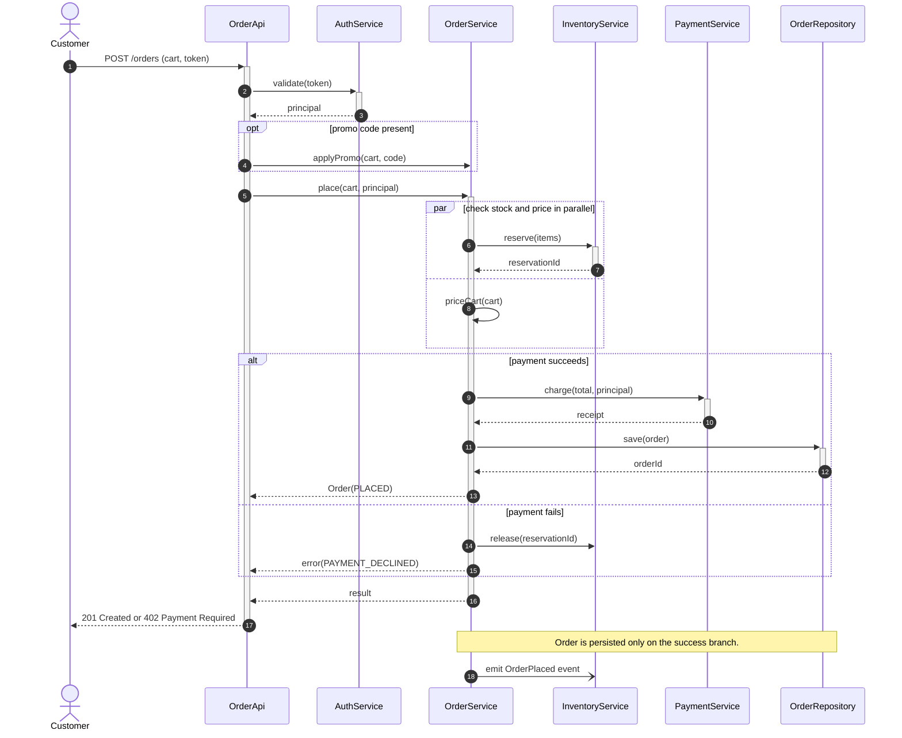

# Sequence Diagram

**Date:** 2026-05-02 | **Updated:** 2026-05-02
**Tags:** `low-level-design` `uml` `sequence-diagram` `interaction` `modeling`

## Summary

A sequence diagram shows objects as vertical lifelines and messages between them as horizontal arrows, with time flowing top to bottom. It is the right tool when the question is "in what order do these collaborators talk to each other to satisfy this scenario?". It is the wrong tool for branching business logic — that is a flowchart's job.

## Table of Contents

- [The Pieces](#the-pieces)
- [Lifelines](#lifelines)
- [Messages: Sync vs Async](#messages-sync-vs-async)
- [Activations](#activations)
- [Combined Fragments: alt, opt, loop, par](#combined-fragments-alt-opt-loop-par)
- [Sequence vs Flowchart](#sequence-vs-flowchart)
- [When to Draw a Sequence Diagram](#when-to-draw-a-sequence-diagram)
- [Mermaid Example](#mermaid-example)
- [Common Mistakes](#common-mistakes)
- [Related](#related)

## The Pieces

A sequence diagram has five working parts:

1. **Lifelines** — vertical dashed lines under each participant.
2. **Messages** — horizontal arrows between lifelines, labeled with the call.
3. **Activations** — narrow rectangles on a lifeline showing when that participant is busy.
4. **Combined fragments** — boxes around groups of messages (`alt`, `opt`, `loop`, `par`, `critical`).
5. **Notes** — sticky-note callouts for clarification.

Time flows top to bottom. There is no horizontal time scale; only ordering.

## Lifelines

Each participant gets a head box at the top with a name and (optionally) a type:

```
:Browser   client:OrderApi   svc:OrderService   repo:OrderRepository
```

Conventions:

- `:Type` — anonymous instance of a type.
- `name:Type` — named instance.
- Use stereotypes (`<<actor>>`, `<<boundary>>`, `<<control>>`, `<<entity>>`) only when they buy clarity.

Order participants left to right in the order they first appear. That keeps arrows mostly going forward and avoids spaghetti.

## Messages: Sync vs Async

Three arrow shapes carry meaning:

| Arrow | Meaning |
|-------|---------|
| `->>` (filled head, solid) | synchronous call — caller blocks until the callee returns |
| `-)`  (open head, solid)   | asynchronous message — caller continues immediately |
| `-->>` (filled head, dashed) | reply / return value |

A self-call is an arrow from a lifeline back to itself, drawn as a small loop on the activation. Use sparingly — too many self-calls signal "this should be a flowchart, not a sequence diagram".

Message labels:

- `placeOrder(cart)` — the operation and arguments
- `: Order` — return type, attached to the reply arrow
- Conditions in `[ ]`: `[total > 0] charge(total)` — though most teams move conditional logic into an `alt` fragment instead

## Activations

An activation is a thin vertical rectangle drawn on a lifeline while that participant is executing. It starts when a synchronous message arrives and ends when control returns.

Why bother with activations:

- They make it obvious which participant **owns** the call stack at any point.
- Nested activations show synchronous fan-out cleanly: A calls B, which calls C; you see three stacked rectangles.
- They distinguish "this object is doing work right now" from "this object is just sitting there".

Mermaid auto-draws activations when you use `activate` / `deactivate` or `+` / `-` shorthand on the arrows.

## Combined Fragments: alt, opt, loop, par

When a scenario branches or repeats, wrap the affected messages in a combined fragment — a labeled box.

- **`alt`** — alternatives (if/else). Multiple compartments separated by a dashed line. Each compartment has a `[guard]` label.
- **`opt`** — single optional branch (if without else).
- **`loop`** — repeats while a guard holds. Label like `loop [for each item]` or `loop(0..n)`.
- **`par`** — parallel execution. Each compartment runs concurrently; ordering between compartments is undefined.
- **`critical`** — a region that must execute atomically (no interleaving with parallel flows).
- **`break`** — exits the enclosing fragment if the guard holds (early return).

Use them. A flat sequence with no fragments cannot describe `if`, `for`, or concurrency, so it stops being honest about real systems.

## Sequence vs Flowchart

The most common mistake is drawing a sequence diagram when the actual question is "what is the algorithm?". Different tools, different jobs:

| Question | Use |
|----------|-----|
| In what order do collaborators message each other? | Sequence diagram |
| Who owns each step of the call stack? | Sequence diagram |
| What is the procedural logic of one component? | Flowchart / activity diagram |
| What states does a single object move through? | State machine |
| What goals can each actor accomplish? | Use case diagram |

A sequence diagram with deep `alt` nesting and big procedural blocks inside a single lifeline is actually a flowchart fighting to escape. Redraw it as a flowchart or activity diagram.

## When to Draw a Sequence Diagram

Worth the effort:

- Reasoning about a **specific scenario** through several services or layers (place order, password reset, webhook delivery).
- Documenting an interaction that crosses a network boundary, where sync vs async matters.
- Designing or reviewing a protocol — handshake, retry behavior, fan-out / fan-in.
- Onboarding someone to a flow that already exists in code but is hard to follow.
- Whiteboard interviews when the question is "walk me through what happens when…".

Skip when:

- The flow is straight-line single-object procedural code. A flowchart or just the code is clearer.
- You would need ten lifelines and three nested fragments to express it. Split into multiple smaller diagrams, one scenario each.
- The interaction is genuinely event-driven and asynchronous with no temporal correlation. A different model (event storming, publish/subscribe topology) may fit better.

## Mermaid Example

Place-order scenario with authentication, optional promo code, parallel fan-out for inventory and pricing, and a fallback alt for payment failure.



What the diagram argues:

- Authentication and the optional promo are wrapped in their own fragments (`opt`) so they read as conditional rather than mandatory.
- Inventory reservation and pricing run in parallel via `par` — a real implementation might use `CompletableFuture` or coroutines.
- The `alt` makes the failure branch a first-class part of the diagram, not a footnote.
- The compensating `release(reservationId)` on the failure branch shows up explicitly — a common bug source if you only model the happy path.
- The trailing `-)` to inventory is asynchronous: an event emission, not a blocking call.
- Activations (the `+` / `-` markers) keep the call stack visible.

## Common Mistakes

- **Putting algorithms inside lifelines.** If `OrderService` has a long internal `alt/loop/alt` block with no other lifelines, that is not interaction — that is procedural code. Use a flowchart.
- **Mixing sync and async without distinguishing arrows.** Sync vs async is the whole point of the diagram. Pick the right arrowhead.
- **Forgetting return arrows.** They tell the reader where the call stack unwinds. Skipping them makes synchronous flow look fire-and-forget.
- **One mega-diagram covering all scenarios.** Use one diagram per scenario. Place order on success. Place order on payment failure. Place order with concurrent stock-out. Three diagrams, three pages, three clear stories.
- **Hiding errors.** Most production bugs live on the unhappy path. Draw the unhappy paths.
- **Drawing every getter.** Keep messages at the granularity of meaningful business operations.

## Related

- [Class Diagram](class-diagram.md)
- [Use Case Diagram](use-case-diagram.md)
- [Activity Diagram](activity-diagram.md)
- [State Machine Diagram](state-machine-diagram.md)
- [Association](../class-relationships/association.md)
- [Dependency](../class-relationships/dependency.md)

## References

- OMG, _Unified Modeling Language Specification_, version 2.5.1.
- Martin Fowler, _UML Distilled_, 3rd ed.
