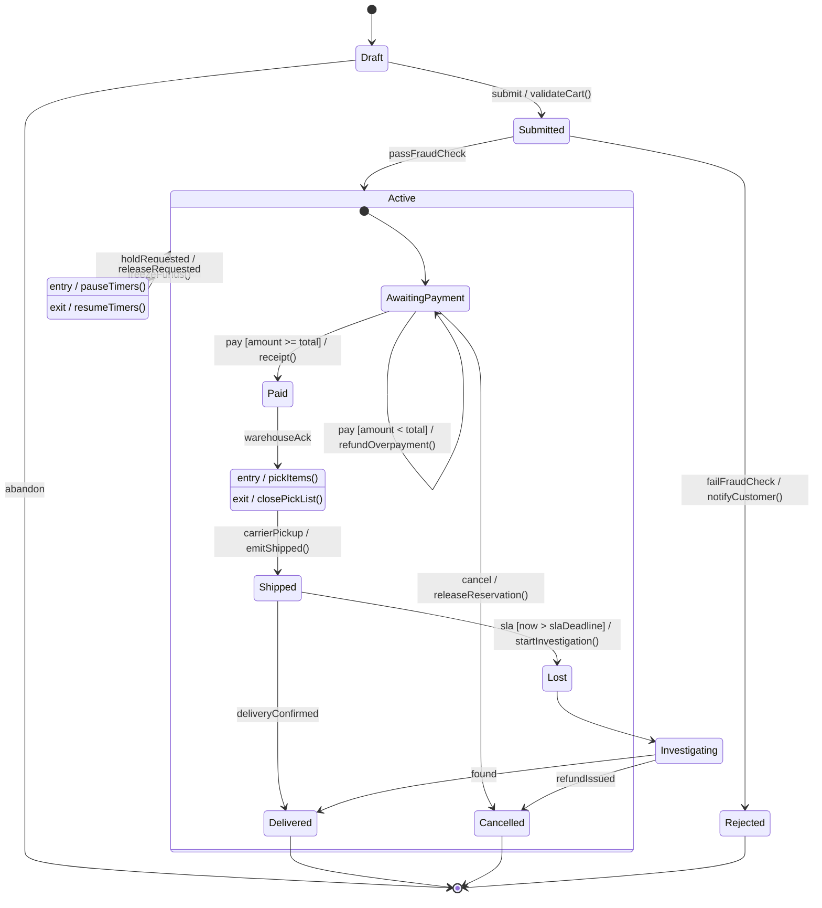

# State Machine Diagram

**Date:** 2026-05-02 | **Updated:** 2026-05-02
**Tags:** `low-level-design` `uml` `state-machine` `behavior` `modeling`

## Summary

A UML state machine (state chart) models the lifecycle of a single object: the discrete states it can be in, the events that move it between states, the guards that filter those events, and the actions that fire on entry, exit, or transition. Reach for it whenever your business logic is being shredded by a growing pile of `if (status == ...)` branches.

## Table of Contents

- [The Pieces](#the-pieces)
- [States](#states)
- [Transitions, Events, and Guards](#transitions-events-and-guards)
- [Entry and Exit Actions](#entry-and-exit-actions)
- [Hierarchical (Composite) States](#hierarchical-composite-states)
- [Orthogonal Regions](#orthogonal-regions)
- [State Machine vs If-Statements](#state-machine-vs-if-statements)
- [When to Draw a State Machine](#when-to-draw-a-state-machine)
- [Mermaid Example](#mermaid-example)
- [Common Mistakes](#common-mistakes)
- [Related](#related)

## The Pieces

A state machine diagram has six working parts:

1. **States** — rounded rectangles labeled with a noun or adjective (`Pending`, `Shipped`, `Cancelled`).
2. **Transitions** — arrows between states, labeled `event [guard] / action`.
3. **Initial pseudostate** — filled black circle, points to the starting state.
4. **Final state** — circle with an inner filled circle. Optional; a state machine can be cyclic with no final state.
5. **Composite states** — states that contain nested sub-states.
6. **Pseudostates** — choice (diamond), junction, history (`H` or `H*`), entry / exit points.

## States

A state is a stable condition in which the object responds to events in a consistent way. A good test: if you cannot describe what the object is **doing or waiting for** in this state, it is probably not a real state — it is incidental data.

States are exclusive within their region. At any instant the machine is in exactly one state per region.

Naming:

- Prefer past participles or adjectives: `Submitted`, `Locked`, `In Transit`, `Delivered`.
- Avoid action names like `Validating` unless validation is genuinely a long-lived state with its own events.

## Transitions, Events, and Guards

A transition is labeled with the standard UML triplet:

```
event [guard] / action
```

- **Event** — what triggers the transition (a method call, a domain event, a timer).
- **Guard** — a boolean condition in `[ ]` that must hold for the transition to fire.
- **Action** — a side effect to perform during the transition, after `/`.

All three parts are optional, but at least the event is usually present. Multiple transitions can share the same event with different guards; UML requires guards to be mutually exclusive (otherwise the model is non-deterministic).

```
Pending  --(pay [amount >= total] / receipt())-->  Paid
Pending  --(pay [amount <  total] / refundOverpayment())-->  Pending
```

Internal transitions (no state change) are written inside the state box:

```
Pending : tick / decrementTimeout()
```

## Entry and Exit Actions

A state can declare actions that fire whenever it is entered or exited, regardless of which transition caused it.

```
Locked
  entry / startTimer()
  exit  / stopTimer()
  do    / pollDevice()
```

- `entry` — runs once when the state is entered.
- `exit` — runs once when the state is left.
- `do` — runs continuously while in the state (interruptible by transitions).

Why this matters: if the same setup happens on every transition into a state, hoisting it to `entry` keeps the diagram clean and the implementation honest. Same with cleanup on `exit`. This is the diagram-level analogue of resource acquisition in constructors and release in destructors.

## Hierarchical (Composite) States

A composite state contains sub-states. It is one of the most powerful features of UML state charts and the main reason to use them over plain finite-state machines.

```
Active
  Connected
  Disconnected
```

While in `Active.Connected`, the object is in both `Active` and `Connected`. A transition leaving `Active` (say, `shutdown -> Off`) fires from any sub-state of `Active` — so you do not have to draw "shutdown" arrows from every leaf. This eliminates the combinatorial explosion of "all transitions to all error states".

Composite states can have their own initial pseudostate, picking which sub-state to enter when transitioning into the composite without specifying the leaf.

History pseudostates remember the last sub-state:

- `H` (shallow history) — re-enter the most recent direct sub-state.
- `H*` (deep history) — re-enter the most recent leaf state, recursively.

Useful for "pause and resume" lifecycles.

## Orthogonal Regions

A composite state can have multiple **regions** running concurrently, separated by a dashed line. The object is in one state per region simultaneously.

```
DeviceOn
  | Audio: Mute / Unmuted     (region 1)
  | Power: Battery / Plugged  (region 2)
```

Useful when an object has truly independent dimensions of state. If two regions interact heavily (most events affect both), they probably should not be orthogonal.

## State Machine vs If-Statements

The honest reason to draw a state machine is to **stop writing `if (status == X) { ... }`** scattered across a service. Symptoms that you should:

- A status field gates every method (`if (order.isCancelled()) throw ...; if (order.isShipped()) throw ...;` repeated in every operation).
- New requirements keep adding new status values, and the if-cascades grow with them.
- Bugs cluster around "could this transition even happen?" — which is exactly what a state machine forbids by construction.
- Race conditions on status changes — a state machine forces transitions through a single dispatch point.
- Auditors or product asks "what is the lifecycle of an Order?" and no one can answer in under five minutes.

What a state machine gives you that a switch statement does not:

- A complete enumeration of states. Any state not on the diagram does not exist.
- A complete enumeration of legal transitions. Any transition not drawn is forbidden — and the implementation can enforce it with one rejection point.
- Entry / exit actions deduplicated.
- A picture you can hand to product, support, or QA.

The implementation usually maps to a state pattern (Gang of Four), a transition table, or a dedicated state-machine library. The diagram is the spec; the code mirrors it.

## When to Draw a State Machine

Worth drawing when:

- The object has a meaningful **lifecycle**: order, payment, subscription, ticket, document, connection, device, session.
- Some operations are only legal in some states.
- Different transitions out of the same state require different conditions or side effects.
- The state space is being discovered as you go and you need to nail it down.
- You are building protocol-level code (TCP, OAuth flow, retry/backoff).

Skip when:

- The object has a status field with two values and three transitions. A boolean and a method are clearer than a diagram.
- The "state" is really just data that the object always carries (current balance, list of items). Data is not state.

## Mermaid Example

Order lifecycle with composite states for the active life of the order, history return on resume, entry / exit actions, and a guard.



What this diagram argues:

- Validation is an entry-side concern of `Submitted`; once you reach it, the cart is known good.
- The `Active` composite groups the meat of the order's life. A `holdRequested` event from any sub-state moves to `Suspended`; a `releaseRequested` returns to `Active` (in a richer model, with deep history `[*]` becomes `H*` to resume the exact prior leaf).
- Guards make over-payment vs exact payment two different transitions out of `AwaitingPayment`.
- `Fulfilling` has entry / exit actions so warehouse picking is set up and torn down without polluting transition arrows.
- The `Lost` branch is its own subtree — a real-world recovery loop, not an afterthought.
- Multiple terminal states (`Delivered`, `Cancelled`, `Rejected`) reflect honest endings, not forced single-exit.

## Common Mistakes

- **Confusing data with state.** "Quantity = 5" is data. "Reserved" is state. Putting numeric fields in state names produces an exploding diagram.
- **Allowing every transition.** If every state can go to every other state, you do not have a state machine; you have an unconstrained `enum`.
- **Hidden transitions.** Code path that mutates `status` without going through the dispatch point bypasses the entire model. Centralize transitions.
- **No entry / exit, only transition actions.** When the same setup appears on five transitions into the same state, hoist it.
- **Composite states with no real benefit.** Wrapping two states in a composite "for grouping" without shared transitions or shared actions is decoration, not structure.
- **Drawing the diagram once, never updating.** A stale state diagram is worse than none — readers will trust transitions that no longer exist.
- **Mixing in business workflow that belongs in an activity diagram.** The state machine is the lifecycle of one object; the orchestration across many objects is a different concern.

## Related

- [Class Diagram](class-diagram.md)
- [Use Case Diagram](use-case-diagram.md)
- [Sequence Diagram](sequence-diagram.md)
- [Activity Diagram](activity-diagram.md)
- [Association](../class-relationships/association.md)
- [Composition](../class-relationships/composition.md)
- [Dependency](../class-relationships/dependency.md)

## References

- OMG, _Unified Modeling Language Specification_, version 2.5.1.
- David Harel, _Statecharts: A Visual Formalism for Complex Systems_ (1987) — the basis for UML state charts.
- Martin Fowler, _UML Distilled_, 3rd ed.
