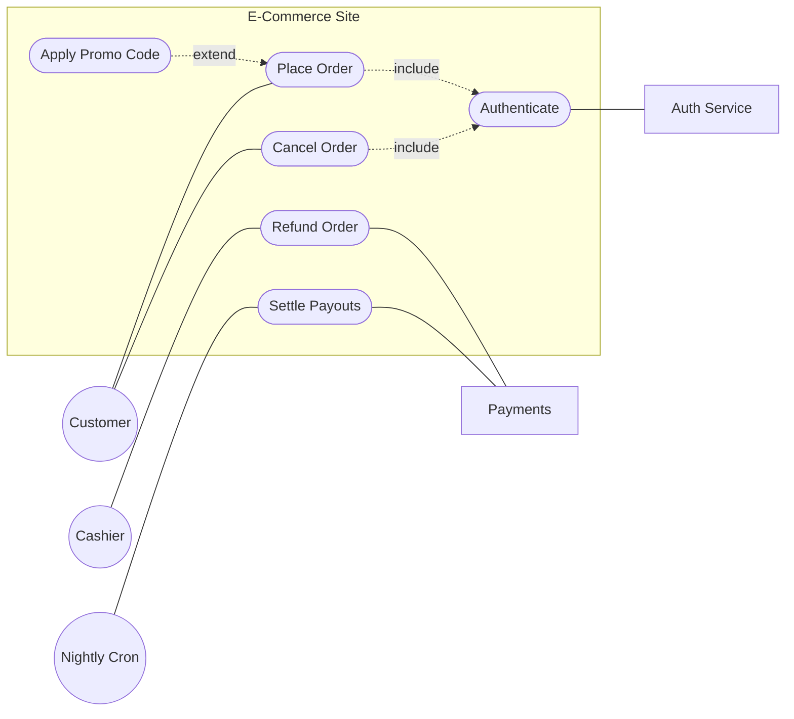

# Use Case Diagram

**Date:** 2026-05-02 | **Updated:** 2026-05-02
**Tags:** `low-level-design` `uml` `use-case` `requirements` `modeling`

## Summary

A use case diagram answers a deliberately narrow question: who interacts with this system, and what can they accomplish with it? It draws actors outside a system boundary and the goals (use cases) inside. Useful as a one-page table of contents for the behavior of a system; not useful for describing how that behavior works.

## Table of Contents

- [The Four Things on the Diagram](#the-four-things-on-the-diagram)
- [Actors](#actors)
- [Use Cases](#use-cases)
- [System Boundary](#system-boundary)
- [Include and Extend Relationships](#include-and-extend-relationships)
- [Use Cases vs User Stories](#use-cases-vs-user-stories)
- [When Use Cases Win](#when-use-cases-win)
- [Mermaid / ASCII Example](#mermaid--ascii-example)
- [Common Mistakes](#common-mistakes)
- [Related](#related)

## The Four Things on the Diagram

A use case diagram has only four kinds of element:

1. **Actors** — stick figures, drawn outside the system boundary.
2. **Use cases** — ovals, drawn inside the system boundary.
3. **The system boundary** — a rectangle around the use cases, labeled with the system name.
4. **Relationships** — lines between actors and use cases, plus dashed `<<include>>` and `<<extend>>` arrows between use cases.

That is the entire vocabulary. Resist the urge to overload it.

## Actors

An actor is a role, not a person. "Customer", "Cashier", "Payment Gateway", "Nightly Cron" are all actors. The same human may play multiple roles (a Cashier is also an Employee).

Two flavors:

- **Primary actors** initiate use cases to achieve a goal. Drawn on the left.
- **Secondary actors** are called by the system to fulfill a use case. Drawn on the right.

Non-human actors are perfectly valid: external systems, scheduled jobs, hardware sensors. Anything outside the system boundary that triggers behavior or is called by behavior.

## Use Cases

A use case is a **goal** achievable by an actor through interaction with the system. Phrase it as a verb plus object:

- "Place Order"
- "Reset Password"
- "Settle Daily Payouts"

Anti-patterns:

- "Click Submit" — too low level. That is a step inside a use case, not a use case.
- "Manage Users" — too vague. CRUD-flavored "Manage X" is a smell. Split into specific goals (Add User, Suspend User, Reset Password).
- "Login" — controversial. Pure login is rarely a user goal in itself; it is a precondition. Some teams allow it, others fold it into authenticated use cases via `<<include>>`.

## System Boundary

The rectangle labels what is inside scope. Anything outside the rectangle is an actor; anything inside is system behavior. Drawing the boundary is half the value of the diagram — it forces an explicit decision about scope.

When the boundary changes (new microservice extracted, third party integrated), the diagram changes. That is the diagram doing its job.

## Include and Extend Relationships

Two relationships exist between use cases. They look similar, mean different things, and are routinely misused.

### `<<include>>`

Use case A always uses use case B. B is shared behavior factored out of multiple parents.

```
Place Order  - - <<include>> - ->  Authenticate
Cancel Order - - <<include>> - ->  Authenticate
```

Direction: from the parent use case **to** the included use case. "Place Order includes Authenticate."

### `<<extend>>`

Use case A is sometimes augmented by optional use case B at a defined extension point.

```
Place Order  <- - <<extend>> - -  Apply Promo Code
```

Direction: from the optional use case **to** the base. "Apply Promo Code extends Place Order." The base does not know about the extension; the extension hooks into the base at a named extension point.

Practical advice: most teams overcomplicate this. If you find yourself debating include vs extend for ten minutes, just keep the parent use case as a single oval and describe the variation in its written specification. The diagram is not the requirements document.

### Generalization

Actors can inherit from other actors. A `Manager` actor specializes `Employee`. Drawn as a hollow triangle, same as class inheritance. Use case generalization also exists but is rarely worth drawing.

## Use Cases vs User Stories

User stories ("As a `<role>`, I want `<goal>`, so that `<benefit>`") and use cases overlap heavily. Differences that matter:

| Aspect | User Story | Use Case |
|--------|------------|----------|
| Granularity | Sized to fit a sprint | Whole user goal, possibly multiple sprints |
| Focus | Increment of value | Complete interaction with system |
| Form | Index card or ticket | Diagram + structured text |
| Coverage | Easy to miss flows | Forces enumeration of actors and goals |
| Detail | Acceptance criteria attached separately | Main flow + alternate flows + exceptions |

User stories shine for incremental delivery. Use cases shine when you need to be sure you have **enumerated** the system's behavior. The two coexist: a use case typically decomposes into several user stories.

## When Use Cases Win

Reach for a use case diagram when:

- You are scoping a new system and need to be sure all actors and goals are on the table.
- Stakeholders disagree about what is in scope. The boundary rectangle ends those arguments fast.
- You are integrating with several external systems and need to show which ones drive the system vs which ones it calls.
- Auditors or regulators want a one-page picture of "what can this system do, and on whose behalf".
- You are doing whiteboard system design and the interviewer wants to see scope before architecture.

Skip use case diagrams when:

- The team already runs on user stories and nobody is confused about scope.
- You only have one actor and three goals — a bullet list is fine.
- Someone is asking you to draw a use case diagram for every screen in a CRUD app. That is ceremony, not modeling.

## Mermaid / ASCII Example

Mermaid does not have first-class use case diagram syntax, but a `flowchart` can be styled to read like one. ASCII works fine too.

### ASCII

```
                           +-----------------------------------------+
                           |             E-Commerce Site             |
                           |                                         |
   Customer  -------------(|->  Place Order  )                       |
       \                   |        :                                |
        \                  |        : <<include>>                    |
         \                 |        v                                |
          \---------------(|->  Authenticate )<-------- Auth Service |
                           |        ^                                |
                           |        : <<include>>                    |
                           |        :                                |
   Customer  -------------(|->  Cancel Order )                       |
                           |        |                                |
                           |        | <<extend>>                     |
                           |        v                                |
                           |   ( Apply Promo Code )                  |
                           |                                         |
   Cashier   -------------(|->  Refund Order )---------> Payments    |
                           |                                         |
   Nightly   -------------(|->  Settle Payouts )--------> Payments   |
   Cron                    |                                         |
                           +-----------------------------------------+
```

### Mermaid (flowchart approximation)



What the diagram argues:

- Three primary actors: Customer, Cashier, Nightly Cron.
- Two secondary actors: Auth Service, Payments — the system calls them, not the other way around.
- Authentication is shared by Place and Cancel via `<<include>>`.
- Promo code is optional behavior that hangs off Place via `<<extend>>`.
- Refunds and settlement live inside the boundary even though Payments is external.

## Common Mistakes

- **Modeling UI clicks.** "Click Login Button" is not a use case.
- **Drawing data flow.** Use cases capture goals, not arrows of data movement.
- **Overusing include / extend.** A diagram with eight `<<include>>` arrows is harder to read than a list of use cases with shared preconditions written underneath.
- **Treating it as a requirements doc.** The diagram is an index. Each use case still needs a textual specification (main flow, alternates, exceptions).
- **Ignoring secondary actors.** External systems and cron jobs are first-class actors. Leaving them out hides integration scope.
- **Drawing 40 use cases on one page.** Split by subsystem or by actor.

## Related

- [Class Diagram](class-diagram.md)
- [Sequence Diagram](sequence-diagram.md)
- [Activity Diagram](activity-diagram.md)
- [State Machine Diagram](state-machine-diagram.md)
- [Association](../class-relationships/association.md)
- [Dependency](../class-relationships/dependency.md)

## References

- OMG, _Unified Modeling Language Specification_, version 2.5.1.
- Alistair Cockburn, _Writing Effective Use Cases_.
- Martin Fowler, _UML Distilled_, 3rd ed.
