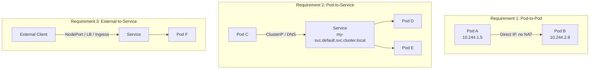
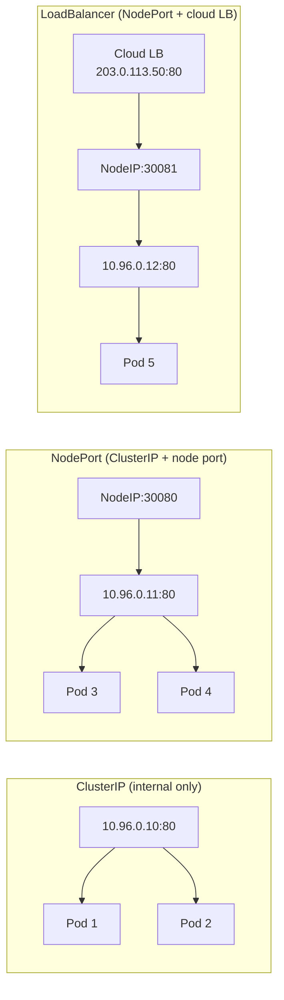
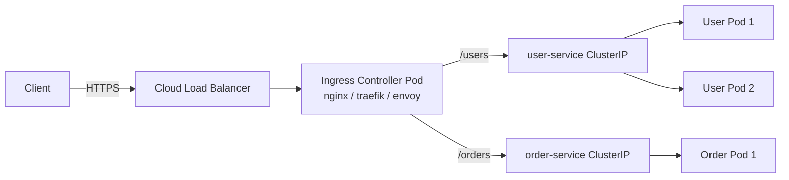

| Field       | Value                                                        |
|-------------|--------------------------------------------------------------|
| **Topic**   | Container Networking — Docker, Kubernetes CNI, Service Discovery |
| **Audience**| Backend developer (TypeScript/Node.js + Java/Spring Boot)    |
| **Level**   | Intermediate to Advanced                                     |
| **Prerequisites** | Basic TCP/IP, Linux fundamentals, Docker basics        |

---

## Table of Contents

1. [Linux Network Namespaces](#1-linux-network-namespaces)
2. [Docker Networking](#2-docker-networking)
3. [Docker Compose Networking](#3-docker-compose-networking)
4. [Kubernetes Networking Model](#4-kubernetes-networking-model)
5. [CNI (Container Network Interface)](#5-cni-container-network-interface)
6. [Kubernetes Services](#6-kubernetes-services)
7. [Kubernetes Ingress and Gateway API](#7-kubernetes-ingress-and-gateway-api)
8. [DNS in Kubernetes](#8-dns-in-kubernetes)
9. [Network Policies](#9-network-policies)
10. [Debugging Container Networking](#10-debugging-container-networking)

---

## Summary

Containers fundamentally change how applications communicate. Instead of processes sharing a single host network stack, each container (and each Kubernetes pod) gets its own isolated network namespace with a distinct IP address, routing table, and set of interfaces. This document traces the path from Linux network namespaces through Docker's network drivers, into Kubernetes' flat networking model, CNI plugins, service discovery, ingress routing, DNS, network policies, and practical debugging techniques. The goal is to give a backend developer a working mental model of every layer between "my Spring Boot pod" and "the outside world."

---

## 1. Linux Network Namespaces

Network namespaces are the kernel primitive that makes container networking possible. Every container runtime — Docker, containerd, CRI-O — uses them under the hood.

### What a Network Namespace Isolates

Each namespace gets its own independent copy of:

- **Network interfaces** (eth0, lo, etc.)
- **Routing table** (`ip route`)
- **iptables/nftables rules**
- **Socket bindings** (port 8080 in ns-A and port 8080 in ns-B are independent)
- **ARP table**

The default (init) namespace is what the host uses. Every new container gets a new namespace.

### Creating and Connecting Namespaces

```bash
# Create two namespaces
ip netns add ns-blue
ip netns add ns-green

# Create a veth pair — a virtual ethernet cable with two ends
ip link add veth-blue type veth peer name veth-green

# Move each end into its namespace
ip link set veth-blue netns ns-blue
ip link set veth-green netns ns-green

# Assign IPs and bring them up
ip netns exec ns-blue ip addr add 10.0.0.1/24 dev veth-blue
ip netns exec ns-blue ip link set veth-blue up
ip netns exec ns-blue ip link set lo up

ip netns exec ns-green ip addr add 10.0.0.2/24 dev veth-green
ip netns exec ns-green ip link set veth-green up
ip netns exec ns-green ip link set lo up

# Verify connectivity
ip netns exec ns-blue ping -c 2 10.0.0.2
```

### How Containers Use This

Docker (and containerd) does exactly the above, but automated:

1. Creates a network namespace for the container.
2. Creates a veth pair.
3. Places one end inside the container namespace (becomes `eth0` inside the container).
4. Attaches the other end to a bridge on the host (e.g., `docker0`).
5. Assigns an IP from the bridge's subnet via IPAM.

---

## 2. Docker Networking

Docker provides five network drivers. Choosing the right one depends on your isolation, performance, and multi-host requirements.

### Network Drivers

| Driver      | Isolation | Performance | Multi-Host | Use Case |
|-------------|-----------|-------------|------------|----------|
| **bridge**  | Container-level | Good (NAT overhead) | No | Default for standalone containers |
| **host**    | None (shares host stack) | Native | No | Maximum throughput, no port conflicts |
| **none**    | Complete (no networking) | N/A | No | Security-sensitive batch jobs |
| **overlay** | Container-level | Moderate (VXLAN encap) | Yes | Docker Swarm multi-host |
| **macvlan** | Container-level | Near-native | Yes (L2) | Containers need real LAN IPs |

### Bridge Network Internals (docker0)

```
┌────────────────────────────────────────────┐
│                   Host                      │
│                                             │
│   ┌──────────┐   ┌──────────┐              │
│   │ Container │   │ Container │              │
│   │   eth0    │   │   eth0    │              │
│   │ 172.17.0.2│   │ 172.17.0.3│              │
│   └────┬─────┘   └────┬─────┘              │
│        │veth          │veth                  │
│   ┌────┴──────────────┴─────┐               │
│   │        docker0           │               │
│   │      172.17.0.1          │               │
│   └────────────┬─────────────┘               │
│                │ iptables NAT                │
│   ┌────────────┴──────────┐                  │
│   │   eth0 (host NIC)     │                  │
│   │   192.168.1.100        │                  │
│   └───────────────────────┘                  │
└────────────────────────────────────────────┘
```

When a container sends traffic to the internet:
1. Packet leaves container `eth0` -> crosses veth pair -> arrives at `docker0` bridge.
2. Host iptables MASQUERADE rule rewrites the source IP to the host IP.
3. Reply packets are de-NATed back.

### Port Mapping

```bash
# Map host port 8080 -> container port 3000
docker run -p 8080:3000 my-node-app

# Map to a specific interface
docker run -p 127.0.0.1:8080:3000 my-node-app

# Under the hood, Docker adds an iptables DNAT rule:
# -A DOCKER -p tcp --dport 8080 -j DNAT --to-destination 172.17.0.2:3000
```

### DNS in User-Defined Networks

The default bridge network does NOT provide automatic DNS. User-defined networks do:

```bash
# Create a user-defined network
docker network create my-app-net

# Run services on it
docker run -d --name api-server --network my-app-net my-spring-app
docker run -d --name cache --network my-app-net redis:7

# Inside api-server, "cache" resolves to the Redis container's IP
# Docker runs an embedded DNS server at 127.0.0.11
```

This is why you should almost always use user-defined networks instead of the default bridge.

---

## 3. Docker Compose Networking

### Default Behavior

Docker Compose automatically creates a network named `<project>_default`. All services in the `docker-compose.yml` join this network and can reach each other by service name.

```yaml
# docker-compose.yml
services:
  api:
    build: ./api
    ports:
      - "8080:8080"    # Published to host
    environment:
      - DB_HOST=postgres  # Service name as hostname
      - REDIS_HOST=cache

  postgres:
    image: postgres:16
    expose:
      - "5432"          # Exposed to other services, NOT to host

  cache:
    image: redis:7
    expose:
      - "6379"
```

### Key Distinctions

| Directive    | Visible to Host | Visible to Other Services |
|-------------|-----------------|---------------------------|
| `ports: "8080:8080"` | Yes | Yes |
| `expose: "5432"` | No | Yes |
| Neither | No | Yes (all ports are accessible between services on the same network) |

`expose` is mostly documentary — on a shared Docker network, all ports between containers are reachable regardless. The real gate is `ports`, which creates the host-side port mapping.

### Custom Networks

```yaml
services:
  api:
    networks:
      - frontend
      - backend

  postgres:
    networks:
      - backend      # Not reachable from frontend network

  nginx:
    networks:
      - frontend

networks:
  frontend:
  backend:
```

This isolates the database from the reverse proxy while the API service bridges both networks.

---

## 4. Kubernetes Networking Model

Kubernetes imposes three fundamental networking requirements. Every CNI plugin must satisfy all three.

### The Three Requirements



1. **Pod-to-Pod**: Every pod can communicate with every other pod without NAT. Each pod gets a real, routable IP address.
2. **Pod-to-Service**: Pods reach services via stable virtual IPs (ClusterIP) or DNS names. kube-proxy (or a CNI replacement) handles the translation.
3. **External-to-Service**: Traffic from outside the cluster reaches services through NodePort, LoadBalancer, or Ingress resources.

### The Flat Network

Unlike Docker's default NAT model, Kubernetes requires a flat network:

- Pod A on Node 1 (IP `10.244.1.5`) can directly reach Pod B on Node 2 (IP `10.244.2.8`).
- No address translation between pods.
- The source IP that Pod B sees is Pod A's real IP.

This simplifies application logic — your Spring Boot app or Node.js service sees real client pod IPs, not translated gateway addresses.

### How a Pod Gets Its Network

1. kubelet calls the CRI (containerd) to create a pod sandbox.
2. containerd creates a network namespace for the pod.
3. kubelet invokes the CNI plugin via the CNI binary.
4. The CNI plugin:
   - Creates a veth pair.
   - Attaches one end to the pod namespace.
   - Attaches the other end to the host (bridge, or programs routes directly).
   - Assigns an IP from the pod CIDR.
   - Programs routes so other nodes can reach this pod.

All containers within the same pod share the same network namespace — they communicate over `localhost`.

---

## 5. CNI (Container Network Interface)

CNI is a specification and a set of libraries for configuring network interfaces in Linux containers. It is not Kubernetes-specific, but Kubernetes is its primary consumer.

### Plugin Lifecycle

The CNI spec defines three operations:

| Operation | When Called | What It Does |
|-----------|-----------|--------------|
| **ADD**   | Pod is created | Configure networking for a new container namespace |
| **DEL**   | Pod is deleted | Clean up networking for a container namespace |
| **CHECK** | Health check   | Verify networking is still correctly configured |

The kubelet calls these via a CNI binary located in `/opt/cni/bin/`. Configuration lives in `/etc/cni/net.d/`.

### CNI Plugin Comparison

| Plugin | Networking Mode | Overlay | Network Policy | eBPF Dataplane | Best For |
|--------|----------------|---------|----------------|----------------|----------|
| **Calico** | BGP native routing or VXLAN/IPIP overlay | Optional | Yes (rich) | Yes (optional) | On-prem, hybrid, strong policy needs |
| **Cilium** | Native routing or VXLAN/Geneve | Optional | Yes (L3-L7, DNS-aware) | Yes (primary) | Advanced observability, L7 policy, eBPF-first |
| **Flannel** | VXLAN overlay | Yes (always) | No (needs Calico addon) | No | Simple clusters, learning environments |
| **Weave Net** | Mesh overlay (encrypted option) | Yes | Yes (basic) | No | Small clusters, encrypted pod-to-pod |
| **AWS VPC CNI** | Native VPC IPs on pods | No (native) | Yes (via Calico addon) | No | EKS — pods get real VPC IPs, no overlay overhead |

### Overlay vs. Native Routing

**Overlay** (VXLAN, Geneve, IPIP): Encapsulates pod traffic in an outer UDP packet. Works anywhere (cloud, on-prem, mixed) but adds ~50 bytes per packet and requires encap/decap CPU cost.

**Native routing** (BGP, VPC integration): Programs the underlying network to route pod CIDRs directly. Lower latency, no encapsulation overhead, but requires network infrastructure that supports it (BGP peers, or cloud VPC route tables).

```
Overlay:
[Pod Packet] → [VXLAN Header | Outer UDP | Outer IP | Pod Packet] → Node 2 → [Pod Packet]

Native routing:
[Pod Packet] → Router knows 10.244.2.0/24 → Node 2 → [Pod Packet]
```

---

## 6. Kubernetes Services

Services provide stable endpoints for a set of pods, decoupling service consumers from the dynamic set of pod IPs.

### Service Types



| Type | Accessible From | Mechanism | When to Use |
|------|----------------|-----------|-------------|
| **ClusterIP** | Inside cluster only | Virtual IP + iptables/IPVS rules | Service-to-service communication |
| **NodePort** | Any node IP on port 30000-32767 | Extends ClusterIP with port on every node | Dev/test, on-prem without LB |
| **LoadBalancer** | External via cloud LB | Extends NodePort with cloud provider integration | Production external access |
| **ExternalName** | Inside cluster (DNS alias) | CNAME to external DNS | Mapping to external services |

### ClusterIP Internals

A ClusterIP is a virtual IP — no interface or network device holds it. Here is what happens when a pod reaches `my-service.default.svc.cluster.local`:

1. CoreDNS resolves the name to the ClusterIP (e.g., `10.96.0.10`).
2. The pod sends a packet to `10.96.0.10:80`.
3. **kube-proxy** has programmed iptables (or IPVS) rules on every node.
4. The rules DNAT the packet to one of the backend pod IPs (e.g., `10.244.1.5:8080`).
5. The response follows the reverse path.

### kube-proxy Modes

| Mode | Mechanism | Scalability | Latency |
|------|-----------|-------------|---------|
| **iptables** (default) | Chain of DNAT rules, random selection | Degrades at 5000+ services | Rule evaluation overhead |
| **IPVS** | Kernel-level L4 load balancer | Handles 10k+ services | O(1) lookup via hash tables |
| **eBPF replacement** (Cilium) | Bypasses iptables entirely | Excellent | Lowest |

### Headless Services

When you set `clusterIP: None`, Kubernetes does not allocate a virtual IP. Instead, DNS returns the pod IPs directly:

```yaml
apiVersion: v1
kind: Service
metadata:
  name: my-db
spec:
  clusterIP: None
  selector:
    app: postgres
  ports:
    - port: 5432
```

```bash
# DNS query returns individual pod IPs
nslookup my-db.default.svc.cluster.local
# 10.244.1.5
# 10.244.2.8
```

Use headless services for stateful workloads (databases, message brokers) where the client needs to connect to specific pods.

### Endpoint Slices

EndpointSlices replaced the older Endpoints resource for tracking which pods back a service. They scale better because each slice holds up to 100 endpoints by default, reducing the size of API objects that kube-proxy watches.

---

## 7. Kubernetes Ingress and Gateway API

### Ingress Resource

Ingress provides HTTP/HTTPS routing from outside the cluster to services inside:

```yaml
apiVersion: networking.k8s.io/v1
kind: Ingress
metadata:
  name: app-ingress
  annotations:
    nginx.ingress.kubernetes.io/rewrite-target: /
spec:
  ingressClassName: nginx
  tls:
    - hosts:
        - api.example.com
      secretName: api-tls-cert
  rules:
    - host: api.example.com
      http:
        paths:
          - path: /users
            pathType: Prefix
            backend:
              service:
                name: user-service
                port:
                  number: 8080
          - path: /orders
            pathType: Prefix
            backend:
              service:
                name: order-service
                port:
                  number: 8080
```



### Popular Ingress Controllers

| Controller | Based On | Strengths |
|-----------|----------|-----------|
| **ingress-nginx** | NGINX | Mature, widely deployed, extensive annotations |
| **Traefik** | Custom Go proxy | Auto-discovery, middleware chains, dashboard |
| **Envoy / Istio** | Envoy Proxy | L7 features, gRPC, service mesh integration |
| **AWS ALB Controller** | AWS ALB | Native AWS integration, WAF, Cognito auth |

### Gateway API (Ingress Successor)

Gateway API is the next-generation routing API, designed to replace Ingress with a more expressive, role-oriented model:

| Concern | Ingress | Gateway API |
|---------|---------|-------------|
| Role separation | Single resource | GatewayClass (infra), Gateway (cluster ops), HTTPRoute (dev) |
| Protocol support | HTTP/HTTPS only | HTTP, gRPC, TCP, TLS, UDP |
| Header routing | Annotation-dependent | First-class |
| Traffic splitting | Not native | Built-in weights |
| Cross-namespace | Not supported | Supported via ReferenceGrant |

```yaml
# Gateway (managed by cluster operator)
apiVersion: gateway.networking.k8s.io/v1
kind: Gateway
metadata:
  name: main-gateway
spec:
  gatewayClassName: cilium
  listeners:
    - name: https
      protocol: HTTPS
      port: 443
      tls:
        certificateRefs:
          - name: wildcard-cert
---
# HTTPRoute (managed by app developer)
apiVersion: gateway.networking.k8s.io/v1
kind: HTTPRoute
metadata:
  name: user-routes
spec:
  parentRefs:
    - name: main-gateway
  hostnames:
    - "api.example.com"
  rules:
    - matches:
        - path:
            type: PathPrefix
            value: /users
      backendRefs:
        - name: user-service
          port: 8080
          weight: 90
        - name: user-service-canary
          port: 8080
          weight: 10
```

---

## 8. DNS in Kubernetes

### CoreDNS

CoreDNS is the default cluster DNS since Kubernetes 1.13. It runs as a Deployment in `kube-system` and serves DNS for service discovery.

### Service DNS Format

```
<service>.<namespace>.svc.cluster.local
```

Examples:
- `user-service.default.svc.cluster.local` -- ClusterIP service in the `default` namespace.
- `my-db-0.my-db.default.svc.cluster.local` -- Specific pod in a headless StatefulSet service.

Within the same namespace, you can use the short name: `user-service`.

### Pod DNS

Pods get DNS entries too (when using a headless service or explicit `hostname`/`subdomain` fields):

```
<pod-ip-dashed>.<namespace>.pod.cluster.local
# Example: 10-244-1-5.default.pod.cluster.local
```

### The ndots:5 Problem

By default, Kubernetes sets `ndots:5` in `/etc/resolv.conf` inside every pod:

```
nameserver 10.96.0.10
search default.svc.cluster.local svc.cluster.local cluster.local
options ndots:5
```

This means any DNS name with fewer than 5 dots is treated as a relative name and gets the search domains appended first. When your Spring Boot app resolves `api.stripe.com` (2 dots, less than 5):

1. `api.stripe.com.default.svc.cluster.local` -- NXDOMAIN
2. `api.stripe.com.svc.cluster.local` -- NXDOMAIN
3. `api.stripe.com.cluster.local` -- NXDOMAIN
4. `api.stripe.com.` -- SUCCESS

That is 4 DNS queries instead of 1 for every external domain lookup. For high-throughput services, this causes measurable latency and load on CoreDNS.

### Mitigations

```yaml
# Option 1: Append trailing dot in application config
# (Spring Boot application.yml)
spring:
  datasource:
    url: jdbc:postgresql://my-db.default.svc.cluster.local.:5432/mydb

# Option 2: Set dnsConfig on the pod
spec:
  dnsConfig:
    options:
      - name: ndots
        value: "2"    # External names with 2+ dots resolve directly

# Option 3: Use NodeLocal DNSCache (cluster-level optimization)
# Runs a DNS cache as a DaemonSet on every node, reducing CoreDNS load
```

### DNS Policies

| Policy | Behavior |
|--------|----------|
| **ClusterFirst** (default) | Use CoreDNS for cluster names, fall back to node DNS |
| **Default** | Inherit DNS from the node (skips CoreDNS) |
| **ClusterFirstWithHostNet** | Like ClusterFirst, but for pods using `hostNetwork: true` |
| **None** | Fully manual — requires `dnsConfig` |

---

## 9. Network Policies

By default, Kubernetes allows all traffic between all pods. Network policies let you restrict this.

### Default Deny Baseline

Always start with a deny-all policy, then allow what is needed:

```yaml
# Deny all ingress to pods in the namespace
apiVersion: networking.k8s.io/v1
kind: NetworkPolicy
metadata:
  name: deny-all-ingress
  namespace: production
spec:
  podSelector: {}     # Applies to ALL pods in namespace
  policyTypes:
    - Ingress         # Block all incoming traffic
---
# Deny all egress from pods in the namespace
apiVersion: networking.k8s.io/v1
kind: NetworkPolicy
metadata:
  name: deny-all-egress
  namespace: production
spec:
  podSelector: {}
  policyTypes:
    - Egress
```

### Allow Specific Traffic

```yaml
# Allow API pods to receive traffic from frontend pods
# and connect to postgres pods
apiVersion: networking.k8s.io/v1
kind: NetworkPolicy
metadata:
  name: api-policy
  namespace: production
spec:
  podSelector:
    matchLabels:
      app: api-server
  policyTypes:
    - Ingress
    - Egress
  ingress:
    - from:
        - podSelector:
            matchLabels:
              app: frontend
        - namespaceSelector:
            matchLabels:
              name: monitoring   # Allow Prometheus scraping
      ports:
        - protocol: TCP
          port: 8080
  egress:
    - to:
        - podSelector:
            matchLabels:
              app: postgres
      ports:
        - protocol: TCP
          port: 5432
    - to:                        # Allow DNS resolution
        - namespaceSelector: {}
          podSelector:
            matchLabels:
              k8s-app: kube-dns
      ports:
        - protocol: UDP
          port: 53
        - protocol: TCP
          port: 53
```

**Important**: If you add an egress deny-all, you must explicitly allow DNS egress to `kube-dns` pods, or all DNS resolution breaks.

### Calico vs. Cilium Network Policies

| Capability | Kubernetes NetworkPolicy | Calico | Cilium |
|-----------|--------------------------|--------|--------|
| L3/L4 rules | Yes | Yes | Yes |
| Namespace selectors | Yes | Yes | Yes |
| DNS/FQDN-based rules | No | Yes (GlobalNetworkPolicy) | Yes (CiliumNetworkPolicy) |
| L7 rules (HTTP path/method) | No | No | Yes |
| Global (cluster-wide) policies | No | Yes | Yes |
| Default deny per namespace | Manual YAML | `DefaultDeny` profile | Manual or CiliumClusterwideNetworkPolicy |
| Host-level policies | No | Yes (HostEndpoint) | Yes (host policies) |

---

## 10. Debugging Container Networking

### Systematic Approach

When networking fails, work from the inside out:

1. Can the pod resolve DNS?
2. Can the pod reach the service ClusterIP?
3. Can the pod reach the target pod IP directly?
4. Is a network policy blocking traffic?
5. Is the CNI plugin healthy?

### DNS Debugging

```bash
# Run a debug pod with networking tools
kubectl run netdebug --image=nicolaka/netshoot --rm -it -- bash

# Inside the pod:
nslookup user-service.default.svc.cluster.local
nslookup api.stripe.com

# Check resolv.conf
cat /etc/resolv.conf

# Test with dig (more detail)
dig +search user-service

# Check CoreDNS pods
kubectl -n kube-system get pods -l k8s-app=kube-dns
kubectl -n kube-system logs -l k8s-app=kube-dns
```

### Connectivity Testing

```bash
# From inside a pod, test service reachability
kubectl exec -it my-pod -- curl -v http://user-service:8080/health

# Test direct pod IP
kubectl exec -it my-pod -- curl -v http://10.244.1.5:8080/health

# Test from specific container in multi-container pod
kubectl exec -it my-pod -c sidecar -- wget -qO- http://localhost:8080/health
```

### Ephemeral Debug Containers

When your application image has no shell or networking tools:

```bash
# Attach a debug container to a running pod
kubectl debug -it my-pod --image=nicolaka/netshoot --target=my-container

# Now you share the pod's network namespace
# and can run tcpdump, curl, nslookup, etc.
```

### Packet Capture

```bash
# tcpdump inside a pod (via ephemeral container or netshoot)
kubectl debug -it my-pod --image=nicolaka/netshoot -- \
  tcpdump -i eth0 -n port 8080

# On the node (if you have access), capture the veth pair
# First find the veth for the pod:
kubectl exec my-pod -- cat /sys/class/net/eth0/iflink
# Then on the node:
ip link | grep <iflink-number>
tcpdump -i veth<xxx> -n -w capture.pcap
```

### Checking iptables Rules

```bash
# On a node, inspect kube-proxy rules
iptables -t nat -L KUBE-SERVICES -n | grep my-service
iptables -t nat -L KUBE-SVC-<hash> -n    # Service chain
iptables -t nat -L KUBE-SEP-<hash> -n    # Endpoint chains

# For IPVS mode
ipvsadm -Ln | grep <ClusterIP>
```

### Common Issues and Solutions

| Symptom | Likely Cause | Investigation |
|---------|-------------|---------------|
| **CrashLoopBackOff** with "bind: address already in use" | Port conflict — two containers in the same pod binding to the same port | Check pod spec for duplicate `containerPort` values; remember all containers in a pod share `localhost` |
| **DNS resolution failures** | CoreDNS down, or egress network policy blocking UDP 53 | `kubectl -n kube-system get pods -l k8s-app=kube-dns`; check for egress policies |
| **Connection refused to ClusterIP** | No ready endpoints, selector mismatch | `kubectl get endpoints my-service`; verify pod labels match service selector |
| **Intermittent timeouts between pods** | CNI plugin issue, node-to-node connectivity, MTU mismatch | Check CNI pod logs; test node-to-node ping; compare `ip link` MTU values across nodes |
| **Network policy blocking legitimate traffic** | Missing or incorrect label selector, missing DNS egress rule | `kubectl describe netpol <name>`; temporarily delete the policy to confirm it is the cause |
| **External traffic not reaching pods** | Missing Ingress, wrong IngressClass, TLS misconfiguration | `kubectl describe ingress <name>`; check controller logs; verify TLS secret exists |
| **Source IP is always the node IP** | `externalTrafficPolicy: Cluster` (default) causes SNAT | Set `externalTrafficPolicy: Local` on the Service to preserve client IP |

### Useful Debug Commands Summary

```bash
# Pod and service status
kubectl get pods -o wide                     # See pod IPs and nodes
kubectl get svc -o wide                      # See service ClusterIPs
kubectl get endpoints my-service             # See backing pod IPs
kubectl get endpointslices -l kubernetes.io/service-name=my-service

# Network policy inspection
kubectl get netpol -A                        # All network policies
kubectl describe netpol my-policy            # Policy details

# CNI health
kubectl -n kube-system get pods              # Check CNI pods (calico-node, cilium, etc.)
kubectl -n kube-system logs <cni-pod>        # CNI logs

# Node networking
kubectl get nodes -o wide                    # Node IPs
ssh <node> -- ip route                       # Node routing table
ssh <node> -- iptables -t nat -L -n          # NAT rules
```

---

## Related

- [Service Mesh](service-mesh.md) -- Istio, Linkerd, mTLS, observability beyond L4
- [Network Observability](network-observability.md) -- Hubble (Cilium), flow logs, network metrics
- [IP Addressing and Subnetting](../fundamentals/ip-addressing-and-subnetting.md) -- CIDR, subnet math, private ranges
- [Ethernet and Data Link](../fundamentals/ethernet-and-data-link.md) -- Frames, MAC addresses, VLANs
- [Node.js in Kubernetes](../../typescript/production/nodejs-in-kubernetes.md) -- Graceful shutdown, health checks, resource limits

---

## References

1. **Kubernetes Documentation — Cluster Networking**
   https://kubernetes.io/docs/concepts/cluster-administration/networking/
   The authoritative source for the three networking requirements and how they interact.

2. **CNI Specification (containernetworking/cni)**
   https://github.com/containernetworking/cni/blob/main/SPEC.md
   Defines ADD/DEL/CHECK lifecycle, configuration format, and plugin chaining.

3. **Docker Documentation — Networking Overview**
   https://docs.docker.com/engine/network/
   Covers all five drivers, DNS behavior, and driver-specific options.

4. **Cilium Documentation — Networking and eBPF**
   https://docs.cilium.io/en/stable/network/
   Deep dive into eBPF dataplane, native routing, and Cilium's kube-proxy replacement.

5. **Calico Documentation — Networking**
   https://docs.tigera.io/calico/latest/networking/
   BGP peering, IPIP/VXLAN modes, and advanced network policy.

6. **Kubernetes Gateway API**
   https://gateway-api.sigs.k8s.io/
   Official specification, conformance levels, and implementation status for Gateway, HTTPRoute, and related resources.

7. **"Kubernetes Networking Deep Dive" — Ahmet Alp Balkan (Google)**
   https://www.youtube.com/watch?v=0Omvgd7Hg1I
   Visual walkthrough of pod networking, service routing, and kube-proxy internals.

8. **CoreDNS for Kubernetes — Configuration and Optimization**
   https://coredns.io/plugins/kubernetes/
   Plugin configuration, caching, and performance tuning for cluster DNS.
