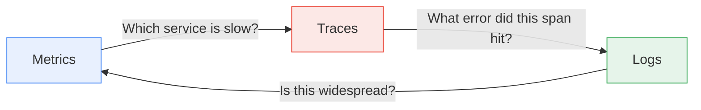
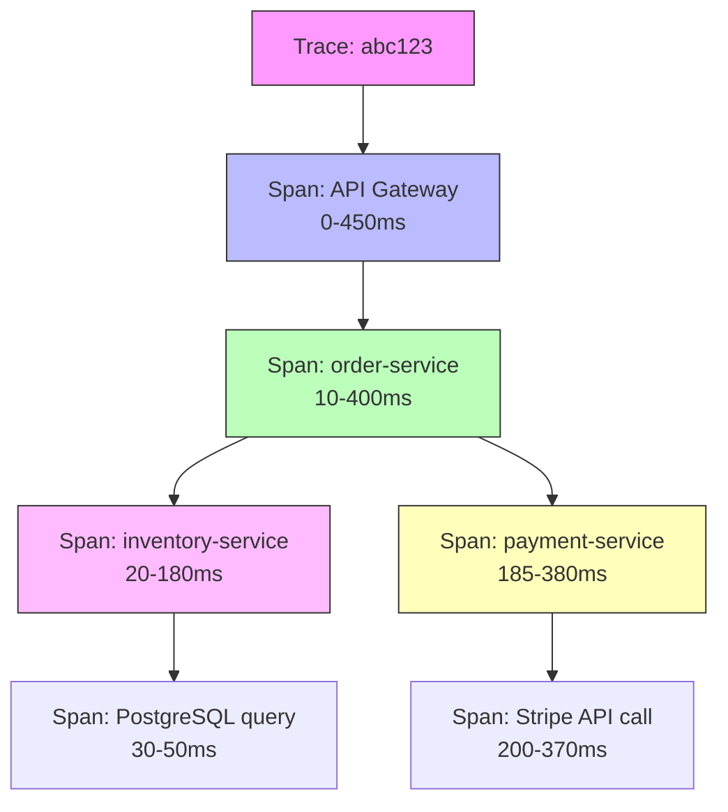
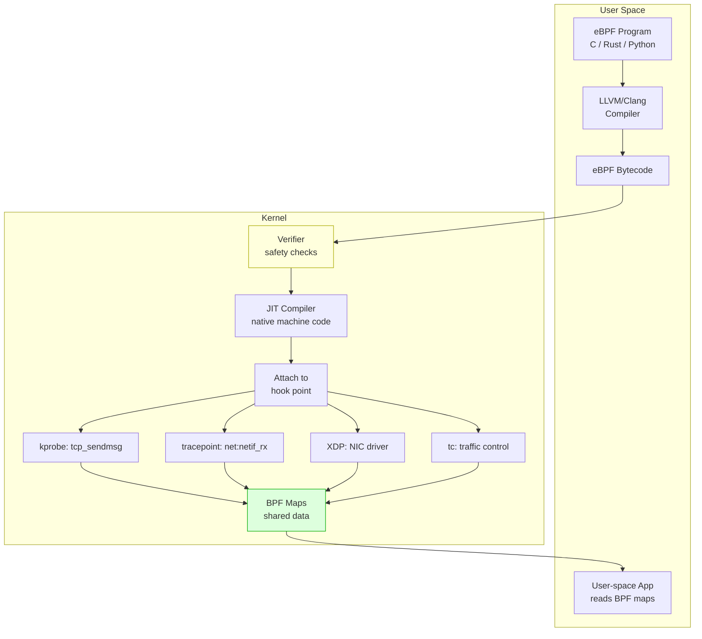

# Network Observability — Tracing, Metrics, and eBPF

**Date:** 2026-04-23 | **Updated:** 2026-04-23
**Tags:** `networking` `observability` `tracing` `metrics` `ebpf`

---

## Table of Contents

- [Summary](#summary)
- [Three Pillars of Observability](#three-pillars-of-observability)
  - [Metrics](#metrics)
  - [Logs](#logs)
  - [Traces](#traces)
  - [How They Complement Each Other](#how-they-complement-each-other)
- [Network Metrics](#network-metrics)
  - [RED Method](#red-method)
  - [USE Method](#use-method)
  - [Key Network Metrics Table](#key-network-metrics-table)
  - [Prometheus Metric Types for Networking](#prometheus-metric-types-for-networking)
- [Latency Analysis](#latency-analysis)
  - [Histogram vs Summary](#histogram-vs-summary)
  - [Why p99 Matters More Than Average](#why-p99-matters-more-than-average)
  - [Tail Latency Amplification](#tail-latency-amplification)
  - [Latency Decomposition](#latency-decomposition)
- [Distributed Tracing](#distributed-tracing)
  - [Trace and Span Model](#trace-and-span-model)
  - [W3C Trace Context](#w3c-trace-context)
  - [Context Propagation Formats](#context-propagation-formats)
  - [How Traces Cross Network Boundaries](#how-traces-cross-network-boundaries)
- [OpenTelemetry for Networking](#opentelemetry-for-networking)
  - [OpenTelemetry SDK Setup for Node.js](#opentelemetry-sdk-setup-for-nodejs)
  - [OpenTelemetry SDK Setup for Spring Boot](#opentelemetry-sdk-setup-for-spring-boot)
  - [Auto-Instrumentation for HTTP and gRPC](#auto-instrumentation-for-http-and-grpc)
  - [Span Attributes and Semantic Conventions](#span-attributes-and-semantic-conventions)
  - [Exporters — Jaeger, Zipkin, OTLP](#exporters--jaeger-zipkin-otlp)
- [Network-Level Tracing](#network-level-tracing)
  - [TCP Retransmission Tracking](#tcp-retransmission-tracking)
  - [Connection Lifecycle Tracing](#connection-lifecycle-tracing)
  - [DNS Query Timing](#dns-query-timing)
  - [Kernel-Level vs Application-Level Visibility](#kernel-level-vs-application-level-visibility)
- [eBPF Fundamentals](#ebpf-fundamentals)
  - [What eBPF Is](#what-ebpf-is)
  - [eBPF Architecture](#ebpf-architecture)
  - [BPF Maps](#bpf-maps)
  - [Tracepoints and Kprobes](#tracepoints-and-kprobes)
  - [Safety Model](#safety-model)
  - [Why eBPF Is Revolutionary for Observability](#why-ebpf-is-revolutionary-for-observability)
- [eBPF Networking Tools](#ebpf-networking-tools)
  - [Cilium Hubble — Kubernetes Network Flows](#cilium-hubble--kubernetes-network-flows)
  - [bcc Tools](#bcc-tools)
  - [bpftrace One-Liners](#bpftrace-one-liners)
  - [Pixie — Auto-Telemetry](#pixie--auto-telemetry)
- [Flow Logs and Packet Capture](#flow-logs-and-packet-capture)
  - [VPC Flow Logs — AWS and GCP](#vpc-flow-logs--aws-and-gcp)
  - [NetFlow and sFlow](#netflow-and-sflow)
  - [When to Use What](#when-to-use-what)
  - [Cost Considerations](#cost-considerations)
- [Building a Network Dashboard](#building-a-network-dashboard)
  - [Grafana Dashboard Design](#grafana-dashboard-design)
  - [Essential Panels](#essential-panels)
  - [PromQL Query Examples](#promql-query-examples)
  - [Alerting Rules](#alerting-rules)
- [Related](#related)
- [References](#references)

---

## Summary

Network observability is the ability to understand the internal state of your network from the data it produces. For a backend developer running microservices on Node.js or Spring Boot, "the network" is not abstract infrastructure — it is the thing that breaks your requests, inflates your tail latency, and silently drops connections at 3 AM. Traditional monitoring tells you *what* is broken. Observability tells you *why*. This document covers all three pillars (metrics, logs, traces) applied to networking, the RED and USE methods for choosing the right metrics, latency analysis with histograms and percentiles, distributed tracing with OpenTelemetry across Node.js and Spring Boot, kernel-level visibility through eBPF, flow logs and packet capture for cloud environments, and how to build a Grafana dashboard that makes all of this actionable.

---

## Three Pillars of Observability

### Metrics

Numeric measurements aggregated over time. Cheap to store, easy to alert on, but lose individual request context.

Examples: request rate, error rate, latency percentiles, connection pool utilization, TCP retransmission rate.

Metrics answer: **"How many? How fast? How often?"**

### Logs

Discrete, timestamped records of events. Rich context per event, but expensive at scale and hard to correlate across services.

Examples: HTTP access logs, connection timeout errors, DNS resolution failures, TLS handshake errors.

Logs answer: **"What happened at this moment?"**

### Traces

End-to-end records of a request as it moves through distributed services. Each trace contains spans representing individual operations. Expensive to collect at 100% sampling, but irreplaceable for debugging cross-service latency.

Traces answer: **"Where did this specific request spend its time?"**

### How They Complement Each Other

No single pillar is sufficient. A practical debugging session uses all three:

```
1. ALERT fires: p99 latency > 500ms        ← metric
2. Dashboard shows spike on /api/orders      ← metric
3. Filter traces for slow /api/orders calls  ← trace
4. Trace shows 400ms in inventory-service    ← trace
5. inventory-service logs: connection pool    ← log
   exhausted, waiting 380ms for connection
6. Confirm with connection pool gauge metric ← metric
```



---

## Network Metrics

### RED Method

The RED method is designed for **request-driven services** — anything that receives requests and sends responses (HTTP APIs, gRPC services, database clients).

| Signal | What to Measure | Why It Matters |
|--------|----------------|----------------|
| **R**ate | Requests per second | Traffic volume and trends |
| **E**rrors | Failed requests per second | Reliability degradation |
| **D**uration | Latency distribution (histograms) | User experience impact |

RED is your default for application-layer network metrics. If you instrument one thing, instrument RED.

### USE Method

The USE method is designed for **resources** — things that can be consumed or saturated (network interfaces, connection pools, socket buffers, bandwidth).

| Signal | What to Measure | Why It Matters |
|--------|----------------|----------------|
| **U**tilization | % of resource capacity in use | Approaching limits |
| **S**aturation | Queue depth, backlog, wait time | Overload before failure |
| **E**rrors | Hardware/protocol errors | Corruption, drops |

USE is your default for infrastructure-layer network metrics. Apply it to NICs, load balancers, connection pools, and kernel buffers.

### Key Network Metrics Table

| Metric | Type | Description | Healthy Threshold |
|--------|------|-------------|-------------------|
| Connection rate | Counter | New TCP connections/sec | Depends on capacity |
| Error rate | Counter | HTTP 5xx or connection failures/sec | < 0.1% of total |
| Latency p50 | Histogram | Median response time | < 100ms for APIs |
| Latency p95 | Histogram | 95th percentile response time | < 250ms |
| Latency p99 | Histogram | 99th percentile response time | < 500ms |
| Packet loss | Gauge | % packets dropped | < 0.01% |
| Retransmission rate | Counter | TCP retransmits/sec | < 0.5% of segments |
| Bandwidth utilization | Gauge | % of NIC capacity used | < 70% sustained |
| Connection pool usage | Gauge | Active / total connections | < 80% sustained |
| DNS resolution time | Histogram | Time for DNS lookup | < 50ms (cached) |

### Prometheus Metric Types for Networking

```promql
# Counter — monotonically increasing, use rate() to get per-second
http_requests_total{method="GET", status="200"}

# Histogram — bucketed latency distribution
http_request_duration_seconds_bucket{le="0.1"}
http_request_duration_seconds_bucket{le="0.25"}
http_request_duration_seconds_bucket{le="0.5"}
http_request_duration_seconds_bucket{le="1.0"}

# Gauge — current value, can go up or down
tcp_connections_active
connection_pool_available
```

---

## Latency Analysis

### Histogram vs Summary

Both measure latency distributions, but they work differently:

| Feature | Histogram | Summary |
|---------|-----------|---------|
| Aggregation | Server-side (PromQL) | Client-side (pre-calculated) |
| Quantile accuracy | Depends on bucket choice | Configurable error (e.g., 0.01) |
| Aggregatable across instances | Yes (add bucket counts) | No (quantiles are not additive) |
| Cost | Lower memory, higher query cost | Higher memory, lower query cost |
| Recommended for | Most cases | When exact quantiles required |

**Use histograms by default.** They aggregate across instances, which matters as soon as you have more than one pod.

### Why p99 Matters More Than Average

Average latency is a lie. A service with an average of 50ms might have a p99 of 2000ms — meaning 1 in 100 requests takes 40x longer. Those slow requests hit real users.

```
Requests:  [10, 12, 11, 13, 10, 14, 11, 12, 10, 2000] ms

Average:   210ms   ← misleading
Median:     12ms   ← what most users see
p95:       2000ms  ← what unlucky users see
p99:       2000ms  ← what you should alert on
```

**Rule of thumb:** Alert on p99, display p50/p95/p99 on dashboards, ignore average for latency.

### Tail Latency Amplification

In microservices, a single user request fans out to multiple backend calls. If each backend has a 1% chance of being slow, the probability the user sees a slow response increases with every backend involved.

```
P(at least one slow) = 1 - (1 - p_slow)^n

Backend p99 = 100ms (p_slow for >100ms = 1%)
Fan-out to 5 backends:
  P(user sees >100ms) = 1 - (0.99)^5 = 4.9%

Fan-out to 20 backends:
  P(user sees >100ms) = 1 - (0.99)^20 = 18.2%

Fan-out to 50 backends:
  P(user sees >100ms) = 1 - (0.99)^50 = 39.5%
```

This is why tail latency matters exponentially more in distributed systems. A "fine" p99 on each service compounds into an unacceptable user experience.

### Latency Decomposition

Every HTTP request passes through multiple phases. When debugging latency, decompose it:

```
Total request latency
├── DNS resolution          (lookup domain → IP)
├── TCP handshake           (SYN → SYN-ACK → ACK)
├── TLS handshake           (ClientHello → Finished, 1-RTT for TLS 1.3)
├── Time to First Byte      (request sent → first response byte)
│   ├── Server queue time   (waiting in thread/connection pool)
│   ├── Processing time     (actual application logic)
│   └── Backend calls       (database, upstream services)
└── Transfer time           (first byte → last byte)
```

In Node.js, use `undici`'s diagnostic events or the `perf_hooks` module to measure each phase:

```typescript
import { performance, PerformanceObserver } from 'node:perf_hooks';

// Node.js 18+ exposes DNS, TCP, TLS timing via PerformanceResourceTiming
// For custom decomposition with undici:
import { Client } from 'undici';

const client = new Client('https://api.example.com');
const start = performance.now();

const { statusCode, headers, body } = await client.request({
  path: '/orders',
  method: 'GET',
});

const ttfb = performance.now() - start;
// Consume body to measure transfer time
let data = '';
for await (const chunk of body) {
  data += chunk;
}
const total = performance.now() - start;

console.log(`TTFB: ${ttfb.toFixed(1)}ms, Total: ${total.toFixed(1)}ms`);
```

In curl, the `--write-out` flag gives you full decomposition:

```bash
curl -o /dev/null -s -w "\
  DNS:      %{time_namelookup}s\n\
  TCP:      %{time_connect}s\n\
  TLS:      %{time_appconnect}s\n\
  TTFB:     %{time_starttransfer}s\n\
  Total:    %{time_total}s\n" \
  https://api.example.com/health
```

---

## Distributed Tracing

### Trace and Span Model

A **trace** represents the entire journey of a request through a distributed system. It consists of **spans** — each span is a timed operation within one service.



Each span contains:
- **Trace ID** — shared across all spans in the trace
- **Span ID** — unique to this span
- **Parent Span ID** — the span that initiated this one
- **Operation name** — e.g., `GET /api/orders`
- **Start/end timestamps**
- **Attributes** — key-value pairs (HTTP method, status code, peer address)
- **Events** — timestamped annotations within the span
- **Status** — OK, ERROR, or UNSET

### W3C Trace Context

The W3C Trace Context standard (W3C Recommendation) defines two HTTP headers for propagating trace context:

```
traceparent: 00-4bf92f3577b34da6a3ce929d0e0e4736-00f067aa0ba902b7-01
             │  │                                │                  │
             │  │                                │                  └─ flags (01 = sampled)
             │  │                                └─ parent span ID (16 hex)
             │  └─ trace ID (32 hex)
             └─ version (00)

tracestate: vendor1=value1,vendor2=value2
            └─ vendor-specific data (optional)
```

### Context Propagation Formats

| Format | Header(s) | Origin | Status |
|--------|-----------|--------|--------|
| W3C Trace Context | `traceparent`, `tracestate` | W3C | Recommended standard |
| B3 Single | `b3` | Zipkin | Widely supported |
| B3 Multi | `X-B3-TraceId`, `X-B3-SpanId`, `X-B3-Sampled` | Zipkin | Legacy |
| Jaeger | `uber-trace-id` | Jaeger | Vendor-specific |
| AWS X-Ray | `X-Amzn-Trace-Id` | AWS | AWS ecosystem |

**Use W3C Trace Context** unless you have a legacy system that requires B3. OpenTelemetry defaults to W3C.

### How Traces Cross Network Boundaries

Context propagation is the mechanism that links spans across processes:

```
Service A                    Network                    Service B
┌──────────────────┐                                   ┌──────────────────┐
│ 1. Start span    │                                   │                  │
│ 2. Inject headers│──── HTTP request with ──────────▶ │ 3. Extract headers│
│    into request  │     traceparent header             │ 4. Create child  │
│                  │                                   │    span          │
│ 5. Finish span   │◀─── HTTP response ───────────────│ 5. Finish span   │
│    (record       │                                   │                  │
│     duration)    │                                   │                  │
└──────────────────┘                                   └──────────────────┘
```

For gRPC, context propagates via metadata (not HTTP headers). For messaging (Kafka, RabbitMQ), context goes into message headers/properties.

---

## OpenTelemetry for Networking

### OpenTelemetry SDK Setup for Node.js

Install and configure auto-instrumentation for HTTP and gRPC:

```bash
npm install @opentelemetry/sdk-node \
  @opentelemetry/auto-instrumentations-node \
  @opentelemetry/exporter-trace-otlp-http \
  @opentelemetry/exporter-metrics-otlp-http
```

Create a `tracing.ts` file — this must be loaded before any other imports:

```typescript
// tracing.ts — load FIRST via --require or --import
import { NodeSDK } from '@opentelemetry/sdk-node';
import { getNodeAutoInstrumentations } from '@opentelemetry/auto-instrumentations-node';
import { OTLPTraceExporter } from '@opentelemetry/exporter-trace-otlp-http';
import { OTLPMetricExporter } from '@opentelemetry/exporter-metrics-otlp-http';
import { PeriodicExportingMetricReader } from '@opentelemetry/sdk-metrics';
import { Resource } from '@opentelemetry/resources';
import {
  ATTR_SERVICE_NAME,
  ATTR_SERVICE_VERSION,
} from '@opentelemetry/semantic-conventions';

const sdk = new NodeSDK({
  resource: new Resource({
    [ATTR_SERVICE_NAME]: 'order-service',
    [ATTR_SERVICE_VERSION]: '1.2.0',
  }),
  traceExporter: new OTLPTraceExporter({
    url: 'http://otel-collector:4318/v1/traces',
  }),
  metricReader: new PeriodicExportingMetricReader({
    exporter: new OTLPMetricExporter({
      url: 'http://otel-collector:4318/v1/metrics',
    }),
    exportIntervalMillis: 15_000,
  }),
  instrumentations: [
    getNodeAutoInstrumentations({
      // Enable HTTP and gRPC auto-instrumentation
      '@opentelemetry/instrumentation-http': {
        enabled: true,
      },
      '@opentelemetry/instrumentation-grpc': {
        enabled: true,
      },
      '@opentelemetry/instrumentation-dns': {
        enabled: true,
      },
    }),
  ],
});

sdk.start();

process.on('SIGTERM', () => {
  sdk.shutdown().then(() => process.exit(0));
});
```

Run with:

```bash
node --require ./tracing.js ./app.js
# or with ts-node
node --require ts-node/register --require ./tracing.ts ./app.ts
```

### OpenTelemetry SDK Setup for Spring Boot

Spring Boot 3.x uses Micrometer Tracing with an OpenTelemetry bridge. Add to `build.gradle.kts`:

```kotlin
dependencies {
    // Micrometer + OpenTelemetry bridge
    implementation("io.micrometer:micrometer-tracing-bridge-otel")
    implementation("io.opentelemetry:opentelemetry-exporter-otlp")

    // Auto-configuration
    implementation("org.springframework.boot:spring-boot-starter-actuator")
}
```

Configure in `application.yml`:

```yaml
management:
  tracing:
    sampling:
      probability: 1.0  # 100% in dev, lower in prod
  otlp:
    tracing:
      endpoint: http://otel-collector:4318/v1/traces
    metrics:
      endpoint: http://otel-collector:4318/v1/metrics

spring:
  application:
    name: order-service
```

For the Java Agent approach (zero code changes):

```bash
java -javaagent:opentelemetry-javaagent.jar \
  -Dotel.service.name=order-service \
  -Dotel.exporter.otlp.endpoint=http://otel-collector:4317 \
  -Dotel.traces.exporter=otlp \
  -Dotel.metrics.exporter=otlp \
  -jar order-service.jar
```

The Java Agent auto-instruments HTTP clients (RestTemplate, WebClient, OkHttp), gRPC, JDBC, Kafka, and 100+ libraries without code changes.

### Auto-Instrumentation for HTTP and gRPC

Auto-instrumentation creates spans automatically for:

| Library | Node.js | Spring Boot |
|---------|---------|-------------|
| HTTP client (outgoing) | `undici`, `node:http` | `RestTemplate`, `WebClient` |
| HTTP server (incoming) | Express, Fastify, Koa | Spring MVC, WebFlux |
| gRPC client/server | `@grpc/grpc-js` | `grpc-spring-boot-starter` |
| Database clients | `pg`, `mysql2`, `mongodb` | JDBC, R2DBC |
| Message queues | `kafkajs`, `amqplib` | Spring Kafka, Spring AMQP |

Each HTTP span automatically captures method, URL, status code, and peer address.

### Span Attributes and Semantic Conventions

OpenTelemetry defines semantic conventions — standardized attribute names for common operations. Key network-related attributes:

| Attribute | Example | Description |
|-----------|---------|-------------|
| `http.request.method` | `GET` | HTTP method |
| `http.response.status_code` | `200` | Response status code |
| `url.full` | `https://api.example.com/v1/orders` | Full URL |
| `server.address` | `api.example.com` | Server hostname |
| `server.port` | `443` | Server port |
| `network.protocol.name` | `http` | Protocol |
| `network.protocol.version` | `2` | Protocol version |
| `network.peer.address` | `10.0.1.52` | Peer IP |
| `network.peer.port` | `8080` | Peer port |
| `dns.question.name` | `api.example.com` | DNS query |
| `rpc.system` | `grpc` | RPC framework |
| `rpc.method` | `GetOrder` | RPC method name |
| `rpc.grpc.status_code` | `0` | gRPC status code |

### Exporters — Jaeger, Zipkin, OTLP

| Exporter | Protocol | Port | When to Use |
|----------|----------|------|-------------|
| OTLP/gRPC | gRPC | 4317 | Default choice. Most efficient. |
| OTLP/HTTP | HTTP/protobuf | 4318 | When gRPC is blocked (e.g., browser, serverless) |
| Jaeger | Thrift/gRPC | 14268/14250 | Legacy Jaeger deployments |
| Zipkin | HTTP/JSON | 9411 | Legacy Zipkin deployments |

**Use OTLP to an OpenTelemetry Collector.** The Collector can then fan out to Jaeger, Zipkin, Tempo, Datadog, or any backend. This decouples your application from the backend choice.

---

## Network-Level Tracing

Application-level tracing (OpenTelemetry) shows you where time is spent across services. But it cannot see inside the kernel — TCP retransmissions, connection state transitions, and kernel queue delays are invisible to application code.

### TCP Retransmission Tracking

Retransmissions signal packet loss or network congestion. The kernel tracks them, but your application does not:

```bash
# View retransmission counters
ss -ti dst api.example.com
# Look for: retrans, rto, cwnd, ssthresh

# Monitor system-wide retransmissions
nstat -az TcpRetransSegs
# or from /proc
cat /proc/net/snmp | grep Tcp
```

PromQL for retransmission rate from node_exporter:

```promql
rate(node_netstat_Tcp_RetransSegs[5m])
  /
rate(node_netstat_Tcp_OutSegs[5m])
```

A retransmission rate above 0.5% consistently indicates a network problem.

### Connection Lifecycle Tracing

TCP connections go through states (SYN_SENT, ESTABLISHED, TIME_WAIT, CLOSE_WAIT). Monitoring these reveals connection leaks and pool exhaustion:

```bash
# Count connections by state
ss -s

# Detailed: count by state and destination
ss -tan | awk '{print $1}' | sort | uniq -c | sort -rn
```

PromQL for connection states:

```promql
# TIME_WAIT accumulation (connection leak indicator)
node_sockstat_TCP_tw

# CLOSE_WAIT accumulation (application not closing connections)
node_tcp_connection_states{state="close_wait"}
```

### DNS Query Timing

DNS resolution happens before TCP connect. Slow DNS is invisible to most application metrics but adds directly to user-visible latency:

```bash
# Measure DNS resolution time
dig api.example.com | grep "Query time"

# Continuous monitoring with bcc
sudo /usr/share/bcc/tools/gethostlatency
# Output:
# TIME      PID    COMM           LATms HOST
# 14:02:01  12345  node           0.87  api.example.com
# 14:02:03  12345  node           45.2  slow-dns.example.com
```

### Kernel-Level vs Application-Level Visibility

| Aspect | Application Level | Kernel Level |
|--------|------------------|--------------|
| Tool | OpenTelemetry, APM | eBPF, ss, /proc |
| Sees | HTTP requests, DB queries | TCP states, retransmits, drops |
| Granularity | Per-request | Per-packet/connection |
| Overhead | Low-moderate | Minimal (eBPF) |
| Correlation | Trace ID | PID, socket, IP tuple |
| Missing info | Kernel queue delays, NIC drops | Business context, user identity |

The gap between them is where many production mysteries live. Bridging it requires eBPF.

---

## eBPF Fundamentals

### What eBPF Is

eBPF (extended Berkeley Packet Filter) allows running sandboxed programs inside the Linux kernel without modifying kernel source or loading kernel modules. Originally designed for packet filtering, it evolved into a general-purpose in-kernel virtual machine.

Think of it as: **JavaScript for the Linux kernel** — safe, sandboxed, event-driven programs that hook into kernel operations.

### eBPF Architecture



### BPF Maps

BPF maps are key-value data structures shared between eBPF programs running in the kernel and user-space applications that read the results. Common map types:

| Map Type | Use Case |
|----------|----------|
| Hash map | Per-connection stats, flow tracking |
| Array | Per-CPU counters, histogram buckets |
| Ring buffer | Event streaming to user space |
| LRU hash | Connection tracking with eviction |
| Per-CPU hash | High-throughput counters without lock contention |

### Tracepoints and Kprobes

eBPF programs attach to **hook points** in the kernel:

- **Tracepoints** — stable, documented hooks at well-known kernel events. Preferred because they survive kernel upgrades.
  - `tcp:tcp_retransmit_skb` — fired on every TCP retransmission
  - `net:netif_rx` — fired when a packet is received by a NIC
  - `sock:inet_sock_set_state` — fired on TCP state transitions

- **Kprobes** — dynamic hooks on any kernel function. Powerful but fragile (function signatures can change between kernel versions).
  - `kprobe:tcp_connect` — hook the tcp_connect function
  - `kretprobe:tcp_v4_connect` — hook the return of tcp_v4_connect

- **Uprobes** — hooks on user-space function entry/return. Useful for tracing application behavior without modifying it.

- **XDP (eXpress Data Path)** — hooks at the NIC driver level, before the kernel network stack. Used for high-performance packet processing, DDoS mitigation, and load balancing.

### Safety Model

eBPF programs are verified before execution. The verifier ensures:

1. **No unbounded loops** — all loops must terminate (bounded iteration)
2. **No invalid memory access** — all pointer dereferences checked
3. **No null pointer dereference** — explicit null checks required
4. **Limited program size** — max 1 million instructions (since Linux 5.2)
5. **Limited stack size** — 512 bytes per program
6. **No kernel crashes** — verified programs cannot panic the kernel

This is what makes eBPF safe for production. Unlike kernel modules, a buggy eBPF program is rejected at load time, not at crash time.

### Why eBPF Is Revolutionary for Observability

Before eBPF, kernel-level network observability required:
- Kernel modules (risky, version-specific, require recompilation)
- Packet capture with tcpdump (high overhead at scale)
- /proc and /sys polling (coarse, polling-based, not event-driven)

eBPF provides:
- **Zero application changes** — instruments the kernel, not your code
- **Minimal overhead** — JIT-compiled, runs in kernel space
- **Safe** — verified before execution
- **Event-driven** — fires on specific events, no polling
- **Rich context** — access to kernel data structures (socket state, TCP metrics, packet headers)

---

## eBPF Networking Tools

### Cilium Hubble — Kubernetes Network Flows

Cilium is a CNI plugin that uses eBPF for networking, security, and observability. Hubble is its observability layer.

What Hubble provides:
- **Flow visibility** — every network flow between pods, with source/destination identity
- **L7 protocol parsing** — HTTP, gRPC, Kafka, DNS without sidecars
- **Service map** — auto-discovered service dependency graph
- **DNS visibility** — every DNS query and response

```bash
# Install Hubble CLI
hubble observe --namespace production

# Watch HTTP flows
hubble observe --protocol http --namespace production

# Filter by destination service
hubble observe --to-service order-service

# Show DNS queries
hubble observe --protocol dns

# Export flow data as JSON
hubble observe --output json | jq '.flow.source.namespace'
```

Hubble UI provides a real-time service map with flow counts, error rates, and latency — similar to what a service mesh provides, but implemented in the kernel via eBPF instead of sidecar proxies.

### bcc Tools

bcc (BPF Compiler Collection) provides pre-built tools for common network tracing tasks:

```bash
# tcplife — trace TCP session lifecycles (connect, duration, bytes)
sudo tcplife
# PID   COMM       LADDR          LPORT RADDR          RPORT TX_KB RX_KB MS
# 12345 node       10.0.1.5       38842 10.0.2.10      5432  0     1     3.24
# 12345 node       10.0.1.5       38850 10.0.3.20      8080  2     45    127.89

# tcpconnect — trace active TCP connections (outgoing connect() calls)
sudo tcpconnect
# PID   COMM       IP SADDR          DADDR          DPORT
# 12345 node       4  10.0.1.5       10.0.2.10      5432
# 12345 node       4  10.0.1.5       10.0.3.20      8080

# tcpretrans — trace TCP retransmissions (packet loss indicator)
sudo tcpretrans
# TIME     PID   IP LADDR:LPORT     T> RADDR:RPORT     STATE
# 14:02:01 12345 4  10.0.1.5:38842  R> 10.0.2.10:5432  ESTABLISHED

# tcpconnlat — trace TCP connection latency (time from SYN to ESTABLISHED)
sudo tcpconnlat
# PID   COMM       IP SADDR          DADDR          DPORT  LAT(ms)
# 12345 node       4  10.0.1.5       10.0.2.10      5432   1.23
# 12345 node       4  10.0.1.5       52.14.22.100   443    45.67
```

### bpftrace One-Liners

bpftrace is a high-level tracing language for eBPF, similar to DTrace or awk for the kernel:

```bash
# Count TCP connections by destination port
sudo bpftrace -e 'kprobe:tcp_connect { @[args->sk->__sk_common.skc_dport] = count(); }'

# Histogram of TCP connection latency
sudo bpftrace -e 'kprobe:tcp_v4_connect { @start[tid] = nsecs; }
  kretprobe:tcp_v4_connect /@start[tid]/ {
    @usecs = hist((nsecs - @start[tid]) / 1000);
    delete(@start[tid]);
  }'

# Trace TCP retransmissions with destination IP
sudo bpftrace -e 'tracepoint:tcp:tcp_retransmit_skb {
  printf("retransmit to %s:%d\n",
    ntop(args->daddr), args->dport);
}'

# Count DNS queries by hostname (traces getaddrinfo)
sudo bpftrace -e 'uprobe:/lib/x86_64-linux-gnu/libc.so.6:getaddrinfo {
  printf("DNS lookup: %s\n", str(arg0));
}'

# Track socket send/receive buffer usage
sudo bpftrace -e 'kprobe:tcp_sendmsg {
  @send_bytes = hist(args->size);
}'
```

### Pixie — Auto-Telemetry

Pixie (now part of New Relic) uses eBPF to automatically capture telemetry without instrumentation:

- **No code changes, no sidecars, no agents** — deploys as a DaemonSet
- Captures HTTP, gRPC, MySQL, PostgreSQL, Kafka, DNS, and Redis traffic
- Full request/response bodies (with redaction)
- CPU flamegraphs per pod
- Network traffic maps

Pixie is useful when you need visibility into services you cannot instrument (third-party containers, legacy services, sidecars themselves).

---

## Flow Logs and Packet Capture

### VPC Flow Logs — AWS and GCP

VPC Flow Logs record IP traffic to and from network interfaces in your cloud VPC. They capture:

| Field | Description |
|-------|-------------|
| Source/dest IP | Who talked to whom |
| Source/dest port | Which service |
| Protocol | TCP, UDP, ICMP |
| Packets/bytes | Volume |
| Action | ACCEPT or REJECT |
| Log status | OK, NODATA, SKIPDATA |

**AWS VPC Flow Logs** — published to CloudWatch Logs, S3, or Kinesis Data Firehose:

```
# Example VPC Flow Log entry (version 2)
2 123456789012 eni-abc123 10.0.1.5 10.0.2.10 38842 5432 6 10 840 1681234567 1681234580 ACCEPT OK
```

**GCP VPC Flow Logs** — published to Cloud Logging with richer metadata (VM name, region, project):

```json
{
  "connection": {
    "src_ip": "10.0.1.5",
    "dest_ip": "10.0.2.10",
    "src_port": 38842,
    "dest_port": 5432,
    "protocol": 6
  },
  "bytes_sent": 840,
  "packets_sent": 10,
  "start_time": "2026-04-23T14:02:01Z"
}
```

### NetFlow and sFlow

For on-premise or hybrid environments:

| Protocol | How It Works | Granularity | Overhead |
|----------|-------------|-------------|----------|
| NetFlow v9/IPFIX | Router exports flow records | Per-flow | Low (sampled) |
| sFlow | Switch samples packets at configured ratio | Per-packet (sampled) | Very low |

### When to Use What

| Tool | Best For | Granularity | Cost | Overhead |
|------|----------|-------------|------|----------|
| VPC Flow Logs | Cloud network visibility, security audit | Per-flow | Moderate (storage) | Zero (infra-level) |
| eBPF (Hubble, bcc) | Kernel-level connection tracing, latency | Per-event | Low (compute) | Minimal |
| Packet capture (tcpdump) | Deep protocol debugging | Per-packet | High (storage) | High |
| OpenTelemetry traces | Application-level request tracing | Per-request | Moderate | Low-moderate |
| NetFlow/sFlow | On-prem network traffic analysis | Per-flow (sampled) | Low | Very low |

**Decision tree:**
1. "Which services are talking?" → VPC Flow Logs or Hubble
2. "Why is this request slow?" → OpenTelemetry traces
3. "Are we dropping packets?" → eBPF (tcpretrans, tcplife)
4. "What's in the packet?" → tcpdump/Wireshark (last resort)

### Cost Considerations

VPC Flow Logs can be expensive at scale:
- **AWS**: $0.50 per GB of log data ingested into CloudWatch. A busy VPC generates GB/hour.
- **GCP**: No charge for generation, but Cloud Logging ingestion costs ($0.50/GB).

Strategies to control cost:
- Sample flows (AWS supports 1-in-N sampling)
- Filter to specific ENIs, subnets, or traffic types
- Aggregate before storing (use Athena/BigQuery for ad-hoc queries)
- Set retention policies (7–30 days for troubleshooting, longer for compliance)

---

## Building a Network Dashboard

### Grafana Dashboard Design

A network observability dashboard should answer these questions at a glance:

1. **Is the network healthy?** — error rates, latency SLOs
2. **What changed?** — spikes, trends, anomalies
3. **Where is the bottleneck?** — top talkers, saturated resources
4. **Are we at risk?** — capacity trends, connection pool headroom

Layout: top row for SLO status and alerts, middle rows for time-series detail, bottom row for top-N tables and heatmaps.

### Essential Panels

| Panel | Visualization | Data |
|-------|--------------|------|
| Request rate | Time series | `rate(http_requests_total[5m])` |
| Error budget burn | Stat + threshold | Error rate vs SLO target |
| Latency heatmap | Heatmap | `http_request_duration_seconds_bucket` |
| p50/p95/p99 latency | Time series (stacked) | `histogram_quantile` |
| Top-N talkers | Table, sorted by bytes | Network flow data |
| Connection pool usage | Gauge | Pool active / pool max |
| TCP retransmissions | Time series | `rate(node_netstat_Tcp_RetransSegs[5m])` |
| DNS resolution time | Time series | DNS latency histogram |

### PromQL Query Examples

```promql
# Request rate by service
sum by (service) (rate(http_server_request_duration_seconds_count[5m]))

# Error rate (5xx) as percentage
sum(rate(http_server_request_duration_seconds_count{http_response_status_code=~"5.."}[5m]))
  /
sum(rate(http_server_request_duration_seconds_count[5m]))
  * 100

# p99 latency by service
histogram_quantile(0.99,
  sum by (le, service) (
    rate(http_server_request_duration_seconds_bucket[5m])
  )
)

# Latency heatmap (use native histogram panel in Grafana)
sum by (le) (
  rate(http_server_request_duration_seconds_bucket[5m])
)

# TCP retransmission rate as percentage of outgoing segments
rate(node_netstat_Tcp_RetransSegs[5m])
  /
rate(node_netstat_Tcp_OutSegs[5m])
  * 100

# Connection pool saturation (HikariCP example)
hikaricp_connections_active / hikaricp_connections_max

# Top 5 endpoints by error rate
topk(5,
  sum by (http_route) (
    rate(http_server_request_duration_seconds_count{http_response_status_code=~"5.."}[5m])
  )
)
```

### Alerting Rules

```yaml
# Prometheus alerting rules for network observability
groups:
  - name: network-slo
    rules:
      # Latency SLO breach — p99 above 500ms for 5 minutes
      - alert: HighP99Latency
        expr: |
          histogram_quantile(0.99,
            sum by (le, service) (
              rate(http_server_request_duration_seconds_bucket[5m])
            )
          ) > 0.5
        for: 5m
        labels:
          severity: warning
        annotations:
          summary: "{{ $labels.service }} p99 latency exceeds 500ms"
          description: "p99 latency is {{ $value | humanizeDuration }}"

      # Error spike — error rate above 1% for 2 minutes
      - alert: HighErrorRate
        expr: |
          sum by (service) (
            rate(http_server_request_duration_seconds_count{http_response_status_code=~"5.."}[2m])
          )
          /
          sum by (service) (
            rate(http_server_request_duration_seconds_count[2m])
          ) > 0.01
        for: 2m
        labels:
          severity: critical
        annotations:
          summary: "{{ $labels.service }} error rate above 1%"

      # Connection pool exhaustion — above 90% for 5 minutes
      - alert: ConnectionPoolExhaustion
        expr: |
          hikaricp_connections_active
            /
          hikaricp_connections_max > 0.9
        for: 5m
        labels:
          severity: warning
        annotations:
          summary: "Connection pool near exhaustion on {{ $labels.pool }}"

      # TCP retransmission rate above 1%
      - alert: HighRetransmissionRate
        expr: |
          rate(node_netstat_Tcp_RetransSegs[5m])
            /
          rate(node_netstat_Tcp_OutSegs[5m]) > 0.01
        for: 10m
        labels:
          severity: warning
        annotations:
          summary: "TCP retransmission rate above 1% on {{ $labels.instance }}"
```

---

## Related

- [Service Mesh](service-mesh.md) — sidecar-based observability, mTLS, traffic management
- [Container Networking](container-networking.md) — CNI plugins, pod networking, Kubernetes services
- [Zero-Trust Networking](zero-trust.md) — identity-based access, microsegmentation
- [Network Debugging](../network-programming/network-debugging.md) — tcpdump, Wireshark, diagnostic tools
- [Observability for Node Services](../../typescript/production/observability.md) — application-level observability in TypeScript

---

## References

1. OpenTelemetry Documentation — SDK, semantic conventions, and collector setup. https://opentelemetry.io/docs/
2. Brendan Gregg, "BPF Performance Tools" (Addison-Wesley, 2019) — comprehensive reference for eBPF tracing tools and methodology.
3. Cilium & Hubble Documentation — eBPF-based networking and observability for Kubernetes. https://docs.cilium.io/
4. "The RED Method" by Tom Wilkie — request-driven metrics methodology. https://grafana.com/blog/2018/08/02/the-red-method-how-to-instrument-your-services/
5. "The USE Method" by Brendan Gregg — resource-oriented performance methodology. https://www.brendangregg.com/usemethod.html
6. W3C Trace Context Specification — standard for distributed trace propagation. https://www.w3.org/TR/trace-context/
7. eBPF.io — official eBPF documentation and learning resources. https://ebpf.io/
8. Google SRE Book, Chapter 6: "Monitoring Distributed Systems" — foundational observability principles. https://sre.google/sre-book/monitoring-distributed-systems/
