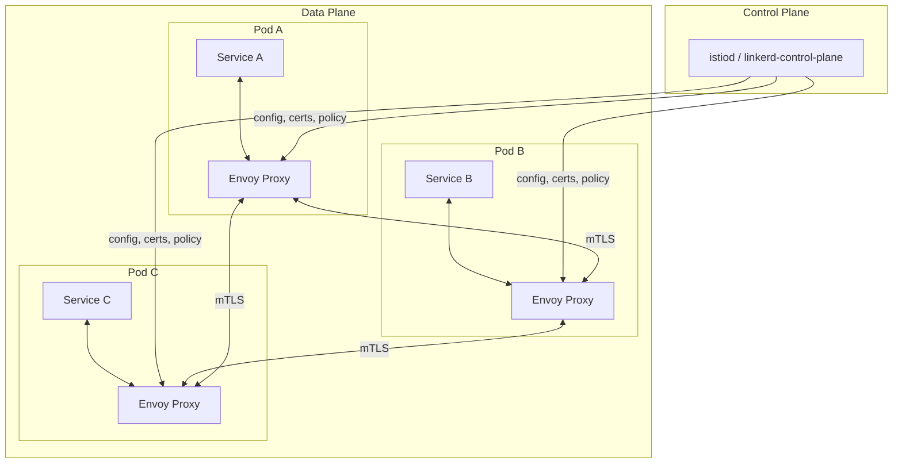
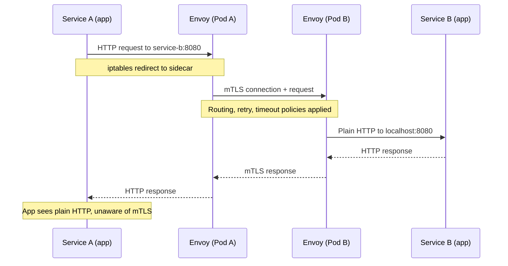
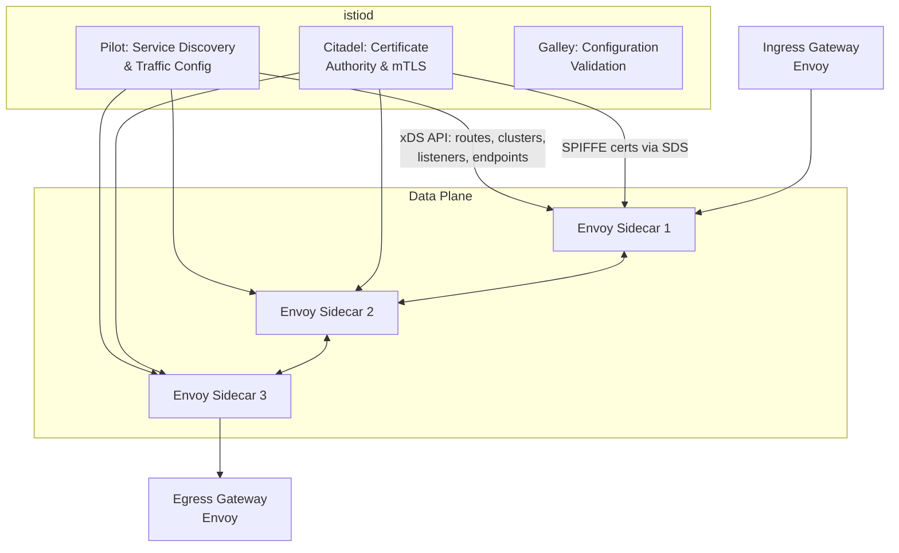
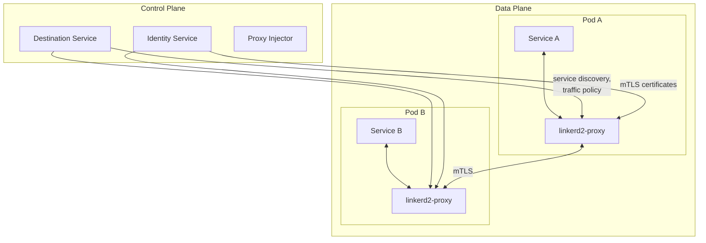
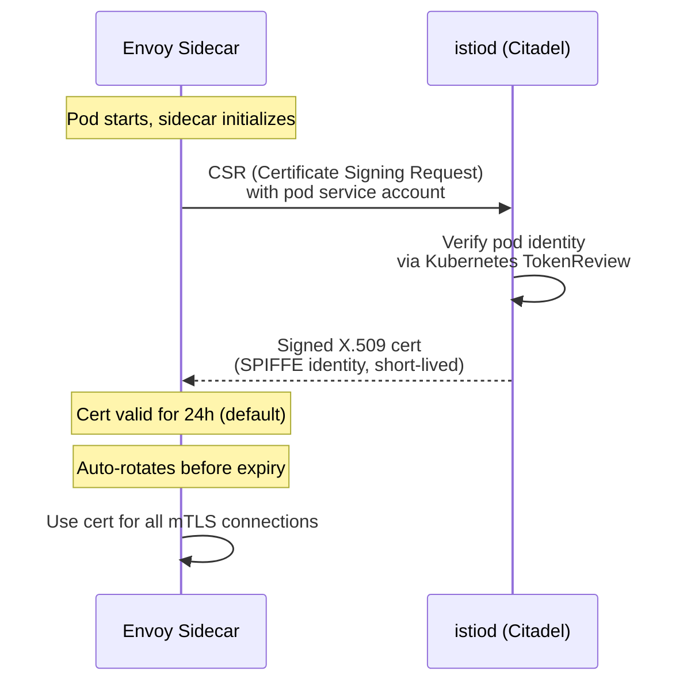

# Service Mesh — Sidecar Proxies, mTLS, and Traffic Management

**Date:** 2026-04-23 | **Updated:** 2026-04-23
**Tags:** `networking` `service-mesh` `istio` `envoy` `mtls` `sidecar`

---

## Table of Contents

- [Summary](#summary)
- [1. What Problem Does a Service Mesh Solve](#1-what-problem-does-a-service-mesh-solve)
- [2. Sidecar Proxy Pattern](#2-sidecar-proxy-pattern)
- [3. Istio Architecture](#3-istio-architecture)
- [4. Linkerd](#4-linkerd)
- [5. Automatic mTLS](#5-automatic-mtls)
- [6. Traffic Management](#6-traffic-management)
- [7. Observability](#7-observability)
- [8. Resilience](#8-resilience)
- [9. Do You Need a Service Mesh?](#9-do-you-need-a-service-mesh)
- [10. Ambient Mesh](#10-ambient-mesh)
- [Related](#related)
- [References](#references)

---

## Summary

A **service mesh** is a dedicated infrastructure layer for handling service-to-service communication in a microservices architecture. Instead of embedding networking logic (retries, circuit breaking, mTLS, tracing) into every application — in every language — the mesh pushes that logic into lightweight **sidecar proxies** running alongside each service instance.

The two dominant implementations are **Istio** (backed by Google, using Envoy sidecars) and **Linkerd** (CNCF graduated, using a Rust-based proxy). Both follow the same fundamental pattern: a **data plane** of proxies that intercept all network traffic, controlled by a **control plane** that distributes configuration, certificates, and policy.

For a backend developer running Node.js and Spring Boot services in Kubernetes, the mesh gives you automatic mTLS between all services, traffic splitting for canary deployments, circuit breaking without changing a line of application code, and golden-signal metrics (request rate, error rate, latency) emitted by every proxy for free. The tradeoff is operational complexity — the mesh adds moving parts, resource overhead, and a new abstraction layer to debug when things go wrong.

---

## 1. What Problem Does a Service Mesh Solve

### The Microservices Networking Challenge

When you move from a monolith to dozens of services, every cross-service call needs:

- **Service discovery** — finding which IPs/ports a service is reachable at.
- **Load balancing** — distributing traffic across instances.
- **Encryption** — securing traffic between services (east-west traffic).
- **Authentication** — proving identity between services (not just users).
- **Resilience** — retries, timeouts, circuit breaking for transient failures.
- **Observability** — knowing which service called which, how long it took, and what failed.
- **Traffic control** — canary releases, A/B testing, traffic mirroring.

### Why Application Libraries Do Not Scale

Before service meshes, teams solved these problems with language-specific libraries:

| Library | Language | What It Does |
|---------|----------|-------------|
| Netflix Hystrix | Java | Circuit breaking, bulkheading |
| Netflix Ribbon | Java | Client-side load balancing |
| Resilience4j | Java | Circuit breaker, retry, rate limiter |
| Polly | .NET | Retry, circuit breaker, timeout |
| cockatiel | TypeScript | Circuit breaker, retry, bulkhead |

**The problem:** every library only works for one language. If you have Node.js, Java, Go, and Python services, you need four different resilience implementations, four different tracing setups, and four different mTLS configurations. They drift out of sync. New services forget to integrate them. Nobody owns the cross-cutting concern.

A service mesh extracts networking logic from the application layer into infrastructure, making it **language-agnostic** and **uniformly enforced**.

### What a Mesh Gives You Without Code Changes

| Concern | Without Mesh | With Mesh |
|---------|-------------|-----------|
| mTLS | Manual cert provisioning per service | Automatic, mesh-managed certificates |
| Retries | Library per language (Resilience4j, cockatiel) | Envoy proxy config, uniform across all services |
| Circuit breaking | Hystrix/Resilience4j in Java, custom in Node | DestinationRule outlier detection |
| Tracing | SDK per language (OpenTelemetry) | Automatic span creation, header propagation still needed |
| Metrics | Prometheus client per language | Automatic RED metrics from every proxy |
| Canary deploy | Custom routing logic or Kubernetes rollout | VirtualService weight-based routing |

---

## 2. Sidecar Proxy Pattern

### Data Plane vs Control Plane

Every service mesh has two layers:



**Data plane:** the sidecar proxies (Envoy in Istio, linkerd2-proxy in Linkerd) that sit next to every service instance. They intercept all inbound and outbound network traffic. Every request between services flows through two proxies: the source sidecar and the destination sidecar.

**Control plane:** the central brain that tells the proxies what to do. It distributes routing rules, certificate material, access policies, and service discovery information. The proxies pull config from the control plane — the control plane never touches actual request data.

### How Traffic Interception Works

The sidecar does not require your application to know it exists. Traffic interception happens at the network level:

1. **Init container (istio-init)** runs before your application container starts.
2. The init container sets up **iptables rules** that redirect all inbound and outbound TCP traffic to the Envoy sidecar's ports (typically 15001 for outbound, 15006 for inbound).
3. Your application sends a request to `service-b:8080`. The OS routes it through iptables, which redirects it to the local Envoy sidecar.
4. Envoy resolves the destination, applies routing/retry/timeout policy, initiates mTLS with the remote Envoy sidecar, and forwards the request.
5. The remote Envoy sidecar terminates mTLS, applies inbound policy, and forwards to the local application.



### Sidecar Resource Cost

Each sidecar consumes resources. Typical baseline for Envoy:

- **Memory:** 50-100 MB per sidecar (increases with number of endpoints in the mesh)
- **CPU:** 0.1-0.5 vCPU under moderate load
- **Latency:** 1-3 ms added per hop (two sidecars per request = 2-6 ms total)

For a cluster with 200 pods, that is 10-20 GB of memory just for sidecars. This overhead drives the interest in sidecarless architectures like ambient mesh (section 10).

---

## 3. Istio Architecture

### istiod — The Unified Control Plane

Istio originally had three separate control plane components (Pilot, Citadel, Galley). Since Istio 1.5, they merged into a single binary: **istiod**.



**Pilot** watches Kubernetes services and endpoints, converts them into Envoy-compatible configuration, and pushes it to every sidecar via the **xDS API** (Listener Discovery Service, Route Discovery Service, Cluster Discovery Service, Endpoint Discovery Service).

**Citadel** acts as a certificate authority. It issues short-lived X.509 certificates to every sidecar using the **SPIFFE** identity framework, rotates them automatically, and distributes them via the **Secret Discovery Service (SDS)**.

**Galley** validates Istio configuration resources before they reach Pilot. It catches YAML errors and invalid references early.

### Ingress and Egress Gateways

**Ingress Gateway:** an Envoy proxy at the mesh edge that handles traffic entering the mesh from outside. It replaces Kubernetes Ingress for Istio-managed clusters. You configure it with Gateway and VirtualService resources.

**Egress Gateway:** controls traffic leaving the mesh. Useful for enforcing that all outbound calls go through a monitored exit point, for compliance or security auditing.

### Core CRDs (Custom Resource Definitions)

Istio extends Kubernetes with several CRDs. The four you use most:

#### VirtualService — Route Traffic

Defines how requests are routed to a service. Supports path-based, header-based, and weight-based routing.

```yaml
apiVersion: networking.istio.io/v1
kind: VirtualService
metadata:
  name: reviews-route
spec:
  hosts:
    - reviews
  http:
    - match:
        - headers:
            end-user:
              exact: jason
      route:
        - destination:
            host: reviews
            subset: v2
    - route:
        - destination:
            host: reviews
            subset: v1
          weight: 90
        - destination:
            host: reviews
            subset: v2
          weight: 10
```

This routes requests from user "jason" to v2, and splits remaining traffic 90/10 between v1 and v2.

#### DestinationRule — Configure Backend Behavior

Defines traffic policies applied after routing — load balancing, connection pool settings, outlier detection (circuit breaking), and TLS settings.

```yaml
apiVersion: networking.istio.io/v1
kind: DestinationRule
metadata:
  name: reviews-destination
spec:
  host: reviews
  trafficPolicy:
    connectionPool:
      tcp:
        maxConnections: 100
      http:
        h2UpgradePolicy: DEFAULT
        maxRequestsPerConnection: 10
    outlierDetection:
      consecutive5xxErrors: 5
      interval: 30s
      baseEjectionTime: 30s
      maxEjectionPercent: 50
  subsets:
    - name: v1
      labels:
        version: v1
    - name: v2
      labels:
        version: v2
```

#### Gateway — Configure Ingress/Egress

Defines which ports and protocols the ingress/egress gateway listens on.

```yaml
apiVersion: networking.istio.io/v1
kind: Gateway
metadata:
  name: my-gateway
spec:
  selector:
    istio: ingressgateway
  servers:
    - port:
        number: 443
        name: https
        protocol: HTTPS
      tls:
        mode: SIMPLE
        credentialName: my-tls-cert
      hosts:
        - "api.example.com"
```

#### PeerAuthentication — mTLS Policy

Controls mutual TLS enforcement between services.

```yaml
apiVersion: security.istio.io/v1
kind: PeerAuthentication
metadata:
  name: default
  namespace: istio-system
spec:
  mtls:
    mode: STRICT
```

Setting `STRICT` mode mesh-wide means every service-to-service call must use mTLS. `PERMISSIVE` allows both plaintext and mTLS (useful during migration).

---

## 4. Linkerd

### Design Philosophy

Linkerd takes a deliberately simpler approach than Istio. Where Istio is a platform with many knobs, Linkerd aims to be an opinionated mesh that is easy to install, easy to operate, and hard to misconfigure.

### linkerd2-proxy — A Rust-Based Sidecar

Instead of Envoy (C++), Linkerd uses **linkerd2-proxy**, written in Rust. It is purpose-built for the service mesh use case:

- **Smaller footprint:** ~10-20 MB memory baseline vs Envoy's 50-100 MB.
- **Lower latency:** sub-millisecond p99 latency overhead.
- **No general-purpose config:** it does exactly what Linkerd needs, nothing more.
- **Memory safe:** Rust's ownership model eliminates buffer overflow vulnerabilities common in C++ proxies.

### Architecture



**Destination service:** provides service discovery and per-route policy to the proxies.
**Identity service:** acts as the TLS certificate authority, issuing SPIFFE-compatible identities.
**Proxy injector:** a Kubernetes admission webhook that automatically injects the sidecar into pods.

### Service Profiles

Linkerd uses **ServiceProfile** resources instead of Istio's VirtualService/DestinationRule split:

```yaml
apiVersion: linkerd.io/v1alpha2
kind: ServiceProfile
metadata:
  name: reviews.default.svc.cluster.local
  namespace: default
spec:
  routes:
    - name: GET /reviews/{id}
      condition:
        method: GET
        pathRegex: /reviews/[^/]+
      responseClasses:
        - condition:
            status:
              min: 500
              max: 599
          isFailure: true
    - name: POST /reviews
      condition:
        method: POST
        pathRegex: /reviews
      isRetryable: true
```

### Traffic Split

Linkerd uses the Kubernetes **SMI TrafficSplit** resource for canary deployments:

```yaml
apiVersion: split.smi-spec.io/v1alpha2
kind: TrafficSplit
metadata:
  name: reviews-split
spec:
  service: reviews
  backends:
    - service: reviews-v1
      weight: 900
    - service: reviews-v2
      weight: 100
```

### Istio vs Linkerd — Comparison

| Aspect | Istio | Linkerd |
|--------|-------|---------|
| **Proxy** | Envoy (C++) | linkerd2-proxy (Rust) |
| **Memory per sidecar** | 50-100 MB | 10-20 MB |
| **Latency overhead** | 2-5 ms p99 | < 1 ms p99 |
| **Configuration model** | Many CRDs, highly flexible | Fewer CRDs, opinionated defaults |
| **Learning curve** | Steep | Moderate |
| **mTLS** | Automatic, configurable per namespace/service | Automatic, on by default |
| **Traffic management** | Rich (header routing, fault injection, mirroring) | Basic (weight-based split, retries, timeouts) |
| **Multi-cluster** | Supported | Supported |
| **CNCF status** | Graduated | Graduated |
| **Ambient/sidecarless** | Yes (ambient mesh) | No (sidecar only) |
| **Best for** | Complex routing needs, multi-protocol | Simplicity, lower resource overhead |

### Consul Connect

HashiCorp Consul Connect is a third option, particularly relevant if you already use Consul for service discovery:

| Aspect | Consul Connect |
|--------|---------------|
| **Proxy** | Envoy (same as Istio) |
| **Identity** | Consul's built-in CA, SPIFFE-compatible |
| **Multi-platform** | Works outside Kubernetes (VMs, bare metal) |
| **Service discovery** | Built into Consul (not dependent on Kubernetes DNS) |
| **Config model** | Consul intentions + config entries |
| **Best for** | Hybrid environments (Kubernetes + VMs), Consul-native orgs |

---

## 5. Automatic mTLS

### The Manual mTLS Problem

Without a service mesh, enabling mTLS between services requires:

1. Running a certificate authority (CA) or buying certs.
2. Generating a certificate and key for each service.
3. Distributing certs securely to each service instance.
4. Configuring every service to present its cert and verify peers.
5. Rotating certificates before they expire.
6. Updating every service when the CA cert rotates.

In a cluster with 50 services and 200 pods, that is 200 certificate pairs to manage. With 24-hour cert lifetimes (modern best practice), that is 200 rotations per day. No team does this manually.

### How the Mesh Handles It



1. When a sidecar starts, it generates a private key and sends a **Certificate Signing Request (CSR)** to the control plane.
2. The control plane verifies the sidecar's identity using the Kubernetes service account token (via TokenReview API).
3. It signs and returns an X.509 certificate encoded with a **SPIFFE** identity: `spiffe://cluster.local/ns/default/sa/reviews`.
4. The certificate is short-lived (24 hours by default in Istio). The sidecar automatically requests a new one before expiration.
5. All service-to-service connections use these certificates for mutual authentication.

### SPIFFE Identity

**SPIFFE (Secure Production Identity Framework for Everyone)** provides a standard for service identity:

- Identity format: `spiffe://trust-domain/path` (e.g., `spiffe://cluster.local/ns/production/sa/payment-service`)
- Identity is encoded in the X.509 certificate's SAN (Subject Alternative Name) field.
- Any SPIFFE-compatible system can verify identity without custom logic.
- Works across mesh implementations — a Linkerd service and an Istio service can verify each other's SPIFFE identity.

### PeerAuthentication Modes

| Mode | Behavior | When to Use |
|------|----------|-------------|
| `PERMISSIVE` | Accept both plaintext and mTLS | During migration, when not all services have sidecars |
| `STRICT` | Reject any non-mTLS traffic | Production steady state, zero-trust enforcement |
| `DISABLE` | No mTLS | Debugging, specific exemptions |

**Migration path:** start with `PERMISSIVE` mesh-wide, add sidecars to all services, verify mTLS works with Kiali, then switch to `STRICT`.

### Why This Beats Manual Cert Management

| Property | Manual | Mesh-Managed |
|----------|--------|-------------|
| Cert provisioning | Hours to days | Seconds (automatic) |
| Cert rotation | Custom automation or cron | Built-in, transparent |
| Cert lifetime | Months to years (security risk) | Hours (24h default) |
| Identity verification | App-level TLS config | Proxy handles it, app unchanged |
| Cross-language | Configure each runtime separately | Uniform, language-agnostic |
| Revocation | CRL/OCSP (slow, unreliable) | Short lifetimes make revocation unnecessary |

---

## 6. Traffic Management

Traffic management is where the mesh pays for itself in deployment safety. Instead of deploying new code to all instances and hoping it works, you can route a fraction of traffic to the new version and observe.

### Weight-Based Routing (Canary Deployment)

Route 5% of traffic to v2, 95% to v1:

```yaml
apiVersion: networking.istio.io/v1
kind: VirtualService
metadata:
  name: payment-service
spec:
  hosts:
    - payment
  http:
    - route:
        - destination:
            host: payment
            subset: v1
          weight: 95
        - destination:
            host: payment
            subset: v2
          weight: 5
```

Gradually shift weights as confidence grows: 5% -> 25% -> 50% -> 100%.

### Header-Based Routing

Route traffic based on HTTP headers — useful for testing a new version with internal users:

```yaml
apiVersion: networking.istio.io/v1
kind: VirtualService
metadata:
  name: payment-service
spec:
  hosts:
    - payment
  http:
    - match:
        - headers:
            x-canary:
              exact: "true"
      route:
        - destination:
            host: payment
            subset: v2
    - route:
        - destination:
            host: payment
            subset: v1
```

Internal testers add `x-canary: true` to their requests and hit v2. Everyone else hits v1.

### Traffic Mirroring (Shadowing)

Send a copy of production traffic to a new version without affecting the response the user sees. The mirrored request is fire-and-forget — its response is discarded.

```yaml
apiVersion: networking.istio.io/v1
kind: VirtualService
metadata:
  name: payment-service
spec:
  hosts:
    - payment
  http:
    - route:
        - destination:
            host: payment
            subset: v1
      mirror:
        host: payment
        subset: v2
      mirrorPercentage:
        value: 100.0
```

This is invaluable for testing a new version against real traffic patterns without any user-facing risk. Watch v2's logs, metrics, and error rates.

### Fault Injection

Intentionally inject failures to test resilience. Two types:

**Delay injection** — add latency:

```yaml
apiVersion: networking.istio.io/v1
kind: VirtualService
metadata:
  name: reviews
spec:
  hosts:
    - reviews
  http:
    - fault:
        delay:
          percentage:
            value: 10
          fixedDelay: 5s
      route:
        - destination:
            host: reviews
            subset: v1
```

10% of requests to the reviews service see a 5-second delay. Use this to verify that callers have proper timeouts.

**Abort injection** — return errors:

```yaml
apiVersion: networking.istio.io/v1
kind: VirtualService
metadata:
  name: reviews
spec:
  hosts:
    - reviews
  http:
    - fault:
        abort:
          percentage:
            value: 5
          httpStatus: 503
      route:
        - destination:
            host: reviews
            subset: v1
```

5% of requests get an immediate 503. Verifies that callers handle errors gracefully and retry correctly.

### Timeout and Retry Policies

```yaml
apiVersion: networking.istio.io/v1
kind: VirtualService
metadata:
  name: payment-service
spec:
  hosts:
    - payment
  http:
    - route:
        - destination:
            host: payment
      timeout: 3s
      retries:
        attempts: 3
        perTryTimeout: 1s
        retryOn: 5xx,reset,connect-failure,retriable-4xx
```

**Key settings:**
- `timeout`: overall request timeout including retries.
- `perTryTimeout`: timeout for each individual attempt.
- `retryOn`: which conditions trigger a retry. `5xx` covers server errors, `reset` covers connection resets, `connect-failure` covers TCP connection failures.
- `attempts`: maximum number of retries (not total attempts — 3 retries = 4 total attempts).

**Warning:** retries multiply load. If service A retries 3 times to service B, and service B retries 3 times to service C, a single failure at C causes 4 x 4 = 16 requests. Set retry budgets and ensure timeouts cascade correctly.

---

## 7. Observability

One of the strongest arguments for a service mesh is the observability it provides with zero application changes (mostly).

### Automatic Metrics — The RED Method

Every Envoy sidecar automatically emits metrics for every request:

| Metric | Description | Prometheus Metric |
|--------|------------|-------------------|
| **R**ate | Requests per second | `istio_requests_total` |
| **E**rror | Error rate (% of non-2xx responses) | `istio_requests_total{response_code=~"5.."}` |
| **D**uration | Request latency distribution | `istio_request_duration_milliseconds` |

These are labeled with source, destination, response code, and other metadata. You get a full dependency graph from metrics alone.

Example PromQL — error rate for the reviews service:

```promql
sum(rate(istio_requests_total{
  destination_service="reviews.default.svc.cluster.local",
  response_code=~"5.."
}[5m]))
/
sum(rate(istio_requests_total{
  destination_service="reviews.default.svc.cluster.local"
}[5m]))
```

### Distributed Tracing

The mesh generates spans for every proxy hop automatically. However, **the application must propagate trace headers** for traces to be connected across services. The mesh cannot do this for you — it does not understand your application's threading model.

Headers to propagate (OpenTelemetry / Zipkin / Jaeger compatible):

```
x-request-id
x-b3-traceid
x-b3-spanid
x-b3-parentspanid
x-b3-sampled
x-b3-flags
traceparent          (W3C Trace Context)
tracestate           (W3C Trace Context)
```

In a **Node.js/Express** service, propagate with middleware:

```typescript
const TRACE_HEADERS = [
  'x-request-id',
  'x-b3-traceid',
  'x-b3-spanid',
  'x-b3-parentspanid',
  'x-b3-sampled',
  'traceparent',
  'tracestate',
] as const;

function propagateTraceHeaders(
  incomingHeaders: Record<string, string | undefined>,
): Record<string, string> {
  const outgoing: Record<string, string> = {};
  for (const header of TRACE_HEADERS) {
    const value = incomingHeaders[header];
    if (value !== undefined) {
      outgoing[header] = value;
    }
  }
  return outgoing;
}
```

In a **Spring Boot** service, Spring Cloud Sleuth / Micrometer Tracing handles propagation automatically if included as a dependency.

### Kiali — Service Graph Visualization

**Kiali** is Istio's observability dashboard. It reads Istio configuration and Prometheus metrics to generate:

- A real-time **service graph** showing which services communicate and their error/latency rates.
- Configuration validation — flags VirtualService/DestinationRule misconfigurations.
- Distributed traces (integrated with Jaeger).
- Workload details — pods, replicas, sidecar status.

### Grafana Dashboards

Istio ships with pre-built Grafana dashboards:

- **Mesh Dashboard:** global request volume, success rate, latency across the entire mesh.
- **Service Dashboard:** per-service incoming/outgoing traffic, error rates, latency percentiles.
- **Workload Dashboard:** per-pod resource usage, connection metrics.

These dashboards work out of the box once Prometheus scrapes the Envoy sidecars.

---

## 8. Resilience

### Circuit Breaking with Outlier Detection

Istio implements circuit breaking via the `outlierDetection` field in DestinationRule. It works at the **instance level** — if one pod of a service starts returning errors, the mesh ejects it from the load balancing pool.

```yaml
apiVersion: networking.istio.io/v1
kind: DestinationRule
metadata:
  name: payment-circuit-breaker
spec:
  host: payment
  trafficPolicy:
    outlierDetection:
      consecutive5xxErrors: 3
      interval: 10s
      baseEjectionTime: 30s
      maxEjectionPercent: 50
      minHealthPercent: 30
```

**How it works:**
1. Envoy tracks the response codes from each upstream instance.
2. If an instance returns 3 consecutive 5xx errors within a 10-second window, Envoy ejects it from the pool.
3. The instance stays ejected for 30 seconds (doubles on each subsequent ejection).
4. At most 50% of instances can be ejected — prevents the circuit breaker from killing all backends.
5. If the healthy instance count drops below 30%, outlier detection is disabled (panic mode — better to try all instances than none).

### Connection Pool Settings

Limit the blast radius of a slow or broken service:

```yaml
apiVersion: networking.istio.io/v1
kind: DestinationRule
metadata:
  name: payment-pool
spec:
  host: payment
  trafficPolicy:
    connectionPool:
      tcp:
        maxConnections: 100
        connectTimeout: 500ms
      http:
        http1MaxPendingRequests: 100
        http2MaxRequests: 1000
        maxRequestsPerConnection: 10
        maxRetries: 3
```

**Key settings:**
- `maxConnections`: max TCP connections to the upstream. Excess connections are queued or rejected.
- `http1MaxPendingRequests`: max requests waiting for a connection from the pool. If exceeded, requests fail fast with 503.
- `http2MaxRequests`: max concurrent requests to an HTTP/2 upstream.
- `maxRetries`: max concurrent retries across all requests to this host.

### Rate Limiting

Istio does not have a first-class rate limiting CRD. You implement it via **EnvoyFilter** (which directly patches Envoy config) or an **external rate limit service**.

Example with local rate limiting via EnvoyFilter:

```yaml
apiVersion: networking.istio.io/v1alpha3
kind: EnvoyFilter
metadata:
  name: local-rate-limit
  namespace: default
spec:
  workloadSelector:
    labels:
      app: payment
  configPatches:
    - applyTo: HTTP_FILTER
      match:
        context: SIDECAR_INBOUND
        listener:
          filterChain:
            filter:
              name: envoy.filters.network.http_connection_manager
      patch:
        operation: INSERT_BEFORE
        value:
          name: envoy.filters.http.local_ratelimit
          typed_config:
            "@type": type.googleapis.com/udpa.type.v1.TypedStruct
            type_url: type.googleapis.com/envoy.extensions.filters.http.local_ratelimit.v3.LocalRateLimit
            value:
              stat_prefix: http_local_rate_limiter
              token_bucket:
                max_tokens: 100
                tokens_per_fill: 100
                fill_interval: 60s
              filter_enabled:
                runtime_key: local_rate_limit_enabled
                default_value:
                  numerator: 100
                  denominator: HUNDRED
              filter_enforced:
                runtime_key: local_rate_limit_enforced
                default_value:
                  numerator: 100
                  denominator: HUNDRED
              response_headers_to_add:
                - append_action: OVERWRITE_IF_EXISTS_OR_ADD
                  header:
                    key: x-local-rate-limit
                    value: "true"
```

This is verbose — which illustrates why EnvoyFilter is considered an escape hatch, not a primary interface.

---

## 9. Do You Need a Service Mesh?

### The Complexity Cost

A service mesh adds:

- **Operational overhead:** control plane to run, monitor, and upgrade. istiod is another deployment that can fail.
- **Resource overhead:** sidecar memory and CPU per pod (section 2).
- **Debugging complexity:** when a request fails, you now need to check application logs, sidecar logs, and mesh configuration. Was it a retry storm? An outlier ejection? A misconfigured VirtualService?
- **Upgrade risk:** mesh upgrades touch every pod (sidecar version). A botched upgrade affects the entire cluster.
- **Learning curve:** Istio's CRD surface area is large. Misconfigured mTLS mode or retry policies can cause subtle, hard-to-diagnose failures.

### When It Is Worth It

A service mesh earns its keep when:

- **> 10-15 services** — the networking concerns become repetitive and error-prone to manage per-service.
- **Multiple languages** — you cannot standardize on one resilience library across Java, Node, Go, Python services.
- **Strict security requirements** — you need mTLS everywhere, auditable traffic, and SPIFFE-based identity for compliance (SOC 2, PCI DSS).
- **Canary/progressive delivery** — you do canary deployments frequently and need weight-based routing without custom tooling.
- **Observability gaps** — you want golden-signal metrics and service dependency graphs without instrumenting every service.

### When It Is Not Worth It

- **< 5 services** — the overhead exceeds the benefit. Use a library like Resilience4j or cockatiel.
- **Single language** — if everything is Java/Spring Boot, Spring Cloud (Eureka, Resilience4j, Spring Cloud Gateway) handles most mesh concerns natively.
- **Simple traffic patterns** — if you deploy all-at-once and do not need canary routing, the traffic management features go unused.
- **Resource-constrained environments** — sidecar overhead matters when your services themselves use 64 MB of memory.

### Decision Framework

```
Do you have > 10 services in production?
├── No → Skip the mesh. Use language libraries.
└── Yes
    ├── Are they in multiple languages?
    │   ├── No → Consider Spring Cloud / language-native solutions first.
    │   └── Yes → Strong case for a mesh.
    ├── Do you need mTLS between all services?
    │   ├── No → Mesh is optional.
    │   └── Yes → Mesh is the most practical path.
    └── Do you do canary deployments?
        ├── No → Mesh adds complexity you may not need.
        └── Yes → Mesh simplifies this significantly.
```

### Alternatives

| Alternative | What It Covers | What It Misses |
|-------------|---------------|----------------|
| **Library-based** (Resilience4j, cockatiel) | Retries, circuit breaking, timeouts | mTLS, traffic management, cross-language |
| **Kubernetes-native** (Ingress, NetworkPolicy) | Basic routing, network segmentation | mTLS, observability, circuit breaking |
| **eBPF-based** (Cilium) | Network policy, some observability, encryption (WireGuard) | L7 traffic management, fine-grained routing |
| **Ambient mesh** (Istio ambient) | Full mesh features, no sidecars | Still maturing (see section 10) |

---

## 10. Ambient Mesh

### The Sidecar Problem

Sidecars work, but they have costs:

- Every pod gets an extra container consuming memory and CPU.
- Sidecar injection requires mutating webhooks and pod restarts.
- Sidecar upgrades require rolling every pod in the cluster.
- Some workloads (jobs, init containers, host-network pods) interact poorly with sidecars.

### Istio Ambient Mesh — Sidecarless Architecture

Istio ambient mesh, introduced as a beta feature, removes sidecars entirely. It splits the data plane into two layers:

```mermaid
graph TB
    subgraph "Node 1"
        Z1[ztunnel<br/>L4 proxy<br/>per-node DaemonSet]
        P1[Pod A]
        P2[Pod B]
        P1 --> Z1
        P2 --> Z1
    end

    subgraph "Node 2"
        Z2[ztunnel<br/>L4 proxy<br/>per-node DaemonSet]
        P3[Pod C]
        P4[Pod D]
        P3 --> Z2
        P4 --> Z2
    end

    subgraph "Waypoint Proxies (per namespace/service)"
        WP[Waypoint Proxy<br/>Envoy, L7 features]
    end

    Z1 <-->|mTLS tunnel<br/>HBONE protocol| Z2
    Z1 --> WP
    Z2 --> WP
```



#### ztunnel (Zero-Trust Tunnel) — L4 Layer

- Runs as a **DaemonSet** (one per node, not one per pod).
- Handles **mTLS**, **L4 authorization**, and **telemetry**.
- Uses the **HBONE protocol** (HTTP-based overlay network encapsulation) to tunnel traffic between nodes.
- Written in Rust for performance and safety.
- Provides zero-trust networking without any sidecar injection.

#### Waypoint Proxy — L7 Layer

- Deployed **per namespace or per service** (not per pod).
- A standard Envoy proxy that provides L7 features: header-based routing, retries, fault injection, L7 authorization.
- Only deployed for services that need L7 traffic management.
- If your service only needs mTLS and L4 policy, the waypoint is not needed.

### Resource Savings

| Model | Proxy Instances (100 pods, 5 nodes) | Memory Overhead |
|-------|-------------------------------------|-----------------|
| Sidecar | 100 sidecars | 5-10 GB |
| Ambient (L4 only) | 5 ztunnels | 250-500 MB |
| Ambient (L4 + L7) | 5 ztunnels + N waypoints | 500 MB - 2 GB |

For clusters where most services need only mTLS and basic observability, ambient mesh reduces proxy resource consumption by 80-90%.

### Current Maturity

As of early 2026:

- **ztunnel (L4):** stable, production-ready. Handles mTLS, L4 auth, TCP telemetry.
- **Waypoint proxies (L7):** beta. Supports most VirtualService and DestinationRule features.
- **Migration:** you can run sidecar and ambient workloads in the same mesh. Migrate namespace by namespace.
- **Trade-off:** the ztunnel shared-node model means a ztunnel failure affects all pods on that node (vs sidecar model where failure is per-pod).

### Enabling Ambient Mode

```bash
# Label a namespace for ambient mesh (no sidecar injection needed)
kubectl label namespace default istio.io/dataplane-mode=ambient

# Deploy a waypoint proxy for L7 features on a specific service
istioctl waypoint apply --for service --service-account payment-sa
```

---

## Related

- [Container Networking](container-networking.md) — Docker bridge networks, Kubernetes CNI, pod networking model
- [Network Observability](network-observability.md) — distributed tracing, eBPF, RED method deep dive
- [Zero-Trust Networking](zero-trust.md) — BeyondCorp, identity-aware proxies, microsegmentation
- [Reverse Proxies & Gateways](../infrastructure/reverse-proxies-and-gateways.md) — Nginx, Envoy fundamentals, API gateway pattern
- [TLS & Certificates](../application-layer/tls-and-certificates.md) — TLS 1.3 handshake, certificate chains, mTLS fundamentals

---

## References

1. **Istio Documentation** — https://istio.io/latest/docs/ — Official Istio concepts, tasks, and reference. The canonical source for VirtualService, DestinationRule, and PeerAuthentication configuration.
2. **Linkerd Documentation** — https://linkerd.io/2/overview/ — Linkerd architecture, getting started, service profiles, and traffic split.
3. **Envoy Proxy Documentation** — https://www.envoyproxy.io/docs/envoy/latest/ — Envoy architecture, xDS APIs, filter chains, and circuit breaking internals.
4. **SPIFFE Specification** — https://spiffe.io/docs/latest/spiffe-about/overview/ — The Secure Production Identity Framework used by both Istio and Linkerd for workload identity.
5. **Istio Ambient Mesh** — https://istio.io/latest/docs/ambient/ — Architecture, ztunnel, waypoint proxies, and migration guide for sidecarless mode.
6. **"The Service Mesh Manifesto" by William Morgan (Linkerd creator)** — https://buoyant.io/service-mesh-manifesto — Explains the rationale for service meshes and the data plane / control plane separation.
7. **CNCF Service Mesh Landscape** — https://landscape.cncf.io/ — Overview of service mesh projects in the cloud-native ecosystem.
8. **Consul Connect Documentation** — https://developer.hashicorp.com/consul/docs/connect — HashiCorp Consul's service mesh capabilities for hybrid environments.
