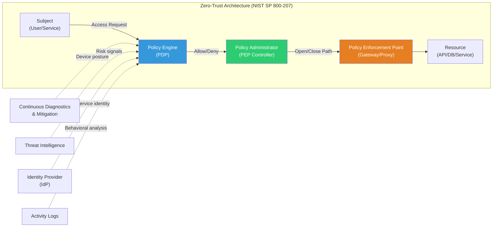
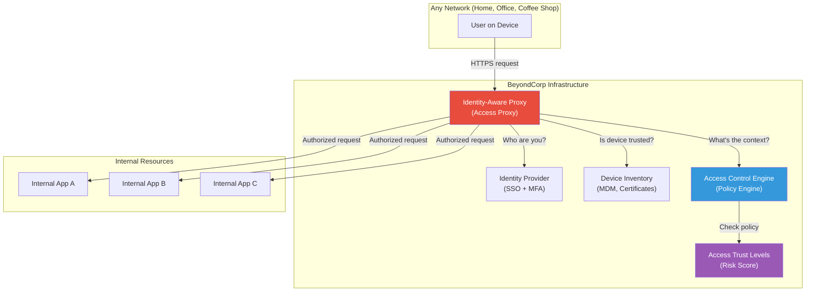
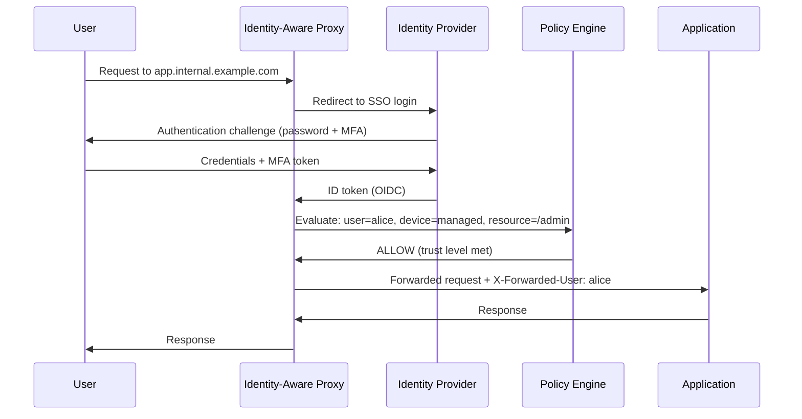
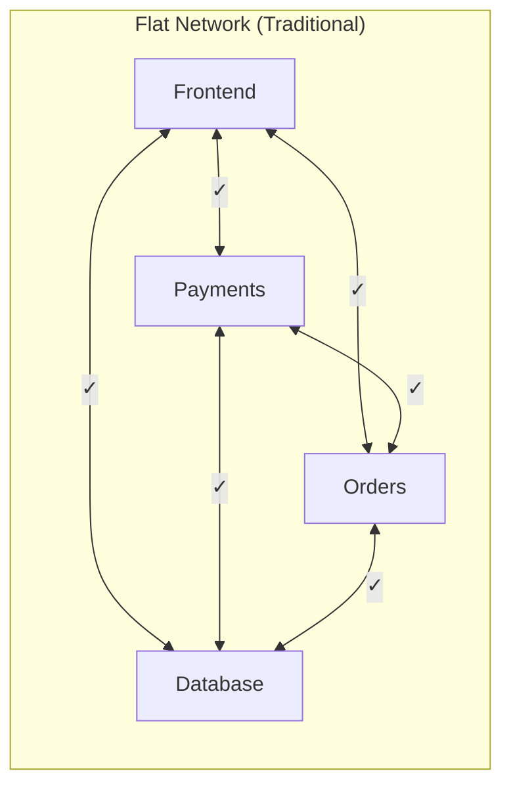
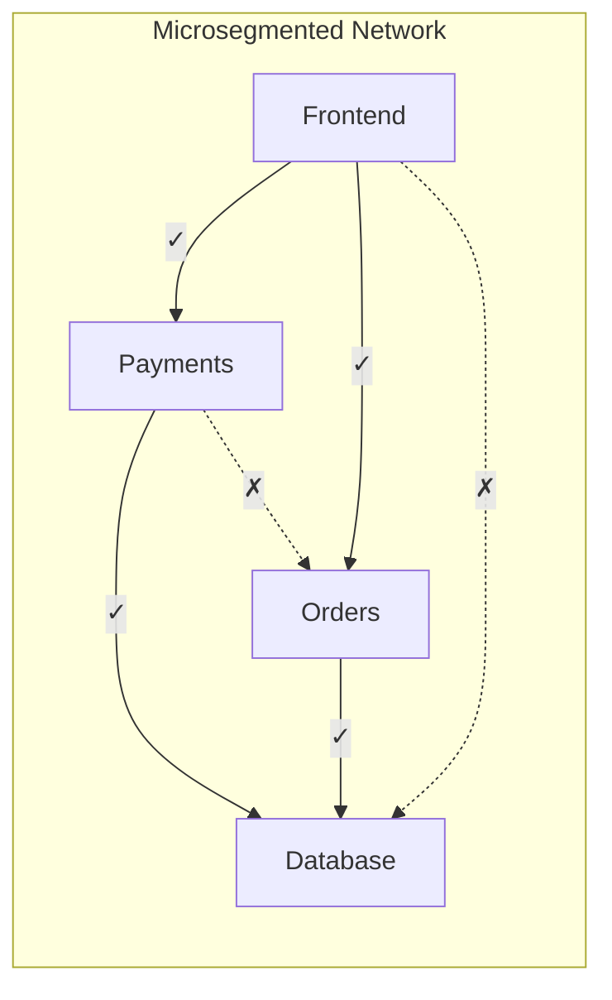

| Field       | Value                                                          |
|-------------|----------------------------------------------------------------|
| **Topic**   | Zero-Trust Networking — BeyondCorp and Identity-Based Access   |
| **Audience**| Backend developer (TypeScript/Node + Java/Spring Boot)         |
| **Level**   | Intermediate to Advanced                                       |
| **Prereqs** | TLS fundamentals, basic authentication/authorization concepts  |

---

## Table of Contents

1. [Perimeter Security is Dead](#1-perimeter-security-is-dead)
2. [Zero-Trust Principles](#2-zero-trust-principles)
3. [BeyondCorp Model](#3-beyondcorp-model)
4. [Identity-Based Access](#4-identity-based-access)
5. [Identity-Aware Proxies](#5-identity-aware-proxies)
6. [Mutual TLS (mTLS)](#6-mutual-tls-mtls)
7. [Microsegmentation](#7-microsegmentation)
8. [Policy Engines](#8-policy-engines)
9. [Implementing Zero-Trust Incrementally](#9-implementing-zero-trust-incrementally)
10. [Zero-Trust for Backend Developers](#10-zero-trust-for-backend-developers)

---

## Summary

Zero-trust networking inverts the traditional security model. Instead of trusting everything inside a network perimeter and guarding the edge, zero-trust trusts nothing by default — every request must prove its identity, every access is explicitly authorized, and the network itself is assumed compromised. This document covers the foundational principles (NIST SP 800-207), Google's BeyondCorp implementation, workload and human identity systems (SPIFFE/SPIRE, SSO, MFA), identity-aware proxies, mutual TLS, microsegmentation, policy engines (OPA/Rego), and the practical changes backend developers need to make when adopting zero-trust patterns in Node.js and Spring Boot services.

---

## 1. Perimeter Security is Dead

### The Castle-and-Moat Model

Traditional network security follows a simple assumption: everything inside the corporate network is trusted, everything outside is untrusted. A firewall and VPN form the "moat" — once you cross it, you move freely.

```
┌──────────────────────────────────────────┐
│              TRUSTED ZONE                │
│                                          │
│   App Server ←→ Database ←→ Admin Panel  │
│        ↕            ↕           ↕        │
│   Internal APIs    Secrets    Dashboards │
│                                          │
└────────────────────┬─────────────────────┘
                     │ Firewall / VPN
┌────────────────────┴─────────────────────┐
│            UNTRUSTED ZONE                │
│                                          │
│   Internet  ←→  Remote Users  ←→  SaaS  │
└──────────────────────────────────────────┘
```

This model treats the network boundary as the primary security control. Inside, services communicate over flat networks with minimal authentication between them.

### Why the Perimeter Model Fails

**Lateral movement.** An attacker who gains a foothold on any internal machine can move freely across the flat internal network. The 2020 SolarWinds breach exploited this exact pattern — the attacker compromised a build server, then moved laterally through Microsoft and US government networks for months because internal traffic was implicitly trusted.

**VPN vulnerabilities.** VPNs grant broad network access once connected. A single compromised credential or device gives an attacker the same access as a legitimate employee. The 2021 Colonial Pipeline attack started with a single compromised VPN password — there was no multi-factor authentication, and the VPN granted access to operational technology systems.

**Cloud and remote work dissolve the perimeter.** When infrastructure spans AWS, GCP, and Azure, when developers work from home, when SaaS tools hold critical data — there is no single perimeter to defend. The network boundary becomes hundreds of boundaries, each with different controls.

**Supply chain attacks.** Third-party software, contractors, and partner integrations all operate "inside" the perimeter. The 2013 Target breach started through an HVAC contractor's VPN access — a vendor credential provided a path to payment systems.

### The Pattern in Every Major Breach

| Breach | Year | Initial Access | Why It Spread |
|--------|------|----------------|---------------|
| Target | 2013 | Contractor VPN credential | Flat network, no segmentation between HVAC and POS systems |
| Equifax | 2017 | Unpatched Apache Struts | Internal network trusted implicitly, lateral movement to databases |
| SolarWinds | 2020 | Compromised build pipeline | No verification of internal service identity, broad trust |
| Colonial Pipeline | 2021 | VPN password (no MFA) | VPN granted broad access, no microsegmentation between IT and OT |

The common thread: once past the perimeter, there was nothing stopping lateral movement. Zero-trust addresses this directly.

---

## 2. Zero-Trust Principles

Zero-trust is not a product — it is an architectural philosophy. NIST SP 800-207 formalizes it into a framework.

### Core Tenets

1. **Never trust, always verify.** Every request — whether from inside or outside the network — must authenticate and be authorized. No implicit trust based on network location.

2. **Least privilege access.** Grant the minimum permissions required for the task. A service that reads user profiles should not have write access to billing data.

3. **Assume breach.** Design as though the attacker is already inside. Limit blast radius through segmentation, encryption, and continuous monitoring.

4. **Verify explicitly.** Authorization decisions use multiple signals: user identity, device health, location, time of day, risk score — not just a valid credential.

5. **Microsegmentation.** Replace flat networks with fine-grained access policies between individual services. Each service-to-service communication path is explicitly authorized.

### NIST SP 800-207 Architecture

NIST defines zero-trust architecture (ZTA) around three logical components:



- **Policy Engine (PDP — Policy Decision Point):** Evaluates access requests against policies, taking identity, device, context, and risk signals as input. Makes the allow/deny decision.
- **Policy Administrator (PEP Controller):** Executes the policy engine's decision by instructing the enforcement point to open or close the communication path.
- **Policy Enforcement Point (PEP):** The gateway, proxy, or agent that actually permits or blocks the request. This is where mTLS termination, token validation, and network rules are applied.

### Perimeter vs Zero-Trust Comparison

| Aspect | Perimeter Model | Zero-Trust Model |
|--------|----------------|------------------|
| Trust assumption | Inside network = trusted | Nothing is trusted by default |
| Authentication | At the perimeter (VPN) | At every service boundary |
| Authorization | Broad (network-level ACLs) | Fine-grained (per-request) |
| Network access | Flat, open after entry | Microsegmented, least privilege |
| Encryption | Edge only (TLS termination) | End-to-end (mTLS between services) |
| Lateral movement | Easy once inside | Blocked by identity + policy |
| Monitoring | Perimeter logs | Every request logged and scored |
| Remote access | VPN grants full access | Identity-aware proxy per resource |
| Device trust | Not verified | Continuously assessed |
| Breach blast radius | Entire network | Single service or resource |

---

## 3. BeyondCorp Model

BeyondCorp is Google's production implementation of zero-trust, developed after Operation Aurora (the 2009 state-sponsored attack on Google). Google published a series of papers between 2014 and 2017 describing the architecture.

### Key Design Decisions

1. **No privileged network.** Internal Google services are not on a "trusted" network. All access — from corporate offices or coffee shops — goes through the same identity-aware proxy.
2. **Access is based on identity + device + context.** A request is authorized based on who you are (identity), what device you are on (device trust), and the current context (location, time, risk score).
3. **The network is hostile.** Google treats its own corporate network as untrusted. Services use mTLS for all communication.

### BeyondCorp Architecture



### Access Trust Levels

BeyondCorp does not use binary allow/deny. Instead, each resource requires a minimum trust level, and each request is scored:

- **Device trust:** Is the device managed? Is the OS patched? Is the disk encrypted? Is a valid device certificate present?
- **User trust:** Did the user authenticate with MFA? What is the user's role?
- **Context trust:** What network is the request from? What time is it? Does this match the user's normal behavior?

A low-sensitivity internal wiki might require trust level 2 (managed device + SSO). A production database admin panel might require trust level 5 (managed device + hardware MFA + recent authentication + low-risk context).

### What BeyondCorp Eliminated

- VPN infrastructure. Google employees do not use a VPN for internal access.
- Network-based ACLs for application access. Firewall rules still exist for infrastructure protection, but application access is identity-based.
- The concept of "inside" vs "outside." Access from the office and access from home go through the same proxy and policy engine.

---

## 4. Identity-Based Access

In zero-trust, identity replaces the network as the security perimeter. Every entity — human, service, device — must prove its identity before accessing any resource.

### Three Pillars of Identity

#### Human Identity

Verified through identity providers (IdPs) using SSO and MFA.

- **SSO (Single Sign-On):** Centralized authentication through protocols like SAML 2.0 or OIDC. Users authenticate once and receive tokens that services verify.
- **MFA (Multi-Factor Authentication):** Something you know (password), something you have (FIDO2 key, authenticator app), something you are (biometrics). FIDO2/WebAuthn hardware keys are the strongest option — they resist phishing because the cryptographic challenge is bound to the origin domain.

#### Service/Workload Identity

Machines and services need verifiable identity too. IP addresses are not identity — they change, they can be spoofed, and they say nothing about the workload running at that address.

**SPIFFE (Secure Production Identity Framework for Everyone)** solves this:

- Every workload receives a **SPIFFE ID** — a URI like `spiffe://production.example.com/payments/api`.
- Identity is proven through an **SVID (SPIFFE Verifiable Identity Document)** — typically an X.509 certificate or JWT containing the SPIFFE ID.
- **SPIRE (SPIFFE Runtime Environment)** is the reference implementation. It runs agents on each node that attest workloads and issue SVIDs.

```
SPIFFE ID format:
  spiffe://<trust-domain>/<workload-path>

Examples:
  spiffe://prod.example.com/frontend/web
  spiffe://prod.example.com/payments/api
  spiffe://prod.example.com/orders/worker
```

SPIRE handles:
- **Node attestation:** Verifying the node is legitimate (AWS instance identity document, Kubernetes service account token).
- **Workload attestation:** Verifying the workload on the node is legitimate (container image hash, namespace, service account).
- **SVID issuance and rotation:** Automatic, short-lived certificates that rotate without downtime.

#### Device Identity

Verified through device certificates, MDM (Mobile Device Management) enrollment, and continuous posture assessment.

- **Device certificates:** Issued during enrollment, prove the hardware identity. Stored in TPM (Trusted Platform Module) when available so they cannot be exfiltrated.
- **MDM signals:** OS version, patch level, disk encryption status, screen lock policy, malware scan results.
- **Continuous assessment:** Device trust is not one-time. Posture is re-evaluated continuously — a device that was trusted yesterday might fail compliance today if a patch is missed.

### Identity Replaces IP-Based ACLs

| Traditional (IP-based) | Zero-Trust (Identity-based) |
|------------------------|---------------------------|
| `allow 10.0.1.0/24 → 10.0.2.5:5432` | `allow payments-api → orders-db IF identity=spiffe://prod/payments/api AND action=SELECT` |
| Allow any pod in subnet to reach database | Allow only the verified payments service to query the orders database |
| Static, brittle, tied to network topology | Portable, meaningful, survives infrastructure changes |

---

## 5. Identity-Aware Proxies

Identity-aware proxies (IAPs) are the enforcement point in zero-trust. They sit in front of applications and verify identity before forwarding requests — replacing VPNs for application access.

### How They Work



Every request is intercepted. The proxy checks:
1. Is the user authenticated? (valid OIDC/SAML token)
2. Is the device trusted? (certificate, MDM posture)
3. Does policy allow this user to access this resource? (role, group, context)

If any check fails, the request is denied before it reaches the application.

### Options

| Solution | Type | Best For |
|----------|------|----------|
| Google Cloud IAP | Managed service | GCP-native workloads |
| Cloudflare Access (Zero Trust) | Managed service | Multi-cloud, edge-deployed |
| Pomerium | Open-source proxy | Self-hosted, Kubernetes |
| OAuth2-proxy | Open-source proxy | Lightweight, single-app protection |
| Ory Oathkeeper | Open-source proxy | API-first, rule-based |
| Teleport | Open-source platform | SSH, K8s, DB, and web access |

### Replacing VPN with Identity-Aware Proxy

| VPN | Identity-Aware Proxy |
|-----|---------------------|
| Grants broad network access | Grants access to specific applications only |
| Trust based on being connected | Trust based on identity + device + context per request |
| All traffic tunneled (latency, bandwidth) | Only application traffic proxied |
| Single point of failure | Distributed enforcement points |
| Hard to audit (which VPN user accessed what?) | Every request logged with identity |
| Split-tunnel complexity | Not applicable — no tunnel |

---

## 6. Mutual TLS (mTLS)

Standard TLS is one-sided: the client verifies the server's certificate, but the server does not verify the client. Mutual TLS (mTLS) requires both sides to present and verify certificates.

### How mTLS Differs from Standard TLS

```
Standard TLS:
  Client ──────────────────────── Server
         "Show me your certificate"
         ←── Server cert (verified) ───
         ─── Encrypted traffic ────────→

Mutual TLS:
  Client ──────────────────────── Server
         "Show me your certificate"
         ←── Server cert (verified) ───
         "Show ME YOUR certificate"
         ─── Client cert (verified) ──→
         ─── Encrypted traffic ────────→
```

In mTLS, the server rejects any client that cannot present a valid certificate signed by a trusted CA. This is how services prove identity to each other without passwords or API keys.

### mTLS in Service Mesh

Service meshes like Istio and Linkerd automate mTLS between services:

1. **SPIRE or mesh CA issues short-lived certificates** to each workload (minutes to hours, not years).
2. **Sidecar proxies (Envoy)** handle mTLS handshake — application code does not change.
3. **Certificates rotate automatically** — no manual renewal, no expired cert outages.
4. **SPIFFE identity in certificates** — the SAN (Subject Alternative Name) contains the SPIFFE ID, so access policies can reference workload identity, not IP.

```yaml
# Istio PeerAuthentication — require mTLS for all workloads in namespace
apiVersion: security.istio.io/v1beta1
kind: PeerAuthentication
metadata:
  name: default
  namespace: production
spec:
  mtls:
    mode: STRICT  # Reject any non-mTLS traffic
```

### Certificate Lifecycle

| Aspect | Traditional Certs | Zero-Trust mTLS Certs |
|--------|-------------------|----------------------|
| Lifetime | 1-2 years | Minutes to hours |
| Rotation | Manual, error-prone | Automatic, continuous |
| Scope | Per domain | Per workload instance |
| Identity | Domain name | SPIFFE ID / workload path |
| Revocation | CRL / OCSP (slow) | Short lifetime = implicit revocation |

Short-lived certificates are a key zero-trust principle. If a certificate is valid for 1 hour, a stolen certificate is useless after 1 hour — no revocation infrastructure needed.

---

## 7. Microsegmentation

Microsegmentation replaces flat networks with granular access policies that control communication between individual services. Instead of "all pods in the cluster can talk to each other," each allowed communication path is explicitly defined.

### Flat Network vs Microsegmented





In the microsegmented version, frontend cannot reach the database directly. Payments and orders cannot reach each other. Only the paths that the architecture actually requires are allowed.

### Kubernetes NetworkPolicy

Kubernetes NetworkPolicy is the built-in mechanism for microsegmentation. It requires a CNI plugin that supports it (Calico, Cilium, Weave Net — the default kubenet does not enforce NetworkPolicy).

```yaml
# Allow only the payments service to reach the orders database
apiVersion: networking.k8s.io/v1
kind: NetworkPolicy
metadata:
  name: orders-db-access
  namespace: production
spec:
  podSelector:
    matchLabels:
      app: orders-db
  policyTypes:
    - Ingress
  ingress:
    - from:
        - podSelector:
            matchLabels:
              app: payments-api
        - podSelector:
            matchLabels:
              app: orders-api
      ports:
        - protocol: TCP
          port: 5432
```

Key points:
- Without any NetworkPolicy, Kubernetes allows all pod-to-pod traffic (flat network by default).
- Once you apply a NetworkPolicy selecting a pod, that pod becomes deny-by-default for the specified `policyTypes`.
- You must explicitly allow every legitimate path.

### Default Deny Policy

Start with a default deny-all policy in each namespace, then add specific allow rules:

```yaml
# Default deny all ingress and egress in the namespace
apiVersion: networking.k8s.io/v1
kind: NetworkPolicy
metadata:
  name: default-deny-all
  namespace: production
spec:
  podSelector: {}  # Applies to all pods
  policyTypes:
    - Ingress
    - Egress
```

### Cilium Identity-Based Policies

Cilium operates at the eBPF level and supports identity-based policies that go beyond IP/port:

```yaml
# Cilium network policy using identity labels
apiVersion: cilium.io/v2
kind: CiliumNetworkPolicy
metadata:
  name: payments-to-db
  namespace: production
spec:
  endpointSelector:
    matchLabels:
      app: orders-db
  ingress:
    - fromEndpoints:
        - matchLabels:
            app: payments-api
            io.cilium.k8s.policy.serviceaccount: payments-sa
      toPorts:
        - ports:
            - port: "5432"
              protocol: TCP
          rules:
            l7:
              - action: "allow"
                method: ""  # Cilium can even filter by L7 protocol
```

Cilium uses cryptographic workload identity (not just IP) to enforce policies, making them resilient to IP spoofing and pod rescheduling.

---

## 8. Policy Engines

Policy engines externalize authorization decisions from application code. Instead of scattering `if (user.role === 'admin')` throughout services, policies live in a central, auditable, version-controlled system.

### Open Policy Agent (OPA)

OPA is the most widely adopted general-purpose policy engine. It decouples policy from code:

- **Input:** Structured data about the request (who, what, where, context).
- **Policy:** Written in Rego, a declarative language purpose-built for policy evaluation.
- **Output:** A structured decision (allow/deny, list of permissions, transformed data).

### Rego Language Basics

Rego is a declarative, logic-based language. Policies are evaluated against input data.

```rego
package authz

# Default deny
default allow := false

# Allow if the user is authenticated and has the required role
allow if {
    input.identity.authenticated == true
    required_role := role_for_resource[input.resource]
    input.identity.roles[_] == required_role
}

# Map resources to required roles
role_for_resource := {
    "/api/payments":  "payments-admin",
    "/api/orders":    "orders-reader",
    "/api/users":     "user-admin",
    "/admin/config":  "super-admin",
}

# Allow health checks without authentication
allow if {
    input.path == "/health"
    input.method == "GET"
}

# Allow service-to-service calls with valid SPIFFE identity
allow if {
    input.source.spiffe_id != ""
    startswith(input.source.spiffe_id, "spiffe://prod.example.com/")
    allowed_callers[input.resource][_] == input.source.spiffe_id
}

# Define which services can call which resources
allowed_callers := {
    "/api/orders": [
        "spiffe://prod.example.com/frontend/web",
        "spiffe://prod.example.com/payments/api",
    ],
    "/api/payments": [
        "spiffe://prod.example.com/orders/api",
    ],
}
```

### OPA Integration Points

| Integration | How It Works | Use Case |
|-------------|-------------|----------|
| Envoy ext_authz | Envoy sends authorization check to OPA sidecar before forwarding request | Service mesh policy |
| Kubernetes admission controller | OPA Gatekeeper validates K8s resource manifests at admission time | Enforce cluster policies (no privileged pods, required labels) |
| API gateway plugin | Kong/Ambassador call OPA for route authorization | API access control |
| Application middleware | Service calls OPA directly via REST/gRPC | Fine-grained in-app authorization |
| Terraform/CI pipeline | OPA validates infrastructure-as-code before apply | Prevent insecure infra configs |

### Envoy + OPA Example

```yaml
# Envoy external authorization filter pointing to OPA
http_filters:
  - name: envoy.filters.http.ext_authz
    typed_config:
      "@type": type.googleapis.com/envoy.extensions.filters.http.ext_authz.v3.ExtAuthz
      grpc_service:
        envoy_grpc:
          cluster_name: opa-sidecar
        timeout: 0.5s
      failure_mode_allow: false  # Fail closed — deny if OPA is unreachable
      with_request_body:
        max_request_bytes: 8192
        allow_partial_message: true
```

`failure_mode_allow: false` is critical. If the policy engine is unreachable, deny the request. Failing open defeats the purpose.

### Policy as Code

Treat policies like application code:
- Version control (Git) all Rego policies.
- Review policy changes in pull requests.
- Test policies with OPA's built-in test framework (`opa test`).
- Deploy through CI/CD pipeline.
- Audit policy decisions through OPA decision logs.

---

## 9. Implementing Zero-Trust Incrementally

Zero-trust is not a flag you flip. It is a journey that takes months to years depending on organization size. Here is a practical roadmap ordered by impact-to-effort ratio.

### Phase 1: Inventory and Strong Identity (Weeks 1-4)

**What to do first — high impact, foundational for everything else.**

1. **Inventory all assets.** Map every service, database, API, and internal tool. You cannot protect what you do not know exists.
2. **Enforce SSO + MFA for all human access.** This single step blocks the majority of credential-based attacks. Use FIDO2 hardware keys for privileged accounts.
3. **Issue service identity.** Start with Kubernetes service accounts and progress to SPIFFE/SPIRE for cross-platform workload identity.
4. **Enable audit logging everywhere.** Every authentication event, authorization decision, and resource access must be logged.

### Phase 2: Encrypt Everything (Weeks 4-8)

**mTLS between services — stop trusting the network.**

1. **Deploy mTLS in permissive mode first.** Istio/Linkerd can start in PERMISSIVE mode — accept both mTLS and plaintext. This lets you migrate without breaking existing traffic.
2. **Upgrade to STRICT mode namespace by namespace.** Once all services in a namespace support mTLS, switch to STRICT. Non-mTLS traffic is rejected.
3. **Encrypt data at rest.** Disk encryption, database encryption, secrets management (HashiCorp Vault, AWS Secrets Manager, GCP Secret Manager).

### Phase 3: Microsegmentation (Weeks 8-12)

**Reduce blast radius with network policies.**

1. **Deploy default-deny NetworkPolicy per namespace.** Start with non-production namespaces to build confidence.
2. **Allowlist required communication paths.** Work with each team to map legitimate traffic flows, then write explicit allow policies.
3. **Monitor denied traffic.** Use Cilium Hubble or Calico flow logs to find legitimate traffic that was accidentally blocked.

### Phase 4: Policy Engine and Continuous Verification (Weeks 12-20)

**Move from static rules to dynamic, context-aware authorization.**

1. **Deploy OPA/Gatekeeper for Kubernetes admission control.** Prevent insecure configurations from entering the cluster.
2. **Integrate OPA with service mesh for runtime authorization.** Move from "is this pod allowed to talk to that pod" (network layer) to "is this service allowed to perform this action on this resource" (application layer).
3. **Implement continuous device posture checking.** Device trust is not one-time — re-evaluate on every request or at short intervals.
4. **Deploy identity-aware proxy for internal tools.** Replace VPN access to admin dashboards, wikis, and internal apps with Pomerium, Cloudflare Access, or similar.

### What Can Wait

- Replacing all legacy systems at once (migrate incrementally).
- Building a custom policy engine (use OPA).
- Perfect device trust for BYOD (start with managed devices, add BYOD later).
- L7 protocol-aware microsegmentation (start with L3/L4 network policies).

---

## 10. Zero-Trust for Backend Developers

Zero-trust changes what your code must do. In a perimeter model, services behind the firewall often skip authentication for internal calls. In zero-trust, every service validates every request.

### What Changes in Your Code

1. **Validate tokens at every service boundary.** No service trusts another implicitly. Every incoming request must carry a valid token (JWT, mTLS client cert) that is verified before processing.
2. **Never trust the network.** Do not assume that because a request comes from an internal IP, it is legitimate. Do not allow unauthenticated endpoints for "internal only" use.
3. **Propagate identity.** When service A calls service B on behalf of a user, the user's identity must be passed along (token forwarding or token exchange) so that service B can authorize based on the original caller.
4. **Log identity on every request.** Every log line should include who made the request (user ID, service SPIFFE ID) for audit and debugging.

### JWT Verification in Node.js (Express)

```typescript
import { expressjwt, GetVerificationKey } from 'express-jwt';
import jwksRsa from 'jwks-rsa';
import { Request, Response, NextFunction } from 'express';

// Middleware: verify JWT on every request
const jwtCheck = expressjwt({
  secret: jwksRsa.expressJwtSecret({
    cache: true,
    rateLimit: true,
    jwksRequestsPerMinute: 5,
    jwksUri: 'https://auth.example.com/.well-known/jwks.json',
  }) as GetVerificationKey,
  audience: 'https://api.example.com',
  issuer: 'https://auth.example.com/',
  algorithms: ['RS256'],
});

// Apply to all routes — no unauthenticated internal endpoints
app.use(jwtCheck);

// Fine-grained authorization after authentication
function requireRole(role: string) {
  return (req: Request, res: Response, next: NextFunction) => {
    const auth = req.auth as { roles?: string[] } | undefined;
    if (!auth?.roles?.includes(role)) {
      res.status(403).json({ error: 'Insufficient permissions' });
      return;
    }
    next();
  };
}

app.get('/api/payments', requireRole('payments-reader'), (req, res) => {
  // Only reachable if JWT is valid AND user has payments-reader role
});
```

### Service-to-Service Authentication in Node.js

```typescript
import axios, { AxiosInstance } from 'axios';
import https from 'https';
import fs from 'fs';

// Option 1: mTLS client certificate (preferred in service mesh)
const mtlsClient: AxiosInstance = axios.create({
  httpsAgent: new https.Agent({
    cert: fs.readFileSync('/var/run/secrets/tls/tls.crt'),
    key: fs.readFileSync('/var/run/secrets/tls/tls.key'),
    ca: fs.readFileSync('/var/run/secrets/tls/ca.crt'),
    rejectUnauthorized: true,  // NEVER set to false in production
  }),
});

// Option 2: Service account JWT (when mTLS is handled by sidecar)
async function callOrdersService(userToken: string): Promise<OrderResponse> {
  const serviceToken = await getServiceAccountToken(); // From SPIRE or K8s SA
  const response = await axios.get('https://orders-api.production.svc/api/orders', {
    headers: {
      // Service identity for service-to-service auth
      'Authorization': `Bearer ${serviceToken}`,
      // Original user identity for authorization decisions downstream
      'X-Forwarded-User-Token': userToken,
    },
  });
  return response.data;
}
```

### JWT Verification in Spring Security

```java
@Configuration
@EnableWebSecurity
public class ZeroTrustSecurityConfig {

    @Bean
    public SecurityFilterChain filterChain(HttpSecurity http) throws Exception {
        return http
            .authorizeHttpRequests(auth -> auth
                // Health and readiness probes — the only unauthenticated paths
                .requestMatchers("/actuator/health", "/actuator/ready").permitAll()
                // Everything else requires authentication
                .anyRequest().authenticated()
            )
            .oauth2ResourceServer(oauth2 -> oauth2
                .jwt(jwt -> jwt
                    .jwtAuthenticationConverter(jwtAuthConverter())
                )
            )
            .build();
    }

    @Bean
    public JwtAuthenticationConverter jwtAuthConverter() {
        JwtGrantedAuthoritiesConverter authoritiesConverter =
            new JwtGrantedAuthoritiesConverter();
        authoritiesConverter.setAuthoritiesClaimName("roles");
        authoritiesConverter.setAuthorityPrefix("ROLE_");

        JwtAuthenticationConverter converter = new JwtAuthenticationConverter();
        converter.setJwtGrantedAuthoritiesConverter(authoritiesConverter);
        return converter;
    }
}
```

```java
@RestController
@RequestMapping("/api/payments")
public class PaymentsController {

    @GetMapping
    @PreAuthorize("hasRole('payments-reader')")
    public ResponseEntity<List<Payment>> listPayments(
            @AuthenticationPrincipal Jwt jwt) {

        // Log identity on every request for audit trail
        log.info("Payment list requested by user={} service={}",
            jwt.getSubject(),
            jwt.getClaimAsString("client_id"));

        return ResponseEntity.ok(paymentService.findAll());
    }
}
```

### Service-to-Service Auth in Spring (WebClient + mTLS)

```java
@Configuration
public class ServiceClientConfig {

    @Bean
    public WebClient ordersServiceClient(
            @Value("${orders.service.url}") String ordersUrl) throws Exception {

        SslContext sslContext = SslContextBuilder.forClient()
            .keyManager(
                new File("/var/run/secrets/tls/tls.crt"),
                new File("/var/run/secrets/tls/tls.key"))
            .trustManager(
                new File("/var/run/secrets/tls/ca.crt"))
            .build();

        HttpClient httpClient = HttpClient.create()
            .secure(spec -> spec.sslContext(sslContext));

        return WebClient.builder()
            .baseUrl(ordersUrl)
            .clientConnector(new ReactorClientHttpConnector(httpClient))
            .build();
    }
}
```

### Zero-Trust Checklist for Backend Services

- [ ] All endpoints require authentication (except health probes).
- [ ] JWT signature, expiration, audience, and issuer are verified on every request.
- [ ] Authorization checks use roles/permissions from the token, not assumptions about the caller.
- [ ] Service-to-service calls use mTLS or service account tokens.
- [ ] User identity is propagated in multi-hop calls so downstream services can authorize correctly.
- [ ] `rejectUnauthorized` is `true` (Node.js) / SSL verification is enabled (Java) — never disabled in production.
- [ ] Secrets (DB passwords, API keys) come from a secrets manager, not environment variables baked into images.
- [ ] Every request is logged with the caller's identity (user ID and/or service identity).
- [ ] Tokens have short lifetimes (minutes, not days) and are refreshed via refresh tokens.
- [ ] No "internal only" endpoints that bypass authentication because they are "only reachable from inside the cluster."

---

## Related

- [Service Mesh](service-mesh.md)
- [Container Networking](container-networking.md)
- [Network Observability](network-observability.md)
- [TLS & Certificates](../application-layer/tls-and-certificates.md)
- [Firewalls & Security](../infrastructure/firewalls-and-security.md)

---

## References

1. **NIST SP 800-207 — Zero Trust Architecture** — NIST. [https://csrc.nist.gov/publications/detail/sp/800-207/final](https://csrc.nist.gov/publications/detail/sp/800-207/final)
2. **BeyondCorp: A New Approach to Enterprise Security** — Google Research, 2014. [https://research.google/pubs/pub43231/](https://research.google/pubs/pub43231/)
3. **BeyondCorp: Design to Deployment at Google** — Google Research, 2016. [https://research.google/pubs/pub44860/](https://research.google/pubs/pub44860/)
4. **SPIFFE — Secure Production Identity Framework for Everyone** — CNCF. [https://spiffe.io/](https://spiffe.io/)
5. **Open Policy Agent Documentation** — CNCF. [https://www.openpolicyagent.org/docs/latest/](https://www.openpolicyagent.org/docs/latest/)
6. **Kubernetes Network Policies** — Kubernetes Documentation. [https://kubernetes.io/docs/concepts/services-networking/network-policies/](https://kubernetes.io/docs/concepts/services-networking/network-policies/)
7. **Cilium — eBPF-based Networking, Observability, Security** — Isovalent. [https://cilium.io/](https://cilium.io/)
8. **Pomerium — Zero Trust Access Proxy** — Pomerium, Inc. [https://www.pomerium.com/docs/](https://www.pomerium.com/docs/)
