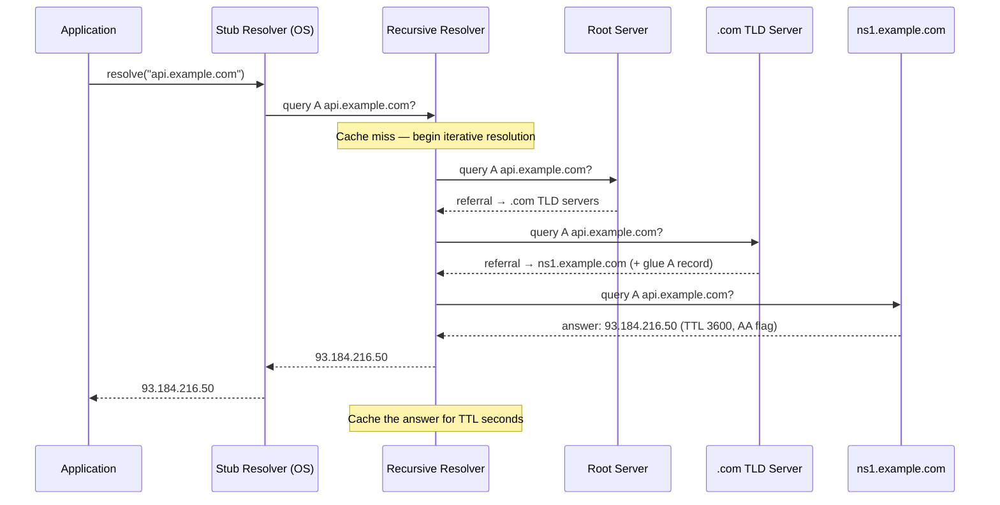

# DNS Internals — Resolution, Caching, and Record Types

**Date:** 2026-04-23 | **Updated:** 2026-04-23
**Tags:** `networking` `dns` `resolution` `caching` `records`

---

## Table of Contents

- [Summary](#summary)
- [DNS Hierarchy](#dns-hierarchy)
  - [Root Servers](#root-servers)
  - [Top-Level Domains (TLDs)](#top-level-domains-tlds)
  - [Authoritative Nameservers](#authoritative-nameservers)
  - [Zone Files and Delegation](#zone-files-and-delegation)
- [Recursive vs Iterative Resolution](#recursive-vs-iterative-resolution)
  - [Stub Resolver](#stub-resolver)
  - [Recursive Resolver](#recursive-resolver)
  - [Iterative Queries](#iterative-queries)
  - [Resolution Flow Diagram](#resolution-flow-diagram)
  - [Full Resolution Walkthrough](#full-resolution-walkthrough)
- [DNS Caching](#dns-caching)
  - [TTL Mechanics](#ttl-mechanics)
  - [Caching Hierarchy](#caching-hierarchy)
  - [Negative Caching](#negative-caching)
  - [Cache Poisoning and the Kaminsky Attack](#cache-poisoning-and-the-kaminsky-attack)
  - [DNSSEC Basics](#dnssec-basics)
- [Record Types](#record-types)
  - [Record Type Reference Table](#record-type-reference-table)
  - [Records in Detail](#records-in-detail)
- [DNS in Application Code](#dns-in-application-code)
  - [Node.js — dns.resolve vs dns.lookup](#nodejs--dnsresolve-vs-dnslookup)
  - [Java — InetAddress and JVM DNS Cache](#java--inetaddress-and-jvm-dns-cache)
  - [HTTP Client DNS Caching](#http-client-dns-caching)
- [DNS-over-HTTPS and DNS-over-TLS](#dns-over-https-and-dns-over-tls)
  - [Privacy Motivation](#privacy-motivation)
  - [How DoH Works (RFC 8484)](#how-doh-works-rfc-8484)
  - [How DoT Works (RFC 7858)](#how-dot-works-rfc-7858)
  - [Impact on Corporate Networks](#impact-on-corporate-networks)
- [DNS Load Balancing and Service Discovery](#dns-load-balancing-and-service-discovery)
  - [Round-Robin DNS](#round-robin-dns)
  - [Weighted DNS](#weighted-dns)
  - [SRV Records for Service Discovery](#srv-records-for-service-discovery)
  - [DNS in Kubernetes — CoreDNS](#dns-in-kubernetes--coredns)
- [Troubleshooting DNS](#troubleshooting-dns)
  - [dig](#dig)
  - [nslookup and host](#nslookup-and-host)
  - [Common DNS Issues](#common-dns-issues)
- [Related](#related)
- [References](#references)

---

## Summary

DNS is the internet's phonebook — it translates human-readable domain names into IP addresses before any TCP connection is established. For backend developers, DNS is not just infrastructure someone else configures. You encounter it when debugging slow cold starts, diagnosing connection failures after a deployment, understanding why your Java service holds stale IPs, or configuring service discovery in Kubernetes. This document covers the full DNS lifecycle: the hierarchical namespace, recursive vs iterative resolution, caching layers and TTL semantics, every record type you will encounter, platform-specific gotchas in Node.js and Java, encrypted DNS protocols, DNS-based load balancing, and the command-line tools to troubleshoot it all.

---

## DNS Hierarchy

DNS is a distributed, hierarchical database. No single server knows every domain. Instead, authority is delegated downward through a tree.

```
                    . (root)
                   / | \
              .com  .org  .io   ← TLDs
              /       |
         example   wikipedia
          /    \
       www    api              ← subdomains (authoritative zone)
```

### Root Servers

There are 13 logical root server clusters, labeled A through M (a.root-servers.net through m.root-servers.net). Each "server" is actually many physical machines spread worldwide via anycast routing — over 1,500 instances in total. Root servers do not know the IP of `api.example.com`. They know which servers are authoritative for `.com`, `.org`, `.io`, and every other TLD.

Root server addresses are hardcoded in every recursive resolver's configuration (the "root hints" file). This is the bootstrap anchor of the entire DNS system.

### Top-Level Domains (TLDs)

TLDs fall into categories:

| Category | Examples | Managed By |
|----------|----------|------------|
| Generic (gTLD) | `.com`, `.net`, `.org`, `.dev` | Various registries (Verisign for .com) |
| Country-code (ccTLD) | `.uk`, `.jp`, `.de` | National registries |
| Infrastructure | `.arpa` | IANA (reverse DNS, ENUM) |
| Sponsored | `.edu`, `.gov`, `.mil` | Designated organizations |

TLD nameservers know which authoritative nameservers are responsible for each second-level domain registered under them. For example, the `.com` TLD servers know that `example.com` is served by `ns1.example.com` and `ns2.example.com`.

### Authoritative Nameservers

The authoritative nameserver for a zone is the source of truth. When it answers a query, the response includes the **AA (Authoritative Answer)** flag. Every domain must have at least two authoritative nameservers for redundancy (RFC 1035 requirement).

Common authoritative DNS providers: Route 53 (AWS), Cloud DNS (GCP), Cloudflare DNS, NS1, Dyn.

### Zone Files and Delegation

A **zone** is a portion of the DNS namespace administered by a single entity. A zone file is a text file that maps names to records within that zone.

```dns
; Zone file for example.com
$TTL 3600
@       IN  SOA   ns1.example.com. admin.example.com. (
                   2024042301  ; serial
                   7200        ; refresh (2h)
                   3600        ; retry (1h)
                   1209600     ; expire (14 days)
                   300 )       ; negative TTL (5 min)

@       IN  NS    ns1.example.com.
@       IN  NS    ns2.example.com.

@       IN  A     93.184.216.34
www     IN  CNAME example.com.
api     IN  A     93.184.216.50
mail    IN  MX    10 mail.example.com.
mail    IN  A     93.184.216.60
```

**Delegation** creates the hierarchy. When the `.com` zone includes an `NS` record pointing `example.com` to its nameservers, that is delegation — the `.com` zone is saying "ask those servers, not me."

A **glue record** solves the circular dependency when the nameserver name is inside the zone it serves. If `ns1.example.com` is authoritative for `example.com`, the `.com` TLD must also include an A record for `ns1.example.com` — otherwise you would need to resolve `example.com` to find the server that resolves `example.com`.

---

## Recursive vs Iterative Resolution

### Stub Resolver

Your application does not query DNS directly. The operating system's **stub resolver** (configured via `/etc/resolv.conf` on Linux, system network settings on macOS/Windows) sends queries to a configured recursive resolver. The stub resolver is simple — it asks one server and expects a complete answer.

### Recursive Resolver

The recursive resolver (also called a caching resolver or full-service resolver) does the heavy lifting. When it receives a query it cannot answer from cache, it walks the DNS tree on behalf of the client. Common recursive resolvers:

- ISP resolvers (your default)
- Google Public DNS (`8.8.8.8`, `8.8.4.4`)
- Cloudflare DNS (`1.1.1.1`)
- Quad9 (`9.9.9.9`)
- Self-hosted: Unbound, BIND in recursive mode

### Iterative Queries

In iterative mode, each server the recursive resolver contacts either answers the question or returns a **referral** — the address of a more specific nameserver to ask next. The recursive resolver follows these referrals step by step.

### Resolution Flow Diagram



### Full Resolution Walkthrough

For a cold query to `api.example.com`:

1. **Application** calls `getaddrinfo()` (libc) or equivalent. The OS stub resolver fires a UDP query to the configured recursive resolver (typically port 53).
2. **Recursive resolver** checks its cache. Miss. It consults the root hints file and sends an iterative query to a root server.
3. **Root server** does not know `api.example.com` but knows who handles `.com`. Returns an NS referral plus glue records.
4. **Recursive resolver** queries the `.com` TLD server.
5. **TLD server** returns NS records for `example.com` (the domain's authoritative nameservers) plus glue A records.
6. **Recursive resolver** queries `ns1.example.com`.
7. **Authoritative server** returns the A record `93.184.216.50` with TTL 3600 and the AA flag set.
8. **Recursive resolver** caches the answer, all intermediate NS records, and their TTLs. Returns the answer to the stub resolver.
9. **Stub resolver** returns the IP to the application.

Total round trips for a fully cold query: **4 UDP exchanges** (stub→recursor, recursor→root, recursor→TLD, recursor→authoritative). In practice, the recursor almost always has root and TLD answers cached, so most queries require only 1-2 hops.

---

## DNS Caching

### TTL Mechanics

Every DNS record includes a **TTL (Time to Live)** in seconds. When a resolver caches a record, it decrements the TTL as time passes. Once TTL reaches zero, the cached entry is stale and must be re-fetched.

```
api.example.com.  3600  IN  A  93.184.216.50
                  ^^^^
                  TTL = 3600 seconds (1 hour)
```

TTL trade-offs:

| TTL | Pros | Cons |
|-----|------|------|
| Low (60-300s) | Fast propagation for IP changes, failover | More queries to authoritative servers |
| High (3600-86400s) | Reduced load, faster resolution from cache | Slow propagation of changes |

Common strategy: keep TTL at 300s (5 min) for production services, lower to 60s before a planned migration, then raise again after.

### Caching Hierarchy

DNS answers are cached at multiple layers, each closer to your application:

```
┌─────────────────────────────────────────────────┐
│ Application-level cache (JVM, undici, etc.)     │  ← closest to your code
├─────────────────────────────────────────────────┤
│ Browser DNS cache (Chrome: chrome://net-internals/#dns) │
├─────────────────────────────────────────────────┤
│ OS resolver cache (systemd-resolved, mDNSResponder)     │
├─────────────────────────────────────────────────┤
│ Recursive resolver cache (ISP / 1.1.1.1 / 8.8.8.8)    │
├─────────────────────────────────────────────────┤
│ Authoritative server (source of truth)                   │
└─────────────────────────────────────────────────┘
```

When debugging "why is my app hitting the old IP?", check every layer in this stack. The JVM cache (covered below) is a notorious source of stale entries.

### Negative Caching

When a domain does not exist, the authoritative server returns **NXDOMAIN**. This negative response is also cached, governed by the SOA record's minimum TTL field (the last number in the SOA record). RFC 2308 specifies negative caching behavior.

This matters when you deploy a new subdomain: if someone (or a health check) queried the name before you created it, the NXDOMAIN is cached for the negative TTL duration. Keep SOA minimum TTL reasonable (300s) to avoid long negative cache windows.

### Cache Poisoning and the Kaminsky Attack

DNS traditionally uses UDP with a 16-bit transaction ID. An attacker who can guess or brute-force the transaction ID can inject a forged response before the legitimate answer arrives, redirecting traffic to a malicious IP.

**The Kaminsky attack (2008)** exploited this by:

1. Querying the recursive resolver for a random, non-existent subdomain (e.g., `xyz123.example.com`).
2. Simultaneously flooding the resolver with forged responses pretending to be the authoritative server, each with a guessed transaction ID.
3. The forged response included a crafted **authority section** that delegated all of `example.com` to the attacker's nameserver.
4. If any forged packet matched the transaction ID, the resolver cached the malicious delegation — poisoning the entire domain.

**Mitigations:**

- **Source port randomization** (now standard): adds ~16 bits of entropy on top of the transaction ID, making brute-force impractical.
- **DNSSEC**: cryptographic proof that records are authentic (see below).
- **DNS cookies** (RFC 7873): lightweight authentication between resolver and authoritative server.

### DNSSEC Basics

DNSSEC adds cryptographic signatures to DNS records. It does not encrypt queries — it proves authenticity and integrity.

Key concepts:

| Component | Purpose |
|-----------|---------|
| **RRSIG** | Signature over a set of DNS records |
| **DNSKEY** | Public key used to verify RRSIG signatures |
| **DS** | Hash of a child zone's DNSKEY, stored in the parent zone — creates the chain of trust |
| **NSEC/NSEC3** | Authenticated denial of existence (proves a name does NOT exist) |

The chain of trust: Root zone → signs DS for `.com` → `.com` signs DS for `example.com` → `example.com` signs its own records with its DNSKEY.

DNSSEC adoption remains incomplete. Validating resolvers (like Cloudflare's 1.1.1.1) check signatures when available, but many domains remain unsigned.

---

## Record Types

### Record Type Reference Table

| Type | Purpose | Example | When Backend Devs Encounter It |
|------|---------|---------|-------------------------------|
| **A** | Maps name → IPv4 address | `api.example.com. 300 IN A 93.184.216.50` | Every HTTP request, `dig` output, load balancer configs |
| **AAAA** | Maps name → IPv6 address | `api.example.com. 300 IN AAAA 2606:2800:220:1::` | Dual-stack deployments, IPv6-only environments |
| **CNAME** | Alias to another name | `www.example.com. 3600 IN CNAME example.com.` | CDN setup (CNAME to CDN edge), cannot coexist with other records at zone apex |
| **MX** | Mail exchange server + priority | `example.com. 3600 IN MX 10 mail.example.com.` | Email delivery config, SPF/DKIM troubleshooting |
| **NS** | Delegates zone to nameservers | `example.com. 86400 IN NS ns1.example.com.` | Domain registration, DNS provider migration |
| **SOA** | Zone metadata (serial, refresh, TTL) | `example.com. IN SOA ns1.example.com. admin.example.com. ...` | Zone transfers, negative caching TTL |
| **SRV** | Service location with port + priority + weight | `_http._tcp.example.com. 300 IN SRV 10 60 8080 api1.example.com.` | Service discovery, gRPC, Consul, MongoDB replica sets |
| **TXT** | Arbitrary text data | `example.com. 3600 IN TXT "v=spf1 include:_spf.google.com ~all"` | SPF, DKIM, DMARC, domain verification (Google, AWS ACM, Let's Encrypt) |
| **PTR** | Reverse lookup: IP → name | `50.216.184.93.in-addr.arpa. 3600 IN PTR api.example.com.` | Email deliverability (reverse DNS check), network debugging |
| **CAA** | Certificate Authority Authorization | `example.com. 3600 IN CAA 0 issue "letsencrypt.org"` | Restricts which CAs can issue certs for your domain |

### Records in Detail

**CNAME restrictions:** A CNAME cannot coexist with any other record type at the same name. You cannot put a CNAME at the zone apex (`example.com`) because the apex already has SOA and NS records. This is why many DNS providers offer proprietary "ALIAS" or "ANAME" records that flatten the CNAME at query time.

**SRV record format:**

```
_service._protocol.name. TTL IN SRV priority weight port target
_http._tcp.api.example.com. 300 IN SRV 10 60 8080 api1.example.com.
_http._tcp.api.example.com. 300 IN SRV 10 40 8080 api2.example.com.
_http._tcp.api.example.com. 300 IN SRV 20 0  8080 api-backup.example.com.
```

- Lower **priority** is preferred (like MX).
- **Weight** distributes load within a priority level (60/40 split above).
- **Port** is explicit — no need for well-known port assumptions.

**TXT records for domain verification:** when you add a custom domain to AWS ACM, Google Workspace, or a SaaS provider, they ask you to add a TXT record like `_acme-challenge.example.com TXT "abc123"`. This proves domain ownership without transferring any DNS authority.

---

## DNS in Application Code

### Node.js — dns.resolve vs dns.lookup

Node.js has two DNS APIs that behave very differently:

```typescript
import dns from 'node:dns';
import { promisify } from 'node:util';

const resolve4 = promisify(dns.resolve4);
const lookup = promisify(dns.lookup);

// dns.resolve4 — uses c-ares library, async network I/O
// Makes a real DNS query, bypasses /etc/hosts, non-blocking
const addresses = await resolve4('api.example.com');
console.log(addresses); // ['93.184.216.50']

// dns.lookup — uses libuv thread pool, calls getaddrinfo()
// Respects /etc/hosts, OS resolver config, BUT blocks a thread pool thread
const result = await lookup('api.example.com');
console.log(result); // { address: '93.184.216.50', family: 4 }
```

**The libuv thread pool gotcha:**

`dns.lookup()` is what `http.get()`, `fetch()`, and every HTTP client in Node uses by default. It calls `getaddrinfo()`, which is a blocking syscall dispatched to the libuv thread pool (default size: 4 threads).

Under high concurrency, DNS lookups can **saturate the thread pool**, causing all I/O that uses the thread pool (DNS, `fs` operations) to queue up. Symptoms: mysterious latency spikes, timeouts that look like network issues but are actually thread pool starvation.

```typescript
// Increase the thread pool size for DNS-heavy services
// Set BEFORE requiring any modules
process.env.UV_THREADPOOL_SIZE = '16'; // max 1024

// Or better: use undici with its own DNS caching
import { Agent, setGlobalDispatcher } from 'undici';

const agent = new Agent({
  connect: {
    // undici can use c-ares directly, bypassing the thread pool
    lookup: dns.resolve4
  }
});
setGlobalDispatcher(agent);
```

### Java — InetAddress and JVM DNS Cache

```java
import java.net.InetAddress;

// Basic resolution — uses the JVM's built-in DNS cache
InetAddress address = InetAddress.getByName("api.example.com");
System.out.println(address.getHostAddress()); // 93.184.216.50

// Get all addresses (round-robin)
InetAddress[] addresses = InetAddress.getAllByName("api.example.com");
```

**The JVM DNS cache trap:**

The JVM caches DNS results independently of the OS. The default TTL depends on the security manager:

| Scenario | Default TTL |
|----------|-------------|
| SecurityManager present (e.g., applets, legacy) | **forever** (infinite cache) |
| No SecurityManager (typical modern apps) | **30 seconds** |

Control it via `java.security` properties:

```java
// In code (must be set before any DNS resolution)
java.security.Security.setProperty("networkaddress.cache.ttl", "60");
java.security.Security.setProperty("networkaddress.cache.negative.ttl", "10");

// Or in $JAVA_HOME/conf/security/java.security
// networkaddress.cache.ttl=60
// networkaddress.cache.negative.ttl=10

// Or via JVM args
// -Dsun.net.inetaddr.ttl=60
```

**In AWS/cloud environments** this is critical: when an ELB or RDS endpoint changes IPs (e.g., during failover), a long JVM DNS cache means your service keeps connecting to a dead IP. AWS explicitly recommends setting `networkaddress.cache.ttl=60`.

Spring Boot / Spring Cloud applications using service discovery (Eureka, Consul) bypass DNS for service-to-service calls, but external calls (databases, third-party APIs) still go through `InetAddress`.

### HTTP Client DNS Caching

Many HTTP clients add their own caching layer on top of the OS resolver:

| Client | DNS Behavior |
|--------|-------------|
| **Node.js `http`/`https`** | No DNS cache — calls `dns.lookup()` per connection |
| **undici (Node.js)** | Connection pooling effectively caches resolved IPs for the pool lifetime |
| **OkHttp (Java/Kotlin)** | Uses JVM DNS cache, respects `Dns` interface for custom resolution |
| **Apache HttpClient** | Uses JVM cache, configurable `DnsResolver` |
| **curl (libcurl)** | Caches DNS for the lifetime of the easy handle, or configurable `CURLOPT_DNS_CACHE_TIMEOUT` |

Be aware that connection pools hold open connections to resolved IPs. Even if DNS changes, existing pooled connections continue using the old IP until they are recycled. Set appropriate pool idle timeouts and max connection lifetimes.

---

## DNS-over-HTTPS and DNS-over-TLS

### Privacy Motivation

Traditional DNS queries are sent in **plaintext UDP on port 53**. Anyone on the network path — ISPs, coffee shop Wi-Fi operators, nation-state surveillance — can see every domain you resolve. Even with TLS-encrypted HTTPS, DNS reveals the sites you visit.

Two encrypted DNS protocols address this:

### How DoH Works (RFC 8484)

DNS-over-HTTPS wraps DNS queries inside standard HTTPS requests to a well-known endpoint:

```
GET https://cloudflare-dns.com/dns-query?dns=AAABAAABAAA...
Accept: application/dns-message

# Or POST with binary DNS message body
POST https://cloudflare-dns.com/dns-query
Content-Type: application/dns-message
```

Key characteristics:
- Uses port **443** — indistinguishable from normal HTTPS traffic
- Leverages HTTP/2 or HTTP/3 multiplexing
- Supported by browsers (Firefox, Chrome), OS resolvers (Windows 11, macOS), and stub resolvers (stubby, dnscrypt-proxy)
- The DNS wire format (RFC 1035 binary) is base64url-encoded in GET requests or sent as binary in POST requests

### How DoT Works (RFC 7858)

DNS-over-TLS wraps the DNS wire protocol in a TLS connection on a dedicated port:

- Uses port **853** (distinct from 443)
- Easier to detect and block at the network level compared to DoH
- Supported by Android 9+ ("Private DNS" setting), systemd-resolved, Unbound, Knot Resolver

### Impact on Corporate Networks

Both DoH and DoT break traditional corporate DNS-based filtering and monitoring. If a browser uses DoH to bypass the corporate resolver:

- Content filtering policies are bypassed
- Threat intelligence DNS feeds cannot see the queries
- Split-horizon DNS (internal vs external) breaks for that client

Enterprise response: many organizations deploy canary domains or use Encrypted Client Hello (ECH) blocking. Some DNS providers offer enterprise DoH endpoints with policy enforcement.

---

## DNS Load Balancing and Service Discovery

### Round-Robin DNS

The simplest DNS load balancing: return multiple A records. Clients (usually) try them in the order received, and the authoritative server rotates the order.

```dns
api.example.com.  60  IN  A  10.0.1.10
api.example.com.  60  IN  A  10.0.1.11
api.example.com.  60  IN  A  10.0.1.12
```

Limitations:
- No health checking — if a server dies, its record stays until manually removed or TTL-based updates
- Uneven distribution — clients cache the first IP they receive
- No session affinity

### Weighted DNS

Services like Route 53 support **weighted routing policies** that return different answers in proportion to configured weights:

```
api.example.com → 70% traffic to us-east-1, 30% to eu-west-1
```

This enables gradual traffic shifting during deployments (canary via DNS), geographic distribution, and A/B testing at the DNS level.

### SRV Records for Service Discovery

SRV records encode the full addressing tuple (host + port + priority + weight), making them ideal for service discovery:

```bash
# Client discovers all instances of the "grpc" service
dig _grpc._tcp.myservice.example.com SRV

# Returns:
# _grpc._tcp.myservice.example.com. 30 IN SRV 10 50 50051 node1.example.com.
# _grpc._tcp.myservice.example.com. 30 IN SRV 10 30 50051 node2.example.com.
# _grpc._tcp.myservice.example.com. 30 IN SRV 10 20 50051 node3.example.com.
```

Used by: MongoDB replica set discovery, XMPP, SIP, Consul DNS interface, gRPC name resolution.

### DNS in Kubernetes — CoreDNS

Kubernetes uses **CoreDNS** as the cluster DNS provider. Every pod gets `/etc/resolv.conf` pointing to the CoreDNS service (typically `10.96.0.10`).

Naming convention:

```
<service>.<namespace>.svc.cluster.local
```

```bash
# From within a pod:
dig myapi.production.svc.cluster.local

# Headless services (clusterIP: None) return individual pod IPs
dig myapi-headless.production.svc.cluster.local
# Returns A records for each pod backing the service
```

CoreDNS plugins handle:
- **kubernetes**: resolves service and pod names
- **forward**: forwards external queries to upstream resolvers
- **cache**: caches responses (default 30s)
- **loop**: detects and breaks resolution loops

**ndots gotcha:** Kubernetes sets `ndots:5` in pod resolv.conf by default. This means any name with fewer than 5 dots is first tried with search domain suffixes appended. A query for `api.example.com` (2 dots < 5) triggers searches for `api.example.com.production.svc.cluster.local`, `api.example.com.svc.cluster.local`, `api.example.com.cluster.local`, then finally `api.example.com.` — that is 4 wasted queries before the real one. For external domains, use a trailing dot (`api.example.com.`) or reduce `ndots`.

---

## Troubleshooting DNS

### dig

`dig` is the primary DNS troubleshooting tool. It shows the full DNS response including flags, answer, authority, and additional sections.

```bash
# Basic query
dig api.example.com

# Query a specific record type
dig api.example.com AAAA
dig example.com MX
dig example.com TXT
dig _grpc._tcp.myservice.example.com SRV

# Query a specific nameserver
dig @8.8.8.8 api.example.com

# Trace the full resolution path (iterative from root)
dig +trace api.example.com

# Short answer only
dig +short api.example.com

# Show only the answer section with TTL
dig +noall +answer api.example.com

# Check DNSSEC signatures
dig +dnssec example.com

# Reverse lookup
dig -x 93.184.216.50

# Check SOA (useful for negative caching TTL)
dig example.com SOA
```

Reading `dig` output:

```
;; ->>HEADER<<- opcode: QUERY, status: NOERROR, id: 54321
;; flags: qr rd ra; QUERY: 1, ANSWER: 1, AUTHORITY: 0, ADDITIONAL: 1
;;          ^^       ← qr=response, rd=recursion desired, ra=recursion available
;;                     AA flag here would mean authoritative answer

;; ANSWER SECTION:
api.example.com.    3600    IN    A    93.184.216.50
;;                  ^^^^
;;                  TTL remaining (decrements in cache)

;; Query time: 23 msec
;; SERVER: 1.1.1.1#53(1.1.1.1)
```

### nslookup and host

```bash
# nslookup — interactive or one-shot
nslookup api.example.com
nslookup -type=MX example.com
nslookup api.example.com 8.8.8.8   # query specific server

# host — concise output
host api.example.com
host -t MX example.com
host -t SRV _grpc._tcp.myservice.example.com
```

### Common DNS Issues

| Symptom | Likely Cause | Diagnosis |
|---------|-------------|-----------|
| **NXDOMAIN** | Domain does not exist (typo, not propagated, expired) | `dig +trace` to find where the chain breaks |
| **SERVFAIL** | Authoritative server unreachable or DNSSEC validation failure | `dig +trace +dnssec`, check NS records are correct |
| **Slow resolution** | Thread pool exhaustion (Node.js), all cache layers cold, distant resolver | Check `dig` query time, Node.js `UV_THREADPOOL_SIZE` |
| **Stale IP after migration** | Cached record has not expired | Check TTL with `dig +noall +answer`, flush OS cache (`sudo dscacheutil -flushcache` on macOS, `resolvectl flush-caches` on systemd) |
| **Works on machine A, not B** | Different resolvers, different cache state, `/etc/hosts` override | Compare `dig @resolver` output on both, check `/etc/hosts` |
| **Intermittent failures** | Round-robin returning a dead server, UDP packet loss | `dig +short` multiple times to see all IPs, health check each |
| **Java app connects to old IP** | JVM DNS cache TTL too long | Set `networkaddress.cache.ttl=60`, restart the JVM |
| **K8s pod can't resolve external names** | `ndots:5` causing search domain churn, CoreDNS misconfiguration | `dig +search` from pod, check CoreDNS logs |

Flush caches by layer:

```bash
# macOS DNS cache
sudo dscacheutil -flushcache && sudo killall -HUP mDNSResponder

# Linux systemd-resolved
resolvectl flush-caches

# Chrome browser cache
# Navigate to: chrome://net-internals/#dns → Clear host cache

# JVM — requires restart or programmatic cache clear
# No runtime flush API; restart the process
```

---

## Related

- [HTTP/1.1 → HTTP/2 → HTTP/3 — The Evolution of Web Transport](http-evolution.md) — DNS resolution is the first step before any HTTP connection
- [TLS/SSL Handshake & Certificates](tls-and-certificates.md) — DNSSEC validates records; TLS validates the server after DNS resolution
- [IP Addressing & Subnetting](../fundamentals/ip-addressing-and-subnetting.md) — DNS maps names to the IP addresses covered in depth there
- [Connection Pooling & Keep-Alive](../network-programming/connection-pooling.md) — pooled connections can outlive DNS TTL, causing stale IP issues
- [Container Networking — Docker, Kubernetes CNI](../advanced/container-networking.md) — CoreDNS and cluster DNS resolution

---

## References

1. **RFC 1035 — Domain Names: Implementation and Specification** (Mockapetris, 1987)
   https://datatracker.ietf.org/doc/html/rfc1035

2. **RFC 8484 — DNS Queries over HTTPS (DoH)** (Hoffman & McManus, 2018)
   https://datatracker.ietf.org/doc/html/rfc8484

3. **RFC 7858 — DNS over Transport Layer Security (DoT)** (Hu et al., 2016)
   https://datatracker.ietf.org/doc/html/rfc7858

4. **RFC 4033/4034/4035 — DNS Security Introduction and Requirements (DNSSEC)** (Arends et al., 2005)
   https://datatracker.ietf.org/doc/html/rfc4033

5. **RFC 2308 — Negative Caching of DNS Queries** (Andrews, 1998)
   https://datatracker.ietf.org/doc/html/rfc2308

6. **RFC 2782 — A DNS RR for Specifying the Location of Services (SRV)** (Gulbrandsen et al., 2000)
   https://datatracker.ietf.org/doc/html/rfc2782

7. **Node.js DNS Module Documentation**
   https://nodejs.org/api/dns.html

8. **Kubernetes DNS for Services and Pods**
   https://kubernetes.io/docs/concepts/services-networking/dns-pod-service/
