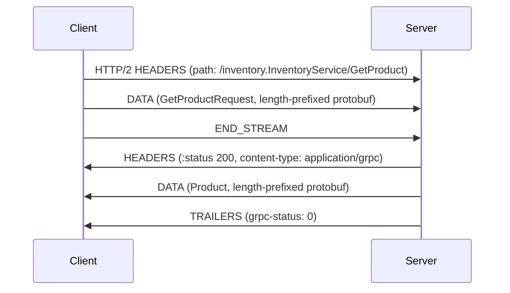
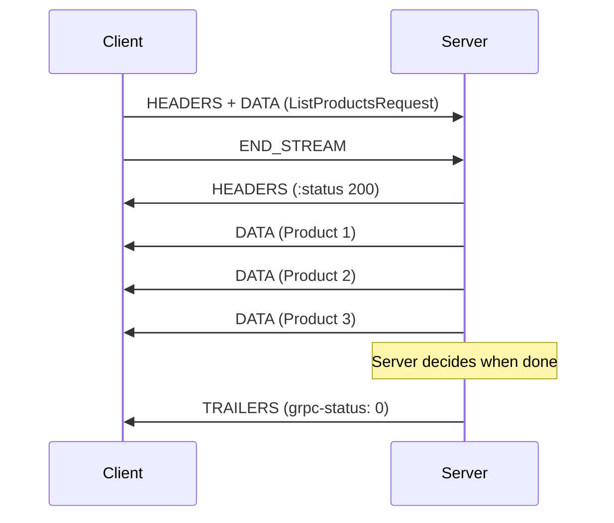
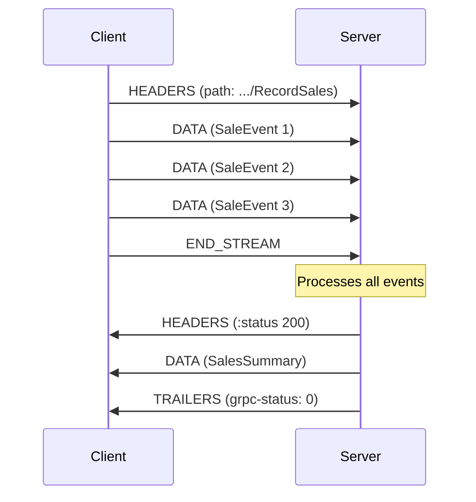
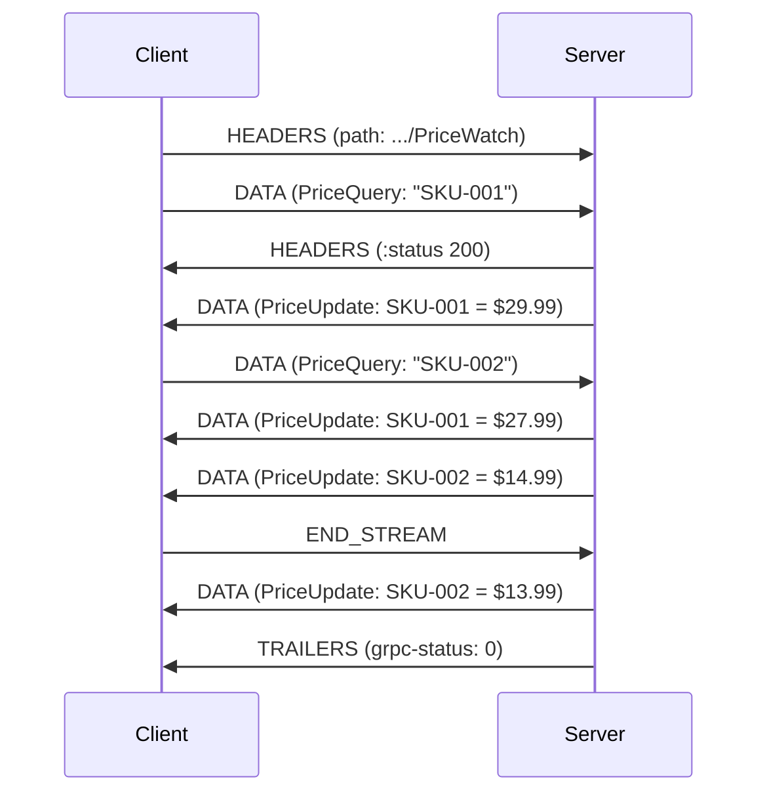
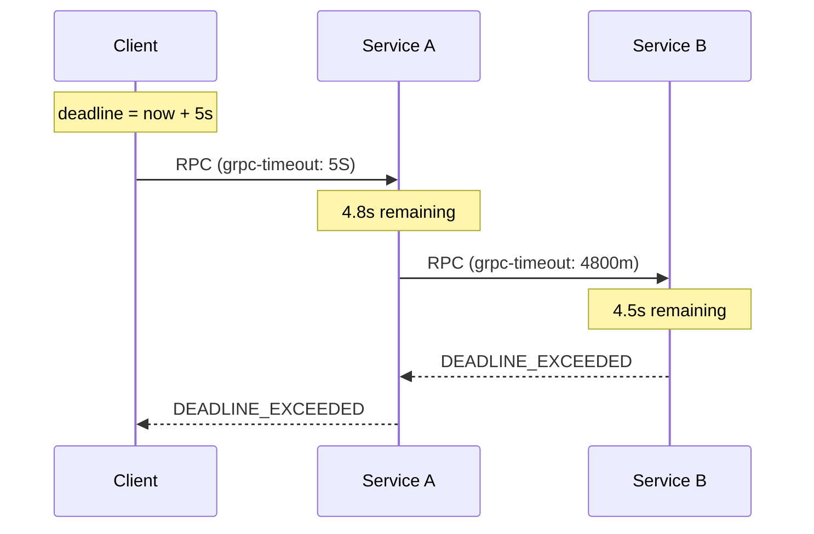

# gRPC & Protocol Buffers — High-Performance RPC

**Date:** 2026-04-23 | **Updated:** 2026-04-23
**Tags:** `networking` `grpc` `protobuf` `rpc` `http2`

---

## Table of Contents

- [Summary](#summary)
- [1. What is gRPC](#1-what-is-grpc)
  - [1.1 Origins and Philosophy](#11-origins-and-philosophy)
  - [1.2 Core Architecture](#12-core-architecture)
  - [1.3 Positioning: gRPC vs REST vs GraphQL](#13-positioning-grpc-vs-rest-vs-graphql)
- [2. Protocol Buffers](#2-protocol-buffers)
  - [2.1 Proto File Syntax (proto3)](#21-proto-file-syntax-proto3)
  - [2.2 Scalar Types](#22-scalar-types)
  - [2.3 Enums, Nested Messages, Oneof, Maps](#23-enums-nested-messages-oneof-maps)
  - [2.4 Field Numbering and Wire Format](#24-field-numbering-and-wire-format)
  - [2.5 Backward and Forward Compatibility](#25-backward-and-forward-compatibility)
- [3. gRPC Service Definition](#3-grpc-service-definition)
  - [3.1 Service and RPC in .proto](#31-service-and-rpc-in-proto)
  - [3.2 Code Generation (protoc)](#32-code-generation-protoc)
  - [3.3 Generated Stubs and Server Interfaces](#33-generated-stubs-and-server-interfaces)
- [4. Four Communication Patterns](#4-four-communication-patterns)
  - [4.1 Unary RPC](#41-unary-rpc)
  - [4.2 Server Streaming RPC](#42-server-streaming-rpc)
  - [4.3 Client Streaming RPC](#43-client-streaming-rpc)
  - [4.4 Bidirectional Streaming RPC](#44-bidirectional-streaming-rpc)
- [5. gRPC Internals](#5-grpc-internals)
  - [5.1 HTTP/2 Framing](#51-http2-framing)
  - [5.2 Trailers for Status](#52-trailers-for-status)
  - [5.3 Metadata (Headers)](#53-metadata-headers)
  - [5.4 Binary Encoding Efficiency](#54-binary-encoding-efficiency)
  - [5.5 Compression and Message Framing](#55-compression-and-message-framing)
- [6. Deadlines and Cancellation](#6-deadlines-and-cancellation)
  - [6.1 Deadline Propagation](#61-deadline-propagation)
  - [6.2 Cancellation Signals](#62-cancellation-signals)
  - [6.3 Why This Beats HTTP Timeouts](#63-why-this-beats-http-timeouts)
- [7. Error Handling](#7-error-handling)
  - [7.1 gRPC Status Codes](#71-grpc-status-codes)
  - [7.2 Rich Error Details](#72-rich-error-details)
  - [7.3 Mapping to HTTP Status Codes](#73-mapping-to-http-status-codes)
- [8. gRPC in Node.js](#8-grpc-in-nodejs)
  - [8.1 @grpc/grpc-js and Tooling](#81-grpcgrpc-js-and-tooling)
  - [8.2 Static vs Dynamic Codegen](#82-static-vs-dynamic-codegen)
  - [8.3 ts-proto for TypeScript](#83-ts-proto-for-typescript)
  - [8.4 Server Example (Node.js)](#84-server-example-nodejs)
  - [8.5 Client Example (Node.js)](#85-client-example-nodejs)
- [9. gRPC in Java/Spring](#9-grpc-in-javaspring)
  - [9.1 grpc-java](#91-grpc-java)
  - [9.2 Spring Boot Integration](#92-spring-boot-integration)
  - [9.3 Interceptors](#93-interceptors)
  - [9.4 Health Checking](#94-health-checking)
- [10. gRPC vs REST vs GraphQL](#10-grpc-vs-rest-vs-graphql)
- [11. gRPC-Web and Connect](#11-grpc-web-and-connect)
  - [11.1 Browser Limitations](#111-browser-limitations)
  - [11.2 grpc-web Proxy](#112-grpc-web-proxy)
  - [11.3 Connect Protocol (Buf)](#113-connect-protocol-buf)
  - [11.4 gRPC Gateway for REST Transcoding](#114-grpc-gateway-for-rest-transcoding)
- [12. Production Concerns](#12-production-concerns)
  - [12.1 Load Balancing](#121-load-balancing)
  - [12.2 Service Mesh Integration](#122-service-mesh-integration)
  - [12.3 Reflection API](#123-reflection-api)
  - [12.4 Health Checking Protocol](#124-health-checking-protocol)
  - [12.5 Observability](#125-observability)
- [Related](#related)
- [References](#references)

---

## Summary

gRPC is Google's open-source RPC framework built on HTTP/2 and Protocol Buffers. It provides contract-first API design with strongly-typed schemas, efficient binary serialization, four streaming patterns (unary, server-streaming, client-streaming, bidirectional), built-in deadline propagation, and code generation for 10+ languages. gRPC dominates inter-service communication in microservices architectures where low latency, type safety, and streaming matter more than browser compatibility. This doc covers the protocol from proto schema design through production deployment, with practical examples for Node.js/TypeScript and Java/Spring Boot.

---

## 1. What is gRPC

### 1.1 Origins and Philosophy

gRPC (gRPC Remote Procedure Calls) evolved from Google's internal **Stubby** RPC system, which has handled billions of RPCs per second across Google's infrastructure since the early 2000s. Open-sourced in 2015, gRPC brings that same philosophy to the public:

- **Contract-first** — define your API in a `.proto` file; implementations are generated
- **Language-neutral** — one proto file generates clients and servers in C++, Java, Go, Python, Node.js, C#, Ruby, and more
- **HTTP/2 native** — multiplexed streams, header compression, bidirectional communication
- **Binary serialization** — Protocol Buffers encode data 3-10x smaller than JSON, with faster serialization/deserialization

### 1.2 Core Architecture

```
┌───────────────────────────────────────────────────────┐
│                   .proto file                         │
│    (shared contract: messages + service definition)   │
└──────────────────────┬────────────────────────────────┘
                       │ protoc (compiler)
            ┌──────────┴──────────┐
            ▼                     ▼
   ┌─────────────────┐   ┌─────────────────┐
   │  Generated       │   │  Generated       │
   │  Server Stubs    │   │  Client Stubs    │
   │  (implement me)  │   │  (call me)       │
   └────────┬─────────┘   └────────┬─────────┘
            │                      │
            ▼                      ▼
   ┌─────────────────┐   ┌─────────────────┐
   │  gRPC Server     │◄──│  gRPC Client     │
   │  (HTTP/2)        │──►│  (HTTP/2)        │
   └─────────────────┘   └─────────────────┘
         ▲                      ▲
         └──── Protobuf Binary ─┘
              over HTTP/2 frames
```

The workflow: define once in `.proto` → generate typed code for each language → implement server logic → call from client with full type safety.

### 1.3 Positioning: gRPC vs REST vs GraphQL

| Aspect | REST | GraphQL | gRPC |
|--------|------|---------|------|
| Primary use | Public APIs, web | Flexible client queries | Service-to-service |
| Transport | HTTP/1.1 or 2 | HTTP (usually 1.1) | HTTP/2 (required) |
| Serialization | JSON (text) | JSON (text) | Protobuf (binary) |
| Schema | OpenAPI (optional) | SDL (required) | .proto (required) |
| Streaming | SSE, WebSocket | Subscriptions (varied) | Native 4 patterns |
| Browser native | Yes | Yes | No (needs proxy) |

---

## 2. Protocol Buffers

Protocol Buffers (protobuf) is Google's language-neutral, platform-neutral mechanism for serializing structured data. It is gRPC's default serialization format (though gRPC can technically use JSON).

### 2.1 Proto File Syntax (proto3)

```protobuf
syntax = "proto3";

package ecommerce.inventory;

option java_package = "com.example.inventory";
option java_multiple_files = true;

import "google/protobuf/timestamp.proto";

// A product in the inventory system
message Product {
  string id = 1;
  string name = 2;
  string description = 3;
  int32 price_cents = 4;              // price in cents to avoid float
  Category category = 5;
  repeated string tags = 6;           // list of strings
  google.protobuf.Timestamp created_at = 7;
  map<string, string> metadata = 8;   // arbitrary key-value pairs
  
  oneof promotion {
    PercentDiscount percent_off = 9;
    FixedDiscount amount_off = 10;
  }
}

enum Category {
  CATEGORY_UNSPECIFIED = 0;   // proto3 requires 0 as default
  ELECTRONICS = 1;
  CLOTHING = 2;
  BOOKS = 3;
}

message PercentDiscount {
  int32 percent = 1;          // 0-100
}

message FixedDiscount {
  int32 amount_cents = 1;
}
```

Key syntax rules in proto3:
- First enum value **must** be 0 (the default)
- All fields are optional by default (no `required` keyword in proto3)
- `repeated` = list/array
- `map<K, V>` = dictionary (K must be integral or string)
- `oneof` = exactly one of the listed fields can be set
- `import` pulls in other `.proto` files

### 2.2 Scalar Types

| Proto Type | Java | TypeScript | Wire Bytes | Notes |
|------------|------|------------|------------|-------|
| `double` | `double` | `number` | 8 | IEEE 754 |
| `float` | `float` | `number` | 4 | IEEE 754 |
| `int32` | `int` | `number` | 1-5 (varint) | Negative numbers use 10 bytes |
| `int64` | `long` | `bigint` / `string` | 1-10 (varint) | JS loses precision beyond 2^53 |
| `uint32` | `int` | `number` | 1-5 (varint) | Unsigned |
| `sint32` | `int` | `number` | 1-5 (varint) | ZigZag encoding, efficient for negatives |
| `bool` | `boolean` | `boolean` | 1 | |
| `string` | `String` | `string` | UTF-8 length + data | |
| `bytes` | `ByteString` | `Uint8Array` | length + data | Raw binary |

**Key insight:** Use `sint32`/`sint64` when values are frequently negative. Regular `int32` uses two's complement which wastes 10 bytes for negative numbers.

### 2.3 Enums, Nested Messages, Oneof, Maps

```protobuf
message Order {
  string order_id = 1;
  
  // Nested message — scoped to Order
  message LineItem {
    string product_id = 1;
    int32 quantity = 2;
    int32 unit_price_cents = 3;
  }
  
  repeated LineItem items = 2;
  
  // Enum
  enum Status {
    STATUS_UNSPECIFIED = 0;
    PENDING = 1;
    CONFIRMED = 2;
    SHIPPED = 3;
    DELIVERED = 4;
    CANCELLED = 5;
  }
  Status status = 3;
  
  // Oneof — payment details: exactly one set
  oneof payment {
    CreditCard credit_card = 4;
    BankTransfer bank_transfer = 5;
    WalletPayment wallet = 6;
  }
  
  // Map — address labels to addresses
  map<string, Address> addresses = 7;  // e.g., "shipping" -> Address
}
```

**Oneof rules:**
- Setting one field clears the others in the same oneof group
- You can check which field is set using the `case` accessor
- Cannot use `repeated` inside a oneof
- Useful for polymorphism without inheritance

### 2.4 Field Numbering and Wire Format

Every field has a unique **field number** that identifies it on the wire. This is the key to protobuf's efficiency and compatibility:

```
Wire type encoding: (field_number << 3) | wire_type

Wire types:
  0 = Varint      (int32, int64, uint32, bool, enum)
  1 = 64-bit      (fixed64, double)
  2 = Length-delim (string, bytes, embedded messages, repeated)
  5 = 32-bit      (fixed32, float)
```

**Field number rules:**
- Numbers 1-15 encode in **1 byte** (use for frequently populated fields)
- Numbers 16-2047 encode in **2 bytes**
- Range: 1 to 2^29 - 1 (536,870,911)
- **Reserved range**: 19000-19999 (used internally by protobuf)
- **Never reuse** a field number after removing it — reserve it instead

```protobuf
message User {
  reserved 4, 8;                   // field numbers never to reuse
  reserved "phone_number", "fax";  // field names (documentation)
  
  string id = 1;        // 1 byte tag — always populated
  string email = 2;     // 1 byte tag — always populated
  string name = 3;      // 1 byte tag — always populated
  // field 4 was phone_number, now removed
  Address address = 16; // 2 byte tag — rarely populated, fine
}
```

**Default values in proto3:** zero/empty for all types. A field set to its default value is **not serialized** (saves bytes).

### 2.5 Backward and Forward Compatibility

The golden rules for evolving protobuf schemas without breaking existing clients:

| Safe | Unsafe |
|------|--------|
| Add new fields (new numbers) | Change a field's type |
| Remove fields (reserve the number) | Change a field's number |
| Rename fields (wire uses numbers) | Change `repeated` to scalar or vice versa |
| Add new enum values | Remove the 0 enum value |
| Add new `oneof` members | Move fields into/out of `oneof` |

**Forward compatibility** — old code ignores unknown field numbers (they are preserved in serialization round-trips in most implementations).

**Backward compatibility** — new code sees default values for missing fields.

---

## 3. gRPC Service Definition

### 3.1 Service and RPC in .proto

```protobuf
syntax = "proto3";

package inventory;

service InventoryService {
  // Unary — one request, one response
  rpc GetProduct(GetProductRequest) returns (Product);
  
  // Server streaming — one request, stream of responses
  rpc ListProducts(ListProductsRequest) returns (stream Product);
  
  // Client streaming — stream of requests, one response
  rpc RecordSales(stream SaleEvent) returns (SalesSummary);
  
  // Bidirectional streaming — stream both ways
  rpc PriceWatch(stream PriceQuery) returns (stream PriceUpdate);
}

message GetProductRequest {
  string product_id = 1;
}

message ListProductsRequest {
  string category = 1;
  int32 page_size = 2;
  string page_token = 3;
}

message SaleEvent {
  string product_id = 1;
  int32 quantity = 2;
  google.protobuf.Timestamp sold_at = 3;
}

message SalesSummary {
  int32 total_items = 1;
  int64 total_revenue_cents = 2;
}

message PriceQuery {
  string product_id = 1;
}

message PriceUpdate {
  string product_id = 1;
  int32 new_price_cents = 2;
  google.protobuf.Timestamp updated_at = 3;
}
```

### 3.2 Code Generation (protoc)

```bash
# Install protoc compiler + language-specific plugins

# For Node.js/TypeScript (using ts-proto):
protoc \
  --plugin=protoc-gen-ts_proto=./node_modules/.bin/protoc-gen-ts_proto \
  --ts_proto_out=./src/generated \
  --ts_proto_opt=outputServices=grpc-js \
  --ts_proto_opt=esModuleInterop=true \
  -I./proto \
  ./proto/inventory.proto

# For Java (using protobuf-gradle-plugin):
# build.gradle.kts handles this — see Section 9

# Using Buf (modern alternative to raw protoc):
buf generate
```

**Buf** (from the Connect team) replaces raw `protoc` with a more ergonomic CLI, linting, breaking-change detection, and a schema registry. Increasingly the standard toolchain choice.

### 3.3 Generated Stubs and Server Interfaces

What `protoc` produces per language:

- **Message classes** — typed constructors, getters, serialization/deserialization
- **Server interface/abstract class** — you implement the RPC methods
- **Client stub** — call RPCs as if they were local methods
- **Service descriptor** — metadata for reflection, middleware

The generated code handles:
- Serializing request → protobuf bytes
- Framing bytes into HTTP/2 DATA frames
- Deserializing response bytes → typed object
- Stream lifecycle management

---

## 4. Four Communication Patterns

### 4.1 Unary RPC

The simplest pattern: one request, one response. Analogous to a regular HTTP request.

```protobuf
rpc GetProduct(GetProductRequest) returns (Product);
```



**When to use:** CRUD operations, simple queries, any request-response pattern.

### 4.2 Server Streaming RPC

Client sends one request; server responds with a stream of messages. The server decides when the stream ends.

```protobuf
rpc ListProducts(ListProductsRequest) returns (stream Product);
```



**When to use:** Fetching large result sets, real-time feeds (stock prices, log tailing), downloading chunked data.

### 4.3 Client Streaming RPC

Client sends a stream of messages; server responds with a single message after processing all of them.

```protobuf
rpc RecordSales(stream SaleEvent) returns (SalesSummary);
```



**When to use:** File uploads, batch data ingestion, aggregation where the client sends many items and expects one summary.

### 4.4 Bidirectional Streaming RPC

Both client and server send streams of messages independently. The two streams operate independently — the server does not have to wait for the client to finish.

```protobuf
rpc PriceWatch(stream PriceQuery) returns (stream PriceUpdate);
```



**When to use:** Chat applications, collaborative editing, interactive queries, real-time gaming, any scenario where both sides independently produce data.

---

## 5. gRPC Internals

### 5.1 HTTP/2 Framing

Every gRPC call maps to a single HTTP/2 **stream**. Multiple concurrent RPCs share one TCP connection via multiplexing.

```
HTTP/2 Connection (single TCP socket)
├── Stream 1: GetProduct RPC
│   ├── HEADERS frame → :method POST, :path /pkg.Service/Method
│   ├── DATA frame    → length-prefixed protobuf request
│   └── TRAILERS      → grpc-status + grpc-message
├── Stream 3: ListProducts RPC (server streaming)
│   ├── HEADERS frame
│   ├── DATA frame (message 1)
│   ├── DATA frame (message 2)
│   └── TRAILERS
└── Stream 5: PriceWatch RPC (bidi streaming)
    ├── DATA frames (both directions, interleaved)
    └── TRAILERS
```

Key HTTP/2 features gRPC leverages:
- **Multiplexing** — no head-of-line blocking at the HTTP layer
- **Flow control** — per-stream and per-connection window sizes
- **HPACK compression** — headers are compressed with a shared dynamic table
- **Binary framing** — no text parsing overhead

### 5.2 Trailers for Status

Unlike REST (which uses the HTTP status code), gRPC always returns `HTTP 200` and puts the actual result status in **HTTP/2 trailers**:

```
TRAILERS frame:
  grpc-status: 0          # 0 = OK, see Section 7
  grpc-message: ""        # human-readable error (optional, percent-encoded)
  grpc-status-details-bin: <base64-encoded google.rpc.Status>  # rich errors
```

**Why trailers?** In a streaming response, the server does not know the final status when it sends the initial HEADERS. Trailers come after all DATA frames, which is the only place the status is known.

### 5.3 Metadata (Headers)

gRPC metadata is equivalent to HTTP headers. Custom metadata is sent as:
- **Text metadata:** `key: value` (header name must not start with `grpc-`)
- **Binary metadata:** `key-bin: <base64-value>` (the `-bin` suffix triggers base64 encoding)

Common metadata patterns:
- Authentication: `authorization: Bearer <token>`
- Tracing: `x-request-id`, `traceparent` (W3C trace context)
- Deadline: `grpc-timeout: 5S` (5 seconds)

Metadata can be sent in initial headers (request or response) and in trailers (response only).

### 5.4 Binary Encoding Efficiency

A JSON payload vs protobuf for the same data:

```json
{"id":"abc-123","name":"Widget","priceCents":2999,"tags":["sale","new"]}
```
**JSON: ~72 bytes** (plus HTTP headers, text parsing)

```
Protobuf (hex): 0a07 6162 632d 3132 3312 0657 6964 6765
                7418 d717 2a04 7361 6c65 2a03 6e65 77
```
**Protobuf: ~35 bytes** (plus 5-byte gRPC frame header)

The savings compound:
- **Smaller payloads** — 2-10x depending on data shape
- **No parsing** — binary decode is O(1) per field (no tokenizer)
- **Schema-driven** — no field names on the wire (just numbers)

### 5.5 Compression and Message Framing

Each gRPC message is wrapped in a **5-byte frame header** before being sent as HTTP/2 DATA:

```
┌──────────────────────────────────────┐
│ Compressed? │  Message Length (4B)   │  Message Bytes ...
│   (1 byte)  │  (big-endian uint32)   │
└──────────────────────────────────────┘
     0 or 1        up to 4 GB
```

- Compression algorithm negotiated via `grpc-encoding` header (typically `gzip` or `identity`)
- Default max message size: **4 MB** (configurable per channel/server)
- Large messages should be streamed rather than sent as single payloads

---

## 6. Deadlines and Cancellation

### 6.1 Deadline Propagation

A **deadline** is an absolute point in time by which an RPC must complete. Unlike timeouts (relative durations), deadlines propagate across service hops:

```
Client sets deadline: now + 5s
  → Service A receives, sees 4.8s remaining
    → Service A calls Service B with 4.8s deadline
      → Service B receives, sees 4.5s remaining
        → If deadline passes → all services abort
```



The `grpc-timeout` header uses a compact format: `{value}{unit}` where unit is `H` (hours), `M` (minutes), `S` (seconds), `m` (milliseconds), `u` (microseconds), `n` (nanoseconds).

### 6.2 Cancellation Signals

When a client cancels an RPC (or a deadline expires):
1. Client sends HTTP/2 **RST_STREAM** frame
2. Server receives cancellation notification via its language's context/cancellation mechanism
3. Server should stop work immediately — no point processing a request nobody wants

In Node.js, the `call.cancelled` property becomes `true`. In Java, the `Context` is cancelled.

### 6.3 Why This Beats HTTP Timeouts

| REST/HTTP Timeout | gRPC Deadline |
|-------------------|---------------|
| Per-hop only | Propagates across hops |
| Client sets, server unaware | Server sees remaining budget |
| No standard cancellation | RST_STREAM cancels immediately |
| Wasted work on timeout | Server stops work on cancel |
| No retry budget awareness | Deadline shared with retries |

With REST, Service A might time out waiting for Service B, but Service B keeps working. With gRPC, the cancellation cascades immediately.

---

## 7. Error Handling

### 7.1 gRPC Status Codes

gRPC defines 16 canonical status codes (unlike HTTP's ~60):

| Code | Name | Meaning | Typical Cause |
|------|------|---------|---------------|
| 0 | `OK` | Success | — |
| 1 | `CANCELLED` | Client cancelled | User abort, deadline propagation |
| 2 | `UNKNOWN` | Unknown error | Unhandled exception in server |
| 3 | `INVALID_ARGUMENT` | Bad request | Validation failure |
| 4 | `DEADLINE_EXCEEDED` | Timeout | Slow downstream, overload |
| 5 | `NOT_FOUND` | Resource missing | Entity lookup failed |
| 6 | `ALREADY_EXISTS` | Conflict | Duplicate create |
| 7 | `PERMISSION_DENIED` | Forbidden | Authorization failure |
| 8 | `RESOURCE_EXHAUSTED` | Rate limited | Quota exceeded |
| 9 | `FAILED_PRECONDITION` | Precondition failed | Optimistic lock conflict |
| 10 | `ABORTED` | Transaction aborted | Concurrency conflict |
| 11 | `OUT_OF_RANGE` | Out of range | Pagination past end |
| 12 | `UNIMPLEMENTED` | Not implemented | RPC method stub |
| 13 | `INTERNAL` | Internal error | Server bug |
| 14 | `UNAVAILABLE` | Service down | Transient, retry-safe |
| 15 | `DATA_LOSS` | Data corruption | Unrecoverable |
| 16 | `UNAUTHENTICATED` | Not authenticated | Missing/invalid credentials |

**Retry guidance:** Only `UNAVAILABLE` (14) should be automatically retried. `DEADLINE_EXCEEDED` (4) may be retried with a new deadline. All others indicate errors that retrying will not fix.

### 7.2 Rich Error Details

The `google.rpc.Status` message allows attaching structured error details beyond the status code:

```protobuf
// google/rpc/status.proto (well-known type)
message Status {
  int32 code = 1;
  string message = 2;
  repeated google.protobuf.Any details = 3;
}
```

Common detail types from `google/rpc/error_details.proto`:
- `BadRequest` — field violations with descriptions
- `RetryInfo` — suggested retry delay
- `DebugInfo` — stack trace (development only)
- `QuotaFailure` — which quota was exceeded

### 7.3 Mapping to HTTP Status Codes

When gRPC traffic passes through REST gateways, status codes map:

| gRPC Code | HTTP Status |
|-----------|-------------|
| OK (0) | 200 |
| INVALID_ARGUMENT (3) | 400 |
| DEADLINE_EXCEEDED (4) | 504 |
| NOT_FOUND (5) | 404 |
| PERMISSION_DENIED (7) | 403 |
| RESOURCE_EXHAUSTED (8) | 429 |
| UNIMPLEMENTED (12) | 501 |
| INTERNAL (13) | 500 |
| UNAVAILABLE (14) | 503 |
| UNAUTHENTICATED (16) | 401 |

---

## 8. gRPC in Node.js

### 8.1 @grpc/grpc-js and Tooling

The pure-JavaScript gRPC implementation (the older `grpc` package using C bindings is deprecated):

```bash
npm install @grpc/grpc-js @grpc/proto-loader
# or for TypeScript with ts-proto:
npm install @grpc/grpc-js ts-proto
```

**`@grpc/grpc-js`** — pure JS gRPC client/server (no native addons)
**`@grpc/proto-loader`** — dynamic proto file loading at runtime
**`ts-proto`** — generates idiomatic TypeScript from .proto files (interfaces, not classes)

### 8.2 Static vs Dynamic Codegen

**Dynamic (proto-loader):** Load `.proto` files at runtime. No build step. Lose type safety.

```typescript
import * as grpc from '@grpc/grpc-js';
import * as protoLoader from '@grpc/proto-loader';

const packageDef = protoLoader.loadSync('./proto/inventory.proto', {
  keepCase: true,
  longs: String,
  enums: String,
  defaults: true,
  oneofs: true,
});
const proto = grpc.loadPackageDefinition(packageDef) as any;
// proto.inventory.InventoryService — but 'any' typed
```

**Static (ts-proto):** Generate TypeScript at build time. Full type safety. Requires a build step.

```bash
# buf.gen.yaml
version: v2
plugins:
  - local: protoc-gen-ts_proto
    out: src/generated
    opt:
      - outputServices=grpc-js
      - esModuleInterop=true
      - env=node
      - useOptionals=messages
```

**Recommendation:** Use static generation (ts-proto or Buf connect-es) for any serious project. The type safety is worth the build step.

### 8.3 ts-proto for TypeScript

ts-proto generates idiomatic TypeScript — plain interfaces, not class instances:

```typescript
// Generated by ts-proto from inventory.proto
export interface Product {
  id: string;
  name: string;
  description: string;
  priceCents: number;
  category: Category;
  tags: string[];
  createdAt: Date | undefined;
  metadata: { [key: string]: string };
  promotion?: { $case: 'percentOff'; percentOff: PercentDiscount }
    | { $case: 'amountOff'; amountOff: FixedDiscount };
}

export const Product = {
  encode(message: Product, writer?: Writer): Writer { /* ... */ },
  decode(input: Reader | Uint8Array, length?: number): Product { /* ... */ },
  fromJSON(object: any): Product { /* ... */ },
  toJSON(message: Product): unknown { /* ... */ },
};
```

### 8.4 Server Example (Node.js)

```typescript
import * as grpc from '@grpc/grpc-js';
import { InventoryServiceService } from './generated/inventory';
import type { Product, GetProductRequest } from './generated/inventory';

const productStore = new Map<string, Product>();

const inventoryService: grpc.UntypedServiceImplementation = {
  getProduct(
    call: grpc.ServerUnaryCall<GetProductRequest, Product>,
    callback: grpc.sendUnaryData<Product>,
  ) {
    const product = productStore.get(call.request.productId);
    if (!product) {
      callback({
        code: grpc.status.NOT_FOUND,
        message: `Product ${call.request.productId} not found`,
      });
      return;
    }
    callback(null, product);
  },

  listProducts(call: grpc.ServerWritableStream<ListProductsRequest, Product>) {
    const category = call.request.category;
    for (const product of productStore.values()) {
      if (product.category === category) {
        call.write(product);
      }
    }
    call.end();
  },
};

const server = new grpc.Server();
server.addService(InventoryServiceService, inventoryService);
server.bindAsync(
  '0.0.0.0:50051',
  grpc.ServerCredentials.createInsecure(),
  (err, port) => {
    if (err) {
      console.error('Failed to bind:', err);
      return;
    }
    console.log(`gRPC server listening on port ${port}`);
  },
);
```

### 8.5 Client Example (Node.js)

```typescript
import * as grpc from '@grpc/grpc-js';
import { InventoryServiceClient } from './generated/inventory';

const client = new InventoryServiceClient(
  'localhost:50051',
  grpc.credentials.createInsecure(),
);

// Unary call with deadline
const deadline = new Date();
deadline.setSeconds(deadline.getSeconds() + 5);

client.getProduct(
  { productId: 'abc-123' },
  { deadline },
  (err, response) => {
    if (err) {
      console.error(`gRPC error [${err.code}]: ${err.message}`);
      return;
    }
    console.log('Product:', response);
  },
);

// Server streaming
const stream = client.listProducts({ category: 'ELECTRONICS', pageSize: 100, pageToken: '' });
stream.on('data', (product) => {
  console.log('Received:', product.name);
});
stream.on('error', (err) => {
  console.error('Stream error:', err.message);
});
stream.on('end', () => {
  console.log('Stream complete');
});

// Promise wrapper (common pattern)
function getProductAsync(productId: string): Promise<Product> {
  return new Promise((resolve, reject) => {
    client.getProduct({ productId }, (err, response) => {
      if (err) reject(err);
      else resolve(response!);
    });
  });
}
```

---

## 9. gRPC in Java/Spring

### 9.1 grpc-java

The official Java gRPC library generates abstract base classes that you extend:

```kotlin
// build.gradle.kts
plugins {
    id("com.google.protobuf") version "0.9.4"
}

dependencies {
    implementation("io.grpc:grpc-netty-shaded:1.65.0")
    implementation("io.grpc:grpc-protobuf:1.65.0")
    implementation("io.grpc:grpc-stub:1.65.0")
    compileOnly("org.apache.tomcat:annotations-api:6.0.53")
}

protobuf {
    protoc {
        artifact = "com.google.protobuf:protoc:4.27.0"
    }
    plugins {
        create("grpc") {
            artifact = "io.grpc:protoc-gen-grpc-java:1.65.0"
        }
    }
    generateProtoTasks {
        all().forEach { task ->
            task.plugins {
                create("grpc")
            }
        }
    }
}
```

```java
// Generated abstract class — you implement the methods
public class InventoryServiceImpl extends InventoryServiceGrpc.InventoryServiceImplBase {

    private final ProductRepository repository;

    public InventoryServiceImpl(ProductRepository repository) {
        this.repository = repository;
    }

    @Override
    public void getProduct(
            GetProductRequest request,
            StreamObserver<Product> responseObserver) {
        
        Product product = repository.findById(request.getProductId());
        
        if (product == null) {
            responseObserver.onError(
                Status.NOT_FOUND
                    .withDescription("Product " + request.getProductId() + " not found")
                    .asRuntimeException()
            );
            return;
        }
        
        responseObserver.onNext(product);
        responseObserver.onCompleted();
    }

    @Override
    public void listProducts(
            ListProductsRequest request,
            StreamObserver<Product> responseObserver) {
        
        repository.findByCategory(request.getCategory())
            .forEach(responseObserver::onNext);
        
        responseObserver.onCompleted();
    }
}
```

### 9.2 Spring Boot Integration

Using `grpc-spring-boot-starter` (the `net.devh` variant, most widely adopted):

```kotlin
// build.gradle.kts
dependencies {
    implementation("net.devh:grpc-server-spring-boot-starter:3.1.0.RELEASE")
    implementation("net.devh:grpc-client-spring-boot-starter:3.1.0.RELEASE")
}
```

```yaml
# application.yml
grpc:
  server:
    port: 9090
  client:
    inventory-service:
      address: 'static://localhost:9090'
      negotiation-type: plaintext
```

```java
@GrpcService
public class InventoryGrpcService extends InventoryServiceGrpc.InventoryServiceImplBase {

    private final InventoryService inventoryService; // your Spring service

    public InventoryGrpcService(InventoryService inventoryService) {
        this.inventoryService = inventoryService;
    }

    @Override
    public void getProduct(
            GetProductRequest request,
            StreamObserver<Product> responseObserver) {
        
        var product = inventoryService.findProduct(request.getProductId());
        responseObserver.onNext(toProto(product));
        responseObserver.onCompleted();
    }
}

// Client usage with @GrpcClient
@Service
public class InventoryClient {

    @GrpcClient("inventory-service")
    private InventoryServiceGrpc.InventoryServiceBlockingStub stub;

    public Product getProduct(String productId) {
        return stub.getProduct(
            GetProductRequest.newBuilder()
                .setProductId(productId)
                .build()
        );
    }
}
```

### 9.3 Interceptors

gRPC interceptors are the equivalent of HTTP middleware. They intercept calls on both client and server side:

```java
// Server interceptor — logging and metrics
public class LoggingInterceptor implements ServerInterceptor {

    private static final Logger log = LoggerFactory.getLogger(LoggingInterceptor.class);

    @Override
    public <ReqT, RespT> ServerCall.Listener<ReqT> interceptCall(
            ServerCall<ReqT, RespT> call,
            Metadata headers,
            ServerCallHandler<ReqT, RespT> next) {
        
        String method = call.getMethodDescriptor().getFullMethodName();
        long startTime = System.nanoTime();
        log.info("gRPC call started: {}", method);

        return new ForwardingServerCallListener.SimpleForwardingServerCallListener<>(
                next.startCall(
                    new ForwardingServerCall.SimpleForwardingServerCall<>(call) {
                        @Override
                        public void close(Status status, Metadata trailers) {
                            long duration = System.nanoTime() - startTime;
                            log.info("gRPC call completed: {} status={} duration={}ms",
                                method, status.getCode(), duration / 1_000_000);
                            super.close(status, trailers);
                        }
                    },
                    headers
                )
        ) {};
    }
}
```

Register via the Spring Boot starter:

```java
@Configuration
public class GrpcConfig {

    @Bean
    public GlobalServerInterceptorConfigurer globalInterceptorConfigurer() {
        return registry -> {
            registry.add(new LoggingInterceptor());
            registry.add(new AuthInterceptor());
        };
    }
}
```

### 9.4 Health Checking

gRPC defines a standard health checking protocol (`grpc.health.v1.Health`):

```java
// grpc-java includes a built-in health service
HealthStatusManager healthManager = new HealthStatusManager();
Server server = ServerBuilder.forPort(9090)
    .addService(inventoryService)
    .addService(healthManager.getHealthService())
    .build()
    .start();

// Set service health status
healthManager.setStatus(
    "inventory.InventoryService",
    HealthCheckResponse.ServingStatus.SERVING
);

// Clear on shutdown
healthManager.setStatus(
    "inventory.InventoryService",
    HealthCheckResponse.ServingStatus.NOT_SERVING
);
```

This is the standard protocol that Kubernetes, load balancers, and service meshes use to check gRPC service health.

---

## 10. gRPC vs REST vs GraphQL

| Criterion | REST | GraphQL | gRPC |
|-----------|------|---------|------|
| **Transport** | HTTP/1.1 or 2 | HTTP (any) | HTTP/2 required |
| **Serialization** | JSON (text) | JSON (text) | Protobuf (binary) |
| **Schema** | OpenAPI (opt-in) | SDL (required) | .proto (required) |
| **Type safety** | Varies | Strong (query) | Strong (both sides) |
| **Streaming** | SSE/WebSocket | Subscriptions | 4 native patterns |
| **Browser support** | Native | Native | Proxy required |
| **Code generation** | OpenAPI codegen | GraphQL codegen | protoc (first-class) |
| **Payload size** | Large (verbose) | Medium (no overfetch) | Small (binary) |
| **Latency** | Higher | Medium | Lowest |
| **Caching** | HTTP caching | Complex | Not HTTP-cacheable |
| **Human readability** | Easy (curl/browser) | Easy (GraphiQL) | Hard (binary) |
| **Learning curve** | Low | Medium | Medium-High |
| **Ecosystem** | Massive | Growing | Strong (backend) |

**When to use each:**

| Choose | When |
|--------|------|
| **REST** | Public APIs, browser clients, simple CRUD, HTTP caching matters |
| **GraphQL** | Diverse clients with different data needs, frontend-driven development |
| **gRPC** | Service-to-service communication, low latency required, streaming, polyglot microservices |

A common pattern: **gRPC internally** between services, **REST/GraphQL externally** for clients, connected by a gRPC Gateway or BFF layer.

---

## 11. gRPC-Web and Connect

### 11.1 Browser Limitations

Browsers cannot use native gRPC because:
1. **No HTTP/2 trailer access** — the Fetch/XHR API does not expose HTTP/2 trailers (where gRPC puts status codes)
2. **No full-duplex streaming** — browsers cannot send and receive simultaneously on a single connection via standard APIs
3. **No control over HTTP/2 frames** — browsers abstract away the framing layer

### 11.2 grpc-web Proxy

The **grpc-web** protocol adapts gRPC for browsers by encoding trailers into the response body:

```
Browser (grpc-web) ──HTTP/1.1 or 2──► Envoy Proxy ──native gRPC──► gRPC Server
```

- Envoy has built-in grpc-web filter support
- Supports unary and server-streaming only (no client or bidi streaming)
- Response trailers are appended as a special final message in the body
- Adds `content-type: application/grpc-web+proto` header

### 11.3 Connect Protocol (Buf)

**Connect** (from Buf, the protobuf tooling company) is a modern alternative to grpc-web:

```
┌─────────────────────────────────────────────────────────┐
│                    Connect Protocol                      │
│                                                          │
│  One framework, three wire protocols:                    │
│  ┌──────────┐  ┌──────────┐  ┌──────────────┐          │
│  │ Connect  │  │ gRPC     │  │ gRPC-Web     │          │
│  │ (native) │  │          │  │              │          │
│  └──────────┘  └──────────┘  └──────────────┘          │
│                                                          │
│  Connect protocol:                                       │
│  - Works with HTTP/1.1 (no proxy needed for browsers)   │
│  - Supports JSON or Protobuf encoding                    │
│  - Unary uses standard HTTP semantics (GET cacheable)   │
│  - Streaming via Server-Sent Events model               │
│  - curl-friendly in JSON mode                            │
└─────────────────────────────────────────────────────────┘
```

Connect libraries exist for:
- **TypeScript/JS**: `@connectrpc/connect`, `@connectrpc/connect-web`
- **Go**: `connectrpc.com/connect`
- **Java/Kotlin**: `com.connectrpc:connect-kotlin`

```typescript
// Connect client in the browser — no proxy needed
import { createClient } from '@connectrpc/connect';
import { createConnectTransport } from '@connectrpc/connect-web';
import { InventoryService } from './generated/inventory_connect';

const transport = createConnectTransport({
  baseUrl: 'https://api.example.com',
});

const client = createClient(InventoryService, transport);

// Typed, async/await, works in browsers
const product = await client.getProduct({ productId: 'abc-123' });
```

### 11.4 gRPC Gateway for REST Transcoding

**grpc-gateway** auto-generates a REST JSON API from gRPC proto annotations:

```protobuf
import "google/api/annotations.proto";

service InventoryService {
  rpc GetProduct(GetProductRequest) returns (Product) {
    option (google.api.http) = {
      get: "/v1/products/{product_id}"
    };
  }
  
  rpc CreateProduct(CreateProductRequest) returns (Product) {
    option (google.api.http) = {
      post: "/v1/products"
      body: "*"
    };
  }
}
```

This generates a reverse proxy that translates:
```
GET /v1/products/abc-123  →  GetProduct({ product_id: "abc-123" })
```

Used extensively by Google Cloud APIs — they define everything in proto and expose both gRPC and REST endpoints.

---

## 12. Production Concerns

### 12.1 Load Balancing

gRPC over HTTP/2 creates **long-lived connections** with multiplexed streams. This breaks simple L4 (TCP) load balancing because all requests from one client flow over one connection to one server.

**Solutions:**

| Strategy | Pros | Cons |
|----------|------|------|
| **L7 (HTTP/2-aware) proxy** — Envoy, Nginx, HAProxy 2.x | Per-RPC balancing, simple client | Extra hop latency |
| **Client-side balancing** — grpc-lb, xDS | No proxy hop, direct connections | Client complexity |
| **Service mesh** — Istio, Linkerd | Transparent, per-RPC balancing | Sidecar overhead |
| **Look-aside LB** — xDS protocol | Centralized policy, dynamic config | Infrastructure to operate |

**The xDS protocol** (used by Envoy and now gRPC natively) allows gRPC clients to discover endpoints and load-balance without a proxy. Google's Traffic Director uses this approach.

### 12.2 Service Mesh Integration

gRPC works well with service meshes because:
- Sidecar proxies (Envoy) understand HTTP/2 and can do per-stream load balancing
- Automatic mTLS between services
- Retries, circuit breaking, and fault injection at the mesh level
- Distributed tracing propagation via metadata

```yaml
# Istio VirtualService for gRPC traffic splitting
apiVersion: networking.istio.io/v1beta1
kind: VirtualService
metadata:
  name: inventory-service
spec:
  hosts:
    - inventory-service
  http:
    - route:
        - destination:
            host: inventory-service
            subset: v1
          weight: 90
        - destination:
            host: inventory-service
            subset: v2
          weight: 10
```

### 12.3 Reflection API

The gRPC Server Reflection Protocol lets clients discover services at runtime without having the `.proto` files:

```bash
# Using grpcurl (like curl for gRPC)
grpcurl -plaintext localhost:50051 list
# Output:
# grpc.health.v1.Health
# inventory.InventoryService

grpcurl -plaintext localhost:50051 describe inventory.InventoryService
# Shows all RPCs and message types

grpcurl -plaintext -d '{"product_id": "abc-123"}' \
  localhost:50051 inventory.InventoryService/GetProduct
```

Enable in Node.js:
```typescript
import { addReflection } from 'grpc-server-reflection';
addReflection(server, './proto/descriptor_set.bin');
```

Enable in Java:
```java
Server server = ServerBuilder.forPort(9090)
    .addService(inventoryService)
    .addService(ProtoReflectionService.newInstance())
    .build();
```

### 12.4 Health Checking Protocol

The standard `grpc.health.v1.Health` service supports both unary and streaming checks:

```protobuf
service Health {
  rpc Check(HealthCheckRequest) returns (HealthCheckResponse);
  rpc Watch(HealthCheckRequest) returns (stream HealthCheckResponse);
}

message HealthCheckResponse {
  enum ServingStatus {
    UNKNOWN = 0;
    SERVING = 1;
    NOT_SERVING = 2;
    SERVICE_UNKNOWN = 3;
  }
  ServingStatus status = 1;
}
```

- Kubernetes supports gRPC health checks natively (since 1.24) via `grpc` in the `livenessProbe`/`readinessProbe`
- The `Watch` RPC enables **streaming health** — the client receives updates when status changes without polling

```yaml
# Kubernetes pod spec with gRPC health check
spec:
  containers:
    - name: inventory
      ports:
        - containerPort: 9090
      livenessProbe:
        grpc:
          port: 9090
        initialDelaySeconds: 10
      readinessProbe:
        grpc:
          port: 9090
          service: "inventory.InventoryService"
```

### 12.5 Observability

Three pillars for gRPC services:

**Metrics** — expose per-method latency, error rate, and throughput:
- `grpc_server_handled_total{method, code}` — call count by status
- `grpc_server_handling_seconds{method}` — latency histogram
- Libraries: `grpc-prometheus` (Java), `prom-client` manual (Node.js)

**Tracing** — propagate trace context via gRPC metadata:
- W3C `traceparent` header propagation through metadata
- OpenTelemetry has first-class gRPC instrumentation for both Node.js and Java
- Each RPC becomes a span with method name, status code, and duration

**Logging** — structured logging with request context:
- Log method name, deadline remaining, peer address, status code
- Use interceptors (Java) or middleware (Node.js) to inject context
- Correlate with trace IDs from metadata

```typescript
// OpenTelemetry auto-instrumentation for Node.js gRPC
import { GrpcInstrumentation } from '@opentelemetry/instrumentation-grpc';

const sdk = new NodeSDK({
  instrumentations: [new GrpcInstrumentation()],
});
```

---

## Related

- [HTTP/1.1 -> HTTP/2 -> HTTP/3 — The Evolution of Web Transport](http-evolution.md) — HTTP/2 underpinnings that gRPC depends on
- [WebSocket & Server-Sent Events — Real-Time Communication](websocket-and-sse.md) — alternative real-time protocols, when to use SSE/WS vs gRPC streaming
- [Load Balancing — L4 vs L7, Algorithms, and Health Checks](../infrastructure/load-balancing.md) — L7 load balancing required for gRPC

---

## References

1. **gRPC Official Documentation** — [grpc.io/docs](https://grpc.io/docs/) — Core concepts, language guides, and API reference
2. **Protocol Buffers Language Guide (proto3)** — [protobuf.dev/programming-guides/proto3](https://protobuf.dev/programming-guides/proto3/) — Definitive proto3 syntax reference
3. **gRPC over HTTP2 Protocol Specification** — [github.com/grpc/grpc/blob/master/doc/PROTOCOL-HTTP2.md](https://github.com/grpc/grpc/blob/master/doc/PROTOCOL-HTTP2.md) — Wire protocol details: framing, headers, trailers
4. **Protocol Buffers Encoding** — [protobuf.dev/programming-guides/encoding](https://protobuf.dev/programming-guides/encoding/) — Wire format, varints, field tags
5. **Connect Protocol Specification** — [connectrpc.com/docs/protocol](https://connectrpc.com/docs/protocol/) — Buf's modern alternative to grpc-web
6. **gRPC Health Checking Protocol** — [github.com/grpc/grpc/blob/master/doc/health-checking.md](https://github.com/grpc/grpc/blob/master/doc/health-checking.md) — Standard health check service definition
7. **grpc-spring-boot-starter** — [github.com/yidongnan/grpc-spring-boot-starter](https://github.com/yidongnan/grpc-spring-boot-starter) — Spring Boot auto-configuration for gRPC (net.devh)
8. **ts-proto** — [github.com/stephenh/ts-proto](https://github.com/stephenh/ts-proto) — Idiomatic TypeScript code generation from protobuf
