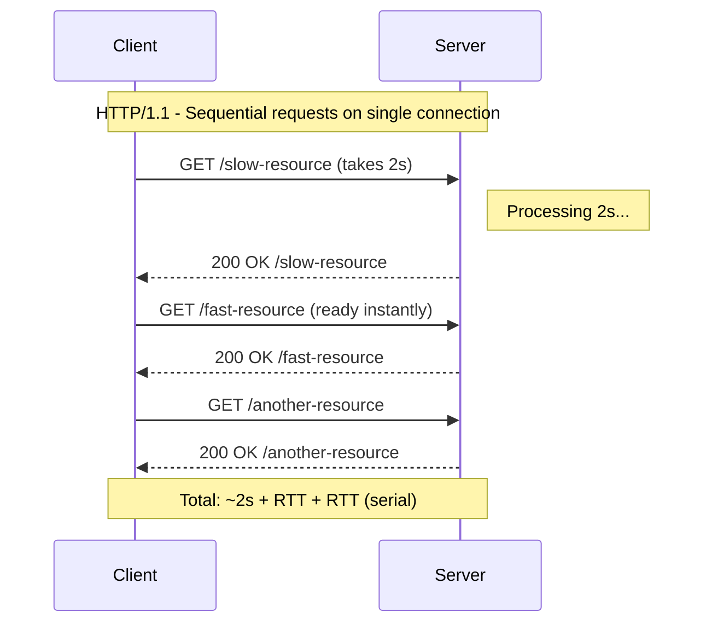
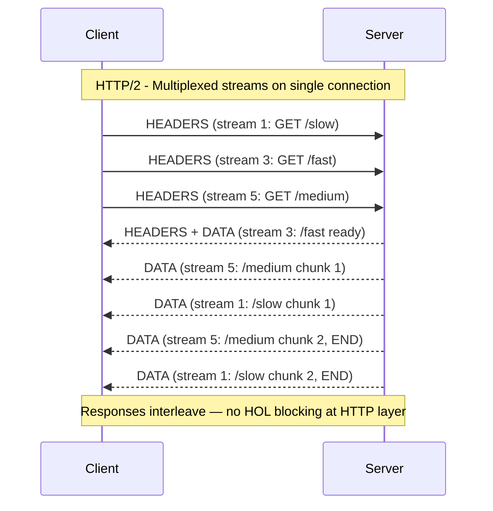
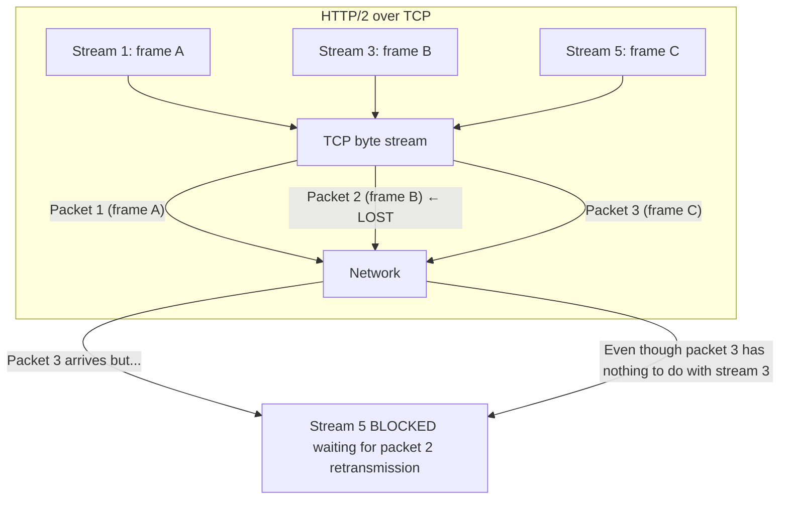
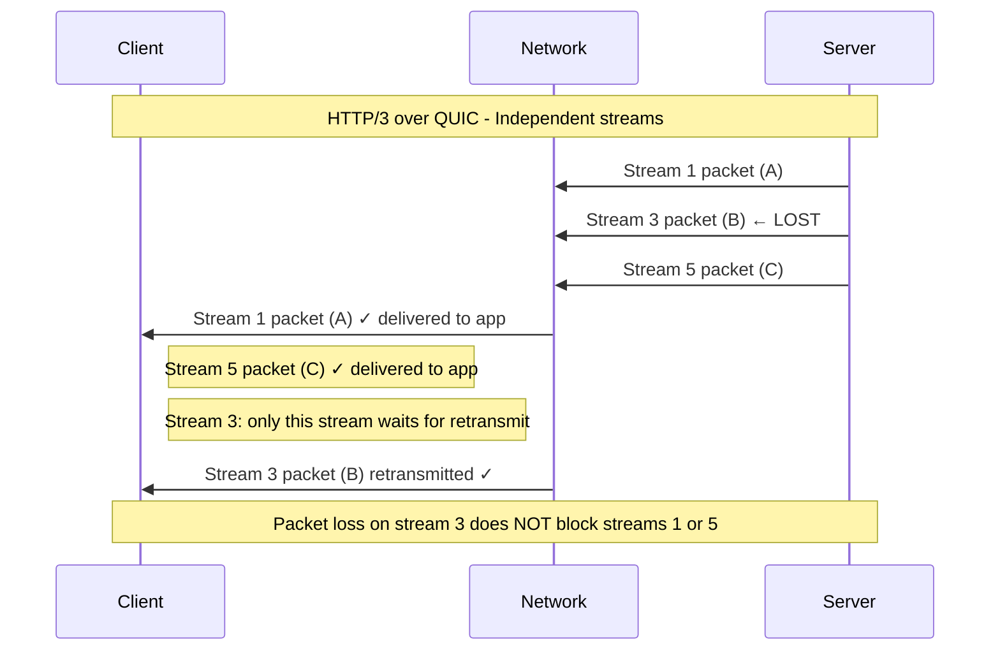

# HTTP/1.1 → HTTP/2 → HTTP/3 — The Evolution of Web Transport

**Date:** 2026-04-23 | **Updated:** 2026-04-23
**Tags:** `networking` `http` `http2` `http3` `quic` `web`

---

## Table of Contents

- [Summary](#summary)
- [1. HTTP/1.0 & HTTP/1.1 — The Foundation](#1-http10--http11--the-foundation)
- [2. HTTP/1.1 Performance Hacks](#2-http11-performance-hacks)
- [3. HTTP/2 — Binary Framing and Multiplexing](#3-http2--binary-framing-and-multiplexing)
- [4. HTTP/2 Limitations](#4-http2-limitations)
- [5. HTTP/3 & QUIC — UDP-Based Transport](#5-http3--quic--udp-based-transport)
- [6. Protocol Negotiation](#6-protocol-negotiation)
- [7. HTTP Semantics — What Stays the Same](#7-http-semantics--what-stays-the-same)
- [8. Practical Comparison](#8-practical-comparison)
- [9. Backend Configuration](#9-backend-configuration)
- [10. When to Use What](#10-when-to-use-what)
- [Related](#related)
- [References](#references)

---

## Summary

HTTP has gone through three major evolutionary steps, each solving the performance bottlenecks of its predecessor while preserving the same request/response semantics.

**HTTP/1.1** (1997, RFC 2616 / RFC 7230-7235) introduced persistent connections and pipelining but suffered from head-of-line (HOL) blocking at the application layer. Browsers worked around this with domain sharding and asset concatenation.

**HTTP/2** (2015, RFC 7540 / RFC 9113) introduced binary framing, stream multiplexing over a single TCP connection, and HPACK header compression. It eliminated application-layer HOL blocking but exposed TCP-layer HOL blocking — a single lost packet stalls all streams.

**HTTP/3** (2022, RFC 9114) replaces TCP with QUIC (RFC 9000), which runs over UDP. Each stream is independently flow-controlled, eliminating HOL blocking entirely. QUIC builds in TLS 1.3 encryption, enables 0-RTT connection resumption, and supports connection migration across network changes.

The **HTTP semantics** — methods, status codes, headers, content types — remain identical across all three versions (RFC 9110). Your application code rarely changes; the transport layer underneath evolves.

---

## 1. HTTP/1.0 & HTTP/1.1 — The Foundation

### HTTP/1.0 — One Request Per Connection

The original model: open a TCP connection, send one request, receive one response, close the connection. Every resource on a page (HTML, CSS, JS, images) required a new TCP handshake.

```
Client                    Server
  |--- TCP SYN ------------>|
  |<-- TCP SYN-ACK ---------|
  |--- TCP ACK ------------>|
  |--- GET /index.html ---->|
  |<-- 200 OK + body -------|
  |--- FIN ----------------->|   ← connection closed
  |                          |
  |--- TCP SYN ------------>|   ← new connection for next resource
  |<-- TCP SYN-ACK ---------|
  |--- TCP ACK ------------>|
  |--- GET /style.css ----->|
  |<-- 200 OK + body -------|
  |--- FIN ----------------->|
```

The cost: for a page with 30 resources, you pay 30 TCP handshakes (30 round trips just for connection setup).

### HTTP/1.1 — Persistent Connections

HTTP/1.1 made `Connection: keep-alive` the default. A single TCP connection stays open and serves multiple request/response pairs sequentially.

**Key additions in HTTP/1.1:**

| Feature | Description |
|---------|-------------|
| Persistent connections | `Connection: keep-alive` by default; one TCP connection serves many requests |
| Pipelining | Client can send multiple requests without waiting for each response |
| Chunked transfer encoding | Server can stream response body in chunks without knowing the total size upfront (`Transfer-Encoding: chunked`) |
| Host header | Mandatory — enables virtual hosting (multiple domains on one IP) |
| Content negotiation | `Accept`, `Accept-Language`, `Accept-Encoding` headers for content format negotiation |
| Range requests | `Range` header for partial content retrieval (resume downloads) |
| Cache control | `Cache-Control`, `ETag`, `If-None-Match`, `If-Modified-Since` for fine-grained caching |

### Pipelining — Good Idea, Failed in Practice

HTTP/1.1 pipelining allowed the client to send requests 2, 3, 4 before receiving the response to request 1:

```
Client                    Server
  |--- GET /a.css --------->|
  |--- GET /b.js ---------->|   ← pipelined (sent before response to /a.css)
  |--- GET /c.png --------->|   ← pipelined
  |<-- 200 OK (a.css) ------|   ← responses MUST come back in order
  |<-- 200 OK (b.js) -------|
  |<-- 200 OK (c.png) ------|
```

**Why it failed:**
- **Head-of-line blocking**: responses must return in request order. If `/a.css` takes 2 seconds to generate, `/b.js` and `/c.png` are blocked behind it, even if they are ready instantly
- **Proxy incompatibility**: many intermediaries did not handle pipelined requests correctly, causing corruption
- **No browser adoption**: all major browsers disabled pipelining by default due to these issues

### Head-of-Line Blocking (HTTP/1.1)



The browser workaround: open 6 parallel TCP connections per origin (the de facto browser limit).

### Chunked Transfer Encoding

When the server does not know the response size upfront:

```http
HTTP/1.1 200 OK
Transfer-Encoding: chunked

1a\r\n
This is the first chunk.\r\n
1c\r\n
And this is the second one.\r\n
0\r\n
\r\n
```

Each chunk is prefixed with its hex size. A zero-length chunk signals the end. This is critical for streaming responses (SSE, long-lived API responses).

---

## 2. HTTP/1.1 Performance Hacks

These workarounds existed because HTTP/1.1 could only send one request at a time per connection, and browsers limited connections to 6 per origin.

| Hack | How It Worked | Why HTTP/2 Made It an Anti-Pattern |
|------|---------------|-------------------------------------|
| **Domain sharding** | Split assets across `cdn1.example.com`, `cdn2.example.com`, etc. to get more parallel connections (6 per domain) | HTTP/2 multiplexes unlimited streams on one connection; extra domains means extra TLS handshakes and DNS lookups |
| **Sprite sheets** | Combine dozens of small images into one large image, use CSS `background-position` to show each | Multiplexing makes individual small requests cheap; sprites waste bandwidth on unused pixels |
| **JS/CSS concatenation** | Bundle all JS into one file, all CSS into one file to reduce request count | Individual files are efficient over multiplexed streams; concatenation defeats granular caching |
| **Inlining** | Embed CSS/JS/images directly in HTML via `<style>`, `<script>`, or data URIs | Wastes bandwidth on repeat visits (inlined content cannot be cached independently); server push (briefly) offered a better alternative |
| **Cookie-free domains** | Serve static assets from a domain without cookies to reduce header overhead | HPACK header compression in HTTP/2 makes repeated headers (including cookies) cheap |

**Rule of thumb:** if you are on HTTP/2+, undo these hacks. They now hurt performance.

---

## 3. HTTP/2 — Binary Framing and Multiplexing

HTTP/2 (RFC 9113) was based on Google's SPDY protocol. The core innovation: replace HTTP/1.1's text-based protocol with a binary framing layer that enables multiplexing.

### Binary Framing Layer

HTTP/1.1 is text-based:
```
GET /index.html HTTP/1.1\r\n
Host: example.com\r\n
\r\n
```

HTTP/2 converts everything into binary frames:

```
+-----------------------------------------------+
|                 Length (24 bits)               |
+---------------+-------------------------------+
| Type (8 bits) |  Flags (8 bits)               |
+-+-------------+-------------------------------+
|R|         Stream Identifier (31 bits)         |
+=+=============+===============================+
|               Frame Payload                   |
+-----------------------------------------------+
```

**Frame types:**

| Type | Purpose |
|------|---------|
| `DATA` | Carries HTTP request/response body |
| `HEADERS` | Carries HTTP headers (compressed with HPACK) |
| `PRIORITY` | Specifies stream priority (deprecated in RFC 9113, replaced by `PRIORITY_UPDATE`) |
| `RST_STREAM` | Terminates a single stream without closing the connection |
| `SETTINGS` | Configuration parameters for the connection |
| `PUSH_PROMISE` | Server push notification (deprecated) |
| `PING` | Keep-alive and latency measurement |
| `GOAWAY` | Graceful connection shutdown |
| `WINDOW_UPDATE` | Flow control per stream or per connection |
| `CONTINUATION` | Continuation of a `HEADERS` frame too large for one frame |

### Streams, Messages, and Frames

```
Connection (single TCP)
├── Stream 1 (request/response for /index.html)
│   ├── HEADERS frame (request headers)
│   ├── DATA frame (request body, if any)
│   ├── HEADERS frame (response headers)
│   └── DATA frame (response body)
├── Stream 3 (request/response for /style.css)
│   ├── HEADERS frame
│   └── DATA frame
├── Stream 5 (request/response for /app.js)
│   ├── HEADERS frame
│   └── DATA frame
└── ...
```

- **Connection**: one TCP connection between client and server
- **Stream**: a bidirectional sequence of frames sharing a stream ID. Client-initiated streams use odd IDs (1, 3, 5...), server-initiated use even IDs (2, 4, 6...)
- **Message**: a complete HTTP request or response, composed of one or more frames
- **Frame**: the smallest unit of communication

### Multiplexing — The Core Advantage



All requests and responses are interleaved on a single connection. No request blocks another at the HTTP layer. The server can respond to fast requests immediately while slow ones are still processing.

### HPACK Header Compression

HTTP/1.1 headers are verbose and repeated with every request:

```
GET /page HTTP/1.1
Host: example.com
User-Agent: Mozilla/5.0 ...
Accept: text/html
Accept-Language: en-US
Accept-Encoding: gzip, deflate
Cookie: session=abc123; theme=dark
```

**HPACK** (RFC 7541) compresses headers using:

1. **Static table**: 61 pre-defined header name-value pairs (`:method: GET`, `:path: /`, `:status: 200`, etc.)
2. **Dynamic table**: connection-specific table built up during the session. Headers sent once are indexed; subsequent references use just the index number
3. **Huffman coding**: string values are Huffman-encoded for further compression

Typical header compression ratio: **85-95%** on repeated requests. A 500-byte header block compresses to 20-50 bytes on the second request.

### Server Push (Deprecated)

The server could proactively send resources it knew the client would need:

```
Client: GET /index.html
Server: PUSH_PROMISE (stream 2: /style.css)
Server: PUSH_PROMISE (stream 4: /app.js)
Server: HEADERS + DATA (stream 1: /index.html)
Server: HEADERS + DATA (stream 2: /style.css)
Server: HEADERS + DATA (stream 4: /app.js)
```

**Why it was deprecated (Chrome removed it in 2022):**
- Pushed resources could already be cached by the client — wasted bandwidth
- No reliable mechanism for the client to signal "I already have this"
- Difficult to use correctly without over-pushing
- `103 Early Hints` is the simpler replacement — tells the browser what to preload without actually pushing bytes

### Stream Prioritization

Streams can be weighted and have dependencies:
- Stream for CSS has higher priority than images
- Stream for above-the-fold image has higher priority than below-the-fold

RFC 9113 replaced the original complex tree-based priority scheme with the simpler `PRIORITY_UPDATE` frame and the Extensible Priority Scheme (RFC 9218).

### Flow Control

HTTP/2 implements flow control at two levels:
- **Per-stream**: prevents one stream from consuming the entire connection's bandwidth
- **Per-connection**: prevents the sender from overwhelming the receiver's buffer

Each receiver advertises a **window size** (default 65,535 bytes). The sender cannot transmit more than the window allows until the receiver sends `WINDOW_UPDATE` frames.

---

## 4. HTTP/2 Limitations

### TCP-Level Head-of-Line Blocking

HTTP/2 solved HOL blocking at the application layer but exposed a worse problem at the transport layer:



TCP treats everything as a single ordered byte stream. When a packet is lost:
1. TCP detects the loss (missing ACK or duplicate ACKs)
2. TCP retransmits the lost packet
3. **All data behind the lost packet is held in the kernel buffer** — even data belonging to completely unrelated HTTP/2 streams

Under packet loss conditions (common on mobile/Wi-Fi), HTTP/2 can actually perform **worse** than HTTP/1.1 with 6 parallel connections (because 6 connections means packet loss on one only blocks that one).

### TLS Overhead

HTTP/2 requires TLS in practice (all browsers enforce it, though the spec allows cleartext `h2c`). The TLS 1.2 handshake adds 2 extra round trips before any HTTP data flows:

```
TCP handshake:    1 RTT
TLS 1.2 handshake: 2 RTT
First HTTP request: 1 RTT
                    --------
Total:              4 RTT before first byte
```

TLS 1.3 reduces this to 1 RTT for the TLS handshake, but TCP still adds its own RTT.

### TCP Slow Start

Every new TCP connection starts with a small congestion window (typically 10 segments = ~14KB). The window grows exponentially until loss or the slow start threshold. For short-lived connections, you never reach full bandwidth. HTTP/2's single connection helps here (the connection has time to ramp up), but on a new connection the initial slow start still matters.

---

## 5. HTTP/3 & QUIC — UDP-Based Transport

HTTP/3 (RFC 9114) runs over QUIC (RFC 9000) instead of TCP. QUIC is a general-purpose transport protocol implemented in user space over UDP.

### Why UDP?

QUIC does not use UDP because it wants unreliable delivery. It uses UDP as a **substrate** to bypass operating system and middlebox ossification:
- TCP is implemented in OS kernels — deploying protocol changes requires OS updates across billions of devices
- Middleboxes (NATs, firewalls, load balancers) inspect and sometimes modify TCP headers — any new TCP feature risks being mangled
- UDP passes through middleboxes relatively untouched because it has a minimal, stable header

QUIC implements its own reliability, ordering, congestion control, and encryption on top of UDP datagrams.

### QUIC Architecture

```
+----------------------------------+
|          HTTP/3 (RFC 9114)       |   ← HTTP semantics
+----------------------------------+
|       QPACK Header Compression   |   ← replaces HPACK
+----------------------------------+
|          QUIC (RFC 9000)         |   ← transport: streams, reliability, congestion
|  ┌─────────────────────────────┐ |
|  │  TLS 1.3 (built-in)        │ |   ← encryption is mandatory and integrated
|  └─────────────────────────────┘ |
+----------------------------------+
|          UDP (RFC 768)           |   ← minimal substrate
+----------------------------------+
|               IP                 |
+----------------------------------+
```

### Independent Streams — No HOL Blocking

The core improvement: QUIC streams are independently flow-controlled and delivered:



Each stream has its own sequence space. Loss in one stream only stalls that stream. The other streams continue to deliver data to the application.

### QPACK Header Compression

QPACK (RFC 9204) replaces HPACK. The challenge: HPACK relies on ordered delivery of header blocks (the dynamic table must be synchronized). With QUIC's independent streams, headers can arrive out of order.

QPACK solves this with:
- A **dedicated unidirectional control stream** for dynamic table updates
- **Encoder/decoder streams** that synchronize the dynamic table state
- References to the static table (which is expanded to 99 entries vs HPACK's 61)
- An **acknowledged insertion count** mechanism so the decoder knows which dynamic table entries are safe to reference

Compression efficiency is comparable to HPACK, with the added benefit of not blocking on header delivery order.

### 0-RTT Connection Establishment

QUIC combines the transport handshake and TLS handshake into a single step:

```
First connection:
  Client → Server: Initial (QUIC handshake + TLS ClientHello)    ← 1 RTT
  Server → Client: Handshake (TLS ServerHello + params)
  Client → Server: First HTTP request                            ← can send immediately

  Total: 1 RTT to first HTTP request (vs. 2-3 RTT for TCP+TLS 1.3)

Resumed connection (0-RTT):
  Client → Server: Initial + 0-RTT data (HTTP request)           ← 0 RTT!
  Server → Client: Handshake + response

  Total: 0 RTT — data sent with the very first packet
```

**0-RTT caveats:**
- 0-RTT data is **replayable** — an attacker can capture and resend it. Only use for idempotent requests (GET)
- The server can reject 0-RTT data and fall back to 1-RTT
- 0-RTT uses a pre-shared key from a previous session (TLS session ticket)

### Connection Migration

TCP connections are identified by the 4-tuple: (source IP, source port, dest IP, dest port). Change any of these (e.g., switch from Wi-Fi to cellular) and the connection breaks.

QUIC connections are identified by a **Connection ID** in the QUIC header. When the client's IP changes:

1. Client sends a `PATH_CHALLENGE` frame from the new address
2. Server responds with `PATH_RESPONSE`
3. Connection continues on the new path — no re-handshake, no stream reset

This is critical for mobile devices that frequently switch between Wi-Fi and cellular.

### Built-In Encryption

QUIC encrypts almost everything:
- **Payload**: fully encrypted (TLS 1.3)
- **Most header fields**: encrypted after the handshake
- **Only the Connection ID and a few flags** are visible to middleboxes

This prevents middlebox interference and future-proofs the protocol against ossification.

---

## 6. Protocol Negotiation

How do clients and servers agree on which HTTP version to use?

### ALPN — Application-Layer Protocol Negotiation

ALPN is a TLS extension (RFC 7301) that lets the client advertise supported protocols during the TLS handshake:

```
ClientHello:
  alpn_protocols: ["h2", "http/1.1"]

ServerHello:
  alpn_protocol: "h2"        ← server picks the best match
```

Protocol identifiers:
- `h2` — HTTP/2 over TLS
- `http/1.1` — HTTP/1.1
- `h3` — HTTP/3 over QUIC (negotiated differently, see below)

ALPN avoids an extra round trip. Without it, the client would need to send an HTTP/1.1 request first and then upgrade.

### Alt-Svc Header — Discovering HTTP/3

HTTP/3 cannot be discovered via ALPN because it uses a different transport (UDP vs TCP). Instead, the server advertises HTTP/3 support via the `Alt-Svc` response header:

```http
HTTP/2 200 OK
Alt-Svc: h3=":443"; ma=86400
```

This tells the client: "I also support HTTP/3 on UDP port 443; this information is valid for 86,400 seconds." The browser:
1. Connects via TCP + HTTP/2 initially
2. Receives the `Alt-Svc` header
3. Opens a QUIC connection in the background
4. Races the TCP and QUIC connections
5. Switches to HTTP/3 if the QUIC connection wins

Subsequent page loads go directly to HTTP/3 (cached `Alt-Svc`).

### HTTP Upgrade Mechanism (HTTP/1.1 → HTTP/2 Cleartext)

For cleartext HTTP/2 (`h2c`), the client uses the HTTP/1.1 `Upgrade` header:

```http
GET / HTTP/1.1
Host: example.com
Connection: Upgrade, HTTP2-Settings
Upgrade: h2c
HTTP2-Settings: AAMAAABkAAQCAAAAAAIAAAAA
```

If the server supports `h2c`, it responds with `101 Switching Protocols` and switches to HTTP/2 binary framing. In practice, this is rare — the web has converged on TLS for HTTP/2.

### HTTPS DNS Records (SVCB/HTTPS)

A newer approach: DNS `HTTPS` records (RFC 9460) can advertise HTTP/3 support directly in DNS:

```
example.com.  IN HTTPS  1 . alpn="h3,h2" port=443
```

This eliminates the Alt-Svc bootstrapping round trip — the client knows about HTTP/3 before even connecting.

---

## 7. HTTP Semantics — What Stays the Same

RFC 9110 (HTTP Semantics) defines the version-independent parts of HTTP. These are identical across HTTP/1.1, HTTP/2, and HTTP/3:

### Methods

| Method | Semantics | Safe | Idempotent |
|--------|-----------|------|------------|
| `GET` | Retrieve a representation | Yes | Yes |
| `HEAD` | Same as GET but no body | Yes | Yes |
| `POST` | Submit data for processing | No | No |
| `PUT` | Replace the target resource entirely | No | Yes |
| `PATCH` | Partially modify the target resource | No | No |
| `DELETE` | Remove the target resource | No | Yes |
| `OPTIONS` | Describe communication options | Yes | Yes |

### Status Code Categories

| Range | Category | Examples |
|-------|----------|----------|
| 1xx | Informational | `100 Continue`, `103 Early Hints` |
| 2xx | Success | `200 OK`, `201 Created`, `204 No Content` |
| 3xx | Redirection | `301 Moved Permanently`, `304 Not Modified` |
| 4xx | Client Error | `400 Bad Request`, `401 Unauthorized`, `404 Not Found`, `429 Too Many Requests` |
| 5xx | Server Error | `500 Internal Server Error`, `502 Bad Gateway`, `503 Service Unavailable` |

### Content Negotiation

The same content negotiation headers work across all versions:

```
Accept: application/json, text/html;q=0.9
Accept-Encoding: gzip, br, zstd
Accept-Language: en-US, ja;q=0.8
```

### Caching

Cache-Control directives, ETags, conditional requests — all defined in RFC 9111 (HTTP Caching), independent of the version:

```
Cache-Control: max-age=3600, stale-while-revalidate=60
ETag: "abc123"
If-None-Match: "abc123"
```

---

## 8. Practical Comparison

| Feature | HTTP/1.1 | HTTP/2 | HTTP/3 |
|---------|----------|--------|--------|
| **RFC** | 7230-7235 (superseded by 9110-9112) | 9113 | 9114 |
| **Transport** | TCP | TCP | QUIC (over UDP) |
| **Multiplexing** | No (one request/response at a time per connection) | Yes (unlimited streams per connection) | Yes (independent streams) |
| **HOL blocking** | Application-layer (per connection) | TCP-layer (packet loss blocks all streams) | None (per-stream only) |
| **Header compression** | None | HPACK | QPACK |
| **Encryption** | Optional (HTTPS) | Effectively mandatory (TLS) | Mandatory (built into QUIC) |
| **Connection setup** | 1 RTT (TCP) + 2 RTT (TLS 1.2) or 1 RTT (TLS 1.3) | Same as HTTP/1.1 TLS | 1 RTT (first) / 0-RTT (resumed) |
| **Server push** | N/A | Supported (deprecated) | Supported (deprecated) |
| **Connection migration** | No | No | Yes (Connection ID) |
| **Binary protocol** | No (text) | Yes | Yes |
| **Concurrent streams** | 6 connections × 1 = 6 | ~100 streams per connection (configurable) | ~100 streams per connection |
| **Adoption (2025)** | Universal | ~60% of top sites | ~30% of top sites (growing) |

### Latency Under Packet Loss

| Packet loss rate | HTTP/1.1 (6 conn) | HTTP/2 (1 conn) | HTTP/3 (QUIC) |
|------------------|--------------------|------------------|---------------|
| 0% | Baseline | Better (less overhead) | Best (fewer RTTs) |
| 1% | Moderate impact | Worse than HTTP/1.1 | Minimal impact |
| 3% | Significant | Much worse | Moderate impact |
| 5%+ | Poor | Very poor | Still functional |

This is why HTTP/2 can paradoxically be slower than HTTP/1.1 on lossy networks — and why HTTP/3 exists.

---

## 9. Backend Configuration

### Node.js — HTTP/2

Node.js has a built-in `http2` module:

```typescript
import { createSecureServer } from "node:http2";
import { readFileSync } from "node:fs";

const server = createSecureServer({
  key: readFileSync("server.key"),
  cert: readFileSync("server.crt"),
  allowHTTP1: true, // fallback for clients that don't support HTTP/2
});

server.on("stream", (stream, headers) => {
  const path = headers[":path"];
  const method = headers[":method"];

  // HTTP/2 uses pseudo-headers prefixed with ':'
  // :method, :path, :scheme, :authority (replaces Host)

  stream.respond({
    ":status": 200,
    "content-type": "application/json",
  });

  stream.end(JSON.stringify({ message: "Hello from HTTP/2" }));
});

server.listen(8443, () => {
  console.log("HTTP/2 server running on https://localhost:8443");
});
```

**With Express (via compatibility layer):**

```typescript
import express from "express";
import { createSecureServer } from "node:http2";
import { readFileSync } from "node:fs";

const app = express();

app.get("/api/data", (req, res) => {
  res.json({ protocol: req.httpVersion }); // "2.0" for HTTP/2
});

const server = createSecureServer(
  {
    key: readFileSync("server.key"),
    cert: readFileSync("server.crt"),
    allowHTTP1: true,
  },
  // express handler is compatible with http2
  app as any
);

server.listen(8443);
```

**Note:** In production, you typically terminate HTTP/2 at the reverse proxy (Nginx, Caddy, Cloudflare) and use HTTP/1.1 between the proxy and Node.js. This is because:
- The proxy handles multiplexing to the client
- Internal connections are low-latency, so HTTP/1.1 overhead is negligible
- Node.js HTTP/2 compatibility with middleware ecosystems is imperfect

### Spring Boot — HTTP/2

```yaml
# application.yml
server:
  http2:
    enabled: true
  ssl:
    enabled: true
    key-store: classpath:keystore.p12
    key-store-password: ${SSL_KEYSTORE_PASSWORD}
    key-store-type: PKCS12
  port: 8443
```

Spring Boot 3.x with Tomcat 10+ supports HTTP/2 out of the box when SSL is enabled. For cleartext HTTP/2 (h2c) in development:

```yaml
# application.yml — h2c for local dev
server:
  http2:
    enabled: true
  ssl:
    enabled: false
  port: 8080
```

**Verify in Java code:**

```java
@RestController
public class ProtocolController {

    @GetMapping("/protocol")
    public Map<String, String> getProtocol(HttpServletRequest request) {
        return Map.of(
            "protocol", request.getProtocol(),   // "HTTP/2.0"
            "scheme", request.getScheme(),
            "secure", String.valueOf(request.isSecure())
        );
    }
}
```

### Nginx — HTTP/2 and HTTP/3

```nginx
server {
    listen 443 ssl;
    listen 443 quic reuseport;   # HTTP/3 (QUIC)
    http2 on;                    # HTTP/2

    ssl_certificate     /etc/ssl/cert.pem;
    ssl_certificate_key /etc/ssl/key.pem;

    # Advertise HTTP/3 to clients
    add_header Alt-Svc 'h3=":443"; ma=86400';

    # TLS 1.3 required for HTTP/3
    ssl_protocols TLSv1.2 TLSv1.3;

    location / {
        proxy_pass http://backend:3000;    # HTTP/1.1 to backend
        proxy_http_version 1.1;
        proxy_set_header Connection "";
        proxy_set_header Host $host;
    }
}
```

### Connection Coalescing

HTTP/2 allows **connection coalescing**: if two different hostnames resolve to the same IP and are covered by the same TLS certificate (e.g., SAN or wildcard), the browser reuses one HTTP/2 connection for both.

Example: `api.example.com` and `cdn.example.com` both resolve to `203.0.113.1` and are covered by a `*.example.com` certificate. The browser uses a single HTTP/2 connection for both.

This is another reason domain sharding hurts on HTTP/2 — if the domains coalesce, sharding adds no parallelism. If they do not coalesce, you get multiple TCP slow-start ramps instead of one warmed-up connection.

---

## 10. When to Use What

| Scenario | Recommended Protocol | Rationale |
|----------|---------------------|-----------|
| **Public web** | HTTP/2 (minimum), HTTP/3 where possible | Multiplexing, compression, and reduced latency benefit all web traffic |
| **REST APIs (external)** | HTTP/2 | Multiplexed streams for concurrent API calls, header compression for repetitive headers |
| **Internal microservices** | HTTP/1.1 or HTTP/2 | Low-latency LAN means transport overhead is minimal; HTTP/1.1 is simpler to debug; gRPC uses HTTP/2 natively |
| **gRPC** | HTTP/2 (native), HTTP/3 (experimental) | gRPC is designed around HTTP/2 streams; HTTP/3 support is in progress |
| **Mobile apps** | HTTP/3 | Connection migration handles network switches; 0-RTT reduces perceived latency; independent streams tolerate packet loss |
| **Latency-sensitive / real-time** | HTTP/3 | 0-RTT and independent streams minimize stalls |
| **IoT / constrained devices** | HTTP/1.1 or MQTT/CoAP | QUIC's complexity may exceed device capabilities |
| **File downloads** | Any (HTTP/2 or 3 preferred) | Single-stream transfer; HTTP/3's 0-RTT helps with resumption |
| **Server-to-server bulk transfer** | HTTP/1.1 | Simplest; overhead is irrelevant for long-lived connections on fast networks |

### Decision Framework

```
Is this client-facing (browser/mobile)?
├── Yes → Use HTTP/2 as baseline, add HTTP/3
│         Enable Alt-Svc headers
│         Terminate at edge proxy (Nginx/Caddy/CDN)
└── No → Is this gRPC?
    ├── Yes → HTTP/2 (native)
    └── No → Is low-latency critical?
        ├── Yes → HTTP/2 (internal) or HTTP/3 (cross-region)
        └── No → HTTP/1.1 is fine
```

---

## Related

- [DNS Internals — Resolution, Caching, and Record Types](dns-internals.md)
- [TLS/SSL Handshake & Certificates — Encryption in Transit](tls-and-certificates.md)
- [gRPC & Protocol Buffers — High-Performance RPC](grpc-and-protobuf.md)
- [UDP & When to Use It — Connectionless Transport and QUIC](../transport/udp-and-quic.md)
- [Java HTTP Server Configuration](../../java/configurations/server-http-config.md)

---

## References

1. **RFC 9110 — HTTP Semantics** (2022). Fielding, Nottingham, Reschke. https://www.rfc-editor.org/rfc/rfc9110
2. **RFC 9113 — HTTP/2** (2022). Thomson, Benfield. https://www.rfc-editor.org/rfc/rfc9113
3. **RFC 9114 — HTTP/3** (2022). Bishop. https://www.rfc-editor.org/rfc/rfc9114
4. **RFC 9000 — QUIC: A UDP-Based Multiplexed and Secure Transport** (2021). Iyengar, Thomson. https://www.rfc-editor.org/rfc/rfc9000
5. **RFC 7541 — HPACK: Header Compression for HTTP/2** (2015). Peon, Ruellan. https://www.rfc-editor.org/rfc/rfc7541
6. **RFC 9204 — QPACK: Field Compression for HTTP/3** (2022). Krasic, Bishop, Quigley. https://www.rfc-editor.org/rfc/rfc9204
7. **Web Almanac — HTTP/2 and HTTP/3 Adoption** (2024). HTTP Archive. https://almanac.httparchive.org/en/2024/http
8. **Node.js HTTP/2 Documentation**. https://nodejs.org/api/http2.html
