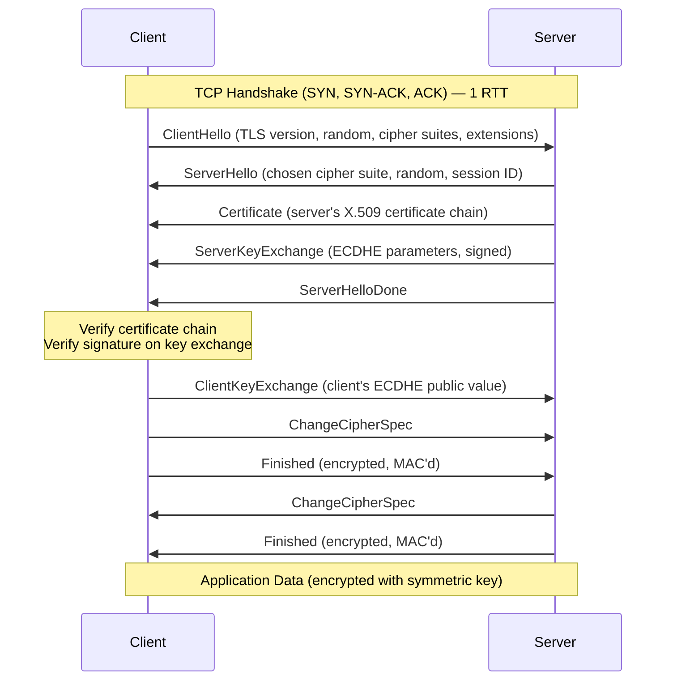
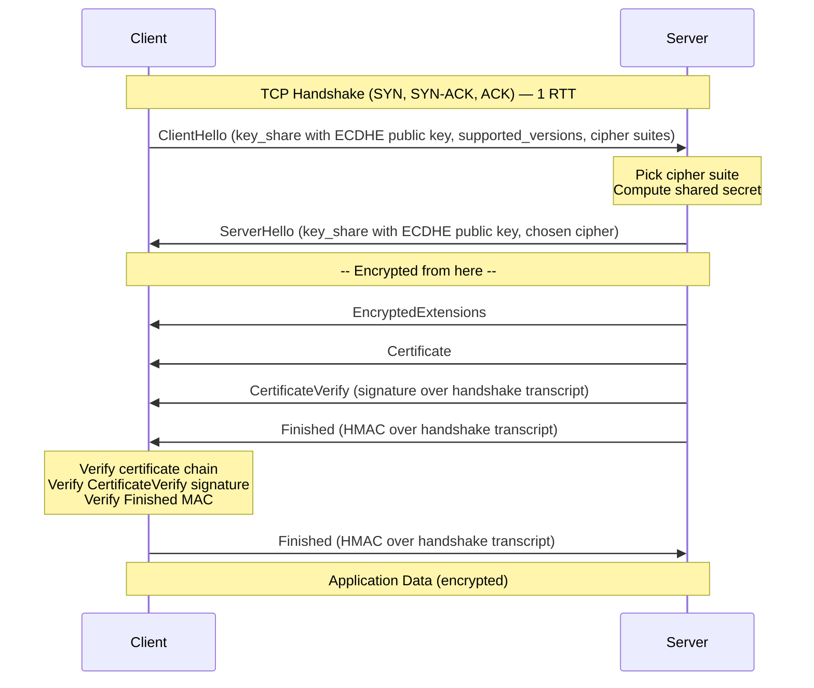
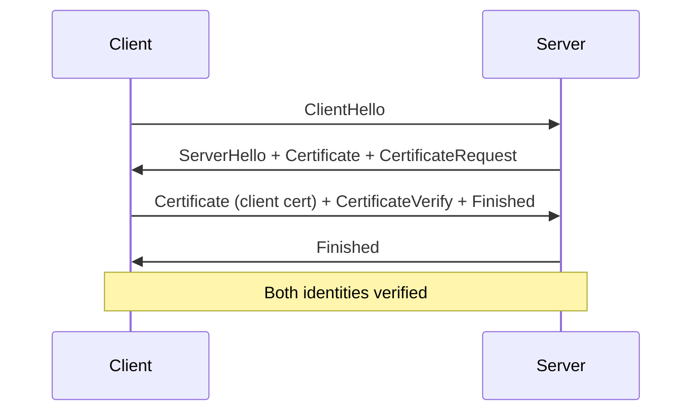

# TLS/SSL Handshake & Certificates — Encryption in Transit

| Field       | Value                                                    |
|-------------|----------------------------------------------------------|
| **Topic**   | TLS protocol, certificate infrastructure, encryption     |
| **Audience**| Backend developer (TypeScript/Node + Java/Spring)        |
| **Tier**    | 3 — Application Layer                                    |
| **Prereqs** | [TCP Deep Dive](../transport/tcp-deep-dive.md), basic networking concepts |

---

## Table of Contents

1. [Cryptography Primer](#1-cryptography-primer)
2. [TLS 1.2 Handshake](#2-tls-12-handshake)
3. [TLS 1.3 Handshake](#3-tls-13-handshake)
4. [TLS 1.2 vs 1.3 Comparison](#4-tls-12-vs-13-comparison)
5. [Certificate Chain of Trust](#5-certificate-chain-of-trust)
6. [Certificate Types](#6-certificate-types)
7. [ALPN — Application-Layer Protocol Negotiation](#7-alpn--application-layer-protocol-negotiation)
8. [mTLS — Mutual TLS](#8-mtls--mutual-tls)
9. [Certificate Pinning](#9-certificate-pinning)
10. [OCSP and CRL — Certificate Revocation](#10-ocsp-and-crl--certificate-revocation)
11. [Practical TLS — Code and Debugging](#11-practical-tls--code-and-debugging)

---

## 1. Cryptography Primer

TLS relies on a combination of cryptographic primitives. Understanding what each one does (and does not do) is essential before examining the handshake itself.

### Symmetric Encryption

One key encrypts and decrypts. Fast, efficient for bulk data.

- **AES-GCM** (Advanced Encryption Standard, Galois/Counter Mode) — the dominant choice in TLS 1.2 and 1.3. Provides both confidentiality and integrity (authenticated encryption). Typical key sizes: 128-bit or 256-bit.
- **ChaCha20-Poly1305** — an alternative to AES-GCM, performs well on hardware without AES-NI instructions (e.g., older ARM devices). Also authenticated encryption.

The core problem: how do two parties who have never communicated agree on a shared secret key? That is the job of asymmetric cryptography and key exchange.

### Asymmetric Encryption

Two keys: a public key (shared openly) and a private key (kept secret). Encrypting with one key requires the other to decrypt.

- **RSA** — factoring-based. Can do both encryption and signatures. Older RSA key exchange in TLS 1.2 sent the pre-master secret encrypted with the server's RSA public key. No forward secrecy because compromise of the server's private key decrypts all past sessions.
- **ECDSA / EdDSA** — elliptic-curve signature algorithms. Used to sign certificates and handshake messages. Smaller keys for equivalent security (256-bit ECDSA is roughly equivalent to 3072-bit RSA).

### Key Exchange — Diffie-Hellman

Diffie-Hellman (DH) lets two parties derive a shared secret over an insecure channel without transmitting the secret itself.

- **DHE** — ephemeral Diffie-Hellman over finite fields.
- **ECDHE** — ephemeral Diffie-Hellman over elliptic curves. Smaller parameters, faster computation. The standard choice in modern TLS.

"Ephemeral" means a new key pair is generated per session, which gives **forward secrecy**: even if the server's long-term private key is later compromised, past session keys cannot be recovered.

### Forward Secrecy

A property of the protocol, not of a single algorithm. If the session key exchange is ephemeral (ECDHE), compromising the server's certificate private key does not reveal past session traffic. TLS 1.3 mandates forward secrecy by removing non-ephemeral key exchange entirely.

### Digital Signatures

Used to prove identity and data integrity. During the TLS handshake, the server signs parameters with its private key. The client verifies using the public key from the server's certificate.

Signature flow: `hash(data) -> sign(hash, private_key) -> signature`
Verification: `verify(signature, hash, public_key) -> valid/invalid`

### Hashing

Cryptographic hash functions produce a fixed-size digest from arbitrary input. Properties: collision resistance, pre-image resistance, second pre-image resistance.

- **SHA-256** — used in certificate signatures, HKDF key derivation, and integrity checks.
- **SHA-384** — used with P-384 curves in some cipher suites.

---

## 2. TLS 1.2 Handshake

Defined in RFC 5246. Requires **2 round trips** (2-RTT) before application data can flow.

### Sequence Diagram



### Step-by-Step Breakdown

1. **ClientHello** — The client sends its supported TLS versions, a 32-byte client random, a list of supported cipher suites (e.g., `TLS_ECDHE_RSA_WITH_AES_128_GCM_SHA256`), and extensions (SNI, ALPN, supported groups, signature algorithms).

2. **ServerHello** — The server picks one cipher suite, generates a 32-byte server random, and returns a session ID for potential resumption.

3. **Certificate** — The server sends its certificate chain (leaf + intermediates). The client validates the chain up to a trusted root CA.

4. **ServerKeyExchange** — For ECDHE suites, the server sends its ephemeral public key and a signature over the client random, server random, and ECDHE parameters. This signature proves the server possesses the private key matching the certificate.

5. **ServerHelloDone** — Signals the server is finished with its handshake messages.

6. **ClientKeyExchange** — The client sends its ephemeral ECDHE public key. Both sides now independently compute the **pre-master secret** using their private key and the other party's public key.

7. **Key Derivation** — Both sides derive the **master secret** from the pre-master secret + client random + server random using a PRF (pseudo-random function). From the master secret they derive: client write key, server write key, client write IV, server write IV, client MAC key, server MAC key.

8. **ChangeCipherSpec + Finished** — Each side signals the switch to encrypted communication and sends a `Finished` message containing a hash of all handshake messages so far, encrypted with the new keys. This verifies the handshake was not tampered with.

### Cipher Suite Naming (TLS 1.2)

```
TLS_ECDHE_RSA_WITH_AES_128_GCM_SHA256
     |      |         |    |     |
     |      |         |    |     +-- PRF hash
     |      |         |    +-------- AEAD mode
     |      |         +------------- Symmetric cipher + key size
     |      +----------------------- Authentication (certificate signature type)
     +------------------------------ Key exchange
```

---

## 3. TLS 1.3 Handshake

Defined in RFC 8446. A major simplification: **1 round trip** (1-RTT) for the full handshake, with an optional 0-RTT mode for resumed connections.

### What Changed from 1.2

- RSA key exchange **removed** entirely — forward secrecy is mandatory.
- Only 5 cipher suites remain (down from dozens). All use AEAD. No more CBC mode, RC4, DES, or SHA-1.
- Handshake messages after ServerHello are **encrypted**.
- `ChangeCipherSpec` removed (kept only as a compatibility shim).
- Session resumption replaced by **PSK (Pre-Shared Key)** mechanism.
- Key derivation switched to **HKDF** (HMAC-based Key Derivation Function).

### Sequence Diagram



### Key Differences in Detail

1. **ClientHello includes key shares** — The client guesses which key exchange group the server will pick (typically X25519 or P-256) and sends its ephemeral public key immediately. No extra round trip for ServerKeyExchange.

2. **Server completes in one flight** — ServerHello + encrypted extensions + certificate + CertificateVerify + Finished all come in a single response. The server derives the handshake keys from the shared secret immediately after processing ClientHello.

3. **Encrypted handshake** — After ServerHello, everything is encrypted with handshake traffic keys derived from the ECDHE shared secret. The certificate itself is encrypted, hiding the server's identity from passive observers.

4. **CertificateVerify** — Replaces the implicit signature in ServerKeyExchange. The server signs the entire handshake transcript (hash of all messages so far) with its private key. Stronger integrity guarantee.

5. **Key schedule** — Uses HKDF-Extract and HKDF-Expand with a defined schedule:
   - Early Secret (from PSK or 0)
   - Handshake Secret (from ECDHE shared secret)
   - Master Secret (from handshake secret)
   - Application Traffic Secret (from master secret)

### 0-RTT Resumption

When a client has previously connected and received a PSK (via NewSessionTicket), it can send encrypted application data in the very first flight:

```
ClientHello + early_data + key_share + PSK identity
--> [0-RTT application data, encrypted with early traffic key]
```

**Replay risk**: 0-RTT data has no anti-replay protection from the protocol itself. An attacker can capture and re-send the 0-RTT data. Servers must:
- Only allow idempotent operations in 0-RTT (GET requests, not POST).
- Implement application-level replay protection (e.g., unique tokens, nonces).
- Or disable 0-RTT entirely (many deployments do this).

### TLS 1.3 Cipher Suites

Only 5 cipher suites exist. Key exchange and authentication are negotiated separately via extensions:

| Cipher Suite                       | AEAD           | Hash    |
|------------------------------------|----------------|---------|
| `TLS_AES_128_GCM_SHA256`          | AES-128-GCM    | SHA-256 |
| `TLS_AES_256_GCM_SHA384`          | AES-256-GCM    | SHA-384 |
| `TLS_CHACHA20_POLY1305_SHA256`    | ChaCha20-Poly1305 | SHA-256 |
| `TLS_AES_128_CCM_SHA256`          | AES-128-CCM    | SHA-256 |
| `TLS_AES_128_CCM_8_SHA256`        | AES-128-CCM-8  | SHA-256 |

Note: key exchange (X25519, P-256, etc.) and signature algorithm (RSA-PSS, ECDSA, EdDSA) are negotiated via `supported_groups` and `signature_algorithms` extensions, not embedded in the cipher suite name.

---

## 4. TLS 1.2 vs 1.3 Comparison

| Feature                     | TLS 1.2                              | TLS 1.3                              |
|-----------------------------|--------------------------------------|--------------------------------------|
| **RTT for full handshake**  | 2-RTT                                | 1-RTT                                |
| **Resumption**              | Session ID / Session Ticket (1-RTT)  | PSK + 0-RTT (0-RTT possible)         |
| **Forward secrecy**         | Optional (depends on cipher suite)   | Mandatory (ECDHE/DHE only)           |
| **RSA key exchange**        | Supported                            | Removed                              |
| **Cipher suites**           | ~40+, including weak ones            | 5, all AEAD                          |
| **Handshake encryption**    | Plaintext (certificate visible)      | Encrypted after ServerHello          |
| **Key derivation**          | Custom PRF                           | HKDF                                 |
| **ChangeCipherSpec**        | Required                             | Removed (compat shim only)           |
| **Compression**             | Supported (CRIME vulnerability)      | Removed                              |
| **Renegotiation**           | Supported                            | Removed (use KeyUpdate instead)      |
| **0-RTT early data**        | Not available                        | Optional (with replay caveats)       |

---

## 5. Certificate Chain of Trust

### How the Chain Works

```
Root CA (self-signed, pre-installed in OS/browser trust store)
  └── Intermediate CA (signed by Root CA)
        └── Leaf Certificate (signed by Intermediate CA, your server's cert)
```

1. The server sends the **leaf certificate** and **intermediate certificate(s)**.
2. The client walks the chain: each certificate's issuer must match the subject of the next certificate up.
3. Each signature is verified using the issuer's public key.
4. The chain terminates at a **root CA** that the client already trusts (pre-installed in the OS or browser trust store).

### Certificate Fields

A typical X.509v3 certificate contains:

| Field                  | Purpose                                              |
|------------------------|------------------------------------------------------|
| Subject                | Entity the cert identifies (CN, O, etc.)             |
| Issuer                 | CA that signed this cert                             |
| Serial Number          | Unique per CA                                        |
| Not Before / Not After | Validity window                                      |
| Public Key             | Subject's public key + algorithm                     |
| Signature              | CA's signature over the certificate                  |
| Subject Alt Names (SAN)| DNS names and/or IPs the cert is valid for           |
| Key Usage              | digitalSignature, keyEncipherment, etc.              |
| Extended Key Usage     | serverAuth, clientAuth                               |
| Authority Info Access  | OCSP responder URL, CA issuers URL                   |
| CRL Distribution Points| Where to download the CRL                           |
| Basic Constraints      | Whether this cert can sign other certs (CA:TRUE)     |

### Certificate Stores

| Platform / Runtime | Trust Store Location                              |
|--------------------|---------------------------------------------------|
| Linux (Debian)     | `/etc/ssl/certs/ca-certificates.crt`              |
| macOS              | Keychain Access → System Roots                    |
| Windows            | `certmgr.msc` → Trusted Root Certification Auth   |
| Node.js            | Uses OpenSSL's compiled-in CAs, or `NODE_EXTRA_CA_CERTS` env var |
| Java               | `$JAVA_HOME/lib/security/cacerts` (JKS/PKCS12)   |
| Browser            | Uses OS trust store (Chrome, Edge) or its own (Firefox — NSS) |

### Self-Signed Certificates for Development

A self-signed cert is one where the issuer and subject are the same entity. Browsers and HTTP clients reject it by default because no trusted CA vouches for it.

```bash
# Generate a self-signed cert for localhost (valid 365 days)
openssl req -x509 -newkey ec -pkeyopt ec_paramgen_curve:prime256v1 \
  -keyout key.pem -out cert.pem -days 365 -nodes \
  -subj "/CN=localhost" \
  -addext "subjectAltName=DNS:localhost,IP:127.0.0.1"
```

For local dev, tools like **mkcert** install a local root CA into your OS trust store, making locally-generated certs trusted without skipping verification.

---

## 6. Certificate Types

### Validation Levels

| Type | What CA Verifies         | Issuance Speed | Visual Indicator        |
|------|--------------------------|----------------|-------------------------|
| **DV** (Domain Validation)     | Domain control only (DNS/HTTP challenge) | Minutes  | Padlock only            |
| **OV** (Organization Validation)| Domain + legal organization identity     | Days     | Organization in cert    |
| **EV** (Extended Validation)   | Domain + org + legal existence + physical address | Weeks | Organization name (in some UIs) |

DV is sufficient for most backend services. EV's browser UI differentiation has been largely removed by major browsers.

### Wildcard Certificates

A wildcard cert covers `*.example.com` — any single-level subdomain (`api.example.com`, `www.example.com`). Does **not** cover bare `example.com` (add it as a SAN) or nested subdomains (`a.b.example.com`).

### SAN — Subject Alternative Name

The modern way to specify which hostnames a certificate covers. The `CN` (Common Name) field is deprecated for hostname matching; SAN is authoritative.

```
X509v3 Subject Alternative Name:
    DNS:example.com, DNS:*.example.com, DNS:api.example.com, IP:10.0.0.1
```

### Let's Encrypt and the ACME Protocol

Let's Encrypt is a free, automated DV CA. It uses the **ACME** (Automatic Certificate Management Environment) protocol (RFC 8555) for certificate issuance and renewal.

**Challenge types**:
- **HTTP-01** — Place a token at `http://yourdomain/.well-known/acme-challenge/<token>`. Requires port 80 reachable.
- **DNS-01** — Create a `_acme-challenge.yourdomain` TXT record. Works for wildcard certs, no inbound port required.
- **TLS-ALPN-01** — Respond on port 443 using a special self-signed cert with an ACME identifier in an ALPN extension.

Certificates are valid for 90 days, encouraging automation. Clients like **certbot** or **acme.sh** handle renewal automatically.

---

## 7. ALPN — Application-Layer Protocol Negotiation

ALPN (RFC 7301) is a TLS extension that lets client and server agree on the application protocol during the TLS handshake, before any application data is sent.

### How It Works

1. The client includes an `application_layer_protocol_negotiation` extension in ClientHello, listing supported protocols:
   ```
   ALPN: ["h2", "http/1.1"]
   ```

2. The server picks one and includes it in ServerHello:
   ```
   ALPN: "h2"
   ```

3. Both sides know which protocol to speak before the first application byte.

### Why ALPN Matters

- **HTTP/2** requires ALPN. Browsers only use HTTP/2 over TLS, and ALPN is how they negotiate it. Without ALPN advertising `h2`, the connection falls back to HTTP/1.1.
- **HTTP/3** uses ALPN value `h3` during the QUIC handshake (QUIC integrates TLS 1.3).
- **gRPC** uses `h2` (it runs over HTTP/2).

ALPN replaced the older NPN (Next Protocol Negotiation) extension, which was never standardized.

---

## 8. mTLS — Mutual TLS

In standard TLS, only the server presents a certificate. In mutual TLS, **both** client and server present certificates and verify each other.

### How mTLS Works



The server sends a `CertificateRequest` message, and the client responds with its own certificate and a `CertificateVerify` signature proving possession of the private key.

### Use Cases

| Scenario | Why mTLS |
|----------|----------|
| **Service-to-service** | Stronger than shared secrets or API keys. Each service has a unique identity. |
| **Zero-trust architectures** | Every connection is authenticated, even inside the network perimeter. |
| **API authentication** | Client certificates replace or supplement API keys/OAuth tokens. |
| **Service mesh (Istio, Linkerd)** | Automatic mTLS between all pods — sidecars handle cert rotation. |

### mTLS in Kubernetes / Istio

Istio's sidecar proxy (Envoy) automatically:

1. Issues **SPIFFE-format** certificates to each workload via its CA (istiod).
2. Rotates certificates before expiry (default 24-hour lifetime).
3. Enforces mTLS between services by default (`PeerAuthentication` policy).
4. Your application code sees plain HTTP — the sidecar handles TLS termination and origination transparently.

```yaml
# Istio PeerAuthentication — enforce mTLS cluster-wide
apiVersion: security.istio.io/v1beta1
kind: PeerAuthentication
metadata:
  name: default
  namespace: istio-system
spec:
  mtls:
    mode: STRICT
```

---

## 9. Certificate Pinning

Certificate pinning restricts which certificates a client accepts for a given host, beyond the normal chain-of-trust validation.

### What Gets Pinned

- The **leaf certificate's** public key hash.
- Or an **intermediate CA's** public key hash (more flexible — survives leaf cert rotation).

### HPKP (HTTP Public Key Pinning) — Deprecated

HPKP was an HTTP header-based pinning mechanism:

```
Public-Key-Pins:
  pin-sha256="base64hash1";
  pin-sha256="base64hash2";
  max-age=5184000;
  includeSubDomains
```

It was removed from browsers because misconfiguration could permanently lock users out of a site (no way to recover if the pinned key was lost). Chrome removed HPKP support in 2018.

### Mobile App Pinning

Mobile apps still commonly use pinning because the developer controls the client:

- **Android** — `network_security_config.xml` with `<pin-set>` entries.
- **iOS** — `NSAppTransportSecurity` with `NSPinnedDomains`, or libraries like TrustKit.
- **OkHttp (Java/Kotlin)** — `CertificatePinner` class.

Risk: if the pinned certificate changes and the app is not updated, users cannot connect. Include backup pins and plan for rotation.

### Modern Alternatives to Pinning

| Mechanism | How It Helps |
|-----------|-------------|
| **Certificate Transparency (CT)** | All public CAs must log certificates to public CT logs. Monitors can detect misissued certs. |
| **CAA Records** | DNS CAA records specify which CAs are authorized to issue certs for your domain. `example.com. CAA 0 issue "letsencrypt.org"` |
| **Expect-CT header** | (Deprecated) asked browsers to enforce CT compliance. Now CT is mandatory for all public certs in Chrome. |

---

## 10. OCSP and CRL — Certificate Revocation

When a private key is compromised or a certificate is misissued, it must be revoked before its natural expiry.

### CRL — Certificate Revocation Lists

A CRL (RFC 5280) is a signed list of revoked certificate serial numbers, published by the CA.

- The certificate's `CRL Distribution Points` extension provides the download URL.
- Clients download the entire CRL and check if the serial number appears.
- **Problems**: CRLs can be large (millions of entries for major CAs), clients often skip the check on failure (soft-fail), and the update interval introduces a revocation delay.

### OCSP — Online Certificate Status Protocol

OCSP (RFC 6960) lets a client query a CA's OCSP responder for real-time certificate status.

```
Client --> OCSP Responder: "Is serial 0x1A2B3C revoked?"
OCSP Responder --> Client: "good" / "revoked" / "unknown" (signed response)
```

**Problems with plain OCSP**:
- Privacy: the OCSP responder learns which sites the client visits.
- Latency: an extra round trip before the TLS handshake can proceed.
- Availability: if the OCSP responder is down, most clients soft-fail (proceed anyway).

### OCSP Stapling

The server fetches the OCSP response itself and "staples" it to the TLS handshake (in the `CertificateStatus` message in TLS 1.2, or as an extension in TLS 1.3).

Benefits:
- No client-to-CA round trip.
- No privacy leak.
- The server caches the OCSP response (valid for hours/days) and refreshes proactively.

### OCSP Must-Staple

A certificate extension (`id-pe-tlsfeature` with value `status_request`) that tells clients: "If the server does not staple an OCSP response, reject the connection." This closes the soft-fail loophole.

Let's Encrypt supports must-staple. Add it when requesting the certificate:

```bash
certbot certonly --must-staple -d example.com
```

### Revocation Summary

| Method         | Latency  | Privacy   | Reliability       |
|----------------|----------|-----------|-------------------|
| CRL            | Minutes–hours | Neutral | Large downloads, soft-fail |
| OCSP           | 1 RTT    | Leaks visited domains | Soft-fail on responder down |
| OCSP Stapling  | 0 RTT    | Private   | Depends on server config |
| Must-Staple    | 0 RTT    | Private   | Hard-fail (best security) |

---

## 11. Practical TLS — Code and Debugging

### Node.js HTTPS Server

```typescript
import { createServer } from 'node:https';
import { readFileSync } from 'node:fs';

const options = {
  key: readFileSync('/etc/tls/server-key.pem'),
  cert: readFileSync('/etc/tls/server-cert.pem'),
  // Optional: CA bundle for client cert verification (mTLS)
  // ca: readFileSync('/etc/tls/ca-cert.pem'),
  // requestCert: true,
  // rejectUnauthorized: true,

  // Enforce TLS 1.2+ (Node.js default since v12 is minVersion: 'TLSv1.2')
  minVersion: 'TLSv1.2' as const,

  // Prefer server cipher order
  honorCipherOrder: true,
};

const server = createServer(options, (req, res) => {
  // Access client cert info (if mTLS)
  // const clientCert = req.socket.getPeerCertificate();

  res.writeHead(200, { 'Content-Type': 'text/plain' });
  res.end('Hello over TLS\n');
});

server.listen(443, () => {
  console.log('HTTPS server listening on port 443');
});
```

### Node.js — Trusting Custom CAs

```typescript
// Option 1: Environment variable (recommended for containers)
// NODE_EXTRA_CA_CERTS=/etc/tls/internal-ca.pem node server.js

// Option 2: Per-request in https or fetch
import { Agent } from 'node:https';
import { readFileSync } from 'node:fs';

const agent = new Agent({
  ca: readFileSync('/etc/tls/internal-ca.pem'),
});

const response = await fetch('https://internal-service.local/api', {
  // @ts-expect-error — Node.js fetch supports dispatcher for custom agent
  dispatcher: agent,
});
```

### Java — KeyStore and TrustStore

Java uses two stores:

| Store        | Contains                        | System Property            |
|--------------|--------------------------------|----------------------------|
| **KeyStore** | Server/client's own certificate + private key | `javax.net.ssl.keyStore` |
| **TrustStore** | Trusted CA certificates      | `javax.net.ssl.trustStore` |

```bash
# Create a PKCS12 keystore from PEM files
openssl pkcs12 -export \
  -in server-cert.pem \
  -inkey server-key.pem \
  -certfile ca-chain.pem \
  -out keystore.p12 \
  -name server \
  -passout pass:changeit

# Import a CA cert into a truststore
keytool -importcert \
  -alias internal-ca \
  -file internal-ca.pem \
  -keystore truststore.p12 \
  -storetype PKCS12 \
  -storepass changeit \
  -noprompt
```

### Spring Boot TLS Configuration

```yaml
# application.yml
server:
  port: 8443
  ssl:
    enabled: true
    key-store: classpath:keystore.p12
    key-store-password: ${SSL_KEYSTORE_PASSWORD}
    key-store-type: PKCS12
    key-alias: server

    # For mTLS
    # client-auth: need
    # trust-store: classpath:truststore.p12
    # trust-store-password: ${SSL_TRUSTSTORE_PASSWORD}

    # Enforce TLS 1.2+
    protocol: TLS
    enabled-protocols: TLSv1.2,TLSv1.3
```

```java
// Programmatic SSL configuration (Spring Boot 3.x)
@Bean
public WebServerFactoryCustomizer<TomcatServletWebServerFactory> sslCustomizer() {
    return factory -> {
        factory.setSsl(createSsl());
    };
}

private Ssl createSsl() {
    Ssl ssl = new Ssl();
    ssl.setEnabled(true);
    ssl.setKeyStore("classpath:keystore.p12");
    ssl.setKeyStorePassword(System.getenv("SSL_KEYSTORE_PASSWORD"));
    ssl.setKeyStoreType("PKCS12");
    ssl.setProtocol("TLS");
    ssl.setEnabledProtocols(new String[]{"TLSv1.2", "TLSv1.3"});
    return ssl;
}
```

### OpenSSL Debugging Commands

These are essential for troubleshooting TLS issues:

```bash
# Connect and show the full TLS handshake + certificate chain
openssl s_client -connect example.com:443 -servername example.com

# Show TLS 1.3 specifically
openssl s_client -connect example.com:443 -tls1_3

# Show certificate details (dates, SANs, issuer)
echo | openssl s_client -connect example.com:443 -servername example.com 2>/dev/null \
  | openssl x509 -noout -text

# Check certificate expiry
echo | openssl s_client -connect example.com:443 -servername example.com 2>/dev/null \
  | openssl x509 -noout -dates

# Verify certificate chain against a CA bundle
openssl verify -CAfile ca-chain.pem server-cert.pem

# Show OCSP stapling response
openssl s_client -connect example.com:443 -servername example.com -status

# Test specific cipher suite
openssl s_client -connect example.com:443 -cipher ECDHE-RSA-AES128-GCM-SHA256

# Inspect a PEM certificate file
openssl x509 -in cert.pem -noout -text

# Inspect a PKCS12 keystore
openssl pkcs12 -in keystore.p12 -info -nokeys
```

### Common TLS Errors and Fixes

| Error | Cause | Fix |
|-------|-------|-----|
| `certificate has expired` | Leaf or intermediate cert past `Not After` date | Renew cert, check intermediate too |
| `hostname mismatch` / `ERR_CERT_COMMON_NAME_INVALID` | Certificate SAN does not include the requested hostname | Reissue cert with correct SAN entries |
| `self signed certificate` | No trusted CA in the chain | Add the CA to the trust store, or use `NODE_EXTRA_CA_CERTS` / Java truststore |
| `unable to get local issuer certificate` | Missing intermediate cert in the chain | Configure server to send the full chain (leaf + intermediates) |
| `certificate verify failed` (Java: `PKIX path building failed`) | Untrusted CA or incomplete chain | Import CA into Java's truststore or use a custom `SSLContext` |
| `no suitable cipher suite` | Client and server share no common cipher | Check `openssl s_client` output; update TLS config on whichever side is restrictive |
| `SSL routines:ssl3_get_record:wrong version number` | Connecting with TLS to a plain HTTP port (or vice versa) | Verify port and protocol match |

### curl TLS Debugging

```bash
# Verbose TLS output
curl -v https://example.com

# Show TLS handshake details
curl -v --trace-ascii /dev/stdout https://example.com 2>&1 | head -80

# Use a custom CA bundle
curl --cacert /etc/tls/ca-bundle.pem https://internal-service.local

# Skip verification (dev only — never in production)
curl -k https://localhost:8443

# Force TLS 1.3
curl --tlsv1.3 https://example.com
```

---

## Related

- [DNS Internals](dns-internals.md) — DNS resolution that precedes the TLS handshake
- [HTTP Evolution](http-evolution.md) — HTTP/2 requires TLS+ALPN; HTTP/3 uses QUIC which integrates TLS 1.3
- [TCP Deep Dive](../transport/tcp-deep-dive.md) — TCP handshake adds latency before TLS can begin

---

## References

1. **RFC 8446 — The Transport Layer Security (TLS) Protocol Version 1.3** — https://datatracker.ietf.org/doc/html/rfc8446
2. **RFC 5246 — The Transport Layer Security (TLS) Protocol Version 1.2** — https://datatracker.ietf.org/doc/html/rfc5246
3. **RFC 6960 — X.509 Internet Public Key Infrastructure Online Certificate Status Protocol - OCSP** — https://datatracker.ietf.org/doc/html/rfc6960
4. **RFC 8555 — Automatic Certificate Management Environment (ACME)** — https://datatracker.ietf.org/doc/html/rfc8555
5. **Let's Encrypt Documentation** — https://letsencrypt.org/docs/
6. **Node.js TLS/SSL Documentation** — https://nodejs.org/api/tls.html
7. **Spring Boot SSL Configuration** — https://docs.spring.io/spring-boot/docs/current/reference/html/howto.html#howto.webserver.configure-ssl
8. **Cloudflare Learning — What Is TLS?** — https://www.cloudflare.com/learning/ssl/transport-layer-security-tls/
