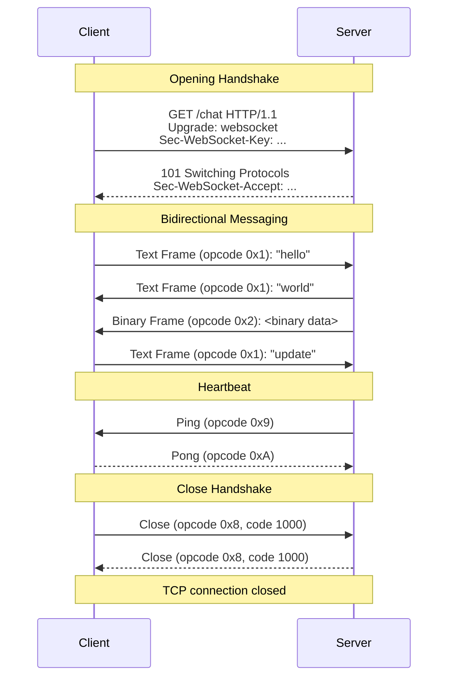
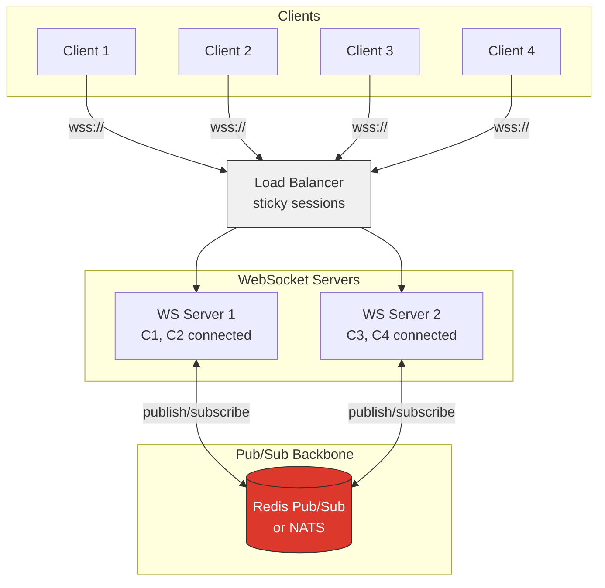

# WebSocket & Server-Sent Events — Real-Time Communication

**Date:** 2026-04-23 | **Updated:** 2026-04-23
**Tags:** `networking` `websocket` `sse` `real-time` `http`

---

## Table of Contents

- [Summary](#summary)
- [1. The Problem — Why HTTP Request/Response Falls Short](#1-the-problem--why-http-requestresponse-falls-short)
  - [1.1 Polling](#11-polling)
  - [1.2 Long-Polling](#12-long-polling)
  - [1.3 The Need for Server-Push](#13-the-need-for-server-push)
- [2. WebSocket Protocol — RFC 6455](#2-websocket-protocol--rfc-6455)
  - [2.1 HTTP Upgrade Handshake](#21-http-upgrade-handshake)
  - [2.2 Full-Duplex Communication](#22-full-duplex-communication)
  - [2.3 URL Schemes: ws:// and wss://](#23-url-schemes-ws-and-wss)
  - [2.4 Frame Format](#24-frame-format)
  - [2.5 Control Frames: Ping, Pong, Close](#25-control-frames-ping-pong-close)
- [3. WebSocket Lifecycle](#3-websocket-lifecycle)
  - [3.1 Connection States](#31-connection-states)
  - [3.2 Lifecycle Sequence Diagram](#32-lifecycle-sequence-diagram)
- [4. WebSocket in Practice](#4-websocket-in-practice)
  - [4.1 Node.js with the ws Library](#41-nodejs-with-the-ws-library)
  - [4.2 Spring Boot WebSocket with STOMP](#42-spring-boot-websocket-with-stomp)
  - [4.3 Browser WebSocket API](#43-browser-websocket-api)
  - [4.4 Handling Reconnection](#44-handling-reconnection)
- [5. Scaling WebSocket](#5-scaling-websocket)
  - [5.1 The Sticky Sessions Requirement](#51-the-sticky-sessions-requirement)
  - [5.2 Connection Limits per Server](#52-connection-limits-per-server)
  - [5.3 Horizontal Scaling with Pub/Sub](#53-horizontal-scaling-with-pubsub)
  - [5.4 Scaling Architecture Diagram](#54-scaling-architecture-diagram)
  - [5.5 Connection State Management](#55-connection-state-management)
- [6. Backpressure](#6-backpressure)
  - [6.1 What Causes Backpressure](#61-what-causes-backpressure)
  - [6.2 Client-Side: bufferedAmount](#62-client-side-bufferedamount)
  - [6.3 Server-Side: Drain Events](#63-server-side-drain-events)
  - [6.4 Flow Control Strategies](#64-flow-control-strategies)
- [7. Server-Sent Events (SSE)](#7-server-sent-events-sse)
  - [7.1 The text/event-stream Format](#71-the-textevent-stream-format)
  - [7.2 The EventSource API](#72-the-eventsource-api)
  - [7.3 Automatic Reconnection and Last-Event-ID](#73-automatic-reconnection-and-last-event-id)
  - [7.4 Named Events](#74-named-events)
  - [7.5 Keep-Alive Comments](#75-keep-alive-comments)
  - [7.6 SSE in Node.js and Spring Boot](#76-sse-in-nodejs-and-spring-boot)
- [8. SSE vs WebSocket — When to Use Which](#8-sse-vs-websocket--when-to-use-which)
- [9. WebSocket Alternatives](#9-websocket-alternatives)
  - [9.1 HTTP/2 Server Push (Deprecated)](#91-http2-server-push-deprecated)
  - [9.2 HTTP Streaming](#92-http-streaming)
  - [9.3 gRPC Streaming](#93-grpc-streaming)
  - [9.4 WebTransport (Emerging)](#94-webtransport-emerging)
- [10. Security](#10-security)
  - [10.1 Origin Checking](#101-origin-checking)
  - [10.2 Authentication Strategies](#102-authentication-strategies)
  - [10.3 WSS (WebSocket Secure)](#103-wss-websocket-secure)
  - [10.4 CSRF Considerations](#104-csrf-considerations)
  - [10.5 Rate Limiting](#105-rate-limiting)
- [Related](#related)
- [References](#references)

---

## Summary

Standard HTTP follows a request/response model: the client asks, the server answers, then the connection sits idle. For real-time features — chat, live dashboards, collaborative editing, notifications — this model wastes bandwidth (polling) or requires ugly workarounds (long-polling). WebSocket and Server-Sent Events solve this by letting the server push data to the client without waiting for a request. WebSocket gives you full-duplex, bidirectional communication over a single TCP connection. SSE gives you a simpler, unidirectional server-to-client stream over plain HTTP. This document covers both protocols in depth: the wire format, the lifecycle, practical implementation in Node.js and Spring Boot, the hard problems (scaling, backpressure, authentication), and when to pick one over the other.

---

## 1. The Problem — Why HTTP Request/Response Falls Short

### 1.1 Polling

The client sends a request on a timer (e.g., every 2 seconds). The server responds with data or an empty body.

```
Client → GET /api/messages (nothing new) ← 200 []
Client → GET /api/messages (nothing new) ← 200 []
Client → GET /api/messages (1 new msg)   ← 200 [{...}]
Client → GET /api/messages (nothing new) ← 200 []
```

**Problems:**
- Most responses carry no new data — wasted bandwidth and server CPU
- Latency is bounded by the polling interval (2s interval = up to 2s delay)
- Reducing the interval increases server load linearly
- Each request carries full HTTP headers (~500-800 bytes) for potentially zero-byte payloads

### 1.2 Long-Polling

The client sends a request. The server holds the connection open until it has data or a timeout fires. The client immediately reconnects after receiving a response.

```
Client → GET /api/messages (server holds...)
                           ...30s later, new message arrives...
         ← 200 [{...}]
Client → GET /api/messages (server holds again...)
```

**Better than polling** — near-zero latency when data arrives — but still problematic:
- Each message cycle requires a full HTTP round-trip (connection teardown, reconnect, headers again)
- Server resources are tied up holding thousands of connections waiting for data
- Ordering gets tricky when multiple events arrive in rapid succession
- Thundering herd: if a popular channel updates, all long-poll clients reconnect simultaneously

### 1.3 The Need for Server-Push

What we actually want:
1. **Server initiates** data transfer — no client polling
2. **Low overhead** — no repeated HTTP headers per message
3. **Low latency** — data arrives the instant it is available
4. **Persistent connection** — one connection, many messages

WebSocket and SSE both deliver these properties, with different tradeoffs.

---

## 2. WebSocket Protocol — RFC 6455

### 2.1 HTTP Upgrade Handshake

A WebSocket connection begins life as a normal HTTP/1.1 request with an `Upgrade` header. This reuses existing infrastructure (port 80/443, proxies, load balancers) and avoids firewall issues.

**Client request:**

```http
GET /chat HTTP/1.1
Host: example.com
Upgrade: websocket
Connection: Upgrade
Sec-WebSocket-Key: dGhlIHNhbXBsZSBub25jZQ==
Sec-WebSocket-Version: 13
Origin: https://example.com
```

**Server response:**

```http
HTTP/1.1 101 Switching Protocols
Upgrade: websocket
Connection: Upgrade
Sec-WebSocket-Accept: s3pPLMBiTxaQ9kYGzzhZRbK+xOo=
```

Key details:
- `Sec-WebSocket-Key` is a base64-encoded random 16-byte nonce
- Server computes `Sec-WebSocket-Accept` by concatenating the key with the magic GUID `258EAFA5-E914-47DA-95CA-5AB0DC85B11B`, taking the SHA-1 hash, and base64-encoding it
- This is **not authentication** — it prevents caching proxies from confusing WebSocket frames with HTTP responses
- `Sec-WebSocket-Version: 13` is the only version in active use (RFC 6455)
- After 101, the TCP connection is no longer HTTP — it carries WebSocket frames

### 2.2 Full-Duplex Communication

Once upgraded, both client and server can send frames independently and simultaneously on the same TCP connection. There is no request/response pairing — either side can send data at any time.

This is fundamentally different from HTTP (even HTTP/2 multiplexing), where the server only responds to client-initiated requests.

### 2.3 URL Schemes: ws:// and wss://

| Scheme | Transport | Default Port |
|--------|-----------|-------------|
| `ws://` | TCP (plaintext) | 80 |
| `wss://` | TLS over TCP | 443 |

**Always use `wss://` in production.** Unencrypted `ws://` connections are actively interfered with by intermediary proxies and are trivially sniffable.

### 2.4 Frame Format

Every WebSocket message is encoded as one or more **frames**. The wire format (per RFC 6455 Section 5.2):

```
 0                   1                   2                   3
 0 1 2 3 4 5 6 7 8 9 0 1 2 3 4 5 6 7 8 9 0 1 2 3 4 5 6 7 8 9 0 1
+-+-+-+-+-------+-+-------------+-------------------------------+
|F|R|R|R| opcode|M| Payload len |    Extended payload length    |
|I|S|S|S|  (4)  |A|     (7)     |            (16/64)            |
|N|V|V|V|       |S|             |   (if payload len==126/127)   |
| |1|2|3|       |K|             |                               |
+-+-+-+-+-------+-+-------------+-------------------------------+
|     Extended payload length continued, if payload len == 127  |
+-------------------------------+-------------------------------+
|                               |Masking-key, if MASK set to 1  |
+-------------------------------+-------------------------------+
| Masking-key (continued)       |          Payload Data         |
+-------------------------------+-------------------------------+
|                     Payload Data continued ...                |
+---------------------------------------------------------------+
```

**Key fields:**

| Field | Bits | Purpose |
|-------|------|---------|
| FIN | 1 | 1 = final fragment of a message |
| RSV1-3 | 3 | Reserved for extensions (e.g., `permessage-deflate` uses RSV1) |
| Opcode | 4 | Frame type: `0x1` = text, `0x2` = binary, `0x8` = close, `0x9` = ping, `0xA` = pong |
| MASK | 1 | Client-to-server frames **must** be masked; server-to-client frames **must not** |
| Payload length | 7+16/64 | 0-125 = literal length; 126 = next 2 bytes are length; 127 = next 8 bytes are length |
| Masking key | 32 | XOR key for payload (prevents cache poisoning attacks via predictable byte patterns) |

**Why client frames must be masked:** Without masking, a malicious page could send bytes that look like valid HTTP responses to intermediary proxies, poisoning their caches. The masking key makes frame bytes unpredictable to proxies that do not understand WebSocket.

### 2.5 Control Frames: Ping, Pong, Close

Control frames have opcodes >= `0x8` and a maximum payload of 125 bytes. They cannot be fragmented.

| Frame | Opcode | Purpose |
|-------|--------|---------|
| Close | `0x8` | Initiates graceful shutdown. Payload may include a 2-byte status code + optional UTF-8 reason. |
| Ping | `0x9` | Heartbeat probe. The receiver must respond with Pong. |
| Pong | `0xA` | Heartbeat response. Must echo the Ping payload. |

**Common close status codes:**

| Code | Meaning |
|------|---------|
| 1000 | Normal closure |
| 1001 | Going away (server shutting down, page navigated) |
| 1002 | Protocol error |
| 1003 | Unsupported data type |
| 1006 | Abnormal closure (no Close frame sent — connection dropped) |
| 1008 | Policy violation |
| 1009 | Message too big |
| 1011 | Unexpected server error |

---

## 3. WebSocket Lifecycle

### 3.1 Connection States

The browser `WebSocket` API defines four `readyState` values:

| Value | Constant | Meaning |
|-------|----------|---------|
| 0 | `CONNECTING` | HTTP Upgrade in progress |
| 1 | `OPEN` | Connected, ready to send/receive |
| 2 | `CLOSING` | Close frame sent, waiting for peer's close frame |
| 3 | `CLOSED` | Connection terminated |

### 3.2 Lifecycle Sequence Diagram



---

## 4. WebSocket in Practice

### 4.1 Node.js with the ws Library

The `ws` library is the standard WebSocket implementation for Node.js — fast, spec-compliant, zero dependencies.

**Server:**

```typescript
import { WebSocketServer, WebSocket } from "ws";
import { createServer } from "http";

const server = createServer();
const wss = new WebSocketServer({ server });

// Track connected clients
const clients = new Set<WebSocket>();

wss.on("connection", (ws, req) => {
  const ip = req.socket.remoteAddress;
  console.log(`Client connected from ${ip}`);
  clients.add(ws);

  ws.on("message", (data, isBinary) => {
    const message = isBinary ? data : data.toString();
    console.log(`Received: ${message}`);

    // Broadcast to all other clients
    for (const client of clients) {
      if (client !== ws && client.readyState === WebSocket.OPEN) {
        client.send(data, { binary: isBinary });
      }
    }
  });

  ws.on("close", (code, reason) => {
    console.log(`Client disconnected: ${code} ${reason}`);
    clients.delete(ws);
  });

  ws.on("error", (err) => {
    console.error(`WebSocket error: ${err.message}`);
    clients.delete(ws);
  });

  // Application-level heartbeat
  const pingInterval = setInterval(() => {
    if (ws.readyState === WebSocket.OPEN) {
      ws.ping();
    }
  }, 30_000);

  ws.on("close", () => clearInterval(pingInterval));
});

server.listen(8080, () => {
  console.log("WebSocket server listening on :8080");
});
```

**Client (Node.js):**

```typescript
import WebSocket from "ws";

const ws = new WebSocket("wss://example.com/chat");

ws.on("open", () => {
  ws.send(JSON.stringify({ type: "join", room: "general" }));
});

ws.on("message", (data) => {
  const event = JSON.parse(data.toString());
  console.log("Received:", event);
});

ws.on("pong", () => {
  // Server responded to our ping — connection is alive
});

ws.on("close", (code) => {
  console.log(`Disconnected with code ${code}`);
});
```

### 4.2 Spring Boot WebSocket with STOMP

Spring Boot uses STOMP (Simple Text Oriented Messaging Protocol) as a sub-protocol over WebSocket, giving you message routing, subscriptions, and broker integration.

**Configuration:**

```java
@Configuration
@EnableWebSocketMessageBroker
public class WebSocketConfig implements WebSocketMessageBrokerConfigurer {

    @Override
    public void configureMessageBroker(MessageBrokerRegistry config) {
        // Enable a simple in-memory broker for /topic and /queue prefixes
        config.enableSimpleBroker("/topic", "/queue");
        // Application destination prefix for @MessageMapping methods
        config.setApplicationDestinationPrefixes("/app");
    }

    @Override
    public void registerStompEndpoints(StompEndpointRegistry registry) {
        registry.addEndpoint("/ws")
                .setAllowedOrigins("https://example.com")
                .withSockJS(); // Fallback for browsers without WebSocket
    }
}
```

**Message handler:**

```java
@Controller
public class ChatController {

    @MessageMapping("/chat.send")       // Client sends to /app/chat.send
    @SendTo("/topic/messages")          // Broadcast to all subscribers
    public ChatMessage sendMessage(@Payload ChatMessage message,
                                   SimpMessageHeaderAccessor headerAccessor) {
        return ChatMessage.builder()
                .type(MessageType.CHAT)
                .sender(message.getSender())
                .content(message.getContent())
                .timestamp(Instant.now())
                .build();
    }

    @MessageMapping("/chat.join")
    @SendTo("/topic/messages")
    public ChatMessage addUser(@Payload ChatMessage message,
                               SimpMessageHeaderAccessor headerAccessor) {
        // Store username in WebSocket session
        headerAccessor.getSessionAttributes().put("username", message.getSender());
        return ChatMessage.builder()
                .type(MessageType.JOIN)
                .sender(message.getSender())
                .build();
    }
}
```

**Sending to specific users:**

```java
@Autowired
private SimpMessagingTemplate messagingTemplate;

public void notifyUser(String username, Notification notification) {
    messagingTemplate.convertAndSendToUser(
        username,
        "/queue/notifications",
        notification
    );
}
```

### 4.3 Browser WebSocket API

```javascript
const ws = new WebSocket("wss://example.com/chat");

ws.onopen = () => {
  console.log("Connected");
  ws.send(JSON.stringify({ type: "subscribe", channel: "updates" }));
};

ws.onmessage = (event) => {
  const data = JSON.parse(event.data);
  console.log("Received:", data);
};

ws.onclose = (event) => {
  console.log(`Closed: code=${event.code} reason=${event.reason} clean=${event.wasClean}`);
};

ws.onerror = (event) => {
  console.error("WebSocket error");
};
```

### 4.4 Handling Reconnection

The browser `WebSocket` API has **no built-in reconnection**. You must implement it yourself.

**Exponential backoff reconnection:**

```typescript
function createReconnectingWebSocket(url: string) {
  const MAX_RETRIES = 10;
  const BASE_DELAY_MS = 1000;
  const MAX_DELAY_MS = 30_000;
  let retryCount = 0;
  let ws: WebSocket | null = null;

  function connect() {
    ws = new WebSocket(url);

    ws.onopen = () => {
      console.log("Connected");
      retryCount = 0; // Reset on successful connection
    };

    ws.onclose = (event) => {
      if (event.code === 1000) return; // Intentional close — do not reconnect

      if (retryCount < MAX_RETRIES) {
        const delay = Math.min(
          BASE_DELAY_MS * Math.pow(2, retryCount) + Math.random() * 1000,
          MAX_DELAY_MS
        );
        retryCount++;
        console.log(`Reconnecting in ${Math.round(delay)}ms (attempt ${retryCount})`);
        setTimeout(connect, delay);
      }
    };

    ws.onerror = () => {
      ws?.close(); // Triggers onclose → reconnection
    };
  }

  connect();
  return {
    send: (data: string) => ws?.send(data),
    close: () => ws?.close(1000, "Client closing"),
  };
}
```

**Key reconnection principles:**
- Exponential backoff prevents thundering herd on server recovery
- Add jitter (random component) so clients do not all reconnect at the same instant
- Cap the maximum delay
- Reset retry count on successful connection
- Do not reconnect on intentional close (code 1000)

---

## 5. Scaling WebSocket

### 5.1 The Sticky Sessions Requirement

A WebSocket connection is a long-lived TCP connection to a specific server process. If you have three backend servers behind a load balancer, a client's initial HTTP Upgrade goes to one of them. All subsequent frames on that connection must reach the **same** server.

Strategies:
- **IP hash** — Load balancer routes by client IP. Simple but breaks with NAT/shared IPs.
- **Cookie-based** — Set a cookie during the upgrade; LB routes by cookie.
- **Connection ID** — Some LBs (HAProxy, Nginx) track the WebSocket connection after upgrade and keep it pinned.

### 5.2 Connection Limits per Server

Each WebSocket connection is an open file descriptor. Practical limits:

| Resource | Default | Tuned |
|----------|---------|-------|
| Linux file descriptors (ulimit -n) | 1,024 | 100,000+ |
| Memory per connection (Node.js ws) | ~20-50 KB | depends on buffers |
| Concurrent connections (single Node process) | ~10,000 | ~50,000-100,000 |
| Concurrent connections (single Spring Boot) | ~10,000 | ~50,000+ (Netty) |

In practice, message processing overhead matters more than raw connection count. A server broadcasting to 50K clients is doing real work per message.

### 5.3 Horizontal Scaling with Pub/Sub

The fundamental problem: a message sent to Server A needs to reach clients connected to Server B and C.

Solution: a shared pub/sub backbone.

**Redis Pub/Sub approach (Node.js):**

```typescript
import { createClient } from "redis";
import { WebSocketServer, WebSocket } from "ws";

const subscriber = createClient({ url: "redis://redis:6379" });
const publisher = createClient({ url: "redis://redis:6379" });
await subscriber.connect();
await publisher.connect();

const wss = new WebSocketServer({ port: 8080 });
const channelClients = new Map<string, Set<WebSocket>>();

// Subscribe to Redis channels
await subscriber.subscribe("chat:*", (message, channel) => {
  const clients = channelClients.get(channel);
  if (clients) {
    for (const client of clients) {
      if (client.readyState === WebSocket.OPEN) {
        client.send(message);
      }
    }
  }
});

wss.on("connection", (ws) => {
  ws.on("message", async (raw) => {
    const event = JSON.parse(raw.toString());

    if (event.type === "subscribe") {
      const channel = `chat:${event.room}`;
      if (!channelClients.has(channel)) {
        channelClients.set(channel, new Set());
      }
      channelClients.get(channel)!.add(ws);
    }

    if (event.type === "message") {
      // Publish to Redis — all servers receive it
      await publisher.publish(
        `chat:${event.room}`,
        JSON.stringify({ sender: event.sender, content: event.content })
      );
    }
  });

  ws.on("close", () => {
    for (const clients of channelClients.values()) {
      clients.delete(ws);
    }
  });
});
```

**Alternative pub/sub backends:**

| Backend | Strengths | Trade-offs |
|---------|-----------|------------|
| Redis Pub/Sub | Simple, widely deployed, low latency | No persistence, messages lost if subscriber offline |
| Redis Streams | Persistence, consumer groups, replay | More complex, higher memory |
| NATS | Extremely fast, clustering, JetStream for persistence | Another service to operate |
| Kafka | Durable, high throughput, replay | Overkill for most WebSocket use cases, higher latency |
| RabbitMQ | Routing, exchanges, AMQP features | Higher overhead per message |

### 5.4 Scaling Architecture Diagram



**Flow:** Client 1 sends a message to WS Server 1. Server 1 publishes it to Redis. Redis fans it out to all subscribers. WS Server 2 receives it and delivers it to Client 3 and Client 4.

### 5.5 Connection State Management

When a client reconnects after a disconnect, it might land on a different server. You need external state:

- **Session state** — user identity, subscriptions, permissions → store in Redis or a shared database
- **Message history** — messages the client missed while disconnected → store in Redis Streams, Kafka, or a database with a cursor
- **Presence** — which users are online → maintain in Redis with TTL-based keys, update on connect/disconnect

```typescript
// On connection: restore subscriptions from Redis
async function restoreSession(ws: WebSocket, userId: string) {
  const subscriptions = await redis.sMembers(`user:${userId}:channels`);
  for (const channel of subscriptions) {
    joinChannel(ws, channel);
  }

  // Replay missed messages
  const lastSeenId = await redis.get(`user:${userId}:lastMessageId`);
  if (lastSeenId) {
    const missed = await redis.xRange(`messages:stream`, lastSeenId, "+");
    for (const entry of missed) {
      ws.send(JSON.stringify(entry));
    }
  }
}
```

---

## 6. Backpressure

### 6.1 What Causes Backpressure

Backpressure occurs when data is produced faster than it can be consumed. In WebSocket:

- **Server → Client:** Server pushes updates (e.g., real-time market data) faster than the client can process/render
- **Client → Server:** Client streams data (e.g., file upload over WebSocket) faster than the server can write to disk/DB
- **Server → Server:** The pub/sub layer delivers messages faster than the WebSocket server can fan out to clients

Without handling, this causes unbounded memory growth in send buffers until the process crashes.

### 6.2 Client-Side: bufferedAmount

The browser `WebSocket` API exposes `ws.bufferedAmount` — the number of bytes queued for sending but not yet transmitted to the network.

```javascript
function sendWithBackpressure(ws, data) {
  const HIGH_WATER_MARK = 1024 * 1024; // 1 MB

  if (ws.bufferedAmount > HIGH_WATER_MARK) {
    console.warn("Send buffer full, dropping message or queuing");
    return false;
  }

  ws.send(data);
  return true;
}
```

### 6.3 Server-Side: Drain Events

In Node.js, `ws.send()` returns and buffers data internally. Use the callback or `drain` events to know when it is safe to send more.

```typescript
function sendToClient(ws: WebSocket, data: string): Promise<void> {
  return new Promise((resolve, reject) => {
    if (ws.readyState !== WebSocket.OPEN) {
      return reject(new Error("Connection not open"));
    }

    ws.send(data, (err) => {
      if (err) reject(err);
      else resolve();
    });
  });
}

// Batch-send with backpressure awareness
async function broadcastWithBackpressure(
  clients: Set<WebSocket>,
  data: string
) {
  const promises: Promise<void>[] = [];

  for (const client of clients) {
    // Skip slow consumers — their buffered data exceeds threshold
    if (client.bufferedAmount > 1024 * 1024) {
      console.warn("Dropping message for slow consumer");
      continue;
    }
    promises.push(sendToClient(client, data));
  }

  await Promise.allSettled(promises);
}
```

### 6.4 Flow Control Strategies

| Strategy | How it works | Best for |
|----------|-------------|----------|
| **Drop** | Skip messages for slow consumers | Live data where only latest value matters (stock tickers) |
| **Buffer + cap** | Queue messages up to a limit, then drop oldest | Chat-like systems |
| **Throttle** | Reduce send frequency to match consumer speed | Streaming telemetry |
| **Pause/resume** | Protocol-level flow control signal | Cooperative systems with custom sub-protocol |
| **Disconnect** | Kill connections that are too far behind | Protecting server resources |

---

## 7. Server-Sent Events (SSE)

### 7.1 The text/event-stream Format

SSE is a simple text-based protocol over HTTP. The server sets `Content-Type: text/event-stream` and writes a stream of events.

Each event is a block of `field: value` lines separated by a blank line:

```
id: 1
event: message
data: {"user": "alice", "text": "hello"}

id: 2
event: message
data: {"user": "bob", "text": "hi there"}

id: 3
event: notification
data: You have a new follower

```

**Fields:**

| Field | Purpose |
|-------|---------|
| `data` | Event payload. Multiple `data:` lines are concatenated with newlines. |
| `id` | Sets the last event ID. Sent back on reconnection via `Last-Event-ID` header. |
| `event` | Event type name. Without it, the event fires as `message`. |
| `retry` | Tells the client how many milliseconds to wait before reconnecting. |

### 7.2 The EventSource API

```javascript
const source = new EventSource("https://example.com/api/events");

source.onopen = () => {
  console.log("SSE connection opened");
};

source.onmessage = (event) => {
  // Fires for events without a named "event:" field
  console.log("Message:", event.data);
};

source.addEventListener("notification", (event) => {
  // Fires for events with "event: notification"
  console.log("Notification:", event.data);
});

source.onerror = (event) => {
  if (source.readyState === EventSource.CONNECTING) {
    console.log("Reconnecting...");
  } else {
    console.error("SSE error, connection closed");
    source.close();
  }
};
```

### 7.3 Automatic Reconnection and Last-Event-ID

SSE's killer feature over raw WebSocket: **built-in reconnection with resume**.

1. Connection drops
2. Browser waits `retry` milliseconds (default ~3 seconds, browser-dependent)
3. Browser reconnects, sending `Last-Event-ID: <last received id>` header
4. Server reads the header and replays missed events

```
→ GET /events HTTP/1.1
  Last-Event-ID: 42

← 200 OK
  Content-Type: text/event-stream

  id: 43
  data: event you missed

  id: 44
  data: another one
```

The server must implement the resume logic — store events with IDs and be able to replay from a given ID.

### 7.4 Named Events

Named events let you multiplex different event types over a single connection:

```
event: price-update
data: {"symbol": "AAPL", "price": 185.42}

event: trade-executed
data: {"orderId": "abc-123", "status": "filled"}

event: system
data: Maintenance window in 30 minutes
```

Client listens selectively:

```javascript
source.addEventListener("price-update", (e) => {
  updatePriceDisplay(JSON.parse(e.data));
});

source.addEventListener("trade-executed", (e) => {
  refreshOrderBook(JSON.parse(e.data));
});
```

### 7.5 Keep-Alive Comments

Lines starting with `:` are comments — ignored by the EventSource API. Servers send them as keep-alive to prevent proxies and load balancers from killing idle connections:

```
: keep-alive

id: 100
event: update
data: {"value": 42}

: keep-alive

: keep-alive
```

A common interval is every 15-30 seconds, depending on your infrastructure's idle timeout.

### 7.6 SSE in Node.js and Spring Boot

**Node.js (Express):**

```typescript
import express from "express";

const app = express();
const clients = new Set<express.Response>();

app.get("/events", (req, res) => {
  res.writeHead(200, {
    "Content-Type": "text/event-stream",
    "Cache-Control": "no-cache",
    Connection: "keep-alive",
    "X-Accel-Buffering": "no", // Disable Nginx buffering
  });

  // Resume from last event
  const lastEventId = req.headers["last-event-id"];
  if (lastEventId) {
    replayEventsSince(res, parseInt(lastEventId, 10));
  }

  clients.add(res);

  // Keep-alive comment every 20 seconds
  const keepAlive = setInterval(() => res.write(": keep-alive\n\n"), 20_000);

  req.on("close", () => {
    clearInterval(keepAlive);
    clients.delete(res);
  });
});

// Broadcast helper
function broadcast(eventType: string, data: unknown, id: number) {
  const payload =
    `id: ${id}\nevent: ${eventType}\ndata: ${JSON.stringify(data)}\n\n`;

  for (const client of clients) {
    client.write(payload);
  }
}

app.listen(3000);
```

**Spring Boot (WebFlux / reactive):**

```java
@RestController
@RequestMapping("/api/events")
public class SseController {

    private final Sinks.Many<ServerSentEvent<String>> sink =
            Sinks.many().multicast().onBackpressureBuffer(256);

    @GetMapping(produces = MediaType.TEXT_EVENT_STREAM_VALUE)
    public Flux<ServerSentEvent<String>> stream(
            @RequestHeader(value = "Last-Event-ID", required = false) String lastEventId) {

        Flux<ServerSentEvent<String>> eventStream = sink.asFlux();

        // Optional: replay missed events from lastEventId
        // In production, read from a persistent store

        Flux<ServerSentEvent<String>> keepAlive = Flux.interval(Duration.ofSeconds(20))
                .map(i -> ServerSentEvent.<String>builder()
                        .comment("keep-alive")
                        .build());

        return Flux.merge(eventStream, keepAlive);
    }

    // Called by other services to publish events
    public void publishEvent(String id, String eventType, String data) {
        sink.tryEmitNext(
                ServerSentEvent.<String>builder()
                        .id(id)
                        .event(eventType)
                        .data(data)
                        .build()
        );
    }
}
```

**Spring Boot (MVC / servlet — blocking):**

```java
@RestController
public class SseMvcController {

    private final List<SseEmitter> emitters =
            new CopyOnWriteArrayList<>();

    @GetMapping("/api/events")
    public SseEmitter stream() {
        SseEmitter emitter = new SseEmitter(0L); // No timeout
        emitters.add(emitter);
        emitter.onCompletion(() -> emitters.remove(emitter));
        emitter.onTimeout(() -> emitters.remove(emitter));
        return emitter;
    }

    public void broadcast(String eventType, Object data) {
        List<SseEmitter> dead = new ArrayList<>();
        for (SseEmitter emitter : emitters) {
            try {
                emitter.send(SseEmitter.event()
                        .name(eventType)
                        .data(data));
            } catch (IOException e) {
                dead.add(emitter);
            }
        }
        emitters.removeAll(dead);
    }
}
```

---

## 8. SSE vs WebSocket — When to Use Which

| Dimension | WebSocket | SSE |
|-----------|-----------|-----|
| **Direction** | Bidirectional (full-duplex) | Server → Client only |
| **Protocol** | Custom binary framing over TCP | Plain HTTP (text/event-stream) |
| **Connection setup** | HTTP Upgrade → 101 Switching Protocols | Standard HTTP GET response |
| **Reconnection** | Manual (you implement it) | Automatic with Last-Event-ID |
| **Data format** | Text or binary | Text only (UTF-8) |
| **Browser support** | All modern browsers | All modern browsers (except IE — dead) |
| **Proxy friendliness** | Often breaks through HTTP proxies (needs wss://) | Works through all HTTP infrastructure |
| **Max connections** | OS/server limits | Browser limits ~6 per domain (HTTP/1.1); unlimited on HTTP/2 |
| **Simplicity** | More complex (custom protocol, heartbeats) | Simpler (plain HTTP, auto-reconnect) |
| **Binary data** | Native support | Must base64-encode (wasteful) |
| **Multiplexing** | One connection = one channel (or build sub-protocol) | Named events multiplex naturally |

**Use WebSocket when:**
- You need bidirectional communication (chat, gaming, collaborative editing)
- You need binary data (audio/video streaming, file transfer)
- You need absolute minimum latency in both directions
- You are building a custom real-time protocol

**Use SSE when:**
- Data flows one direction: server → client (notifications, live feeds, dashboards)
- You want automatic reconnection and resume without custom code
- You need to work through corporate proxies that block WebSocket upgrades
- Simplicity matters more than bidirectional capability
- You are streaming LLM responses (the dominant use case for SSE in 2025-2026)

**The pragmatic default:** Start with SSE. Move to WebSocket only when you provably need bidirectional communication or binary frames. SSE is simpler, more resilient, and works through more infrastructure.

---

## 9. WebSocket Alternatives

### 9.1 HTTP/2 Server Push (Deprecated)

HTTP/2 included a server push mechanism (PUSH_PROMISE) that let the server proactively send resources the client had not requested. Chrome removed support in 2022, and no browser actively supports it. It was designed for preloading assets, not event streaming. **Do not use it for real-time communication.**

### 9.2 HTTP Streaming

A long-lived HTTP response where the server writes chunks incrementally. Similar to SSE but without the `text/event-stream` format or EventSource API:

```typescript
// Server (Node.js)
app.get("/stream", (req, res) => {
  res.writeHead(200, {
    "Content-Type": "application/json",
    "Transfer-Encoding": "chunked",
  });

  setInterval(() => {
    res.write(JSON.stringify({ time: Date.now() }) + "\n");
  }, 1000);
});
```

Used by:
- OpenAI streaming API (newline-delimited JSON over HTTP)
- NDJSON (Newline Delimited JSON) streams
- `fetch()` with `ReadableStream` for fine-grained client control

Less standardized than SSE but more flexible (supports binary, custom framing).

### 9.3 gRPC Streaming

gRPC over HTTP/2 supports four streaming modes:

| Mode | Description |
|------|-------------|
| Unary | Request → Response (like REST) |
| Server streaming | Request → Stream of responses |
| Client streaming | Stream of requests → Response |
| Bidirectional streaming | Stream ↔ Stream |

Bidirectional gRPC streaming is a strong alternative to WebSocket for service-to-service communication. It runs on HTTP/2, has built-in flow control, deadlines, and cancellation. The catch: no native browser support without grpc-web (which does not support client or bidirectional streaming).

See: [gRPC & Protocol Buffers](grpc-and-protobuf.md)

### 9.4 WebTransport (Emerging)

WebTransport is a new browser API built on HTTP/3 (QUIC). It offers:

- **Bidirectional streams** — like WebSocket, but multiplexed (no head-of-line blocking)
- **Unidirectional streams** — server → client or client → server
- **Unreliable datagrams** — UDP-like delivery for latency-sensitive data (gaming, video)
- **No head-of-line blocking** — packet loss on one stream does not stall others (unlike TCP-based WebSocket)

**Browser support (as of April 2026):** Chromium-based browsers have full support since Chrome 97. Firefox and Safari gained support in early 2026 via the Interop 2026 initiative, bringing coverage to roughly 75-80% of users. Still maturing.

```javascript
// WebTransport client (browser)
const transport = new WebTransport("https://example.com:4433/wt");
await transport.ready;

// Bidirectional stream
const stream = await transport.createBidirectionalStream();
const writer = stream.writable.getWriter();
const reader = stream.readable.getReader();

await writer.write(new TextEncoder().encode("hello"));

const { value } = await reader.read();
console.log(new TextDecoder().decode(value));
```

**When to consider:** WebTransport is the long-term successor to WebSocket for performance-critical applications (gaming, real-time collaboration, video). For now, use WebSocket (wider support) and plan a migration path.

---

## 10. Security

### 10.1 Origin Checking

The WebSocket handshake includes an `Origin` header. The server **must** validate it:

```typescript
// Node.js (ws library)
const wss = new WebSocketServer({
  server,
  verifyClient: (info) => {
    const origin = info.origin || info.req.headers.origin;
    const allowed = ["https://example.com", "https://staging.example.com"];
    return allowed.includes(origin);
  },
});
```

```java
// Spring Boot
@Override
public void registerStompEndpoints(StompEndpointRegistry registry) {
    registry.addEndpoint("/ws")
            .setAllowedOrigins("https://example.com");
}
```

**Why this matters:** Unlike AJAX (protected by CORS), a malicious page can open a WebSocket to your server. The browser sends cookies automatically. Without origin checking, you have a cross-site WebSocket hijacking vulnerability.

### 10.2 Authentication Strategies

WebSocket has **no native authentication mechanism**. The HTTP Upgrade request is your only chance to use standard HTTP auth before the protocol switches.

**Strategy 1: Token in query parameter** (simple, but token in URL logs)

```javascript
const ws = new WebSocket("wss://example.com/ws?token=eyJhbGc...");
```

```typescript
// Server
const wss = new WebSocketServer({
  server,
  verifyClient: async (info, done) => {
    const url = new URL(info.req.url!, `https://${info.req.headers.host}`);
    const token = url.searchParams.get("token");
    try {
      const user = await verifyJwt(token);
      (info.req as any).user = user; // Attach to request for later use
      done(true);
    } catch {
      done(false, 401, "Unauthorized");
    }
  },
});
```

**Strategy 2: Token in first message** (avoids URL logging)

```javascript
const ws = new WebSocket("wss://example.com/ws");
ws.onopen = () => {
  ws.send(JSON.stringify({ type: "auth", token: "eyJhbGc..." }));
};
```

Server must buffer all messages until authentication succeeds and reject the connection on failure.

**Strategy 3: Cookie-based** (works when same origin)

The browser sends cookies on the Upgrade request. The server validates the session cookie during `verifyClient`. This works naturally but limits you to same-origin or carefully configured CORS.

**Strategy 4: Subprotocol header** (cleanest for bearer tokens)

```javascript
const ws = new WebSocket("wss://example.com/ws", ["Bearer", token]);
```

The token rides in `Sec-WebSocket-Protocol` — not ideal semantically, but avoids URL logging and works with many load balancers.

### 10.3 WSS (WebSocket Secure)

**Always use WSS in production.** Beyond encryption:
- Intermediary proxies pass WSS through (TLS tunnel) but often interfere with plaintext WS
- Modern browsers may block mixed content (`wss://` from `https://` pages)
- Many corporate firewalls block non-TLS WebSocket entirely

### 10.4 CSRF Considerations

WebSocket connections from the browser **automatically include cookies**. An attacker's page can open a WebSocket to your server and the request will carry the victim's session cookie.

Defenses:
1. **Validate the Origin header** (most important)
2. **Require a CSRF token** in the Upgrade request or first message
3. **Do not rely solely on cookies** for WebSocket auth — combine with a token

### 10.5 Rate Limiting

WebSocket bypasses traditional HTTP rate limiting (the connection stays open). Implement at the message level:

```typescript
const RATE_LIMIT = 100;     // messages
const WINDOW_MS = 60_000;   // per minute
const clientRates = new Map<WebSocket, { count: number; resetAt: number }>();

function checkRateLimit(ws: WebSocket): boolean {
  const now = Date.now();
  let rate = clientRates.get(ws);

  if (!rate || now > rate.resetAt) {
    rate = { count: 0, resetAt: now + WINDOW_MS };
    clientRates.set(ws, rate);
  }

  rate.count++;
  if (rate.count > RATE_LIMIT) {
    ws.close(1008, "Rate limit exceeded");
    return false;
  }
  return true;
}
```

Also consider:
- **Connection rate limiting** — limit how many WebSocket connections a single IP/user can open
- **Payload size limiting** — reject frames above a threshold (the `ws` library supports `maxPayload`)
- **Message validation** — validate and sanitize every incoming message as untrusted input

---

## Related

- [HTTP/1.1 → HTTP/2 → HTTP/3 — The Evolution of Web Transport](http-evolution.md) — the HTTP versions that WebSocket and SSE build on top of
- [gRPC & Protocol Buffers — High-Performance RPC](grpc-and-protobuf.md) — gRPC streaming as an alternative to WebSocket for service-to-service
- [Java WebSockets](../../java/realtime/websockets.md) — deep dive into Spring WebSocket and STOMP
- [Async I/O Models](../network-programming/async-io-models.md) — the event-driven I/O model that makes holding thousands of WebSocket connections feasible
- [Load Balancing](../infrastructure/load-balancing.md) — sticky sessions, L4 vs L7, and how load balancers interact with long-lived connections

---

## References

1. [RFC 6455 — The WebSocket Protocol](https://datatracker.ietf.org/doc/html/rfc6455) — the authoritative spec for WebSocket framing, handshake, and close semantics
2. [WHATWG HTML Living Standard — Server-Sent Events](https://html.spec.whatwg.org/multipage/server-sent-events.html) — the normative spec for EventSource, event-stream format, and reconnection behavior
3. [MDN — WebSocket API](https://developer.mozilla.org/en-US/docs/Web/API/WebSocket) — browser API reference with examples and compatibility tables
4. [MDN — Using Server-Sent Events](https://developer.mozilla.org/en-US/docs/Web/API/Server-sent_events/Using_server-sent_events) — practical guide to the EventSource API and text/event-stream format
5. [ws — WebSocket implementation for Node.js](https://github.com/websockets/ws) — the standard Node.js WebSocket library, performance notes, and API documentation
6. [Spring Framework — WebSocket Support](https://docs.spring.io/spring-framework/reference/web/websocket.html) — STOMP over WebSocket, SockJS fallback, and broker relay configuration
7. [W3C — WebTransport](https://www.w3.org/TR/webtransport/) — the emerging standard for QUIC-based client-server communication
8. [Can I Use — WebTransport](https://caniuse.com/webtransport) — current browser support matrix for WebTransport
