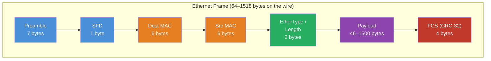
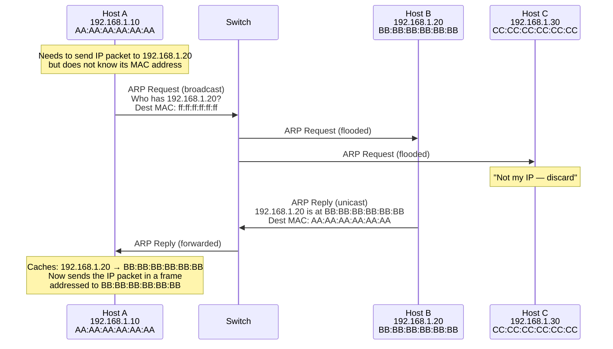
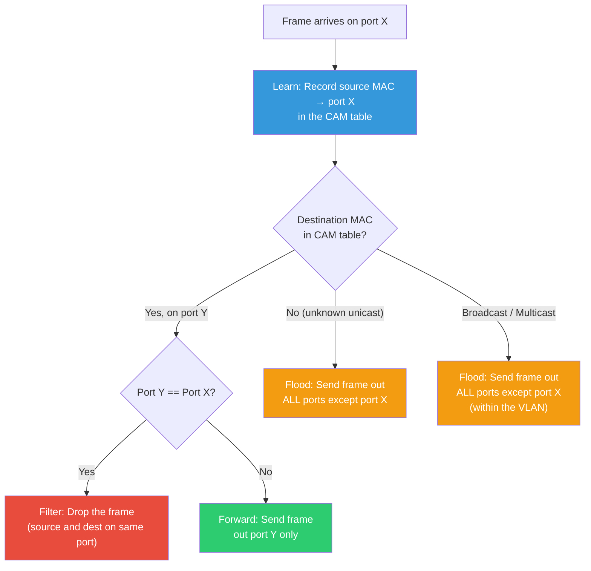

# Ethernet & Data Link — MAC Addresses, ARP, Switches, and VLANs

**Date:** 2026-04-23 | **Updated:** 2026-04-23
**Tags:** `networking` `ethernet` `data-link` `mac` `arp` `vlan` `switches`

---

## Table of Contents

- [Summary](#summary)
- [1. Ethernet Frame Structure](#1-ethernet-frame-structure)
- [2. MAC Addresses](#2-mac-addresses)
- [3. ARP — Address Resolution Protocol](#3-arp--address-resolution-protocol)
- [4. Switches and Forwarding](#4-switches-and-forwarding)
- [5. VLANs — Virtual LANs](#5-vlans--virtual-lans)
- [6. Broadcast and Collision Domains](#6-broadcast-and-collision-domains)
- [7. Layer 2 in Modern Infrastructure](#7-layer-2-in-modern-infrastructure)
- [Related](#related)
- [References](#references)

---

## Summary

Layer 2 (Data Link) is where IP addresses become irrelevant and hardware addressing takes over. Ethernet frames carry your packets across the local network using MAC addresses, ARP resolves the IP-to-MAC mapping, switches make forwarding decisions based on MAC tables, and VLANs segment broadcast domains without physical rewiring. Understanding this layer explains why Docker containers on the same bridge can talk to each other, how cloud VPCs isolate tenants, and what actually happens between your `curl` and the first router hop.

---

## 1. Ethernet Frame Structure

Defined by [IEEE 802.3](https://standards.ieee.org/ieee/802.3/10422/), the Ethernet frame is the Layer 2 protocol data unit (PDU) that wraps every IP packet traveling over a wired LAN.

### 1.1 Frame Layout



### 1.2 Field-by-Field Breakdown

| Field | Size | Purpose |
|-------|------|---------|
| **Preamble** | 7 bytes | Alternating `10101010` pattern — lets the receiver's clock synchronize with the sender's bit rate |
| **SFD** (Start Frame Delimiter) | 1 byte | `10101011` — signals the next byte is the destination MAC; marks the actual start of the frame |
| **Destination MAC** | 6 bytes | Hardware address of the intended recipient (or broadcast/multicast address) |
| **Source MAC** | 6 bytes | Hardware address of the sender — switches learn this to build their forwarding table |
| **EtherType / Length** | 2 bytes | If >= `0x0600` (1536): EtherType identifying the upper-layer protocol (`0x0800` = IPv4, `0x0806` = ARP, `0x86DD` = IPv6). If < `0x0600`: length of the payload (IEEE 802.3 raw format) |
| **Payload** | 46–1500 bytes | The encapsulated data (typically an IP packet). Padded to 46 bytes minimum if the actual data is shorter |
| **FCS** (Frame Check Sequence) | 4 bytes | CRC-32 checksum computed over Dest MAC + Src MAC + EtherType + Payload. Receiver drops the frame silently on mismatch — no retransmission at Layer 2 |

### 1.3 MTU and Jumbo Frames

**MTU (Maximum Transmission Unit)** is the largest payload an Ethernet frame can carry — **1500 bytes** by default. This is why IP fragmentation or Path MTU Discovery exists: IP packets larger than the link MTU must be fragmented or the sender must reduce packet size.

- **Standard MTU:** 1500 bytes payload → 1518 bytes total frame (add 14-byte header + 4-byte FCS)
- **Jumbo frames:** MTU up to 9000 bytes (sometimes 9216). Common in datacenter east-west traffic, storage networks (iSCSI, NFS), and high-performance computing. Not all switches/NICs support them — a single link in the path that does not support jumbo frames will silently drop oversized frames or force fragmentation.
- **Baby giant frames:** 1522 bytes total — the standard frame size when 802.1Q VLAN tagging adds 4 bytes.

> **Backend relevance:** When you see `DF` (Don't Fragment) flag set on packets and connections failing to certain hosts, the problem is often an MTU mismatch somewhere in the path. Docker overlay networks and VPN tunnels add encapsulation headers that eat into the 1500-byte MTU, causing mysterious `curl` timeouts for large responses.

### 1.4 Common EtherType Values

| EtherType | Protocol |
|-----------|----------|
| `0x0800` | IPv4 |
| `0x0806` | ARP |
| `0x86DD` | IPv6 |
| `0x8100` | 802.1Q VLAN tag |
| `0x88CC` | LLDP (Link Layer Discovery Protocol) |

---

## 2. MAC Addresses

MAC (Media Access Control) addresses are the **48-bit hardware addresses** burned into every network interface. They operate at Layer 2 — switches use them for forwarding decisions, and ARP maps IP addresses to them.

### 2.1 Structure — OUI + NIC

A MAC address is 6 bytes (48 bits), split into two halves:

```text
  OUI (24 bits)         NIC-specific (24 bits)
┌──────────────────┐  ┌──────────────────┐
│  AA : BB : CC     │  │  DD : EE : FF     │
└──────────────────┘  └──────────────────┘
  Assigned to the       Assigned by the
  manufacturer by       manufacturer to
  IEEE Registration     each individual
  Authority             interface
```

- **OUI (Organizationally Unique Identifier):** The first 3 bytes identify the manufacturer. Example: `00:50:56` = VMware, `02:42:xx` = Docker-generated.
- **NIC-specific:** The last 3 bytes are a serial number unique within that OUI.

### 2.2 Notation Formats

The same address written three ways — you will encounter all of them:

| Format | Example | Where you see it |
|--------|---------|------------------|
| Colon-separated | `00:1A:2B:3C:4D:5E` | Linux, Wireshark |
| Hyphen-separated | `00-1A-2B-3C-4D-5E` | Windows `ipconfig /all` |
| Dot-separated (Cisco) | `001A.2B3C.4D5E` | Cisco IOS CLI |

### 2.3 Special MAC Addresses

**Broadcast:** `ff:ff:ff:ff:ff:ff` — delivered to every host on the local segment. ARP requests use this. Excessive broadcast traffic is called a **broadcast storm**.

**Multicast:** The least significant bit of the first byte is `1`. Examples:
- `01:00:5E:xx:xx:xx` — IPv4 multicast (maps from `224.0.0.0/4` group addresses)
- `33:33:xx:xx:xx:xx` — IPv6 multicast (NDP uses these instead of ARP)

### 2.4 Locally Administered vs. Universally Administered

The second-least-significant bit of the first byte distinguishes these:

| Bit value | Type | Meaning |
|-----------|------|---------|
| `0` | **Universally Administered (UAA)** | Globally unique — assigned by the manufacturer |
| `1` | **Locally Administered (LAA)** | Set by software — VMs, containers, manual config |

Docker containers get locally administered MACs (the `02:42:` prefix has the LAA bit set). Kubernetes pods, VMs on hypervisors, and `macvlan` interfaces all use LAAs.

### 2.5 Inspecting MAC Addresses

```bash
# Linux — show all interfaces with MAC addresses
ip link show

# Example output:
# 2: eth0: <BROADCAST,MULTICAST,UP,LOWER_UP> mtu 1500 ...
#     link/ether 02:42:ac:11:00:02 brd ff:ff:ff:ff:ff:ff

# macOS
ifconfig en0 | grep ether

# Show the MAC/OUI vendor lookup (if ieee-data installed)
# The OUI 02:42 is Docker's locally administered prefix
```

---

## 3. ARP — Address Resolution Protocol

[RFC 826](https://www.rfc-editor.org/rfc/rfc826.html) defines ARP — the protocol that answers: "I know the IP address, but what MAC address do I send this frame to?"

### 3.1 Why ARP Exists

IP operates at Layer 3. Ethernet operates at Layer 2. When your machine wants to send an IP packet to `192.168.1.5` on the local subnet, it needs to wrap that packet in an Ethernet frame addressed to `192.168.1.5`'s MAC address. ARP provides the dynamic mapping between the two.

If the destination is **not** on the local subnet (determined by subnet mask), the host ARPs for the **default gateway's MAC** instead — the router takes it from there.

### 3.2 ARP Request / Reply Flow



**Step by step:**

1. Host A checks its **ARP cache** — no entry for `192.168.1.20`.
2. Host A broadcasts an **ARP Request**: "Who has `192.168.1.20`? Tell `192.168.1.10`." Destination MAC is `ff:ff:ff:ff:ff:ff`.
3. The switch **floods** the broadcast out all ports (except the source port).
4. Every host on the segment receives it. Only Host B (owner of `192.168.1.20`) replies.
5. Host B sends a **unicast ARP Reply** directly to Host A's MAC: "I am `192.168.1.20`, my MAC is `BB:BB:BB:BB:BB:BB`."
6. Host A stores the mapping in its ARP cache (typically 60–300 seconds TTL depending on OS).
7. Host A can now address Ethernet frames directly to Host B.

### 3.3 ARP Cache / Table

```bash
# View the ARP cache
arp -a
# Example output:
# ? (192.168.1.1) at 00:1a:2b:3c:4d:5e on en0 ifscope [ethernet]
# ? (192.168.1.20) at bb:bb:bb:bb:bb:bb on en0 ifscope [ethernet]

# Linux — more detailed view with ip command
ip neigh show
# 192.168.1.1 dev eth0 lladdr 00:1a:2b:3c:4d:5e REACHABLE
# 192.168.1.20 dev eth0 lladdr bb:bb:bb:bb:bb:bb STALE

# Flush the ARP cache (useful for debugging)
sudo ip neigh flush all
```

**ARP states** (Linux `ip neigh`):
- `REACHABLE` — recently confirmed, usable
- `STALE` — still cached but not recently confirmed; will be re-verified before next use
- `DELAY` — re-verification pending
- `FAILED` — resolution failed (no reply received)
- `INCOMPLETE` — request sent, no reply yet

### 3.4 ARP Spoofing / Poisoning

ARP has **no authentication**. Any host on the segment can send an unsolicited ARP reply claiming to be any IP address. This is **ARP spoofing** (also called ARP poisoning):

1. Attacker sends forged ARP replies: "I am `192.168.1.1` (the gateway), my MAC is `ATTACKER_MAC`."
2. Victims update their ARP cache with the attacker's MAC for the gateway IP.
3. All traffic destined for the gateway now flows through the attacker — enabling man-in-the-middle attacks.

**Mitigations:**
- **Dynamic ARP Inspection (DAI):** Switch-level feature that validates ARP packets against a DHCP snooping binding table.
- **Static ARP entries:** For critical infrastructure like the default gateway.
- **802.1X port authentication:** Ensures only authorized devices connect.
- **Encrypted transport (TLS/SSH):** Does not prevent ARP spoofing but neutralizes MITM data interception.

### 3.5 Gratuitous ARP

A **Gratuitous ARP** is an ARP request/reply where the sender and target IP are the same. Uses:

- **IP conflict detection:** "Is anyone else using my IP?" — if a reply comes back, there is a conflict.
- **ARP cache update:** After a failover (e.g., keepalived/VRRP), the new active node sends a gratuitous ARP so all hosts update their caches to point to the new MAC.
- **NIC replacement:** When a machine gets a new NIC (new MAC) but keeps the same IP.

### 3.6 ARP in Docker Bridge Networks

Docker's default `bridge` network creates a Linux bridge (`docker0`) that acts as a virtual switch. Containers get `veth` (virtual Ethernet) pairs — one end in the container's network namespace, the other attached to the bridge.

```bash
# Inspect Docker's bridge network
docker network inspect bridge

# Inside a container — see its ARP table
docker exec -it my-container ip neigh show

# On the host — see the bridge's MAC table
bridge fdb show dev docker0
```

ARP works identically on a Docker bridge as on a physical switch — containers broadcast ARP requests on the bridge, and the bridge floods them to all attached `veth` endpoints. This is why containers on the **same** Docker bridge can communicate directly, but containers on **different** bridges cannot without routing.

---

## 4. Switches and Forwarding

A network switch is a **Layer 2 device** that forwards Ethernet frames based on MAC addresses. Unlike hubs (which blindly repeat frames on all ports), switches maintain a **MAC address table** and make intelligent forwarding decisions.

### 4.1 MAC Address Table (CAM Table)

The **Content Addressable Memory (CAM) table** maps MAC addresses to physical switch ports:

| MAC Address | Port | VLAN | TTL |
|-------------|------|------|-----|
| `AA:AA:AA:AA:AA:AA` | Gi0/1 | 10 | 300s |
| `BB:BB:BB:BB:BB:BB` | Gi0/2 | 10 | 300s |
| `CC:CC:CC:CC:CC:CC` | Gi0/3 | 20 | 300s |

### 4.2 Switch Forwarding Logic — Learn, Flood, Forward, Filter



**The four actions:**

1. **Learn:** When a frame arrives, the switch records the **source MAC** and the port it arrived on. This builds the CAM table organically.
2. **Flood:** If the destination MAC is unknown (not in the CAM table), or is a broadcast/multicast address, the switch sends the frame out **all ports** except the one it arrived on (within the VLAN).
3. **Forward:** If the destination MAC is known and lives on a different port, the switch sends the frame out **only that port**.
4. **Filter:** If the destination MAC is on the same port the frame arrived on, the switch **drops** it — the destination has already seen it.

### 4.3 Store-and-Forward vs. Cut-Through

| Mode | Behavior | Latency | Error Handling |
|------|----------|---------|----------------|
| **Store-and-Forward** | Receives the entire frame, verifies FCS, then forwards | Higher (microseconds more) | Drops corrupted frames — no bad frames propagate |
| **Cut-Through** | Starts forwarding as soon as the destination MAC is read (first 14 bytes) | Lower | Forwards corrupted frames — errors propagate downstream |
| **Fragment-Free** | Waits for the first 64 bytes (minimum frame size) before forwarding | Middle ground | Catches runt frames (collision fragments) but not all errors |

Most datacenter switches use **store-and-forward**. Cut-through is used in ultra-low-latency environments (financial trading, HPC).

### 4.4 Spanning Tree Protocol (STP) — Loop Prevention

Physical network topologies often include **redundant links** for reliability. Without loop prevention, a broadcast frame would circulate endlessly, creating a **broadcast storm** that saturates bandwidth and crashes the network.

**STP** ([IEEE 802.1D](https://standards.ieee.org/ieee/802.1D/5765/)) prevents loops by:

1. **Electing a root bridge** — the switch with the lowest Bridge ID (priority + MAC).
2. **Calculating shortest path** — each switch determines its cheapest path to the root.
3. **Blocking redundant ports** — ports that would create loops are put in a **blocking** state. They do not forward traffic but continue listening to STP BPDUs (Bridge Protocol Data Units).
4. **Reconverging on failure** — if an active link fails, a blocked port transitions to forwarding. Classic STP convergence is slow (30–50 seconds). **RSTP** (Rapid STP, 802.1w) reduces this to sub-second.

> **Backend relevance:** If you see network flapping or intermittent connectivity in on-prem environments, STP reconvergence is a common culprit. In cloud environments you never deal with STP directly — the cloud provider handles it, which is one reason VPCs feel simpler.

---

## 5. VLANs — Virtual LANs

VLANs let you create **logically separate Layer 2 networks** on the same physical switch infrastructure. Hosts on different VLANs cannot communicate at Layer 2 — they need a router (Layer 3) to exchange traffic.

### 5.1 Why VLANs Exist

- **Security:** Isolate sensitive traffic (e.g., management network, PCI cardholder data) without separate physical switches.
- **Broadcast containment:** Each VLAN is its own broadcast domain. A broadcast in VLAN 10 does not reach VLAN 20.
- **Flexibility:** Move a host to a different network by changing its VLAN assignment on the switch port — no physical rewiring.

### 5.2 IEEE 802.1Q Tagging

[IEEE 802.1Q](https://standards.ieee.org/ieee/802.1Q/10323/) inserts a **4-byte tag** into the Ethernet frame between the Source MAC and the EtherType/Length field:

```text
Standard Ethernet frame:
┌─────────┬─────────┬───────────┬─────────┬─────┐
│ Dst MAC │ Src MAC │ EtherType │ Payload │ FCS │
│ 6 bytes │ 6 bytes │ 2 bytes   │ 46-1500 │ 4 B │
└─────────┴─────────┴───────────┴─────────┴─────┘

802.1Q tagged frame:
┌─────────┬─────────┬──────────────┬───────────┬─────────┬─────┐
│ Dst MAC │ Src MAC │ 802.1Q Tag   │ EtherType │ Payload │ FCS │
│ 6 bytes │ 6 bytes │ 4 bytes      │ 2 bytes   │ 46-1500 │ 4 B │
└─────────┴─────────┴──────────────┴───────────┴─────────┴─────┘

802.1Q Tag (4 bytes):
┌────────────────┬─────┬─────┬──────────────┐
│ TPID: 0x8100   │ PCP │ DEI │  VLAN ID     │
│ 16 bits        │ 3b  │ 1b  │  12 bits     │
└────────────────┴─────┴─────┴──────────────┘
```

- **TPID (Tag Protocol Identifier):** `0x8100` — identifies this as an 802.1Q frame.
- **PCP (Priority Code Point):** 3 bits — QoS priority (0–7), used for traffic prioritization (802.1p).
- **DEI (Drop Eligible Indicator):** 1 bit — marks frames that can be dropped under congestion.
- **VLAN ID (VID):** 12 bits — identifies the VLAN (0–4095). Usable range: 1–4094 (0 is reserved for priority tagging, 4095 is reserved). This gives a maximum of **4,094 VLANs** — a limitation that VXLAN solves.

### 5.3 Trunk vs. Access Ports

| Port Type | Behavior |
|-----------|----------|
| **Access port** | Belongs to a single VLAN. Frames entering are untagged; the switch internally assigns the configured VLAN. Frames leaving are stripped of the tag. End devices (servers, workstations) connect here. |
| **Trunk port** | Carries traffic for **multiple VLANs**. Frames are 802.1Q tagged so the receiving switch knows which VLAN each frame belongs to. Used for **switch-to-switch** and **switch-to-router** connections. |

A trunk port has a **native VLAN** — untagged frames on the trunk are assigned to this VLAN. Mismatched native VLANs between trunk endpoints cause silent traffic leaks.

### 5.4 Inter-VLAN Routing

Since VLANs are separate broadcast domains, hosts on different VLANs need a **Layer 3 device** (router or Layer 3 switch) to communicate.

**Router-on-a-stick:** A single physical router interface with **sub-interfaces**, one per VLAN. The trunk link carries tagged traffic to the router, which routes between VLANs.

**Layer 3 switch (SVI):** The switch itself has a **Switch Virtual Interface** (SVI) for each VLAN — an IP address that acts as the default gateway. Routing happens in hardware at wire speed.

### 5.5 VLANs Mapped to Cloud Concepts

| On-prem VLAN concept | Cloud equivalent |
|---------------------|------------------|
| VLAN | **VPC subnet** — logically isolated L2 segment |
| Inter-VLAN routing | **VPC routing tables** and **peering** |
| Access port VLAN assignment | **Security group** / **network ACL** assignment |
| Trunk port carrying multiple VLANs | **Transit gateway** / **VPC peering** carrying traffic between VPCs |
| VLAN ID limit (4094) | Not a concern — cloud uses VXLAN-like overlays internally with 16M+ segment IDs |

---

## 6. Broadcast and Collision Domains

Understanding these two concepts explains why switches replaced hubs and why VLANs exist.

### 6.1 Collision Domain

A **collision domain** is a network segment where simultaneous transmissions cause a collision (signals interfere). Only applies to **half-duplex** shared media.

- **Hub:** All ports share one collision domain. Only one device can transmit at a time (CSMA/CD).
- **Switch:** Each port is its own collision domain. Full-duplex links mean **no collisions at all** on modern switched Ethernet.

### 6.2 Broadcast Domain

A **broadcast domain** is the set of devices that receive a broadcast frame (`ff:ff:ff:ff:ff:ff`).

- **Hub:** One broadcast domain (same as the collision domain — all ports).
- **Switch (no VLANs):** All ports are in one broadcast domain. The switch floods broadcasts everywhere.
- **Switch with VLANs:** Each VLAN is a separate broadcast domain. Broadcasts stay within the VLAN.
- **Router:** Does **not** forward broadcasts. Every router interface terminates a broadcast domain.

### 6.3 Why This Matters

| Problem | Cause | Solution |
|---------|-------|----------|
| Broadcast storms | Flat L2 network with too many hosts — ARP, DHCP, and other broadcasts flood everything | Segment into VLANs |
| Security isolation | All hosts on the same L2 can sniff each other's traffic | VLANs + ACLs |
| Performance degradation | Broadcast traffic consumes bandwidth on every host's NIC | Smaller broadcast domains via VLANs or subnets |

> **Rule of thumb:** Keep broadcast domains under ~250 hosts. Beyond that, ARP and DHCP traffic alone can become noticeable overhead.

---

## 7. Layer 2 in Modern Infrastructure

Physical switches and VLANs are the foundation, but modern infrastructure virtualizes Layer 2 extensively.

### 7.1 VXLAN — Overlay Networking

[RFC 7348](https://www.rfc-editor.org/rfc/rfc7348) defines **VXLAN (Virtual eXtensible LAN)** — a tunneling protocol that encapsulates L2 Ethernet frames inside L3 UDP packets.

**Why it exists:** 802.1Q limits you to 4,094 VLANs. Cloud providers and large datacenters need millions of isolated tenant networks. VXLAN uses a **24-bit VXLAN Network Identifier (VNI)**, supporting ~16 million segments.

**How it works:**

```text
┌──────────────────── Outer (underlay) ─────────────────────┐
│ Outer Ethernet │ Outer IP │ Outer UDP │ VXLAN  │          │
│    Header      │  Header  │ (dst 4789)│ Header │          │
└────────────────┴──────────┴───────────┴────────┤          │
                                                 │          │
┌──────────────── Inner (overlay) ───────────────┤          │
│ Inner Ethernet │ Inner IP │ Payload            │          │
│    Header      │  Header  │                    │          │
└────────────────┴──────────┴────────────────────┘          │
```

- **VTEP (VXLAN Tunnel Endpoint):** The device (physical or virtual) that encapsulates/decapsulates VXLAN. Each hypervisor or top-of-rack switch runs a VTEP.
- **Underlay:** The physical IP network that carries the encapsulated traffic. Requires only IP reachability between VTEPs.
- **Overlay:** The virtual L2 network seen by VMs/containers. They think they are on the same Ethernet segment even if VTEPs are in different racks or datacenters.

### 7.2 Docker and Kubernetes Networking at Layer 2

**Docker bridge network:**

```bash
# The default bridge
ip link show docker0
# docker0: <BROADCAST,MULTICAST,UP,LOWER_UP> mtu 1500 ...
#     link/ether 02:42:d4:7e:2a:1b brd ff:ff:ff:ff:ff:ff

# Each container gets a veth pair — one end in the container, one on the bridge
bridge link show
# 5: vethf8a2b3c@if4: <BROADCAST,MULTICAST,UP,LOWER_UP> ... master docker0

# See what containers are connected to the bridge
docker network inspect bridge --format '{{range .Containers}}{{.Name}}: {{.IPv4Address}} {{.MacAddress}}{{"\n"}}{{end}}'
```

**How it works:**
1. Docker creates a **Linux bridge** (`docker0`) — a virtual Layer 2 switch in the kernel.
2. Each container gets a **veth pair** — a virtual Ethernet cable. One end (`eth0`) lives in the container's network namespace; the other end attaches to the bridge.
3. ARP, MAC learning, and flooding happen exactly like a physical switch.
4. The host acts as the **default gateway** for container traffic leaving the bridge (NAT via iptables).

**Kubernetes CNI:**

Kubernetes uses **Container Network Interface (CNI)** plugins that implement various L2/L3 strategies:

| CNI Plugin | L2 Strategy |
|-----------|-------------|
| **Flannel (VXLAN mode)** | VXLAN overlay — each node is a VTEP, pods get an overlay L2 segment |
| **Calico** | Pure L3 routing (BGP) — no L2 overlay, uses proxy ARP |
| **Cilium** | eBPF-based — can bypass traditional L2 bridge entirely for pod-to-pod traffic |
| **Weave** | VXLAN or custom encapsulation with encryption option |

### 7.3 Cloud VPC Networking at Layer 2

Cloud providers (AWS, GCP, Azure) do not expose real Ethernet to tenants. Instead:

- **Virtual switches** in the hypervisor handle MAC learning and forwarding for instances within a subnet.
- **ARP is intercepted** — the hypervisor answers ARP requests on behalf of other instances, preventing broadcast storms.
- **VXLAN or proprietary encapsulation** (AWS uses a custom mapping service, GCP uses Andromeda) carries traffic between hypervisors.
- **Security groups** operate partly at L2 — they filter traffic before it ever reaches the instance's virtual NIC.

```bash
# AWS — verify the instance sees a virtual MAC
# Inside an EC2 instance:
ip link show eth0
# eth0: <BROADCAST,MULTICAST,UP,LOWER_UP> mtu 9001 ...
#     link/ether 02:a3:c7:5e:99:f0 brd ff:ff:ff:ff:ff:ff
# Note: MTU 9001 — AWS uses jumbo frames within the VPC
```

> **Debugging tip:** If a container cannot reach another container on a different node, check:
> 1. `ip neigh show` — is ARP resolving?
> 2. `bridge fdb show` — is the MAC in the bridge's forwarding table?
> 3. MTU — does the overlay encapsulation push frames over the path MTU?
> 4. Security groups / iptables — is traffic being dropped before or after L2?

---

## Related

- [OSI & TCP/IP Models](osi-and-tcp-ip-models.md) — where Ethernet and the Data Link layer sit in the full protocol stack
- [IP Addressing & Subnetting](ip-addressing-and-subnetting.md) — the Layer 3 addressing that ARP maps down to Layer 2 MACs

---

## References

1. [IEEE 802.3 — Ethernet Standard](https://standards.ieee.org/ieee/802.3/10422/) — the authoritative specification for Ethernet frame format and physical layer
2. [RFC 826 — An Ethernet Address Resolution Protocol](https://www.rfc-editor.org/rfc/rfc826.html) — the original ARP specification (Internet Standard STD 37)
3. [IEEE 802.1Q — Virtual Bridged Local Area Networks](https://standards.ieee.org/ieee/802.1Q/10323/) — VLAN tagging specification
4. [RFC 7348 — Virtual eXtensible Local Area Network (VXLAN)](https://www.rfc-editor.org/rfc/rfc7348) — VXLAN overlay networking framework
5. [RFC 5227 — IPv4 Address Conflict Detection](https://www.rfc-editor.org/rfc/rfc5227) — formalizes Gratuitous ARP for conflict detection
6. [Ethernet frame — Wikipedia](https://en.wikipedia.org/wiki/Ethernet_frame) — accessible reference with diagrams of frame variants
7. [Docker Networking Overview](https://docs.docker.com/network/) — official documentation on bridge, host, overlay, and macvlan drivers
8. [Kubernetes Cluster Networking](https://kubernetes.io/docs/concepts/cluster-administration/networking/) — CNI model and network requirements for pod-to-pod communication
