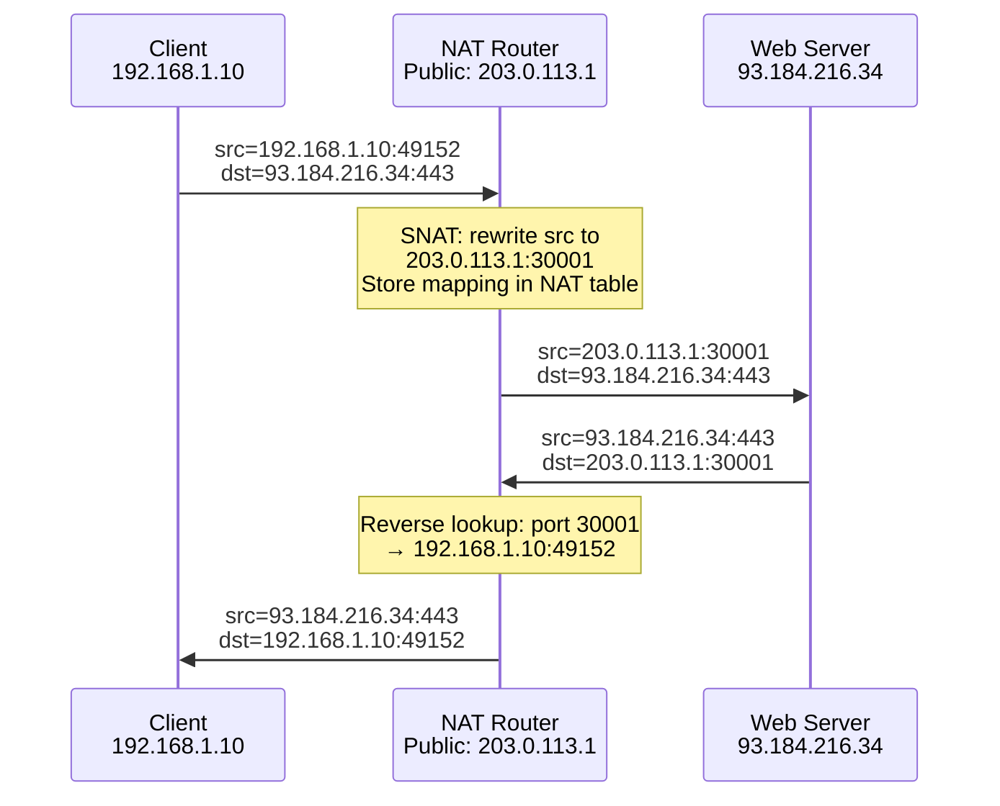

# IP Addressing & Subnetting — IPv4, IPv6, CIDR, and NAT

**Date:** 2026-04-23 | **Updated:** 2026-04-23
**Tags:** `networking` `ip` `subnetting` `ipv4` `ipv6` `cidr` `nat`

---

## Table of Contents

- [Summary](#summary)
- [1 — IPv4 Addressing](#1--ipv4-addressing)
  - [1.1 32-Bit Structure & Binary Representation](#11-32-bit-structure--binary-representation)
  - [1.2 Historical Address Classes (A/B/C/D/E)](#12-historical-address-classes-abcde)
  - [1.3 Special Addresses](#13-special-addresses)
- [2 — Subnet Masks & CIDR](#2--subnet-masks--cidr)
  - [2.1 What a Subnet Mask Does](#21-what-a-subnet-mask-does)
  - [2.2 CIDR Notation](#22-cidr-notation)
  - [2.3 Calculating Network & Host Portions](#23-calculating-network--host-portions)
  - [2.4 Subnetting with Binary Math](#24-subnetting-with-binary-math)
  - [2.5 CIDR Reference Table](#25-cidr-reference-table)
- [3 — Private vs Public Ranges](#3--private-vs-public-ranges)
  - [3.1 RFC 1918 Private Ranges](#31-rfc-1918-private-ranges)
  - [3.2 Other Reserved Ranges](#32-other-reserved-ranges)
- [4 — NAT & PAT](#4--nat--pat)
  - [4.1 Why NAT Exists](#41-why-nat-exists)
  - [4.2 SNAT, DNAT, and PAT](#42-snat-dnat-and-pat)
  - [4.3 NAT Translation Flow](#43-nat-translation-flow)
  - [4.4 NAT Traversal — STUN, TURN, ICE](#44-nat-traversal--stun-turn-ice)
- [5 — IPv6](#5--ipv6)
  - [5.1 128-Bit Addresses & Notation](#51-128-bit-addresses--notation)
  - [5.2 Address Types](#52-address-types)
  - [5.3 Dual-Stack & Transition Mechanisms](#53-dual-stack--transition-mechanisms)
  - [5.4 Why Adoption Is Slow](#54-why-adoption-is-slow)
- [6 — Subnetting in Practice](#6--subnetting-in-practice)
  - [6.1 VLSM & Supernetting](#61-vlsm--supernetting)
  - [6.2 Docker Networking](#62-docker-networking)
  - [6.3 Kubernetes Pod & Service CIDRs](#63-kubernetes-pod--service-cidrs)
  - [6.4 Cloud VPC Subnet Design](#64-cloud-vpc-subnet-design)
- [Related](#related)
- [References](#references)

---

## Summary

Every packet on the internet carries a source and destination IP address — a logical identifier that determines where data comes from and where it goes. This document covers IPv4's 32-bit addressing, subnet masks and CIDR notation for carving networks into right-sized pieces, the private/public split enabled by NAT, IPv6's 128-bit successor, and how all of this applies in Docker, Kubernetes, and cloud VPC design.

---

## 1 — IPv4 Addressing

[RFC 791](https://datatracker.ietf.org/doc/html/rfc791) (September 1981) defines the Internet Protocol version 4 — the addressing scheme that still carries the majority of internet traffic.

### 1.1 32-Bit Structure & Binary Representation

An IPv4 address is a 32-bit unsigned integer, written in **dotted-decimal** as four octets separated by periods:

```
Dotted decimal:  192.168.1.42
Binary:          11000000.10101000.00000001.00101010
Hex:             C0.A8.01.2A
```

Each octet ranges from `0` to `255` (8 bits). The total address space is 2^32 = **4,294,967,296** addresses.

**Converting decimal to binary (quick method):**

```
128  64  32  16   8   4   2   1     ← powers of 2
 1    1   0   0   0   0   0   0     = 192 (128+64)
 1    0   1   0   1   0   0   0     = 168 (128+32+8)
 0    0   0   0   0   0   0   1     = 1
 0    0   1   0   1   0   1   0     = 42  (32+8+2)
```

### 1.2 Historical Address Classes (A/B/C/D/E)

Before CIDR, addresses were allocated in rigid classes. This system is **obsolete for allocation** but still referenced in documentation and legacy configs:

| Class | First Octet Range | Default Mask | Network Bits | Host Bits | Networks       | Hosts/Network    |
|-------|-------------------|-------------|-------------|----------|----------------|------------------|
| A     | 1–126             | /8          | 8           | 24       | 126            | 16,777,214       |
| B     | 128–191           | /16         | 16          | 16       | 16,384         | 65,534           |
| C     | 192–223           | /24         | 24          | 8        | 2,097,152      | 254              |
| D     | 224–239           | —           | —           | —        | Multicast      | —                |
| E     | 240–255           | —           | —           | —        | Reserved/Experimental | —          |

**Why this matters today:** You will still see "Class A private range" or "Class C subnet" in documentation. Understand the terminology, but always think in CIDR prefixes, not classes.

### 1.3 Special Addresses

| Address              | Purpose                                                                 |
|----------------------|-------------------------------------------------------------------------|
| `0.0.0.0`           | "This host on this network" — used as source before DHCP assigns an IP  |
| `0.0.0.0/0`         | Default route — matches all destinations                                |
| `127.0.0.0/8`       | Loopback — `127.0.0.1` is "localhost"; traffic never leaves the host    |
| `255.255.255.255`   | Limited broadcast — all hosts on the local network segment              |
| `169.254.0.0/16`    | Link-local (APIPA) — self-assigned when DHCP fails                      |
| `224.0.0.0/4`       | Multicast range                                                         |

---

## 2 — Subnet Masks & CIDR

### 2.1 What a Subnet Mask Does

A subnet mask divides an IP address into two parts:

```
IP Address:    192.168.  1. 42       11000000.10101000.00000001.00101010
Subnet Mask:   255.255.255.  0       11111111.11111111.11111111.00000000
               ─────────────────     ────────────────────────────────────
               Network portion ↑     ↑ Host portion
```

**Bitwise AND** of the IP and mask yields the **network address**:

```
  11000000.10101000.00000001.00101010   (192.168.1.42)
& 11111111.11111111.11111111.00000000   (255.255.255.0)
= 11000000.10101000.00000001.00000000   (192.168.1.0)  ← network address
```

Two hosts can communicate directly (without routing) only if they share the same network address under the same mask.

### 2.2 CIDR Notation

[RFC 4632](https://datatracker.ietf.org/doc/html/rfc4632) formalized **Classless Inter-Domain Routing** (CIDR), replacing classful allocation. Instead of fixed class boundaries, the prefix length after the slash tells you exactly how many bits are the network portion:

```
192.168.1.0/24
             ^^
             24 bits = network, 8 bits = host
```

### 2.3 Calculating Network & Host Portions

Given a CIDR prefix `/n`:

- **Network bits:** `n`
- **Host bits:** `32 - n`
- **Total addresses in block:** `2^(32 - n)`
- **Usable host addresses:** `2^(32 - n) - 2` (subtract network address and broadcast address)

Example — `/26`:

```
Host bits:       32 - 26 = 6
Total addresses: 2^6 = 64
Usable hosts:    64 - 2 = 62
Subnet mask:     11111111.11111111.11111111.11000000 = 255.255.255.192
```

### 2.4 Subnetting with Binary Math

**Problem:** Split `10.0.0.0/24` into 4 equal subnets.

```
Original: 10.0.0.0/24     → 256 addresses, 254 usable hosts
Need:     4 subnets        → borrow 2 bits (2^2 = 4)
New mask: /24 + 2 = /26   → 64 addresses per subnet, 62 usable hosts

Subnet 0: 10.0.0.0/26     hosts 10.0.0.1   – 10.0.0.62    broadcast 10.0.0.63
Subnet 1: 10.0.0.64/26    hosts 10.0.0.65  – 10.0.0.126   broadcast 10.0.0.127
Subnet 2: 10.0.0.128/26   hosts 10.0.0.129 – 10.0.0.190   broadcast 10.0.0.191
Subnet 3: 10.0.0.192/26   hosts 10.0.0.193 – 10.0.0.254   broadcast 10.0.0.255
```

**Binary breakdown for subnet boundaries:**

```
10.0.0.  0  = 10.0.0.00|000000   ← subnet 0 (bits after | are host bits)
10.0.0. 64  = 10.0.0.01|000000   ← subnet 1
10.0.0.128  = 10.0.0.10|000000   ← subnet 2
10.0.0.192  = 10.0.0.11|000000   ← subnet 3
                     ^^
                     borrowed bits (subnet ID)
```

### 2.5 CIDR Reference Table

| CIDR  | Subnet Mask       | Total Addresses | Usable Hosts | Common Use Case                          |
|-------|-------------------|-----------------|--------------|------------------------------------------|
| /32   | 255.255.255.255   | 1               | 1            | Single host route, loopback interface    |
| /31   | 255.255.255.254   | 2               | 2*           | Point-to-point links (RFC 3021)          |
| /30   | 255.255.255.252   | 4               | 2            | Point-to-point links (traditional)       |
| /28   | 255.255.255.240   | 16              | 14           | Small office, DMZ                        |
| /26   | 255.255.255.192   | 64              | 62           | Department subnet                        |
| /24   | 255.255.255.0     | 256             | 254          | Standard LAN, most common subnet         |
| /22   | 255.255.252.0     | 1,024           | 1,022        | Medium campus network                    |
| /20   | 255.255.240.0     | 4,096           | 4,094        | Large subnet, cloud VPC                  |
| /16   | 255.255.0.0       | 65,536          | 65,534       | Docker default bridge, large private net |
| /12   | 255.240.0.0       | 1,048,576       | 1,048,574    | 172.16.0.0/12 private range              |
| /8    | 255.0.0.0         | 16,777,216      | 16,777,214   | 10.0.0.0/8 private range                 |
| /0    | 0.0.0.0           | 4,294,967,296   | —            | Default route (all of IPv4)              |

*`/31` has no broadcast — both addresses are usable per [RFC 3021](https://datatracker.ietf.org/doc/html/rfc3021).

---

## 3 — Private vs Public Ranges

### 3.1 RFC 1918 Private Ranges

[RFC 1918](https://datatracker.ietf.org/doc/html/rfc1918) (February 1996) reserves three address blocks that are **never routed on the public internet**:

| Block              | CIDR            | Address Count | Old Class Equivalent |
|--------------------|-----------------|--------------|----------------------|
| `10.0.0.0`        | `10.0.0.0/8`    | 16,777,216   | 1 Class A            |
| `172.16.0.0`      | `172.16.0.0/12` | 1,048,576    | 16 Class B           |
| `192.168.0.0`     | `192.168.0.0/16`| 65,536       | 256 Class C          |

**Why they exist:** IPv4's 4.3 billion addresses were not enough. Private ranges let millions of organizations reuse the same addresses internally, with NAT translating to public IPs at the network edge. This was the stopgap that delayed IPv4 exhaustion long enough for IPv6 development.

**What you see in practice:**
- `10.x.x.x` — cloud VPCs (AWS, GCP), large enterprise, Kubernetes pod CIDRs
- `172.16-31.x.x` — Docker default bridge (`172.17.0.0/16`), mid-size corporate nets
- `192.168.x.x` — home routers, small office

### 3.2 Other Reserved Ranges

| Range               | Purpose                                                             |
|----------------------|---------------------------------------------------------------------|
| `127.0.0.0/8`       | Loopback — all 16M addresses loop back to the host                 |
| `169.254.0.0/16`    | Link-local — auto-configured when no DHCP server responds (APIPA)  |
| `100.64.0.0/10`     | Carrier-Grade NAT (CGN) — [RFC 6598](https://datatracker.ietf.org/doc/html/rfc6598), ISPs' internal NAT layer |
| `198.18.0.0/15`     | Benchmarking — network device testing                               |
| `192.0.2.0/24`      | Documentation (TEST-NET-1) — safe for examples                     |
| `203.0.113.0/24`    | Documentation (TEST-NET-3) — safe for examples                     |

---

## 4 — NAT & PAT

### 4.1 Why NAT Exists

With only 4.3B public IPv4 addresses and billions of devices, every device cannot have a unique public IP. **Network Address Translation** (NAT) lets an entire private network share one (or a few) public IP addresses. Your home router is a NAT device — it rewrites packet headers so that all your devices appear as a single public IP to the outside world.

### 4.2 SNAT, DNAT, and PAT

| Type   | Direction                     | What Gets Rewritten           | Example                                         |
|--------|-------------------------------|-------------------------------|--------------------------------------------------|
| **SNAT** | Outbound (source)           | Source IP                     | Pod `10.244.1.5` → public `203.0.113.1`          |
| **DNAT** | Inbound (destination)       | Destination IP                | Public `203.0.113.1:443` → internal `10.0.1.10`  |
| **PAT**  | Outbound (source + port)    | Source IP **and** source port | Many hosts share one IP, distinguished by port    |

**PAT** (Port Address Translation), also called **NAPT** or **IP Masquerading**, is the most common form. Your router assigns each outbound connection a unique source port, creating a mapping table:

```
Internal              NAT Table Entry              External
───────────           ─────────────────            ────────────
192.168.1.10:49152 →  203.0.113.1:30001        →  93.184.216.34:443
192.168.1.11:52300 →  203.0.113.1:30002        →  93.184.216.34:443
192.168.1.10:49153 →  203.0.113.1:30003        →  151.101.1.69:443
```

When a response arrives at `203.0.113.1:30001`, the router looks up port `30001` in the NAT table and forwards to `192.168.1.10:49152`.

### 4.3 NAT Translation Flow



### 4.4 NAT Traversal — STUN, TURN, ICE

NAT breaks the end-to-end principle: an external host cannot initiate a connection to a private IP. This is problematic for peer-to-peer protocols (VoIP, WebRTC, gaming).

| Protocol | What It Does | When Used |
|----------|-------------|-----------|
| **STUN** (Session Traversal Utilities for NAT) | Client asks a public STUN server "what is my public IP and port?" — learns its external mapping | Works when NAT is "cone-type" (most home routers) |
| **TURN** (Traversal Using Relays around NAT) | Traffic is relayed through a public TURN server when direct connection fails | Fallback — symmetric NAT, strict firewalls |
| **ICE** (Interactive Connectivity Establishment) | Framework that tries STUN first, falls back to TURN, picks the best path | WebRTC uses ICE by default |

**Backend relevance:** If you build any real-time feature (video calls, collaborative editing with WebRTC data channels), you need a STUN server (cheap/free) and a TURN server (bandwidth-expensive fallback). Services like Twilio, Cloudflare, and open-source coturn handle this.

---

## 5 — IPv6

### 5.1 128-Bit Addresses & Notation

[RFC 8200](https://datatracker.ietf.org/doc/html/rfc8200) (July 2017) defines IPv6, which uses **128-bit addresses** — enough for 2^128 (approximately 3.4 x 10^38) unique addresses.

**Notation rules:**

```
Full form:       2001:0db8:0000:0000:0000:0000:0000:0001
                 ^^^^ ^^^^ ^^^^ ^^^^ ^^^^ ^^^^ ^^^^ ^^^^
                 8 groups of 4 hex digits, separated by colons

Rule 1 — Drop leading zeros within each group:
                 2001:db8:0:0:0:0:0:1

Rule 2 — Replace ONE longest run of consecutive all-zero groups with :::
                 2001:db8::1

Combined:        2001:db8::1
```

**Important:** `::` can only appear **once** in an address. `2001:db8::1::2` is invalid because the parser cannot determine how many zero groups each `::` represents.

### 5.2 Address Types

| Type             | Prefix        | Example                       | Purpose                              |
|------------------|---------------|-------------------------------|--------------------------------------|
| Global Unicast   | `2000::/3`    | `2001:db8:abcd::1`           | Public, routable (like public IPv4)   |
| Link-Local       | `fe80::/10`   | `fe80::1`                     | Auto-configured, single link only     |
| Unique Local     | `fc00::/7`    | `fd12:3456:789a::1`          | Private (like RFC 1918, but rarely NAT'd) |
| Multicast        | `ff00::/8`    | `ff02::1` (all nodes)         | One-to-many                           |
| Loopback         | `::1/128`     | `::1`                         | Equivalent to `127.0.0.1`             |
| Unspecified      | `::/128`      | `::`                          | Equivalent to `0.0.0.0`              |

**No broadcast in IPv6.** Multicast and anycast replace broadcast behavior entirely.

### 5.3 Dual-Stack & Transition Mechanisms

Full IPv6 migration requires every device, router, ISP, and service to support it. Since that takes decades, transition mechanisms exist:

| Mechanism     | How It Works                                                        |
|---------------|---------------------------------------------------------------------|
| **Dual-Stack** | Host runs both IPv4 and IPv6 stacks simultaneously — preferred approach |
| **NAT64**      | Translates IPv6 packets to IPv4 so IPv6-only clients reach IPv4 servers |
| **DNS64**      | Synthesizes AAAA records for IPv4-only domains, used with NAT64     |
| **6to4**       | Encapsulates IPv6 in IPv4 tunnels — largely deprecated              |
| **Teredo**     | IPv6 tunneling through NAT — deprecated, was Windows-centric        |

**For backend developers:** Ensure your servers bind to `::` (dual-stack) or explicitly bind both `0.0.0.0` and `::`. Node.js `net.createServer()` on Linux defaults to dual-stack when binding to `::`. Test with `curl -6` and `curl -4`.

### 5.4 Why Adoption Is Slow

As of 2025-2026, Google reports roughly 45% of traffic reaching its services over IPv6. Adoption is slow because:

1. **NAT works "well enough"** — RFC 1918 + PAT deferred the urgency
2. **Cost of transition** — every router, firewall, ACL, monitoring tool, and application must be updated
3. **Dual-stack complexity** — running two protocols doubles operational surface
4. **ISP inertia** — many business ISPs lag behind consumer providers
5. **Application assumptions** — code that parses or stores IPs as `x.x.x.x` breaks with IPv6

**Practical advice:** Always store IPs as strings, never as 32-bit integers. Use libraries that handle both families. Test your services on IPv6 — cloud load balancers increasingly front IPv6 traffic.

---

## 6 — Subnetting in Practice

### 6.1 VLSM & Supernetting

**VLSM (Variable Length Subnet Masking)** lets you assign different prefix lengths to different subnets within the same network, right-sizing each:

```
Given: 10.0.0.0/24 (256 addresses)

Department A needs 100 hosts → /25 (128 addresses, 126 usable)
  → 10.0.0.0/25     (10.0.0.1 – 10.0.0.126)

Department B needs 50 hosts  → /26 (64 addresses, 62 usable)
  → 10.0.0.128/26   (10.0.0.129 – 10.0.0.190)

Point-to-point link needs 2  → /30 (4 addresses, 2 usable)
  → 10.0.0.192/30   (10.0.0.193 – 10.0.0.194)

Remaining: 10.0.0.196/30 through 10.0.0.252/30 — available for future use
```

**Supernetting (route aggregation)** is the inverse — combining contiguous smaller networks into a single larger prefix to shrink routing tables:

```
Four /24 networks:
  10.1.0.0/24
  10.1.1.0/24
  10.1.2.0/24
  10.1.3.0/24

Supernet: 10.1.0.0/22  (one route instead of four)
```

### 6.2 Docker Networking

Docker uses subnetting extensively:

```
Default bridge network (docker0):
  Subnet: 172.17.0.0/16     ← 65,534 usable addresses
  Gateway: 172.17.0.1       ← the docker0 bridge interface on the host
  Container 1: 172.17.0.2
  Container 2: 172.17.0.3

User-defined bridge network:
  docker network create --subnet=10.10.0.0/24 my-app
  Container 1: 10.10.0.2
  Container 2: 10.10.0.3
```

**Common pitfall:** Docker's `172.17.0.0/16` default frequently overlaps with corporate VPN ranges or cloud internal networks. If you SSH into a remote server and lose connectivity, check for subnet collisions with `ip route`. Fix by configuring `/etc/docker/daemon.json`:

```json
{
  "default-address-pools": [
    { "base": "10.200.0.0/16", "size": 24 }
  ]
}
```

### 6.3 Kubernetes Pod & Service CIDRs

Kubernetes allocates two separate CIDR ranges:

| CIDR                | Purpose                                | Typical Default          |
|---------------------|----------------------------------------|--------------------------|
| **Pod CIDR**        | IP for every pod in the cluster        | `10.244.0.0/16` (Flannel), `10.42.0.0/16` (RKE) |
| **Service CIDR**    | Virtual IPs for Kubernetes Services    | `10.96.0.0/12` (kubeadm), `10.43.0.0/16` (RKE) |
| **Node Pod CIDR**   | Per-node slice of the pod CIDR         | `/24` per node (256 pods max per node) |

**How it works:**

```
Cluster Pod CIDR: 10.244.0.0/16

Node 1 gets: 10.244.0.0/24   → pods get 10.244.0.2, 10.244.0.3, ...
Node 2 gets: 10.244.1.0/24   → pods get 10.244.1.2, 10.244.1.3, ...
Node 3 gets: 10.244.2.0/24   → pods get 10.244.2.2, 10.244.2.3, ...

With /16 cluster CIDR and /24 per node:
  Max nodes: 256 (2^8 subnet bits)
  Max pods per node: 254 (but kubelet default --max-pods=110)
```

**Service CIDR** is entirely virtual — these IPs exist only in iptables/IPVS rules, not on any network interface. `kube-proxy` translates Service IPs to actual pod IPs.

### 6.4 Cloud VPC Subnet Design

AWS and GCP VPCs use RFC 1918 ranges with subnetting as the foundation of network isolation:

**AWS VPC example:**

```
VPC CIDR: 10.0.0.0/16  (65,536 addresses)

├── Public Subnets (internet-facing, NAT gateway, ALB)
│   ├── us-east-1a: 10.0.0.0/20   (4,096 addresses)
│   ├── us-east-1b: 10.0.16.0/20  (4,096 addresses)
│   └── us-east-1c: 10.0.32.0/20  (4,096 addresses)
│
├── Private Subnets (application servers, ECS/EKS)
│   ├── us-east-1a: 10.0.48.0/20  (4,096 addresses)
│   ├── us-east-1b: 10.0.64.0/20  (4,096 addresses)
│   └── us-east-1c: 10.0.80.0/20  (4,096 addresses)
│
└── Data Subnets (RDS, ElastiCache — no internet route)
    ├── us-east-1a: 10.0.96.0/20  (4,096 addresses)
    ├── us-east-1b: 10.0.112.0/20 (4,096 addresses)
    └── us-east-1c: 10.0.128.0/20 (4,096 addresses)
```

**Design principles:**

1. **Reserve space** — AWS reserves 5 IPs per subnet (network, router, DNS, future, broadcast). A `/20` gives 4,091 usable, not 4,094.
2. **Plan for growth** — start with a `/16` VPC even if you only need a few subnets today. You cannot resize a VPC CIDR easily (you can add secondary CIDRs, but it complicates routing).
3. **Avoid overlaps** — if you VPC-peer or use a VPN to connect to other networks, CIDRs must not overlap. This is the #1 headache in multi-account AWS setups.
4. **Use /20 subnets** — good balance between having enough IPs (4k) and leaving room for many subnets in a /16.
5. **Separate by function and AZ** — public, private, and data tiers across availability zones for fault isolation.

---

## Related

- [OSI & TCP/IP Models](osi-and-tcp-ip-models.md)
- [Ethernet & Data Link](ethernet-and-data-link.md)

## References

1. [RFC 791 — Internet Protocol (IPv4)](https://datatracker.ietf.org/doc/html/rfc791) — The original IPv4 specification (1981)
2. [RFC 1918 — Address Allocation for Private Internets](https://datatracker.ietf.org/doc/html/rfc1918) — Defines the three private address ranges (1996)
3. [RFC 4632 — Classless Inter-Domain Routing (CIDR)](https://datatracker.ietf.org/doc/html/rfc4632) — The CIDR standard that replaced classful addressing (2006)
4. [RFC 8200 — Internet Protocol, Version 6 (IPv6) Specification](https://datatracker.ietf.org/doc/html/rfc8200) — Current IPv6 standard (2017)
5. [RFC 6598 — IANA-Reserved IPv4 Prefix for Shared Address Space (CGN)](https://datatracker.ietf.org/doc/html/rfc6598) — Carrier-Grade NAT range 100.64.0.0/10
6. [Docker Networking Overview](https://docs.docker.com/engine/network/) — Docker's bridge, overlay, and macvlan network drivers
7. [Kubernetes Service ClusterIP Allocation](https://kubernetes.io/docs/concepts/services-networking/cluster-ip-allocation/) — How K8s assigns Service IPs from the service CIDR
8. [AWS VPC Sizing](https://docs.aws.amazon.com/vpc/latest/userguide/vpc-cidr-blocks.html) — AWS guidance on VPC and subnet CIDR blocks
