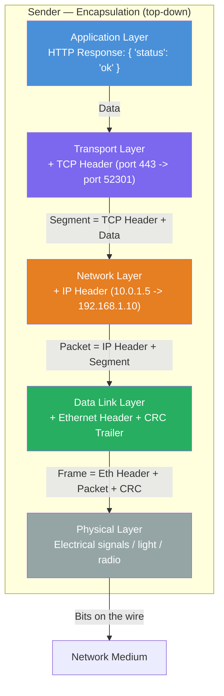
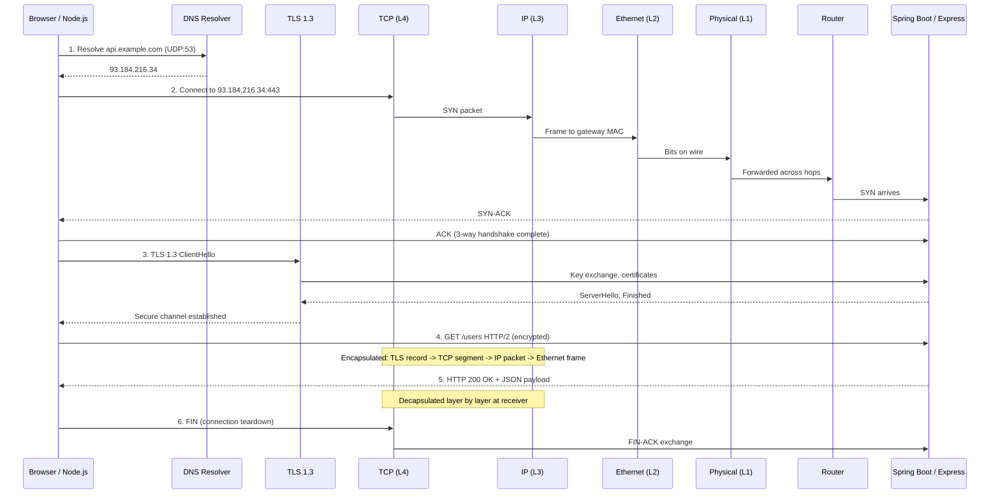

# OSI & TCP/IP Models — Layers, Encapsulation, and Protocol Mapping

**Date:** 2026-04-23 | **Updated:** 2026-04-23
**Tags:** `networking` `osi` `tcp-ip` `protocols` `layers`

---

## Table of Contents

- [Summary](#summary)
- [Why Layered Models Exist](#why-layered-models-exist)
- [The OSI 7-Layer Model](#the-osi-7-layer-model)
  - [Layer 1 — Physical](#layer-1--physical)
  - [Layer 2 — Data Link](#layer-2--data-link)
  - [Layer 3 — Network](#layer-3--network)
  - [Layer 4 — Transport](#layer-4--transport)
  - [Layer 5 — Session](#layer-5--session)
  - [Layer 6 — Presentation](#layer-6--presentation)
  - [Layer 7 — Application](#layer-7--application)
- [The TCP/IP 4-Layer Model](#the-tcpip-4-layer-model)
  - [Network Interface (Link) Layer](#network-interface-link-layer)
  - [Internet Layer](#internet-layer)
  - [Transport Layer](#transport-layer)
  - [Application Layer](#application-layer)
  - [Why TCP/IP Won](#why-tcpip-won)
- [OSI vs TCP/IP — Comparison Table](#osi-vs-tcpip--comparison-table)
- [Encapsulation and Decapsulation](#encapsulation-and-decapsulation)
  - [The Encapsulation Process](#the-encapsulation-process)
  - [PDU Names at Each Layer](#pdu-names-at-each-layer)
  - [Encapsulation Diagram](#encapsulation-diagram)
  - [Decapsulation — The Reverse](#decapsulation--the-reverse)
- [Protocol Mapping](#protocol-mapping)
- [Layer Interactions — A Web Request End to End](#layer-interactions--a-web-request-end-to-end)
  - [Sequence Diagram](#sequence-diagram)
  - [Step-by-Step Walkthrough](#step-by-step-walkthrough)
- [Why This Matters for Backend Developers](#why-this-matters-for-backend-developers)
  - [Layers You Touch Directly](#layers-you-touch-directly)
  - [Debugging Tools by Layer](#debugging-tools-by-layer)
  - [Real Scenarios](#real-scenarios)
- [Related](#related)
- [References](#references)

---

## Summary

Every byte that moves between a browser and your Spring Boot or Node.js server passes through a layered protocol stack. The **OSI model** (7 layers) is the conceptual reference used in education and vendor documentation. The **TCP/IP model** (4 layers) is the engineering reality that actually runs the internet. Understanding both models, how data is encapsulated at each layer, and where common protocols live gives you the mental map to debug connection failures, reason about latency, and configure load balancers, firewalls, and TLS termination with confidence.

---

## Why Layered Models Exist

Networking is an enormous problem: electrical signaling, addressing, routing, reliability, encryption, application semantics. Layering decomposes this into independent, swappable concerns.

**Key benefits of layering:**

- **Separation of concerns** — Each layer solves one class of problem. Transport does not care whether the physical medium is fiber or Wi-Fi.
- **Interoperability** — Layers communicate through well-defined interfaces. A new transport protocol can slot in without rewriting applications.
- **Independent evolution** — HTTP/2 replaced HTTP/1.1 at the application layer without changing TCP, IP, or Ethernet.
- **Debugging locality** — When something breaks, you can isolate the failing layer. "Can you ping the host?" tests L3. "Is the port reachable?" tests L4. "Does the endpoint return 200?" tests L7.

Think of it like middleware in Express or Spring: each layer processes the request, adds or strips its own metadata, and hands off to the next.

---

## The OSI 7-Layer Model

Defined in [ISO/IEC 7498-1:1994](https://www.iso.org/standard/20269.html), the OSI (Open Systems Interconnection) Reference Model partitions communication into seven abstraction layers. It was designed by committee as a universal standard, and while the protocol suite it envisioned never achieved wide deployment, the *model itself* became the dominant vocabulary for discussing networks.

The layers are numbered bottom-up. A useful mnemonic: **P**lease **D**o **N**ot **T**hrow **S**ausage **P**izza **A**way.

### Layer 1 — Physical

| Attribute   | Value                                        |
|-------------|----------------------------------------------|
| PDU         | Bits                                         |
| Concern     | Electrical/optical signaling, bit timing     |
| Examples    | Ethernet PHY, USB physical, fiber optics, 5G radio |

The physical layer deals with raw bit transmission over a medium. It defines voltages, pin layouts, cable specs, frequencies, and modulation schemes. When you plug in a CAT6 cable and the link light turns green, Layer 1 is working.

**What breaks here:** bad cables, electromagnetic interference, misconfigured duplex settings, faulty NICs.

### Layer 2 — Data Link

| Attribute   | Value                                        |
|-------------|----------------------------------------------|
| PDU         | Frame                                        |
| Concern     | Node-to-node delivery on the same network    |
| Addressing  | MAC addresses (48-bit, e.g. `aa:bb:cc:dd:ee:ff`) |
| Examples    | Ethernet (IEEE 802.3), Wi-Fi (IEEE 802.11), PPP |

Layer 2 packages bits into **frames**, adds source and destination MAC addresses, and handles error detection (CRC checksums at the frame trailer). It governs how devices on the same local segment (LAN) find each other and take turns transmitting.

Switches operate at Layer 2 — they read the destination MAC from each frame and forward it to the correct port.

**Sub-layers:** IEEE splits L2 into LLC (Logical Link Control) and MAC (Media Access Control).

**What breaks here:** MAC address conflicts, VLAN misconfiguration, switch loop storms (solved by Spanning Tree Protocol).

### Layer 3 — Network

| Attribute   | Value                                        |
|-------------|----------------------------------------------|
| PDU         | Packet                                       |
| Concern     | Logical addressing and routing across networks |
| Addressing  | IP addresses (IPv4: 32-bit, IPv6: 128-bit)  |
| Examples    | [IP (RFC 791)](https://datatracker.ietf.org/doc/html/rfc791), [ICMP](https://datatracker.ietf.org/doc/html/rfc792), IPsec, OSPF, BGP |

Layer 3 is responsible for getting a packet from the source host to the destination host *across potentially many intermediate networks*. It introduces logical addresses (IP addresses) that are independent of the physical topology, and routers operate here to make forwarding decisions.

**Fragmentation:** If a packet exceeds the MTU (Maximum Transmission Unit) of a link, IP can fragment it into smaller packets. This is increasingly avoided with Path MTU Discovery.

**What breaks here:** incorrect routing tables, IP address conflicts, firewall rules dropping packets, MTU mismatches ("black hole" connections).

### Layer 4 — Transport

| Attribute   | Value                                        |
|-------------|----------------------------------------------|
| PDU         | Segment (TCP) / Datagram (UDP)               |
| Concern     | End-to-end delivery between processes        |
| Addressing  | Port numbers (0-65535)                       |
| Examples    | [TCP (RFC 793)](https://datatracker.ietf.org/doc/html/rfc793), [UDP (RFC 768)](https://datatracker.ietf.org/doc/html/rfc768), QUIC |

Layer 4 multiplexes multiple application conversations over a single network connection using **port numbers**. It is the layer where reliability decisions are made:

- **TCP** — Connection-oriented, reliable, ordered delivery. Three-way handshake (`SYN` -> `SYN-ACK` -> `ACK`), flow control (sliding window), congestion control (slow start, congestion avoidance). Used by HTTP, SSH, database protocols.
- **UDP** — Connectionless, best-effort delivery. No handshake, no retransmission, no ordering. Used by DNS, video streaming, game servers, and the QUIC protocol (which builds its own reliability on top of UDP).

**Port ranges:**
- `0-1023` — Well-known (privileged): HTTP=80, HTTPS=443, SSH=22, PostgreSQL=5432
- `1024-49151` — Registered: MySQL=3306, Redis=6379
- `49152-65535` — Ephemeral: assigned dynamically by the OS for outgoing connections

**What breaks here:** port exhaustion, TIME_WAIT accumulation, firewall rules blocking ports, TCP retransmission storms over lossy networks.

### Layer 5 — Session

| Attribute   | Value                                        |
|-------------|----------------------------------------------|
| PDU         | Data                                         |
| Concern     | Dialog control, synchronization              |
| Examples    | NetBIOS, RPC session management, TLS session resumption |

The session layer establishes, manages, and terminates sessions (dialogues) between applications. It handles checkpointing and recovery so a large file transfer can resume after a network interruption.

**In practice:** This layer is the most debated in the OSI model. In TCP/IP, session management is folded into the application or transport layer. TLS session tickets, WebSocket connection management, and HTTP/2 stream multiplexing all perform session-layer functions without a separate protocol layer.

### Layer 6 — Presentation

| Attribute   | Value                                        |
|-------------|----------------------------------------------|
| PDU         | Data                                         |
| Concern     | Data format translation, encryption, compression |
| Examples    | TLS/SSL encryption, JSON/XML serialization, character encoding (UTF-8), JPEG compression |

The presentation layer ensures that data sent by one application can be read by another. It handles:

- **Encoding/serialization** — Converting objects to JSON, Protocol Buffers, or ASN.1
- **Encryption/decryption** — TLS operates here conceptually (though it spans L5-L6 in practice)
- **Compression** — gzip encoding of HTTP bodies

**In practice:** Like L5, this rarely exists as a distinct protocol layer. Serialization is handled by application code (`JSON.stringify()`, Jackson in Spring), and TLS is treated as a transport-level concern.

### Layer 7 — Application

| Attribute   | Value                                        |
|-------------|----------------------------------------------|
| PDU         | Data / Message                               |
| Concern     | Application-level protocols and semantics    |
| Examples    | HTTP, HTTPS, DNS, SMTP, FTP, gRPC, WebSocket, MQTT |

Layer 7 is where your code lives. This layer defines the rules for specific application interactions: how a browser requests a web page (HTTP), how mail is relayed (SMTP), how domain names resolve to IP addresses (DNS).

**This is the layer backend developers spend most of their time in.** When you define a REST endpoint in Express or a `@GetMapping` in Spring, you are writing Layer 7 logic. When you configure CORS headers, set cache-control policies, or design an API schema, you are operating at L7.

---

## The TCP/IP 4-Layer Model

The TCP/IP model (also called the Internet Protocol Suite or the DoD model) predates the OSI model in implementation and is defined across a family of RFCs, most notably [RFC 1122: Requirements for Internet Hosts — Communication Layers](https://datatracker.ietf.org/doc/html/rfc1122). It uses four layers that map pragmatically to what actually runs on every connected device.

### Network Interface (Link) Layer

Covers OSI Layers 1-2. Handles the physical transmission of frames on a local network segment. The TCP/IP model deliberately leaves this layer loosely specified — it assumes the link works and focuses on the layers above. Ethernet, Wi-Fi, PPP, and loopback all live here.

### Internet Layer

Maps to OSI Layer 3. The [Internet Protocol (IP)](https://datatracker.ietf.org/doc/html/rfc791) is the centerpiece: it provides host-to-host delivery through logical addressing and routing. ICMP (ping, traceroute) and IGMP (multicast) also live here. IP is intentionally unreliable and connectionless — reliability is the transport layer's job.

### Transport Layer

Maps to OSI Layer 4. Provides process-to-process communication via port numbers. [TCP (RFC 793)](https://datatracker.ietf.org/doc/html/rfc793) provides reliable streams; [UDP (RFC 768)](https://datatracker.ietf.org/doc/html/rfc768) provides lightweight datagrams. RFC 1122 specifies requirements for both.

### Application Layer

Covers OSI Layers 5-7. The TCP/IP model collapses session, presentation, and application concerns into a single layer. HTTP, DNS, TLS, SSH, SMTP, and every application protocol operate here. This matches reality: application developers manage serialization, encryption, and session state as part of their application logic, not as separate protocol layers.

### Why TCP/IP Won

The OSI model was designed top-down by standards committees before implementations existed. TCP/IP was designed bottom-up by engineers solving real problems on ARPANET. Key advantages:

1. **Simplicity** — Four layers versus seven. No ambiguous session/presentation layers.
2. **Working code first** — TCP/IP had battle-tested implementations before the OSI protocols were finalized.
3. **Open ecosystem** — RFCs are free and publicly available. OSI standards required purchasing ISO documents.
4. **UNIX adoption** — BSD sockets API shipped with 4.2BSD in 1983, embedding TCP/IP into the DNA of UNIX and later Linux.
5. **Internet funding** — US government (DARPA, NSF) mandated TCP/IP for ARPANET and NSFNET, creating critical mass.

The OSI model survives as the conceptual vocabulary; TCP/IP survives as the running code.

---

## OSI vs TCP/IP — Comparison Table

| OSI Layer | OSI Name       | TCP/IP Layer       | TCP/IP Name          | Key Protocols                              | PDU      |
|-----------|----------------|--------------------|----------------------|--------------------------------------------|----------|
| 7         | Application    | 4                  | Application          | HTTP, DNS, SMTP, FTP, SSH, gRPC, MQTT      | Data     |
| 6         | Presentation   | 4                  | Application          | TLS/SSL, JSON, Protobuf, gzip, UTF-8       | Data     |
| 5         | Session        | 4                  | Application          | TLS sessions, WebSocket, RPC               | Data     |
| 4         | Transport      | 3                  | Transport            | TCP, UDP, QUIC                             | Segment / Datagram |
| 3         | Network        | 2                  | Internet             | IPv4, IPv6, ICMP, IGMP, IPsec             | Packet   |
| 2         | Data Link      | 1                  | Network Interface    | Ethernet, Wi-Fi, ARP, PPP, VLAN (802.1Q)  | Frame    |
| 1         | Physical       | 1                  | Network Interface    | Copper, fiber, radio, connectors           | Bits     |

---

## Encapsulation and Decapsulation

Encapsulation is the process by which each layer wraps the data it receives from the layer above with its own header (and sometimes trailer) before passing it down. This is how protocol layers stay independent: each layer only reads and writes its own header, treating everything above as an opaque payload.

### The Encapsulation Process

1. **Application layer** produces raw data (e.g., an HTTP response body).
2. **Transport layer** prepends a TCP or UDP header (source port, destination port, sequence numbers, flags) -> produces a **segment**.
3. **Network layer** prepends an IP header (source IP, destination IP, TTL, protocol field) -> produces a **packet**.
4. **Data Link layer** prepends a frame header (source MAC, destination MAC, EtherType) and appends a frame trailer (CRC checksum) -> produces a **frame**.
5. **Physical layer** converts the frame into raw **bits** (electrical signals, light pulses, or radio waves) and transmits.

### PDU Names at Each Layer

| Layer (OSI)    | PDU Name  | Header Added                                    |
|----------------|-----------|-------------------------------------------------|
| Application    | Data      | Application-specific (HTTP headers, etc.)       |
| Transport      | Segment   | TCP: src port, dst port, seq#, ack#, flags, window |
| Network        | Packet    | IP: src IP, dst IP, TTL, protocol, checksum     |
| Data Link      | Frame     | Ethernet: dst MAC, src MAC, EtherType + CRC trailer |
| Physical       | Bits      | Preamble, Start Frame Delimiter                 |

### Encapsulation Diagram



The resulting frame on the wire looks like this conceptually:

```text
|  Eth Header  |  IP Header  |  TCP Header  |  HTTP Data  |  Eth Trailer  |
|   14 bytes   |  20 bytes   |  20 bytes    |  N bytes    |    4 bytes    |
|<-- L2 ------>|<-- L3 ----->|<-- L4 ------>|<-- L7 ----->|<-- L2 ------->|
```

A standard Ethernet MTU is 1500 bytes, meaning the maximum IP packet (IP header + TCP header + payload) is 1500 bytes. With 20 bytes for IP and 20 bytes for TCP headers, the maximum TCP payload per segment (MSS) is **1460 bytes**.

### Decapsulation — The Reverse

When the frame arrives at the destination host, the process reverses:

1. **Physical layer** converts signals back to bits.
2. **Data Link layer** reads the Ethernet header (verifies destination MAC, checks CRC). Strips the frame header/trailer, passes the packet up.
3. **Network layer** reads the IP header (verifies destination IP, decrements TTL). Strips the IP header, passes the segment up.
4. **Transport layer** reads the TCP header (matches destination port to a listening socket, processes sequence numbers). Strips the TCP header, passes the data up.
5. **Application layer** receives the raw HTTP data and processes it.

Each layer only reads its own header. A router (L3 device) strips and rewrites L2 headers at each hop but never touches the TCP or HTTP content.

---

## Protocol Mapping

Where common protocols live in the stack:

| Layer (TCP/IP)       | Protocol       | Purpose                                    | Port(s)       |
|----------------------|----------------|--------------------------------------------|---------------|
| **Application**      | HTTP/1.1, HTTP/2 | Web content transfer                      | 80, 443       |
| Application          | HTTP/3         | Web over QUIC                              | 443 (UDP)     |
| Application          | DNS            | Domain name resolution                     | 53 (UDP/TCP)  |
| Application          | TLS 1.3        | Encryption, authentication                 | (wraps TCP)   |
| Application          | SSH            | Secure remote shell                        | 22            |
| Application          | SMTP           | Email relay                                | 25, 587       |
| Application          | gRPC           | RPC over HTTP/2                            | (varies)      |
| Application          | MQTT           | IoT publish/subscribe                      | 1883, 8883    |
| Application          | PostgreSQL     | Database wire protocol                     | 5432          |
| Application          | Redis          | Cache/store protocol (RESP)                | 6379          |
| **Transport**        | TCP            | Reliable ordered streams                   | —             |
| Transport            | UDP            | Unreliable datagrams                       | —             |
| Transport            | QUIC           | Multiplexed streams over UDP               | —             |
| **Internet**         | IPv4           | Host addressing and routing                | —             |
| Internet             | IPv6           | Expanded addressing                        | —             |
| Internet             | ICMP           | Diagnostics (ping, traceroute)             | —             |
| Internet             | ARP            | IP-to-MAC resolution (L2/L3 boundary)      | —             |
| **Network Interface**| Ethernet       | LAN framing (IEEE 802.3)                   | —             |
| Network Interface    | Wi-Fi          | Wireless LAN (IEEE 802.11)                 | —             |
| Network Interface    | PPP            | Point-to-point links                       | —             |

> **Note on ARP:** ARP is technically a Link Layer protocol (it operates on raw Ethernet frames, not IP packets), but it bridges L2 and L3 by mapping IP addresses to MAC addresses. It does not fit cleanly into either the OSI or TCP/IP model, which is a reminder that real protocols do not always respect model boundaries.

---

## Layer Interactions — A Web Request End to End

When you type `https://api.example.com/users` into a browser (or your Node.js app calls `fetch()`), here is what happens across the full stack.

### Sequence Diagram



### Step-by-Step Walkthrough

**1. DNS Resolution (Application Layer)**

The client needs the IP address for `api.example.com`. It sends a DNS query (usually over UDP port 53) to its configured resolver. The resolver may recurse through root -> TLD -> authoritative nameservers. Result: `93.184.216.34`.

In Node.js, `dns.lookup()` uses the OS resolver by default (reads `/etc/resolv.conf` on Linux). In Java, `InetAddress.getByName()` does the same.

**2. TCP Three-Way Handshake (Transport Layer)**

The client picks an ephemeral source port (e.g., 52301) and sends a `SYN` to `93.184.216.34:443`. This segment is encapsulated in an IP packet, then an Ethernet frame, and transmitted physically. Routers along the path forward the packet hop by hop based on their routing tables (each hop strips and rewrites the L2 header).

The server responds with `SYN-ACK`. The client completes with `ACK`. A TCP connection is now established.

**3. TLS Handshake (Application/Presentation)**

Over the established TCP connection, the client sends a TLS 1.3 `ClientHello` with supported cipher suites and a key share. The server responds with `ServerHello`, its certificate, and completes the key exchange. After verification, both sides derive session keys. All subsequent data is encrypted.

In Node.js, the `https` module or `fetch()` handles this transparently. In Spring Boot, the embedded Tomcat/Netty server terminates TLS (or a reverse proxy like Nginx does).

**4. HTTP Request (Application Layer)**

The client sends `GET /users HTTP/2` inside the encrypted TLS tunnel. The HTTP headers and body become the payload that gets encrypted by TLS, segmented by TCP, packetized by IP, framed by Ethernet, and transmitted as bits.

**5. HTTP Response**

The server processes the request (your `@RestController` or Express handler), serializes the response as JSON, and sends `HTTP 200 OK` back through the same layer stack in reverse.

**6. Connection Teardown**

Either side initiates a `FIN` to gracefully close the TCP connection. HTTP/2 and HTTP/3 use persistent connections and multiplexing to avoid the overhead of repeated handshakes.

---

## Why This Matters for Backend Developers

### Layers You Touch Directly

| Layer | What You Do There                                                  |
|-------|--------------------------------------------------------------------|
| L7    | Design REST APIs, configure HTTP headers, implement WebSocket handlers, set up gRPC services, write GraphQL resolvers |
| L6    | Choose serialization formats (JSON, Protobuf), configure TLS certificates, set `Content-Encoding: gzip` |
| L5    | Manage WebSocket sessions, configure HTTP/2 keep-alive, implement session affinity in load balancers |
| L4    | Choose TCP vs UDP, configure socket options (`SO_KEEPALIVE`, `TCP_NODELAY`), set connection pool sizes, tune backlog queues |
| L3    | Configure IP binding (`0.0.0.0` vs `127.0.0.1`), set up routing rules, manage subnet CIDRs in cloud VPCs |

L1-L2 are typically handled by infrastructure (cloud providers, datacenter ops) unless you are debugging network hardware or configuring VLANs.

### Debugging Tools by Layer

| Tool           | Layer(s)  | What It Shows                                                |
|----------------|-----------|--------------------------------------------------------------|
| `curl -v`      | L7        | HTTP request/response headers, TLS negotiation details       |
| `openssl s_client` | L5-L6 | TLS certificate chain, cipher suite, handshake steps        |
| `netstat` / `ss` | L4      | Active connections, port states, socket statistics           |
| `tcpdump`      | L2-L4     | Raw packet capture — see TCP flags, IP headers, frame bytes  |
| `Wireshark`    | L1-L7     | Full protocol dissection with GUI, filter by any layer       |
| `ping`         | L3        | ICMP echo — tests IP reachability                            |
| `traceroute`   | L3        | Path through routers (TTL-based probing)                     |
| `arp -a`       | L2-L3     | ARP table: IP-to-MAC mappings on the local segment           |
| `dig` / `nslookup` | L7   | DNS query debugging                                          |
| `nmap`         | L3-L4     | Port scanning, service detection                             |

Example: debugging a "connection refused" error on your Node.js server:

```bash
# L3: Can you reach the host at all?
ping 10.0.1.5

# L4: Is the port open and listening?
ss -tlnp | grep 3000

# L4: Can you establish a TCP connection?
nc -zv 10.0.1.5 3000

# L7: Does the HTTP endpoint respond?
curl -v http://10.0.1.5:3000/health
```

```bash
# Capture TCP traffic on port 443 (useful for TLS handshake issues)
sudo tcpdump -i eth0 -nn port 443 -c 50

# Watch TCP retransmissions (indicates packet loss or network issues)
sudo tcpdump -i any 'tcp[tcpflags] & tcp-syn != 0'
```

### Real Scenarios

**Scenario 1: Kubernetes service unreachable**
A pod cannot reach another service. Start from L3 (`ping` the pod IP), then L4 (`nc` to the port), then L7 (`curl` the endpoint). If L3 fails, it is a network policy or CNI issue. If L3 passes but L4 fails, the container is not listening or a `NetworkPolicy` blocks the port. If L4 passes but L7 fails, the application is crashing or returning errors.

**Scenario 2: Slow API responses**
Use `curl --trace-time` to see where latency accumulates. If DNS takes 500ms, it is a resolver issue. If TCP handshake takes 200ms, there is network latency or congestion. If TLS adds 300ms, consider session resumption or upgrading to TLS 1.3 (1-RTT handshake). If the server response itself is slow, it is application-layer (your code, your database).

**Scenario 3: WebSocket connections dropping**
A load balancer configured for L4 (TCP) forwarding will maintain the persistent connection. An L7 (HTTP) load balancer that does not understand the `Upgrade: websocket` header will break the connection after the initial handshake. The fix is configuring the load balancer to support WebSocket at L7 or using L4 pass-through mode.

**Scenario 4: Node.js `TCP_NODELAY` and Nagle's algorithm**
By default, TCP batches small writes (Nagle's algorithm) to reduce overhead. For latency-sensitive applications (real-time APIs, game servers), you disable this:

```typescript
import { createServer } from 'net';

const server = createServer((socket) => {
  socket.setNoDelay(true); // Disable Nagle's algorithm — send immediately
  // ...
});
```

In Spring Boot with Netty:

```java
@Bean
public NettyServerCustomizer nettyCustomizer() {
    return httpServer -> httpServer.tcpConfiguration(
        tcpServer -> tcpServer.option(ChannelOption.TCP_NODELAY, true)
    );
}
```

This is a Layer 4 optimization that directly affects Layer 7 perceived latency.

---

## Related

- [IP Addressing & Subnetting](ip-addressing-and-subnetting.md)
- [Ethernet & Data Link](ethernet-and-data-link.md)

---

## References

1. [ISO/IEC 7498-1:1994 — OSI Basic Reference Model](https://www.iso.org/standard/20269.html) — The formal standard defining the 7-layer OSI model.
2. [RFC 791 — Internet Protocol (IP)](https://datatracker.ietf.org/doc/html/rfc791) — The original IPv4 specification by Jon Postel (1981).
3. [RFC 793 — Transmission Control Protocol (TCP)](https://datatracker.ietf.org/doc/html/rfc793) — The original TCP specification (1981). Obsoleted by [RFC 9293](https://datatracker.ietf.org/doc/html/rfc9293).
4. [RFC 1122 — Requirements for Internet Hosts: Communication Layers](https://datatracker.ietf.org/doc/html/rfc1122) — Defines the TCP/IP model's layer structure and host requirements.
5. [RFC 768 — User Datagram Protocol (UDP)](https://datatracker.ietf.org/doc/html/rfc768) — The UDP specification.
6. [RFC 8446 — TLS 1.3](https://datatracker.ietf.org/doc/html/rfc8446) — The current TLS standard defining the handshake and record protocols.
7. [Wireshark User's Guide — Protocol Dissection](https://www.wireshark.org/docs/wsug_html/) — Practical guide to analyzing traffic at every layer.
8. [Computer Networks (Tanenbaum & Wetherall)](https://www.pearson.com/en-us/subject-catalog/p/computer-networks/P200000003192) — The canonical textbook covering both OSI and TCP/IP models in depth.
