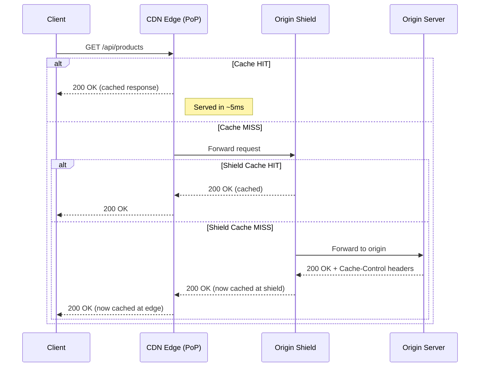
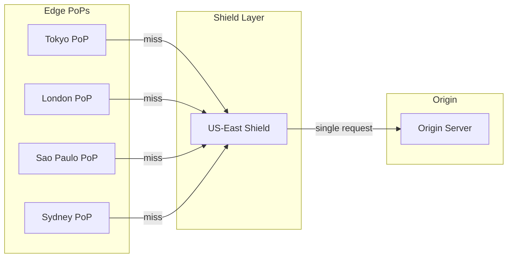

# CDN & Edge Networking — Caching at the Edge

**Date:** 2026-04-23 | **Updated:** 2026-04-23
**Tags:** `networking` `cdn` `edge` `caching` `infrastructure` `performance`

---

## Table of Contents

- [Summary](#summary)
- [1. What is a CDN](#1-what-is-a-cdn)
- [2. How CDN Caching Works](#2-how-cdn-caching-works)
- [3. Cache-Control Directives](#3-cache-control-directives)
- [4. Cache Keys](#4-cache-keys)
- [5. Cache Invalidation](#5-cache-invalidation)
- [6. Origin Shielding](#6-origin-shielding)
- [7. Edge Compute](#7-edge-compute)
- [8. CDN Providers](#8-cdn-providers)
- [9. CDN for APIs](#9-cdn-for-apis)
- [10. Practical Setup](#10-practical-setup)
- [Related](#related)
- [References](#references)

---

## Summary

A **Content Delivery Network** (CDN) is a geographically distributed network of edge servers that cache content close to end users. Instead of every request traveling to a single origin server (which might be in `us-east-1`), the CDN serves cached copies from the nearest **Point of Presence** (PoP) — cutting latency from hundreds of milliseconds to single digits.

CDNs are not just for static assets anymore. Modern CDNs cache API responses, run serverless functions at the edge, terminate TLS, absorb DDoS attacks, and optimize transport-layer connections back to the origin. Understanding Cache-Control directives, cache key design, and invalidation strategies is essential for any backend developer deploying behind a CDN.

The critical tradeoff: caching buys you latency reduction and origin offload, but introduces **stale data risk** and the hard problem of **cache invalidation**. Every caching decision is a freshness-vs-performance tradeoff.

---

## 1. What is a CDN

### The Problem CDNs Solve

Without a CDN, every user request travels to your origin server. A user in Tokyo hitting an origin in Virginia experiences ~150-200ms of network latency per round trip — before the server even starts processing. Multiply by the number of round trips for TLS, TCP setup, and the actual HTTP exchange, and you get noticeable delays.

A CDN places **edge servers** in dozens to hundreds of cities worldwide. When a user in Tokyo makes a request, it reaches a PoP in Tokyo (~5ms) instead of crossing the Pacific.

### Key Concepts

| Concept | Description |
|---------|-------------|
| **PoP (Point of Presence)** | A physical location containing CDN edge servers. Major providers have 200-300+ PoPs globally |
| **Edge server** | A server at a PoP that caches and serves content. Handles TLS termination, compression, and routing |
| **Origin server** | Your actual backend server where content originates. The CDN fetches from origin on cache misses |
| **Anycast routing** | Multiple edge servers share the same IP address. BGP routing sends each client to the nearest PoP automatically |
| **PoP tier** | Some CDNs use tiered PoPs — small edge PoPs for user proximity, larger regional PoPs for aggregation |

### Anycast in Practice

Traditional unicast: one IP maps to one server. Anycast: one IP (e.g., `1.1.1.1` for Cloudflare DNS) is announced by hundreds of PoPs via BGP. The internet's routing protocol naturally sends each packet to the nearest announcement.

```
User in Tokyo ──BGP──> PoP Tokyo (1.1.1.1)       ← 5ms
User in London ──BGP──> PoP London (1.1.1.1)      ← 3ms
User in Sao Paulo ──BGP──> PoP Sao Paulo (1.1.1.1) ← 8ms
```

This is transparent to the client — it just connects to a single IP address. The network layer handles geographic routing.

---

## 2. How CDN Caching Works

### Request Flow



### Cache States

| State | Description | What happens |
|-------|-------------|-------------|
| **HIT** | Content found in edge cache and still fresh | Served directly from edge. Origin never contacted. Fastest path |
| **MISS** | Content not in edge cache | Edge fetches from origin (or shield), caches response, serves to client |
| **STALE** | Content in cache but past `max-age` | Behavior depends on directives. May serve stale while revalidating, or fetch fresh |
| **REVALIDATION** | Edge checks if cached content is still valid | Conditional request (`If-None-Match` / `If-Modified-Since`) to origin. 304 = still valid |
| **BYPASS** | Request intentionally skips cache | Requests with `Authorization`, `Cookie`, `Cache-Control: no-cache` from client |

### Cache Population Model

CDNs use a **pull model** — they do not preload content. The first request to each PoP for a given URL is always a miss. This means:

- Content is cached **per PoP** — a cache hit in Tokyo does not help Frankfurt
- After a purge, every PoP must re-fetch independently
- **Cache warming** (sending synthetic requests) can preload critical paths after deployment

---

## 3. Cache-Control Directives

The `Cache-Control` response header is how your origin tells the CDN (and the browser) what to cache and for how long. Getting these right is the single most impactful CDN optimization.

### Directive Reference

| Directive | Applies to | Behavior | Use Case |
|-----------|-----------|----------|----------|
| `public` | Shared caches (CDN) | Response can be cached by any cache, including CDN edge | Static assets, public API responses |
| `private` | Browser only | Response can only be cached by the end user's browser, not by CDN | User-specific data (profile, cart) |
| `no-cache` | Both | Cache may store the response, but **must revalidate** with origin before serving | Content that changes frequently but benefits from conditional requests |
| `no-store` | Both | Cache must **not store** the response at all. No caching anywhere | Sensitive data (banking, PII, auth tokens) |
| `max-age=N` | Both | Response is fresh for `N` seconds from the time of the request | General caching: `max-age=3600` = 1 hour |
| `s-maxage=N` | Shared caches only | Overrides `max-age` for CDN/proxy caches. Browser still uses `max-age` | CDN caches for 1 day, browser for 5 min: `max-age=300, s-maxage=86400` |
| `stale-while-revalidate=N` | Both | Serve stale content for up to `N` seconds while fetching fresh copy in background | Performance-critical pages: user gets instant response, freshness updates async |
| `stale-if-error=N` | Both | Serve stale content for up to `N` seconds if origin returns 5xx or is unreachable | Resilience: keep serving if origin goes down |
| `must-revalidate` | Both | Once stale, cache **must not** serve without successful revalidation. No stale fallback | When stale data is unacceptable (financial data, inventory counts) |
| `immutable` | Both | Tells cache the content will **never change** at this URL. No revalidation needed even on user refresh | Fingerprinted assets: `/app.a1b2c3.js` — the hash changes when content changes |
| `no-transform` | Proxies | Proxy must not alter the response body (no compression changes, no image optimization) | When you need byte-exact delivery |

### Common Patterns

**Static assets with fingerprinted URLs:**
```
Cache-Control: public, max-age=31536000, immutable
```
One year cache. The filename contains a hash (`app.d8f2a1.js`) so when content changes, the URL changes. Old cache entries just expire naturally.

**HTML pages (semi-dynamic):**
```
Cache-Control: public, max-age=0, s-maxage=60, stale-while-revalidate=300
```
CDN caches for 60 seconds, serves stale for up to 5 minutes while revalidating in the background. Browser always revalidates (max-age=0).

**API response (cacheable GET):**
```
Cache-Control: public, s-maxage=30, stale-while-revalidate=60, stale-if-error=300
```
CDN caches for 30 seconds, serves stale for 1 minute during revalidation, serves stale for 5 minutes if origin errors.

**Private, user-specific content:**
```
Cache-Control: private, max-age=300, must-revalidate
```
Browser-only cache for 5 minutes. CDN will not cache this.

**Sensitive data:**
```
Cache-Control: no-store
```
Nothing cached anywhere. Every request goes to origin.

### `ETag` and Conditional Requests

`ETag` enables **conditional revalidation** — the cache can ask origin "has this changed?" without re-downloading the full response:

```
# First response from origin:
HTTP/1.1 200 OK
ETag: "a1b2c3d4"
Cache-Control: public, max-age=60

# After max-age expires, CDN revalidates:
GET /api/products HTTP/1.1
If-None-Match: "a1b2c3d4"

# If unchanged:
HTTP/1.1 304 Not Modified       ← no body, just headers. Fast.

# If changed:
HTTP/1.1 200 OK
ETag: "e5f6g7h8"               ← new content with new ETag
```

---

## 4. Cache Keys

The **cache key** determines what the CDN considers "the same request." Two requests with the same cache key get the same cached response. Two requests with different cache keys are cached independently.

### Default Cache Key Components

Most CDNs use this as the default cache key:

```
scheme + host + path + query string
```

So `https://api.example.com/products?page=1&sort=name` and `https://api.example.com/products?sort=name&page=1` may be considered **different** cache keys (query param order matters on some CDNs).

### The `Vary` Header

The `Vary` response header adds request headers to the cache key:

```
Vary: Accept-Encoding
```

This means the CDN caches separate copies for `Accept-Encoding: gzip`, `Accept-Encoding: br`, etc. Common `Vary` values:

| Vary Value | Purpose | Cache Impact |
|------------|---------|-------------|
| `Accept-Encoding` | Different compressed versions (gzip, brotli) | 2-3 variants. Safe and recommended |
| `Accept-Language` | Localized content | One variant per language. Multiplies cache entries |
| `Accept` | Content negotiation (JSON vs XML) | Usually fine for APIs with few formats |
| `Cookie` | User-specific content | **Destroys cacheability** — every unique cookie = separate cache entry |
| `Authorization` | Auth-specific content | Same problem as Cookie. Almost never cache this |
| `*` | Vary on everything | Effectively disables caching. Never use this |

### Custom Cache Keys

Most CDNs let you customize cache keys beyond the default:

```
# Cloudflare cache key customization examples:
- Include specific query params only (ignore tracking params like utm_source)
- Include specific cookies (e.g., country cookie for geo-targeted content)
- Include device type header (mobile vs desktop)
- Include specific request headers
```

**Strip tracking params** — `?utm_source=twitter&utm_medium=social` should not create separate cache entries for the same content.

### Cache Poisoning via Misconfigured Keys

Cache poisoning happens when a cache key is **too narrow** — it ignores a request component that actually affects the response:

```
# Dangerous scenario:
# Cache key: URL path only (ignores Host header)
# Attacker sends:
GET /login HTTP/1.1
Host: evil.com              ← Origin reflects this in response HTML

# CDN caches the response keyed on /login
# Next legitimate user gets the response with evil.com references
```

**Mitigations:**
- Always include `Host` in cache key (most CDNs do by default)
- Be cautious with `X-Forwarded-Host`, `X-Original-URL`, and similar headers
- Never reflect unvalidated headers in cached responses
- Test with cache-buster params to verify key composition

---

## 5. Cache Invalidation

> "There are only two hard things in Computer Science: cache invalidation and naming things." — Phil Karlton

### Why It Is Hard

1. **Distribution** — content is cached in 200+ PoPs worldwide. Purging must propagate to all of them
2. **Timing** — even with fast purge, requests in-flight during the purge may still serve stale content
3. **Dependencies** — a product price change might affect the product page, the listing page, the search results, and the cart
4. **Cache key discovery** — you need to know every cache key variant that needs purging

### Invalidation Strategies

#### TTL-Based Expiry

The simplest approach: let content expire naturally.

```
Cache-Control: s-maxage=300
```

Content refreshes every 5 minutes. No active invalidation needed. The tradeoff: stale data is possible for up to 300 seconds.

**When to use:** Content where eventual consistency within the TTL window is acceptable (blog posts, product catalogs, non-critical data).

#### Purge by URL

Actively invalidate a specific URL across all PoPs:

```bash
# Cloudflare API
curl -X POST "https://api.cloudflare.com/client/v4/zones/{zone_id}/purge_cache" \
  -H "Authorization: Bearer {token}" \
  -d '{"files":["https://example.com/api/products/123"]}'

# Fastly instant purge
curl -X PURGE "https://example.com/api/products/123" \
  -H "Fastly-Key: {token}"
```

**Propagation time:** Cloudflare ~30 seconds globally, Fastly ~150ms globally (soft purge).

#### Purge by Cache Tag (Surrogate Key)

Tag responses with logical groupings, then purge all URLs sharing a tag:

```
# Origin response headers:
Surrogate-Key: product-123 category-electronics homepage
Cache-Tag: product-123, category-electronics, homepage
```

```bash
# Purge everything tagged "product-123":
curl -X POST "https://api.fastly.com/service/{id}/purge/product-123" \
  -H "Fastly-Key: {token}"
```

This purges the product detail page, the category listing, the homepage, and any other page tagged with `product-123`. This is the most powerful pattern for cache invalidation of related content.

#### Versioned URLs (Cache Busting / Fingerprinting)

Instead of invalidating, **change the URL** when content changes:

```
/app.css        → /app.a1b2c3.css      (content hash in filename)
/api/v1/config  → /api/v1/config?v=42   (version query param)
```

The old URL remains cached (harmless — nothing references it anymore). The new URL is a cache miss and fetches fresh content.

**Best practice for static assets:** Use content-hash fingerprinting with `immutable` cache headers. Build tools (webpack, Vite, esbuild) do this automatically.

### Soft Purge vs Hard Purge

| Type | Behavior | Use case |
|------|----------|----------|
| **Hard purge** | Immediately removes content from cache. Next request is a cache miss | Content must never be served again (security issue, legal takedown) |
| **Soft purge** | Marks content as stale. Cache can still serve it with `stale-while-revalidate` while fetching fresh | Normal content updates. Avoids thundering herd on origin |

---

## 6. Origin Shielding

### The Problem

Without shielding, every edge PoP fetches from origin independently on a cache miss. If you have 200 PoPs and content expires simultaneously, your origin gets 200 concurrent requests for the same resource.

### How Origin Shield Works



An **origin shield** is an intermediate cache tier (usually a specific PoP designated as the shield) that sits between edge PoPs and your origin:

1. Edge PoP gets a cache miss
2. Instead of going to origin, edge asks the **shield PoP**
3. If shield has it cached, edge gets it without touching origin
4. If shield also misses, shield fetches from origin **once** and caches for all subsequent edge requests

### Benefits

| Benefit | Impact |
|---------|--------|
| **Reduced origin load** | 200 edge misses collapse into 1 origin request |
| **Request coalescing** | Multiple simultaneous misses at the shield deduplicate into one origin fetch |
| **Higher cache hit ratio** | Shield has larger aggregate traffic, so higher hit rate than any single edge |
| **Origin protection during purge** | After purge, shield refills once, then serves all edges |

### When to Enable

- **Enable** when: origin is a single region, traffic is globally distributed, origin compute is expensive
- **Skip** when: origin is already globally replicated, or latency to shield adds unacceptable overhead for real-time data

### Shield Placement

Place the shield PoP **near your origin** to minimize shield-to-origin latency. If your origin is in `us-east-1`, choose a shield in Ashburn or New York.

---

## 7. Edge Compute

Modern CDNs let you run code **at the edge** — in the same PoPs that cache your content. This moves computation closer to users, avoiding the round trip to origin for lightweight logic.

### Platforms

| Platform | Runtime | Cold Start | Max Execution | Memory | Free Tier |
|----------|---------|-----------|--------------|--------|-----------|
| **Cloudflare Workers** | V8 isolates (JS/TS/WASM) | ~0ms (no cold start) | 30s (paid), 10ms CPU (free) | 128MB | 100K req/day |
| **Vercel Edge Functions** | V8 isolates (JS/TS) | ~0ms | 30s | 128MB | Included in plan |
| **AWS Lambda@Edge** | Node.js, Python | 1-5s first invocation | 30s (viewer), 30s (origin) | 128-10240MB | Pay per request |
| **AWS CloudFront Functions** | JS (limited) | ~0ms | 1ms max | 2MB | 2M free/month |
| **Deno Deploy** | V8 isolates (Deno/TS) | ~0ms | 50ms CPU per request | 512MB | 1M req/month |
| **Fastly Compute** | WASM | ~0ms (pre-compiled) | 60s | 128MB | Free tier available |

### Use Cases

**A/B testing at the edge:**
```typescript
// Cloudflare Worker — assign experiment variant without origin round trip
export default {
  async fetch(request: Request): Promise<Response> {
    const url = new URL(request.url);
    const cookie = request.headers.get('Cookie') || '';

    // Check for existing variant assignment
    const variantMatch = cookie.match(/ab_variant=(\w+)/);
    let variant = variantMatch?.[1];

    if (!variant) {
      // Assign randomly and set cookie
      variant = Math.random() < 0.5 ? 'control' : 'treatment';
    }

    // Rewrite URL or add header for origin
    const modifiedRequest = new Request(request, {
      headers: new Headers(request.headers),
    });
    modifiedRequest.headers.set('X-AB-Variant', variant);

    const response = await fetch(modifiedRequest);
    const modifiedResponse = new Response(response.body, response);

    if (!variantMatch) {
      modifiedResponse.headers.append(
        'Set-Cookie',
        `ab_variant=${variant}; Path=/; Max-Age=86400; SameSite=Lax`
      );
    }

    return modifiedResponse;
  },
};
```

**Geolocation-based routing:**
```typescript
// Route to nearest API region based on user location
export default {
  async fetch(request: Request): Promise<Response> {
    // Cloudflare provides geo data on the request
    const country = request.cf?.country ?? 'US';
    const continent = request.cf?.continent ?? 'NA';

    const regionMap: Record<string, string> = {
      EU: 'https://api-eu.example.com',
      AS: 'https://api-ap.example.com',
      NA: 'https://api-us.example.com',
    };

    const origin = regionMap[continent] ?? regionMap['NA'];
    const url = new URL(request.url);
    url.hostname = new URL(origin).hostname;

    return fetch(new Request(url.toString(), request));
  },
};
```

**Authentication at the edge (JWT validation):**
```typescript
// Validate JWT without hitting origin — reject unauthorized requests early
export default {
  async fetch(request: Request, env: Env): Promise<Response> {
    const authHeader = request.headers.get('Authorization');

    if (!authHeader?.startsWith('Bearer ')) {
      return new Response('Unauthorized', { status: 401 });
    }

    const token = authHeader.slice(7);

    try {
      const key = await crypto.subtle.importKey(
        'raw',
        new TextEncoder().encode(env.JWT_SECRET),
        { name: 'HMAC', hash: 'SHA-256' },
        false,
        ['verify']
      );

      // Decode and verify JWT
      const [headerB64, payloadB64, signatureB64] = token.split('.');
      const data = new TextEncoder().encode(`${headerB64}.${payloadB64}`);
      const signature = Uint8Array.from(atob(signatureB64.replace(/-/g, '+').replace(/_/g, '/')), c => c.charCodeAt(0));

      const valid = await crypto.subtle.verify('HMAC', key, signature, data);
      if (!valid) {
        return new Response('Invalid token', { status: 401 });
      }

      const payload = JSON.parse(atob(payloadB64));
      if (payload.exp && payload.exp < Date.now() / 1000) {
        return new Response('Token expired', { status: 401 });
      }

      // Forward to origin with decoded user info
      const modifiedRequest = new Request(request);
      modifiedRequest.headers.set('X-User-Id', payload.sub);
      return fetch(modifiedRequest);
    } catch {
      return new Response('Invalid token', { status: 401 });
    }
  },
};
```

### Limitations

| Limitation | Detail |
|------------|--------|
| **No persistent connections** | No long-lived WebSockets in most runtimes (Cloudflare Durable Objects is an exception) |
| **Limited APIs** | No filesystem, no native modules, restricted Node.js APIs |
| **CPU time limits** | Typically 10-50ms CPU time per request (not wall clock — I/O waits are free) |
| **No shared state** | Each isolate is stateless. Use KV stores, Durable Objects, or external DBs for state |
| **Cold starts (Lambda@Edge)** | VM-based runtimes have 1-5s cold starts. V8 isolate runtimes avoid this |
| **Debugging complexity** | Distributed logs, hard to reproduce PoP-specific issues, limited tracing |

---

## 8. CDN Providers

### Comparison Table

| Feature | Cloudflare | AWS CloudFront | Fastly | Akamai | Vercel |
|---------|------------|---------------|--------|--------|--------|
| **PoPs** | 310+ | 600+ | 90+ | 4,100+ | 90+ (via CF/AWS) |
| **Edge compute** | Workers (V8 isolates) | Lambda@Edge + CF Functions | Compute (WASM) | EdgeWorkers (JS) | Edge Functions (V8) |
| **Purge speed** | ~30s global | Minutes | ~150ms global | Seconds | ~300ms |
| **Cache tags** | Cache Tags API | No native (use Lambda@Edge) | Surrogate-Key (native) | Tag-based purge | Via headers |
| **Origin shield** | Tiered Cache | Origin Shield | Shielding PoPs | SureRoute | Inherent |
| **DDoS protection** | Included (unmetered) | AWS Shield Standard included | Basic included | Prolexic (paid) | Included |
| **WAF** | Included in paid plans | AWS WAF (separate cost) | Signal Sciences (add-on) | Kona (included) | Firewall (paid) |
| **HTTP/3** | Yes | Yes | Yes | Yes | Yes |
| **WebSocket support** | Yes | Yes | Yes | Yes | Yes |
| **Pricing model** | Per-request (generous free tier) | Per-GB egress + requests | Per-request + egress | Contract-based | Per-request (with plan) |
| **Free tier** | Generous (unlimited bandwidth) | 1TB/month (12 months) | Free developer account | None | Hobby plan |
| **Best for** | General purpose, DDoS, Workers | AWS-native stacks | Real-time purge, VCL power | Enterprise, massive scale | Next.js / frontend deploys |

### Choosing a CDN

**Cloudflare** — Best default choice. Generous free tier, excellent DDoS protection, Workers for edge compute, global anycast network. The go-to for most projects.

**AWS CloudFront** — Choose when you are already in the AWS ecosystem and need tight integration with S3, ALB, API Gateway, and Lambda. Pricing is consumption-based (watch egress costs).

**Fastly** — Choose when you need sub-second global purge and advanced caching logic. Fastly's VCL (Varnish Configuration Language) and Surrogate-Key system give the most control over caching behavior. Preferred by media companies and high-traffic APIs.

**Akamai** — Enterprise-grade with the largest PoP network. Complex configuration, contract-based pricing, but unmatched global reach and feature depth.

**Vercel** — Choose for Next.js deployments. Tightly integrated with the framework, handles ISR (Incremental Static Regeneration) natively. Not a general-purpose CDN.

---

## 9. CDN for APIs

CDNs are not just for static assets. Caching API responses can dramatically reduce latency and origin load for read-heavy APIs.

### Caching GET Responses

Only `GET` (and sometimes `HEAD`) responses should be cached. `POST`, `PUT`, `DELETE` must always reach the origin.

```
# Cacheable API response
GET /api/products/123
Cache-Control: public, s-maxage=30, stale-while-revalidate=60

# Non-cacheable (state-changing)
POST /api/orders
Cache-Control: no-store
```

### Cache Key Considerations for APIs

API cache keys need more thought than page cache keys:

| Factor | Strategy |
|--------|----------|
| **Query params** | Include only params that affect the response. Strip analytics params |
| **Authorization** | Do NOT include auth tokens in cache key (would create per-user cache entries). Only cache truly public endpoints, or use edge compute to validate auth then cache the underlying resource |
| **Accept header** | Include if your API serves different formats (JSON vs XML) |
| **API version** | Include version prefix in path (`/v2/products`) rather than header-based versioning for better cacheability |
| **Pagination** | `page` and `limit` must be in cache key. Normalize to avoid `page=1&limit=10` vs `limit=10&page=1` misses |

### GraphQL Caching Challenges

GraphQL is inherently harder to cache at the CDN layer:

| Problem | Why |
|---------|-----|
| **POST requests** | Most GraphQL uses `POST` with query in body. CDNs do not cache POST by default |
| **Variable queries** | Every unique query shape is a different cache entry |
| **Nested data** | A single query may fetch data with mixed freshness requirements |
| **No URL-based cache key** | The "resource identifier" is in the request body, not the URL |

**Workarounds:**
- **GET-based queries** — encode the query as a URL query param (`?query={...}`) for simple, read-only queries
- **Persisted queries** — map query hashes to server-side stored queries: `GET /graphql?extensions={"persistedQuery":{"sha256Hash":"abc123"}}` — this creates a cacheable URL
- **Response-level caching** — use `@cacheControl` directives in the schema to set per-field TTLs, then compute the response TTL as the minimum across all resolved fields
- **Edge-level query splitting** — at the edge, decompose a complex query into cacheable fragments

### API Acceleration Beyond Caching

CDNs accelerate API traffic even for non-cacheable requests:

| Technique | Benefit |
|-----------|---------|
| **Connection pooling to origin** | CDN maintains persistent HTTP/2 connections to origin. Client-to-edge is a short hop; edge-to-origin reuses warm connections |
| **TLS termination at edge** | TLS handshake happens at the nearby edge. Edge-to-origin can use a faster, pre-established TLS session |
| **TCP optimization** | Edge uses optimized TCP settings (larger initial congestion window, tuned for long-haul) on the edge-to-origin link |
| **HTTP/3 and QUIC** | Edge speaks HTTP/3 to clients (fast 0-RTT connections). Proxies to origin over optimized HTTP/2 |
| **Compression** | Edge compresses responses (Brotli, gzip) close to the user. Origin can send uncompressed |
| **Request coalescing** | Multiple identical cache misses at the same edge are collapsed into one origin request |

---

## 10. Practical Setup

### Setting Cache-Control Headers in Express / Node.js

```typescript
import express, { Request, Response, NextFunction } from 'express';

const app = express();

// Middleware: cache static assets aggressively
app.use(
  '/static',
  express.static('dist/static', {
    maxAge: '1y',
    immutable: true,
    setHeaders: (res) => {
      res.setHeader('Cache-Control', 'public, max-age=31536000, immutable');
    },
  })
);

// Middleware: cache control for API routes
const cachePublic = (
  maxAge: number,
  sMaxAge: number,
  staleWhileRevalidate: number
) => {
  return (_req: Request, res: Response, next: NextFunction) => {
    res.setHeader(
      'Cache-Control',
      `public, max-age=${maxAge}, s-maxage=${sMaxAge}, stale-while-revalidate=${staleWhileRevalidate}`
    );
    next();
  };
};

const noCache = (_req: Request, res: Response, next: NextFunction) => {
  res.setHeader('Cache-Control', 'no-store');
  next();
};

// Public product listing — CDN caches 60s, serve stale 5 min
app.get('/api/products', cachePublic(0, 60, 300), (_req, res) => {
  // ... fetch products
  res.json({ products: [] });
});

// User-specific data — no CDN caching
app.get('/api/me', noCache, (_req, res) => {
  // ... fetch user profile
  res.json({ user: {} });
});

// Add ETag support for conditional requests
app.get('/api/products/:id', cachePublic(0, 30, 60), (req, res) => {
  const product = { id: req.params.id, name: 'Widget', price: 9.99 };
  const etag = `"${Buffer.from(JSON.stringify(product)).toString('base64').slice(0, 16)}"`;

  res.setHeader('ETag', etag);

  if (req.headers['if-none-match'] === etag) {
    res.status(304).end();
    return;
  }

  res.json(product);
});
```

### Setting Cache-Control Headers in Spring Boot

```java
import org.springframework.http.CacheControl;
import org.springframework.http.ResponseEntity;
import org.springframework.web.bind.annotation.*;

import java.time.Duration;
import java.util.List;

@RestController
@RequestMapping("/api")
public class ProductController {

    // CDN caches 60s, serve stale during revalidation
    @GetMapping("/products")
    public ResponseEntity<List<Product>> listProducts() {
        List<Product> products = productService.findAll();

        return ResponseEntity.ok()
            .cacheControl(
                CacheControl.maxAge(Duration.ZERO)         // browser: always revalidate
                    .sMaxAge(Duration.ofSeconds(60))        // CDN: cache 60s
                    .staleWhileRevalidate(Duration.ofMinutes(5))
                    .cachePublic()
            )
            .body(products);
    }

    // Immutable static config — cache forever
    @GetMapping("/config/v{version}")
    public ResponseEntity<AppConfig> getConfig(@PathVariable int version) {
        AppConfig config = configService.getVersion(version);

        return ResponseEntity.ok()
            .cacheControl(
                CacheControl.maxAge(Duration.ofDays(365))
                    .cachePublic()
                    // Spring does not have immutable() — set header directly
            )
            .header("Cache-Control", "public, max-age=31536000, immutable")
            .body(config);
    }

    // User-specific — no CDN caching
    @GetMapping("/me")
    public ResponseEntity<UserProfile> getProfile() {
        UserProfile profile = userService.getCurrentProfile();

        return ResponseEntity.ok()
            .cacheControl(CacheControl.noStore())
            .body(profile);
    }

    // ETag-based conditional response
    @GetMapping("/products/{id}")
    public ResponseEntity<Product> getProduct(
            @PathVariable Long id,
            @RequestHeader(value = "If-None-Match", required = false) String ifNoneMatch) {

        Product product = productService.findById(id);
        String etag = "\"" + product.getVersion() + "\"";

        if (etag.equals(ifNoneMatch)) {
            return ResponseEntity.status(304).build();
        }

        return ResponseEntity.ok()
            .eTag(etag)
            .cacheControl(
                CacheControl.maxAge(Duration.ZERO)
                    .sMaxAge(Duration.ofSeconds(30))
                    .staleWhileRevalidate(Duration.ofSeconds(60))
                    .cachePublic()
            )
            .body(product);
    }
}
```

Spring Boot also supports a `ShallowEtagHeaderFilter` for automatic ETag generation:

```java
import org.springframework.boot.web.servlet.FilterRegistrationBean;
import org.springframework.context.annotation.Bean;
import org.springframework.context.annotation.Configuration;
import org.springframework.web.filter.ShallowEtagHeaderFilter;

@Configuration
public class WebConfig {

    @Bean
    public FilterRegistrationBean<ShallowEtagHeaderFilter> shallowEtagHeaderFilter() {
        FilterRegistrationBean<ShallowEtagHeaderFilter> registration =
            new FilterRegistrationBean<>(new ShallowEtagHeaderFilter());
        registration.addUrlPatterns("/api/*");
        registration.setOrder(1);
        return registration;
    }
}
```

### CDN Configuration Basics (Cloudflare Example)

Key settings when putting your origin behind Cloudflare:

| Setting | Recommendation |
|---------|---------------|
| **SSL/TLS mode** | Full (Strict) — origin must have a valid certificate |
| **Always Use HTTPS** | Enable — redirects HTTP to HTTPS |
| **Minimum TLS Version** | 1.2 |
| **Browser Cache TTL** | Respect Existing Headers — let your origin control this |
| **Tiered Cache** | Enable (origin shielding) |
| **Cache Level** | Standard — cache based on query string |
| **Polish** | Enable for image optimization (Lossy or Lossless) |
| **Brotli** | Enable — better compression than gzip |

### Monitoring: What to Track

| Metric | Target | Why |
|--------|--------|-----|
| **Cache hit ratio** | >90% for static, >60% for API | Measures CDN effectiveness. Low ratio means origin is doing too much work |
| **Origin offload** | >80% of requests served from edge | Percentage of total requests that never reach origin |
| **TTFB (Time to First Byte)** | <50ms from edge | Measures edge response speed. High TTFB may indicate shield/origin round trips |
| **Bandwidth saved** | Track monthly | Cost justification — egress from CDN is usually cheaper than origin egress |
| **5xx error rate** | <0.1% | Errors from origin propagating through CDN, or CDN-level errors |
| **Cache evictions** | Monitor trend | Spikes indicate storage pressure at edge PoPs |
| **Purge frequency** | Track per tag/URL | Excessive purging defeats caching. If you purge every few seconds, rethink your TTL strategy |

**Cloudflare analytics** exposes cache status per request via the `cf-cache-status` response header:

```
cf-cache-status: HIT      ← served from edge cache
cf-cache-status: MISS     ← fetched from origin, now cached
cf-cache-status: EXPIRED  ← was cached but TTL passed, refetched
cf-cache-status: STALE    ← served stale while revalidating
cf-cache-status: DYNAMIC  ← not eligible for caching (POST, no cache headers, etc.)
cf-cache-status: BYPASS   ← cache intentionally bypassed (e.g., cookie present)
```

Use this header in your monitoring to compute cache hit ratio:
```
cache_hit_ratio = count(HIT) / count(HIT + MISS + EXPIRED + STALE + DYNAMIC + BYPASS)
```

---

## Related

- [Load Balancing](load-balancing.md) — L4/L7 load balancing algorithms and health checks
- [Reverse Proxies & Gateways](reverse-proxies-and-gateways.md) — Nginx, Envoy, and traffic management
- [HTTP Evolution](../application-layer/http-evolution.md) — HTTP/1.1, HTTP/2, HTTP/3 protocol details
- [DNS Internals](../application-layer/dns-internals.md) — DNS resolution and anycast DNS

---

## References

1. MDN Web Docs — [Cache-Control](https://developer.mozilla.org/en-US/docs/Web/HTTP/Headers/Cache-Control) — authoritative directive reference
2. Cloudflare Docs — [How Caching Works](https://developers.cloudflare.com/cache/concepts/how-caching-works/) — CDN caching model and cache status headers
3. Cloudflare Docs — [Workers](https://developers.cloudflare.com/workers/) — edge compute platform documentation
4. AWS CloudFront Developer Guide — [Optimizing Caching and Availability](https://docs.aws.amazon.com/AmazonCloudFront/latest/DeveloperGuide/ConfiguringCaching.html) — origin shield, cache behaviors, TTL configuration
5. Fastly Docs — [Surrogate Keys](https://docs.fastly.com/en/guides/working-with-surrogate-keys) — cache tag-based purging
6. RFC 9111 — [HTTP Caching](https://www.rfc-editor.org/rfc/rfc9111) — the HTTP caching specification (replaces RFC 7234)
7. web.dev — [Prevent unnecessary network requests with the HTTP Cache](https://web.dev/articles/http-cache) — practical caching strategies from Google
8. PortSwigger — [Web Cache Poisoning](https://portswigger.net/web-security/web-cache-poisoning) — cache key manipulation attacks and mitigations
