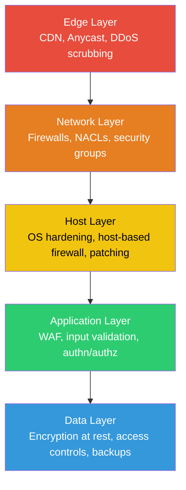
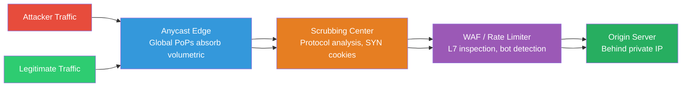

| Field       | Value                                                    |
|-------------|----------------------------------------------------------|
| **Topic**   | Firewalls & Network Security — Defense in Depth          |
| **Audience**| Backend developer (TypeScript/Node + Java/Spring Boot)   |
| **Level**   | Intermediate to Advanced                                 |
| **Prereqs** | TCP/IP basics, cloud networking fundamentals             |

---

## Table of Contents

1. [Defense in Depth](#1-defense-in-depth)
2. [Packet Filtering Firewalls](#2-packet-filtering-firewalls)
3. [Security Groups & NACLs](#3-security-groups--nacls)
4. [Web Application Firewall (WAF)](#4-web-application-firewall-waf)
5. [DDoS Mitigation](#5-ddos-mitigation)
6. [Network Segmentation](#6-network-segmentation)
7. [Port Security](#7-port-security)
8. [TLS Everywhere](#8-tls-everywhere)
9. [Network Monitoring & Intrusion Detection](#9-network-monitoring--intrusion-detection)
10. [Practical Hardening Checklist](#10-practical-hardening-checklist)

---

## Summary

No single security control is sufficient. Production systems require overlapping layers of defense — from the network edge through the application itself — so that compromising one layer does not grant full access. This document covers the tools and patterns backend developers encounter when deploying Node.js and Spring Boot services in cloud environments: firewalls, WAFs, DDoS protection, segmentation, TLS, and monitoring.

---

## 1. Defense in Depth

Defense in depth is a security strategy that deploys multiple independent layers of protection. If an attacker bypasses one layer, subsequent layers still stand.

### Why No Single Control Is Enough

- A WAF blocks SQL injection but cannot stop a compromised SSH key.
- A firewall blocks unauthorized ports but cannot inspect encrypted application payloads.
- Rate limiting stops brute force but not stolen credentials.

Each layer addresses a different class of threat. Gaps in one layer are covered by another.

### Layered Security Model



| Layer       | Controls                                          | Threat Class                           |
|-------------|---------------------------------------------------|----------------------------------------|
| Edge        | CDN, anycast, DDoS scrubbing, geo-blocking        | Volumetric attacks, bot floods         |
| Network     | Firewalls, NACLs, security groups, VPN            | Unauthorized network access            |
| Host        | OS patching, host firewall, SSH hardening          | Exploitation of OS vulnerabilities     |
| Application | WAF, input validation, CSRF protection, auth       | Injection, broken auth, logic flaws    |
| Data        | Encryption at rest, field-level encryption, RBAC   | Data breach, insider threat            |

---

## 2. Packet Filtering Firewalls

### Stateless vs Stateful Inspection

| Property             | Stateless                               | Stateful                                       |
|----------------------|-----------------------------------------|------------------------------------------------|
| Inspects             | Each packet independently               | Packets in context of connection state          |
| Connection tracking  | No                                      | Yes — tracks SYN, SYN-ACK, established flows   |
| Return traffic       | Must allow explicitly                   | Allowed automatically for established sessions  |
| Performance          | Faster (no state table)                 | Slight overhead from connection table           |
| Example              | NACLs                                   | iptables with conntrack, security groups        |

Stateless firewalls evaluate each packet against rules without memory of prior packets. You must write separate inbound and outbound rules. Stateful firewalls track connections — once an outbound request is allowed, the return traffic is implicitly permitted.

### iptables Fundamentals

`iptables` organizes rules into **tables** and **chains**. The `filter` table (default) has three built-in chains:

| Chain     | When Applied                                |
|-----------|---------------------------------------------|
| INPUT     | Packets destined for the host itself        |
| OUTPUT    | Packets originating from the host           |
| FORWARD   | Packets being routed through the host       |

Each rule matches on criteria (source IP, port, protocol) and jumps to a **target**:

| Target  | Behavior                                          |
|---------|---------------------------------------------------|
| ACCEPT  | Allow the packet                                  |
| DROP    | Silently discard (no response to sender)          |
| REJECT  | Discard and send ICMP unreachable or TCP RST      |
| LOG     | Log the packet, then continue to next rule        |

#### Common Rules for a Web Server

```bash
# Flush existing rules
sudo iptables -F

# Default policy: drop everything
sudo iptables -P INPUT DROP
sudo iptables -P FORWARD DROP
sudo iptables -P OUTPUT ACCEPT

# Allow loopback
sudo iptables -A INPUT -i lo -j ACCEPT

# Allow established and related connections (stateful)
sudo iptables -A INPUT -m conntrack --ctstate ESTABLISHED,RELATED -j ACCEPT

# Allow SSH from a specific subnet
sudo iptables -A INPUT -p tcp --dport 22 -s 10.0.0.0/8 -j ACCEPT

# Allow HTTP and HTTPS
sudo iptables -A INPUT -p tcp --dport 80 -j ACCEPT
sudo iptables -A INPUT -p tcp --dport 443 -j ACCEPT

# Allow ICMP ping (optional)
sudo iptables -A INPUT -p icmp --icmp-type echo-request -j ACCEPT

# Log and drop everything else
sudo iptables -A INPUT -j LOG --log-prefix "IPT-DROP: "
sudo iptables -A INPUT -j DROP
```

#### Persist Rules Across Reboots

```bash
# Debian/Ubuntu
sudo apt install iptables-persistent
sudo netfilter-persistent save

# RHEL/CentOS
sudo service iptables save
```

### nftables — Modern Replacement

`nftables` replaces iptables with a cleaner syntax and better performance. It is the default in Debian 10+, RHEL 8+, and Ubuntu 20.10+.

```bash
# Equivalent web server ruleset in nftables
sudo nft add table inet filter
sudo nft add chain inet filter input { type filter hook input priority 0 \; policy drop \; }

sudo nft add rule inet filter input iif lo accept
sudo nft add rule inet filter input ct state established,related accept
sudo nft add rule inet filter input tcp dport 22 ip saddr 10.0.0.0/8 accept
sudo nft add rule inet filter input tcp dport { 80, 443 } accept
sudo nft add rule inet filter input icmp type echo-request accept
sudo nft add rule inet filter input log prefix "NFT-DROP: " drop
```

---

## 3. Security Groups & NACLs

### AWS Security Groups

Security groups act as **stateful virtual firewalls** at the instance (ENI) level.

Key properties:
- **Stateful** — return traffic for allowed inbound rules is automatically permitted.
- **Allow-only** — you can only write allow rules; there is no explicit deny (anything not allowed is denied).
- **Evaluated together** — all rules in all associated security groups are merged before evaluation.
- **Referencing** — rules can reference other security groups by ID, enabling dynamic internal communication.

```text
# Example: Web server security group
Inbound:
  Type        Protocol  Port   Source
  HTTP        TCP       80     0.0.0.0/0
  HTTPS       TCP       443    0.0.0.0/0
  SSH         TCP       22     sg-bastion-host

Outbound:
  Type        Protocol  Port   Destination
  All traffic All       All    0.0.0.0/0
```

```text
# Example: Database security group
Inbound:
  Type        Protocol  Port   Source
  PostgreSQL  TCP       5432   sg-web-server
  PostgreSQL  TCP       5432   sg-app-server

Outbound:
  Type        Protocol  Port   Destination
  All traffic All       All    0.0.0.0/0
```

### Network ACLs (NACLs)

NACLs operate at the **subnet level** and are **stateless**.

Key properties:
- **Stateless** — you must write both inbound and outbound rules.
- **Allow and deny** — supports explicit deny rules.
- **Rule ordering** — rules are numbered and evaluated in ascending order; first match wins.
- **Default NACL** — allows all traffic; custom NACLs deny all by default.

```text
# Example: Public subnet NACL
Inbound:
  Rule#  Type     Protocol  Port      Source        Action
  100    HTTP     TCP       80        0.0.0.0/0     ALLOW
  110    HTTPS    TCP       443       0.0.0.0/0     ALLOW
  120    SSH      TCP       22        10.0.0.0/8    ALLOW
  130    Custom   TCP       1024-65535 0.0.0.0/0    ALLOW  ← ephemeral ports for return traffic
  *      All      All       All       0.0.0.0/0     DENY

Outbound:
  Rule#  Type     Protocol  Port      Destination   Action
  100    HTTP     TCP       80        0.0.0.0/0     ALLOW
  110    HTTPS    TCP       443       0.0.0.0/0     ALLOW
  120    Custom   TCP       1024-65535 0.0.0.0/0    ALLOW  ← ephemeral ports for return traffic
  *      All      All       All       0.0.0.0/0     DENY
```

### Cloud Provider Comparison

| Feature                  | AWS Security Groups  | AWS NACLs           | GCP Firewall Rules    | Azure NSGs            |
|--------------------------|----------------------|---------------------|-----------------------|-----------------------|
| Level                    | Instance (ENI)       | Subnet              | VPC network / target  | Subnet or NIC         |
| Stateful                 | Yes                  | No                  | Yes                   | Yes                   |
| Explicit deny            | No                   | Yes                 | Yes (priority-based)  | Yes (priority-based)  |
| Rule evaluation          | All rules merged     | Numbered, first match | Priority, first match | Priority, first match |
| Reference other groups   | Yes (by SG ID)       | No                  | Yes (by service account/tag) | Yes (by ASG ID) |
| Default                  | Deny all inbound     | Allow all           | Implied deny          | Deny all inbound      |
| Limits (rules/group)     | 60 inbound + 60 outbound | 20 per direction | No hard rule limit  | 1000 per NSG          |

### GCP Firewall Rules

GCP firewall rules are defined at the VPC level and target instances by **network tag** or **service account**.

```bash
# Allow HTTP/HTTPS to instances tagged 'web-server'
gcloud compute firewall-rules create allow-web \
    --network=my-vpc \
    --allow=tcp:80,tcp:443 \
    --target-tags=web-server \
    --source-ranges=0.0.0.0/0 \
    --priority=1000

# Allow internal communication between app servers and database
gcloud compute firewall-rules create allow-db \
    --network=my-vpc \
    --allow=tcp:5432 \
    --target-tags=database \
    --source-tags=app-server \
    --priority=1000
```

---

## 4. Web Application Firewall (WAF)

A WAF operates at **Layer 7** (HTTP/HTTPS), inspecting request content — headers, body, query parameters, cookies — to block application-level attacks that network firewalls cannot see.

### What a WAF Catches

| Attack                | WAF Detection Method                                        |
|-----------------------|-------------------------------------------------------------|
| SQL injection         | Pattern matching on query params, body, headers             |
| Cross-site scripting  | Detection of `<script>`, event handlers, encoded variants   |
| Path traversal        | `../` sequences, null bytes in URIs                         |
| Remote file inclusion | URLs in include parameters                                  |
| Bot detection         | Rate patterns, JS challenge, fingerprinting                 |
| Protocol violations   | Malformed HTTP, oversized headers, invalid encoding         |
| Scanner detection     | Known scanner User-Agent strings, probing patterns          |

### OWASP Core Rule Set (CRS)

The OWASP CRS is an open-source set of generic attack detection rules for WAFs like ModSecurity, AWS WAF, and Cloudflare. It is the de facto standard for WAF rule sets.

Key rule groups in CRS 4.x:
- **REQUEST-920**: Protocol enforcement (method, content type, HTTP version)
- **REQUEST-930**: Local file inclusion
- **REQUEST-931**: Remote file inclusion
- **REQUEST-932**: Remote code execution
- **REQUEST-941**: XSS attacks
- **REQUEST-942**: SQL injection
- **REQUEST-943**: Session fixation
- **REQUEST-944**: Java-specific attacks (deserialization, JNDI injection)

### AWS WAF Configuration

```json
{
  "Name": "WebACL-Production",
  "Rules": [
    {
      "Name": "AWSManagedRulesCommonRuleSet",
      "Priority": 1,
      "Statement": {
        "ManagedRuleGroupStatement": {
          "VendorName": "AWS",
          "Name": "AWSManagedRulesCommonRuleSet"
        }
      },
      "OverrideAction": { "None": {} },
      "VisibilityConfig": {
        "SampledRequestsEnabled": true,
        "CloudWatchMetricsEnabled": true,
        "MetricName": "CommonRuleSet"
      }
    },
    {
      "Name": "AWSManagedRulesSQLiRuleSet",
      "Priority": 2,
      "Statement": {
        "ManagedRuleGroupStatement": {
          "VendorName": "AWS",
          "Name": "AWSManagedRulesSQLiRuleSet"
        }
      },
      "OverrideAction": { "None": {} },
      "VisibilityConfig": {
        "SampledRequestsEnabled": true,
        "CloudWatchMetricsEnabled": true,
        "MetricName": "SQLiRuleSet"
      }
    },
    {
      "Name": "RateLimit",
      "Priority": 3,
      "Statement": {
        "RateBasedStatement": {
          "Limit": 2000,
          "AggregateKeyType": "IP"
        }
      },
      "Action": { "Block": {} },
      "VisibilityConfig": {
        "SampledRequestsEnabled": true,
        "CloudWatchMetricsEnabled": true,
        "MetricName": "RateLimit"
      }
    }
  ]
}
```

### False Positive Tuning

False positives are the primary operational challenge with WAFs. Approach them methodically:

1. **Deploy in count/log mode first** — observe what would be blocked without actually blocking it.
2. **Analyze sampled requests** — identify legitimate requests that trigger rules.
3. **Scope exclusions narrowly** — exclude specific rules for specific URI paths, not globally.
4. **Tune the anomaly score threshold** — CRS uses anomaly scoring; raising the threshold reduces false positives at the cost of missed attacks.
5. **Whitelist known-good patterns** — API endpoints that legitimately contain SQL-like syntax (e.g., GraphQL queries with `SELECT` in field names).
6. **Re-evaluate after each deployment** — new endpoints can trigger new false positives.

---

## 5. DDoS Mitigation

### Attack Types

| Category          | Layer       | Examples                                   | Goal                        |
|-------------------|-------------|--------------------------------------------|-----------------------------|
| Volumetric        | L3/L4       | UDP flood, DNS amplification, NTP reflection | Saturate bandwidth        |
| Protocol          | L3/L4       | SYN flood, Ping of Death, Smurf attack     | Exhaust connection state    |
| Application-layer | L7          | HTTP flood, slowloris, cache-busting queries | Exhaust server resources  |

### DDoS Mitigation Architecture



### Mitigation Techniques by Layer

**L3/L4 — Network-level:**
- **Anycast absorption** — distribute attack traffic across many global points of presence so no single location is overwhelmed.
- **SYN cookies** — the kernel generates a cookie in the SYN-ACK without allocating connection state, only creating state when the client completes the handshake.
- **Rate limiting at the edge** — drop traffic exceeding baseline thresholds per source IP.
- **Blackhole routing** — last resort; route all traffic to a target IP into a null route.

```bash
# Enable SYN cookies on Linux
echo 1 | sudo tee /proc/sys/net/ipv4/tcp_syncookies

# Persistent (survives reboot)
echo "net.ipv4.tcp_syncookies = 1" | sudo tee -a /etc/sysctl.conf
sudo sysctl -p
```

**L7 — Application-level:**
- **Rate limiting per IP/session** — block clients exceeding request thresholds.
- **CAPTCHA challenges** — challenge suspicious clients to prove they are human.
- **JavaScript challenges** — require JS execution to separate bots from browsers.
- **Behavioral analysis** — detect abnormal request patterns (e.g., cache-busting random query params).

### Cloud DDoS Services

| Service               | Scope                              | SLA                             |
|-----------------------|------------------------------------|---------------------------------|
| AWS Shield Standard   | All AWS resources, automatic       | L3/L4 protection, no extra cost |
| AWS Shield Advanced   | Enhanced, with DRT support         | Cost protection, 24/7 DRT       |
| Cloudflare DDoS       | Global anycast, automatic          | Unmetered mitigation            |
| GCP Cloud Armor       | L3-L7 protection for LBs          | Adaptive protection             |
| Azure DDoS Protection | VNet-level                         | Standard and IP Protection tiers|

---

## 6. Network Segmentation

### Why Segment

A flat network means that compromising one host gives lateral movement to all others. Segmentation limits the blast radius of a breach.

### Segmentation Patterns

**DMZ (Demilitarized Zone):**
- Public-facing services (load balancers, reverse proxies) sit in the DMZ.
- Application servers sit in a private subnet, accessible only from the DMZ.
- Databases sit in an isolated subnet, accessible only from the application tier.

**VPC Subnet Boundaries:**

```text
VPC: 10.0.0.0/16

Public Subnet:  10.0.1.0/24   ← ALB, NAT Gateway, bastion host
Private Subnet: 10.0.2.0/24   ← Node.js / Spring Boot app servers
Data Subnet:    10.0.3.0/24   ← PostgreSQL, Redis, Elasticsearch

Routing:
  Public  → Internet Gateway (inbound/outbound)
  Private → NAT Gateway (outbound only)
  Data    → No internet route
```

**Microsegmentation:**
- Move beyond subnet-level controls to per-workload policies.
- Service mesh sidecars (Envoy, Linkerd) enforce mTLS and authorization at the pod level.
- Each service declares what it can talk to — everything else is denied.

### Zero-Trust Shift

Traditional perimeter security trusts everything inside the network. Zero trust assumes the network is already compromised and requires:

- **Identity verification** on every request, not just at the perimeter.
- **Least-privilege access** — services only reach what they explicitly need.
- **Continuous validation** — tokens expire, sessions are re-verified.
- **Encryption everywhere** — mTLS between all internal services.

See also: [Zero-Trust Networking](../advanced/zero-trust.md)

---

## 7. Port Security

### Principle of Least Exposure

Only expose ports that are absolutely necessary for the service to function. Every open port is an attack surface.

**Standard ports for a web server:**

| Port | Protocol | Purpose              | Exposure        |
|------|----------|----------------------|-----------------|
| 80   | TCP      | HTTP (redirect to 443) | Public         |
| 443  | TCP      | HTTPS                | Public          |
| 22   | TCP      | SSH                  | Bastion only    |

**Everything else should be internal-only:**

| Port  | Service       | Correct Exposure                      |
|-------|---------------|---------------------------------------|
| 5432  | PostgreSQL    | Private subnet only, from app SG      |
| 6379  | Redis         | Private subnet only, from app SG      |
| 9200  | Elasticsearch | Private subnet only, from app SG      |
| 3000  | Node.js dev   | Never in production                   |
| 8080  | Spring Boot   | Behind ALB only, not directly exposed |
| 5005  | Java debug    | Never in production                   |
| 9229  | Node.js debug | Never in production                   |

### Common Mistakes

1. **Exposing database ports to 0.0.0.0/0** — PostgreSQL, MySQL, Redis should never be reachable from the public internet.
2. **Leaving debug ports open** — Java remote debug (5005), Node.js inspector (9229) allow arbitrary code execution.
3. **Exposing management interfaces** — Spring Boot Actuator, Elasticsearch `_cluster` API, Redis CLI.
4. **Using 0.0.0.0 as bind address in production** — Bind application servers to private interfaces.
5. **Forgetting ephemeral ports** — outbound connections use high ports (1024-65535); NACLs need to allow these.

### Defensive Port Scanning with nmap

Use `nmap` against your own infrastructure to verify that only intended ports are open.

```bash
# Quick scan of common ports
nmap -sS -T4 your-server-ip

# Scan specific port range
nmap -p 1-10000 your-server-ip

# Scan for common service ports and detect versions
nmap -sV -p 22,80,443,3000,5432,6379,8080,9200 your-server-ip

# Scan a subnet for hosts with exposed database ports
nmap -p 5432,3306,6379,27017 10.0.2.0/24
```

Run scans periodically (weekly or after infrastructure changes) and compare results against expected baselines.

---

## 8. TLS Everywhere

### North-South vs East-West

| Direction   | Meaning                           | Encryption             |
|-------------|-----------------------------------|------------------------|
| North-South | Client to service (external)      | TLS — universally expected |
| East-West   | Service to service (internal)     | mTLS — often overlooked    |

Encrypting only north-south traffic leaves internal communication vulnerable to eavesdropping by a compromised host, a misconfigured network, or a malicious insider.

### mTLS in Service Mesh

A service mesh (Istio, Linkerd) automates mTLS between services:

1. Each service gets a short-lived X.509 certificate from the mesh CA.
2. Sidecar proxies handle TLS termination and origination transparently.
3. The application code does not change — encryption is infrastructure-level.
4. Certificates rotate automatically (typically every 24 hours).

```yaml
# Istio PeerAuthentication — enforce mTLS mesh-wide
apiVersion: security.istio.io/v1beta1
kind: PeerAuthentication
metadata:
  name: default
  namespace: istio-system
spec:
  mtls:
    mode: STRICT
```

### Certificate Rotation

Certificates must rotate before expiration. Automation is non-negotiable:

- **Let's Encrypt + certbot** — 90-day certs, auto-renewed at 60 days.
- **AWS Certificate Manager** — free, auto-renewed certs for ALB/CloudFront.
- **cert-manager (Kubernetes)** — manages cert lifecycle for ingress and mesh.
- **Service mesh CA** — automatic short-lived certs (hours to days).

```bash
# Certbot auto-renewal check
sudo certbot renew --dry-run

# Verify certificate expiration
echo | openssl s_client -servername example.com -connect example.com:443 2>/dev/null \
  | openssl x509 -noout -dates
```

### TLS Configuration Hardening

```nginx
# Nginx TLS configuration (modern)
ssl_protocols TLSv1.2 TLSv1.3;
ssl_ciphers 'ECDHE-ECDSA-AES128-GCM-SHA256:ECDHE-RSA-AES128-GCM-SHA256:ECDHE-ECDSA-AES256-GCM-SHA384:ECDHE-RSA-AES256-GCM-SHA384';
ssl_prefer_server_ciphers off;
ssl_session_timeout 1d;
ssl_session_cache shared:SSL:10m;
ssl_session_tickets off;
ssl_stapling on;
ssl_stapling_verify on;

# HSTS
add_header Strict-Transport-Security "max-age=31536000; includeSubDomains; preload" always;
```

See also: [TLS & Certificates](../application-layer/tls-and-certificates.md)

---

## 9. Network Monitoring & Intrusion Detection

### IDS vs IPS

| System | Full Name                     | Action                                     | Placement              |
|--------|-------------------------------|---------------------------------------------|------------------------|
| IDS    | Intrusion Detection System    | Alerts on suspicious activity              | Passive, out-of-band   |
| IPS    | Intrusion Prevention System   | Blocks suspicious activity in real-time    | Inline, on traffic path|

An IDS is lower risk (no false positive blocking) but slower response. An IPS blocks immediately but false positives cause outages. Many deployments start with IDS, graduate to IPS after tuning.

Common tools:
- **Suricata** — open-source IDS/IPS, supports signature and anomaly detection.
- **Zeek (Bro)** — network analysis framework, produces rich connection logs.
- **AWS GuardDuty** — managed threat detection for AWS accounts.

### Flow Logs

Flow logs capture metadata about network connections without inspecting payload.

**AWS VPC Flow Logs format:**
```
version account-id interface-id srcaddr dstaddr srcport dstport protocol packets bytes start end action log-status
2 123456789012 eni-abc12345 10.0.1.5 10.0.2.10 52341 5432 6 15 1200 1619000000 1619000060 ACCEPT OK
2 203.0.113.50 10.0.1.5 80 443 6 3 180 1619000000 1619000060 REJECT OK
```

```bash
# Query VPC Flow Logs with CloudWatch Logs Insights
fields @timestamp, srcAddr, dstAddr, dstPort, action
| filter action = "REJECT"
| stats count(*) as rejections by srcAddr, dstPort
| sort rejections desc
| limit 20
```

**What to look for in flow logs:**
- Unexpected traffic to database ports from non-app subnets.
- Outbound connections to unknown IP ranges (potential data exfiltration).
- High volume of rejected connections (potential scanning or attack).
- Internal lateral movement patterns.

### SIEM Basics

A Security Information and Event Management (SIEM) system aggregates logs from multiple sources and applies correlation rules:

- **Sources**: flow logs, WAF logs, application logs, auth logs, CloudTrail.
- **Correlation**: combine events across sources (e.g., failed login + port scan from same IP).
- **Alerting**: threshold-based and anomaly-based alerts.
- **Common tools**: Elastic SIEM, Splunk, AWS Security Hub, Datadog Security.

### Alerting Patterns to Configure

| Pattern                                      | Severity | Sources                  |
|----------------------------------------------|----------|--------------------------|
| Spike in rejected connections                | Medium   | Flow logs                |
| WAF rule triggered > N times in 5 minutes   | High     | WAF logs                 |
| SSH login from unexpected country            | Critical | Auth logs, GeoIP         |
| Outbound traffic to known C2 IP             | Critical | Flow logs, threat intel  |
| Database port accessed from non-app subnet   | High     | Flow logs, SG logs       |
| Sudden spike in 4xx/5xx from single IP       | Medium   | ALB access logs          |

---

## 10. Practical Hardening Checklist

A concrete checklist for securing a typical Node.js/Spring Boot deployment in a cloud environment.

### Network Layer

- [ ] Default security group denies all inbound; only intended ports are opened.
- [ ] Database and cache security groups only accept traffic from application security groups.
- [ ] Application servers are in private subnets with no public IP.
- [ ] Public subnets contain only load balancers and NAT gateways.
- [ ] NACLs provide subnet-level defense-in-depth on top of security groups.
- [ ] VPC flow logs are enabled and shipped to a monitoring system.
- [ ] No security group rule uses `0.0.0.0/0` for SSH, database, or management ports.

### Edge / WAF

- [ ] WAF is deployed in front of ALB/CloudFront with OWASP managed rules.
- [ ] Rate limiting is configured (per-IP, per-path where appropriate).
- [ ] WAF was deployed in count mode first and tuned before switching to block.
- [ ] Bot detection rules are active for login and API endpoints.

### TLS

- [ ] All public endpoints serve HTTPS only; HTTP redirects to HTTPS.
- [ ] TLS 1.2+ only; TLS 1.0 and 1.1 are disabled.
- [ ] HSTS header is set with `includeSubDomains` and a long max-age.
- [ ] Certificates auto-renew (ACM, certbot, cert-manager).
- [ ] Internal service-to-service traffic uses mTLS or is within a service mesh.

### Application

- [ ] Node.js/Express uses `helmet` middleware for security headers.
- [ ] Spring Boot Actuator endpoints are not exposed publicly (management port or path restriction).
- [ ] CORS is configured to allow only known origins.
- [ ] Rate limiting is applied at the application level (e.g., `express-rate-limit`, Spring `@RateLimiter`).
- [ ] Input validation is applied on all endpoints (Joi/Zod for Node.js, Bean Validation for Spring).
- [ ] Error responses do not leak stack traces or internal details in production.

```typescript
// Node.js / Express security headers with helmet
import helmet from 'helmet';

app.use(helmet());
app.use(helmet.hsts({
  maxAge: 31536000,
  includeSubDomains: true,
  preload: true,
}));
```

```java
// Spring Boot — restrict Actuator exposure
// application.yml
management:
  server:
    port: 8081  // Separate port, not exposed via ALB
  endpoints:
    web:
      exposure:
        include: health,info,metrics
  endpoint:
    health:
      show-details: when-authorized
```

### DDoS

- [ ] AWS Shield Standard is active (automatic for all AWS resources).
- [ ] For high-value targets, Shield Advanced or Cloudflare Pro/Business is in place.
- [ ] Origin servers are behind a load balancer; direct IP is not publicly known.
- [ ] SYN cookies are enabled on host OS.

### Monitoring

- [ ] VPC flow logs are enabled.
- [ ] WAF logs are shipped to CloudWatch or a SIEM.
- [ ] Application logs include request IDs and client IPs for correlation.
- [ ] Alerts are configured for rejected connection spikes, WAF blocks, and auth failures.
- [ ] Regular (weekly/monthly) port scans of own infrastructure.

### Access Control

- [ ] SSH access is through a bastion host or SSM Session Manager, not direct public SSH.
- [ ] IAM roles follow least privilege; no `*` resource policies in production.
- [ ] Security group changes require change management review.
- [ ] All admin actions are logged (CloudTrail, audit logs).

---

## Related

- [Reverse Proxies & Gateways](reverse-proxies-and-gateways.md)
- [Load Balancing](load-balancing.md)
- [TLS & Certificates](../application-layer/tls-and-certificates.md)
- [Zero-Trust Networking](../advanced/zero-trust.md)

---

## References

1. **iptables Documentation** — netfilter.org. [https://www.netfilter.org/projects/iptables/](https://www.netfilter.org/projects/iptables/)
2. **AWS Security Groups Documentation** — Amazon VPC User Guide. [https://docs.aws.amazon.com/vpc/latest/userguide/vpc-security-groups.html](https://docs.aws.amazon.com/vpc/latest/userguide/vpc-security-groups.html)
3. **OWASP ModSecurity Core Rule Set (CRS)** — OWASP Foundation. [https://coreruleset.org/](https://coreruleset.org/)
4. **AWS WAF Developer Guide** — Amazon Web Services. [https://docs.aws.amazon.com/waf/latest/developerguide/](https://docs.aws.amazon.com/waf/latest/developerguide/)
5. **AWS Shield Documentation** — Amazon Web Services. [https://docs.aws.amazon.com/waf/latest/developerguide/shield-chapter.html](https://docs.aws.amazon.com/waf/latest/developerguide/shield-chapter.html)
6. **nftables Wiki** — netfilter.org. [https://wiki.nftables.org/](https://wiki.nftables.org/)
7. **Cloudflare DDoS Protection** — Cloudflare. [https://www.cloudflare.com/ddos/](https://www.cloudflare.com/ddos/)
8. **NIST SP 800-41 Rev 1 — Guidelines on Firewalls and Firewall Policy** — NIST. [https://csrc.nist.gov/publications/detail/sp/800-41/rev-1/final](https://csrc.nist.gov/publications/detail/sp/800-41/rev-1/final)
