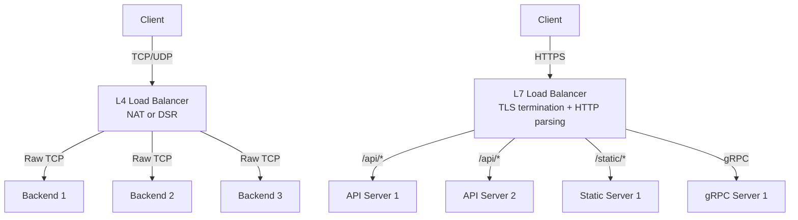
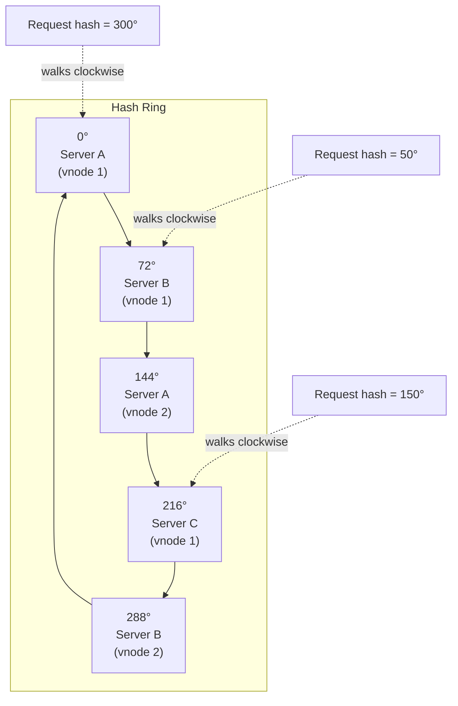

# Load Balancing — L4 vs L7, Algorithms, and Health Checks

**Date:** 2026-04-23 | **Updated:** 2026-04-23
**Tags:** `networking` `load-balancing` `l4` `l7` `algorithms` `infrastructure`

---

## Table of Contents

- [Summary](#summary)
- [Why Load Balance](#why-load-balance)
- [L4 vs L7 Load Balancing](#l4-vs-l7-load-balancing)
  - [L4 — Transport Layer](#l4--transport-layer)
  - [L7 — Application Layer](#l7--application-layer)
  - [Comparison Table](#comparison-table)
  - [Architecture Diagram](#architecture-diagram)
  - [When to Use Which](#when-to-use-which)
- [Load Balancing Algorithms](#load-balancing-algorithms)
  - [Round Robin](#round-robin)
  - [Weighted Round Robin](#weighted-round-robin)
  - [Least Connections](#least-connections)
  - [Weighted Least Connections](#weighted-least-connections)
  - [IP Hash](#ip-hash)
  - [Consistent Hashing](#consistent-hashing)
  - [Random with Two Choices (Power of Two)](#random-with-two-choices-power-of-two)
  - [Least Response Time](#least-response-time)
  - [Algorithm Selection Guide](#algorithm-selection-guide)
- [Consistent Hashing Deep Dive](#consistent-hashing-deep-dive)
  - [The Ring Concept](#the-ring-concept)
  - [Virtual Nodes](#virtual-nodes)
  - [Why It Minimizes Redistribution](#why-it-minimizes-redistribution)
  - [Ring Diagram](#ring-diagram)
- [Health Checks](#health-checks)
  - [Active Health Checks](#active-health-checks)
  - [Passive Health Checks](#passive-health-checks)
  - [Intervals and Thresholds](#intervals-and-thresholds)
  - [Graceful Degradation](#graceful-degradation)
- [Sticky Sessions](#sticky-sessions)
  - [Cookie-Based Affinity](#cookie-based-affinity)
  - [IP-Based Affinity](#ip-based-affinity)
  - [Why Sticky Sessions Fight Scaling](#why-sticky-sessions-fight-scaling)
  - [Alternatives — Externalized State](#alternatives--externalized-state)
- [SSL/TLS Termination](#ssltls-termination)
  - [Terminate at the Load Balancer](#terminate-at-the-load-balancer)
  - [End-to-End Encryption](#end-to-end-encryption)
  - [Re-encryption](#re-encryption)
  - [Performance Implications](#performance-implications)
- [Load Balancer Types](#load-balancer-types)
  - [Hardware](#hardware)
  - [Software](#software)
  - [Cloud-Native](#cloud-native)
  - [DNS-Based](#dns-based)
  - [Client-Side](#client-side)
- [Cloud Load Balancers — AWS Deep Dive](#cloud-load-balancers--aws-deep-dive)
  - [ALB vs NLB vs GLB Comparison](#alb-vs-nlb-vs-glb-comparison)
  - [Target Groups and Listener Rules](#target-groups-and-listener-rules)
  - [Cross-Zone Balancing](#cross-zone-balancing)
- [Connection Draining](#connection-draining)
  - [How Connection Draining Works](#how-connection-draining-works)
  - [Kubernetes preStop Hooks](#kubernetes-prestop-hooks)
  - [Spring Boot Graceful Shutdown](#spring-boot-graceful-shutdown)
  - [Node.js Graceful Shutdown](#nodejs-graceful-shutdown)
- [Related](#related)
- [References](#references)

---

## Summary

A load balancer distributes incoming traffic across multiple backend servers so that no single server absorbs all the work. It is the single most impactful piece of infrastructure for availability, horizontal scalability, and zero-downtime deployments. This document covers the two fundamental layers where balancing happens (L4 transport vs L7 application), the algorithms that decide *which* server gets the next request, health checking strategies that keep bad servers out of rotation, and operational concerns like sticky sessions, TLS termination, and connection draining. Examples use Nginx, HAProxy, Kubernetes, and AWS ELB — the tools a TypeScript/Node or Java/Spring backend developer encounters most often.

---

## Why Load Balance

Four problems that load balancing solves:

**1. Availability** — If one server dies, the load balancer stops sending traffic to it. Remaining servers absorb the load. No single point of failure in the application tier.

**2. Horizontal Scalability** — Adding servers increases capacity linearly. The load balancer is the abstraction that lets callers address a single endpoint while many machines serve requests behind it.

**3. Fault Tolerance** — Health checks detect degraded servers before they start returning errors to users. The balancer removes them from the pool, and re-adds them when they recover.

**4. Zero-Downtime Deploys** — Rolling deployments drain connections from old instances while new instances warm up and join the pool. From the client's perspective, the service never goes down.

---

## L4 vs L7 Load Balancing

### L4 — Transport Layer

Operates at the TCP/UDP layer. The balancer sees source IP, destination IP, source port, and destination port — nothing more. It forwards the raw TCP connection (or UDP datagrams) to a backend without inspecting the payload.

**How it works:**

1. Client opens a TCP connection to the load balancer's VIP (virtual IP).
2. The LB selects a backend server based on the configured algorithm.
3. The LB either NATs the connection (modifying destination IP) or uses DSR (Direct Server Return) so the backend replies directly to the client.
4. All packets for that connection flow to the same backend.

**Characteristics:**
- Very fast — no payload parsing, no TLS termination, no HTTP awareness.
- Low latency and high throughput — operates at near line rate.
- Cannot make routing decisions based on URL path, headers, or cookies.
- Connection-level granularity — one TCP connection = one backend for its lifetime.

### L7 — Application Layer

Operates at the HTTP/gRPC/WebSocket layer. The balancer terminates the TCP connection (and often TLS), parses the application protocol, and makes routing decisions based on content: URL path, Host header, cookies, HTTP method, gRPC service name.

**How it works:**

1. Client opens a TCP+TLS connection to the load balancer.
2. The LB terminates TLS and reads the HTTP request.
3. Based on rules (path prefix, header match, etc.), the LB selects a backend pool.
4. The LB opens a separate connection to the backend and forwards the request.
5. Responses flow back through the LB to the client.

**Characteristics:**
- Content-aware routing — `/api/*` to API servers, `/static/*` to CDN origin.
- Can inject, modify, or strip headers (e.g., `X-Forwarded-For`, `X-Request-ID`).
- Supports HTTP/2 multiplexing — can distribute individual streams to different backends.
- Can do request-level load balancing (multiple requests over one connection go to different backends).
- Higher latency than L4 due to payload parsing and double TLS termination.

### Comparison Table

| Feature | L4 (Transport) | L7 (Application) |
|---------|----------------|-------------------|
| **OSI layer** | Layer 4 (TCP/UDP) | Layer 7 (HTTP/gRPC) |
| **Routing granularity** | Per connection | Per request |
| **Content inspection** | None | Headers, URL, cookies, body |
| **TLS termination** | Pass-through or terminate | Almost always terminates |
| **Protocol support** | Any TCP/UDP protocol | HTTP, HTTPS, gRPC, WebSocket |
| **Latency** | Microseconds | Low milliseconds |
| **Throughput** | Very high (millions of CPS) | High (but lower than L4) |
| **Header manipulation** | No | Yes (add/remove/rewrite) |
| **WebSocket support** | Pass-through | Upgrade-aware routing |
| **Cost (cloud)** | Lower | Higher |
| **Use case** | TCP services, databases, high-throughput | Web APIs, microservices, content routing |

### Architecture Diagram



### When to Use Which

**Choose L4 when:**
- You need maximum throughput and minimum latency.
- The protocol is not HTTP (e.g., raw TCP, database connections, MQTT, custom binary protocol).
- You do not need content-based routing.
- TLS should be terminated at the application server (pass-through).

**Choose L7 when:**
- You need path-based, host-based, or header-based routing.
- You want the LB to handle TLS termination centrally.
- You need request-level balancing (HTTP/2, gRPC).
- You want the LB to inject tracing headers, perform rate limiting, or do A/B routing.

**Common pattern:** L4 in front of L7. An NLB (L4) handles TCP termination and distributes to a fleet of Envoy/Nginx (L7) proxies that do content routing.

---

## Load Balancing Algorithms

### Round Robin

Requests are distributed to backends in a fixed cyclic order: server 1, server 2, server 3, server 1, ...

```
Requests:  R1 → S1,  R2 → S2,  R3 → S3,  R4 → S1,  R5 → S2 ...
```

**Pros:** Simple, predictable, no state to maintain.
**Cons:** Ignores server capacity and current load. A slow backend gets the same share as a fast one.

**Best for:** Homogeneous server fleets with similar request costs.

### Weighted Round Robin

Like round robin, but servers with higher weights receive proportionally more requests.

```nginx
# Nginx weighted round robin
upstream backend {
    server 10.0.1.1 weight=5;   # gets 5x traffic
    server 10.0.1.2 weight=3;   # gets 3x traffic
    server 10.0.1.3 weight=1;   # gets 1x traffic
}
```

**Best for:** Mixed fleets (e.g., 8-core and 4-core machines, canary deploys with 1% traffic).

### Least Connections

The next request goes to the backend with the fewest active connections. Naturally adapts to backends with different processing speeds — slow servers accumulate connections and get fewer new ones.

```nginx
# Nginx least connections
upstream backend {
    least_conn;
    server 10.0.1.1;
    server 10.0.1.2;
    server 10.0.1.3;
}
```

```
# HAProxy least connections
backend app_servers
    balance leastconn
    server s1 10.0.1.1:8080 check
    server s2 10.0.1.2:8080 check
    server s3 10.0.1.3:8080 check
```

**Best for:** Long-lived connections, variable request durations, WebSocket backends.

### Weighted Least Connections

Combines least connections with weights. The backend with the lowest ratio of `(active_connections / weight)` gets the next request.

```
Server A: 10 connections, weight 5 → ratio = 2.0
Server B:  4 connections, weight 3 → ratio = 1.33  ← chosen
Server C:  2 connections, weight 1 → ratio = 2.0
```

**Best for:** Mixed fleets with variable request durations.

### IP Hash

The client's IP address is hashed to deterministically pick a backend. The same client IP always maps to the same server (as long as the server pool is stable).

```nginx
# Nginx IP hash
upstream backend {
    ip_hash;
    server 10.0.1.1;
    server 10.0.1.2;
    server 10.0.1.3;
}
```

**Pros:** Natural session affinity without cookies.
**Cons:** Clients behind a NAT/proxy share one IP — causes uneven distribution. Adding or removing a server reshuffles most mappings.

### Consistent Hashing

Maps both servers and requests onto a hash ring. Each request hashes to a point on the ring and is served by the next server clockwise. Adding or removing a server only redistributes the requests that were mapped near that server — not all of them. See the [deep dive section](#consistent-hashing-deep-dive).

```nginx
# Nginx consistent hashing (requires ngx_http_upstream_module)
upstream backend {
    hash $request_uri consistent;
    server 10.0.1.1;
    server 10.0.1.2;
    server 10.0.1.3;
}
```

**Best for:** Caching layers (maximize cache hit rate), stateful services, session affinity at scale.

### Random with Two Choices (Power of Two)

Pick two random backends, send the request to the one with fewer active connections. Provably delivers near-optimal load distribution with O(1) state.

This is the algorithm behind Envoy's default load balancer and is backed by the "power of two choices" research from Mitzenmacher (1996).

```
1. Randomly select Server A and Server B.
2. Server A has 12 connections, Server B has 7.
3. Route to Server B.
```

**Pros:** Low overhead, avoids the thundering-herd problem of pure least-connections (where multiple balancers simultaneously slam the same low-connection server).
**Cons:** Slightly less optimal than global least-connections in single-balancer setups.

**Best for:** Distributed load balancers (multiple LB instances), service mesh sidecars (Envoy).

### Least Response Time

Routes to the backend with the lowest average response time AND fewest active connections. Requires the LB to track response latency per backend.

```
# HAProxy observe response time (via agent checks or stats)
backend app_servers
    balance leastconn
    option httpchk GET /health
    server s1 10.0.1.1:8080 check observe layer7
    server s2 10.0.1.2:8080 check observe layer7
```

**Pros:** Sends traffic to genuinely fastest backends.
**Cons:** Response time can fluctuate — may cause oscillation if not smoothed. Only available at L7.

### Algorithm Selection Guide

| Scenario | Recommended Algorithm |
|----------|----------------------|
| Homogeneous fleet, uniform requests | Round robin |
| Mixed instance sizes | Weighted round robin / weighted least conn |
| Long-lived connections (WebSocket, gRPC) | Least connections |
| Caching layer (Varnish, Redis) | Consistent hashing |
| Multi-LB / service mesh | Random with two choices |
| Latency-sensitive API | Least response time |
| Sticky sessions without cookies | IP hash (or consistent hashing) |

---

## Consistent Hashing Deep Dive

### The Ring Concept

Imagine the output space of a hash function (0 to 2^32 - 1) arranged as a circle. Both servers and request keys are hashed onto this ring:

1. Hash each server's identifier (e.g., IP:port) to a position on the ring.
2. Hash the request key (e.g., session ID, URL, user ID) to a position on the ring.
3. Walk clockwise from the request's position until you hit a server. That server handles the request.

### Virtual Nodes

With only N physical servers, the ring has N points — which often leads to uneven distribution. Virtual nodes solve this: each physical server gets K virtual positions on the ring (e.g., K=150). The hash function is applied to `server-1-vn-0`, `server-1-vn-1`, ..., `server-1-vn-149`.

More virtual nodes = more uniform distribution. The trade-off is lookup table size, but even 150 virtual nodes per server is trivial in memory.

### Why It Minimizes Redistribution

In a traditional hash scheme, adding a server from N to N+1 changes the modular mapping for almost every key (`key % N` vs `key % (N+1)`). With consistent hashing:

- Adding a server only takes keys from its immediate clockwise neighbor.
- Removing a server only pushes its keys to *its* clockwise neighbor.
- On average, only `K / N` fraction of keys are remapped (where K = total keys, N = number of servers).

This property is why consistent hashing is the backbone of distributed caches (Memcached, Redis Cluster) and partitioned databases (DynamoDB, Cassandra).

### Ring Diagram



**Key insight:** If Server C is removed, only the keys between Server B (vnode 2) at 288 degrees and Server C at 216 degrees need to be redistributed — they move to Server A (vnode 1) at 0 degrees. All other mappings remain stable.

---

## Health Checks

A load balancer without health checks is a traffic distributor that happily sends requests to dead servers. Health checks are what make a load balancer intelligent.

### Active Health Checks

The load balancer proactively probes each backend at regular intervals.

**TCP check** — Can a TCP connection be established? Tests basic reachability.

```
# HAProxy TCP check
backend app_servers
    option tcp-check
    server s1 10.0.1.1:8080 check inter 5s fall 3 rise 2
```

**HTTP check** — Send a GET/HEAD to a specific endpoint and verify the status code.

```
# HAProxy HTTP check
backend app_servers
    option httpchk GET /health
    http-check expect status 200
    server s1 10.0.1.1:8080 check inter 10s fall 3 rise 2
```

```nginx
# Nginx active health checks (nginx-plus or open-source with module)
upstream backend {
    zone backend_zone 64k;
    server 10.0.1.1:8080;
    server 10.0.1.2:8080;
}

server {
    location /upstream_health {
        health_check interval=5 fails=3 passes=2 uri=/health;
        proxy_pass http://backend;
    }
}
```

**Custom script check** — Execute a script that returns exit 0 (healthy) or exit 1 (unhealthy). Useful when health means "database connection pool is not exhausted" or "disk space above 10%."

**Implementation tip for your health endpoint:**

```typescript
// Node.js / Express health endpoint
app.get('/health', async (req, res) => {
  const checks = {
    database: await checkDatabase(),
    redis: await checkRedis(),
    diskSpace: checkDiskSpace(),
  };
  const healthy = Object.values(checks).every(Boolean);
  res.status(healthy ? 200 : 503).json({ status: healthy ? 'ok' : 'degraded', checks });
});
```

```java
// Spring Boot Actuator — auto-configures /actuator/health
// application.yml
management:
  endpoint:
    health:
      show-details: always
  health:
    db:
      enabled: true
    redis:
      enabled: true
```

### Passive Health Checks

Instead of probing, the load balancer monitors real traffic for errors. If a backend returns too many 5xx responses or TCP connection failures within a window, it is marked unhealthy.

```
# HAProxy passive checks via observe
backend app_servers
    option httpchk GET /health
    server s1 10.0.1.1:8080 check observe layer7 error-limit 10 on-error mark-down
```

```nginx
# Nginx passive health (built-in)
upstream backend {
    server 10.0.1.1:8080 max_fails=3 fail_timeout=30s;
    server 10.0.1.2:8080 max_fails=3 fail_timeout=30s;
}
```

**Best practice:** Use both active and passive checks. Active checks catch servers that are up but not serving traffic (startup, maintenance mode). Passive checks detect failures without waiting for the next probe interval.

### Intervals and Thresholds

| Parameter | Description | Typical Value |
|-----------|-------------|---------------|
| **interval** | Time between active probes | 5-10s |
| **timeout** | Max wait for a probe response | 3-5s |
| **fall** (unhealthy threshold) | Consecutive failures before marking down | 2-3 |
| **rise** (healthy threshold) | Consecutive successes before marking up | 2 |
| **fail_timeout** | Window for passive failure counting | 30s |

**Tuning trade-offs:**
- Short intervals = faster detection, more probe traffic.
- Low fall threshold = faster removal, higher false-positive risk.
- High rise threshold = slower recovery, lower flap risk.

### Graceful Degradation

When backends fail health checks:

1. **Remove from pool** — Stop sending new requests.
2. **Drain existing connections** — Let in-flight requests complete.
3. **Alert** — Trigger monitoring when pool size drops below a threshold.
4. **Last-server protection** — Some LBs will keep sending to an unhealthy server if it is the last one, rather than returning 503 to all clients.

---

## Sticky Sessions

Session affinity (sticky sessions) ensures all requests from the same client go to the same backend server. This is needed when session state is stored in-memory on the application server.

### Cookie-Based Affinity

The load balancer inserts a cookie (e.g., `SERVERID=s1`) in the response. Subsequent requests include this cookie, and the LB routes accordingly.

```
# HAProxy cookie-based stickiness
backend app_servers
    cookie SERVERID insert indirect nocache
    server s1 10.0.1.1:8080 check cookie s1
    server s2 10.0.1.2:8080 check cookie s2
```

```nginx
# Nginx sticky cookie (nginx-plus)
upstream backend {
    sticky cookie srv_id expires=1h domain=.example.com path=/;
    server 10.0.1.1:8080;
    server 10.0.1.2:8080;
}
```

### IP-Based Affinity

Uses the client's IP address to determine the backend. Simple but unreliable: clients behind corporate NATs or CDNs share IPs, and mobile clients switch IPs frequently.

### Why Sticky Sessions Fight Scaling

- **Uneven distribution** — Popular sessions pile up on one server.
- **Failure impact** — When a sticky server dies, all its sessions are lost.
- **Cannot autoscale freely** — New servers get no existing sessions; old servers cannot shed load.
- **Blue-green deploys** — Old sessions are pinned to old servers, preventing clean cutover.

### Alternatives — Externalized State

**The correct solution is to externalize session state.** The application becomes stateless; any server can handle any request.

```typescript
// Node.js — Express with Redis session store
import session from 'express-session';
import RedisStore from 'connect-redis';
import { createClient } from 'redis';

const redisClient = createClient({ url: process.env.REDIS_URL });
await redisClient.connect();

app.use(session({
  store: new RedisStore({ client: redisClient }),
  secret: process.env.SESSION_SECRET,
  resave: false,
  saveUninitialized: false,
  cookie: { maxAge: 3600000 },
}));
```

```java
// Spring Boot — Redis-backed sessions
// build.gradle
implementation 'org.springframework.session:spring-session-data-redis'
implementation 'org.springframework.boot:spring-boot-starter-data-redis'

// application.yml
spring:
  session:
    store-type: redis
    redis:
      flush-mode: on_save
  redis:
    host: ${REDIS_HOST}
    port: 6379
```

With externalized sessions, you eliminate the need for sticky sessions entirely.

---

## SSL/TLS Termination

### Terminate at the Load Balancer

The LB holds the certificate and private key. It decrypts incoming TLS, inspects the plaintext HTTP, makes routing decisions, and forwards to backends over plain HTTP (or re-encrypted HTTPS).

```nginx
# Nginx TLS termination
server {
    listen 443 ssl http2;
    server_name api.example.com;

    ssl_certificate     /etc/ssl/certs/api.example.com.pem;
    ssl_certificate_key /etc/ssl/private/api.example.com.key;
    ssl_protocols       TLSv1.2 TLSv1.3;
    ssl_ciphers         ECDHE-ECDSA-AES128-GCM-SHA256:ECDHE-RSA-AES128-GCM-SHA256;

    location / {
        proxy_pass http://backend;
        proxy_set_header X-Forwarded-For   $proxy_add_x_forwarded_for;
        proxy_set_header X-Forwarded-Proto $scheme;
    }
}
```

**Pros:**
- Centralizes certificate management.
- Enables L7 features (content routing, header injection).
- Offloads CPU-intensive TLS from application servers.

**Cons:**
- Traffic between LB and backend is unencrypted (unless re-encrypted).
- LB becomes a high-value target — compromised key exposes all traffic.

### End-to-End Encryption

The LB does not terminate TLS. It operates at L4 and passes the encrypted TCP stream to the backend. The backend holds the certificate and terminates TLS.

**Pros:** True end-to-end encryption. Required for some compliance regimes (PCI DSS in certain interpretations).
**Cons:** LB cannot inspect content — no L7 routing, no header injection.

### Re-encryption

The LB terminates TLS from the client, inspects the request, then opens a new TLS connection to the backend. Two TLS handshakes per request.

```
Client ──TLS──► LB ──TLS──► Backend
```

**Pros:** Full L7 features AND encrypted backend traffic.
**Cons:** Double TLS overhead. Certificate management on both LB and backends.

### Performance Implications

| Approach | Latency Cost | CPU on LB | CPU on Backend | L7 Features |
|----------|-------------|-----------|----------------|-------------|
| TLS termination at LB | Low | High (TLS) | Low | Yes |
| TLS pass-through (L4) | Lowest | None | High (TLS) | No |
| Re-encryption | Highest | High | Medium | Yes |

**Practical choice:** Most deployments terminate TLS at the load balancer and use a private network (VPC) between LB and backends. If compliance requires encryption in transit within the VPC, use re-encryption or a service mesh with automatic mTLS.

---

## Load Balancer Types

### Hardware

**F5 BIG-IP, Citrix ADC (NetScaler):**
- Purpose-built appliances with custom ASICs for packet processing.
- Handle millions of connections per second.
- Expensive ($10k-$100k+), used in enterprise on-prem.
- Declining in new architectures; mostly legacy or very high-throughput on-prem use cases.

### Software

**HAProxy:**
- C-based, single-process event-driven. Legendary performance and stability.
- L4 and L7 balancing, advanced health checks, ACLs, stick tables.
- Configuration-file driven, reload without dropping connections (`-sf` flag).

```
# HAProxy full example
global
    maxconn 50000
    log stdout format raw local0

defaults
    mode http
    timeout connect 5s
    timeout client  30s
    timeout server  30s
    option httplog

frontend http_front
    bind *:80
    bind *:443 ssl crt /etc/ssl/certs/example.pem
    http-request redirect scheme https unless { ssl_fc }
    default_backend app_servers

backend app_servers
    balance roundrobin
    option httpchk GET /health
    http-check expect status 200
    server s1 10.0.1.1:8080 check inter 5s fall 3 rise 2
    server s2 10.0.1.2:8080 check inter 5s fall 3 rise 2
    server s3 10.0.1.3:8080 check inter 5s fall 3 rise 2
```

**Nginx:**
- Originally a web server; widely used as a reverse proxy and L7 load balancer.
- Event-driven, multi-worker process model.
- Active health checks require Nginx Plus (commercial) or third-party modules for OSS.

**Envoy:**
- Modern, C++-based proxy designed for microservices and service mesh.
- xDS API for dynamic configuration (no file reloads).
- Built-in support for HTTP/2, gRPC, circuit breaking, outlier detection, distributed tracing.
- Foundation of Istio service mesh.

**Traefik:**
- Go-based, designed for dynamic environments (Docker, Kubernetes).
- Auto-discovers services via labels/annotations.
- Built-in ACME (Let's Encrypt) for automatic TLS certificates.

### Cloud-Native

See [AWS deep dive](#cloud-load-balancers--aws-deep-dive) below.

- **AWS:** ALB (L7), NLB (L4), GLB (L3 — gateway).
- **GCP:** Cloud Load Balancing (global L7 + regional L4).
- **Azure:** Application Gateway (L7), Azure Load Balancer (L4).

### DNS-Based

DNS returns multiple A/AAAA records. Clients pick one (usually the first). No health checking at the DNS level (TTL-based removal only). Useful for global traffic distribution, not for fine-grained balancing.

Examples: AWS Route 53 weighted/latency routing, Cloudflare Load Balancer.

### Client-Side

The client itself decides which backend to call. Common in gRPC and service mesh architectures.

```
// gRPC client-side load balancing (conceptual)
// The gRPC client receives a list of endpoints from a name resolver
// and picks one using its configured LB policy (round-robin, pick-first).
const channel = new grpc.Channel('dns:///my-service.svc.cluster.local', {
  'grpc.lb_policy_name': 'round_robin',
});
```

**Pros:** No single LB bottleneck, lower latency (direct connection).
**Cons:** Every client must implement LB logic, service discovery integration required.

---

## Cloud Load Balancers — AWS Deep Dive

### ALB vs NLB vs GLB Comparison

| Feature | ALB (Application) | NLB (Network) | GLB (Gateway) |
|---------|-------------------|----------------|----------------|
| **OSI layer** | L7 | L4 | L3 (GENEVE) |
| **Protocols** | HTTP, HTTPS, gRPC, WebSocket | TCP, UDP, TLS | IP packets |
| **Routing** | Path, host, header, query string, source IP | Port-based | Appliance chaining |
| **TLS termination** | Yes | Optional (TLS listener) | No |
| **Static IP** | No (use Global Accelerator) | Yes (Elastic IP per AZ) | No |
| **Latency** | ~ms (HTTP parsing) | ~100us (connection-level) | Varies |
| **WebSocket** | Native support | Pass-through | N/A |
| **Health checks** | HTTP, HTTPS, gRPC | TCP, HTTP, HTTPS | TCP, HTTP, HTTPS |
| **Pricing model** | LCU (new connections, active connections, data, rules) | NLCU (connections, data, flow) | GLCU |
| **Primary use case** | Microservices, APIs, web apps | High-throughput TCP, gaming, IoT, gRPC | Firewall, IDS/IPS appliances |

### Target Groups and Listener Rules

An ALB listener receives traffic on a port/protocol and uses rules to route to target groups.

```
ALB Listener (443 HTTPS)
├── Rule 1: path = /api/*    → Target Group: api-servers
├── Rule 2: path = /admin/*  → Target Group: admin-servers
├── Rule 3: host = ws.example.com → Target Group: websocket-servers
└── Default                  → Target Group: web-servers
```

**Target types:**
- **Instance** — routes to EC2 instance ID + port.
- **IP** — routes to any IP (including ECS tasks, on-prem via Direct Connect).
- **Lambda** — invokes a Lambda function (ALB only).

### Cross-Zone Balancing

By default, each LB node distributes traffic only within its own Availability Zone. With cross-zone balancing enabled, each node distributes across all registered targets in all AZs.

**Without cross-zone** (2 AZs, AZ-A has 2 servers, AZ-B has 8):
- AZ-A servers each handle 25% of total traffic.
- AZ-B servers each handle 6.25% of total traffic.

**With cross-zone** (same setup):
- All 10 servers each handle 10% of total traffic.

Cross-zone is enabled by default on ALB (no extra charge), optional on NLB (with inter-AZ data charges).

---

## Connection Draining

When a server is removed from the pool (deploy, scale-in, failure), in-flight requests should not be dropped. Connection draining (deregistration delay) lets active requests complete before the server is fully removed.

### How Connection Draining Works

1. Server is marked for removal (health check failure, deploy, manual deregistration).
2. LB stops sending **new** requests to the server.
3. Existing connections continue until they complete or the draining timeout expires.
4. After timeout, remaining connections are forcibly closed.

**AWS default deregistration delay:** 300 seconds. Tune this to match your longest expected request.

### Kubernetes preStop Hooks

Kubernetes removes a pod from the Service's Endpoints before sending SIGTERM. But there is a propagation delay — the pod may receive new traffic after it starts shutting down. A `preStop` hook with a small sleep handles this race.

```yaml
# Kubernetes deployment with graceful shutdown
apiVersion: apps/v1
kind: Deployment
metadata:
  name: api-server
spec:
  template:
    spec:
      terminationGracePeriodSeconds: 60
      containers:
        - name: api
          image: api-server:latest
          ports:
            - containerPort: 8080
          lifecycle:
            preStop:
              exec:
                command: ["sh", "-c", "sleep 5"]
          readinessProbe:
            httpGet:
              path: /health
              port: 8080
            initialDelaySeconds: 5
            periodSeconds: 5
            failureThreshold: 3
```

**Why `sleep 5`?** It gives kube-proxy and ingress controllers time to update their routing tables and stop sending new traffic before the application begins shutting down.

### Spring Boot Graceful Shutdown

Spring Boot 2.3+ has built-in graceful shutdown support.

```yaml
# application.yml
server:
  shutdown: graceful

spring:
  lifecycle:
    timeout-per-shutdown-phase: 30s
```

When SIGTERM is received:
1. Spring stops accepting new requests.
2. In-flight requests are given up to `timeout-per-shutdown-phase` to complete.
3. After timeout, the application exits.

```java
// Programmatic shutdown hook for additional cleanup
@Component
public class GracefulShutdownHook {

    @PreDestroy
    public void onShutdown() {
        log.info("Draining connections, closing database pools...");
        // Close external clients, flush metrics, etc.
    }
}
```

### Node.js Graceful Shutdown

Node.js has no built-in graceful shutdown. You must handle SIGTERM manually.

```typescript
import http from 'node:http';

const server = http.createServer(app);

const gracefulShutdown = () => {
  console.log('SIGTERM received. Draining connections...');

  // Stop accepting new connections.
  // Existing keep-alive connections continue until they complete.
  server.close(() => {
    console.log('All connections drained. Exiting.');
    process.exit(0);
  });

  // Force exit after timeout if connections do not drain.
  const FORCE_SHUTDOWN_MS = 30_000;
  setTimeout(() => {
    console.error('Forced shutdown after timeout.');
    process.exit(1);
  }, FORCE_SHUTDOWN_MS).unref();
};

process.on('SIGTERM', gracefulShutdown);
process.on('SIGINT', gracefulShutdown);

server.listen(8080, () => {
  console.log('Server listening on :8080');
});
```

**Important:** `server.close()` only stops accepting **new** connections. Existing keep-alive connections stay open until the client disconnects or the idle timeout fires. For faster draining, track open connections and destroy idle ones on shutdown, or set a `Connection: close` header on responses during the draining phase.

---

## Related

- [Reverse Proxies & Gateways](reverse-proxies-and-gateways.md) — Nginx/Envoy as reverse proxies, API gateways, and their overlap with load balancers
- [CDN & Edge](cdn-and-edge.md) — Edge load balancing, anycast, and cache distribution
- [gRPC & Protobuf](../application-layer/grpc-and-protobuf.md) — Client-side and proxy-based gRPC load balancing
- [Connection Pooling](../network-programming/connection-pooling.md) — Pool sizing behind load balancers, keep-alive interaction with LB idle timeouts

---

## References

1. **HAProxy Documentation** — Configuration Manual, Chapter 4: Proxies. https://docs.haproxy.org/3.0/configuration.html
2. **Nginx Documentation** — HTTP Load Balancing. https://nginx.org/en/docs/http/load_balancing.html
3. **AWS Elastic Load Balancing Documentation** — Product comparisons, listener rules, target groups, cross-zone balancing. https://docs.aws.amazon.com/elasticloadbalancing/latest/userguide/
4. **Karger, D. et al. (1997)** — "Consistent Hashing and Random Trees." *Proceedings of the 29th ACM Symposium on Theory of Computing.* The foundational paper on consistent hashing.
5. **Mitzenmacher, M. (2001)** — "The Power of Two Choices in Randomized Load Balancing." *IEEE Transactions on Parallel and Distributed Systems.* Theoretical basis for Envoy's default algorithm.
6. **Envoy Proxy Documentation** — Load Balancing Policies, Outlier Detection, Health Checking. https://www.envoyproxy.io/docs/envoy/latest/intro/arch_overview/upstream/load_balancing/
7. **Kubernetes Documentation** — Services, Ingress, Pod Lifecycle, Graceful Shutdown. https://kubernetes.io/docs/concepts/services-networking/
8. **Spring Boot Documentation** — Graceful Shutdown. https://docs.spring.io/spring-boot/reference/web/graceful-shutdown.html
