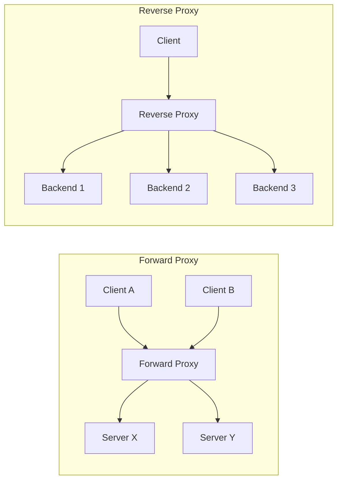
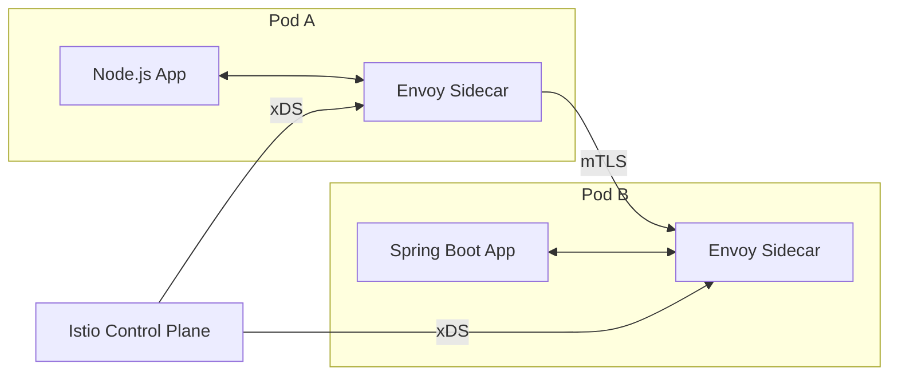
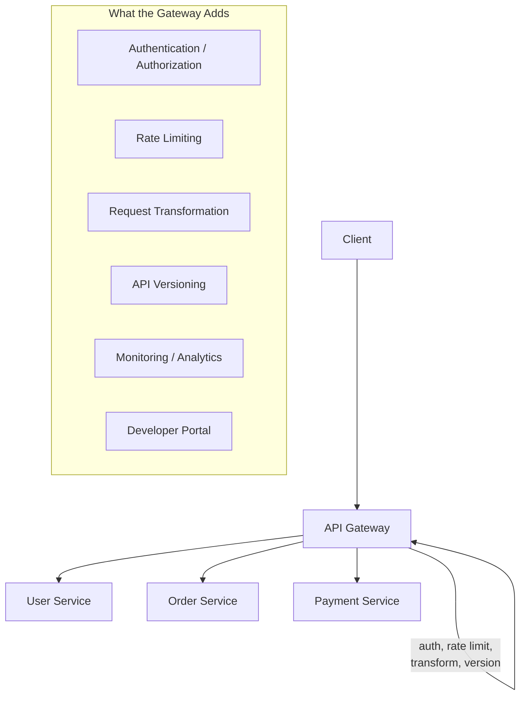

# Reverse Proxies & API Gateways — Nginx, Envoy, and Traffic Management

**Date:** 2026-04-23 | **Updated:** 2026-04-23
**Tags:** `networking` `reverse-proxy` `api-gateway` `nginx` `envoy` `infrastructure`

---

## Table of Contents

- [Summary](#summary)
- [1. Forward vs Reverse Proxy](#1-forward-vs-reverse-proxy)
- [2. Reverse Proxy Functions](#2-reverse-proxy-functions)
- [3. Nginx](#3-nginx)
- [4. Envoy](#4-envoy)
- [5. HAProxy](#5-haproxy)
- [6. Comparison Table](#6-comparison-table)
- [7. API Gateway Pattern](#7-api-gateway-pattern)
- [8. Rate Limiting](#8-rate-limiting)
- [9. Circuit Breaking](#9-circuit-breaking)
- [10. Request Routing](#10-request-routing)
- [Related](#related)
- [References](#references)

---

## Summary

A **reverse proxy** sits in front of your backend servers, accepting client connections and forwarding requests upstream. It shields your application topology, terminates TLS, balances load, caches responses, and enforces security policies — all transparent to the client.

An **API gateway** extends the reverse proxy concept with application-layer concerns: authentication, rate limiting, request transformation, API versioning, and developer portals. The line between the two has blurred — Envoy and Kong do both, while pure reverse proxies like HAProxy stay closer to the transport layer.

For a Node/Express or Spring Boot backend, your traffic path in production almost always passes through at least one reverse proxy. Understanding how Nginx config maps to traffic flow, how Envoy's filter chains work, and where rate limiting and circuit breaking fit is essential for debugging latency, preventing cascading failures, and deploying safely.

---

## 1. Forward vs Reverse Proxy

The words "proxy" and "reverse proxy" cause persistent confusion because both sit between client and server. The difference is **who they represent**.

### Forward Proxy (Client-Side)

A forward proxy acts on behalf of the **client**. The client knows it is using a proxy and explicitly routes traffic through it. The destination server sees the proxy's IP, not the client's.

**Use cases:** corporate internet filtering, anonymizing outbound traffic, caching for shared office connections.

### Reverse Proxy (Server-Side)

A reverse proxy acts on behalf of the **server**. The client does not know (or care) that a proxy exists — it talks to what it thinks is the server. The reverse proxy routes the request to one of potentially many backend instances.

**Use cases:** load balancing, TLS termination, caching, compression, WAF, API gateway.

### Mermaid Diagram



**Key distinction:**
- Forward proxy: clients configure their software to use it. The servers do not know about it.
- Reverse proxy: servers deploy it in front of themselves. The clients do not know about it.

### Common Confusion: CDN

A CDN is a geographically distributed reverse proxy. The client hits an edge node (reverse proxy) that either serves a cached response or forwards the request to the origin server.

---

## 2. Reverse Proxy Functions

A reverse proxy is not just a forwarder — it actively processes traffic in both directions.

### 2.1 Load Balancing

Distributes requests across a pool of backend servers. Algorithms (round-robin, least connections, consistent hashing) are covered in detail in [Load Balancing](load-balancing.md).

### 2.2 TLS Termination

The reverse proxy decrypts TLS, inspects the plaintext HTTP request, and forwards it to backends over plain HTTP (or re-encrypts for end-to-end TLS). This offloads CPU-intensive crypto from application servers and centralizes certificate management.

```
Client ──TLS──▶ Reverse Proxy ──HTTP──▶ Backend
                (decrypts here)

Client ──TLS──▶ Reverse Proxy ──TLS──▶ Backend     ← end-to-end (re-encryption)
```

### 2.3 Caching

Stores responses from backends and serves them directly for subsequent identical requests. Reduces backend load and latency. Cache behavior is controlled by `Cache-Control`, `Expires`, `ETag`, and `Vary` headers.

### 2.4 Compression

Applies gzip or Brotli compression to responses before sending them to the client. Backend servers return uncompressed content; the proxy compresses on the fly based on `Accept-Encoding`.

### 2.5 Request/Response Modification

- Add headers (`X-Request-ID`, `X-Forwarded-For`, `X-Forwarded-Proto`)
- Rewrite URLs (strip path prefixes before forwarding)
- Inject CORS headers
- Modify response bodies (rare, expensive)

### 2.6 Static File Serving

The proxy serves static assets (HTML, CSS, JS, images) directly from disk without involving the application server. Nginx is particularly efficient at this.

### 2.7 Security — Hiding Backend Topology

Clients never see internal IPs, port numbers, or server counts. The proxy absorbs malformed requests, slowloris attacks, and large headers before they reach your application.

| Function | Where It Happens | Benefit |
|----------|------------------|---------|
| TLS termination | Proxy | Centralized certs, offloaded crypto |
| Load balancing | Proxy | Horizontal scaling, failover |
| Caching | Proxy | Reduced backend load |
| Compression | Proxy | Lower bandwidth, faster transfer |
| Header injection | Proxy | Traceability, security |
| Static serving | Proxy | Bypass application entirely |
| Topology hiding | Proxy | Attack surface reduction |

---

## 3. Nginx

### 3.1 Architecture

Nginx uses a **master/worker** process model driven by an **event loop** (epoll on Linux, kqueue on macOS).

```
                    ┌─────────────────┐
                    │  Master Process  │
                    │  (reads config,  │
                    │   manages workers)│
                    └────────┬────────┘
              ┌──────────────┼──────────────┐
              ▼              ▼              ▼
        ┌──────────┐  ┌──────────┐  ┌──────────┐
        │ Worker 1  │  │ Worker 2  │  │ Worker 3  │
        │ (event    │  │ (event    │  │ (event    │
        │  loop)    │  │  loop)    │  │  loop)    │
        └──────────┘  └──────────┘  └──────────┘
```

**Master process:** reads and validates config, binds ports, spawns and monitors workers. Does not handle traffic.

**Worker processes:** each runs a single-threaded event loop handling thousands of concurrent connections. No thread-per-connection overhead. Connections are accepted across workers using kernel socket sharing (`SO_REUSEPORT`).

This is analogous to Node.js's event loop — a single thread multiplexes I/O across many connections using non-blocking operations.

### 3.2 Config Structure

Nginx configuration is a hierarchy of **contexts** (blocks):

```nginx
# Main context — global settings
worker_processes auto;          # one per CPU core
worker_rlimit_nofile 65535;

events {
    worker_connections 4096;    # max connections per worker
    multi_accept on;
    use epoll;                  # Linux event model
}

http {
    # HTTP context — applies to all virtual servers

    server {
        # Server context — one virtual host
        listen 443 ssl http2;
        server_name api.example.com;

        ssl_certificate     /etc/ssl/certs/api.pem;
        ssl_certificate_key /etc/ssl/private/api.key;

        location / {
            # Location context — URL path matching
            proxy_pass http://backend_pool;
        }

        location /static/ {
            root /var/www;
            expires 30d;
        }
    }
}
```

**Directive inheritance:** directives set in an outer block are inherited by inner blocks unless overridden.

### 3.3 Upstream Block and Load Balancing

```nginx
upstream backend_pool {
    least_conn;                        # algorithm: least connections

    server 10.0.1.10:3000 weight=3;   # weighted: gets 3x traffic
    server 10.0.1.11:3000;
    server 10.0.1.12:3000 backup;     # only used if others are down

    keepalive 32;                      # persistent connections to backend
}
```

### 3.4 proxy_pass and Common Directives

```nginx
location /api/ {
    proxy_pass http://backend_pool;    # forwards to upstream group

    # Pass client info to backend
    proxy_set_header Host $host;
    proxy_set_header X-Real-IP $remote_addr;
    proxy_set_header X-Forwarded-For $proxy_add_x_forwarded_for;
    proxy_set_header X-Forwarded-Proto $scheme;

    # Timeouts
    proxy_connect_timeout 5s;          # time to establish connection to backend
    proxy_read_timeout 30s;            # time waiting for backend response
    proxy_send_timeout 10s;            # time sending request to backend

    # Buffering
    proxy_buffering on;                # buffer backend response before sending to client
    proxy_buffer_size 4k;
    proxy_buffers 8 8k;

    # Retry
    proxy_next_upstream error timeout http_502 http_503;
    proxy_next_upstream_tries 2;
}
```

**Trailing slash matters:** `proxy_pass http://backend/` (with trailing slash) strips the matched `location` prefix. `proxy_pass http://backend` (without) preserves it.

### 3.5 Performance Tuning

| Directive | Default | Recommended | Why |
|-----------|---------|-------------|-----|
| `worker_processes` | 1 | `auto` (= CPU cores) | Utilize all cores |
| `worker_connections` | 512 | 2048-8192 | More concurrent connections per worker |
| `keepalive_timeout` | 75s | 65s | Keep connections open but don't waste resources |
| `keepalive` (upstream) | 0 | 32-64 | Reuse connections to backends, avoid TCP handshakes |
| `sendfile` | off | on | Kernel-space file transfer, bypasses userspace copy |
| `tcp_nopush` | off | on | Send headers and file in one packet (with sendfile) |
| `tcp_nodelay` | on | on | Disable Nagle's for keep-alive connections |
| `gzip` | off | on | Compress text responses (html, json, js, css) |

### 3.6 Full Reverse Proxy Example

```nginx
http {
    # Gzip compression
    gzip on;
    gzip_types text/plain application/json application/javascript text/css;
    gzip_min_length 256;

    # Rate limiting zone
    limit_req_zone $binary_remote_addr zone=api_limit:10m rate=10r/s;

    upstream node_app {
        least_conn;
        server 127.0.0.1:3000;
        server 127.0.0.1:3001;
        keepalive 32;
    }

    server {
        listen 443 ssl http2;
        server_name api.example.com;

        ssl_certificate     /etc/ssl/certs/fullchain.pem;
        ssl_certificate_key /etc/ssl/private/privkey.pem;
        ssl_protocols TLSv1.2 TLSv1.3;
        ssl_ciphers HIGH:!aNULL:!MD5;

        # Security headers
        add_header Strict-Transport-Security "max-age=31536000; includeSubDomains" always;
        add_header X-Content-Type-Options "nosniff" always;
        add_header X-Frame-Options "DENY" always;

        # API with rate limiting
        location /api/ {
            limit_req zone=api_limit burst=20 nodelay;

            proxy_pass http://node_app;
            proxy_set_header Host $host;
            proxy_set_header X-Real-IP $remote_addr;
            proxy_set_header X-Forwarded-For $proxy_add_x_forwarded_for;
            proxy_set_header X-Forwarded-Proto $scheme;
        }

        # WebSocket upgrade
        location /ws/ {
            proxy_pass http://node_app;
            proxy_http_version 1.1;
            proxy_set_header Upgrade $http_upgrade;
            proxy_set_header Connection "upgrade";
        }

        # Static assets
        location /static/ {
            root /var/www;
            expires 30d;
            add_header Cache-Control "public, immutable";
        }
    }
}
```

---

## 4. Envoy

### 4.1 Architecture

Envoy is a modern, high-performance proxy designed for cloud-native architectures. Where Nginx grew from a web server into a proxy, Envoy was built from the ground up as a service proxy.

**Core concepts:**

```
                 ┌─────────────────────────────────────┐
                 │             Envoy Proxy              │
                 │                                      │
  Downstream     │  ┌──────────┐    ┌──────────────┐   │   Upstream
  (client) ──────┼─▶│ Listener │───▶│ Filter Chain │───┼──▶ (backend)
                 │  └──────────┘    └──────────────┘   │
                 │                                      │
                 │  ┌──────────┐    ┌──────────────┐   │
            ────┼─▶│ Listener │───▶│ Filter Chain │───┼──▶
                 │  └──────────┘    └──────────────┘   │
                 │                                      │
                 │  Clusters: [backend-a, backend-b]    │
                 └─────────────────────────────────────┘
```

| Concept | Description |
|---------|-------------|
| **Listener** | Binds a port and accepts downstream connections |
| **Filter chain** | Ordered pipeline of network/HTTP filters that process each request |
| **Route** | Maps incoming requests to clusters based on path, headers, etc. |
| **Cluster** | Group of upstream hosts (equivalent to Nginx upstream block) |
| **Endpoint** | Individual backend host:port within a cluster |

### 4.2 Envoy YAML Configuration

```yaml
static_resources:
  listeners:
    - name: http_listener
      address:
        socket_address:
          address: 0.0.0.0
          port_value: 8080
      filter_chains:
        - filters:
            - name: envoy.filters.network.http_connection_manager
              typed_config:
                "@type": type.googleapis.com/envoy.extensions.filters.network.http_connection_manager.v3.HttpConnectionManager
                stat_prefix: ingress_http
                codec_type: AUTO
                route_config:
                  name: local_route
                  virtual_hosts:
                    - name: backend
                      domains: ["*"]
                      routes:
                        - match:
                            prefix: "/api/"
                          route:
                            cluster: node_backend
                        - match:
                            prefix: "/grpc/"
                          route:
                            cluster: grpc_backend
                http_filters:
                  - name: envoy.filters.http.router
                    typed_config:
                      "@type": type.googleapis.com/envoy.extensions.filters.http.router.v3.Router

  clusters:
    - name: node_backend
      connect_timeout: 5s
      type: STRICT_DNS
      lb_policy: LEAST_REQUEST
      load_assignment:
        cluster_name: node_backend
        endpoints:
          - lb_endpoints:
              - endpoint:
                  address:
                    socket_address:
                      address: node-app
                      port_value: 3000
              - endpoint:
                  address:
                    socket_address:
                      address: node-app-2
                      port_value: 3000

    - name: grpc_backend
      connect_timeout: 5s
      type: STRICT_DNS
      lb_policy: ROUND_ROBIN
      typed_extension_protocol_options:
        envoy.extensions.upstreams.http.v3.HttpProtocolOptions:
          "@type": type.googleapis.com/envoy.extensions.upstreams.http.v3.HttpProtocolOptions
          explicit_http_config:
            http2_protocol_options: {}
      load_assignment:
        cluster_name: grpc_backend
        endpoints:
          - lb_endpoints:
              - endpoint:
                  address:
                    socket_address:
                      address: grpc-service
                      port_value: 50051
```

### 4.3 xDS Dynamic Configuration

Envoy's killer feature is **xDS** — a set of discovery service APIs that let a control plane push configuration updates without restarting the proxy.

| xDS API | Discovery Target |
|---------|-----------------|
| **LDS** (Listener) | Listener configurations |
| **RDS** (Route) | Route tables and virtual hosts |
| **CDS** (Cluster) | Cluster definitions (upstream groups) |
| **EDS** (Endpoint) | Individual endpoints within clusters |
| **SDS** (Secret) | TLS certificates and keys |

This is what makes Envoy the data plane of choice for service meshes like Istio. The Istio control plane (istiod) pushes xDS updates to all Envoy sidecar proxies without restarts.

### 4.4 Key Strengths

- **HTTP/2 native:** first-class HTTP/2 and gRPC support (both downstream and upstream)
- **Observability built-in:** emits detailed stats (counters, gauges, histograms), integrates with Prometheus, supports distributed tracing (Zipkin, Jaeger, OpenTelemetry)
- **Hot restart:** new process starts, old process drains — zero-downtime config reload
- **Filter extensibility:** Lua filters, WebAssembly (Wasm) filters for custom logic without recompiling
- **Sidecar pattern:** designed to run as a per-service sidecar, not just an edge proxy

### 4.5 Envoy as Sidecar



In the sidecar model, every service instance has its own Envoy proxy. All inbound and outbound traffic passes through the sidecar. This enables:
- Automatic mTLS between services
- Fine-grained traffic routing
- Retry/timeout policies applied consistently
- Distributed tracing injection without application code changes

---

## 5. HAProxy

### 5.1 Architecture

HAProxy is a purpose-built TCP/HTTP load balancer and proxy. It is optimized for raw throughput and connection handling — benchmarks consistently show it handling millions of concurrent connections.

### 5.2 Frontend / Backend Model

HAProxy's configuration splits into **frontends** (what listens) and **backends** (what serves):

```
frontend http_in
    bind *:80
    bind *:443 ssl crt /etc/ssl/certs/combined.pem

    # ACL-based routing
    acl is_api path_beg /api
    acl is_grpc req.hdr(content-type) -m sub application/grpc

    use_backend api_servers if is_api
    use_backend grpc_servers if is_grpc
    default_backend web_servers

backend api_servers
    balance leastconn
    option httpchk GET /health
    http-check expect status 200

    server node1 10.0.1.10:3000 check inter 5s fall 3 rise 2
    server node2 10.0.1.11:3000 check inter 5s fall 3 rise 2

backend web_servers
    balance roundrobin
    server web1 10.0.1.20:8080 check
    server web2 10.0.1.21:8080 check

backend grpc_servers
    balance roundrobin
    option httpchk
    server grpc1 10.0.1.30:50051 check proto h2
```

### 5.3 TCP vs HTTP Mode

| Mode | Directive | What HAProxy Sees |
|------|-----------|-------------------|
| **TCP (Layer 4)** | `mode tcp` | Raw bytes. Routes by IP, port, SNI. Cannot inspect HTTP. |
| **HTTP (Layer 7)** | `mode http` | Parsed HTTP. Can route by path, headers, cookies. |

TCP mode is used for non-HTTP protocols, database connections, or when you need raw pass-through (e.g., TLS passthrough to let the backend terminate TLS).

### 5.4 Stick Tables

HAProxy stick tables track per-client state in memory — connection counts, request rates, bytes transferred — enabling inline rate limiting and abuse detection without external services.

```
frontend http_in
    bind *:80

    # Track request rate per source IP
    stick-table type ip size 100k expire 30s store http_req_rate(10s)
    http-request track-sc0 src

    # Deny if more than 100 requests in 10 seconds
    http-request deny deny_status 429 if { sc_http_req_rate(0) gt 100 }
```

### 5.5 Connection Queuing

When all backend servers are at max connections, HAProxy queues incoming requests instead of rejecting them. This provides backpressure:

```
backend api_servers
    balance leastconn
    timeout queue 30s              # max time a request waits in queue
    server node1 10.0.1.10:3000 maxconn 100 check
    server node2 10.0.1.11:3000 maxconn 100 check
```

---

## 6. Comparison Table

| Feature | **Nginx** | **Envoy** | **HAProxy** | **Traefik** | **Caddy** |
|---------|-----------|-----------|-------------|-------------|-----------|
| **Primary role** | Web server + reverse proxy | Service proxy + L7 LB | TCP/HTTP load balancer | Cloud-native edge proxy | Web server + auto-HTTPS |
| **Config format** | Custom DSL (nginx.conf) | YAML/JSON + xDS API | Custom DSL (haproxy.cfg) | YAML/TOML + auto-discovery | Caddyfile or JSON |
| **Dynamic config** | Reload (SIGHUP) | xDS hot-reload, no restart | Reload (SIGUSR2) | Auto-discovery (Docker, K8s) | API + auto-reload |
| **HTTP/2 upstream** | Limited (paid Plus) | Native | Yes (v2.4+) | Yes | Yes |
| **gRPC support** | Basic (v1.13+) | Native, first-class | Yes (v2.0+) | Yes | Yes |
| **Service mesh** | Not designed for | Istio, OSM data plane | Not designed for | Maesh | Not designed for |
| **Auto TLS** | No (use certbot) | No (use SDS) | No | Let's Encrypt built-in | Let's Encrypt built-in |
| **Observability** | Access logs, basic stats | Prometheus stats, tracing, tap | Stats socket, Prometheus exporter | Prometheus, tracing | Prometheus, structured logs |
| **Wasm extensibility** | No | Yes (proxy-wasm) | No | Plugins (Go) | Plugins (Go) |
| **Typical use** | Edge proxy, static serving | Service mesh sidecar, K8s ingress | High-throughput TCP/HTTP LB | Docker/K8s auto-discovery proxy | Small deployments, auto-HTTPS |
| **Performance** | Excellent | Excellent | Best raw throughput | Good | Good |
| **Learning curve** | Moderate | Steep | Moderate | Low | Low |

### When to Pick What

- **Nginx:** You need a battle-tested web server that also reverse proxies. Huge ecosystem, well-known config syntax, most hosting examples assume Nginx.
- **Envoy:** You are in Kubernetes, need dynamic configuration, gRPC-heavy, or building toward a service mesh. Observability out of the box.
- **HAProxy:** You need maximum TCP/HTTP throughput with sophisticated health checking and connection management. Strong in database load balancing.
- **Traefik:** You want zero-config service discovery from Docker labels or Kubernetes ingress. Auto-TLS.
- **Caddy:** Small deployment, you want automatic HTTPS with zero config, and simplicity is paramount.

---

## 7. API Gateway Pattern

### 7.1 Reverse Proxy vs API Gateway

A reverse proxy handles **transport-level concerns** (routing, TLS, load balancing). An API gateway adds **application-level concerns** on top.



| Concern | Reverse Proxy | API Gateway |
|---------|---------------|-------------|
| TLS termination | Yes | Yes |
| Load balancing | Yes | Yes |
| Path-based routing | Yes | Yes |
| Authentication | No (or basic) | Yes (JWT, OAuth, API keys) |
| Rate limiting | Basic (Nginx limit_req) | Per-consumer, per-route |
| Request transformation | Header add/remove | Body transformation, schema mapping |
| API versioning | URL rewrite | Version negotiation, deprecation |
| Developer portal | No | API catalog, docs, key management |
| Analytics | Access logs | Per-API, per-consumer dashboards |

### 7.2 API Gateway Implementations

**Kong** (open-source, Nginx + Lua under the hood):
- Plugin architecture: auth, rate limiting, logging, transformations
- Declarative or database-backed config
- Runs as standalone or Kubernetes Ingress Controller

**AWS API Gateway:**
- Fully managed, pay-per-request
- REST, HTTP, and WebSocket APIs
- Lambda integration (serverless pattern)
- Usage plans, API keys, throttling

**Spring Cloud Gateway** (Java/Spring ecosystem):
- Built on Spring WebFlux (reactive, non-blocking)
- Java predicates and filters — full power of the JVM for routing logic
- Integrates with Spring Security, Resilience4j, service discovery

```java
@Bean
public RouteLocator customRoutes(RouteLocatorBuilder builder) {
    return builder.routes()
        .route("user-service", r -> r
            .path("/api/users/**")
            .filters(f -> f
                .stripPrefix(1)                         // /api/users/123 → /users/123
                .addRequestHeader("X-Gateway", "true")
                .circuitBreaker(c -> c
                    .setName("userCB")
                    .setFallbackUri("forward:/fallback/users")))
            .uri("lb://user-service"))                  // service discovery
        .route("order-service", r -> r
            .path("/api/orders/**")
            .filters(f -> f.stripPrefix(1))
            .uri("lb://order-service"))
        .build();
}
```

**Express.js as a gateway** (Node.js, lightweight):

```typescript
import express from 'express';
import { createProxyMiddleware } from 'http-proxy-middleware';

const app = express();

// Auth middleware applied to all routes
app.use(authMiddleware);

// Route to microservices
app.use('/api/users', createProxyMiddleware({
  target: 'http://user-service:3001',
  pathRewrite: { '^/api/users': '/users' },
  changeOrigin: true,
}));

app.use('/api/orders', createProxyMiddleware({
  target: 'http://order-service:3002',
  pathRewrite: { '^/api/orders': '/orders' },
  changeOrigin: true,
}));
```

For production Node.js API gateways, consider dedicated tools (Kong, Envoy) rather than rolling your own — the middleware approach works for small deployments but lacks health checking, circuit breaking, and observability.

---

## 8. Rate Limiting

Rate limiting protects backends from overload and ensures fair usage across consumers.

### 8.1 Algorithms

| Algorithm | How It Works | Characteristics |
|-----------|-------------|-----------------|
| **Fixed Window** | Count requests in fixed time windows (e.g., 100/minute). Reset at window boundary. | Simple. Vulnerable to bursts at window edges (200 requests if burst spans boundary). |
| **Sliding Window Log** | Store timestamp of each request. Count requests in the trailing window. | Accurate. Memory-intensive (stores all timestamps). |
| **Sliding Window Counter** | Weighted combination of current and previous window counts. | Good accuracy, low memory. Used by Cloudflare. |
| **Token Bucket** | Bucket holds tokens (max = burst size). Tokens added at fixed rate. Each request consumes a token. Empty bucket = rejected. | Allows controlled bursts. Most common algorithm. |
| **Leaky Bucket** | Requests enter a queue (bucket). Processed at a fixed rate. Full bucket = rejected. | Smooths traffic to constant rate. No bursts. |

### 8.2 Token Bucket — Detailed

```
Bucket capacity: 10 tokens (burst size)
Refill rate: 2 tokens/second

Time 0s:   bucket = 10    ← full
Time 0s:   8 requests     → bucket = 2     ← burst allowed
Time 1s:   +2 tokens      → bucket = 4
Time 1s:   3 requests     → bucket = 1
Time 2s:   +2 tokens      → bucket = 3
Time 2s:   5 requests     → 3 succeed, 2 rejected (429 Too Many Requests)
```

### 8.3 Nginx Rate Limiting

```nginx
# Define rate limit zone (shared memory across workers)
limit_req_zone $binary_remote_addr zone=api:10m rate=10r/s;
# $binary_remote_addr = client IP (16 bytes per entry)
# zone=api:10m = 10MB shared memory ≈ 160,000 IPs
# rate=10r/s = 10 requests per second baseline

location /api/ {
    # burst=20: allow 20 excess requests to queue
    # nodelay: process burst immediately (don't delay them)
    limit_req zone=api burst=20 nodelay;

    # Custom 429 response
    limit_req_status 429;

    proxy_pass http://backend;
}
```

**`burst` without `nodelay`:** excess requests are delayed (smoothed) to match the rate — acts like a leaky bucket.
**`burst` with `nodelay`:** excess requests are processed immediately up to the burst limit — acts like a token bucket.

### 8.4 Envoy Rate Limit Filter

Envoy supports local (per-instance) and global (external rate limit service) rate limiting:

```yaml
http_filters:
  - name: envoy.filters.http.local_ratelimit
    typed_config:
      "@type": type.googleapis.com/envoy.extensions.filters.http.local_ratelimit.v3.LocalRateLimit
      stat_prefix: http_local_rate_limiter
      token_bucket:
        max_tokens: 100
        tokens_per_fill: 10
        fill_interval: 1s
      filter_enabled:
        runtime_key: local_rate_limit_enabled
        default_value:
          numerator: 100
          denominator: HUNDRED
      filter_enforced:
        runtime_key: local_rate_limit_enforced
        default_value:
          numerator: 100
          denominator: HUNDRED
      response_headers_to_add:
        - append_action: OVERWRITE_IF_EXISTS_OR_ADD
          header:
            key: x-local-rate-limit
            value: "true"
```

### 8.5 Distributed Rate Limiting

Per-instance rate limiting fails when you have multiple proxy instances — each sees only its own fraction of traffic. Solutions:

- **External rate limit service:** Envoy's global rate limit service (backed by Redis). All instances check a shared counter.
- **Redis + Lua:** Atomic token bucket or sliding window in Redis. Low latency.
- **Sticky sessions:** Route the same client to the same proxy instance (reduces accuracy but avoids shared state).

```
                    ┌───────────┐
  Request ──▶ LB ──▶│ Envoy #1  │──▶ Rate Limit Service (Redis)
                    │ Envoy #2  │──▶ Rate Limit Service (Redis)
                    │ Envoy #3  │──▶ Rate Limit Service (Redis)
                    └───────────┘
```

---

## 9. Circuit Breaking

Circuit breaking prevents a failing upstream from dragging down the entire system. When a service is slow or erroring, the circuit breaker trips and immediately rejects requests to that service instead of queueing them and consuming resources.

### 9.1 Circuit Breaker States

```
         ┌──────────┐    failures > threshold    ┌──────┐
         │  CLOSED   │─────────────────────────▶ │  OPEN │
         │ (normal)  │                           │(reject)│
         └──────────┘                           └───┬───┘
              ▲                                     │
              │     success                    timeout
              │                                     │
         ┌──────────┐                              ▼
         │HALF-OPEN │◀─────────────────────────────┘
         │ (probe)  │
         └──────────┘
              │ failure → back to OPEN
```

**Closed:** requests flow normally. Failures are counted.
**Open:** requests are immediately rejected (fast fail). After a timeout, transitions to half-open.
**Half-Open:** a limited number of probe requests are allowed through. If they succeed, close the circuit. If they fail, reopen.

### 9.2 Envoy Circuit Breaker Configuration

Envoy circuit breakers operate on resource limits rather than failure counts:

```yaml
clusters:
  - name: backend_service
    connect_timeout: 5s
    type: STRICT_DNS
    lb_policy: ROUND_ROBIN
    circuit_breakers:
      thresholds:
        - priority: DEFAULT
          max_connections: 100          # max TCP connections to cluster
          max_pending_requests: 50      # max requests waiting for a connection
          max_requests: 200             # max active requests
          max_retries: 3                # max concurrent retries
          retry_budget:
            budget_percent:
              value: 20.0              # max 20% of active requests can be retries
            min_retry_concurrency: 3
    load_assignment:
      cluster_name: backend_service
      endpoints:
        - lb_endpoints:
            - endpoint:
                address:
                  socket_address:
                    address: backend
                    port_value: 3000
```

**Why resource-based?** Traditional circuit breakers count error rates. Envoy instead limits resource consumption — if a backend is slow, `max_pending_requests` will trip before it consumes all proxy resources. This prevents **cascading failures** where one slow service absorbs all connection pool resources.

### 9.3 Retry Budgets

Retries can amplify failure — if every instance retries, the failed backend gets N times more traffic. Envoy's `retry_budget` limits total retry traffic to a percentage of active requests, preventing retry storms.

### 9.4 Cascading Failure Example

Without circuit breaking:

```
Service A → Service B (slow) → Service C
    ↓
A's thread pool fills up waiting for B
    ↓
A stops responding to its own callers
    ↓
Everything upstream of A also fails
```

With circuit breaking:

```
Service A → Service B (slow)
    ↓
Circuit breaker trips after max_pending_requests hit
    ↓
A returns 503 immediately (fast fail)
    ↓
A stays healthy, callers get a clear error
```

---

## 10. Request Routing

### 10.1 Path-Based Routing

The most common pattern — route by URL path prefix:

```nginx
# Nginx
location /api/users/   { proxy_pass http://user-service; }
location /api/orders/  { proxy_pass http://order-service; }
location /api/payments/ { proxy_pass http://payment-service; }
```

```yaml
# Envoy
routes:
  - match: { prefix: "/api/users/" }
    route: { cluster: user-service }
  - match: { prefix: "/api/orders/" }
    route: { cluster: order-service }
```

### 10.2 Header-Based Routing

Route based on request headers — useful for internal routing, A/B testing, or tenant isolation:

```nginx
# Nginx — route by custom header
map $http_x_tenant_id $backend {
    "tenant-a"  tenant_a_backend;
    "tenant-b"  tenant_b_backend;
    default     default_backend;
}

location /api/ {
    proxy_pass http://$backend;
}
```

```yaml
# Envoy — route by header
routes:
  - match:
      prefix: "/api/"
      headers:
        - name: x-api-version
          exact_match: "v2"
    route:
      cluster: api-v2
  - match:
      prefix: "/api/"
    route:
      cluster: api-v1    # default: v1
```

### 10.3 Weighted Routing (Canary Deploys)

Shift a percentage of traffic to a new version:

```yaml
# Envoy weighted routing
routes:
  - match:
      prefix: "/api/"
    route:
      weighted_clusters:
        clusters:
          - name: api-v1
            weight: 90        # 90% to stable
          - name: api-v2
            weight: 10        # 10% to canary
```

```nginx
# Nginx split_clients (deterministic by variable)
split_clients $request_id $backend_version {
    90% stable_backend;
    10% canary_backend;
}

location /api/ {
    proxy_pass http://$backend_version;
}
```

### 10.4 A/B Testing

Combine header-based and weighted routing — route specific user segments to different backends:

```yaml
# Envoy: route beta users to new version, everyone else to stable
routes:
  - match:
      prefix: "/api/"
      headers:
        - name: x-user-group
          exact_match: "beta"
    route:
      cluster: api-experimental
  - match:
      prefix: "/api/"
    route:
      cluster: api-stable
```

### 10.5 Query Parameter Routing

```yaml
# Envoy: route by query parameter
routes:
  - match:
      prefix: "/search"
      query_parameters:
        - name: engine
          string_match:
            exact: "v2"
    route:
      cluster: search-v2
  - match:
      prefix: "/search"
    route:
      cluster: search-v1
```

### 10.6 Routing Strategy Summary

| Strategy | Use Case | Complexity |
|----------|----------|------------|
| Path-based | Microservice routing | Low |
| Header-based | API versioning, tenant isolation | Medium |
| Weighted | Canary deploys, gradual rollouts | Medium |
| Cookie-based | Sticky A/B tests | Medium |
| Query-param | Feature flags, search engine switching | Low |
| Composite | Production canary + tenant isolation | High |

---

## Related

- [Load Balancing — L4 vs L7, Algorithms, and Health Checks](load-balancing.md)
- [CDN & Edge Networking — Caching at the Edge](cdn-and-edge.md)
- [Firewalls & Network Security — Defense in Depth](firewalls-and-security.md)
- [HTTP/1.1 → HTTP/2 → HTTP/3 — The Evolution of Web Transport](../application-layer/http-evolution.md)
- [TLS/SSL Handshake & Certificates — Encryption in Transit](../application-layer/tls-and-certificates.md)
- [gRPC & Protocol Buffers — High-Performance RPC](../application-layer/grpc-and-protobuf.md)

---

## References

1. **Nginx Documentation — Reverse Proxy:** https://nginx.org/en/docs/http/ngx_http_proxy_module.html — Authoritative reference for proxy_pass, upstream, and all proxy directives.
2. **Envoy Proxy Documentation — Architecture Overview:** https://www.envoyproxy.io/docs/envoy/latest/intro/arch_overview — Listener, cluster, filter chain architecture and xDS APIs.
3. **HAProxy Documentation — Configuration Manual:** https://docs.haproxy.org/2.9/configuration.html — Complete reference for frontend/backend, ACLs, stick tables, and health checking.
4. **Envoy Circuit Breaking Documentation:** https://www.envoyproxy.io/docs/envoy/latest/intro/arch_overview/upstream/circuit_breaking — Resource-based circuit breaking, retry budgets, and overflow behavior.
5. **Nginx Rate Limiting Guide:** https://www.nginx.com/blog/rate-limiting-nginx/ — Practical guide to limit_req_zone, burst, nodelay, and two-stage rate limiting.
6. **Kong Gateway Documentation:** https://docs.konghq.com/ — Plugin architecture, declarative config, and Kubernetes ingress controller.
7. **Spring Cloud Gateway Reference:** https://docs.spring.io/spring-cloud-gateway/reference/html/ — Route predicates, filters, circuit breaker integration, and reactive programming model.
8. **"Release It!" by Michael Nygard (Pragmatic Bookshelf):** Chapter on Stability Patterns — circuit breakers, bulkheads, and timeouts. The foundational text on preventing cascading failures.
